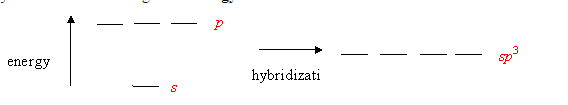
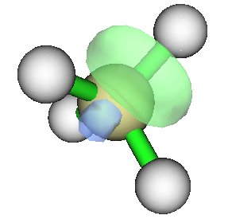

**用NBO计算原子轨道杂化后的能量变化**

Use NBO to calculate energy change after hybridization of atomic orbitals

文/Sobereva @[北京科音](http://www.keinsci.com/)   2017-Apr-13

  
今天在思想家公社1群里有人问这种图里面的能量怎么得到  
  

  
可以通过做价键计算来得到，但是比较麻烦。一种简单粗略的得到方法是用NBO。  
  
用过NBO的人都知道，NBO分析可以直接给出NAO和NBO的能量。比如计算甲烷，有这样的输出  
  
   NAO  Atom  No  lang   Type(AO)    Occupancy      Energy  
 ----------------------------------------------------------  
     1    C    1  S      Cor( 1S)     1.99963     -11.07292  
     2    C    1  S      Val( 2S)     1.16479      -0.30941  
     3    C    1  S      Ryd( 3S)     0.00000       1.31567  
     4    C    1  S      Ryd( 4S)     0.00000       4.60142  
     5    C    1  px     Val( 2p)     1.23058      -0.06639  
     6    C    1  px     Ryd( 3p)     0.00000       0.76994  
     7    C    1  py     Val( 2p)     1.23058      -0.06639  
     8    C    1  py     Ryd( 3p)     0.00000       0.76994  
     9    C    1  pz     Val( 2p)     1.23058      -0.06639  
    10    C    1  pz     Ryd( 3p)     0.00000       0.76994  
...略  
  
BD型NBO是由成键的两个原子通过其NHO组合而成的，NHO就是原子用于成键时所用的杂化轨道，其能量正是绘制上图中杂化轨道位置所需的值。NHO的能量在NBO程序里没有直接输出，但可以用FNHO关键词来输出NHO构成的Fock矩阵，对角元便是各个NHO的能量。Gaussian自带的NBO 3.1支持这个关键词，使用pop=nboread，末尾空一行写$NBO FNHO $END即可。  
  
对甲烷，得到的FNHO矩阵为  
          NHO        1       2       3       4       5       6       7       8  
      ---------- ------- ------- ------- ------- ------- ------- ------- -------  
   1.  C 1( H 2) -0.1212 -0.6891 -0.0628 -0.0683 -0.0628 -0.0683 -0.0628 -0.0683  
   2.  H 2( C 1) -0.6891  0.1754 -0.0683 -0.0684 -0.0683 -0.0684 -0.0683 -0.0684  
   3.  C 1( H 3) -0.0628 -0.0683 -0.1212 -0.6891 -0.0628 -0.0683 -0.0628 -0.0683  
   4.  H 3( C 1) -0.0683 -0.0684 -0.6891  0.1754 -0.0683 -0.0684 -0.0683 -0.0684  
   5.  C 1( H 4) -0.0628 -0.0683 -0.0628 -0.0683 -0.1212 -0.6891 -0.0628 -0.0683  
   6.  H 4( C 1) -0.0683 -0.0684 -0.0683 -0.0684 -0.6891  0.1754 -0.0683 -0.0684  
   7.  C 1( H 5) -0.0628 -0.0683 -0.0628 -0.0683 -0.0628 -0.0683 -0.1212 -0.6891  
   8.  H 5( C 1) -0.0683 -0.0684 -0.0683 -0.0684 -0.0683 -0.0684 -0.6891  0.1754  
...略  
第一个对角元，即是C1和H2成键时C的杂化轨道的能量，即-0.1212 a.u.。非对角元则体现NHO之间的耦合，也可以用E2的方式基于NHO能量和这些非对角元来估算NHO间的二阶稳定化能。  
  
在NBO的输出部分，可以看到各个杂化轨道是怎么组成的，比如  
     1. (1.99932) BD ( 1) C   1 - H   2    
                ( 60.79%)   0.7797* C   1 s( 25.00%)p 3.00( 74.88%)d 0.00(  0.12%)  
                                            0.0001  0.5000  0.0000  0.0000  0.4996  
                                            0.0000  0.4996  0.0000  0.4996  0.0000  
                                            0.0198  0.0198  0.0198  0.0000  0.0000  
                ( 39.21%)   0.6262* H   2 s(100.00%)  
                                            1.0000 -0.0006  
...  
这里显示，形成C-H键时C的NHO的组成是s( 25.00%)p 3.00( 74.88%)，即标准的sp3杂化。  
  
我们得到的NHO的能量是合理的，因为如前所示，C的s(val)轨道能量是-0.30941 a.u.，p(val)轨道能量是-0.06639 a.u.，按照1:3杂化，NHO的能量原理上为-0.30941/4-0.06639*3/4=-0.127145 a.u.，和-0.1212 a.u.很接近（不完全相同是因为分子环境里NHO的构成并非精确sp3，而且还有周围化学环境对能量产生影响，等等）。  
  
对NHO图形感兴趣的话可以用此文方法观看：《使用Multiwfn绘制NBO及相关轨道》（<http://sobereva.com/134>）。C的那个NHO图像如下，可见确实是明显的s和p轨道混合产生的  

  
  
最后提醒一下，NBO里的NHO和结构化学里说的杂化轨道有一定区别。比如甲醛，结构化学里说C用于和周围三个原子形成sigma键用的三个sp2轨道构成是完全相同的，不做区分。但是NBO程序里，这个碳原子构成C-H和C-O sigma型NBO用的NHO是不同的，且能量相差甚巨。
