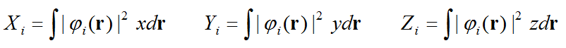
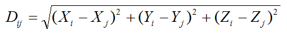
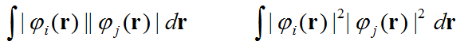
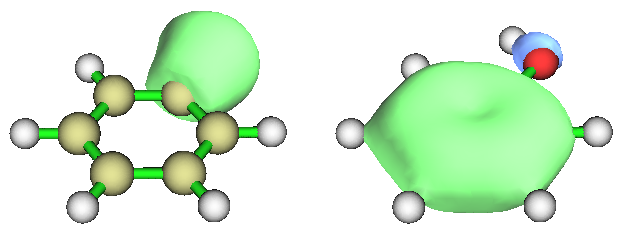
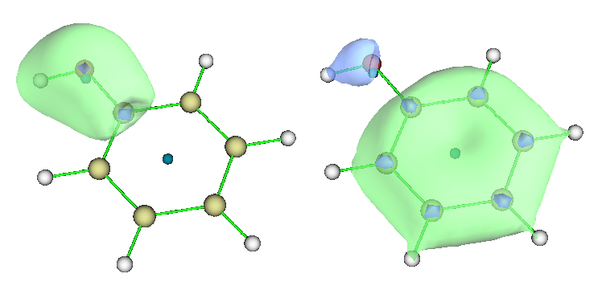

**使用Multiwfn考察轨道间重叠程度和质心距离**Using Multiwfn to study overlap degree and centroid distance between orbitals  
  
文/Sobereva @[北京科音](http://www.keinsci.com/)

First release: 2017-Apr-16  Last update: 2019-May-3

Multiwfn的主功能100里的子功能11（简写为100-11）可以计算轨道间重叠程度、轨道质心位置和轨道间质心距离，原理和用法在此文简单说一下。这个功能对于分析很多问题比较有用，比如讨论电荷转移激发涉及的轨道对。2017-Apr-16更新的Multiwfn 3.4(dev)版及之后版本才有本文用到的功能。Multiwfn可在其主页<http://sobereva.com/multiwfn>免费下载。  
  
使用Multiwfn载入.fch、.wfn、.molden、NBO plot等含有轨道信息的文件之后，进入主功能100里的子功能11，会让你输入要考察的两个轨道的序号，之后会计算如下量：  
  
(1)轨道的质心。下面是i轨道的质心的X,Y,Z分量表达式。由于用到的是轨道波函数的模方，因此计算的是这个轨道对应的电子密度的质心。  

  
(2)被选中的两个轨道的质心的距离  

  
(3)轨道间的重叠程度。会按照如下所示的两个表达式分别计算，前者是两个轨道的模的重叠积分，后者是两个轨道的模方（轨道上的电子密度）的重叠积分。用哪个来衡量重叠程度都可以，前者好处是数量级明显更大，后者某种意义上物理意义更明确。  

PS：直接计算两个轨道波函数的重叠积分显然是无意义的，因为轨道间满足正交归一条件，算出来肯定是0，很多初学者都没搞懂这点。  
  
以上积分都是对全空间积分，用的积分方法是Becke的多中心积分方法。积分精度取决于积分格点数，Multiwfn默认设定下对于以上被考察的量可以积分到足够精度。  
  
下面我们来看一个简单例子，苯酚，用的输入文件是Multiwfn文件包里的examples目录下的phenol.wfn。我们将考察它的第8号和第9号分子轨道的距离与重叠情况。两个轨道的图形分别是下图左边和右边  

  
我们启动Multiwfn，载入examples\phenol.wfn，依次输入  
100  
11  
8,9  
结果如下  
X/Y/Z of centroid of electron density (Angstrom)  
Orbital     8:   -0.096855    2.091647   -0.000000  
Orbital     9:   -0.013862   -0.456075   -0.000000  
Centroid distance between the two orbitals:    4.817050 Angstrom  
Overlap integral of norm of the two orbitals:    0.2922286686  
Overlap integral of square of the two orbitals:    0.0027062869  
输出信息很好理解，MO8和MO9的质心X,Y,Z坐标直接给出了，它们的距离是4.817埃。两轨道的模的重叠积分是0.292，两轨道的模方的重叠积分是0.0027，单位不用写，非要写的话就写个a.u.就完了。  
  
之后程序会问题是否把这两个质心位置作为两个额外的虚原子(Bq)加入到体系。如果你想把质心位置和轨道图形对照观看，就选y。然后退回主菜单，再进入主功能0，在文本界面就会看到体系中已经多了两个Bq原子，在图形窗口中也会看到它们，是深蓝色小圆球（可能会被其它原子阻挡，把Ratio of atomic size拉杆拉小一点减小普通原子的半径即可看到）。我们把绘图的材质选成透明，并且把原子半径、键的粗细都设小，MO8和MO9的图形如下所示，可见质心位置确实如预期的，是在轨道等值面靠中央的部分。  

  
另外，如果你想把原子坐标连同标记质心位置的Bq原子一起导出成结构文件，就进入主功能100的选项2，可以导出各种格式的文件，便于在VMD等程序里进一步绘制。  
  
Multiwfn的上述功能是普适的，不仅限于考察MO，对其它类型轨道，如定域化轨道（见<http://sobereva.com/380>）、NTO（见<http://sobereva.com/377>）、NBO、NAO、AdNDP（见<http://sobereva.com/138>）等轨道都完全适用。  
  
  
顺带一提，经常关注Multiwfn的人一定知道Multiwfn有个非常强大的电子激发分析功能“electron-hole分析”，对应主功能18的子功能1，详见《使用Multiwfn做空穴-电子分析全面考察电子激发特征》（<http://sobereva.com/434>），会输出一大堆考察电子激发特征的量，也包括electron与hole的重叠程度和质心距离，手册4.18.1节有详细实例。上文介绍的100-11功能和这个18-1功能在讨论电子激发上各有利弊，可以互补：  
(1)18-1是通过立方格点积分方法计算重叠值和质心距离，对于大体系会很耗内存，耗时也高，如果把格点间距设大一些来降低内存消耗和计算耗时又会导致精度损失。而100-11的积分方式对内存要求极低，而且结果精度更高。  
(2)18-1需要提供Gaussian的TDDFT/CIS任务的输出文件或记录跃迁数据的文本文件才能用，而100-11只需提供.fch、.molden、.wfn等文件就可以直接用，方便不少。  
(3)18-1关键好处是可以把所有轨道对electron和hole的贡献考虑进去，而100-11只能考虑一对轨道，然而很多情况电子激发是许多轨道对的跃迁共同贡献的。不过，如果先变换为NTO的话，再用100-11来分析，也能达到同等效果（不过很多情况NTO效果不好，即便变换成NTO后也依然没有绝对主导的轨道对，此时就必须用18-1了）。
