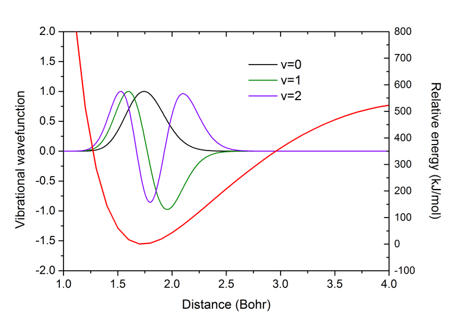
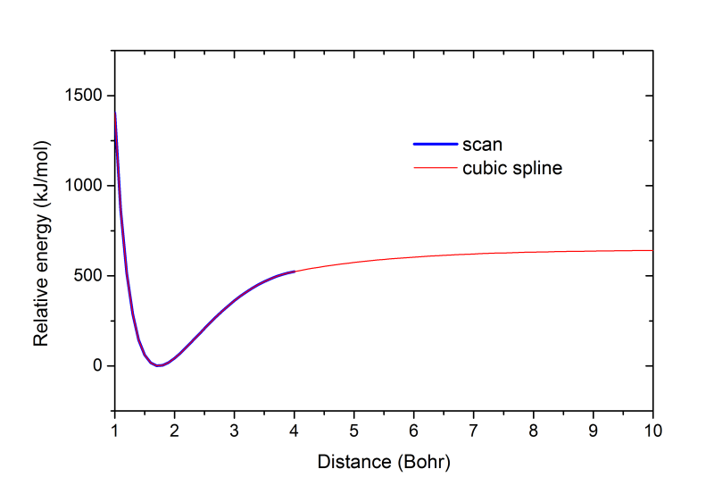

**Molcas的计算双原子分子光谱常数的模块vibrot使用简介**

Introduction to the use of vibrot module of Molcas for calculating spectral constants of diatomic molecules

文/Sobereva @[北京科音](http://www.keinsci.com/)  2017-Apr-17

计算双原子分子的转动-振动谱涉及的光谱常数是量子化学研究双原子分子体系常涉及的。Molcas程序自带了一个不错的vibrot模块，专门用来计算这些量，使用时只需要直接提供离散的势能面扫描的数据即可，完全不依赖于Molcas的其它模块。另外它还可以计算其它信息，包括振动波函数、转-振态间的跃迁性质、温度平均下的可观测量（需要提供事先算好的不同键长时对应的可观测量的数值，如偶极矩）。  
  
本文将以氟化氢HF为例简要介绍一下vibrot模块怎么用。如果对下面计算的一堆双原子分子光谱常数的含义不了解的话，推荐先看看笔者写的这个文档：[/usr/uploads/file/20170417/20170417174516_16229.pdf](http://sobereva.com/usr/uploads/file/20170417/20170417174516_16229.pdf)  
  
首先要做的是用自己擅用的量化程序在较合适的级别下对分子的势能面进行扫描，获得极小点附近一片区域内的势能信息，得到一套离散的“坐标 能量”数据点。数据点可以均匀分布也可以不均匀分布，vibrot会基于它们做三次样条插值构建势能面。显然，要考察越高的振动能级，扫描的键长范围就应该越大，如果还要让程序输出准确的解离能，那就需要扫描距离的上限值相当大才行。这里笔者通过Gaussian在UCCSD(T)/cc-pVQZ级别下对HF键长进行扫描，从1 Bohr开始扫到4 Bohr，步长0.1 Bohr。之所以用Bohr为单位是因为vibrot在输入数据的时候要求以Bohr为单位。（如果只在平衡距离较近范围内扫描，闭壳层CCSD(T)就足够好，由于这里扫描上限较大，故用UCCSD(T)，这样超过不稳定点后会比闭壳层CCSD(T)好得多。当然还有更理想但也更昂贵或更麻烦的选择，如TCCSD、MRCI等）。  
  
之后基于扫描的势能数据写一个文本文件vibHF.txt作为vibrot的输入文件，内容如下，这是个非常典型的输入文件。下面只做简要注释，完整的选项和说明看手册  
 &VIBROT  
 RoVibrational spectrum  //一般设这个  
 Title = UCCSD(T)/cc-pVQZ curve for HF   //标题  
 Atoms = 0 H 0 F   //体系包含H和F，前头的0代表用最大丰度的同位素的质量  
 Potential   //下面提供每个键长(Bohr)时的能量(Hartree)，自由格式，数目不限  
 1    -0.99838084467D+02  
 1.1    -0.10004327670D+03  
 1.2    -0.10017757133D+03  
 1.3    -0.10026413004D+03  
 1.4    -0.10031822868D+03  
 1.5    -0.10035010691D+03  
 1.6    -0.10036672296D+03  
 1.7    -0.10037285786D+03  
 1.8    -0.10037182747D+03  
 1.85    -0.10036895106D+03  
 1.9    -0.10036595106D+03  
 2    -0.10035686368D+03  
 2.1    -0.10034572525D+03  
 2.2    -0.10033336186D+03  
 2.3    -0.10032036301D+03  
 2.4    -0.10030714974D+03  
 2.5    -0.10029402321D+03  
 2.6    -0.10028119928D+03  
 2.7    -0.10026883299D+03  
 2.8    -0.10025703618D+03  
 2.9    -0.10024588825D+03  
 3    -0.10023544681D+03  
 3.1    -0.10022575237D+03  
 3.2    -0.10021683281D+03  
 3.3    -0.10020870635D+03  
 3.4    -0.10020138218D+03  
 3.5    -0.10019486293D+03  
 3.6    -0.10018914421D+03  
 3.7    -0.10018421457D+03  
 3.8    -0.10018005645D+03  
 3.9    -0.10017664428D+03  
 4    -0.10017394551D+03  //这一行之后的选项都是可选的，不设就用默认值  
 Plot = 1.0 10.0 0.1  //输出插值出来的势能曲线，分别是初值、终值、步长  
 VIBRational = 3   //考虑最低3个振动量子数，即v=0,1,2  
 ROTAtional = 0 3   //考虑的转动量子数范围为J=0,1,2,3  
 Grid  = 300   //输出的振动波函数包含的点数  
 Range = 1.0 4.0   //输出的振动波函数的距离下限和上限  
 PRWF  //将振动波函数直接打印到输出文件中  
  
  
运行此命令，调用molcas执行上面的输入文件：molcas vibHF.txt > vibHF.out  
  
一瞬间就算完了。输出的.xml和.status文件都不用管，vibHF.VibWvs是二进制的振动波函数数据，当前我们不用管它。vibHF.VibPlt0里面是基于插值产生的势能曲线数据。vibHF.out包含了我们最感兴趣的信息，比较重要的部分下面说一下。  
  
以下是插值出的势能曲线的极小点位置和势能值，以及外推到无穷远处的势能值  
 extremum points  
                         R(au)         Value  
  Min point            1.731435   -100.373181  
  Extrapolated value at infinity  -100.127233  
  
下面这部分是各个振动+转动态的能量相对于势能曲线最小点的数值（Hartree）  
 Eigenstates  
  
   Vib. q.n.   Rot. q.n.    Energy  
       0           0      0.009399   //v=0,J=0的值。相当于ZPE  
       1           0      0.027559   //v=1,J=0的值，即第一振动激发态的振动能  
       2           0      0.044934  
       0           1      0.009586  
       1           1      0.027739  
       2           1      0.045108  
       0           2      0.009961  
       1           2      0.028100  
       2           2      0.045455  
       0           3      0.010523  
       1           3      0.028641  
       2           3      0.045976  
  
转动常数B和离心畸变常数D是依赖于振动量子数的，诸如下面输出的是v=0的振动态对应的值。  
     Rotational constants for vibrational quantum number  0  
     B=0.205907E+02 cm-1     D=0.210149E-02 cm-1  
再往下的三行是基于v=0振动态的B和D计算的其J=1,2,3的转动态的转动能（虽然我们设的计算范围包括J=0，但它对应的转动能为0。所以不输出），计算公式在前面我提供的文档里就有。第三列是按照公式算出来的值，最后一列是第2、3列的差值。  
     Observed and computed term values (cm-1)  
       1        0.411731E+02        0.411730E+02        0.801538E-05  
       2        0.123469E+03        0.123469E+03       -0.445299E-05  
       3        0.246786E+03        0.246786E+03        0.890598E-06  
  
下面是把前面输出的v=0,1,2时对应的B和D汇总到一起重新输出了一次  
     Rotational constants B(nv) and D(nv) in cm-1  
       1        0.205907E+02        0.210149E-02  
       2        0.198229E+02        0.204650E-02  
       3        0.190734E+02        0.199452E-02  
  
下面是计算D所需的De和βe值，以及由此算出的对应v=0,1,2时的D值（第三列）。  
     Spectroscopic constants De=0.212773E-02 cm-1  Betae=-.534833E-04 cm-1  
     Observed and computed D values  
       0        0.210149E-02        0.210099E-02        0.502747E-06  
       1        0.204650E-02        0.204750E-02       -0.100549E-05  
       2        0.199452E-02        0.199402E-02        0.502747E-06  
  
下面是计算B所需的Be、αe和γe值，以及由此算出的对应v=0,1,2时的B值（第三列）。  
     Spectroscopic constants Be,Alphae and Gammae  
     Be=0.209815E+02 cm-1    Alphae=0.786143E+00 cm-1    Gammae=0.916029E-02  
     Observed and computed B values  
       0        0.205907E+02        0.205907E+02       -0.461853E-13  
       1        0.198229E+02        0.198229E+02        0.710543E-14  
       2        0.190734E+02        0.190734E+02        0.188294E-12  
  
下面是计算振动能级所需的振动常数we、wexe、weye，以及由此算出的对应v=0,1,2时的振动能级（第三列）。  
     Vibrational constants we  =0.417438E+04 cm-1  
                            wexe=-.990961E+02 cm-1  //注意这里和习俗不同。负号本不应当体现在这个wexe数值里面，而是应体现在振动能级的计算公式里  
                            weye=0.290290E+01 cm-1  
      Observed and computed band origins  
        0        0.206278E+04        0.206278E+04       -0.609361E-10  
        1        0.604840E+04        0.604840E+04       -0.499313E-09  
        2        0.986195E+04        0.986195E+04       -0.106047E-08  
  
下面是上面输出过的最重要的双原子分子光谱常数汇总。De(ev)和D0(ev)后面分别是平衡解离能和完全解离能的数值。但由于我们扫描的势能曲线范围不是很远，最远才4 Bohr，还明显没达到水平区域，所以这里给出的De和D0不要太当真，只有扫描到很远的情况这俩数值才准。  
     Re(a)                 0.9162  //平衡坐标（埃）  
      De(ev)                6.6922  //当前级别下严格计算值为6.07eV，故这个外推值高估了  
      D0(ev)                6.4365  
      we(cm-1)        0.417438E+04  
      wexe(cm-1)      -.990961E+02  
      weye(cm-1)      0.290290E+01  
      Be(cm-1)        0.209815E+02  
      Alphae(cm-1)    0.786143E+00  
      Gammae(cm-1)    0.916029E-02  
      Dele(cm-1)      0.212773E-02  //之前输出的时候符号是De，这里为了避免和平衡解离能混淆所以改了符号  
      Betae(cm-1)     -.534833E-04  
  
如果感兴趣的话，可以去NIST网站上搜一下HF的双原子常数的实验值，和我们算的来对照，在这个页面就能看到http://webbook.nist.gov/cgi/cbook.cgi?ID=C7664393&Units=SI&Mask=1000。从中看到，基态电子态的光谱常数值为Re=0.91680，we=4138.32，wexe=89.88，Be=20.9557，αe=0.798，De=0.2151E-02，我们算的与实验值大多都符合得不错或很好，除了wexe误差略大，达到9.3%。  
  
输出信息再往后是各个(v,J)组合相对于极小点的能量，J对应列，v对应行，其实之前就已经输出过了，这里只不过是把单位换成cm-1再输出一次。  
     Term values(observed and computed) in cm(-1)  
  
  J-value         0                     1                     2                     3  
  
  v-value  
      0   2062.78   2062.78     2103.95   2103.95     2186.25   2186.25     2309.56   2309.56  
      1   6048.40   6048.40     6088.03   6088.03     6167.26   6167.26     6285.98   6285.98  
      2   9861.95   9861.95     9900.09   9900.09     9976.32   9976.32    10090.54  10090.54  
  
再往后是各个(v,J)组合时的振动波函数。比如下面是J=0时的v=0,1,2的情况，距离的单位是Bohr。vibrot是通过Numerov方法求解二阶微分方程来得到这些振动波函数的。  
  Rotational quantum number J=  0  
  
      Radial dist.        v= 0              1              2  
      1.000000          0.00000344     0.00001530     0.00004470  
      1.004663          0.00000361     0.00001606     0.00004687  
      1.009347          0.00000393     0.00001744     0.00005076  
      1.014054          0.00000441     0.00001947     0.00005650  
      1.018782          0.00000505     0.00002222     0.00006424  
      1.023533          0.00000588     0.00002578     0.00007426  
...略  
可以把以上振动波函数随距离变化的数据拷出来用Origin作图。J=0时v=0,1,2的振动波函数曲线以及扫描得到的势能曲线（红线）如下所示（注：vibrot给出的这些振动波函数并没有归一化）：  
  

  
这里也把扫描得到的势能曲线和输出的vibHF.VibPlt0文件中包含的插值的势能曲线放在一起进行比较。下图蓝线是扫描的1~4 Bohr范围，红线是插值出的1~10 Bohr范围。可见vibrot做的插值是很合理的，很光滑，在1~4 Bohr内与扫描值吻合很好。  
  

  
  
vibrot可以还可以给出各种振动平均的量，以及振动态间的跃迁属性，简单来说也就是能够计算∫φ(v1)pφ(v2)dr，其中φ(v1)和φ(v2)是指某个转动态的两个振动波函数，程序直接算出来了，p是你感兴趣的依赖于r的量，是你需要在observable字段中提供的。比如最简单的情况，我们考察振动平均结构，就相当于计算∫|φ|^2 r dr，所以p就是坐标变量，我们要提供不同r位置时的距离值，其实就是在之前的输入文件末尾加上下面这些，每个r位置的值正是r自己。  
observable  
1    1  
1.1    1.1  
1.2    1.2  
1.3    1.3  
1.4    1.4  
1.5    1.5  
1.6    1.6  
1.7    1.7  
1.8    1.8  
1.9    1.9  
2    2  
2.1    2.1  
2.2    2.2  
2.3    2.3  
2.4    2.4  
2.5    2.5  
2.6    2.6  
2.7    2.7  
2.8    2.8  
2.9    2.9  
3    3  
3.1    3.1  
3.2    3.2  
3.3    3.3  
3.4    3.4  
3.5    3.5  
3.6    3.6  
3.7    3.7  
3.8    3.8  
3.9    3.9  
4    4  
  
此时输出文件中多了一堆类似下面的内容，是每个J时各个振动态的对应于你给出的量的跃迁矩阵，这里只把J=0的贴出来  
++ Matrix elements of observable: 1 1  
>>>> matrix elements over vibrational wave functions (atomic units) for rotational quantum number  0  
     1  1    1.761059     2  1   -0.066339     2  2    1.847316     3  1   -0.005406     3  2   -0.094723     3  3    1.937822  
observable  
这里1 1、2 2、3 3对应的即是v=0、v=1、v=2的振动态的振动平均结构。而比如2 1对应的即是∫φ(v=2)rφ(v=1)dr的值，其实也正是两个振动态之间的跃迁电偶极矩。由于当前不是谐振势，因此可以违背谐振势Δv=±1的旋律，因此3 1的值虽然远比2 1的小但并不为0。  
  
后面还输出了下面的信息，是程序根据玻尔兹曼分布算出各个转-振动态的分布比例，然后加权平均得到的特定温度下的你所提供的量的平均值，对于当前来说就是温度平均的键长。温度可以在输入文件里通过TEMPERATURE关键词来设定。  
Temperature averaged observable:   0.176187E+01  at  300.000K  
  
  
本文介绍的内容，对于不研究双原子分子光谱常数的人看似没什么用，但实际上对于高精度计算双原子分子热力学相关数据是很重要的。比如计算双原子分子的解离能，要考虑ZPE，本文的这种做法结合高级别势能面扫描的数据得到的ZPE的结果是相当精确的。实际上也不用扫好几十个点，只要在平衡位置上有一个点，附近再分布一些点（至少总共别少于7个），对于计算ZPE也够了。而如果用比如Gaussian的freq=anharmonic关键词来做非谐振计算试图得到ZPE，那得算四阶导数，而且对于CCSD(T)这样连一阶解析导数都没有的方法更是根本不给算，明显不适合高精度研究双原子分子。而至于我们常用的基于谐振近似+ZPE校正因子的做法，对于精确研究双原子分子的目的则显然太糙了。
