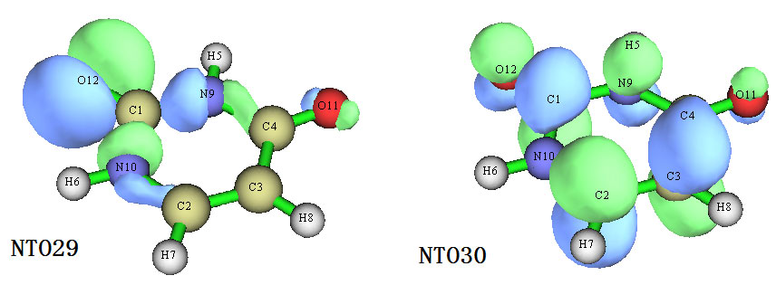
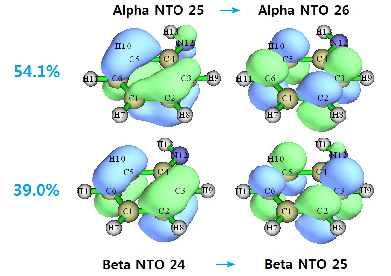

**2022-Mar-1补充**：Multiwfn已经支持结合CP2K程序对周期性体系做NTO分析，见《使用CP2K结合Multiwfn对周期性体系模拟UV-Vis光谱和考察电子激发态》（<http://sobereva.com/634>）。

**使用Multiwfn做自然跃迁轨道(NTO)分析**Using Multiwfn to perform natural transition orbital (NTO) analysis

文/Sobereva@[北京科音](http://www.keinsci.com)  
First release: 2017-May-26  Last update: 2023-Feb-8

## 1 前言

以前笔者专门写过一篇文章介绍NTO的原理和用处，见《跃迁密度分析方法-自然跃迁轨道(NTO)简介》（<http://sobereva.com/91>）。NTO在电子激发分析方面比较流行，已被Gaussian、ORCA、Q-Chem等诸多量子化学程序直接支持。Multiwfn程序中也支持NTO分析，相对于用那些量子化学程序自带的NTO功能的好处在于在Multiwfn中做NTO分析超级方便，想分析哪个激发态就输入哪个态的编号即可，输出信息也特别易于理解。Multiwfn也能很便利地可视化NTO、分析NTO的轨道成份，甚至还可以计算NTO的轨道能量。而且利用笔者现成的shell脚本还可以实现一行命令就让Multiwfn把所有激发态的NTO轨道全都产生出来，超级快捷省事。反观用量子化学程序自带的NTO，对多个激发态一一做NTO分析那就麻烦太多了，耗时也比用Multiwfn高得多得多，还很不灵活。所以对于做NTO分析的人，笔者强烈建议通过Multiwfn实现。

本文目的在于简单介绍怎么在Multiwfn里做NTO分析，并示例如何快速批量做NTO分析。本文对应官网上最新版本的Multiwfn的情况。Gaussian用的是G09 D.01。Multiwfn可在其主页<http://sobereva.com/multiwfn>免费下载。对Multiwfn不了解的话建议参看《Multiwfn入门tips》（<http://sobereva.com/167>）、《Multiwfn波函数分析程序的意义、功能与用途》（<http://sobereva.com/184>）。NTO的原理在前述文章中已经介绍过，一些详细细节在手册3.21.6节也有介绍，因此在此文不再累述。另外，Multiwfn还支持一大堆其它非常重要的电子激发分析方法，总结见《Multiwfn支持的电子激发分析方法一览》（<http://sobereva.com/437>），强烈建议一看！

## 2 输入文件

Multiwfn做NTO分析需要两类文件。下面说TDDFT的时候一律也包括了CIS、TDHF、TDA-DFT的情况。  
(1)含有基函数信息的文件，比如.fch、.molden、.gms等，详见Multiwfn手册2.6节，其中应记录了TDDFT计算的参考态轨道。  
(2)记录TDDFT计算产生的含有电子激发信息的文件，因为Multiwfn做NTO要从中读取激发态的组态系数。可以直接用Gaussian的CIS/TD/TDA关键词的输出文件（必须是对单个结构计算，不能是几何优化等），也可以用满足格式要求的文本文件，看手册3.21.A节对格式的描述，这使得其它量化程序利用Multiwfn做NTO分析成为可能（自己写个程序转换一下激发态输出信息格式即可）。

对于Gaussian用户，简而言之，就是用CIS、TD或TDA关键词对某个结构做电子激发计算，将输出文件以及同时产生的fch文件载入到Multiwfn里即可。注意计算时必须加上IOp(9/40=4)关键词，这使得组态系数绝对值大于>0.0001的都能够被输出，而Gaussian默认只输出组态系数绝对值大于>0.1的组态系数，会导致NTO分析的精度明显不够。用IOp(9/40=5)会使NTO分析更精确一丁点，但对于大体系，可能输出文件会变得很大，NTO分析耗时也会增加，故没必要。

Multiwfn也直接支持基于ORCA做NTO分析，用其输出的.molden文件代替.fch文件，用ORCA的激发态任务输出文件代替Gaussian的输出文件即可。结合ORCA使用涉及的文件准备流程我还专门写了个文章进行介绍：《Multiwfn结合ORCA的TDDFT计算做空穴-电子等分析的方法》（<http://sobereva.com/758>）。

Multiwfn还支持NTO轨道能量的计算，这还需要用户提供含有Fock或Kohn-Sham矩阵的文件，格式说明见Multiwfn手册3.300.6节，计算NTO轨道能量的完整例子见4.300.6节。

## 3 NTO分析实例：尿嘧啶

这里以尿嘧啶(uracil)作为例子演示用Multiwfn基于Gaussian的输出做NTO分析。如果对Gaussian做电子激发计算的基本常识都没有的话应当先看《Gaussian中用TDDFT计算激发态和吸收、荧光、磷光光谱的方法》（<http://sobereva.com/314>）。

下面是尿嘧啶的激发态计算的输入文件，结构已经在B3LYP/6-31G*下对基态优化好。这个任务会在TD-PBE0/6-31G*级别下计算最低三个单重态激发态。  
%chk=C:\uracil.chk  
#p PBE1PBE/6-31G* TD IOp(9/40=4)   
  
B3LYP/6-31G* opted   
  
0 1  
 C                 -1.23749815    0.36573215   -0.00000000  
 C                  0.05337385   -1.70928465    0.00000000  
 C                  1.24151979   -1.06801061    0.00000000  
 C                  1.28200385    0.39168010    0.00000000  
 H                 -0.02061908    2.00141365   -0.00000000  
 H                 -2.02597565   -1.51440798   -0.00000000  
 H                 -0.03161872   -2.79076675    0.00000000  
 H                  2.18093078   -1.60364321    0.00000000  
 N                 -0.00000000    0.98771295   -0.00000000  
 N                 -1.14105931   -1.02649028   -0.00000000  
 O                  2.28466327    1.08546823    0.00000000  
 O                 -2.30362555    0.95179972   -0.00000000

计算完成后，把.chk转换为.fch。此任务的输出文件和相应的.fch文件已经在Multiwfn压缩包自带的examples\excit\NTO目录下提供了。

我们将要对这个体系的S0->S3激发做NTO分析，在做分析之前，我们先看看不写IOp(9/40=4)时候做这个TDDFT计算时输出的S3的组态系数：  
26 -> 30  0.54135  
26 -> 31 -0.20634  
28 -> 30 -0.15424  
28 -> 31  0.36715  
可见，没有哪个MO对对激发起到主导作用，贡献最大的也仅仅是0.54135^2*2*100%=58.5%。如果不会算贡献值的话看《电子激发任务中轨道跃迁贡献的计算》（<http://sobereva.com/230>）。因此，对这个激发，显然不能光靠只分析一对MO轨道来讨论其特征，而同时也讨论其它的MO对则会很麻烦，不好交代清楚。NTO分析对于解决这种困难很有效，因为把MO变换成NTO之后，往往就只有一对NTO对电子激发有很大贡献了，届时就只讨论这一对NTO的特征就够了。

下面我们开始对尿嘧啶的S0->S3做NTO分析。启动Multiwfn，然后依次输入  
examples\excit\NTO\uracil.fch  
18   //电子激发分析模块  
6   //NTO分析  
examples\excit\NTO\uracil.out  
3   //对第3个激发态作分析  
马上看到如下信息  
Multiplicity of this excited state is   1  
Excitation energy is   6.0180000 eV  
There are     846 orbital pairs in this transition mode  
The sum of square of excitation coefficients:  0.500203  
The negative of the sum of square of de-excitation coefficients: -0.000196  
The sum of above two values  0.500007  
以上信息中显示，这个激发态自旋多重度是1，激发能是6.018eV。Multiwfn共从输出文件中读入了846个组态系数，贡献和为0.500007，和理想值0.5相差甚微，所以当前的NTO分析精度是足够高的。

再往下会看到NTO对的本征值，为了简明只列出了最大的10个本征值，从大到小排序。  
The highest 10 eigenvalues of NTO pairs:  
   0.865529    0.134025    0.000582    0.000121    0.000063  
   0.000024    0.000016    0.000015    0.000007    0.000006  
Sum of all eigenvalues:  1.000387

从以上数据，我们就能知道对当前S0->S3跃迁，贡献最大的一个NTO对的贡献值是86.55%。由于此数值已经很大，足够认为产生了主导效应，因此我们只要分析这个NTO对所对应的两个NTO的特征，就可以搞清楚S0->S3跃迁的主要特点了。

现在，Multiwfn会让你选择是否导出含有刚产生的NTO轨道的.fch或.molden或.mwfn文件，导出哪种格式都可以，之后都可以被Multiwfn载入用于观看和分析轨道。这里我们选择把NTO轨道导出成.fch文件，然后输入导出的文件的路径，比如输入C:\nicomaki.fch。之后Multiwfn会重新载入examples\NTO\uracil.fch恢复一开始的状态。之后如果比如你再想对S0->S2做NTO分析，那么可以再次进入NTO分析功能，然后输入2。可见非常方便，输入文件就是一套，想对哪个激发态分析NTO就选几即可。

下面我们看看我们刚才对S0->S3产生的那些NTO。重启Multiwfn，载入刚生成的C:\nicomaki.fch，之后进入主功能0查看轨道。如果不熟悉Multiwfn看轨道的功能可以参看《使用Multiwfn观看分子轨道》（<http://sobereva.com/269>）。我们在图形界面的左上角选orbital info. - Show up to LUMO+10，此时从1号到LUMO+10轨道的信息就都输出在文本界面了，轨道能量那一列此时已经不是轨道能量了，而是NTO本征值（NTO轨道没有能量的概念）。这里把其中一部分信息截出来：  
Orb:    27 Ene(au/eV):     0.000582       0.0158 Occ: 2.000000 Type: A+B  
Orb:    28 Ene(au/eV):     0.134025       3.6470 Occ: 2.000000 Type: A+B  
Orb:    29 Ene(au/eV):     0.865529      23.5522 Occ: 2.000000 Type: A+B  
Orb:    30 Ene(au/eV):     0.865529      23.5522 Occ: 0.000000 Type: A+B  
Orb:    31 Ene(au/eV):     0.134025       3.6470 Occ: 0.000000 Type: A+B  
Orb:    32 Ene(au/eV):     0.000582       0.0158 Occ: 0.000000 Type: A+B  
可见，占据的NTO29和非占据的NTO30组成了一个NTO对，从a.u.为单位的能量那一列可以看到，它们就是本征值为0.8655，即对S0->S3跃迁贡献高达86.55%的那一对NTO。我们把这两个轨道的图在Multiwfn里显示出来，如下所示

可以清楚地看出，NTO29可以认为是O12的孤对电子轨道，NTO30是六元环的pi*轨道，因此这个激发模式可以指认为n->pi*。

从NTO本征值上也可以看到贡献次高的是NTO28-NTO31这一对，贡献为13.4%，有兴趣的话也可以绘制轨道图形分析一下它们对应的特征。

很值得一提的是，Multiwfn有大量分析轨道的功能，对于任何轨道类型都可以用，也包括NTO。比如，我们要通过SCPA方法分析NTO29中O12的贡献，那么在载入nicomaki.fch后，可以进入主功能8，选择3，然后输入29，立刻各个原子对此轨道的贡献就知道了，其中O12贡献为60.47%。关于轨道成份计算详见《谈谈轨道成份的计算方法》（<http://sobereva.com/131>）。再比如，我们还可以讨论NTO29与NTO30之间的重叠程度以及质心距离，从而定量讨论S0->S3激发的电荷转移(CT)的程度，详见《使用Multiwfn考察轨道间重叠程度和质心距离》（<http://sobereva.com/371>）。

当前这个例子反映出NTO分析的价值。基于MO讨论的话最大的轨道对贡献只有58.5%，而变换成NTO后最大贡献达到了86.5%。虽然不完美，不那么接近100%，但还算不错，起码有主导的轨道对了，只需讨论一对轨道就够了。不过，对于不少体系的某些激发态，NTO方法并起不到很好效果，即便把MO变换成NTO，单一轨道对的最大贡献值往往也就70%多甚至更低，光靠这一对轨道还是没法近似充分反映出电子激发的实际特征。这个时候就必须靠Multiwfn独家、强大的电子-空穴分析功能了，见《使用Multiwfn做空穴-电子分析全面考察电子激发特征》（<http://sobereva.com/434>），这种分析已经被大量文章采用，如今非常流行。电子-空穴分析比NTO强大得多、普适性强得多，而且使用很方便，**因此强烈建议用空穴-电子分析而非NTO！**NTO分析唯一的好处仅在于可以给出相位信息，你不需要专门考察相位的话一律应当用空穴-电子分析代替NTO。

这一节的例子是S0到各个单重态激发态之间的NTO分析，对于S0到三重态激发态也可以做NTO分析，只需要在TD里写上triplet要求计算出来的激发态都是三重态即可。

## 4 开壳层体系NTO分析实例：苯胺自由基

这里演示一下对一个开壳层体系，苯胺自由基的NTO分析。输入文件如下  
%chk=C:\anilino.chk  
# b3lyp/6-31G* TD(nstates=5) IOp(9/40=5)  
  
b3lyp/6-31G* opted  
  
0 2  
 C                  0.01820800   -1.80933100    0.00000000  
 C                  1.23091700   -1.09944200    0.00000000  
 C                  1.22997600    0.28332000    0.00000000  
 C                  0.00000000    1.02075200    0.00000000  
 C                 -1.22140100    0.26749600    0.00000000  
 C                 -1.20379500   -1.11577700    0.00000000  
 H                  0.02433600   -2.89560800    0.00000000  
 H                  2.17253400   -1.64190800    0.00000000  
 H                  2.15204200    0.85613200    0.00000000  
 H                 -2.16594900    0.80759600    0.00000000  
 H                 -2.13851400   -1.67034400    0.00000000  
 N                  0.07314900    2.35943200    0.00000000  
 H                 -0.87991900    2.74601300    0.00000000  
  
把chk转化为fch，载入Multiwfn，进入NTO分析功能，载入Gaussian输出文件。此例对第5个激发态做分析，输出信息如下  
The sum of square of excitation coefficients:  1.018612  
The negative of the sum of square of de-excitation coefficients: -0.018619  
The sum of above two values  0.999994  
Deviation to expected normalization value (1.0) is  0.000006

The highest 10 eigenvalues of alpha NTO pairs:  
   0.540688    0.008875    0.006244    0.000382    0.000273  
   0.000245    0.000189    0.000161    0.000100    0.000090  
Sum of all alpha eigenvalues:  0.557249

The highest 10 eigenvalues of beta NTO pairs:  
   0.390181    0.066067    0.003006    0.000555    0.000330  
   0.000291    0.000238    0.000150    0.000127    0.000077  
Sum of all beta eigenvalues:  0.461021

Sum of all alpha and beta NTO eigenvalues:  1.018270  
   
可见，程序对Alpha和Beta部分分别分析，得到了Alpha NTO和Beta NTO。alpha当中对当前跃迁贡献最大的一对NTO的贡献量是0.540688*100%=54.1%，beta当中对当前跃迁贡献最大的一对NTO的贡献量是0.390181*100%=39.0%。我们可以让程序导出fch然后观看相应的轨道。用Multiwfn载入新产生的.fch文件，进入主功能0，选Orbital info. - Show up to LUMO+10，从文本窗口的信息中很容易就能找到要考察的NTO编号  
...[略]  
Orb:    24 Ene(au/eV):     0.008875       0.2415 Occ: 1.000000 Type: A  
Orb:    25 Ene(au/eV):     0.540688      14.7129 Occ: 1.000000 Type: A  
Orb:    26 Ene(au/eV):     0.540688      14.7129 Occ: 0.000000 Type: A  
Orb:    27 Ene(au/eV):     0.008875       0.2415 Occ: 0.000000 Type: A  
...[略]  
Orb:   140 Ene(au/eV):     0.066067       1.7978 Occ: 1.000000 Type: B  
Orb:   141 Ene(au/eV):     0.390181      10.6174 Occ: 1.000000 Type: B  
Orb:   142 Ene(au/eV):     0.390181      10.6174 Occ: 0.000000 Type: B  
Orb:   143 Ene(au/eV):     0.066067       1.7978 Occ: 0.000000 Type: B  
...[略]  
在轨道观看窗口里分别选25和26，从而看到的alpha NTO25 -> alpha NTO26的跃迁就是对电子激发贡献了54.1%的跃迁。而在轨道观看窗口里分别选141和142，窗口右下角的文本框内容自动就变成了-24和-25，因此这俩轨道对应的是beta NTO24和beta NTO25，前者向后者的跃迁对电子激发贡献了39.0%。图示如下：

  

到底对此体系用NTO分析比起直接用MO分析有没有额外优势？不妨看看MO跃迁的贡献情况。当前电子激发的MO跃迁情况是如下这样的（进入主功能18的子功能1 hole-electron分析模块里的选项10，然后选-2，然后输入阈值0.05，就会看到组态系数绝对值大于0.05的MO跃迁及其贡献）  
 19A ->    32A   Coeff.:    0.0638   Contri.:    0.4076%  
 22A ->    27A   Coeff.:    0.0688   Contri.:    0.4733%  
 24A ->    26A   Coeff.:    0.6758   Contri.:   45.6706%  
 25A ->    26A   Coeff.:   -0.2878   Contri.:    8.2840%  
 25A ->    32A   Coeff.:   -0.0625   Contri.:    0.3904%  
 19B ->    25B   Coeff.:   -0.1598   Contri.:    2.5552%  
 19B ->    32B   Coeff.:   -0.0712   Contri.:    0.5077%  
 22B ->    25B   Coeff.:    0.1833   Contri.:    3.3588%  
 22B ->    27B   Coeff.:   -0.0854   Contri.:    0.7293%  
 24B ->    25B   Coeff.:   -0.0919   Contri.:    0.8438%  
 24B ->    26B   Coeff.:    0.6116   Contri.:   37.4042%  
 24A <-    26A   Coeff.:    0.0822   Contri.:   -0.6752%  
 24B <-    26B   Coeff.:    0.0721   Contri.:   -0.5197%  
可见，如果用MO分析的话，alpha中贡献第二大的也有8.3%，并没有小到可以忽略，而转化成NTO后，alpha当中贡献第二大的NTO跃迁仅有0.9%了，完全可以忽略。因此NTO对开壳层体系的电子激发分析一样是有价值的。不过，对开壳层体系需要分别考察Alpha和Beta部分跃迁，总共涉及四个轨道，而用Multiwfn的hole-electron分析的话，就只需要考察hole和electron分布即可，不区分自旋，讨论更为省事。

## 5 做批量NTO分析

经常我们要对一个体系的一大批激发态做NTO分析，虽然也可以比如在Gaussian里用一大堆--link1--分割来做一系列计算得到不同激发态的NTO分析，但是又麻烦又耗时。通过写shell脚本，可以很方便、快速地让Multiwfn对一批激发态都做NTO分析、产生记录NTO轨道的.fch/.molden文件。这里以N-苯基吡咯体系来演示。Multiwfn压缩包自带的examples\N-phenylpyrrole.fch和examples\N-phenylpyrrole_ext.out是可以用于NTO分析的输入文件，此任务用TDDFT计算了5个激发态，我们要一次性对这5个态都做NTO分析，用以下Linux的bash shell脚本可以实现（利用DOS批处理也可以实现相同目的，请自行尝试）：

#!/bin/bash  
cat << EOF > allNTO.txt  
18  
6  
examples/N-phenylpyrrole_ext.out  
EOF  
for ((i=1;i<=5;i=i+1))  
do  
cat << EOF >> allNTO.txt  
$i  
2  
S$i.fch  
6  
EOF  
done  
./Multiwfn examples/N-phenylpyrrole.fch < allNTO.txt  
rm ./allNTO.txt  
如果不对此脚本做任何修改，则运行方法是：把此脚本内容复制到文本文件里并命名为allNTO.sh，用chmod 777 allNTO.sh给其加上可执行权限，然后放到Multiwfn的目录下。进入Multiwfn目录，运行./allNTO.sh执行此脚本。由于体系不大，一瞬间就会执行完，当你看到当前目录下产生了S1.fch、S2.fch、S3.fch、S4.fch和S5.fch，说明脚本已执行成功。之后就可以打开相应的fch查看NTO轨道和本征值了。

稍有shell脚本编写常识的人都很容易理解这脚本是怎么工作的。首先此脚本会产生个allNTO.txt文件，里面包含了在Multiwfn里面要依次敲入的所有命令，然后通过重定向方式调用Multiwfn。i=1;i<=5对应从1到5做循环，让Multiwfn载入第i号跃迁信息后就产生记录相应NTO的.fch文件。最后把这个临时的allNTO.txt删掉。根据实际情况，自行改一下里面的文件名和循环的上下限就可以用于自己的体系的研究。通过脚本非常灵活方便地使用Multiwfn在《详谈Multiwfn的命令行方式运行和批量运行的方法》（<http://sobereva.com/612>）里有非常系统的介绍，强烈建议阅读！

## 6 关于NTO本征值大于1的问题

时常有人问，他算出来的NTO本征值大于1，结果是否正常、能不能用。这要看具体情况。对于CIS和TDA近似的TDDFT，NTO本征值的范围一定在[0,1]区间内。而对于TDHF、TDDFT，由于还涉及去激发组态（在NTO方法原文里并没有明确考虑），NTO本征值有可能大于1。如果只是轻微大于1，比如1.02，就当成1.0就行了。但如果显著大于1，比如1.5，意味着去激发组态的贡献巨大，这时候且不说NTO的结果是否合理，可能TDDFT计算本身就是不合理的。这种时候建议对参考态波函数做波函数稳定性测试，确保波函数是稳定的，否则电子激发计算无意义；如果能确保，则建议改用TDA近似的TDDFT。
