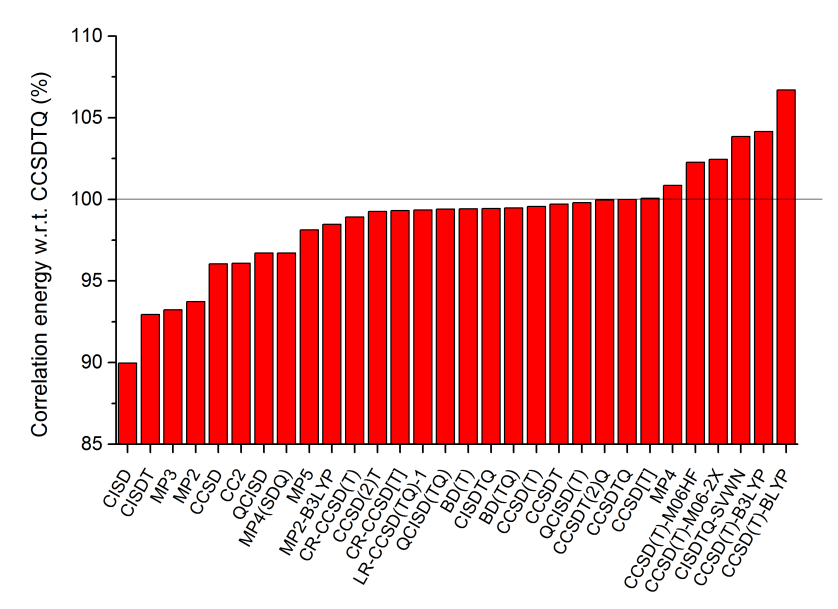
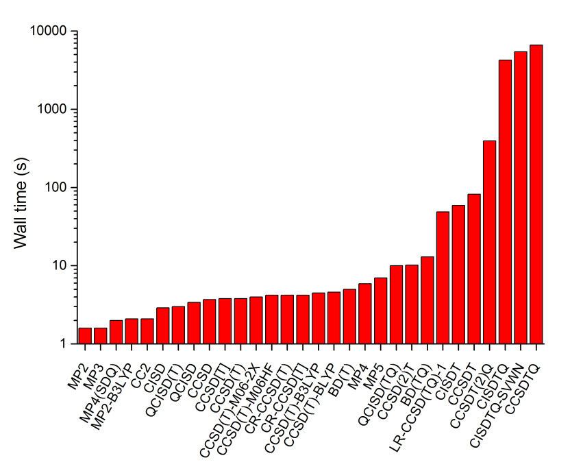
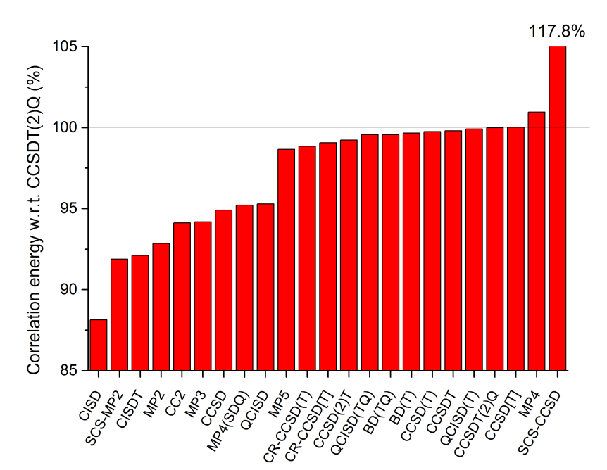
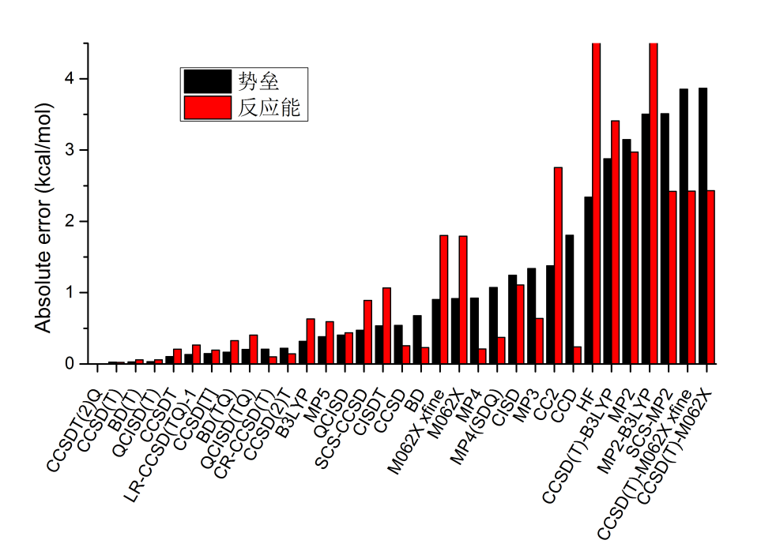
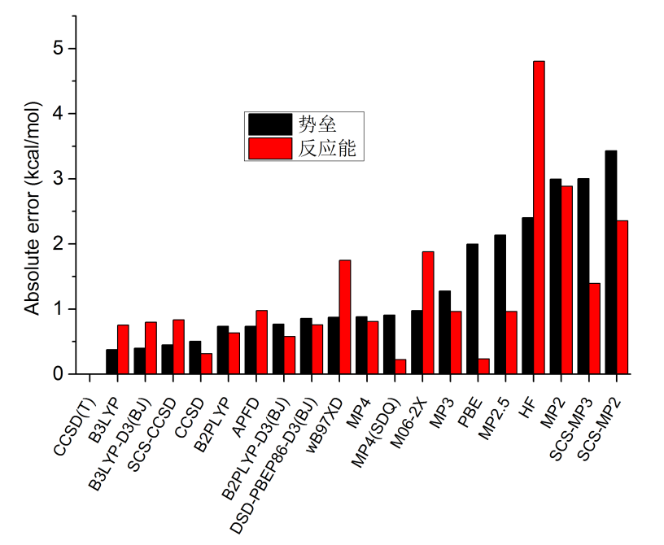

**各种后HF方法精度简单横测**Simple benchmark on accuracy of various post-HF methods

文/Sobereva @[北京科音](http://www.keinsci.com)   2017-May-29

## 1 前言

此文对现有的五花八门的后HF方法做一个集中横测。限于时间精力，测试很粗糙、很不系统，任务非常简单，但结论还是有一定普遍意义的。测试任务有四：  
(1)CO在cc-pVDZ下的相关能。以CCSDTQ结果作为参考标准衡量其它方法对相关能的考虑。之所以用这么小基组是因为哪怕再大一点，用CCSDTQ都会很吃力。  
(2)CNH在cc-pVTZ的相关能。以CCSDT(2)Q的结果作为参考标准。此测试检验用更大的基组、对另一种体系时，各种方法对相关能的考虑程度。  
虽然考察不同方法对相关能的描述充分程度应当用起码5个分子才有较可靠的统计结果，但只考虑CO和CNH，还是能说明一定问题的。由于化学上感兴趣的都是相对能量，不同方法误差抵消程度不同，所以不能只看对相关能的描述充分程度衡量方法精确程度，而必须考察实际化学问题。因此又做了一个非常简单的实际问题的测试：  
(3)HCN异构化过程的势垒和能量变化，在cc-pVDZ级别下计算。所涉及的方法最高到CCSDT(2)Q。同时也顺便考察了几种泛函的结果。  
(4)同上，但是在平时高精度计算常用的cc-pVQZ下计算，此时方法最高用到CCSD(T)。  
  
本文数据使用NWChem 6.6和Gaussian 09 D.01计算。后HF中除了MP4(SDQ)、BD(T)、BD(TQ)、QCISD(T)、QCISD(TQ)由于NWChem不支持故用Gaussian来做以外，其它都是NWChem6.6做的（SCS-CCSD是CCSD模块做的，其它是TCE模块做的）。计算都用冻核近似，凡是两个程序都支持的方法结果是精确一致的。DFT有的是NWChem有的是Gaussian算的。Gaussian计算时用4核并行，NWChem计算时是串行运行。耗时统计的是wall clock time。  
  
  

## 2 CO在cc-pVDZ下的相关能

以CCSDTQ的相关能作为参考，得到的各种方法对相关能的考虑程度如下  
  
  
如果单纯以相关能论英雄的话（这样做很片面），可见CISD烂得很，CISDT依然不咋样，CISDTQ虽然挺理想但耗时已经高得要命，所以单参考CI算基态几乎没人用，这是众所周知的。MP2作为最廉价的后HF方法也比CISD强（但仅限于当前体系，其它体系往往情况反过来）。CCSD比MP2强得多，和QCISD半斤八两，这也是众所周知的。CC2是CCSD的近似，不过从当前数据来看和CCSD相仿佛。MP3比MP2从此例看没改进，还贵不少，这也是MP3根本没人用的原因。到了CCSD(T)、QCISD(T)、BD(T)这个档，结果就已经很精确了，很接近CCSDTQ对相关能的考虑，这三种方法的精度半斤八两。CCSD[T]在原理上比CCSD(T)对CCSDT的近似程度更高，此例其相关能却与CCSDTQ几乎精确一样，但这多半只是巧合。CCSDT(2)Q类似于通俗命名的CCSDT(Q)，精度几乎和CCSDTQ基本没有任何差异，但耗时低得多，因此可以作为极高精度计算比金标准CCSD(T)更高一档的钻石标准来用，很多对CCSD(T)尚不知足的文章都是这么做的，如JPCA,121,1693。QCISD(TQ)、BD(TQ)、LR-CCSD(TQ)-1比起QCISD(T)、BD(T)、CCSD(T)又通过微扰方式把四重激发算符考虑了，但结果并没看出有什么改进，甚至精度还略降低了一丝。CCSDT的结果介于CCSD(T)和CCSDTQ之间，而不及CCSDT(2)Q，这和这个方法的定位正好一致。对比MP2-MP3-MP4-MP5，可以看到对相关能考虑按照这个顺序是波折变化的，这是MP系列著名的特点。MP4明显高估了相关能，MP5又明显低估，都不理想，远不及同档次的耦合簇。理论方法名字后面有个横杠再接泛函名字的是以DFT波函数为参考态做的后HF计算，可看到结果都不理想，和参考值偏离很大。  
  
总之，以上数据显示耦合簇的可靠性是不可动摇的。  
  
下面是计算耗时的对比  
  
  
注意图中是对数坐标。对于对当前体系耗时很低的那些方法，耗时数据没什么意义，因为统计时候的不确定度就已经达到耗时的数量级了，另外有些数据是Gaussian算的有些是NWChem算的，没有可比性。图中，耗时最高的是CCSDTQ，仅仅算一个CO耗时就高达6622秒，还是cc-pVDZ这么低级的基组，所以几乎没丝毫实用性。CCSDT还算有一定实用性，结合cc-pVDZ耗时82秒，比CCSDTQ低两个数量级。在CCSDT基础上微扰考虑四重激发算符得到的CCSDT(2)Q使耗时高了很多，达到394s，但仍比CCSDTQ耗时低一个数量级以上。CISDT和CCSDT耗时基本持平。  
  
显然，cc-pVDZ哪怕结合MP2都是没有任何实际意义的，后HF方法必须靠高角动量基函数方能充分描述电子相关作用。由于当前例子表现出CCSDT(2)Q已经可以代替CCSDTQ作为金标准，而耗时低得多，因此不考虑CCSDTQ时我们可以用更大的基组算更大的体系，见下。  
  
  

## 3 CNH在cc-pVTZ的相关能

一系列方法结合cc-pVTZ对CNH考虑的相关能程度如下，是以CCSDT(2)Q的相关能作为参照。  
  
  
大趋势和上一节类似。由于实际中感兴趣的是相对能量，而以上相当于比较绝对能量，而且只是选取个别体系，所以对相关能的考虑相差在1%~2%左右的方法，并不能说明谁在实际问题中精度更好。但是对于相差比较大的情况，光靠相关能的描述程度还是一定程度可以反映方法精度的。  
  
这一节的测试纳入了SCS-MP2和SCS-CCSD。SCS-MP2众所周知对于除了弱相互作用等问题，多数情况比MP2更好，不过从对相关能的考虑这点上倒没有体现出来。SCS-CCSD更是夸张地高估了相关能。当前测试CC2对相关能考虑比CCSD差，这正常体现出CC2是对CCSD的近似。MP4依然高估相关能，但是从误差大小来看比其近似版本MP4(SDQ)改进不少，而MP5又贵表现又很一般，没什么实用性。同档次CC、BD、QCI从相关能上来看依然没体现出明显差异。(TQ)比起便宜得多的(T)并没体现出优势。CCSD(2)T是一种在CCSD上以微扰方式考虑T3算符的做法，和CCSD(T)是同一档但是做法上有一定差异，从本节和上一节的测试上看比最常用的CCSD(T)略逊色一丝。  
  
当前体系在cc-pVTZ下，几种方法的耗时为：  
CCSDT(2)Q：9435s  
CCSDT：885s  
CCSD(T)：35.3s  
CCSD：27.8s  
CISDT：770s  
CISD：31s  
MP2：5.2s  
QCISD(T)：8s（G09计算）  
QCISD(TQ)：577s（G09计算）  
BD(T)：19s（G09计算）  
BD(TQ)：661s（G09计算）  
MP5：541s（G09计算）  
  
可见，结合有实际意义的cc-pVTZ，CCSDT(2)Q也就能算得动几个原子的体系，用于极高精度计算很适合。相对来说，CCSD(T)的耗时只是它的零头。CCSDT比CCSD(T)贵得多得多，但是从相关能数据来看改进甚微。CISDT比CCSDT便宜一点，毕竟原理和算法上简单得多得多，但精度实在太烂，没实用价值。(TQ)比(T)贵得不是一星半点，而是以数量级衡量。BD比同级别QCI和CC系列都贵，但通常并不带来额外好处，再加上支持它的程序又少，所以也没什么意义，并不流行。MP5则是又贵又臭，耗时直逼QCISD(TQ)。  
  
  

## 4 HCN异构化过程，cc-pVDZ基组

这里比较一下不同方法在cc-pVDZ基组下计算的极为简单的HCN->CNH异构化过程的势垒误差和反应能误差，用的是电子能量。极小点结构、过渡态结构都是B3LYP/6-31G*优化得到的。误差都是绝对误差。势垒误差具体指的是正向势垒误差和逆向势垒误差的平均值。结果如下，顺序是按照势垒误差从小到大排的，参考值是CCSDT(2)Q的结果。之所以是按照势垒误差来排序，是因为其挑战性比计算反应能更大，误差更难以抵消。  
  
  
由图可见，CCSD(T)表现极好，胜过所有其它方法，和CCSDT(2)Q的误差仅有不到0.05kcal/mol。BD(T)、QCISD(T)都略逊于CCSD(T)一丝。特别值得一提的是CCSDT的误差反倒比它的近似CCSD(T)更大。其原因在于，CCSD(T)虽然更形式上没CCSDT精确，但是对T的微扰方式近似考虑导致的误差，和忽略了Q的贡献产生了一定抵消，因此反倒比严格考虑T时候的结果更好。实际上在一些文章对其它体系的测试中也有类似的情况。所以，不要盲目以为CCSDT一定比CCSD(T)更好，从而干出砸锅卖铁也非要攀CCSDT的这种事。还有很值得一说的是，也不要盲目认为(TQ)就比(T)更好。从图中可见，(TQ)比(T)的误差更大，而耗时则高得多得多，对当前体系耗时则和CCSDT接近。一些文章使用(TQ)，9成是认为精度比起用得臭大街的(T)更好，而且计算资源又有余裕，所以想搞个(TQ)来显摆一下，但实际上精度往往还不如已经用烂的(T)。简而言之，对于普通有机体系，要是嫌CCSD(T)还不够高大上，计算资源富得流油，追求绝对的更高精度，能用的也就CCSDT(2)Q或者同档的CCSDT(Q)了（都昂贵到炸，结合有实际意义的基组下能算得动的实际体系少之又少），而用CCSDT或(TQ)级别的方法可能还反倒费力不讨好。虽然前面两节的测试中CCSD[T]的相关能和参考值几乎精确一致，但到了实际问题中，可见其误差比CCSD(T)是明显大一点的，而耗时和CCSD(T)相仿佛，所以没有什么意义（不过有的文章如dx.doi.org/10.1021/ct3008777指出其计算弱相互作用好于CCSD(T)）。由图可见MP5的精度和不考虑(T)的CC/QCI/BD半斤八两，但耗时高得多，因此完全不值得用。CCSD的变体SCS-CCSD虽然众所周知算弱相互作用精度极好，但是算当前问题，比CCSD并无优势，异构化能的精度远低于CCSD。MP4算的异构化能不错，但势垒算得比较糟糕。CI系列对相关能考虑效率低也直接体现在当前体系计算结果差上，很昂贵的CISDT误差依然挺大。B3LYP对于当前体系意外地不错（巧合所致），而M06-2X则令人比较失望，根据大量测试，其计算有机体系精度明显好于B3LYP，但在当前体系却栽了，也反映出DFT的可靠性终究还是和中高级别后HF有着显著差距。图中xfine是指在NWChem里使用比默认好得多的积分格点的情况，由此比较积分格点对结果的影响。虽然众所周知明尼苏达系列泛函对积分格点敏感，但对当前体系并未发现其结果对积分格点有显著依赖性。MP2虽然通常对HF的结果有显著改进，但对于当前体系表现令人极为失望，比发挥失常的M06-2X误差还显著更大，可见MP2算化学反应早已过时，没有丝毫继续使用的价值。SCS-MP2虽然算化学反应能一般认为不错，原文里的测试发现有时能赶上QCISD的水准，但是对当前问题，表现得也很糟糕。CC2的误差非常大，比CCSD差得远，因此CC2也就以LR-CC2形式算激发能有点用，对于算化学反应毛用也没有。CCD算反应能对此例恰好不错，但势垒远不如CCSD，所以考虑T1算符的重要性极大。MP4(SDQ)是完整的MP4，即MP4(SDTQ)的近似，耗时降低了很多，但由图可见误差也有增加。最后，看基于DFT波函数做的后HF，即CCSD(T)-M062X、CCSD(T)-B3LYP和MP2-B3LYP，可见它们的误差都很大，毫无用处，精度比标准的基于HF轨道的形式差得远。  
  
  

## 5 HCN异构化过程，cc-pVQZ基组

在实际中除了菜鸟外谁也不会用cc-pVDZ去试图获得定量准确的结果，即便对于DFT也太low。这里改用高精度计算常用的cc-pVQZ基组再做测试。由于基组较大，用CCSDT(2)Q对于笔者的计算条件已经很吃力了，而CCSDT、几种(TQ)级别的方法又往往并不比CCSD(T)准，故这里以公认优秀的，而且前面测试中也表现优异的CCSD(T)的结果作为参考值，来衡量一批更便宜的方法的精度，结果如下（注意，实际上在CCSD(T)/cc-pVQZ这个级别时，误差的很大程度来源已经是冻核近似了，试图达到kJ/mol的精度应当考虑核电子相关，不过当前不考虑这个问题，并不显著影响我们横测的结论）。  
  
  
由图可见，大基组下B3LYP对这个体系表现依旧出色，但这只是侥幸而已，说明不了什么。SCS-CCSD在大基组下也依然没比CCSD体现出优势，反应能精度还不增反降。按照前人的测试，B2PLYP是肯定不如DSD-PBEP86-D3(BJ)的，不过当前体系前者也侥幸赢了后者。不过就算B2PLYP对当前体系打了鸡血，还是没法和CCSD一拼。是否考虑DFT-D3(BJ)，对B3LYP、B2PLYP的精度影响甚微，基本可以忽略不计，所以不涉及弱相互作用，加D3也没什么坏处，但也别指望能带来多大益处。Gaussian一派人搞的APFD在此体系表现差强人意。有趣的是，wB97XD和M062X对当前体系表现出来的精度很相近，都状态不好。MP4没什么用处，精度<=双杂化，而耗时高得多得多，可以被埋汰了。SCS-MP2、SCS-MP3、MP2.5都是Grimme提出来的，然而从当前体系来看，都不算什么好idea，MP2.5比MP3更渣，SCS-MP3则是渣上加渣，居然反倒比MP3还烂。也随便取了一个GGA泛函PBE纳入测试，算的反应能很不错，但必定只是巧合。PBE算势垒的精度不理想，但也比比它昂贵得多的MP2强，再次说明MP2如今对于化学反应研究无用武之地，精度比其好的泛函一大把，更是被双杂化完爆。随手还测试了一下PM6，半经验算出来的是焓变，虽说没法和电子能量变化精确严格对比，但如果姑且当成一样，PM6的反应能计算误差是1.48kcal/mol，碰巧结果倒也不赖。不过其计算的反应能垒大约是CCSD(T)的两倍，非常离谱！虽然一方面来自于焓变和电子能量变的差异，但更关键的还是在于一般的半经验根本没考虑势垒的计算，误差这么离谱倒也能理解。唯一一个专门算势垒的半经验方法是PM7-TS，读者有兴趣可以用MOPAC算算试试。  
  
获得CCSD(T)/大基组有一种常见的节约耗时的做法，就是通过以下公式估算：  
CCSD(T)/大基组 = CCSD(T)/小基组 + (MP2/大基组-MP2/小基组)  
这里也顺带测试了一下此做法的精度，还是以CCSD(T)/cc-pVQZ的结果作为参照：  
小基组取cc-pVDZ：势垒误差0.13 kcal/mol，反应能误差：0.11 kcal/mol  
小基组取cc-pVTZ：势垒误差0.06 kcal/mol，反应能误差：0.02 kcal/mol  
可见这个近似公式精度很理想，实用性极强。即便小基组取cc-pVDZ，这种近似带来的误差也非常小，而降低的耗时以数量级论。只要能接受比双杂化更高一些的计算花费，那么此做法无疑是最佳选择（可惜在实际程序中没法用于几何优化。虽然原理上能实现，把梯度也这么组合便可）。之所以这个近似方法带来的误差这么小，原因在于：(1)MP2和CCSD(T)相关能本身差异就只有不到10% (2)所利用的是MP2和CCSD(T)下E(QZ)-E(DZ)的差值，差异进一步缩小 (3)化学上研究的是体系间相对能量，求差时误差进一步抵消。  
  
  

## 6 总结

再次强调一下，本文的测试非常粗糙，切勿根据本文的数据以偏概全说事。衡量方法的准确度，最少也得用包含5个体系的测试集进行统计分析，而如今benchmark研究都是用动辄几十，乃至上百，甚至上千的测试体系，否则很可能某些本来精度不佳的方法由于误差抵消的巧合恰好显得精度不错，比如上面测试中B3LYP精度显得比M06-2X还好就有违一般情况。不过，此文的测试在一定程度上还是能以小见大的，结合前人的大量测试产生出的普遍共识，本文的测试反映出以下结论（大多其实都是老生常谈的，但也有少数是许多人没有注意的）：  
  
(1)如果研究的是微小的体系，就几个原子，不满足于CCSD(T)，还想要更高精度（或者就是单纯想显摆），那么CCSDT(2)Q方法（或者同档次的CCSDT(Q)，MRCC程序支持）是最佳选择，精度和Full CI几乎没差别，但耗时奇高。  
  
(2)使用耦合簇时，(T)是非常重要的，能显著提升耦合簇的精度，对于高精度计算是必须的。凡是能用得动CCSD时，一定要努力冲一下(T)。如果带着(T)死活就是算不动，那根本别用CCSD，还不如用前述的近似得到CCSD(T)/大基组的方法，或者尝试ORCA的DLPNO-CCSD(T)（通过引入数值上的近似来降低CCSD(T)耗时，对于大体系效果明显）。  
  
(3)CCSD(T)的精度很理想。同档次的CCSD(2)T、CCSD[T]都逊色于它，这也是为什么CCSD(T)远比其它同档次对CCSDT的微扰近似常见得多得多的原因之一。  
  
(4)QCI、BD比起耦合簇没有优势，BD耗时还更高。doi: 10.1002/wcms.1131更是强调QCI早该被遗忘了，不应该再被使用。除非你的目的是重现其它人用QCI得到的结果，否则打死也别用QCI。  
  
(5)不要以为(TQ)比(T)的精度一定更好，也不要以为CCSDT比CCSD(T)的精度一定更好，至少此文测试给出了反例。最常用的Gaussian支持的最高精度的单参考方法从形式上来说是QCISD(TQ)和BD(TQ)，但试图用这俩来获得比CCSD(T)更高的精度，往往会自取其辱。  
  
(6)不要以为SCS的做法总能改进结果，本文给出了鲜明的反例，别被原文和一些测试文章的光鲜数据给忽悠了，实际没有想象的那么好，用了SCS变体精度极可能不增反降。MP2.5对于一般化学反应问题也得不到什么好效果，性价比很低。用SCS-MP2远远不如用双杂化泛函。  
  
(7)MP2如今完全不中用，廉颇老矣。原先的MP2的市场已经完全是DFT的天下。MP4、MP5的性价比都很差，跟耦合簇没法比，不要用。MP3也毫无用武之地。  
  
(8)CC2比CCSD精度差得远，当用不动CCSD时，不要试图用CC2来节约计算量。  
  
(9)以DFT波函数做参考态结果很糟糕。虽然有些文章这么做却得到了不错结果，但可能是其用的程序实现形式和NWChem的不同所致。  
  
(10)CI系列烂得很，完全无价值，比微扰还没用。  
  
(11)用半经验方法算势垒风险极大，很可能得到完全离谱的结果，其算势垒的误差普遍远高于算反应能的误差。  
  
(12)借助MP2近似计算CCSD(T)/大基组下的能量是极为有用的方法，一定要善加利用。  
  
(13)仅从对相关能的考虑程度来衡量方法的精度很片面，并不能可靠展现方法对实际化学问题的计算精度。但是，对实际问题总是表现良好的方法，对相关能的考虑都很充分。  
  
另外，还要强调的是本文考察的体系并没有很强的多参考特征，涉及多参考体系时往往会有不同的景象（比如CCSDT可能会展现比CCSD(T)明显的优势）。上面的总结对于一般有机体系的研究是普遍适用的。  
  
  

## 附录：一些输入文件示例

考虑到一些读者可能不会写本文提及的一些小众向计算方法的输入文件，但可能又想用它们，这里就简单说明一下。  
  
DSD-PBEP86-D3、MP2.5、SCS-MP2、SCS-MP3的计算方法看此文：《Gaussian中非内置的理论方法和泛函的用法》（<http://sobereva.com/344>）。BD(TQ)、QCISD(TQ)、MP4(SDQ)、MP5就直接在Gaussian输入文件里写这关键词即可。  
  
NWChem做CCSDT(2)_Q/cc-pVTZ计算的输入文件为  
start  //计算时完全重新开始，不基于之前的波函数(若有的话）  
memory total 7000 global 6000 mb   //内存设置，详见手册  
GEOMETRY  
symmetry c2v   //点群  
 C                 -0.00000000    0.00000000   -0.74384793  
 N                  0.00000000   -0.00000000    0.43281671  
 H                  0.00000000   -0.00000000    1.43337065  
end  
basis spherical   //设置基组。用球谐型基函数。默认是笛卡尔型  
* library cc-pVTZ   //所有原子用的基组  
end  
TCE   //设置TCE模块  
freeze atomic   //冻核。默认不冻核  
CCSDT(2)_Q  
END  
TASK TCE ENERGY    //用TCE模块算单点  
这里可以把CCSDT(2)_Q改为LR-CCSD(TQ)-1、CCSD(2)_T、CR-CCSD(T)、CCSDT、CCSDTQ、CISD、CISDTQ、CC2、CCSD(T)、MP2、MP3、MP4等来做相应计算。CCSD[T]结果会在CCSD(T)任务中一并输出。虽然此体系是C∞v对称性，但NWChem的TCE模块只支持阿贝尔群，所以只能用阿贝群里最高的C2v。  
  
如果想基于DFT波函数做后HF计算，比如基于B3LYP做CCSD(T)，用：  
start  
memory total 7000 global 6000 mb  
GEOMETRY  
symmetry c2v  
 C  0. 0. 0.  
 O  0. 0. 1.128323  
end  
basis  
* library cc-pVDZ  
end  
DFT  
XC B3LYP  
END  
TCE  
DFT  
freeze atomic  
CCSD(T)  
END  
TASK TCE ENERGY  
  
若要计算SCS-CCSD，需要用NWChem里的CCSD模块来做，不能用TCE模块。写法：  
...其它设定  
CCSD  
freeze atomic  
END  
TASK CCSD ENERGY  
输出信息里就会看到SCS-CCSD能量。  
  
如果不会编译NWChem，看《NWChem 6.5、6.6编译方法》（<http://sobereva.com/270>）。
