**Multiwfn的轨道定域化功能的使用以及与NBO、AdNDP分析的对比**

The use of orbital localization function of Multiwfn and its comparison with NBO and AdNDP analyses

文/Sobereva @[北京科音](http://www.keinsci.com)

First release: 2017-Jun-5    Last update: 2021-Sep-10

**摘要**：本文首先介绍分子轨道定域化的含义，然后介绍在Multiwfn中做轨道定域化的基本步骤。然后通过5个例子，讲解如何基于定域化分子轨道讨论、分析体系的电子结构，并且与流行的AdNDP方法和NBO方法进行对比。本文的实例体现出轨道定域化的重要应用价值，也鲜明反映出NBO分析对于电子结构复杂、牵扯多中心离域的体系结果经常不靠谱，一定要慎用，最好不用。

## 1 谈谈分子轨道的定域化

我们做一般量子化学计算产生的分子轨道叫正则分子轨道(Canonical MO)，它们是Fock或者KS算符的本征函数，本征值就是轨道的能量。下面说的MO都是指正则分子轨道。MO往往有很强的离域性，也就是说往往MO涉及很多原子，因此与化学键没法一一对应。所以，直接通过分子轨道讨论成键问题，多数情况毫无用处。有不少文章、毕业论文摆出来一堆MO图，但要么没怎么讨论（纯粹是凑数据），要么就是瞎讨论。例如，下面的图是丁烷的两个MO图，完全离域在整个分子。显然从这种MO图上根本没法直接对应众所周知的此体系存在C-C、C-H sigma键的事实。

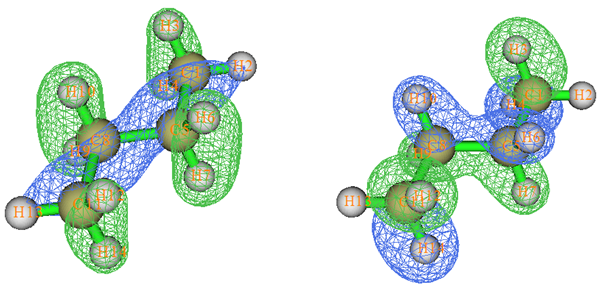

要想将轨道与化学键直接联系起来，需要做轨道定域化，将MO变换成定域化分子轨道（localized MO, LMO）。轨道定域化相当于对占据的MO做酉变换，从而产生出相同数目的离域程度尽可能低的占据轨道。描述体系波函数的Slater行列式无论是由原先的MO所构成，还是由变换后的LMO所构成，所对应的体系各种可观测量，如体系能量、电子密度、静电势等等，都是不变的。还有很多量虽然是不可观测的，但也不受这种变换所影响，比如电子定域化函数(ELF)。

通常做轨道定域化只需要把占据轨道定域化，因为可观测性质、成键问题等等都是只与占据轨道相联系。如果也想把空轨道做定域化，那么也可以再把空轨道以相同方式做酉变换来得到离域程度尽量低的空轨道。将空轨道做定域化主要是用于一些基于定域轨道的电子相关方法，比如知名的但如今用处不大的Local MP2 (LMP2)。由于空轨道比占据轨道数目多得多，将它们也定域化耗时会增加甚巨，而且空轨道对我们分析体系的性质没影响，所以通常我们只把占据轨道定域化就够了。

轨道定域化有许多做法。比较知名的是  
(1)Edmiston-Ruedenberg定域化：1963年提出。通过最大化轨道的自互斥能（亦即最小化轨道间的互斥能）来实现定域化。缺点是耗时很高，而且得算复杂的双电子积分，而且又没额外好处，故很不推荐。  
(2)Boys定域化：1960年提出。应用比较广泛，通过最小化轨道涵盖的空间范围来定域化。需要利用偶极矩积分。  
(3)Pipek-Mezey定域化：1989年提出，它通过最大化Mulliken原子布居数的平方和达到定域化目的，编程实现颇为简单，只需要重叠积分，而且耗时很低，被广泛使用。后来还有人提出基于其它布居分析方法来做Pipek-Mezey定域化。  
(4)NLMO定域化：NLMO的N是Natural的意思。这是NBO开发者提出的定域化方法，它将高占据(Lewis型)的NBO和低占据(non-Lewis型)的NBO以一定方式混合，从而得到整数占据的定域化轨道。由于得到NLMO轨道得先产生NBO，故此方法只有NBO程序，以及也同样能做NBO分析的Molpro才支持。  
以上方法计算过程需要迭代，迭代过程中不同轨道间不断混合，最后使得目标函数被最大化或最小化。

不同的轨道定域化方法得到的LMO图形有一定差异。对于双键的描述，不同方法差异很大，比如下图是乙烯的C=C键，Pipek-Mezey产生的LMO保留了sigma和pi分离的特征，然而Boys定域化则是以两个香蕉键来描述这个双键。

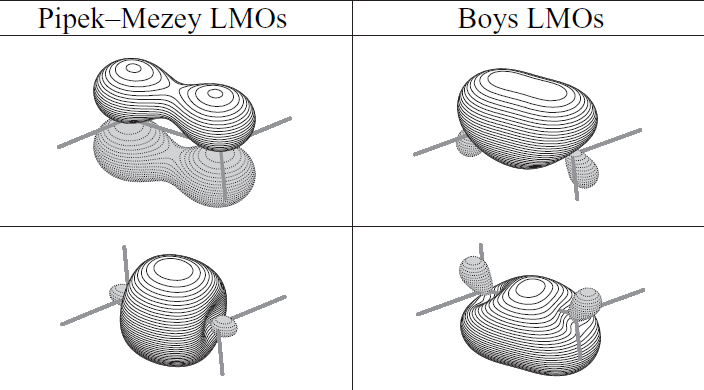

这两种双键的描述形式没法说谁对谁错，从物理角度上是等价的描述，但是显然Pipek-Mezey方法更好一些，结果更符合化学观念，更便于讨论。

原始的基于Mulliken布居的Pipek-Mezey方法的一个缺点是不适合有弥散函数的情况，因为Mulliken布居在有弥散函数的时候结果缺乏意义。这点在《原子电荷计算方法的对比》（<http://www.whxb.pku.edu.cn/CN/abstract/abstract27818.shtml>）、《分子轨道成分的计算》（<http://sioc-journal.cn/Jwk_hxxb/CN/abstract/abstract340458.shtml>）里面都谈过。不过近年来也有人提出基于IAO (Intrinsic Atomic Orbitals)代替原始基函数来做Pipek-Mezey定域化的做法（得到的轨道称为IBO），这使得弥散函数不会对结果有什么影响，因为IAO的意义和NBO框架中的极小集NAO很相似，从原始基函数变换成IAO的过程中已经把弥散函数的不良影响充分去除了。将其它不怕弥散函数的布居分析方法（如Hirshfeld、Becke）结合Pipek-Mezey方法使用也可以使定域化结果不会因为有弥散函数而受到不良影响。

众所周知，NBO轨道的离域程度非常低，这点很像LMO。实际上从等值面图形上会看到NBO比LMO的定域程度其实更高，但NBO的占据数却不像LMO那样是整数，因此NBO轨道不能算做LMO中的一种。实际上，将高占据的NBO和低占据的NBO混合成前述的NLMO之后，就会发现NLMO比对应的NBO的离域程度要高一些，而占据数也变成了LMO要求的整数。产生NBO的过程和Edmiston-Ruedenberg、Boys、Pipek-Mezey定域化方法有本质的不同，NBO轨道是搜索出来的。对于寻找双中心、三中心轨道，NBO程序会循环不同的两个或三个原子组合，检验对应的块密度矩阵的本征值是否超过阈值来判断算不算找到了它们之间的成键轨道，NBO程序里的具体实现其实比这里说的复杂得多，有兴趣者可以看看NBO分析资料汇总里的文章：<http://bbs.keinsci.com/forum.php?mod=viewthread&tid=102>。需要特别强调的是，NBO的这种搜索方式非常不natural，对于成键方式典型的有机体系还行，但是对于电子结构复杂的体系严重不科学！试图用NBO讨论这些体系的电子结构特征完全是坑爹，经常会得到离谱的结论！有很多人拿着NBO输出的荒谬的结果还各种胡乱讨论一番，纯粹是以讹传讹。后文我们对比LMO和NBO轨道就会明显看到这一点。

Multiwfn支持的AdNDP分析方法在《使用AdNDP方法以及ELF/LOL、多中心键级研究多中心键》（<http://sobereva.com/138>）一文中做过充分介绍，强烈建议作者阅读，本文不再详述。AdNDP所做的事也是搜索出离域程度比MO更低的轨道，从而便于展现和讨论体系中不同区域共享电子的情况。AdNDP既可以搜索出NBO那样1~3中心轨道，也可以搜索出更多中心轨道，对这类轨道我管它叫半定域化轨道。AdNDP轨道占据数和NBO轨道一样也不是严格整数，因此不属于LMO的一种。下文的例子中，我们也会对比Pipek-Mezey方法产生的LMO与AdNDP分析结果的异同。

总的来说，按照轨道离域程度的上限由低到高，有这样一个关系：NBO-LMO-AdNDP-MO。之所以说“上限”，是因为即便MO也并非都是离域的。比如算个水，就会看到能量最低的MO完全定域在氧上。

虽然LMO、NBO、AdNDP轨道都不是Fock或KS算符的本征函数，但是我们在单电子近似框架下仍可以讨论这些轨道的能量，也就是把Fock或KS矩阵从原始基函数表象变换到相应轨道的表象下，此时对角元就是各个轨道能量，例如第i轨道的能量就是第i对角元，表达式是<φi|f|φi>，这里f代表Fock或KS算符。我们做NBO分析时看到的程序输出的NAO、NBO、NLMO等轨道的能量，就是NBO对量化程序产生的Fock/KS矩阵做这么一个简单的表象变换得到的。

## 2 在Multiwfn中做轨道定域化

Multiwfn做轨道定域化支持基于Mulliken、Lowdin和Becke布居的Pipek-Mezey方法，以及Foster-Boys方法。其中PM-Mulliken方法速度最快（对于只要求定域化占据轨道的情况，处理200个原子一般都没问题），所以是默认的。PM-Mulliken和PM-Lowdin原理上不适合有弥散函数的情况，不过我实测发现有时候即便用aug-cc-pVTZ这样带弥散函数不少的基组，PM-Mulliken定域化占据轨道的结果还是基本合理的（但如果用d-aug-cc-pVTZ这样带巨量弥散函数的基组，PM-Mulliken是绝对不能用的）。如果由于特殊原因必须带弥散函数，比如阴离子，或者被外电场极化得特别厉害的中性分子（比如《一篇文章深入揭示外电场对18碳环的超强调控作用》<http://sobereva.com/570>文中就有这种情况），最稳妥的做法是改用PM-Becke或者Foster-Boys方法，这俩在原理上都完全不怕弥散函数，但它俩都比PM-Mulliken或PM-Lowdin昂贵得多。PM-Becke尤为昂贵，对于50个原子体系结合6-31G*的情况耗时就相当高了，而Foster-Boys虽然耗时不这么夸张，但是如前所述，没法给出比较符合一般化学直觉的sigma-pi分离的定域化轨道。对轨道定域化方法的更多介绍、讨论、实现细节的说明参见手册3.21节。另：笔者发现对于个别特殊体系结合某些基组时，即便没带弥散函数，PM-Mulliken方法得到的定域化轨道也不太理想，此时用PM-Becke得到的结果明显更好。所以当你觉得PM-Mulliken结果诡异的时候也可以尝试改用PM-Becke。

Multiwfn可以在其主页<http://sobereva.com/multiwfn>免费下载。不熟悉此程序的请参看《Multiwfn入门tips》（<http://sobereva.com/167>）、《Multiwfn波函数分析程序的意义、功能与用途》（<http://sobereva.com/184>）。

把含有基函数信息的输入文件（如fch、molden等，不清楚的话看《详谈Multiwfn支持的输入文件类型、产生方法以及相互转换》<http://sobereva.com/379>）载入到Multiwfn里，然后进入主功能19就可以做轨道定域化。可以选择只定域化占据轨道，还是把占据轨道和空轨道分别定域化。对于非限制性开壳层体系，程序会把alpha和beta部分分别做定域化。此功能不支持限制性开壳层波函数。

定域化过程中会显示迭代细节，当Delta P降到设定的阈值以下时即宣告收敛。默认的阈值，以及默认的循环次数上限在这个功能的界面里会直接看到，可以自己设，一般不需要改。

默认设定下，当迭代收敛后，程序会通过Hirshfeld方法（不熟悉者看《谈谈轨道成份的计算方法》<http://sobereva.com/131>）计算得到的LMO中的各个原子的成份，然后由此对LMO的特征进行指认，判断是单中心、双中心还是离域到更多中心的LMO，便于用户快速找到自己感兴趣的轨道。然后程序自动把波函数导出到当前目录下的new.fch中。默认情况下，程序会再把这个文件载入，此时内存里的轨道波函数就变成了LMO了，可以直接做进一步分析，如考察轨道图形、计算轨道成份等。注意此时LMO的占据数是对的，但能量还是原先MO的能量。

如果要得到LMO的能量，应当在轨道定域化界面里选择-4 If calculating and printing orbital energies。计算LMO的能量需要利用Fock矩阵，你需要选如何获得Fock矩阵，有两个选项：  
(1)直接基于分子轨道能量和系数矩阵反解出来Fock矩阵。通常建议用这个方式，最为省事。但是如果使用了大量弥散函数，量子化学程序可能会自动去除一些线性相关基函数，这个时候就没法用这个做法了，只能用下面的方法  
(2)从特定文件里读取。可以从记录Fock矩阵的文本文件里读取，也可以从.47文件里读取（Gaussian可以直接产生），也可以从ORCA输出文件里读取，等等，详情见Multiwfn手册附录7。

为了便于展现LMO的分布特征，Multiwfn可以计算出所有LMO的中心位置并在图上显示出来，这使得哪里有LMO出现一目了然。第i个LMO的中心位置计算为<LMO_i|**r**|LMO_i>，**r**是电子坐标算符。

下面我们通过几个实际体系，演示一下Multiwfn轨道定域化的使用，并对结果进行讨论，与此同时还会与NBO或AdNDP轨道进行一些对比。在《使用Multiwfn通过LOBA方法计算氧化态》（<http://sobereva.com/362>）这篇文章中使用的LOBA方法是基于定域化轨道的计算氧化态的方法，文中已经利用到了Multiwfn的这个轨道定域化功能，建议大家也看看。

下文涉及的各种文件都可以在此处下载：[**http://sobereva.com/attach/380/file.rar**](http://sobereva.com/attach/380/file.rar)。  
本文使用G09 D.01计算。若未注明，NBO分析是用的G09自带的NBO3.1做的。本文用的NBO6是2017年5月买的版本。

## 3 实例1：1,3-丁二烯

这个例子我们对1,3-丁二烯做分子轨道定域化分析，写以下输入文件  
%chk=C:\butadiene.chk  
 # B3LYP/6-31G*  
  
Generated by Multiwfn  
  
0 1  
 C      0.60180003    1.75050480    0.00000000  
 H     -0.32508753    2.31854834    0.00000000  
 H      1.52387750    2.32224216    0.00000000  
 C      0.60180003    0.41067144    0.00000000  
 H      1.55113518   -0.12465745    0.00000000  
 C     -0.60180003   -0.41067144    0.00000000  
 H     -1.55113518    0.12465745    0.00000000  
 C     -0.60180003   -1.75050480    0.00000000  
 H      0.32508753   -2.31854834    0.00000000  
 H     -1.52387750   -2.32224216    0.00000000  
    
计算之后用formchk把chk文件转换成butadiene.fch。然后启动Multiwfn，输入  
butadiene.fch  
19  //轨道定域化  
1  //只定域化占据轨道  
由于体系很小，一瞬间就算完了，经过了几轮迭代就收敛到了要求的阈值了。屏幕上输出了各个定域化轨道的基本特征以便于找到用户感兴趣的轨道，并且当前目录下产生了new.fch，里面记录了占据的LMO和非占据的MO。如屏幕的提示所示，Multiwfn已经又自动载入了此文件，所以当前内存里的占据轨道已经是定域化后的了。我们按0返回主菜单，然后进入选项0观看刚得到的LMO。

把所有占据轨道，即1号到15号轨道挨个看一遍，先会看到各个收得很紧的内核轨道，然后是各种C-C、C-H sigma轨道，最后两个轨道是边缘的C=C键的pi轨道，如下所示：

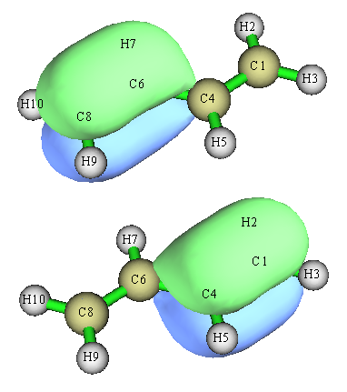

如果不做定域化，我们会看到占据的pi轨道是离域在分子整体，不好讨论。从定域化后的这两个pi轨道上，我们看出，两边的C-C之间有明显的pi键。但是，这绝不意味着中间的C-C之间没有丝毫pi键特征，如果我们用Multiwfn主功能9来计算Mayer键级（主要体现原子间共享电子对数）和拉普拉斯键级（看JPCA,117,3100的介绍），会看到中间的C-C键的这两种键级分别为1.138和1.313，都大于1，因此两种键级都表明中间的C-C并不仅仅有sigma键，还有一定的pi键特征。但如果计算边缘C-C键的键级，则Mayer键级和拉普拉斯键级分别为1.872和1.917，接近双键的形式键级2.0，说明其pi键特征远强于中间的C-C键。

此例体现出，定域化轨道会着重把体系中最主要的共享电子的特征展现出来，而共享电子程度较弱的作用，就没有相应的定域化轨道与之对应了，所以此例中间的C-C键之间没有与之直接对应的pi型LMO出现。

根据上面算的键级值，我们知道并不是看到某两个原子之间有N个定域化轨道，就代表这两个原子间应当视为有N重键。上面的轨道等值面图是在Multiwfn默认的isovalue值0.05下绘制的，如果我们把isovalue值设小一点，比如用gview默认的0.02，那两个轨道图就成下面这样了

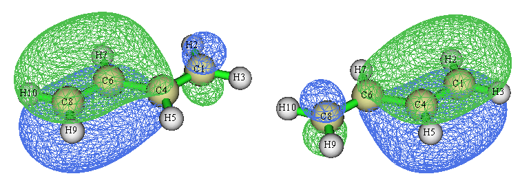

可见，这俩定域化轨道并不是100%定域在两端的C-C键上的，只能说大部分对应两端C-C键，而有小部分还是出现在中间C-C键的区域上，因此，它们在一定程度上对于中间的C-C键的键级是有贡献的。相应地，由于这俩轨道上的电子对也并非仅被两端的两个碳原子共享，故不会对它们间的键级产生恰好1.0的贡献。

实际上可以用Multiwfn做一下占据数扰动的Mayer键级分析，考察一下各个轨道对Mayer键级的影响。虽然Mayer键级并不能精确分解为轨道的贡献，但这种占据数扰动的Mayer键级分析方法在实际中还是很有助于讨论的。我们进入Multiwfn主功能9，选择子功能6进入相应分析界面。我们先考察各轨道的存在对两端的C6-C8键的Mayer键级的影响，故输入6,8，看到结果  
...（略）  
    11     2.00000   -0.39137    0.836985   -1.035523  
    12     2.00000   -0.38506    1.887136    0.014627  
    13     2.00000   -0.34441    1.869943   -0.002566  
    14     2.00000   -0.31993    1.014101   -0.858407  
    15     2.00000   -0.22908    1.948604    0.076096  
结果表明，如果少了第11和14号LMO，C6-C8的Mayer键级将分别下降1.035和0.858。LMO11就是C6-C8间的sigma型LMO，LMO14就是主要涵盖C6-C8区域的pi型LMO。可见，那个pi型LMO对C6-C8并没法产生1.0的键级贡献，而那个sigma型LMO则充分定域在C6-C8上，从而产生了1.0的贡献。我们再输入4,6考察各LMO对位于分子中间的C4-C6键的Mayer键级的影响，结果为  
...（略）  
   13     2.00000   -0.34441    0.132491   -1.005149  
   14     2.00000   -0.31993    1.026398   -0.111242  
   15     2.00000   -0.22908    1.026398   -0.111242  
数据也说明，13号LMO可以算是严格意义的C4-C6间的sigma轨道，产生键级贡献约1.0。而LMO 14和LMO 15，即上面绘制的两个pi型LMO，对于C4-C6的键级也有很少量贡献。当前的例子表明，把LMO分布图和Mayer键级放在一起，既能从图形上直观展现成键，又能从数值上定量讨论成键，很有益处。ELF和LOL对于图形化展现成键特征也极为有用，见《电子定域性的图形分析》（<http://sobereva.com/63>）。

对于当前体系，进入轨道定域化界面后可以选2来让Multiwfn同时对占据和非占据MO分别做定域化。占据轨道部分和上面得到的完全一样，在非占据轨道当中我们可以找到sigma反键轨道和pi反键轨道，和我们根据结构化学常识所期望的图形一致：

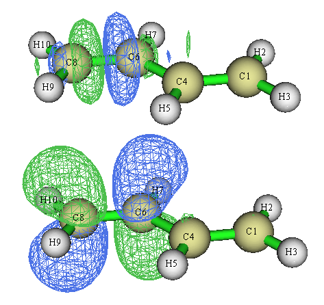

## 4 实例2：Li5+团簇

此例我们对Li5+团簇做LMO分析。上一节我们没有让程序产生LMO的能量，所以主功能0里显示的能量仍然是原先的MO的能量，当前例子我们要让Multiwfn把LMO的能量也产生，用到的Fock矩阵让Multiwfn直接生成，这是最省事的。

启动Multiwfn，依次输入  
Li5+.fch  
19  //轨道定域化  
-4  //让Multiwfn做完定域化后计算LMO能量  
1   //用基于MO的能量和系数矩阵反解出的Fock矩阵算LMO能量  
1  //对占据轨道做定域化  
定域化收敛后，输出了LMO的能量信息，如下所示  
    1   Energy:   -2.1347449 a.u.     -58.0894 eV   Type: A+B   Occ: 2.0  
    2   Energy:   -2.1347449 a.u.     -58.0894 eV   Type: A+B   Occ: 2.0  
    3   Energy:   -2.1347448 a.u.     -58.0894 eV   Type: A+B   Occ: 2.0  
    4   Energy:   -2.1213722 a.u.     -57.7255 eV   Type: A+B   Occ: 2.0  
    5   Energy:   -2.1213709 a.u.     -57.7254 eV   Type: A+B   Occ: 2.0  
    6   Energy:   -0.3037221 a.u.      -8.2647 eV   Type: A+B   Occ: 2.0  
    7   Energy:   -0.3037206 a.u.      -8.2647 eV   Type: A+B   Occ: 2.0  
当前内存中记录的占据轨道的能量，以及导出的new.fch里的占据轨道能量都是这些新算出来的能量。由于这里没对空轨道做定域化，所以它们的能量没被输出，内存里和new.fch里的空轨道的能量还是MO的。

从上面列的7个占据的LMO的能量来看，轨道分为三种，简并度分别为3、2、2。我们用主功能0观看轨道图形，每种简并的轨道只在下图绘制其中一个，图上标的是eV为单位的能量

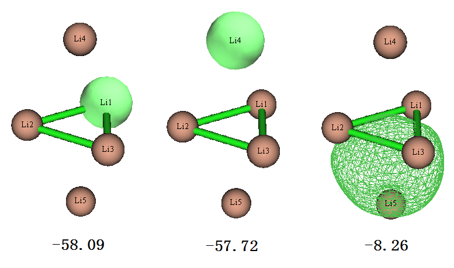

上图第一个轨道是中间位置的Li的单中心轨道，由于其能量很低，很容判断出这肯定是Li的1s轨道。上图第二个轨道是上下两端的Li的1s轨道，能量和中间的Li的轨道很接近，但毕竟所处的化学环境有所不同，所以轨道能量也有点差别。上图第三个轨道是四个Li构成的4中心双电子轨道（可标注为4c-2e），显然是Li的2s电子构成的。由于本身单个原子的2s轨道能量就远高于1s，所以这个由2s轨道组成的LMO的能量也比其它两类LMO能量高一个数量级。

在前述的《使用AdNDP方法以及ELF/LOL、多中心键级研究多中心键》一文中我们用AdNDP方法也做过此体系的分析，得到的轨道图形和LMO几乎一模一样。因此，对于一些简单的体系，其实可以不必做操作相对麻烦的AdNDP，直接靠LMO就可以很好地讨论电子结构了。

我们再看看如果对此体系做NBO分析产生的轨道是什么样。我们用# b3lyp/6-311g(d) pop=saveNBO来计算，这样算完了之后NBO轨道就被直接存到chk里了，转换成fch后就可以直接用Multiwfn观看NBO轨道了，详见《使用Multiwfn绘制NBO及相关轨道》（<http://sobereva.com/134>）。我们会发现能量最低的5个轨道，即Li的1s轨道，无论是轨道图形还是轨道能量与Multiwfn的轨道定域化产生的结果十分一致，但价层NBO轨道就一塌糊涂了。从输出信息中会看到除了CR型内核NBO轨道占据数几乎是2.0的，其余的占据数不太接近0的NBO的占据数为  
6. (0.55080) LP*( 1)Li   1  
 7. (0.36965) LP*( 2)Li   1  
 10. (0.55080) LP*( 1)Li   2  
 11. (0.36965) LP*( 2)Li   2  
 14. (0.55080) LP*( 1)Li   3  
 15. (0.36965) LP*( 2)Li   3  
 18. (0.61749) LP ( 1)Li   4  
 22. (0.61749) LP ( 1)Li   5  
可见，NBO对价层电子，没有给出任何成键信息，而假定每个原子上的价电子要么是孤对电子，要么是物理意义含糊不清的LP*电子。

默认情况下，NBO只能自动搜索单、双中心轨道，实际上，如果用pop=nboread，然后在输入文件末尾空一行写上$NBO 3cbond $END，则程序还会自动搜索三中心轨道。然而，这么做了之后结果更诡异，轨道分布根本不满足体系点群对称性，对体系电子结构的描述完全错误。NBO会搜索出的两个占据数为1.498的三中心轨道，图形如下

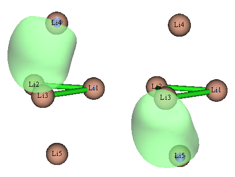

除了这两个外，NBO还搜出Li1有两个占据数分别为0.551和0.370的LP*轨道。

NBO6相对于NBO3.1在默认的轨道搜索规则上做了很大修改，但搞出来的NBO轨道也是完全没法用来讨论Li5+的成键本质。虽然NBO6已经允许在$CHOOSE中指定>3中心的定向搜索，但是却不能自动搜索>3中心轨道。所以对于存在>3中心轨道的情况，NBO几乎是没有丝毫用处的，用了只会被误导。若是信誓旦旦地拿这些NBO轨道去说事，明显是坑爹。然而很多初学者缺乏最基本的理论常识，程序输出什么结果就拿什么结果讨论，胡乱解释一番。盲目用NBO危害实在太大。

对此体系如果尝试用NBO3.1做NLMO分析，程序会报错，这是NBO3.1的bug所致。笔者也用NBO6做了NLMO分析，Li的2s轨道构成的NLMO轨道如下

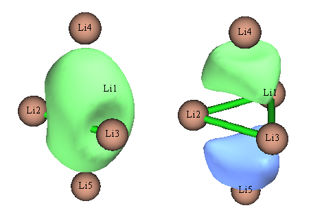

实际上，这正是Li5+能量最高的两个占据MO的图形，NLMO等于完全没起到定域化效果！

## 5 实例3：OsO4

此例我们考察OsO4的LMO，并且也要得到轨道能量。可以使用与上一节相同的步骤在计算LMO的同时得到其能量，但这一节演示一下怎么从.47文件里读取Fock矩阵。此体系的Gaussian输入文件如下，算完了之后会产生C:\OsO4.47文件。  
%chk=C:\OsO4.chk  
 # b3lyp/def2tzvp pop=nboread  
  
B3LYP/def2TZVP opted  
  
0 1  
  Os                 0.00000000    0.00000000    0.00000000  
  O                  0.98386911    0.98386911    0.98386911  
  O                 -0.98386911   -0.98386911    0.98386911  
  O                  0.98386911   -0.98386911   -0.98386911  
  O                 -0.98386911    0.98386911   -0.98386911  
  
$NBO archive file=C:\OsO4 $END

感兴趣者可以用Multiwfn的子功能0观看OsO4.fch里记录的MO，会看到从MO图形上根本讨论不了此体系的成键特征，而必须做LMO。

启动Multiwfn，依次输入  
OsO4.fch  
19  //轨道定域化  
-4  //计算LMO能量  
2  //从一个文件里读取Fock矩阵  
OsO4.47  //输入47文件的实际路径，此文件里有Fock矩阵信息  
1  //定域化占据轨道

我们仔细观看定域化后的占据轨道，会发现轨道是满足体系对称性的，Os和每个氧间都有两个pi轨道和一个sigma轨道，并且还能看到每个氧都有一个孤对电子轨道和一个内核电子轨道。下面把Os与其中一个氧的三个成键轨道和那个氧的孤对电子轨道绘制出来，数值是轨道能量（eV）：

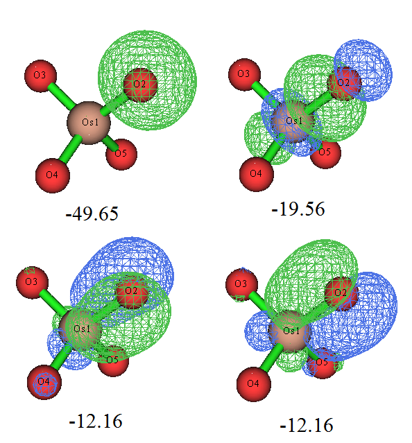

轨道图形和我们期望的很一致，而且轨道能量也很符合化学直觉，即sigma轨道能量低于pi轨道。那个孤对电子轨道几乎是球形的，如果用Multiwfn对它用Mulliken方法做一下轨道成分分析，也会看到它几乎完全由S基函数构成，很容易理解这就是氧的2s轨道。本身由于2s轨道的能级显著低于用于成键的2p，所以这个轨道的能量自然而然比sigma、pi轨道低得多。

虽然Os和每个O之间有3条成键LMO，但是也不代表它们的键级就是3.0，这只能认为是键级的上限。计算Mayer键级的话，发现Os和O之间的键级是1.720。如果同上一节做键级分解的话，会发现Os-O的sigma LMO对键级的贡献是0.866，而每个pi LMO的贡献仅有0.425，这可以认为这些pi轨道并不是在Os和O之间很充分共享的。我们可以在看轨道的时候把等值面数值加大，会发现在较大数值的时候，等值面几乎都出现在氧上。如果我们用Multiwfn的主功能4对pi轨道作个填色+等值线的截面图（相关操作参考手册4.4节绘制平面图的例子），可以将其分布特征看得更清楚，如下所示

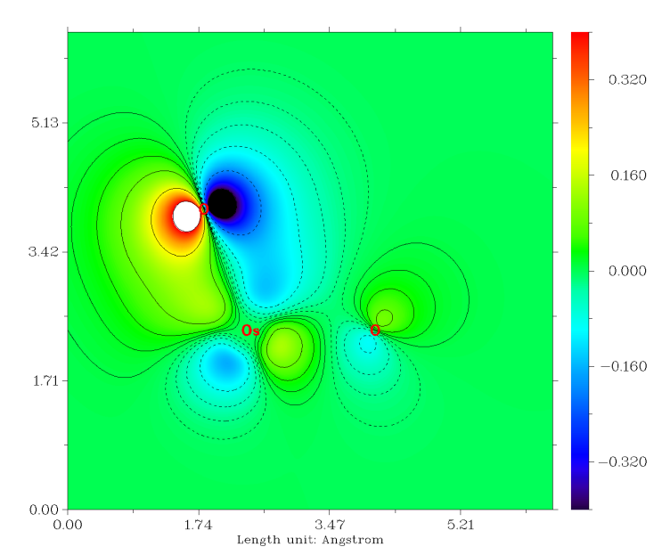

由图可见，pi轨道大部分其实是分布在氧上的，只是一定程度上也离域到Os上，从而对O与Os的共价作用有所贡献。如果用Hirshfeld方式做个轨道成分计算（做完轨道定域化后其实也自动在屏幕上输出了），会发现O的贡献高达71.7%，而Os只产生24.9%的贡献。这么一分析，也很容易理解每个pi轨道对键级的贡献是肯定达不到1.0的。

我们再看看用NBO3.1做NBO和NLMO会把这个体系描述成什么样。做了之后会发现，大多数轨道和Pipek-Mezey定域化给出的轨道差不多，特别是NLMO与之相符得更好。但是，占据的NLMO以及高占据的NBO都有两条轨道很离谱，见下

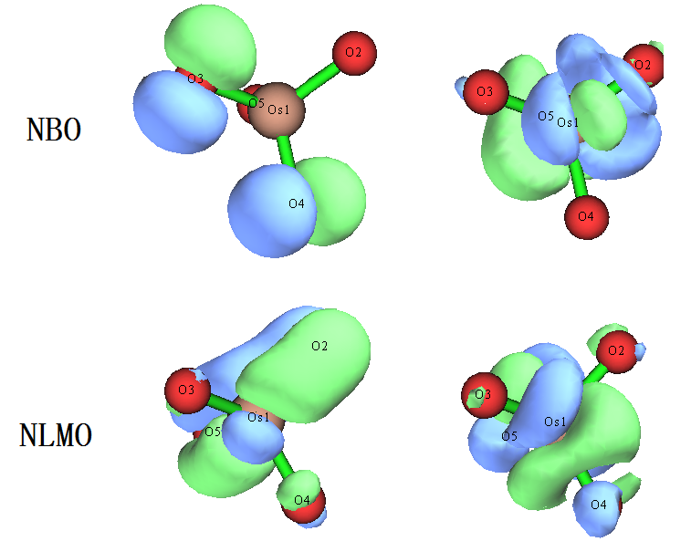

这些轨道完全没合理体现出NBO和NLMO作为定域的轨道应有的特征，也和体系对称性完全不符，结果根本没法用！但其实这主要是NBO3.1搜索轨道算法很烂所致。

到了NBO6，情况得到了很大改观。搜索出来的和每个氧的价电子有关的高占据数NBO如下所示，图中数字是占据数

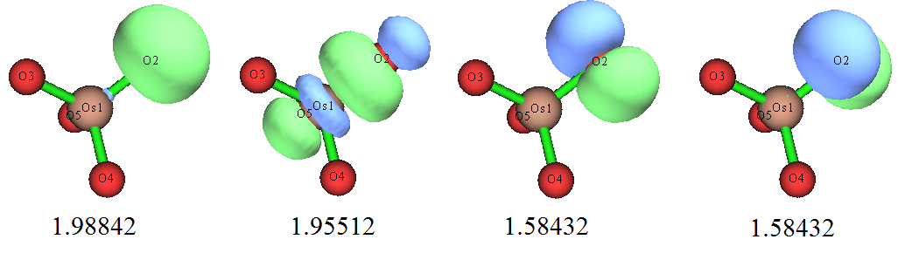

NBO6找出的这些轨道对每个氧都是一样的，即起码和体系对称性相符了。然而，NBO把定域性给夸大了，之前展示的LMO轨道体现出氧与Os形成了两个pi键，但在NBO里，这两个pi键没体现出来，却被指认成了氧的孤对电子，其占据数仅有1.58，体现出这种轨道的物理意义不咋地，不够convincing。此情况体现出NBO轨道搜索方法的内在弊端，即搜索方式、搜索阈值的设计有点太“任性”了，对于电子结构难以通过单一Lewis式描述好的情况，NBO轨道根本没法如实展现出体系的电子结构，很容易误导用户。

NBO6给出的NLMO的图形和Pipek-Mezey定域化方法得到的LMO十分一致，比NBO3.1给出的强太多，而且比NBO轨道物理意义明显更好。因此对于电子结构复杂的情况，如果你死活非要用NBO程序不可，那么相对而言，应当用NBO6给出的NLMO来讨论。

## 6 实例4：Au20团簇

Au20团簇的电子结构在前述的《使用AdNDP方法以及ELF/LOL、多中心键级研究多中心键》中已经充分研究过了，这里我们对Au20做Pipek-Mezey定域化轨道分析，只定域化占据轨道。操作过程和前述的一样，就不再重述了。Multiwfn的输入文件是文件包里的Au20目录下的Au20.fch，在B3PW91/lanl2DZ下计算得到，由于体系比之前的大很多，所以定域化耗时也高了很多。

在AdNDP那篇博文里，无论是AdNDP轨道还是ELF等值面图，都发现位于每个Au20顶角的四个Au原子间，以及每个棱中间的两个Au原子之间存在显著的共价作用。若我们观看Pipek-Mezey定域化轨道，会发现得到了完全相同的结论，这两种轨道如下所示

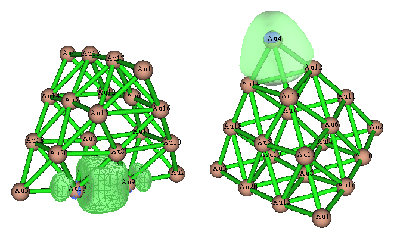

此例又一次表明，Pipek-Mezey定域化分析往往可以直接代替AdNDP分析。

由于前面我们看到NBO3.1分析往往极度不合理，这里我们就不再用NBO3.1分析了，直接看NBO6的结果。做NBO分析后，发现程序给出了一堆乱七八糟无意义的轨道，和实际电子结构完全不对应，列举几个：

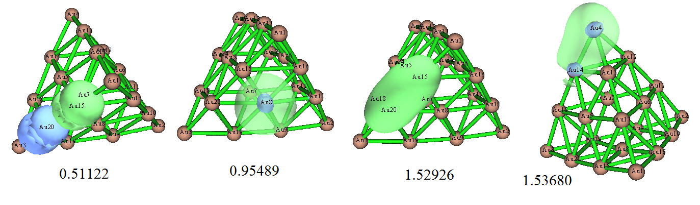

不仅形状怪，毫无意义，它们的占据数离2.0也都差得较大，说明靠一套NBO轨道，根本没法哪怕定性正确表现体系的电子结构。

再改用NLMO分析，发现这回结果定性正确了，图景和Pipek-Mezey定域化轨道很相似：

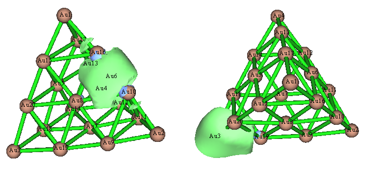

上图左边那个轨道很正确，没问题，但是上图右边那个NLMO还不很理想，因为其等值面形状明显是扭曲的，不符合体系的对称性。之所以会这样，是因为NBO程序没法自动搜索>3中心的轨道，因此当前这个轨道是被当做Au3-Au19双中心轨道来产生的。

## 7 实例5：苯与菲

在讨论更复杂的菲之前，我们先看看苯的占据的pi型MO轨道和Multiwfn做定域化之后的相应轨道，如下所示

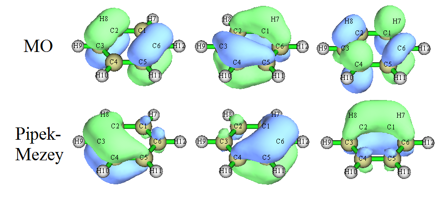

可见定域化明显起到了效果，每个LMO的形状都一致。由于苯的6中心pi键的离域特征非常强，因此即便定域化之后，而且哪怕等值面数值已设为0.05这样挺大的值，还是看到每个LMO并不仅仅定域在两个原子之间，而是同时一定程度离域到相邻原子。因此这三个LMO合在一起，是可以表现出高度的六中心离域特征的。如果大家产生NBO轨道的话，则会发现这些轨道都被完全定域到双中心了（但占据数仅为1.66），从而强行、误导性地把体系电子结构描述成单双键交错的Lewis式。

然后我们再看菲的情况，此体系在《使用AdNDP方法以及ELF/LOL、多中心键级研究多中心键》中分析过。无论是ELF-pi、AdNDP还是本文用的LMO分析，都可以得到两边的六元环的共轭程度较高的结论。对应于右边的六元环的pi电子的AdNDP和LMO轨道列于下图

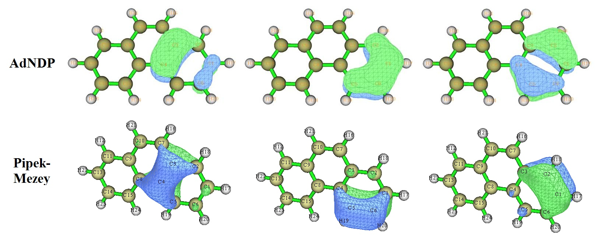

可以看到，无论是AdNDP还是LMO轨道，菲的两端的六元环的与pi电子有关的轨道图形都与芳香性很强的苯很形似，只不过受到实际化学环境的影响有一些变形而已。因此，我们可以得到菲的两侧的六元环的芳香性较强的结论。对此体系，用NLMO方法得到的LMO轨道和Pipek-Mezey方法得到的LMO轨道很相似。

而对于菲中间的六元环的芳香性，通过LMO的话不是很好讨论。因为我们会发现还有个C7-C10之间的定域性pi轨道，如果和主要覆盖C8-C9、C4-C3的定域性pi轨道放在一起的话，仿佛中间的六元环也有挺强芳香性。然而如果用AdNDP分析，在找六中心轨道的时候，就可以区分出芳香性差异了。当我们按照前述AdNDP的博文把sigma电子对应的轨道都挑走并从密度矩阵中扣除其贡献后，对中心的六元环和两侧的六元环搜索六中心AdNDP轨道时，会发现对两侧的环找出来的三个六中心轨道占据数是2.000, 1.985, 1.821，而中间的环是1.994, 1.770, 1.684，从占据数上看明显后者更小，即中间的环上电子离域程度不及两边的环。实际上，通过六中心键级、ELF-pi分析也都能得到相同结论。因此选出六中心AdNDP轨道时应该选边缘环的。此例说明LMO分析在某些情况下并无法完全替代AdNDP分析。

## 8 直观展现所有LMO的中心位置例子：多巴胺

前面提到Multiwfn可一次性把所有LMO的中心位置给出来，便于直观地观看产生的LMO都是怎么分布的，这样也便于我们快速找到我们感兴趣的LMO。注意，用PM定域化的话，C-C双键会以sigma-pi分离形式展现，此时sigma-LMO的中心和pi-LMO的中心位置往往挨得很近，难以分辨，而FB定域化就没有这个问题，每个双键被描述为两个香蕉键，其中心是明显分开的。这里用多巴胺作为例子演示一下Multiwfn自动生成LMO中心位置的功能。由于多巴胺里面有芳环，如果用PM定域化的话，芳环里的有的C-C键会被倾向描述成sigma和pi两个LMO轨道，因此这里用FB定域化以使得LMO中心位置总能分得开。

在Multiwfn里输入：  
dopamine.fch  
19  //轨道定域化  
-8  //启用产生LMO中心位置的选项  
-6  //修改定域化方法  
10  //Foster-Boys  
1  //定域化占据轨道（非占据的LMO的中心位置一般没什么意义，无需考察）

如屏幕上的提示所示，在Multiwfn导出记录了LMO的new.fch并把它再自动载入后，程序对每个LMO的中心位置进行了计算，并且把每个中心作为Bq原子（鬼原子）加入到了当前体系。同时在当前目录下输出了LMOcen.txt，其中记录了各个LMO中心坐标，以及与新加入的Bq原子序号的对应关系。之后程序还问你是否做LMO的偶极矩分析，这里选择n跳过。

现在进入主功能0，直接就能看到下图了。由于Multiwfn已经自动将主功能0里的显示风格设成了便于观看Bq原子的特殊情况，所以图像和平时在主功能0里看到的不同。

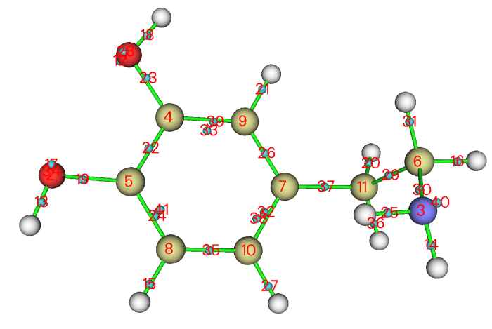

当前设定下此图中Bq原子序号是从1开始排的，因此其序号正好和LMO序号直接对应，故各个LMO的位置从这张图上一目了然。比如从这图上我们可以看到LMO24和LMO41一起主要描述苯环上的一个C-C键，LMO40主要描述氮的孤对电子。将LMO40用0.1等值面显示出来就是下图（为了让轨道等值面更平滑，已经在GUI菜单上的Isosur. quality里将格点数明显设得更大）

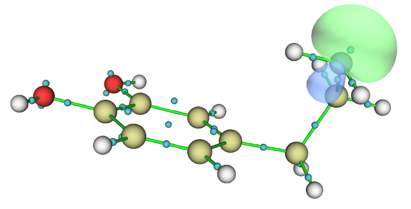

注意，当前体系里面加入的Bq原子由于没有携带基函数，对于Multiwfn程序来讲属于“异常”状态，因此对当前体系再进行波函数分析的话是没有意义的，还可能导致Multiwfn崩溃。因此当前情况就看看结构和轨道图就行了，不要再做其它波函数分析。

## 9 对LMO计算偶极矩考察键的极性

关于这点，原理请参阅Multiwfn手册3.22节，实际例子参看手册4.19.4节。从中可以看到通过在产生LMO中心位置后，再做一些额外考虑得到LMO的偶极矩后，就可以用来讨论键的极性问题。

## 10 总结

Multiwfn的轨道定域化功能非常有用，得到的LMO轨道可以把体系中的关键电子结构特征通过大家熟悉的轨道模型很好地展现出来，对于分析电子结构非常有帮助。

对大量情况，轨道定域化分析其实可以代替比较麻烦、有较强任意性、需要化学直觉和使用经验的AdNDP分析，得到的结果是定性一致的。虽然有些复杂情况，特别是牵扯到很多中心离域的问题，必须通过AdNDP才能找出理想的能恰当描述实际电子结构的轨道，但定域化轨道分析产生的轨道图形，对于做AdNDP轨道搜索往往能提供一些有益的辅助和参考。

对于电子结构复杂、电子离域性强的体系，NBO分析有害无益，大多时候会给出定性错误的结论，如果基于其高占据轨道去讨论问题，那纯粹就是瞎讨论，千万别被坑了。NBO3.1对于复杂情况搜索出的无论是NBO还是NLMO，往往都是严重离谱的。NBO6使得结果合理性往往有明显改善，其产生的NLMO基本合理了，和Pipek-Mezey轨道定域化的结果定性一致，但是给出的NBO轨道经常还是不足以定性正确描述体系电子结构。对于涉及到>3中心共享电子特征的体系，无论是NBO3.1还是NBO6，无论是NBO还是NLMO，都根本没法用，因为NBO只能最多自动搜索3中心轨道。此时如果还试图用NBO或NLMO讨论，那纯属搞笑。

总之，讨论电子结构复杂的，特别是牵扯多中心共享电子的体系，Multiwfn的轨道定域化分析很有用也很好用，有局限性的地方靠AdNDP分析也可以弥补，而NBO分析强烈不建议使用。NBO程序给出的NBO轨道比起LMO轨道其实也就一个好处，即可以通过考察E2讨论超共轭，而基于LMO是没法做E2的（可以证明数值精确为0）。不过，当NBO轨道本身就是定性错误时，E2分析也没有丝毫意义。

除上述例子外，Multiwfn手册的4.19节还有其它轨道定域化分析例子，包括分析SN2反应过程中LMO轨道的变化，以及通过LMO考察[Re2Cl8]2-中Re-Re四重键特征。在《谈谈18碳环的几何结构和电子结构》（<http://sobereva.com/515>）、《一篇最全面、系统的研究新颖独特的18碳环的理论文章》（<http://sobereva.com/524>）中笔者还利用定域化轨道考察了18碳环体系中被一些人误当成是三重键的C-C键特征，对其真正的成键方式予以了正确的解释。在《一篇文章深入揭示外电场对18碳环的超强调控作用》（<http://sobereva.com/570>）里我还用定域化轨道非常清晰直观地展现出了18碳环被强外电场近乎拔下来的电子。**这些文章都非常推荐一看！**
