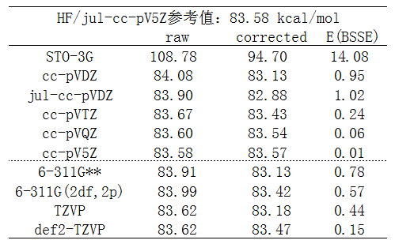
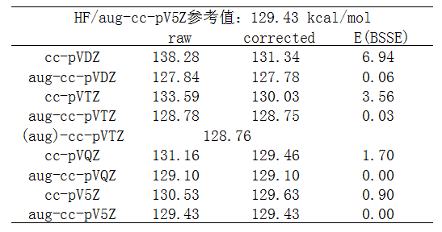

**计算化学键键能时以counterpoise方式考虑BSSE不仅是多余的甚至是有害的**

Considering BSSE in counterpoise scheme when calculating chemical bond energy is not only redundant but even harmful

文/Sobereva @[北京科音](http://www.keinsci.com)    2017-Jun-4

## 1 前言

BSSE在很早以前写的《谈谈BSSE校正与Gaussian对它的处理》（<http://sobereva.com/46>）中已经介绍过了。也正如文中提到的以及在无数文献中大家看到的，考虑BSSE影响的场合几乎都是在计算弱相互作用的时候。虽然BSSE可以说无处不在，只要使用原子中心基组时就必定有BSSE效应，但实际上，通过整体减片段能量来得到化学键键能的时候，只要基组用得基本靠谱，那么再用常规的counterpoise方式考虑BSSE问题就纯属多余，白浪费时间。很多初学者对BSSE的本质一知半解，容易胡思乱想，对BSSE可谓敏感得至极，稍一牵扯整体减片段的计算，不管是什么具体情况，脑子中都立马瞬间闪现“BSSE”四个字母（大量初学者对于自旋污染也是这个毛病，凡是开壳层，言必曰自旋污染）。另外，很多审稿人也是一知半解就瞎出馊主意，明明文章算的是化学键键能，基组也合理，某些低水平审稿人偏偏非要让考察BSSE影响（笔者发的一篇JCC就碰到过，被笔者义正言辞怼回去了，之后对方也没再说什么），搞得一些本来持观念正确的作者，也开始怀疑自己的立场。一些IF不低的期刊文章中算键能用counterpoise的例子也不少，导致一些初学者错误地盲目模仿。  
  
恰逢昨日公社群里又有人谈起自己文章中算化学键键能时，审稿人让自己考虑BSSE。为了以正视听，这里通过两个极为简单的计算化学键键能的例子，通过考察不同基组时的结果，证明算化学键键能时只要基组合理，考虑BSSE问题不仅纯属多余，甚至还可能令精度不增反降。如果不知道基组怎么样选才算合理，看此文《谈谈量子化学中基组的选择》（<http://sobereva.com/336>）。第一个体系是乙烷的C-C键均裂成两个甲基，第二个体系是NaCl异裂成Na+和Cl-，这就把最典型共价键和离子键的情况都考虑了，至于极性共价键会在文末再做简单提及。本文理论方法使用HF。参考结果是在jul-cc-pV5Z下计算得到的，此时基组完备性极高，结果已达到HF极限，BSSE的影响可以认为已经为0。计算通过G09 D.01完成。

校正BSSE问题的方式不止Boys提出的counterpoise一种，Grimme提出的gCP也挺知名（这里介绍了：<http://sobereva.com/214>），但为了叙述起来简单，下面凡是说BSSE的时候都是指使用counterpoise方式考虑的。要注意正确理解本文传达的意思：在基组选用合适的情况下，计算键能时不适合用counterpoise方式试图刻意修正此时本来就没必要考虑的BSSE问题，刻意这么做甚至还有害处。而带着gCP的话，对这种情况既没额外的好处也没坏处，因为对于短距离的作用gCP对结果不起明显影响，而对于中、长距离的真正可能需要解决BSSE对弱相互作用不良影响的时候gCP才会起到作用。  
 

## 2 乙烷均裂

乙烷均裂成两个甲基自由基过程的能量变化如下，可以视为是此体系C-C键键能。计算时没有考虑断键后甲基自由基的结构弛豫。raw一列对应没考虑BSSE的结果，corrected是考虑BSSE后的结果，E(BSSE)就是BSSE校正能（对整体能量的修正量）。  

  
我们先只看图中虚线上方的数据，可以看出以下几点：  
(1)平时我们试图计算定量准确数据的时候，基组都得3-zeta或以上。从数据看到在cc-pVTZ这个档的时候，E(BSSE)已经非常小了，考不考虑BSSE无所谓，本身理论方法的误差比这大得多。到了cc-pVQZ时，BSSE则几乎不产生任何影响。  
(2)在基组基本合理的情况下，具体来说从cc-pVDZ开始，BSSE校正后结果并非变得更好！与参考值相对比，可见不考虑BSSE时高估了键能，而考虑BSSE后又低估了键能。仔细看的话，从cc-pVTZ开始，或者从cc-pVDZ加弥散开始，考虑BSSE后结果的误差反倒更大！这反映出counterpoise方法本身的问题，往往矫枉过正，为什么会这样在《谈谈BSSE校正与Gaussian对它的处理》中提到过。  
(3)STO-3G这种破基组误差极大，算出来的键能误差高达25kcal/mol。考虑BSSE后结果误差依然很大，但改进不小，达到14kcal/mol。改进程度这么大是容易理解的，毕竟极小基完备性非常低，考虑BSSE校正势必会带来显著补偿效果。然而，谁在实际中也不会用极小基，因此完全不能用来说明考虑BSSE对于计算键能是有必要的。  
(4)什么时候该加弥散在《谈谈弥散函数和“月份”基组》（<http://sobereva.com/119>）已经充分谈过了，当前的计算显然不属于此文提及的情况。因此正如预期的，给cc-pVDZ加弥散前后结果的差异甚微，才不到0.2kcal/mol，这还是对于小基组的情况。而比较表中cc-pV5Z和参考值jul-cc-pV5Z的结果，则看到加弥散对结果没有丝毫影响，因为cc-pV5Z对此体系已经充分达到HF极限了。  
(5)从数据可见，HF计算（也包括DFT计算），cc-pVTZ已经足够大了，提升到cc-pVQZ根本没什么意义，对结果影响的程度已经远低于方法本身的误差。只有高级别电子相关方法才有必要上到cc-pVQZ。  
  
笔者还顺手测了几个其它基组，即上图中虚线下面的数据。从数据中可见，给6-311G**增加更多极化函数，即增大到6-311G(2df,2p)并不会给精度带来什么改进。比TZVP（具体指def-TZVP）极化函数更多的def2-TZVP也并没显示出精度比TZVP有什么优势。这也正一定程度反映出《谈谈量子化学中基组的选择》里提到的对于HF/DFT加很多极化函数是白浪费时间（当然，极化函数起到的改进和体系、研究的问题有关，不能以偏概全）。从数据中还看出，TZVP的结果就已经十分接近参考值了，比大小相仿佛的6-311G**和比它更大的6-311(2df,2p)结果还好，这也是我为什么鼓励使用def/def2基组代替常用的Pople系列基组的原因。def2-TZVP虽然对此体系的raw结果和TZVP相同，但并非比TZVP没有本质上改进，从它更小的BSSE校正能上可以间接反映出def2-TZVP的完备性比TZVP更高。注意TZVP、def2-TZVP在BSSE校正后误差比原先更大，再次反映出只要基组质量不错，去额外花时间做counterpoise来试图校正BSSE只会自取其辱。  
  
  

## 3 NaCl异裂

NaCl解离成Na+和Cl-过程的能量变化，也即NaCl的异裂键能如下。  

  
由于无论是在NaCl中，还是Cl-状态，Cl都带明显负电荷，因此测试中对每个基组都考虑了带和不带弥散函数时的结果，因为众所周知，弥散函数对于计算阴离子体系或含有显著带负电荷的原子的体系的能量必须的，前面列的博文里都强调过。  
  
先看不考虑BSSE时的数值，即raw那一列。从数据可见，弥散函数对此体系是非常重要的。虽然随着cc-pVnZ的序数n增大，结果也能逐渐向参考值收敛，但是有弥散函数时误差小得多。比如aug-cc-pVTZ的误差都已经明显小于cc-pV5Z。哪怕只加最低限度的弥散函数，也能大幅改进结果。比如对cc-pVDZ只加上一层sp弥散函数而忽略d弥散函数成为maug-cc-pVDZ，误差从8.8kcal/mol降低到3.0kcal/mol。如果把d弥散函数也考虑则还会有进一步改进，误差就只有1.6kcal/mol了。  
  
表格中(aug)-cc-pVTZ指的是只对带显著负电荷的Cl用aug-cc-pVTZ，而Na还用cc-pVTZ。可见结果和aug-cc-pVTZ几乎没任何差别。这充分表明，算离子键键能时，只对带明显负电的原子用弥散函数就足够了。  
  
然后我们再看BSSE如何影响结果。从数据中可见只要带了弥散函数，BSSE的影响就微乎其微了，完全不需要考虑之。而不加弥散函数的时候BSSE校正能挺大，且考虑BSSE时结果会明显与参考值更相符。另外还看出，随着cc-pVnZ的序数增加，由于基组逐渐变得完备，BSSE校正的影响逐渐降低。  
  
带弥散函数（只给带显著负电的原子带就够了）和通过counterpoise考虑BSSE，都能使cc-pVnZ计算离子键键能的结果有显著改进，而又带弥散函数（哪怕只是最低程度的单层sp弥散）又考虑BSSE则毫无必要。而带着弥散函数时，不仅键能的描述得到改进，当前体系其它各方面性质的描述都会得到很大改进（如静电势、极化率），而用counterpoise考虑BSSE的话改进的只有键能，而且在优化、振动分析的时候则几乎没法用，因为此时没有解析导数（而且往往还没法利用对称性加速计算）。  
  
  

## 4 总结与讨论

虽然本文只通过最简单的非极性共价键和离子键体系的数据进行讨论，但可以以小见大。最主要结论是，只要基组选用合理，那么计算化学键键能根本没必要考虑BSSE！用counterpoise来考虑的话，甚至结果精度反倒可能更差。何谓基组选择合理？只要基于《谈谈量子化学中基组的选择》文中的讨论就行了。对于算键能来说，基组这样设是合理且划算的：算共价键体系键能时用3-zeta级别基组（如果是后HF方法，建议4-zeta级别），弥散函数不需要加；算离子键键能时，弥散函数一定要有，但只给带显著负电的原子加上就行了。  
  
对于算键能，考虑BSSE并非完全无用，但仅对于基组明显太小，或者该加弥散时候没加的时候才对结果有显著改进。相信除了菜鸟以外，谁也不会把基组选得那么烂。  
  
当你的文中计算了键能，而且基组使用合理的时候，却遇到审稿人乱提要求让你考虑BSSE的时候，大可直接引用本文的数据给怼回去。  
  
作为本文例子的乙烷均裂和NaCl异裂属于很理想的情况，而对于实际经常碰到的极性键，counterpoise方法甚至从原理上就根本没法用。counterpoise是通过下面的方式计算对AB整体能量的修正量的：  

E(BSSE) = [ E_A(A的基组)-E_A(AB的基组) ] + [ E_B(B的基组)-E_B(AB的基组) ]

因此用这个式子的时候牵扯到A、B计算的状态的选取。当A-B之间是极性键时，是把A和B都当做中性，还是一个当做阳离子一个当成阴离子？无论哪种情况，A、B和它们在整个分子中的状态都不完全一样，而状态的选取不同，E(BSSE)会相差很多。比如计算H3C-F在cc-pVTZ下的E(BSSE)结果如下：  
CH3当阳离子、F当阴离子，E(BSSE)=8.30kcal/mol  
CH3和F都当中性自由基，E(BSSE)=0.52kcal/mol  
可见，用counterpoise方式考虑BSSE时，计算的键能会直接依赖于CH3和F状态的选取，结果差异高达7.8kcal/mol。然而无论选取哪种状态都不合理，因为实际中CH3F分子中甲基只是转移了零点几个电子给F。故强行使用counterpoise必会导致最终计算的键能误差增加，完全是费力不讨好！  
  
综上所述，计算键能时基组选好了就完了，不要管BSSE。希望此文能够以正视听。
