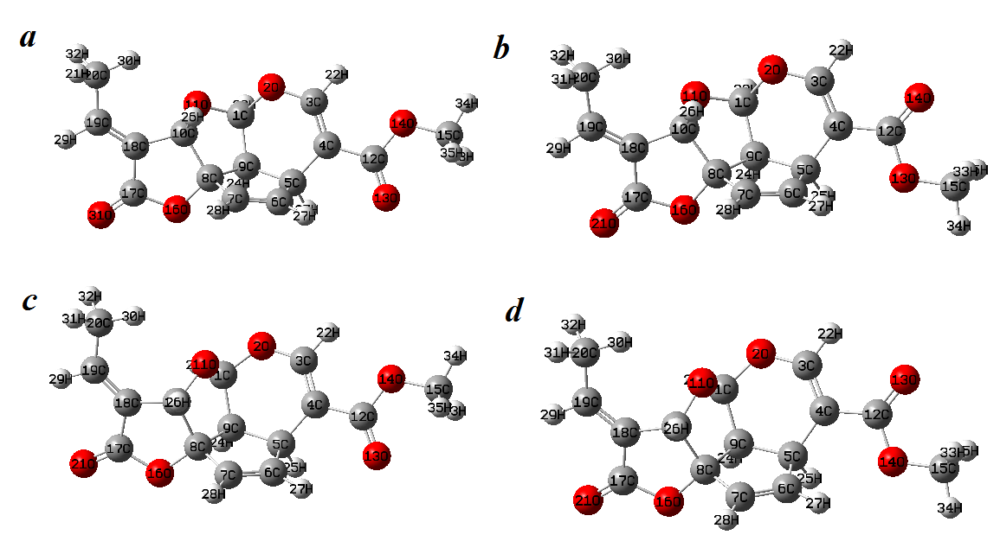
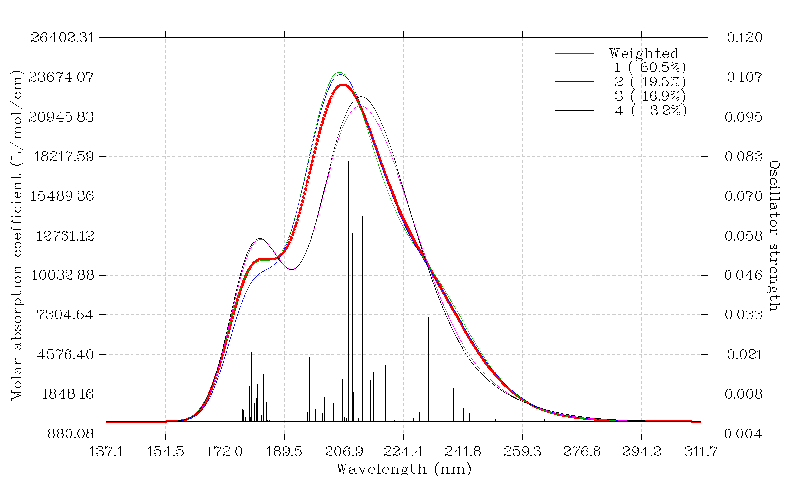
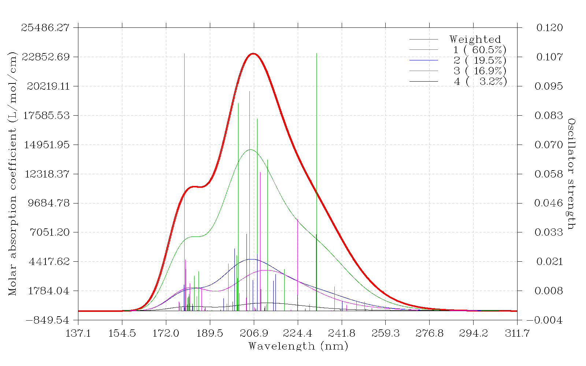
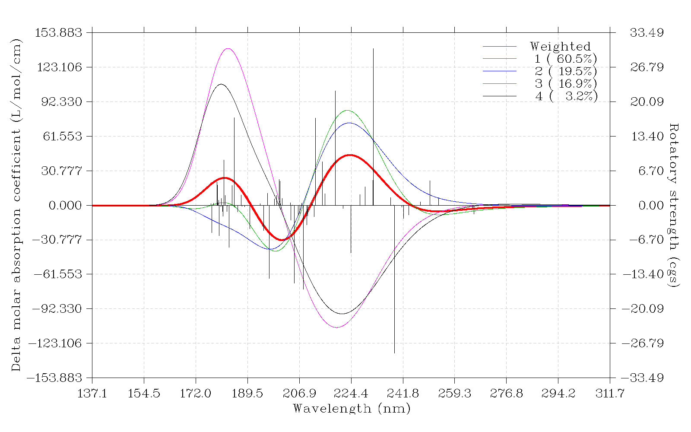
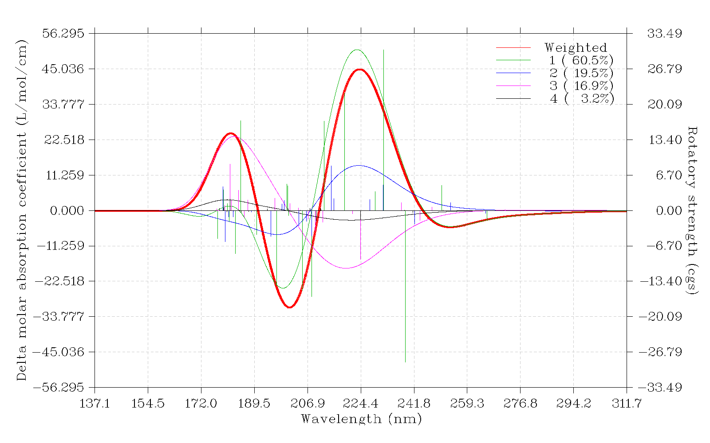
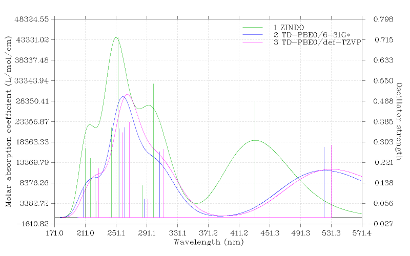

**使用Multiwfn绘制构象权重平均的光谱**  
Using Multiwfn to plot conformationally averaged spectrum  

文/Sobereva @[北京科音](http://www.keinsci.com/)

First release: 2017-Jun-23  Last update: 2020-Jun-18

## 1 前言

众所周知，柔性分子有大量构象，并且其中许多低能的构象在当前研究的温度下都是有不可忽略的分布比例的，热平衡状态时它们的比例通常使用Boltzmann公式基于高精度计算的各个构象的相对自由能来计算，见《根据Boltzmann分布计算分子不同构象所占比例》（<http://sobereva.com/165>）。  
  
不同构象的光谱往往是不同的，甚至有定性差异，特别是圆二色谱的构象敏感性颇高。为了得到能够和实际较相符的理论光谱，我们计算柔性体系光谱时应当对分布>10%（更严格时，分布>5%）的所有构象分别算出的光谱曲线，并按照构象分布比例进行加权线性组合。下面管这种方式得到的理论光谱叫做权重平均光谱或构象平均光谱。  
  
Multiwfn（官网<http://sobereva.com/multiwfn>）虽然主要用处是波函数分析，但经常关注此程序的人一定知道Multiwfn也具有非常强大的绘制光谱的功能，在《使用Multiwfn绘制红外、拉曼、UV-Vis、ECD、VCD和ROA光谱图》（<http://sobereva.com/224>）中做了介绍，没看过的话一定要先仔细看看。从Multiwfn 3.4版开始，Multiwfn支持直接绘制构象权重平均光谱，这大大简化了绘制这种光谱的操作步骤，本文就通过实例介绍怎么实现，比起使用任何其它程序都要方便得多。  
  
本文的量化计算使用Gaussian09 D.01完成，最新版Multiwfn可在其官网免费下载。不熟悉Multiwfn的建议参看《Multiwfn入门tips》（<http://sobereva.com/167>）。本文的计算除了上述博文外还涉及以下博文的知识，缺乏基础者应当先看看：  
《谈谈隐式溶剂模型下溶解自由能和体系自由能的计算》（<http://sobereva.com/327>）  
《Gaussian中用TDDFT计算激发态和吸收、荧光、磷光光谱的方法》（<http://sobereva.com/314>）  
《谈谈谐振频率校正因子》（<http://sobereva.com/221>）

**提醒：使用本文的方法通过Multiwfn绘制光谱，请在你的文章里引用Multiwfn启动后提示的程序原文！**

## 2 实例：绘制plumericin的构象平均电子光谱

这里通过plumericin（鸡蛋花素）作为例子，演示怎么绘制其构象平均的UV-Vis和ECD光谱，为了简单起见不考虑溶剂效应。plumericin有四种值得考虑的构象，分别用a,b,c,d表示，如下所示  
  
  
  
a与b、c与d的差异在于图右端酯基的方向，a与c、b与d的差异在于O11是在内侧还是外侧。  
  

### 2.1 准备

对这四个构象，依次做以下计算  
(1)在B3LYP/6-31G*下进行优化，得到以下计算用的结构  
(2)在B3LYP/6-31G*下做振动分析，计算时带着此级别下的ZPE校正因子0.9806，得到自由能校正量  
(3)在M06-2X/def2-TZVP下做单点计算  
(4)将(2)的自由能校正量与(3)的单点能相加，得到准确度较好的自由能。然后根据玻尔兹曼公式计算常温下的分布比例  
(5)用PBE1PBE/TZVP TD(nstates=20)关键词在PBE0/def-TZVP级别下以TDDFT方法计算最低的20个激发态  
  
第(5)步计算的输出文件都已经提供在了Multiwfn压缩包里的examples\spectra\weighted文件夹中。  
  
计算构象分布比例需要把自由能算得非常准。当前计算级别，只能说能给出个定性正确的分布比例，但要求定量结果较好的话，应当用更高级别计算单点能，比如DSD-PBEP86-D3/def2-QZVP。如果考察溶剂下的情况，一定要带着溶剂模型才行，否则分布比例可能严重错误。当前计算得到的a,b,c,d构象分布比率分别为60.46%、19.50%、16.86%、3.17%。因此，构象平均的UV-Vis或ECD光谱应当计算如下：  
构象平均光谱=0.6046*a的光谱+0.1950*b的光谱+0.1686*c的光谱+0.0317*d的光谱  
  
  

### 2.2 绘制构象平均的UV-Vis谱

我们写一个叫做multiple.txt的文件（必须叫这个名字），内容如下。里面每一行是上面电子激发计算的输出文件路径，之后是相应构象的出现比率。  
examples\spectra\weighted\a.out 0.6046  
examples\spectra\weighted\b.out 0.1950  
examples\spectra\weighted\c.out 0.1686  
examples\spectra\weighted\d.out 0.0317  
  
文件路径写相对路径还是绝对路径都行。这里写的是相对路径，是对于“当前目录”而言的，如果不知道什么叫“当前目录”，看《将文件快速载入Multiwfn程序的几个技巧》（<http://sobereva.com/237>）。注意如果你用的是Linux环境，multiple.txt里涉及的有的文件的路径里有/符号或空格，则必须把路径两边加上双引号，否则文件没法载入。  
  
如手册3.13.2节所示，Multiwfn绘制光谱绝不仅仅支持Gaussian输出文件，比如ORCA、sTDA的输出文件也支持，因此multiple.txt里引入的文件也可以是其它类型的，甚至可以不同来源文件混用。  
  
启动Multiwfn，载入multiple.txt，然后依次输入  
11  //绘制光谱的主功能  
3  //UV-Vis  
0  //显示光谱  
  
马上看到下面的图  
  
  
图中红色粗曲线是权重平均后的UV-Vis光谱，可以直接和实验对照。如图例所示，绿、蓝、粉、黑色曲线分别是a,b,c,d四种构象的光谱。从这样的图上，非常便于比较各个构象光谱以及权重平均光谱的差异。由于构象a的比例达到60.5%，占了绝对主导，因此权重平均的光谱整体上也和构象a的比较相似。  
  
用Multiwfn作过单个体系的光谱的人都知道图中黑色竖线对应的是量化程序直接算出来的激发能和强度数据，经过展宽就产生了理论光谱。当前图上黑色竖线是所有构象的竖线的集合，但每个构象对应的竖线的高度都已经乘过了相应的权重值。因此，可以认为当前图中红色粗曲线是由图上这些黑色竖线直接展宽产生的。  
  
Multiwfn还可以把各个构象对权重平均的光谱的贡献曲线直接绘制出来，由此便于讨论实际光谱是如何构成的。关闭刚才的图，然后选一次选项18，然后再选0重新绘制光谱，得到下图  
  
  
此图中每个构象各自的光谱曲线高度已经乘上了相应的分布比率，因此，图中四个构象光谱曲线高度之和就是红色粗线；换句话说，图中绿、蓝、粉、黑线分别对应于a,b,c,d构象对权重平均光谱的贡献。从此图上明显看出，a构象的贡献是最显著的。  
  
此图中竖线位置和高度和前一张图一样，但是此图里不同构象对应的竖线用了不同的颜色，和曲线颜色相对应。由于此图中无论是曲线高度还是竖线高度都已经是乘过构象权重值的，所以可以认为每个构象的光谱曲线是由相同颜色的竖线展宽产生的。  
  
  

### 2.3 绘制构象平均的ECD谱

所有输入文件同上一节。还是启动Multiwfn，载入multiple.txt，然后依次输入  
11  //绘制光谱的主功能  
4  //ECD  
2  //载入速度表象的转子强度  
   
为了下面便于讨论，我们先选16让程序把权重平均的ECD谱的极大点和极小点位置都找出来，如下所示  
Local maximum X:       181.6653      Value:        24.5974  
Local maximum X:       223.9452      Value:        44.9789  
  
Local minimum X:       158.1958      Value:        -0.0081  
Local minimum X:       200.9999      Value:       -30.7966  
Local minimum X:       253.6460      Value:        -5.2244  
  
然后选0显示光谱，看到下图  
  
  
曲线和竖线的含义和上一节相同，不再累述。前面说过圆二色谱对构象比较敏感，确实，当前的ECD图上，各个构象光谱的差异比起它们在UV-Vis中明显更大。相对来说，a和b的谱较相似，c和d的较相似。虽然构象a的出现比例占绝对优势，因此其ECD谱（绿曲线）和权重平均的谱（红曲线）相似程度最高，但是，此图也反映，只考虑这一个构象还是不充分的，因为在<190nm的区域，如果不考虑其它构象的影响，则181.7nm处的峰就难以凸显出来。  
  
关闭上图。为了绘制出各个构象对权重平均ECD谱的贡献，选一次18，再选0，看到下图  
  
  
从这个图上可以非常直观地看出权重平均ECD谱的构成。181.7nm的峰很明显是粉色曲线（构象c）所贡献的，因为它几乎和红粗线重合，而构象a,b,d在此处的贡献不仅小，而且由于贡献有正有负，彼此也很大程度抵消了。对201.0nm、253.6nm的负峰和223.9nm正峰，构象a（绿线）显然起到了主导性的贡献，因为其曲线很接近红粗线，构象b对201.0nm和223.9nm处的峰的形成也起到了推波助澜的作用，因为其贡献和构象a的符号是相同的。构象c（粉线）在223.9nm处捣蛋，产生显著负贡献，要是没有它，此处的红粗线的峰高度能明显更高。  
  
  

## 3 总结

本文通过很简单的例子说明如何结合主流量化程序和Multiwfn绘制构象权重平均的光谱。可见过程极为简单，写个multiple.txt文件列出各个构象的输入文件以及相应比例即可。而且还可以把所有构象的曲线同时绘制出来，或者把各个构象产生的贡献绘制出来，对讨论权重平均光谱的特征极为有益。Multiwfn还提供了大量选项可以调节绘图效果，可以得到能直接用于发表的图。  

另外，在绘图界面里用选项2，可以导出spectrum_curve.txt和curveall.txt到当前目录下。前者记录的是权重平均的光谱曲线数据，而curveall.txt记录的是各个构象的曲线数据，每个构象对应一列。这些文件可以导入Origin等程序来作图，届时可以更灵活地调节图像效果。

在绘图界面里还有选项21 Set status of showing weighted curve and curves of individual systems，进入其中后可以选择是只显示构象权重平均的曲线、只显示每个体系各自的曲线，还是二者同时显示。

本文的体系需要考虑的构象比较少，手工计算不麻烦，但如果体系可能有很多构象，自己懒得去一一搜索，那么最理想的做法是使用Molclus程序做构象搜索，参见《使用molclus程序做团簇构型搜索和分子构象搜索》（<http://bbs.keinsci.com/thread-577-1-1.html>），使用其中的gentor组件可以很方便地大批量产生初猜构象，见《gentor：扫描方式做分子构象搜索的便捷工具》（<http://bbs.keinsci.com/thread-2388-1-1.html>）。将gentor+molclus+量化程序结合使用，你会发现超级灵活、超级便捷，而且希望精度高一些（但计算耗时高）还是希望速度快一些（计算精度低），完全可以通过调节所调用的量化程序的关键词来自由控制，用熟了之后就基本再也不想用其它构象搜索程序了。

## 附：同时绘制多个体系的光谱

在2017-Aug-14及之后更新的Multiwfn当中也可以同时直接绘制多个体系的光谱，比如可以把不同分子、不同级别下的光谱绘制在一起。做法很简单，把前文的multiple.txt里的权重值改成图例文字即可，这样就不会产生和显示总光谱，而且图例可以自定义。比如multiple.txt可以写成这样  
examples\spectra\indigo\ZINDO.out ZINDO  
examples\spectra\indigo\TD-PBE0.out TD-PBE0/6-31G*  
examples\spectra\indigo\TD-PBE0_TZVP.out TD-PBE0/def-TZVP  
结果如下，同时把三种不同计算级别的谱图显示出来了，便于对比。完整的绘制的例子见Multiwfn手册4.11.6节。

