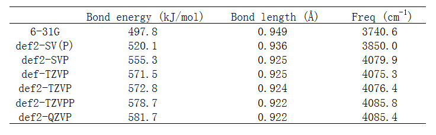
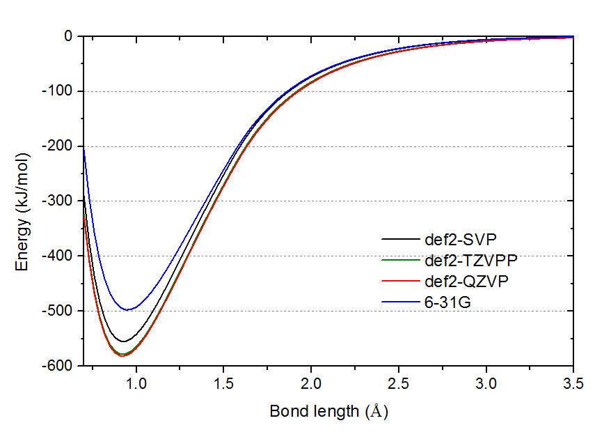
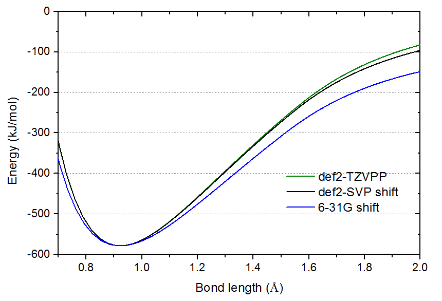

**浅谈为什么优化和振动分析不需要用大基组**

A brief discussion on why optimization and vibration analysis do not require use of large basis sets

文/Sobereva @[北京科音](http://www.keinsci.com)

First release: 2017-Aug-26   Last update: 2024-Feb-27

  
量化计算中有两个常识，大部分人想必都知道  
(1)优化和振动分析必须在相同级别下进行  
(2)在高耗时的优化+振动分析时用中小基组，而只在随后的单点能计算时才用大基组，这样做比起所有过程都用大基组耗时大为降低而精度降低很少  
   
其中(1)的原因很好解释，因为如果振动分析用的级别（包括各种影响势能面的因素，如积分格点精度、溶剂模型等）与几何优化时不同，相当于振动分析时并不是在势能面的极小点的位置进行的（即便用的结构是之前优化得到的），此时振动分析结果显然没有意义。而(2)的原因，是因为优化和振动分析结果对基组的敏感性远低于能量计算。正好最近在QQ群里有人又提到此事，笔者遂通过一个简单的HF分子的计算数据来展现这一点。虽然不能光用一个分子就以偏概全，但很大程度上是能够以小见大的。计算使用Gaussian16完成，理论方法为B3LYP。如果缺乏基组选用的基本知识，看此文前强烈建议仔细阅读《谈谈量子化学中基组的选择》（<http://sobereva.com/336>）。  
  
来看不同基组下计算的H-F键能（即E(H)+E(F)-E(HF)），优化的键长，以及谐振频率。计算分子能量时键长用的是相应基组下优化的。  

  
首先看def2-SVP/TZVPP/QZVP这个序列的数据。按照这个顺序，基组质量是系统性地提升的，其基组尺寸类似于cc-pVDZ/TZ/QZ序列。我们通常说，优化用2-zeta带极化这个档通常就够了，从上表确实可见相对于很大基组def2-QZVP的结果，def2-SVP的键长误差才0.3%，振动频率误差才0.13%，如果要求不高的话这点误差完全可以接受，然而其键能的误差则达到26.4kJ/mol，相当于4.5%，完全不能忽略。再对比def2-TZVPP和def2-QZVP的结果，前者相对于后者的键长、振动频率的误差根本察觉不到（仅0.0003埃和0.4cm-1），但能量上还是有3kJ/mol的误差，对于高精度热力学数据计算，这种程度误差是仍是不可忽略的，而且高精度计算通常是用后HF，此时def2-TZVPP与def2-QZVPP在算能量相关问题上的差距会更大。上面的数据充分说明优化+振动分析结果对基组的敏感性远低于能量，因此前者用的基组建议比后者低一个档来节约时间。另外值得一提的是，由于做振动分析时通常还会考虑频率校正因子（详见<http://sobereva.com/221>），因此用大基组在精度上实际上并不会带来任何好处。虽然原理上来说在大基组优化的结构下用大基组算能量，比起在中小基组优化的结构下用大基组算能量，对于能量相关问题的计算准确度要更高，但由于中小基组下优化的误差已经不大，再加上在极小点附近势能面非常平缓（即结构的稍微变化基本不会带来什么能量变化），因此不用担心优化+振动分析用中小基组来节约时间的做法会带来能量计算精度上的损失。如果你真是想要很高精度结构和能量数据，那么优化用到def2-TZVPP就已经绝对足够了，再提升完全是白费时间，而算能量时基组则完全有必要用到def2-QZVP，特别是对于后HF计算而言。  
  
我们再关注一下上面表中其它基组的结果。如《谈谈量子化学中基组的选择》提到的，对于一般问题没有必要给氢加极化，但是和氢有密切相关的问题则应当给氢加极化，当前就是此种情况。对于HF分子，def2-SV(P)等价于砍掉了def2-SVP上氢的p极化函数的版本，def2-TZVP等价于砍掉了def2-TZVPP上氢的d极化函数的版本。由数据可见，砍掉氢的极化对结果影响确实不小，特别是连p极化都砍掉时，哪怕是键长、振动频率的误差的增加都已经到令人恼火的程度。由于给氢加p极化对耗时增加其实不算太多（相对于给重原子增加高角动量极化函数而言），因此有必要给氢加p极化时不要吝啬，即起码用def2-SVP或6-31G**这个档。再看超恶心的连重原子的极化都没有的6-31G，误差比def2-SV(P)又明显进一步增大，键能误差已经快100kJ/mol了。对比def-TZVP和def2-TZVP的结果，虽然后者比前者昂贵很多（很大程度上是因为对F加了f极化所致），但是各方面精度都差不太多，因此def2-TZVP无福消受时用def-TZVP是很好选择。  
  
为了直观地展现为什么几何优化和振动分析对基组敏感度低（当然前提是起码已用到def2-SVP这个档），下面在不同基组下对HF的势能面进行了扫描，如下所示。图中的能量零点是相应基组下H与F原子无限分离的情况。  

  
由图可见def2-TZVPP与def2-QZVP的曲线已经几乎精确重合，直接反映在优化结果和振动分析结果几乎相同上。def2-SVP的曲线谷底明显与def2-TZVPP的有一段距离，所以能量误差明显，但谷底横坐标位置却几乎和def2-TZVPP的没区别，肉眼难以分辨，所以几何优化结果误差几乎可以忽略。而6-31G，不仅势阱深度离谱，肉眼都可以看出谷底位置与def2-TZVPP的有一定偏离。  
  
势能曲线谷底位置的曲率正比于振动频率。虽然def2-SVP的振动频率误差已很小，但由上图，肉眼看过去还是容易凭直觉觉得其极小点的曲率和def2-TZVPP的有明显差异。为了更容易地对比曲率，下图把def2-SVP和6-31G的曲线进行平移，使其极小点与def2-TZVPP的相重合。  

  
本文的数据清楚地体现，对几何优化和振动分析不需要太大基组，比如def2-SVP、6-31G**这样2-zeta带极化函数的档次一般就够满足需要了。“不需要太大”绝对不意味着可以偷工减料到使用连非氢原子的极化函数都没有的6-31G之流。还要注意的是，不同体系对基组的敏感性是有差异的，比如优化过渡金属的配位键键长，def2-SVP和def2-TZVP的结果差异往往挺明显。再比如，18碳环在6-31G*基组下优化的结果是有明显不合理之处的，我在《我对一篇存在大量错误的J.Mol.Model.期刊上的18碳环研究文章的comment》（http://sobereva.com/584）中专门提到了，这个时候就得用更贵的如6-311G*、def-TZVP。“2-zeta带极化函数的基组对几何优化和振动分析一般够用”主要是对普通有机体系而言的。这里说的“一般”是超过至少95%的概率，如果你实测发现用更大的如def-TZVP会导致研究结论发生显著改变，那就属于小概率的情况了，此时当然就得以更大基组的结果为准。  
  
本文的数据清楚地表明，对几何优化和振动分析不需要大基组，比如def2-SVP一般就够满足需要了，除非精度要求颇高，但是这绝对不意味着可以偷工减料到使用连重原子的极化都没有的6-31G之流。还要注意的是，不同体系对基组的敏感性是有差异的，比如优化过渡金属的配位键键长，def2-SVP和def2-TZVP的结果差异往往挺明显，而文本的情况主要适合普通有机体系。  
  
不光是能量，诸如偶极矩、(超)极化率、NMR等诸多与电子结构直接相关的属性对基组的敏感度也是远高于几何优化和振动分析的，因此计算它们之前的优化过程也建议用中小基组。值得一提的是计算Raman和ROA计算实际上分为两个过程(1)优化和振动分析得到正则坐标 (2)计算极化率对正则坐标的导数。由于如前所述(1)对基组要求低，弥散函数更起不到什么作用，而弥散函数对(2)的结果改进明显（原因容易理解，没弥散函数时极化率算得超烂），因此Raman或ROA在Gaussian中允许两步分开做，用户可以在(1)的时候用不带弥散的基组节约时间，而只在(2)的时候用带弥散的基组。  
  

为节约时间，几何优化+振动分析不仅可以用比能量计算更小的基组，还可以用更便宜的理论方法，这种做法的合理性与上文讨论的类似。比如CCSD(T)算能量而DFT做几何优化和振动分析，或者前者用双杂化泛函后者用普通泛函，这都是非常流行、划算的搭配。虽然小基组优化+大基组算能量对内行人属于常识，但为了让外行读者也能明白此做法的合理性，论文里可以引用相关文章，可以引用比如《使用Shermo结合量子化学程序方便地计算分子的各种热力学数据》（<http://sobereva.com/552>）里介绍的笔者的Shermo程序的原文Comput. Theor. Chem., 1200, 113249 (2021) DOI: 10.1016/j.comptc.2021.113249，里面在计算高精度热力学量的时候就用了这种做法。

在J. Chem. Theory Comput. (2023) DOI: 10.1021/acs.jctc.3c00388还专门系统性测试了几何优化+振动分析用从小到大不同基组时对最终计算出的热力学量的影响，发现大多数情况对最终结果影响都小于1 kcal/mol，同样证明本文的观点。同时此文还指出存在低频模式时，反应自由能对优化+振动分析用的基组会更敏感，但如果使用了准RRHO模型计算热力学校正量代替Gaussian等程序默认用的RRHO，则敏感度会大幅降低。这充分体现出含有低频模式时，使用Shermo程序基于准RRHO模型计算自由能变的重要性。

另外，liyuanhe写了一篇《自由能计算对优化与单点级别的敏感性测试》（<http://bbs.keinsci.com/forum.php?mod=viewthread&tid=6609>），与本文的内容有一定相关性，建议阅读。
