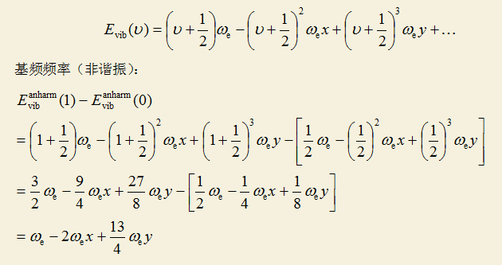
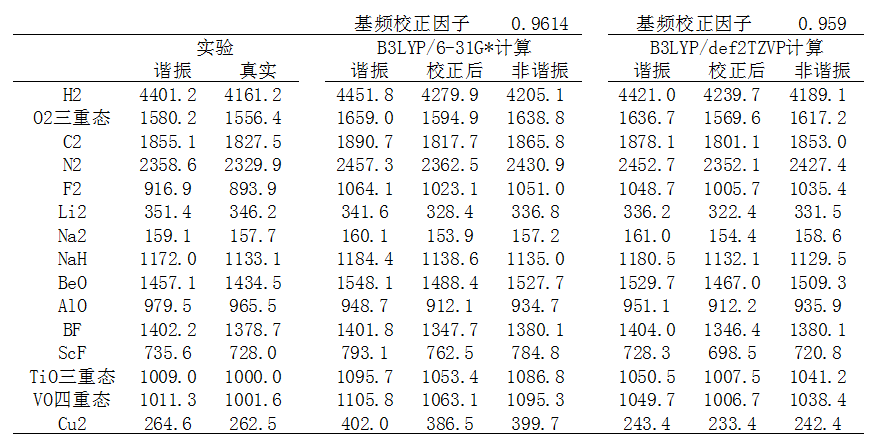
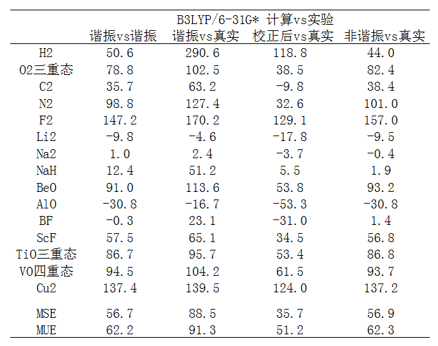
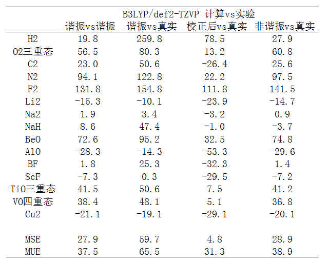

**基频频率校正因子实际效果测试**Test of actual effect of correction factor of fundamental frequencies

文/Sobereva @[北京科音](http://www.keinsci.com/) 2017-Oct-5

之前写过一篇《谈谈谐振频率校正因子》（<http://sobereva.com/221>）专门介绍了量化计算中频率校正因子的原理、类型和正确的使用方式。在本文中，将通过一系列五花八门的双原子分子的频率计算结果和实验数据的对比，来让读者更好地了解频率校正因子以及非谐振计算的效果。本文不打算做系统性、大规模、严谨的全面测试，能以小见大就够了。  
  
本文选取的一系列分子来自<http://cccbdb.nist.gov/expdiatomics.asp>，根据实验测定的双原子分子光谱常数ωe、ωexe、ωeye，可以容易地得到实验谐振频率和基频频率。真实谐振频率就是ωe，真实基频频率按照如下方式可得到  

  
测试共选取了15个分子，特征相差较大，用的都是基态。除了O2是三重态、TiO是三重态、VO是四重态、AlO是二重态以外，其它的都是单重态。用的是最常用的B3LYP泛函做的计算，考虑了两种基组，一种是便宜的6-31G*，一种是高质量的def2-TZVP。以下是计算结果，单位都是cm-1。“校正后”是freq关键词直接输出的谐振频率乘上校正因子后得到的，“非谐振”是用Gaussian的VPT2方式得到的非谐振频率（写freq=anharm关键词即可得到）  

  
下面是B3LYP/6-31G*计算值相对于实验值的误差，MSE是平均含符号误差，MUE是平均无符号误差（即先取绝对值再取平均）。为了叙述方便，下述的“真实频率”指的是“实验测定的非谐振频率”，即振动光谱直接测得的频率。  

  
由数据可见，即便不考虑非谐振问题，从MSE上看光是B3LYP/6-31G*计算的谐振频率本身就比实验的谐振频率整体偏高，也因此，文件中报道的用于令B3LYP/6-31G*谐振频率尽可能与实验谐振频率相符的校正因子是个小于1的值（0.991）。  
  
从“谐振vs真实”的数据来看，直接算出来的谐振频率与真实频率相差是很大的，MSE值体现出整体有着显著的高估。但是高估多少，和体系关系非常大，诸如对H2能高估290cm-1，而对Na仅高估2cm-1。此级别的谐振频率也并非一定高估，诸如计算的AlO谐振频率甚至低于真实频率，不过这种情况甚少。  
  
“校正后vs真实”是指把计算的谐振频率乘上基频校正因子后与真实频率的差值。从MSE上看到，校正因子的效果使得系统性高估的问题显著减轻了，从88.5cm-1降低到35.7cm-1，而且从MUE上看，此时精度也比不考虑基频校正因子时有了很大改进。这充分说明基频校正因子的重要性。但是，也不要忽视个例，比如AlO原本计算的谐振频率就比真实频率低，考虑校正因子后低估得更多了，误差反倒还更大了。  
  
我们再来看看直接用VPT2方法算的非谐振频率与真实频率的差异，即“非谐振vs真实”所示的那一列。从MSE结果上看，虽然也整体高估频率，但比不考虑非谐振效应的时候好很多。不过，VPT2非谐振计算需要计算能量的四阶导数，对稍微大一点的体系都是非常昂贵的，而整体精度，从MSE和MUE上可以看到还不如直接把谐振频率乘上频率校正因子的做法好。只不过对某些体系，比如H2，做非谐振计算比起谐振频率乘以校正因子的结果好很多，前者误差是44cm-1，后者是118.8cm-1，所以非谐振计算依然有其价值。  
  
总的来说，基频校正因子是非常有价值的，确实能令谐振近似下的频率与真实频率整体相符得明显更好，但是这个校正因子却不是万能的，从“校正后vs真实”的数据可以看到最终误差有大有小，是显著依赖于体系特征的。在B3LYP/6-31G*级别，经过校正后误差仍超过100cm-1的有H2、F2和Cu2，而且后两个的非谐振频率误差也同样很大。  
  
如果用高质量基组会是什么情况？下面看B3LYP/def2-TZVP的结果与实验的对比  

  
从数据看，不管怎么比，不管是MSE还是MUE，def2-TZVP下的结果与实验值的误差都低于6-31G*，虽然仍整体高估但是高估程度降低了不少，而且绝对误差也减小了。6-31G*下Cu2算得巨烂，不仅频率误差大，优化出来的键长也很糟糕。实验值是2.2197埃，而优化的结果是2.0244埃，相差高达1/10！实际上，6-31G*算第一周期过渡金属靠后的元素表现较差，特别是Co、Ni、Cu烂，在很老的文章J. Chem. Phys., 118, 7775里就已经指出了。切换到def2-TZVP后，优化的结果2.2909埃，和实验相符很好，而且频率计算结果也和实验值相符多了。然而对于F2，即便用了def2-TZVP，频率误差仅很小幅降低，无论是利用频率校正因子还是做非谐振计算，高估真实频率都很明显，这明显就是当前用的理论方法的问题了。对比6-31G*和def2-TZVP的结果，我们会看到改善基组使得误差降低得最多的是涉及过渡金属的体系，不仅Cu2，连TiO、VO的结果也大幅改进。有的人说文献里的频率校正因子不适合含过渡金属的体系，但从当前的结果来看，这种说法不实，如果他们发现结果在乘了基频校正因子后很烂，则很可能在计算的时候用的基组对相应元素描述得太low（如6-31G*描述Cu）。  
  
我在很多地方强调过，B3LYP/6-31G*结合频率校正因子的结果就已经够用了。诸多文献里的测试数据也表明，在考虑频率校正因子的前提下，提升基组质量并不会对结果有什么改进，费力不讨好。但本文的结果似乎与此矛盾。实际上，这主要原因是本文的测试体系太杂，五花八门，还包含过渡金属，因此用更好的基组来试图避免因基组质量过低导致出现很大误差是有意义的。但如果纯粹只着眼有机体系，由于不同体系间电子结构差异没有那么显著，而且有机体系本身比较好描述，用频率校正因子容易系统性地修正，在考虑频率校正因子时def2-TZVP的结果并不会比6-31G*有显著进步。
