**自行拟合基频校正因子与ZPE校正因子的简单方法**

A simple method to fit the correction factor for fundamental frequency and the ZPE correction factor

文/Sobereva  @[北京科音](http://www.keinsci.com/) 2017-Oct-6

  
之前笔者在《谈谈谐振频率校正因子》（<http://sobereva.com/221>）中已经详细介绍了量子化学中用的频率校正因子的类型、用法，在《基频频率校正因子实际效果测试》（<http://sobereva.com/390>）中也通过实例展现了频率校正因子的价值。给出频率校正因子的文献和网址甚多，在<http://bbs.keinsci.com/forum.php?mod=viewthread&tid=3805>中有汇总。但是，随着新的泛函、基组不断提出，依然容易碰上所用的级别没有对应的频率校正因子的情况。虽然根据对频率校正因子特点的理解，恰当借用其它级别的校正因子得到的结果也不会太差，但是终究不如拟合专用的校正因子来得优雅。本文简单演示一下怎么自行拟合用于校正谐振近似下得到的基频和ZPE的频率校正因子。注意，拟合的方法并不唯一，训练集也有很多不同选择，不同的拟合方式得到的频率校正因子可能差异达到0.1的程度，本文给出的是一种最简单易行，而且耗时很低的做法。本文以获得B3LYP/6-31G*的校正因子作为例子。  
  

## 1 拟合基频校正因子

首先我们需要准备个训练集。我们直接用JCTC,6,2872(2010)中的F38/10数据库，里面包含了15个分子的实验谐振频率（没什么用）和实验基频频率（即真实频率）：  

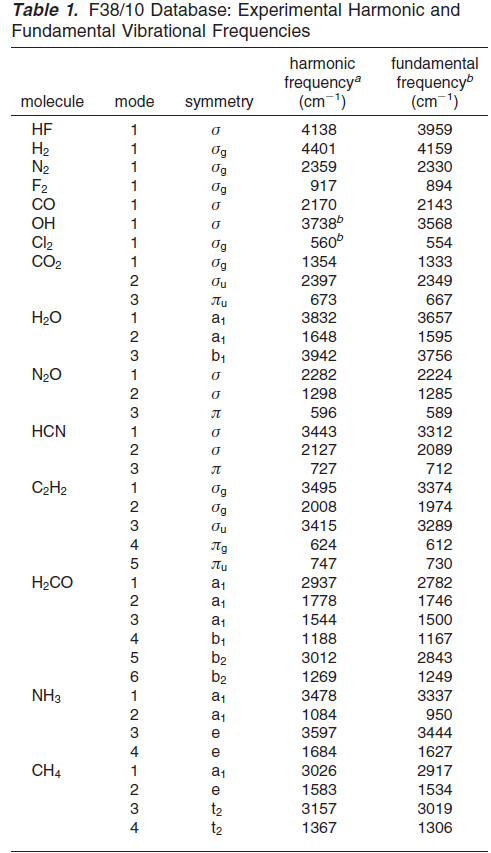

  
我们对这些分子，用Gaussian之类程序做优化和振动分析。注意其中N2O是N-N-O不是N-O-N。以下是笔者在B3LYP/6-31G*下计算的输入输出文件  
[15mol.rar](http://sobereva.com/usr/uploads/file/20171010/20171010000032_92822.rar)  
  
我们从输出文件中把振动频率提取出来，和实验频率一一对应上，类似这样  

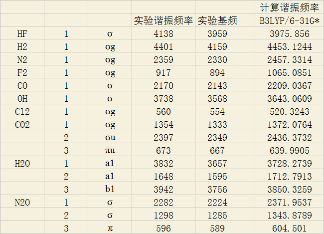

  
相应的excel表格见此：[data.xls](http://sobereva.com/usr/uploads/file/20171010/20171010000053_25667.xls)  
  
然后我们把数据拷到Origin里作为两列，笔者用的是Origin 9  

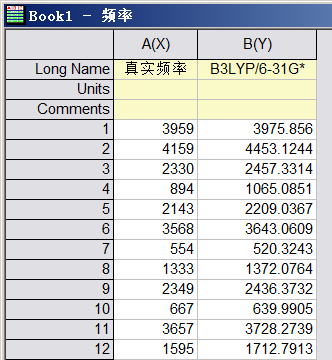

  
然后选以下选项，把计算的谐振频率作为X，把实验频率作为Y，进行线性拟合，并且要求截距为0  

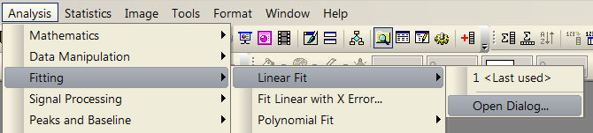

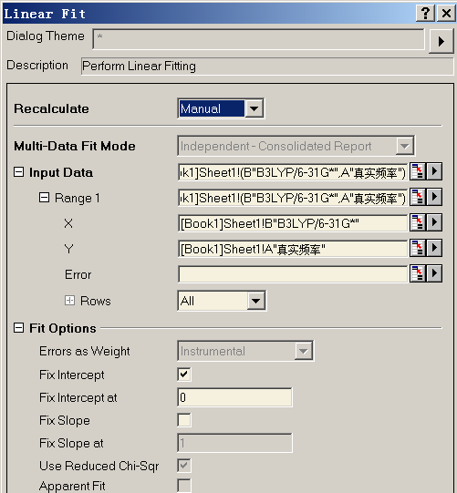

  
从结果可见，频率校正因子为0.960。拟合精度不错，Adjusted R^2达到0.999。  

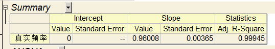

  
还可以双击页面里的缩略图放大观看了解拟合效果。可见拟合出的直线和数据点匹配相当不错。从ResIndp1的图里可以查看对不同频率拟合误差情况。  

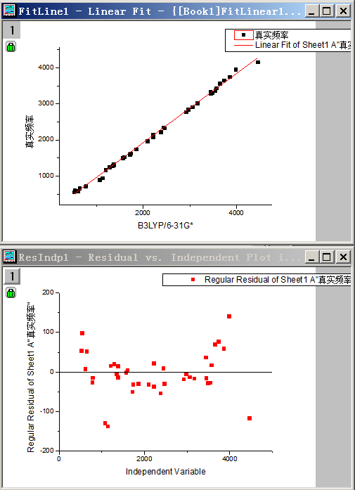

  
这里得到的频率校正因子0.960和CCCBDB频率校正因子库（<http://cccbdb.nist.gov/vibscalejustx.asp>）里的当前级别的校正因子0.960完全吻合！另外，也和很常用的JPC,100,16502(1996)里给出的0.9614相符很好，表明我们这种简单易行的拟合方法是成功的。  
  
  

## 2 拟合ZPE校正因子

在JCTC,6,2872(2010)中也给出了上面用到的15个分子的实验ZPE值，称为ZPVE15/10数据库：  

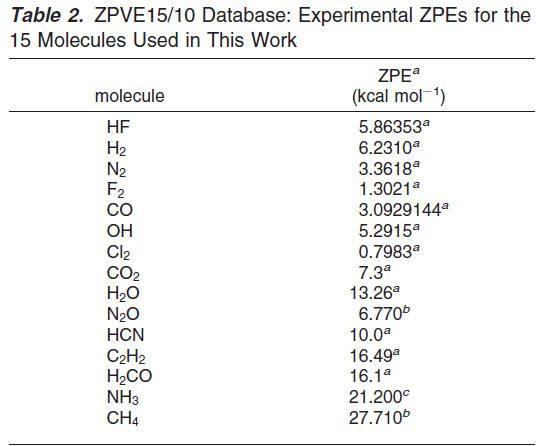

  
下面我们用这个数据库来拟合ZPE校正因子。拟合基本过程和上一节类似。在谐振近似下，不管是双原子还是多原子分子，给每个频率乘上校正因子后再计算体系的ZPE，和直接给体系的ZPE乘上校正因子的效果是等同的。因此，我们直接把量化程序输出的ZPE与实验ZPE做拟合就得到了ZPE校正因子。对应的数据就在上一节提供的表格里的第二个标签页里：  

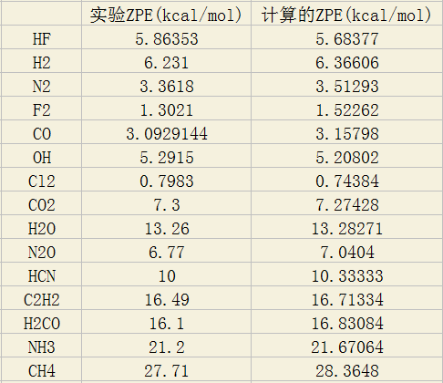

  
使用第一节的方法，把这两列数据拷到Origin里，做线性拟合，并要求截距为0，结果如下  

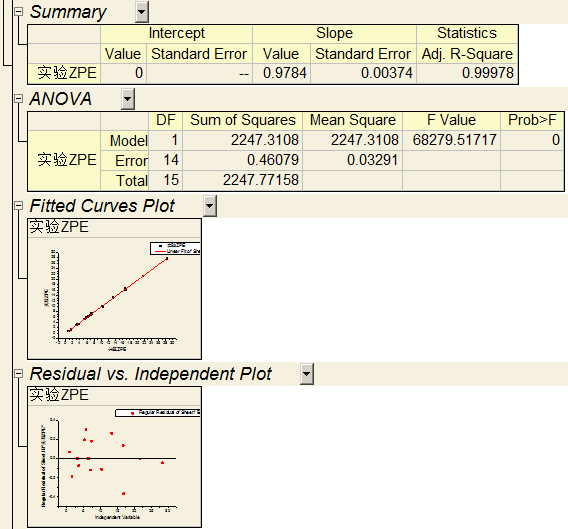

  

可见结果是0.9784。此数值和JCTC,6,2872(2010)中给出的此级别的数值0.977相符极好。

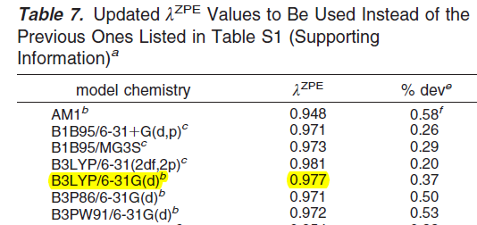

  
顺带一提，以后笔者有时间时候可能还会写个小程序，使得频率校正因子的拟合可以一键完成，届时用户只需填写计算级别就够了。
