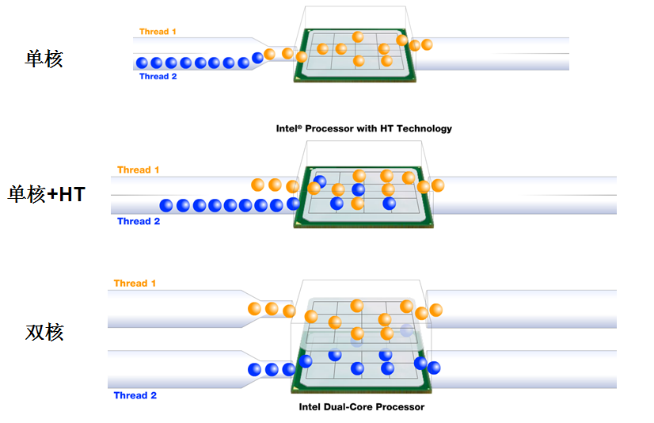
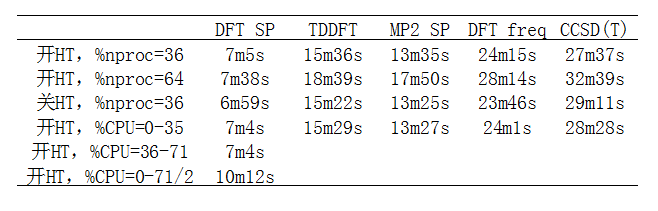
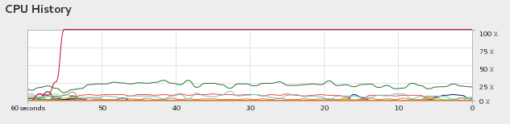
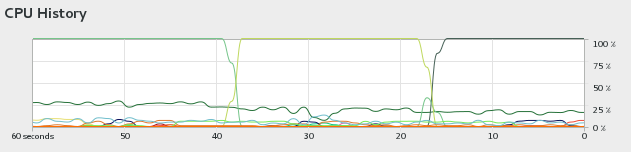

**正确认识超线程(HT)技术对计算化学运算的影响**Correctly understanding the impact of Hyper-Threading (HT) technology on computational chemistry

文/Sobereva@[北京科音](http://www.keinsci.com/)

First release: 2017-Oct-8  Last update: 2022-Oct-4

  
  

## 1 乱谈超线程(HT)技术

无数年前就经常看有人在一些讨论计算化学的地方鼓吹要在BIOS里关闭超线程(HT)技术，说是会严重降低性能。虽然我总在不断辟谣，避免很多人被以讹传讹干出关闭HT这样的傻事情，但是鼓吹关闭HT的言论依然时不时会冒出来。被误导的人基本都是对HT缺乏最基本的认识，把CPU制造商的好心当驴肝肺。诸如最近有个人，貌似是看到关了HT的时候在任务管理器里看到CPU占用率是100%，而没关HT的时候占用率是50%，便以为关了HT导致CPU利用率提升，于是开始在群里号召大家要关HT，真是令人无语得很。这里写一个关于HT小文，结合实际测试数据，希望能够令读者正确认识HT对计算化学运算的影响。  
  
HT技术早在2002年就被Intel提出了，用在奔4和相应时代的XEON上，如今AMD也开始支持了。HT提出的初衷是提升CPU的多任务执行能力。假设CPU有N个物理核心（即管线完整的CPU核心），如果CPU支持HT技术的话，操作系统则会识别到有2N个逻辑核心。如果操作系统对HT技术已经做过优化（从XP开始就已经做了优化），那么对于执行多任务或者做并行运算的情况，HT技术原理上可以使得CPU的实际执行能力超过原本的N个物理核心。  
  
HT的原理简单来说就是让CPU同时执行更多的线程，让CPU更忙，减少CPU执行单元空闲率，从而尽可能充分压榨CPU的运算能力。示意图如下  

  
对于多任务/并行运算，显然具有N个物理核心的CPU在利用HT时，性能远远达不到真正有2N个物理核心但没有HT技术的CPU，但是比不开HT的时候性能会有所提升。提升多少看具体情况，提升百分之十几是很常见的。但是，也有很多情况，由于资源争抢，开了HT后反倒导致计算能力下降。  
  
对于具有HT技术的有N个物理核心的CPU，跑计算化学程序时，一般来说最佳使用方式是：**开着HT，但把并行核数设为N**。  
  
之所开HT时不建议将并行核数设为逻辑核数，即2N，是因为此时虽然有可能跑得更快，但撑死了也就比N核并行时快百分之十几，并不显著，而且此时还有可能由于资源争抢使得计算速度变得更慢的可能。到底是变得更快还是更慢和程序关系极大，需要实测。另外，并行核数设大时，所需内存量也相应地越大（不是线性关系，具体看程序），还不排除有时候并行核数加倍后当前物理内存不够跑当前任务的。反之，开着HT，但只用N核来并行，则CPU多出来的一丁点计算能力可以处理一些后台任务，可充分避免系统在满载时变得卡顿。  
  
至于一些人鼓吹关闭HT，就显得很莫名其妙了，明明HT能够给CPU带来额外计算能力处理后台事务，或者用于更快地跑完一些轻量级任务，何故不要？在我看来，不得不关闭HT只有一种情况，也就是使用这台机子的用户（们），或者在这台机子上跑的某些程序，特别愚蠢，非要把2N个逻辑核心都占满不可（也可能是误以为这台机子有2N个物理核心所致），由此可能造成资源争抢拖慢整体运行效率，因此只能靠关了HT来强行避免。  
  
现在的年轻人可能没那么强烈的感觉，想当年，民用CPU还都是单核，如果比如一边压缩文件，一边听mp3的话，音乐就会变得断断续续，因为计算资源基本都被压缩程序给占了，音乐播放器就执行不顺畅了。反之，对于有HT技术的CPU，有两个逻辑核心，CPU能同时执行两个线程，尽管远不是两个物理核心的执行速度，但至少音乐就不会断断续续了。虽然现在CPU物理核心数都很多了，PC、笔记本都已经普及4核了，但是得益于HT技术，即便vmware虚拟机里正在用四核跑计算任务，在主机里跑应用程序也不会感到卡顿。但如果把HT关了，此时在主机里的体验就差多了。  
  
值得一提的是，在许多系统监视器、任务管理器类型的程序里，当所有逻辑核心全占满的时候，才会显示CPU利用率100%。因此，开HT时用N个核并行满载时会显示50%利用率，而2N个核并行时会显示100%利用率。前者，即推荐的方式，虽然看起来只利用了50%的CPU，但这50%实际上可以姑且理解为对应于此时CPU真实运算能力的>90%，因此几乎没有浪费CPU性能。而有人发现关了HT后CPU利用率成100%了，居然还因此骂HT损失了CPU性能，显然缺乏对HT的最基本了解，关了HT使得CPU运算能力失去了被压榨出额外油水的可能。  
  
  

## 2 HT对计算耗时的影响

下面，我们通过实际计算化学程序的执行耗时来看看恰当和不恰当利用HT所产生的影响。测试的机子是双路E5-2696 v3（2*18核=36个物理核心），内存256GB，系统CentOS 7.3 64bit。  
  

### 2.1 Gaussian

首先我们测试Gaussian16 A.03 Linux 64bit版，内存使用量上限设240GB。共涉及以下5个任务  
DFT SP：含有168个原子的有机体系DFT单点计算。关键词# b3lyp/6-311G*  
TDDFT：含有61个原子的Ru配合物的TDDFT计算。关键词#p B3LYP/genecp TD(nstates=30)，对Ru和其它原子分别用SDD和6-311G*  
MP2 SP：含31个原子的有机体系的MP2单点计算，不利用对称性。关键词：#p MP2/def2TZVP nosymm  
DFT freq：含40个原子的硼-氮纳米管的DFT振动分析，不利用对称性。关键词：#p B3LYP/6-311G* freq nosymm  
CCSD(T)：CCSD(T)/cc-pVTZ计算苯胺的单点，无对称性  
  
以下是测试结果：  

本来打算测试开HT，%nproc=72的情况，即使用2N核心并行。但发现当前版本程序并行线程数超过64就会提示Error: Requested invalid number of cpus，因此图中测的是HT，%nproc=64的情况。从数据明显可以看出，开HT时，当并行的核数超过物理核心数（36）时，耗时反倒比用36核时增高了。  
  
同样使用36核，关闭HT后，某些测试的耗时比开HT时有轻微的缩短，但变化甚微，可忽略不计，而CCSD(T)的耗时还反倒有所增高。因此，刻意去关HT纯粹多此一举，如果此时系统里还有人跑一些其它任务，那么肯定是开着HT的时候Gaussian总耗时最低。  
  
从G16开始，开发者鼓励用%CPU代替%nproc来指定并行计算时用的核心。原先%nproc并没有指定用哪些CPU核心，只是指定了总数目，具体用的CPU核心由操作系统自动调度。而%CPU则可以指定只用哪些逻辑核心来跑任务（即做了绑定，也即设置了affinity），核心序号从0开始，因此%CPU=0-35代表只使用1~36号逻辑核心来并行。测试发现用%CPU=0-35和%nproc=36的耗时基本也没有太大区别，因此也没必要刻意用%CPU。  
  
还测试了%CPU=36-71的情况，为省时间只测了DFT SP任务，耗时和%CPU=0-35完全一样。最后还测了%CPU=0-71/2，这代表72个逻辑核心里，使用0,2,4,6,8,10,12...70号核心，共36个核来执行，数据可见这种情况下计算速度最慢。究其原因，应当是出现了算Gaussian用的逻辑核心正好对应于相同物理核心的情况，此时显然会造成严重资源争抢。我们假设0,36、1,37、2,38...35,72这样每一对逻辑核心实际上对应于一个物理核心，则运算任务分给0或36号逻辑核心时，实际上都是第一个物理核心在执行。而当这两个逻辑核心都有任务在跑时，则这个物理核心被剥削，一个人同时干两件事。%CPU=0-71/2方式运行的情况极为别扭，其中序号为偶数的逻辑核心都会被利用，因此0,36这两个对应于同一个物理核心的逻辑核心都被利用了，造成了严重资源争抢，而1,37这两个对应于同一个物理核心的逻辑核心则完全闲着没事干，造成了极大的资源浪费，性能不烂才怪。  
  
使用%nproc=36的时候，由于操作系统已经对HT优化过，所以并不会（或极少）出现两个Gaussian线程正好全都塞给一个物理核心计算的情况。但更多核数并行时，一个物理核心跑两个Gaussian线程就免不了了。  
  
前面说%CPU可以将Gaussian的线程与CPU内核绑定，这系统源监视器中可以看到。比如%CPU=0，会看到一直都是一个核心在跑：  

如果用%nproc=1，则会看到Gaussian那一个线程时不时会在不同核心之间切换  

G16中加入%CPU的初衷之一是为了可以让Gaussian线程与CPU核心绑定，避免操作系统的频繁调度导致性能损失。但从我们的测试中看，刻意用%CPU并没带来明显好处，反倒是如果乱用%CPU则更麻烦。  
  
如果关掉HT，使用36核的话，那么36核一直都会满载着，也不会有频繁调度的问题。而原理上说，开HT，但是还用36核，有可能因为36个线程在72个逻辑核心之间分配的频繁切换（甚至两个线程塞给同一个物理核心对应的逻辑核心）而导致性能损失。不过，之所以没必要关HT，一方面是因为在G16里直接用%CPU就已经可以避免频繁调度导致的潜在的性能损失问题，其二，根据上面的测试数据，并未观测到关闭HT或使用%CPU绑定核心带来的明显性能提升。关了HT还导致没有额外富余出来的闲余计算资源用于处理后台和用户的一些杂务。  
  

### 2.2 ORCA

为了让“应当关闭HT”的言论进一步破产，这里再测试另一个主流量化程序ORCA 4.0.1.2。此程序通过MPI并行，和Gaussian的OpenMP并行机制差异明显。测试的任务有两个，一个是CCSD(T)/cc-pVTZ计算苯胺，另一个是RI-PWPB95/def2-QZVPP计算前述的硼-氮纳米管。结果如下：  
  
开HT，用36核  
CCSD(T)：14min  
RI-PWPB95：22m58s  
  
关HT，用36核  
CCSD(T)：14min  
RI-PWPB95：22m50s  
  
开HT，用72核  
CCSD(T)：19min29s  
RI-PWPB95：31m25s  
  
由数据可见，开HT时并行核数超过物理核心数依然导致性能猛降。刻意关HT几乎没有带来丝毫益处。  
  

### 2.3 GROMACS

这里再测试用户最多的分子动力学程序GROMACS的情况。版本是2016.3，体系是三万六千原子的蛋白质+水体系，跑100ps动力学。GROMACS的mdrun可以通过-pin on来强制要求CPU核心与mdrun线程绑定，类似于%CPU。下面来看测试结果  
开HT，用72核：         87.053 ns/day 99.252s  
开HT，用36核：         77.363 ns/day 111.684s  
开HT，用36核，-pin on：81.582 ns/day 105.908s  
关HT，用36核：         83.199 ns/day 103.85s  
关HT，用36核，-pin on：83.164 ns/day 103.893s  
  
这回发现，开HT且启用全部逻辑核心并行的时候，性能比只用物理核心时计算性能略有提升，这一定程度体现出量化程序和MD程序在算法、程序特征上的差异。但是注意，即便是GROMACS，启用全部逻辑核心也并非总能令性能更好，需要根据具体任务进行测试。但如果你懒得测试，索性就用物理核心数并行就完了，注意此时一定要用-pin on，肯定会令性能有所提升，有时提升还挺大。至于关HT，没什么意义，尽管可能令性能有可以忽略不计的提升。关HT时用不用-pin on对结果就没有影响了。  
  

### 2.4 Multiwfn

再来看看用最流行的波函数分析程序Multiwfn的3.4.1(dev)版在不同情况下的计算速度。这里对一段碳纳米管计算电子密度的拉普拉斯函数的格点数据，格点数200*200*200。  
开HT, 用36核：84s  
开HT, 用72核：91s  
关HT, 用36核：83s  
  
再次证明，开HT时用超过物理核心数并行时在多数情况会造成性能下降，而关HT完全是多此一举。

也值得注意的是，有的CPU满载时能达到的频率和开不开HT有明显关系。比如AMD EPYC 7R32，我实测发现开HT的话全核满载频率平均在3.0GHz，关闭HT的话能达到3.3GHz，并行核数等于物理核心数时后者表现出的性能更好。这种情况确实关了HT有益，这台机子我也是关了HT用。大家可以针对自己用的CPU实测一下开不开HT的时候满载频率，如果没什么差异的话就没必要刻意关HT。
