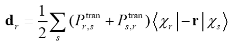
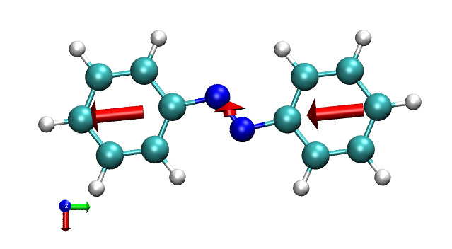
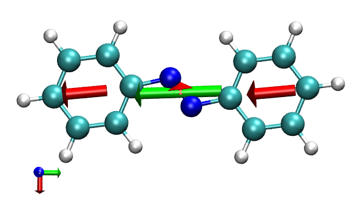
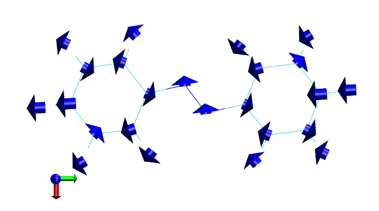
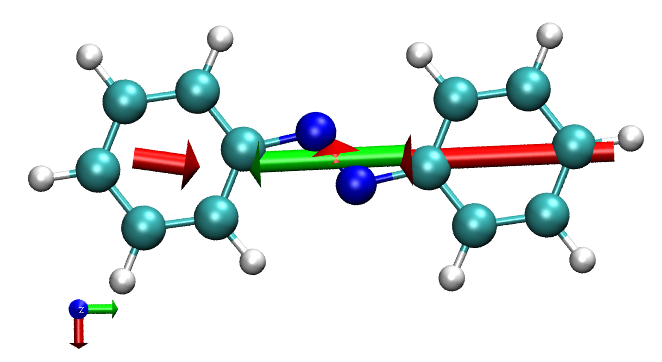

**使用Multiwfn+VMD绘制片段贡献的跃迁偶极矩矢量**

Using Multiwfn+VMD to plot transition dipole moment vector contributed by specific fragment

文/Sobereva @[北京科音](http://www.keinsci.com/)

First release: 2017-Dec-2  Last update: 2020-Dec-25

  

## 1 前言

跃迁偶极矩是讨论电子激发最关键的量之一。跃迁偶极矩大，振子强度才可能大，对应的吸收/发射才可能比较强，这些基本知识在此帖都有介绍：《Gaussian中用TDDFT计算激发态和吸收、荧光、磷光光谱的方法》（<http://sobereva.com/314>）。量化程序给的是整个分子的跃迁偶极矩，但是我们往往想考察体系中不同部分对跃迁偶极矩的贡献，从而更好地了解跃迁的内在特征。在Multiwfn程序的主功能18里的“空穴-电子”分析模块中，可以通过Mulliken划分，把跃迁偶极矩分解为基函数的贡献，以及原子的贡献。将原子贡献加和就可以得到某个片段的贡献。如果我们把数据读入到VMD程序中，还可以在VMD中绘制箭头，直观地考察各个片段的跃迁偶极矩矢量，使各个片段对跃迁偶极矩的贡献一目了然。本文就介绍如何实现。  
   
对Multiwfn不了解者请参考《Multiwfn FAQ》（<http://sobereva.com/452>）、《Multiwfn入门tips》（<http://sobereva.com/167>）和《Multiwfn波函数分析程序的意义、功能与用途》（<http://sobereva.com/184>）。本文对应的是Multiwfn最新版本的情况，程序可以在主页<http://sobereva.com/multiwfn>免费下载。VMD使用的是1.9.3版，可以在<http://www.ks.uiuc.edu/Research/vmd/>免费下载。  
   
   

## 2 原理

按照Mulliken划分，第r基函数对跃迁偶极矩的贡献写为（注意是个矢量）  

其中P_tran是某两个态之间的跃迁密度矩阵，后面那项是r与s基函数间的电偶极矩积分。把基函数贡献按照原子加和，就得到了原子对跃迁偶极矩的贡献。  
  
在《分子轨道成分的计算》（<http://sioc-journal.cn/Jwk_hxxb/CN/abstract/abstract340458.shtml>）一文中，笔者就已经明确强调使用Mulliken划分时基组不能带弥散函数，否则结果缺乏物理意义。因此，按照本文方法以Mulliken划分来分解跃迁偶极矩时，做电子激发计算时候用的基组也绝对不能带弥散函数。实际上，除非里德堡激发，否则带上弥散函数对电子激发计算结果也没明显好处，基本是浪费时间，这里已经提过了：《乱谈激发态的计算方法》（<http://sobereva.com/265>）。  
  
要注意，虽然体系总的跃迁偶极矩没有原点依赖性，但是片段对跃迁偶极矩的贡献往往是有原点依赖性的。换句话说，在计算时把体系进行平移，不影响总跃迁偶极矩的结果，但是可能会影响片段产生的贡献。然而原点应设在哪里，完全是任意的，因此在讨论时一定要加以注意这个问题（Gaussian计算时如果没用nosymm关键词，默认会平移体系使原点在体系原子核电荷中心位置）。之所以会有这个特征，是因为容易证明，只有最低阶的非零多极矩才没有原点依赖性，比如中性体系偶极矩没有原点依赖性，但是离子体系由于单极矩不为0，因此偶极矩有原点依赖性，因此没太大意义。类似地，对于电子跃迁问题，体系总的跃迁电荷为0，即∑[i]∑[j]P_tran(i,j)*S(i,j)=0，因此总跃迁偶极矩没有原点依赖性，而某个基函数i的跃迁电荷往往不为零，即∑[j]P_tran(i,j)*S(i,j)≠0，因此基函数、原子、分子片段对跃迁偶极矩的贡献往往是有原点依赖性的。  
  
  

## 3 实例：偶氮苯(Azobenzene)

这里以一个简单分子偶氮苯为例，介绍一下将Multiwfn与VMD相结合，绘制各个片段跃迁偶极矩矢量的完整流程。  
  
以下是偶氮苯在PBE0/6-31G*级别做TDDFT电子激发计算的Gaussian输入文件，计算最低5个激发态。其中9/40=4必须加，否则只有较大的组态系数才会输出出来，会导致之后Multiwfn产生的跃迁偶极矩不准确（要稍微更准确的结果可以写9/40=5，不过输出文件会更大）。  
%chk=C:\Azobenzene.chk  
# pbe1pbe/6-31g(d) TD(nstates=5) iop(9/40=4)  
  
pbe1pbe/6-31g(d) opted  
  
0 1  
 C                 -0.18984100    4.51585300    0.00000000  
 C                  1.10113800    3.99491100    0.00000000  
 C                  1.29053000    2.61740200    0.00000000  
 C                  0.18984100    1.75735600    0.00000000  
 C                 -1.10944900    2.28225900    0.00000000  
 C                 -1.29157500    3.65642100    0.00000000  
 H                 -0.34218800    5.59191200    0.00000000  
 H                  1.95936300    4.66120300    0.00000000  
 H                  2.28423900    2.17907300    0.00000000  
 H                 -1.94924600    1.59527000    0.00000000  
 H                 -2.29790100    4.06725100    0.00000000  
 N                  0.49896400    0.37896400    0.00000000  
 N                 -0.49896400   -0.37896400    0.00000000  
 C                 -0.18984100   -1.75735600    0.00000000  
 C                 -1.29053000   -2.61740200    0.00000000  
 C                  1.10944900   -2.28225900    0.00000000  
 C                 -1.10113800   -3.99491100    0.00000000  
 H                 -2.28423900   -2.17907300    0.00000000  
 C                  1.29157500   -3.65642100    0.00000000  
 H                  1.94924600   -1.59527000    0.00000000  
 C                  0.18984100   -4.51585300    0.00000000  
 H                 -1.95936300   -4.66120300    0.00000000  
 H                  2.29790100   -4.06725100    0.00000000  
 H                  0.34218800   -5.59191200    0.00000000  
  
将Azobenzene.chk用formchk转换为Azobenzene.fch。然后启动Multiwfn，载入Azobenzene.fch，之后依次输入：  
18   //电子激发分析功能  
11    //将跃迁偶极矩分解为基函数和原子的贡献  
Azobenzene.out   //Gaussian输出文件  
2    //要考察的激发态。我们随便选一个，比如第2激发态  
1    //分解的是跃迁电偶极矩  
n    //不生成AAtrdip.txt（原子-原子跃迁偶极矩矩阵）  
当前目录下得到了trdipcontri.txt，其中第一部分是各个基函数对跃迁偶极矩X,Y,Z分量的贡献，第二部分是各个原子的贡献。将trdipcontri.txt拷到VMD目录下。  
   
退到程序主菜单，然后进入主功能100的子功能2，选择导出体系的pdb文件。启动VMD，将体系的pdb文件拖入VMD main窗口载入。  
  
将这个loadip.tcl拷到VMD目录下：[loaddip.tcl](http://sobereva.com/attach/loaddip.tcl)。然后在VMD的文本窗口运行source loaddip.tcl命令执行之。这会将VMD目录下的trdipcontri.txt里记录的各个原子对跃迁偶极矩的贡献载入到内存（同时也输出到了文本窗口里），还定义了dip命令，用来绘制箭头表现某个片段的跃迁偶极矩，还同时定义了dipatm命令，可以一次性绘制每个原子的跃迁偶极矩箭头。  
  
下面，我们把偶氮苯第一个苯环（原子序号1~11）、中间两个氮（原子序号12、13）和另一个苯环（原子序号14~24）分别作为三个片段来绘制它们贡献的跃迁偶极矩。用dip命令默认绘制的箭头是蓝色的，为了更显眼，先在VMD窗口里输入draw color red来让之后绘制的物体成为红色，然后在VMD文本窗口中依次输入  
dip "serial 1 to 11"  
dip "serial 12 13"  
dip "serial 14 to 24"  
这里诸如serial 1 to 11代表选择1到11号原子。dip命令绘制的箭头的圆柱部分长度对应片段贡献的跃迁偶极矩大小，箭头方向表示跃迁偶极矩矢量方向，箭头的中央位置对应选中的片段的几何中心。每次用dip命令后，在VMD的文本窗口中还会把这个片段的几何中心以及对跃迁偶极矩贡献的X,Y,Z分量直接输出出来。  
注：被绘制的片段里的原子序号可以不连续。例如运行dip "serial 1 5 to 8 11 to 14 18"，会对由1、5、6、7、8、11、12、13、14、18号原子构成的片段进行绘制。  
  
在文本窗口输入color Display Background white把背景设成白色，然后进graphics-representation，把Drawing method设为CPK。笔者建议用正交视角观看当前图像，以免因近大远小造成视觉误差，故选Display-Orthographic。最终看到的效果如下所示（左下角的坐标轴的红、绿、蓝分别对应X,Y,Z正方向）  

  
Gaussian输出的此体系S0->S2的总跃迁偶极矩，以及VMD文本窗口中看到的苯环1、N2、苯环2的贡献分别为（a.u.）  
Total：0.1155  -2.8868  0.0  
苯环1：0.14262 -1.43288 0.0  
N2：  -0.16948 -0.02138 0.0  
苯环2：0.14262 -1.43288 0.0  
可见跃迁偶极矩主要是Y轴负方向的。将定量数据和图像结合观察，可见两个苯环起到了最主要的贡献。而N2对Y方向贡献甚微，在X方向有一点微小贡献。  
  
我们也可以同时把体系总的跃迁偶极矩箭头绘制出来。为了令其颜色与片段的区分，我们先输入draw color green，然后再输入dip all，就得到了下图，绿色箭头描述体系总跃迁偶极矩，其具体数值也显示在了文本窗口中。  

  
要想删除所有已绘制的箭头，输入draw delete all。下面我们输入dipatm，看看各个原子贡献的跃迁偶极矩的箭头。由于原子贡献的往往比较小，为了避免箭头被原子球遮挡，drawing method我们改成line。  

由图可见，虽然每个苯环都在Y的负方向对跃迁偶极矩有巨大贡献，但是分解到原子层面，苯环内的部分原子对跃迁偶极矩却是冲着Y的正方向。  
  
前面提到，片段对跃迁偶极矩的贡献一般是有原点依赖性的。为了展示这一点，对前面的.gjf文件里每个原子Y坐标都加上6埃，并且用了nosymm关键词避免自动被Gaussian平移。重复之前的作图步骤，这次得到的图像如下  

和之前的图对比，我们看到绿色箭头，即总跃迁偶极矩并没有因为体系的平移而发生改变，但是两个苯环产生的贡献却与之前截然不同，这是因为这两个苯环的跃迁电荷都不为0（用Multiwfn的空穴-电子分析界面的子功能6可以输出每个原子的跃迁电荷，按照片段进行加和，得到的两个苯环的数值分别为0.2116和-0.2116）。而N2部分跃迁电荷恰为0，因此它贡献的跃迁偶极矩和平移前一样，依然是-0.16948 -0.02138 0.0。

## 4 其它

上面的例子是将基态与激发态之间的跃迁电偶极矩分解成原子/片段的贡献，也可以将跃迁磁偶极矩以相同的方法进行分解并绘制，只要在Multiwfn问你分解哪种跃迁偶极矩的时候选Magnetic即可。另外，2020-Dec-25及之后更新的Multiwfn也支持对两个激发态之间分解它们的跃迁电偶极矩，让你输入激发态序号的那一步输入两个相应的激发态序号即可。

顺带一提，如果想令VMD中绘制的箭头长一点或者短一点，可以修改loaddip.tcl当中的这一部分：  
set begx [expr $cenx-$fragdx/2]  
set begy [expr $ceny-$fragdy/2]  
set begz [expr $cenz-$fragdz/2]  
set endx [expr $cenx+$fragdx/2]  
set endy [expr $ceny+$fragdy/2]  
set endz [expr $cenz+$fragdz/2]  
将$fragdz改为比如2*$fragdz，就可以让箭头长度变为之前两倍。箭头的粗细可以通过修改draw cylinder这一句的radius后面的值来调整。
