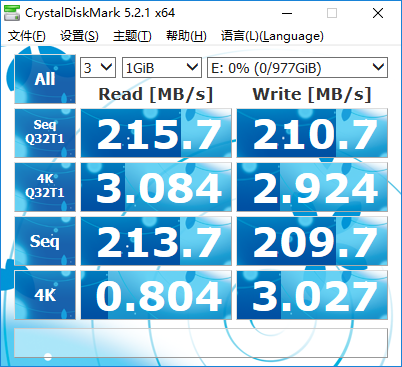
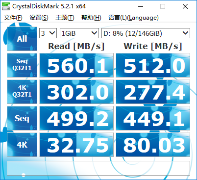
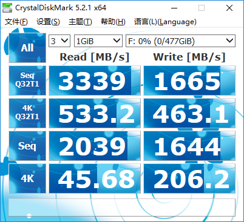
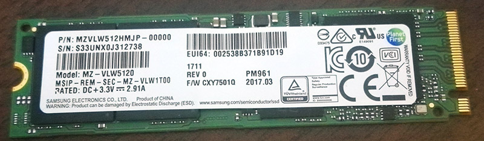
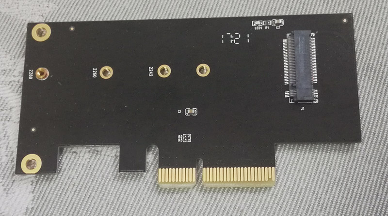
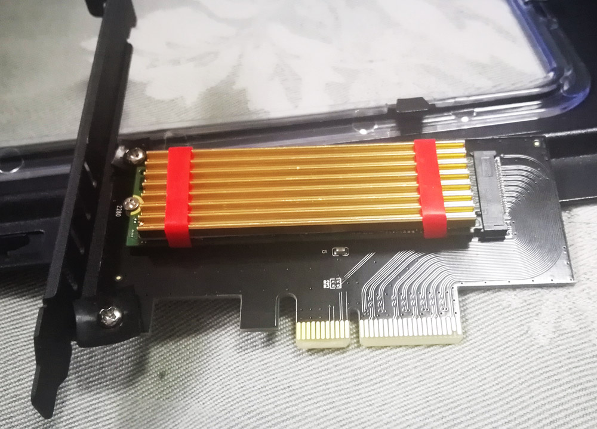
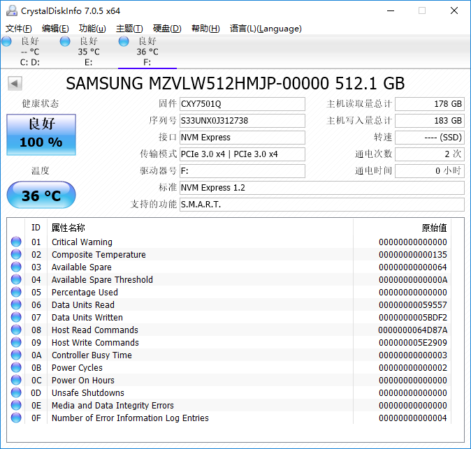
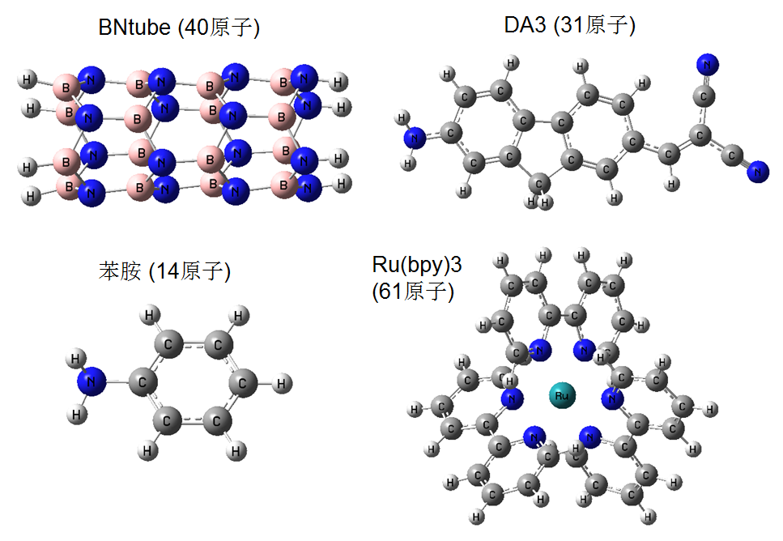

**硬盘速度与内存容量对量子化学计算速度影响的测试**

Test of the impact of hard disk speed and memory capacity on quantum chemistry calculation speed

文/Sobereva @[北京科音](http://www.keinsci.com)   2017-Dec-5

## 1 前言

本文的目的是通过几种主流量子化学程序的实测数据，说明量子化学计算用的机子有没有必要用大内存，有没有必要用高速硬盘，这俩问题是购买服务器的人很关注的问题。经常有人认为内存容量只要让计算得以进行就够了，加大内存对提升速度并没用处，本文也通过测试看看是否是这么回事。  
  
本文测试用的机子是双路XEON E5-2696v3（2*18=36个物理核心），主板X10DRL-i。机子内存比较大，是8*32GB DDR4-2133，共256GB，因此有较大余地测试内存对计算速度的影响。购机过程在这里有详细记录《淘宝店购买双路2696v3服务器的过程、使用感受和杂谈》（<http://bbs.keinsci.com/forum.php?mod=viewthread&tid=6310>）。在买这台机子数日之后，又买了个三星PM961，花了1289软妹币。此时机子里一共有三个硬盘：  
(1)希捷4T企业版  
(2)影驰铁甲战将SATA3 480GB固态硬盘  
(3)三星PM961，是M.2口512GB高速固态硬盘  
这三个硬盘，连续读写速度依次由慢到块，正好可以用来对比硬盘速度对量化计算的影响。三块硬盘性能测试如下（Win10-64bit）：  
  
希捷4T企业版  

  
影驰铁甲战将  

  
PM961  

  
  

## 2 关于硬盘速度和PM961

之所以笔者机子之前已经有一个大容量机械和一个固态了，而后来又买了PM961，是因为PM961的性能远远超过SATA3口的固态硬盘。SATA3对SSD的限制已经愈发明显，早已不是可忽视的程度了。如影驰铁甲战将测试成绩所示，SATA3的SSD一般持续读写速度也就做到五六百MB/s，而走M.2或PCI-E 3.0 4x口的SSD，如PM961，则完全脱离了这个束缚，连续读写性能完爆SATA3硬盘。还在惯用SATA3 SSD的人应该转变观念了。在M.2/PCI-E的SSD普及之前，一些人为了追求更好性能，把SATA3 SSD组Raid0，性能确实提高很多，但是相对于如今的M.2/PCI-E的SSD，已经是鸡肋了。  
  
量化计算有的任务基本不怎么读写硬盘，比如DFT单点、优化，对这类任务显然用什么硬盘都不会影响性能；而有的任务则会产生巨大的临时文件并大量读写，诸如CCSD(T)，因此硬盘速度必然会对性能产生不可忽视的影响。本文说的硬盘速度一律是指硬盘的连续读写速度，而不是随机读写速度，后者只影响大量操作小文件的速度（在计算化学范畴中，对于化学信息学、虚拟筛选等问题才可能产生较明显影响）。  
  
笔者购买PM961的目的不是用来为了装系统、让应用程序启动速度更快，而纯粹是把这块硬盘当苦力用。各种量化程序的临时文件都在这里读写，而不装任何程序和资料，因此就算这硬盘因为累计读写量太大坏掉，也不会造成其它损失，找店家换货就完了。对于经常要跑后HF任务的人，手头不太紧的话，建议苦力盘容量不要买256GB的，建议>=512GB，因为对于大体系后HF任务，临时文件达到三四百GB甚至更多都是不少见的（对于Gaussian，由于可以方便地对rwf文件进行分割，因此还好。而大多数程序临时文件只能指定在一个目录下读写，苦力盘容量不够就比较麻烦了）。  
  
由于大多数读者对三星PM961比较陌生，这里多说几句。PM961类似于三星高端固态硬盘960EVO的OEM货，无包装，性能没什么差别，价格便宜很多，淘宝店一般都提供质保，笔者买的这个店家3年包换：  

  
笔者服务器的X10DRL-i主板并没有M.2口，没法直接用PM961，因此在淘宝上花20块钱买了个佳翼SK4转接卡，用来将M.2转换为PCI-E 3.0 4x口  

  
为了散热好点，又花18块钱买了个散热条，组装好后：  

  
刚上手把玩一会儿后截的硬盘信息  

  
估计会有人怀疑，这么转接一下，性能肯定打折扣吧？会不会不稳定？从上面的速度实测已经充分说明，用这个转接卡速度丝毫不打折扣，完全不影响PM961顶级性能的发挥。而且根据3个月的使用感受，也未曾发现有不稳定的情况。所以以上转接方式非常稳妥。  
  
虽然买原本就是PCI-E口的固态硬盘就能免得转接一下，但笔者强烈不建议购买，因为性价比远远低于PM961。例如PCI-E 3.0 4x的浦科特M8SeY 512GB，性能不及PM961，却还要卖到2000出头。市面上也有其它M.2口的SSD，同等容量价格和PM961差不多，比如Intel 600P 512GB，但性能都落后于PM961，所以也不建议购买。  
  
顺带一提PM961在这里可以下载三星官方驱动<http://www.samsung.com/semiconductor/minisite/ssd/download/tools.html>，对于Win10，装不装对测试性能影响不大。  
  
  

## 3 关于将内存虚拟成硬盘

硬盘既可以虚拟成内存，内存也可以虚拟成硬盘。当内存非常大，又无用武之地时，把内存虚拟成硬盘，从而加速大量读写硬盘任务的速度往往是有用的做法。虽说PM961已经很快了，但是跟服务器的内存读写性能来比还有一个以上数量级的差距。Linux下可以用ramfs或者tmpfs方式把内存虚拟成硬盘，两种做法实测性能没什么差异，笔者比较习惯用ramfs的做法。使用非常简单，比如要把最多180GB内存作为虚拟硬盘挂载到/vram目录，就执行以下命令  
mkdir /vram  
mount none /vram -t ramfs -o maxsize=180G  
这样在/vram里读写文件就相当于在内存中读写了。无论是运行umount /vram手动卸载之，还是重启，/vram里面的文件都会消失。  
  
后文将测试，对于后HF任务，把大内存充分分配给程序耗时更低，还是只把部分内存分配给程序，而把另一部分内存作为虚拟硬盘用于读写临时文件耗时更低。  
  
  

## 4 内存容量与硬盘速度对计算耗时的影响实测

下面将通过最常用的量化程序Gaussian16 A.03和ORCA 4.0.1.2（皆64bit），执行不同类型任务，来考察分配的内存量和硬盘速度对计算耗时的影响，看看买服务器时钱怎么花最划算。测试机子的硬件配置上面已经说过了，系统是CentOS 7.3 64bit。所有测试的项目都是对内存容量、硬盘有一定要求的，而普通泛函算单点、优化这类问题，占内存很少，也不怎么读写硬盘，因此不纳入测试。下面测试的耗时一律都是指wall clock time，不是CPU time。每次测试的计算耗时都有可能略有不同，因此如果两个计算条件耗时相差不多的话，就当成没有差异即可。  
  
测试中涉及到的体系如下，选的体系比较贴近于现阶段大家通常计算的大小，并没有刻意去选巨大体系（对于巨大体系，测试结论可能会有所不同，但这不是本文关注的）：  

所有测试相关文件见<http://sobereva.com/attach/397/file.zip>。

### 4.1 Gaussian16

以下Gaussian计算若未注明，则默认计算设置为%nproc=36 %mem=245GB，且rwf文件产生大小不设上限。测试中除了Ru(bpy)3外都没有利用对称性以加速。  
  
(1)振动分析。BNtube。关键词B3LYP/6-31G* freq nosymm。实际产生rwf文件1.5GB。  
PM961：24m11s  
影驰铁甲战将：24m27s  
希捷4TB：24m29s  
%mem=60GB + PM961：24m15s  
可见，由于普通泛函下振动分析任务的临时文件小，硬盘速度对耗时基本没有影响，内存分配大小也不影响耗时。  
  
(2)超极化率计算。DA3。关键词CAM-B3LYP/6-311++G(2df,p) polar nosymm。实际产生rwf文件314MB。  
PM961：20m28s  
影驰铁甲战将：20m32s  
希捷4TB：20m35s  
%mem=60GB + PM961：20m35s  
情况如振动分析，内存容量和硬盘速度对耗时基本也没有影响。  
  
(3)TDDFT。Ru(bpy)3。关键词B3LYP/genecp TD(nstates=30)。对Ru用的SDD，其它原子6-311G*。实际产生rwf文件7.6GB。  
PM961：15m37s  
影驰铁甲战将：15m32s  
希捷4TB：15m31s  
%mem=60GB + PM961：15m36s  
这个测试还是没发现硬盘速度和内存分配量对总耗时有什么影响。  
  
(4)MP2单点。DA3。关键词MP2/def2TZVP nosymm。实际产生rwf文件150GB。  
PM961：13m28s （此数据比较异常，原因不明，不做讨论）  
影驰铁甲战将：12m44s  
希捷4TB：13m20s  
%mem=60GB + PM961：12m42s  
%mem=60GB + 180GB vram：12m22  （vram指把内存虚拟成硬盘）  
这个任务由于rwf文件比较大，终于一定程度体现出硬盘速度对耗时的影响。影驰SSD比机械硬盘快了一些。如果用vram，速度还能再快一点。不过此任务依然没有很充分体现出大内存或高速硬盘的效果。  
值得注意的是，如果把rwf文件产生的上限人为设为100GB，程序发现可用空余硬盘空间不够，会自动用FullDirect方式做MP2，此时rwf大小仅有268MB，而作为代价，计算耗时较高，为16m17s。  
  
(5)CCSD(T)单点。苯胺。关键词CCSD(T)/cc-pVTZ。实际产生rwf文件在CCSD迭代时为21GB，计算(T)时为79.4GB（且占内存达到>90%）。  
PM961：26m18s  
影驰铁甲战将：34m32s  
希捷4TB：62m52s  
%mem=60GB + PM961：20m21s  
%mem=60GB + 180GB vRAM：19m18s  
在CCSD(T)计算时，终于体现出了硬盘速度对计算耗时的巨大影响！SATA3的SSD比机械硬盘快了近一倍，如果用更快的SSD，即PM961，耗时还可以进一步下降。测试中还看到一个违背一般直觉的事，就是分配的内存从245GB降到60GB，耗时反倒从26m18s降到了20m21s，看似内存分配大了还有害。应该说这是G16程序的缺陷所致，实际上在G09，以及其它体系的CCSD(T)计算上也都发现了这个情况。既然内存给大了反倒耗时增高，而且CCSD(T)对硬盘性能敏感，那么少给点内存，而把富裕的内存虚拟成硬盘，岂不美哉？事实也证明此做法奏效，如上述数据所示，把180GB内存虚拟成硬盘来读写rwf的话，耗时比用PM961进一步降低，不过降低得不算很大了，因为PM961已经很快了，此时硬盘读写速度的瓶颈已经没那么显著了。  
  
还有两种特殊情况：  
PM961（rwf上限设15GB)：会报错Transformation cannot fit in the specified MaxDisk.  
PM961（rwf上限设25GB)：31m32s（到了(T)那一步，由于硬盘不够，提示Number of processors reduced to  6 in MP4TCl:，之后CPU只有600%占用了）  
这体现出CCSD(T)对硬盘空余容量是有较高要求的。剩余容量达不到最低要求，根本算不了；剩余容量太小，则并行度会自动降低，明显降低计算速度。  
  
(6)SCF=conventional单点。DA3。关键词HF/def2TZVP nosymm。实际产生rwf文件为192GB。  
PM961：23m30s  
希捷4TB：29m27s  
这个测试其实没什么意义，只不过由于SCF=conventional把电子积分全写到rwf里，硬盘读写量会很大，所以随便测试了一下硬盘速度的影响。可见PM961比机械硬盘还是有明显优势的，只不过没有预期的那么夸张。SCF=conventional现在根本没人用，因为以direct方式做SCF，此任务仅需要2m59s，rwf文件仅有269MB。即曰，哪怕有高速硬盘，conventional还是远不如direct。还尝试了用incore方式做SCF，此时占内存高达223GB，rwf文件为182MB。虽然incore时积分都存在内存里，理应比direct快，但是实际耗时高达11m12s，是因为Gaussian的incore模式做得不好，CPU利用率非常低，而且用direct时还可以用积分屏蔽等技巧来加速。  
  

### 4.2 ORCA 4.0.1.2

ORCA是MPI方式并行，maxcore设的是每个MPI进程最多用的内存量(MB)。由于实际使用量可能超过maxcore，因此必须留有一定富余。计算时候皆为36核并行，对于256GB机子来说，maxcore=6000比较稳妥，而64GB机子来说，maxcore=1400一般没问题。  
  
(1)双杂化单点。BNtube。关键词RI-PWPB95 def2-QZVPP def2/JK def2-QZVPP/C RIJK。临时文件占硬盘最多用到15GB  
maxcore=6000，影驰铁甲战将：20m16s  
maxcore=6000，PM961：20m20s  
maxcore=6000，希捷4TB：20m18s  
maxcore=1400，PM961：24m50s  
即便此体系不小了，计算级别还挺高，但对于此任务，硬盘读写仍不构成瓶颈，没体现出硬盘速度对耗时的影响。而内存分配量对耗时有一定影响，给大了耗时会降低。  
  
(2)DLPNO-CCSD(T)单点。DA3。关键词DLPNO-CCSD(T) def2-TZVP def2/JK def2-TZVP/C RIJK tightSCF。临时文件占硬盘最多用到15GB  
maxcore=6000，影驰铁甲战将：18m37s -817.155278103676  
maxcore=6000，PM961，带tightPNO：78m21s -817.160700708131（临时文件占硬盘最多用到44GB）  
maxcore=6000，PM961：18m39s  
maxcore=6000，希捷4TB：18m44s  
maxcore=1400，PM961：18m47s  
DLPNO-CCSD(T)是ORCA独家的降低CCSD(T)耗时的重要方法，这体系直接用CCSD(T)在现有条件下是绝对算不动的，而做DLPNO-CCSD(T)则轻而易举。从测试来看，硬盘速度和内存分配量并未对DLPNO-CCSD(T)耗时有明显影响。还顺带测试了带着tightPNO关键词的情况，这使得DLPNO-CCSD(T)比默认设定下更逼近CCSD(T)的结果，不仅耗时增加几倍，对硬盘空余空间的要求也显著增加了。  
  
(3)CCSD(T)单点。苯胺。关键词CCSD(T) cc-pVTZ tightSCF。临时文件占硬盘最多用到29GB  
maxcore=6000，PM961：13m9s  
maxcore=6000，希捷4TB：13m6s  
maxcore=1400，PM961：16m17s  
和Gaussian不同的是，ORCA里做CCSD(T)，高速硬盘并没发挥什么用处，而分配大内存，和双杂化计算时一样会使得耗时降低。  
  

### 4.3 Molpro 2015

对Molpro 2015只是做个简单测试，CCSD(T)/cc-pVTZ单点。苯胺。Molpro也是MPI并行的程序，-m后面设的是每个进程的内存使用量上限，800m代表800mwords*8=6.4GB。-n后面是并行核数。在测试时发现Molpro的计算耗时的重现性比较差，所以仅供粗略参考  
-m 800m -n 36，PM961：10m20s  
-m 400m -n 36，PM961：10m55s  
-m 100m -n 36，PM961：10m51s  
-m 800m -n 36，影驰铁甲战将：11m10s  
-m 800m -n 36，希捷4TB：12m9s  
-m 100m -n 36，希捷4TB：12m31s  
-m 100m -n 36，180GB vRAM：10m37s  
-m 800m -n 18，PM961：11m55s  
-m 800m -n 8，PM961：21m52s  
-m 3500m -n 8，PM961：19m5s  

对比测试数据，可以看到硬盘相同时，加大内存可以令耗时有一定降低；内存相同时，硬盘速度越快耗时也会越低。只不过两个因素对速度影响有限，最快的“-m 800m -n 36，PM961”也就比最慢的“-m 100m -n 36，希捷4TB”快了1/5。

PS：可对比以上列出的Gaussian、ORCA、Molpro在同样级别计算苯胺的速度，了解这三个程序做耦合簇的速度差异。  
  

## 5 总结

从以上测试看出，内存分配量、硬盘速度，都可能对计算速度产生影响，对不同程序的影响情况还不一样。对一般体系，这两个因素能起到不可忽略的影响主要是对后HF类型任务（也包括双杂化），如果不主要计算这类任务，不必买太大内存（至多128GB足够），也不是必须上高速硬盘。  
  
对于用Gaussian做耦合簇的人，买个PM961这样的高速硬盘是很值得的，以很少的代价就可以让速度提升很多。但是没必要刻意花钱买大内存，内存分配过大了反倒可能有害；如果机子里已经有比较大内存，那么不妨把富裕的内存当虚拟硬盘用，能令耦合簇耗时降低不少（就算虚拟的硬盘容量不足以塞入整个rwf也没关系，可以用%rwf设定分割rwf）。  
  
对于ORCA用户，用高速硬盘没太大必要，起码本文测试没体现出高速硬盘带来的好处。买大内存以提升性能是可以的，但是不要指望内存设大了，耗时就能降低达到一倍的程度。值不值得花那份钱，应自行斟酌。  
  
总的来说，鉴于硬盘比较便宜，对于量化计算用户，个人建议花一千出头买一个512GB PM961当苦力用。而在有限的预算下，买大内存和提升CPU档次之间，建议先考虑后者，更划算。  
  
还值得一提的是，本文的测试结论与CPU性能必定是存在一定关联的，因为这会影响性能瓶颈的构成。
