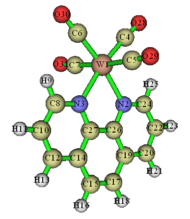
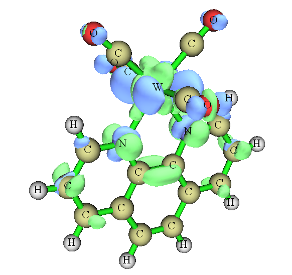
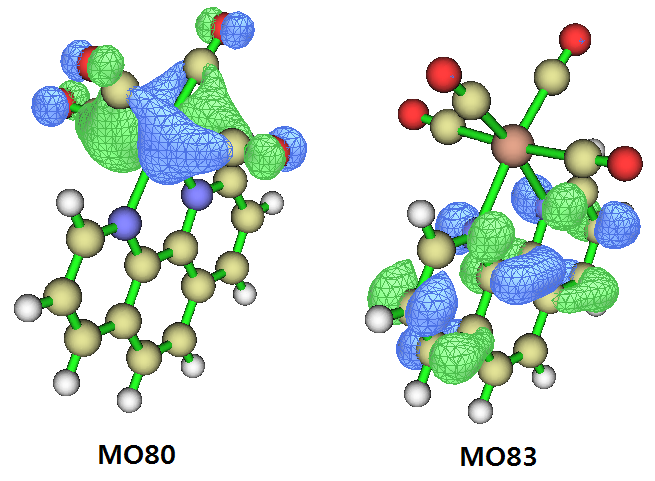
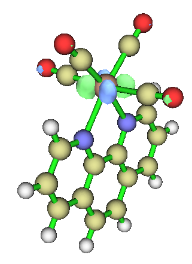

**电子激发过程中片段间电荷转移百分比的计算**

Calculation of percentage of inter-fragment charge transfer in electronic transition   
文/Sobereva @[北京科音](http://www.keinsci.com)

First release: 2017-Dec-15   Last update: 2022-Mar-15

  

## 1 前言

电子激发过程往往伴随着电子分布范围的明显转移，在一些文献里经常给出电子跃迁过程中某片段向另一个片段电荷转移特征的百分比，CT%。比如对于配合物体系，很常见的跃迁模式是Metal-to-ligand charge transfer (MLCT，金属向配体的电子转移），许多研究此类体系的文章都给出基态向各个激发态的MLCT(%)。经常有人问怎么计算这个，其实很简单，本文就以下图所示的W(CO)4(phen)作为实例演示一下。本文提到几种不同方法，如果你着急算出来的话，直接看第5节用IFCT分析即可，这是最简单也最理想的，其它方法都可以不用考虑。  

  
本文的计算和分析分别使用Gaussian 16 A.03和Multiwfn官网上的最新版本完成，后者可在其主页<http://sobereva.com/multiwfn>上免费下载，入门贴看《Multiwfn入门tips》（<http://sobereva.com/167>）。文献里常用“电荷转移”这个词，为了与习俗相同，下文也用这个词，但为了避免误解，这里明确一下：在本文中说A向B的电荷转移，一律等价于说A向B的电子转移。本文讨论的都是单电子激发（TDDFT基本也只能描述这个），双电子激发的情况不属于本文范畴。  
  
本文涉及的输入输出文件可以在这里打包下载：[file.rar](http://sobereva.com/usr/uploads/file/20171215/20171215020724_83723.rar)。结构已在B3LYP下对配体用6-31G*、对W用SDD优化过。  
  
  

## 2 基于原子电荷计算电荷转移百分比

设体系被分为两个片段A、B，则电子激发过程中片段A向片段B的电荷转移百分比可以这样计算：  

q(A→B)=[q(A,EX)-q(A,GS)]*100%

其中GS和EX分别代表基态和激发态，诸如q(A,EX)就代表某个激发态时片段A的电荷，它可以通过将这个片段里所有原子的原子电荷的加和得到。显然，如果激发前后，片段A的电荷变化为0，则q(A→B)=0%；如果激发时片段A恰好把一个电子转移给了其它区域，即片段B，那么q(A→B)=100%。如果算出来是负值，显然就是代表电子激发时电子从片段B转移给了片段A。  
  
原子电荷的计算方法很多，见《原子电荷计算方法的对比》（<http://www.whxb.pku.edu.cn/CN/abstract/abstract27818.shtml>）。一般来说，用常用的ADCH、Mulliken、NPA、CHELPG电荷来计算电荷转移百分比都可以，定量上肯定会有些差异。下面例子用的是笔者在J. Theor. Comput. Chem., 11, 163 (2012)提出的ADCH电荷，通过Multiwfn来计算。Multiwfn计算原子电荷时可以很方便地定义片段，片段电荷可以一下子就得到，免得手动去加和了。  
  
W(CO)4(phen)的基态是单重态，首先对它进行计算，从而得到记录基态波函数信息的S0.chk。输入文件内容如下。考虑到此体系涉及电荷转移激发，用了适合此类问题的CAM-B3LYP。注意基态和激发态用的计算级别必须相同，否则之后对两个态间片段电荷求差将无意义。（本文用的是Gaussian16，默认是int=ultrafine，用这么高积分格点完全没必要，所以额外写了int=fine降低耗时）  
%chk=S0.chk  
#P CAM-B3LYP/genecp int=fine  
  
B3LYP/6-31G* with SDD opted  
  
0 1  
[坐标]  
  
C O N H  
6-31G*  
****  
W  
SDD  
****  
  
W  
SDD  
  
  
然后再做TDDFT电子激发计算，这里假设我们要考察第二单重激发态（S2）的电子分布情况，所以root=2，并且通过out=wfn density把S2的自然轨道写到.wfn文件里（对这部分不懂的人看《Gaussian中用TDDFT计算激发态和吸收、荧光、磷光光谱的方法》<http://sobereva.com/314>和《详谈Multiwfn支持的输入文件类型、产生方法以及相互转换》<http://sobereva.com/379>）。输入文件如下：  
#P CAM-B3LYP/genecp int=fine out=wfn TD(root=2) density  
  
B3LYP/6-31G* with SDD opted  
  
0 1  
[坐标]  
  
C O N H  
6-31G*  
****  
W  
SDD  
****  
  
W  
SDD  
  
S2.wfn  
  
  
下面，我们计算一下S0→S2的MLCT百分比。此时金属自身就是一个片段，所以不需要在计算前先定义片段。先计算S0态的原子电荷，启动Multiwfn，依次输入  
S0.fchk    //通过formchk将S0.chk转换得到  
7   //布居分析与原子电荷计算  
11  //ADCH电荷  
1  //用程序内置的球对称化的自由原子密度  
W的基态的ADCH电荷为-0.053069。  
  
重新启动Multiwfn，载入S2.wfn，之后的步骤同上，得到W的S2态的ADCH电荷为0.212891。因此，S0→S2的MLCT百分比为[0.212891-(-0.053069)]*100%=26.6%。  
  
Gaussian输出文件里默认输出了Mulliken电荷（用Multiwfn也可以计算），基态时W是-0.214470，S2态是0.094357，对应MLCT百分比为30.9%。可见，虽然Mulliken电荷和ADCH电荷原理相差甚巨（后者可靠度通常更高），但计算的MLCT百分比倒是定性相符。不过如果用Hirshfeld电荷来计算，MLCT百分比只有16.7%，明显偏低，笔者不太推荐用Hirshfeld电荷讨论电荷转移量问题。  
  
我们可以把体系进行任意划分，得到电子跃迁中两个片段间的电荷转移百分比。比如，我们把W(CO)4作为一个片段，phen作为另一个片段进行考察。先计算S0态的W(CO)4部分的原子电荷，启动Multiwfn依次输入  
S0.fchk  
7   //布居分析与原子电荷计算  
-1  //定义片段  
1,4-7,28-31   //W(CO)4部分的原子编号  
11  //ADCH电荷  
1   //用程序内置的球对称化的自由原子密度  
程序在输出原子电荷之后，还输出了片段电荷，为-0.490847。以相同的方式，对S2.wfn再做如上操作，得到S2态W(CO)4的片段电荷为0.020310。因此，此激发中W(CO)4→phen的百分比为51.1%。这数值明显大于前面看到的MLCT百分比。因此暗示着，S0→S2的过程，不仅有W→phen的MLCT，还有显著的(CO)4→phen的Ligand-to-ligand CT (LLCT)特征。但是，我们不能把(CO)4→phen的百分比简单估计为51.1%减去前面得到的MLCT百分比26.6%，因为W和(CO)4之间也有电荷转移。  
  
为了更好地理解上面计算出的数据，我们可以用S2.wfn和S0.fchk对S2和S0之间绘制电子密度差图，步骤在这里有详细介绍：《使用Multiwfn作电子密度差图》（<http://sobereva.com/113>），结果如下。绿色和蓝色分别代表电子激发后电子增加和减少的部分，等值面数值为0.004。  

  
虽然从此图上不太便于定量考察，但整体上可以看出，跃迁导致phen部分电子密度增加，而W和(CO)4部分电子密度都有所降低，这和前面的定量数据结论相符。  
  
  

## 3 通过考察轨道成份计算电荷转移百分比

上一节是从片段电荷量的净变化角度进行考察，这一节通过轨道的角度考察电荷转移百分比。一般我很不建议用这一节的做法，主要在于电子激发不可能被一对轨道跃迁完美地描述，因此不管考察哪一对轨道来计算电荷转移百分比都不是严格的。即便借助NTO分析，贡献最大的NTO轨道对的贡献量偏离100%往往还是不可忽略的。因此本节的做法不是普适的，读者了解一下就行了。  
  
上面考察的S0→S2的激发，从Gaussian输出文件看几乎完全对应于MO80→MO83的激发，贡献达到96.6%（不会算者看此文《电子激发任务中轨道跃迁贡献的计算》<http://sobereva.com/230>），因此也可以直接通过分析MO80和MO83的轨道成份来讨论电荷转移百分比。这两个轨道图形如下（等值面数值=0.05）：  

  
按照《谈谈轨道成份的计算方法》（<http://sobereva.com/131>）里的步骤，我们用Multiwfn对S0.fchk记录的轨道通过Hirshfeld方法进行轨道成分分析。MO80和MO83当中W的贡献分别是47.1%和2.8%，因此，我们可以说此体系的MLCT百分比为47.1%-2.8%=44.3%（如果用Mulliken方式计算轨道成份，结果为60.7%-3.6%=57.1%）。  
  
肯定有人深感困惑，上一节的方法算出来的MLCT百分比不算特别大，怎么这回算出来的结果这么大？差异实际上来自于非弛豫密度和弛豫密度的差别。按照Gaussian输出文件里轨道跃迁和组态系数，直接构建的激发态密度叫做非弛豫密度(non-relaxed density)，这可视为实际激发态密度的最低阶近似，或者可以认为这是电子激发一瞬间的激发态密度。而弛豫密度，姑且可以视为之后经过电子密度进一步重排，达到稳定状态的密度，更接近实际情况。在Gaussian里，直接用density关键词默认给出的激发态密度是弛豫密度，产生弛豫密度耗时是比较高的，比做普通TDDFT计算本身要高非常多。若我们将MO80和MO83的分布图，与上一节绘制的基于弛豫的激发态密度得到的密度差图进行对比，也可以看出弛豫和非弛豫密度的差别。MO83完全是在phen配体上，在W上没有任何分布，而从基于弛豫密度的密度差图上看，电子激发时W的附近有的地方电子密度降低，而有的地方密度则增加。因此考虑了激发态密度弛豫效应时，电子从W到phen的净转移量没那么大。如果你想用上一节方式考察电荷转移问题，但又想用非弛豫密度，那就把density后面写上=rhoci即可（我的观点是，基于弛豫密度和非弛豫密度讨论都可以，至少同一篇文章里必须统一。不想花额外时间产生弛豫密度就通过非弛豫密度下的原子电荷、密度差讨论，或者通过轨道讨论）。  
  
我们还可以考察(CO)4到phen的LLCT百分比。我们需要计算一下MO80中(CO)4的成份。令Multiwfn载入S0.fchk，然后执行下述操作即可：  
8  //轨道成份分析  
8  //Hirshfeld方式计算轨道成份  
1  
-9  //定义片段  
4-7,28-31  
80  //轨道编号  
得到(CO)4对MO80贡献为47.2%。然后输入83，得到(CO)4对MO83贡献为5.8%。因此，S0→S2的激发中(CO)4→W(phen)的特征百分比是47.2%-5.8%=41.4%。由于W在MO83中的贡献仅有2.8%，可忽略不计，因此，我们可认为(CO)4→(phen)的LLCT百分比大约是41%。（我们不能简单地从41.4%中减去2.8%作为准确的LLCT百分比，因为MO83中W的2.8%对应的电子也可以是来自于W自身的）  
  
通过轨道方式讨论S0→S2比较容易，因为此时只有一对MO产生了不可忽视的贡献。但是，很多电子态的跃迁需要通过多对MO跃迁才能较好描述，这就得考虑许多对MO了，会十分麻烦。好在多数此类情况，可以将MO转化为NTO来解决，见《使用Multiwfn做自然跃迁轨道(NTO)分析》（<http://sobereva.com/377>）。如果发现只有一对NTO产生绝对的主导，那么只要分析这两个NTO的成份，就可以按上述方式讨论片段间电荷转移百分比。  
  
另外顺带一提，有些文献、书籍里描述电荷转移问题很粗糙。我们如果把轨道等值面数值提升到0.015，那么看到的MO80是这样的：  

根据化学常识，可以知道这对应的是W的d轨道。于是，有人会说S0→S2就是W的d电子向phen配体的激发。根据上面的讨论，可以知道这种说法非常粗劣，因为我们通过计算看到，LLCT和MLCT特征百分比都有40%出头，描述时忽略任意一种都是明显不恰当的！

## 4 通过空穴-电子分析考察电荷转移百分比

使用Multiwfn强大、直观的空穴-电子分析计算电荷转移百分比非常严格，对任何体系都是普适的，详见《使用Multiwfn做空穴-电子分析全面考察电子激发特征》（<http://sobereva.com/434>），里面的4.2节通过配合物实例介绍了怎么利用空穴-电子分析给出的数据考察电荷转移百分比。简单来说，你需要计算某片段在空穴和电子分布中各自占的百分比，然后求差后取绝对值再乘以100%。

## 5 通过IFCT分析考察电荷转移百分比

这是最理想且最方便的计算电荷转移百分比的方法。如果你使用2022-Mar-15及以后更新的Multiwfn版本，按照《在Multiwfn中通过IFCT方法计算电子激发过程中任意片段间的电子转移量》（<http://sobereva.com/433>）中的方法用Multiwfn做完IFCT分析后，在屏幕上直接就给出了CT(%)和LE(%)，省事至极！计算原理请读者看Multiwfn手册3.21.8节中On the evaluation of CT%部分的说明。而且这个方法可以用于包含任意多个片段的情况，而不像前文其它方法那样只能用于两个片段。而对于只有两个片段的情况，IFCT分析会给你intrinsic CT(%)和apparent CT(%)两种方式定义的电荷转移百分比，区别和定义在手册里也都说了。简单来说，intrinsic CT(%)体现的是内在的电荷转移百分比，体现的是真实参与了电荷转移的电子量，没有纳入A→B和A←B片段间两种方向电子转移造成的抵消，是只有靠IFCT方法才能得到的物理意义非常强的CT%的定义；而apparent CT(%)可以认为是表观的电荷转移百分比，是基于净转移电荷量计算的，已考虑了不同方向电子转移产生的抵消效应，和前文那些方法在本质上相一致，且结果和第4节介绍的方法精确相同。通常不太可能电荷转移在你定义的两个片段间是严格单方向的，显然此时intrinsic CT(%)比apparent CT(%)更大。

最后，还要强调一点，不管你用哪个方法算CT%，其结果都是直接依赖于片段的定义的，因为这体现的是你定义的片段间的电荷转移情况。假设你把整个体系就定义为一个片段，那么所有激发态的CT%则都精确为0。
