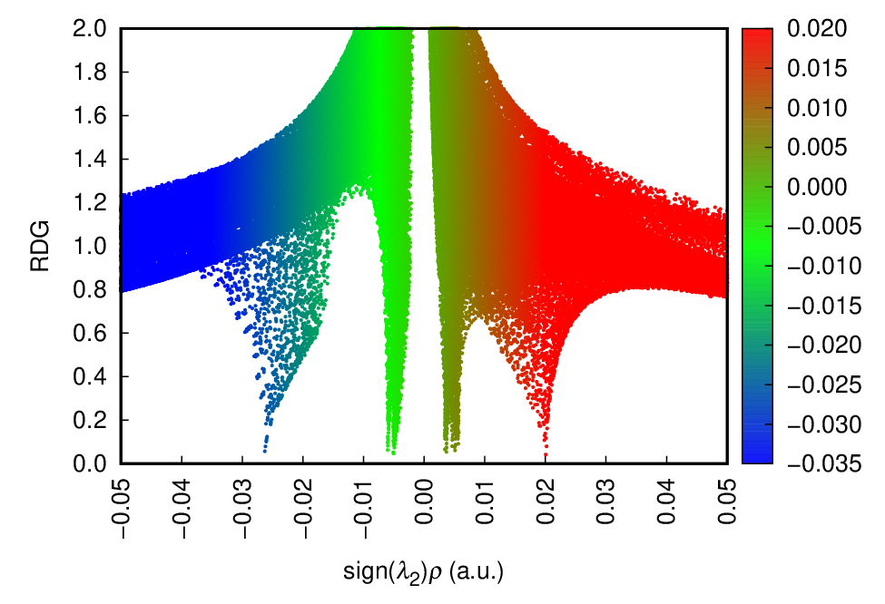
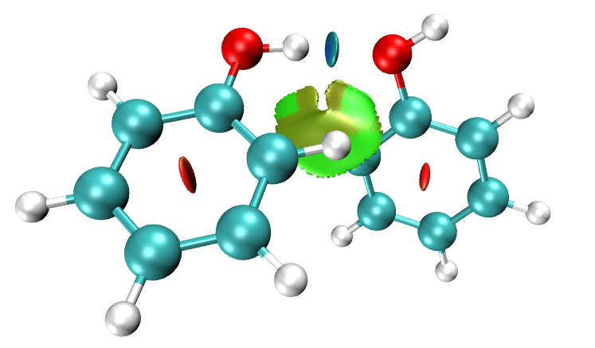

**绘制有填色效果的用于弱相互作用分析的RDG散点图的方法**

Method to draw RDG scatter map with coloring effect for weak interaction analysis   
文/Sobereva @[北京科音](http://www.keinsci.com/)

First release: 2017-Dec-17  Last update: 2022-Aug-11

2010年提出的用于分析弱相互作用的RDG方法（文献中也普遍叫NCI方法）已被广泛用于考察各种分子间/分子内弱相互作用了，笔者也写过不少相关文章，不了解此方法的者看《使用Multiwfn图形化研究弱相互作用》（<http://sobereva.com/68>）以及里面提及的相关文章，特别是推荐看《一篇最全面介绍各种弱相互作用可视化分析方法的文章已发表！》（<http://sobereva.com/667>）和《Angew. Chem.上发表了全面介绍各种共价和非共价相互作用可视化分析方法的综述》（<http://sobereva.com/746>）里介绍的笔者的综述。能做RDG分析的程序不少，Multiwfn（<http://sobereva.com/multiwfn>）是其中最为流行、强大、好用的。在上面的博文里已经介绍了怎么在Multiwfn中直接绘制RDG vs sign(lambda2)rho的散点图来考察弱相互作用。一些文章里的这种散点图还加上了填色效果，可以使得对应不同横坐标的spike的颜色一目了然，便于与Multiwfn+VMD绘制的RDG填色等值面图相对应来讨论问题。其实这种图稍有photoshop使用技能的人都可以不太困难地作出来，就是把VMD的色彩刻度条在ps里拉伸成与散点图作图范围相同的大小，垫在Multiwfn给出的散点图下方的图层，然后再把散点图的图层当中作图区域的黑色部分以色彩范围选择方式选中，删除，透出来下层的色彩刻度层即可。不过肯定有不少人嫌这种做法麻烦，此文介绍一种利用gnuplot程序的简单快捷的方法绘制这种填色RDG散点图。

读者请使用2019-Aug-24及之后更新的Multiwfn。这里用通过苯酚二聚体来示例，相应的波函数文件是Multiwfn文件包里examples目录下的PhenolDimer.wfn。本文的操作在《使用Multiwfn做NCI分析展现分子内和分子间弱相互作用》（<https://www.bilibili.com/video/av71561024>）里也有视频演示。

启动Multiwfn，依次输入以下命令，让Multiwfn把此体系的RDG vs sign(lambda2)rho的散点数据导出到当前目录下的output.txt中。  
examples\PhenolDimer.wfn  
20  //弱相互作用图形化分析  
1  //NCI分析  
3  //高质量格点  
2  //导出散点数据

gnuplot是个免费的轻量级的基于命令行的数据作图程序，各种系统都支持，可以在这里下载：<http://www.gnuplot.info>。本文用的是gnuplot 5.4 Windows版。将output.txt放到gnuplot目录下的bin子目录下，然后将Multiwfn目录下的examples\scripts\RDGscatter.gnu这个绘图脚本也拷到此目录下。开启操作系统的命令行模式（例如Windows下的cmd环境）并进入此目录，运行命令gnuplot RDGscatter.gnu（对于Windows用户，这一步不知道怎么弄的话直接把RDGscatter.gnu拖到gnuplot.exe图标上也行），就会在当前目录下产生RDGscatter.ps，这就是填色散点图的postscript格式的文件了。这是一种矢量图形格式，可无损缩放，很多程序都可以查看。比如可以直接用acrobat打开，打开后可以无损缩放。也可以用photoshop打开，打开的时候可以选择产生像素为多大的图片。如果机子里装了ghostscript程序，也可以用小巧且强大的看图程序irfanview观看。如果你懒得装单机程序，也可以用免费的在线程序<https://cloudconvert.com/image-converter>把ps格式转成常见图像格式。此例效果如下：

RDGscatter.gnu脚本里有很多参数可以设定，比较关键的参数就是X,Y轴以及色彩刻度轴的上下限（x/y/cbrange后面的值）、标签的数值范围和步长（x/y/cbtic后面的值）、散点的大小（pointsize后面的值），以及色彩刻度的定义。笔者习惯在VMD中用-0.035~0.02来对RDG等值面着色，色彩刻度是默认的蓝-绿-红，因此脚本中可以看到这样的设定  
set palette defined (-0.035 "blue",-0.0075 "green", 0.02 "red")

如果要把填色的散点图与VMD绘制的填色的RDG等值面图相对照，则二者色彩刻度设定必须严格一致。比如在Multiwfn目录下的examples\RDGfill.vmd文件就是VMD里绘制填色等值面图的脚本，这里面mol scaleminmax top 1那一行后面的值应该设为-0.035 0.02才能与上图来对照（默认就是如此）。在这种色彩刻度下绘制的苯酚二聚体的RDG填色图如下所示，很明显散点图上各个spike位置和RDG填色图上的等值面通过颜色很容易进行一一对应。

笔者在《使用IRI方法图形化考察化学体系中的化学键和弱相互作用》（<http://sobereva.com/598>）中介绍的我提出的IRI方法比RDG方法明显更强大，不仅可以展现弱相互作用区域，还可以展现化学键作用区域，因此建议用IRI取代RDG。Multiwfn里IRI分析的界面和RDG分析如出一辙，可以导出IRI vs sign(lambda2)rho的散点数据到output.txt。之后用examples\scripts\IRIscatter.gnu（2022-Jul-16及以后更新的Multiwfn才有）代替上文的RDGscatter.gnu就可以绘制出填色的散点图。如果把脚本里的横坐标范围设大，比如设到-0.05到0.03范围，还可以使散点图把化学键作用区域的spike展现出来。例子看Multiwfn手册4.20.4节。

笔者提出的IGMH方法现在也特别流行，远比RDG更适合专门考察片段间的弱相互作用，在《使用Multiwfn做IGMH分析非常清晰直观地展现化学体系中的相互作用》（<http://sobereva.com/621>）博文中有详细介绍。IGMH方法也可以绘制填色散点图，这在此博文里提到的IGMH官方教程里有很具体的例子。
