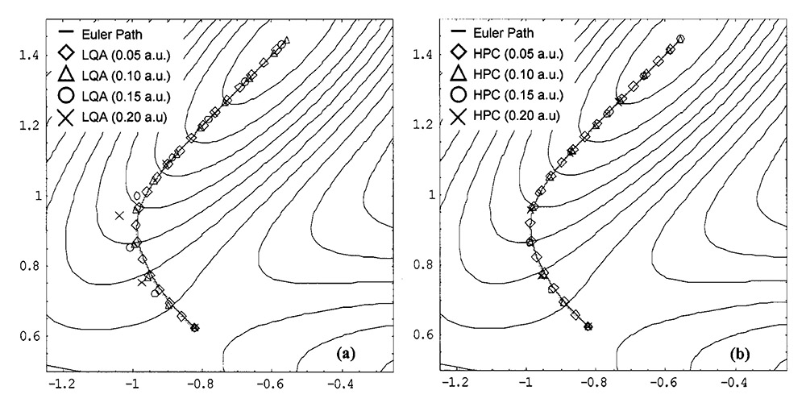
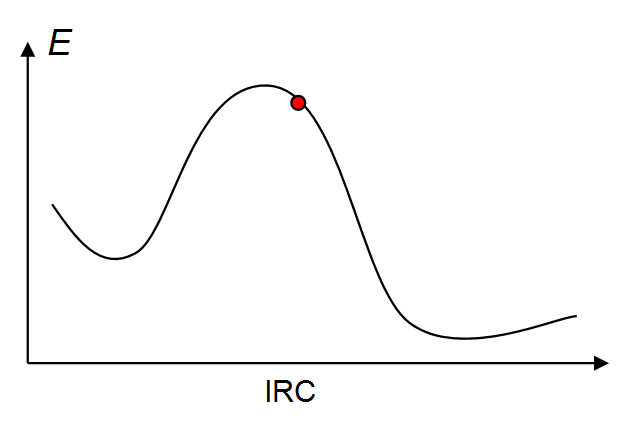
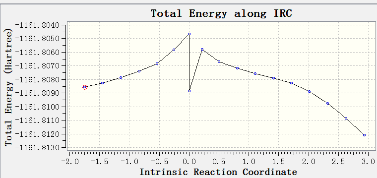
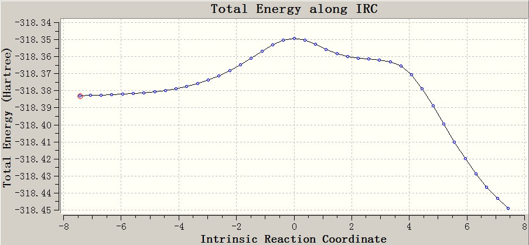

**在Gaussian中计算IRC的方法和常见问题**

Methods and FAQs for calculating IRC in Gaussian

文/Sobereva @[北京科音](http://www.keinsci.com)

First release: 2018-Jan-4  Last update: 2020-Sep-14

## 0 前言

IRC是量子化学研究化学反应的重要概念，它是质权坐标下连接势能面相邻两个极小点的能量最低路径，描述了化学过程在不考虑热运动因素下最理想的结构变化轨迹，对于讨论微观化学过程至关重要，而且也是验证过渡态找没找对的最决定性的方法。在无数年前笔者写的《过渡态、反应路径的计算方法及相关问题》（<http://sobereva.com/44>）中有很多介绍和讨论，建议看看。

在Gaussian中计算IRC的问题是笔者在网上被问及最多的问题类型之一，在计算化学公社论坛(<http://bbs.keinsci.com>)和思想家公社QQ群里属于半周经问题。为了免得日后反复重复回答大量相似问题，决定写个文章专门说一下。下文先说一下Gaussian中产生IRC的方法，然后再集中回答一下我常被问及的各种与IRC有关的问题。还有很多其它和做IRC有关的知识，限于时间精力以及表达形式的限制就不写在这里了，在笔者讲授的北京科音初级量子化学培训班（<http://www.keinsci.com/workshop/KEQC_content.html>）里对IRC和相关问题有比本文全面详细得多的讲解，给了十分丰富的例子。在面向已有一定基础的研究者开设的北京科音基础（中级）量子化学培训班（<http://www.keinsci.com/workshop/KBQC_content.html>）里对这部分内容讲授得明显更深入，并传授更多经验技巧，欢迎参加！

笔者还另外写了一篇和IRC有密切关系的文章《谈谈Gaussian产生downhill路径的功能》（<http://sobereva.com/571>），是Gaussian的IRC功能的一个特殊用法，推荐在看完本文后阅读。

本文内容适用于Gaussian09和16。

## 1 在Gaussian中产生IRC的方法

在产生IRC之前，必须先进行过渡态(TS)优化。必须以过渡态的结构为初始结构，才能进行IRC任务。既可以将优化出的TS结构直接写在IRC输入文件里，也可以用geom=check关键词从优化TS任务的.chk文件里读取最后一帧结构。  
  
下面是一个最简单、典型的找TS+走IRC的过程：  
(a)在gview里凭借化学直觉将体系摆成尽可能接近于过渡态的结构，保存输入文件为TS.gjf。  
(b)将TS.gjf里的关键词设为# B3LYP/6-31G* opt(calcfc,noeigen,TS)，用Gaussian执行之  
(c)打开上一步任务的输出文件，保存成输入文件IRC.gjf  
(d)将IRC.gjf里的关键词设为# B3LYP/6-31G* IRC=calcfc，用Gaussian运行即可得到IRC。此任务出现报错几率很大，仔细耐心阅读完本文就知道怎么办了。  
  
IRC任务特别需要注意的一点是，产生IRC和找过渡态用的计算级别必须严格一样！确切来说，任何影响势能面的设定必须严格相同（如果你不知道哪些会产生影响，比较修改前后单点能是否有差异便知）。比如找过渡态用了int=ultrafine scrf(SMD,solvent=ethanol)，那么产生IRC的时候也必须写上int=ultrafine scrf(SMD,solvent=ethanol)，否则相当于两个任务的势能面并不相同，走IRC也就不是从势能面的准确的一阶鞍点来走的，此时IRC任务要么出错，要么结果无意义。  
  
Gaussian09/16支持多种产生IRC的算法，比较主要的三个在这里说一下：  
LQA(Local quadratic approximation)：这是非常传统的一种IRC产生算法，1988年提出了，每一步都需要利用Hessian矩阵。  
HPC(Hessian-based Predictor-Corrector)：2004年由Gaussian作者之一Schlegel提出，这是G09/16默认的算法。这个方法产生IRC每一个点的时候，是将LQA方法作为预测步(predictor)，再用修改的Bulrisch-Stoer方法做为校正步(corrector)。这样“预测+校正”结合起来，精度比只用LQA更好，而耗时增加不多。此方法校正步的计算过程是一个迭代过程，众所周知，只要有迭代，就会伴随着不收敛的可能。HPC方法的一个最大问题，正是做校正步的时候经常不收敛，导致网上问Gaussian的IRC问题的多半都是问这个。  
GS2：1989年提出，GS是Gonzalez-Schlegel的缩写。这是G03默认的算法，在《过渡态、反应路径的计算方法及相关问题》里有详细介绍。此方法之所以不再是如今版本默认的，是因为此方法耗时比HPC高很多，每一步都相当于做一次限制性优化。  
Gaussian里还支持其它方法，诸如DVV、EulerPC等，由于平时用不到，所以就不提了。  
  
走IRC时，对初始结构需通过calcfc关键词来产生精确的Hessian矩阵。LQA和HPC方法走每一步的时候也都需要Hessian矩阵，默认情况下是通过Bofill方法基于梯度和前一步的Hessian近似产生的。如果你在IRC里用calcall关键词代替calcfc，则每一步的Hessian矩阵都会精确生成，显然IRC走得也会更准确，但是耗时会暴增一个数量级甚至更多。也可以在写calcfc的同时用recalc=n关键词，此时每n步才会精确重算一次Hessian矩阵。显然，n越小越准确，耗时也越高，n=1时和calcall是等价的。  
  
走IRC默认是先往反应路径一边走，之后再往另一边走，两边的路径和初始的TS结构合在一起就是完整的IRC。IRC每一帧结构对应一个反应坐标和一个能量，通常将IRC以“能量vs反应坐标”绘制成曲线图表示。在Gaussian中IRC任务的初始结构（过渡态结构）被作为反应坐标的零点，往反应物一侧反应坐标为负，往产物一侧反应坐标为正（但有时也可能是和实际情况反过来的，看后文）。Gaussian给出的反应坐标单位是amu^1/2 Bohr，这里amu是指atomic mass unit，有amu^1/2这项是因为IRC是在质权坐标下定义的。  
  
由于IRC是在质权坐标下定义的，因此结果受同位素质量设定的影响，这里有具体例子展现同位素产生的影响《谈谈温度、压力、同位素设定对量子化学计算结果产生的影响》（<http://sobereva.com/423>）。如果在IRC里写上Cartesian关键词，代表在笛卡尔坐标下执行IRC任务，此时结果就不叫IRC了，确切来说叫做MEP（minimal energy path，极小能量路径）。笔者时不时看到有的菜鸟莫名其妙地在IRC里写了个cartesian关键词，明明他都不知道这是什么含义就瞎写，明显是被以讹传讹了，而且还是不求甚解就知道盲目模仿。  
  
在IRC里可以用Reverse或Forward关键词让程序只往逆方向或者正方向一侧走IRC。经常有人问诸如怎么我写的是Reverse，但是Gaussian反倒往产物方向走了？或者，我让程序往两边走，走出来的IRC怎么左边是产物右边是反应物？那是因为哪边是反应物哪边是产物只有研究者自己知道，Gaussian知道的只是那是两个不同方向而已。如果你想明确让Gaussian知道指定哪边是正方向哪边是逆方向，需要在IRC里利用Phase关键词定义。  
  
走完IRC后，可以用gview打开输出文件，在窗口左上角切换帧号可观看IRC每一帧结构，或者点绿色圆点播放IRC轨迹。IRC轨迹动画可以通过File - Save Movie - Save Movie File保存出来。IRC的“能量vs反应坐标”图可以用Results - IRC/Path来观看，点击图的左上角的Plots - Plot Molecular Property还可以把几何参数等信息随反应坐标的图绘制出来，在图上点右键还可以将数据点导出，用来在Origin之类程序里绘制和调节达到更好效果。  
  
走IRC有两个参数非常关键：  
(1)Maxpoints：设定的是每个方向走的步数，默认为10。比如设Maxpoints=20且让IRC往两边走，则IRC总共最多走1+2*20=41个点，其中1是过渡态那个点。注意maxpoints设的是步数上限，因为走IRC时，如果已经走到了被程序自动判断是离极小点很近的位置了，则IRC就认为这个方向的IRC已经产生完毕了，会提示PES minimum detected，然后就开始走另一头了。如果两头都走完了，就输出汇总信息然后正常结束了。maxpoints设的越大，显然IRC可能走的点数就越多，总耗时也会越高。  
(2)Stepsize：设的是IRC步长，默认为10。如果设的是正值，则单位是0.01 Bohr，如果设的是负值，则单位是0.01 amu^1/2 Bohr。比如你设stepsize=20，则步长就是0.2 Bohr，由于默认情况下IRC任务是在质权坐标下做的，因此程序会自动转换为以amu^1/2 Bohr为单位的质权坐标下的步长，仔细看输出文件就能找到相应信息。stepsize设得越小，IRC越准确、曲线越光滑，IRC轨迹震荡情况越不容易出现；stepsize设得越大，则IRC越不准确，曲线越可能出现褶皱，观看IRC轨迹时也越可能看到结构震荡现象，在用HPC方法的时候还越容易出现校正步不收敛而报错的问题。  
  
为了更直观看到stepsize对IRC产生的影响，以及LQA和HPC的差异，这里给出HPC原文里的图，这是对一个模型势能面Muller-Brown surface走IRC的情况：  

  
由图可见，相同步长情况下，右图的HPC方法跑出的IRC的点比左图的LQA方法更接近于精确的IRC曲线（实线），因为引入了校正步。而带来的代价就是在实际研究中很容易出现校正步不收敛问题。从上图也看出，IRC步长设得越小，走的IRC点也越接近精确路径，反之误差越大。在LQA方法结合0.2 Bohr步长（默认的stepsize的两倍）时走出的IRC已经误差挺明显了。  
  
maxpoints和stepsize共同决定IRC最多能走多长，即每一侧长度上限是maxpoints*stepsize。默认设定下，IRC只能跑出与TS比较接近的一段，如果你想让IRC跑得更长，显然要么增加maxpoints要么增大stepsize。增大maxpoints会增加耗时，而增大stepsize，则会导致IRC精度下降、HPC方法容易因校正步不收敛而出错。  
  
不同反应的反应路径的总长度是不同的，可能某个设定下对A反应已经把IRC跑得很完整了，但是对于B反应，IRC的两个端点距离反应物和产物极小点还尚有不小距离。要判断IRC是否跑得比较完整，可以看“能量vs反应坐标”两端曲线是否已经接近水平了，也可以看gview在“能量vs反应坐标”图下方给出的“受力vs反应坐标”图，如果两端的点的受力已经比较接近0了，也说明接近极小点了，跑得较完整了。  
  
到底maxpoints和stepsize应该怎么设合适？这要看你跑IRC到底想干嘛，以下是笔者的建议：  
(a)验证过渡态找没找对：对于这个目的，IRC只要跑一小段就足够看出趋势了，也不需要IRC跑得质量多高。maxpoints用默认即可，stepsize可以设大到15或20，从而在不增加计算量的前提下能比默认时稍微跑长一些。建议加上LQA关键词避免HPC方法因校正步不收敛而中断。  
(b)获得近似的反应物和产物结构：一切同上，但是把maxpoints设50甚至更大，从而使IRC尽可能跑完整。  
(c)获得高质量、完整的IRC曲线：这主要是用于发文章目的，粗糙、不光滑的IRC曲线图放到文章中肯定会遭人嫌，我们也希望IRC尽量跑完整从而能够充分描述整个反应历程。为了让IRC质量高，可以把stepsize设小到5。由于设小了步长，又想要IRC完整，maxpoints必须设很大，比如200。如果此时跑出来的IRC还是不平滑，或者因HPC方法的校正步不收敛而中途报错中断，应再加上calcall重新跑。如果计算能力不足用不起calcall，也可以用比如recalc=3或5。  
  
  

## 2 一些与IRC相关的常见问题

看这一节之前应确保已经仔细阅读、充分理解了上一节的文字。  
  
**Q：IRC任务报错啦！末尾提示Maximum number of corrector steps exceded咋办？**  
A：这就是前面反复说的HPC方法校正步不收敛。有以下办法：  
(1)用LQA，比如IRC(calcfc,LQA)，由于此时不涉及校正步了，因此100%解决问题。但这容易造成IRC不够准确、不光滑。  
(2)如果你不希望用LQA在避免报错的同时牺牲IRC精度，则尝试减小步长（越小避免报错的几率越高），比如用IRC(calcfc,stepsize=5)。或者加上calcall，若嫌太昂贵就改用recalc=x（x越小避免报错的几率越高，但也越昂贵）。  
(3)改用GS2算法，即IRC(calcfc,GS2)，可完全避免以上报错。耗时比LQA高得多，但精度也比LQA好。  
(4)IRC里加上ReCorrect=never，这使得HPC方法不做校正步，故也完全避免以上报错。此时耗时和LQA相同，但所得IRC精度不如LQA，因此强烈不建议用。  
(5)IRC里加上maxcyc=N（N应大于默认的20）来加大HPC校正步迭代次数上限。笔者时常在菜鸟的IRC输入文件里看到这关键词，笔者强烈不建议用。虽然此方法不是说解决问题的可能性精确为0%，但可能性实在甚微，没有试的必要。“不收敛就直接加大循环次数上限”是菜鸟最常见的思维方式。  
  
顺带一提，有时笔者看到有人的IRC输入文件里在IRC里用了tight，这是用来把校正步收敛限设得更严的，用这个完全是莫名其妙，也不知道从哪里学来的。本来默认的收敛限下就容易不收敛，居然还给设得更严，明显会导致出现上述报错的几率大增。  
  
**Q：怎么IRC刚走了几步就正常结束了？怎么IRC走出来的两侧的曲线是相同的？**  
A：此问题是继上一个问题在网上被问得最多的与IRC有关的问题。出现这种问题都是因为优化过渡态时定位准确度不够。看下图，当优化出的过渡态位置不准确时，结构就不是在IRC的极大点了，而是稍微偏离一些的红球的地方  

出现这种情况时，往右边产生IRC能正常产生，但是从红球位置往左边产生IRC时，还没怎么走，程序就发现能量升高了，误以为IRC已经走到了离极小点很近的位置，于是就不再继续走了，就正常结束了。还有一种情况，是刚往左边走IRC，由于体系受力是冲着右边的，导致马上转了个弯就往右边走了，就呈现了IRC左右两边曲线都一样的结果。  
  
对这个问题，应按照以下方式排查和尝试解决  
(1)先确保初始结构是之前优化TS得到的结构，而且过渡态优化和走IRC都是在严格相同级别下进行的。  
(2)提高过渡态定位精度。在找过渡态时候用tight，对于DFT再同时结合int=ultrafine（此时产生IRC也必须用int=ultrafine）。如果还不行，优化过渡态时用calcall（或者用诸如recalc=3）。  
(3)如果反复尝试了(2)的方法还是不行，或者你不想尝试(2)，毕竟会增加很多耗时，那也可以尝试增大IRC步长，比如20乃至30。由于步长大了，从上图红球的位置往左走的时候可能一下子就越过了TS，之后就能正常继续往左产生IRC了。不过步长大了容易导致HPC校正步不收敛、IRC不准确不平滑等问题，怎么考虑和处理前面已经说了。

另外，出现这种问题还有一种可能是在IRC任务中，基于自动初猜的波函数做SCF后收敛到的波函数与找过渡态任务最终得到的波函数不同，此时相当于IRC任务所在的势能面和过渡态搜索任务所在的势能面不同，这也会导致IRC异常，因为类似于违背了前述的走IRC的“任何影响势能面的设定必须严格相同”的这个前提。出现这种情况时，你会发现IRC任务第一次输出的SCF Done能量和找过渡态最后一步的SCF Done能量明显不同。为解决此问题，走IRC的时候可以用guess=read关键词，从优化过渡态的chk文件中读取最后的波函数（并且最好用forward和reverse关键词通过两个任务分别跑正向和逆向IRC），这样通常可以确保IRC任务所在的势能面和优化过渡态时相同。

用SMD溶剂模型时，也可能个别时候由于数值噪音问题出现IRC走几步就停了的现象。可将优化和走IRC用的溶剂模型都改为IEFPCM再试，说不定能解决。  
    
**Q：我的IRC怎么成这样了？怎么有个点跑到下头去了？**

A：即便IRC任务还在算着，也可以用gview打开输出文件看看走到第多少步了，检查是否正常。当IRC还没有走完的时候就打开输出文件，或者看的是IRC失败的任务的输出文件，往往就会看到中间有一个点突然掉下去的现象。任务正常结束后再看就不会有这个现象。  
  
**Q：走出来的IRC最两端的点是反应物和产物结构么？**  
A：否。IRC和几何优化不一样，几何优化的步长是随机应变的，而IRC的步长是固定的。从TS开始走，即便把maxpoints设得非常大，stepsize设得很小，来让IRC跑得又完整质量又高，也注定不可能恰好有一个IRC点正好落在与反应物或产物对应的极小点的位置。因此，必须对IRC两端的点进一步做几何优化才能得到准确的反应物或产物结构。  
  
**Q：为什么我看IRC趋势是对的，我对IRC两边的点优化，优化得到的结构却不是我想要的极小点结构？**  
A：有两种可能：  
(1)与这个TS直接连通的极小点本来就是那样。由于你的IRC跑得还太短，在加上你的化学直觉不准，导致并没有估计对真正极小点结构。可以让IRC尽量跑完整一些来检验。  
(2)优化的时候由于走得步子太大，或者Hessian矩阵不准确，导致优化到了其它邻近的极小点去。此时可以在优化时用较小的步长上限并结合notrust（相关信息看《量子化学计算中帮助几何优化收敛的常用方法》<http://sobereva.com/164>），或者结合calcall/recalc=x提供精确Hessian矩阵，或者先把IRC跑得尽量长一些，使两端结构尽可能接近极小点时再做几何优化。  
  
**Q：柔性扫描和IRC有什么区别？柔性扫描能代替IRC么？**  
A：二者概念完全不同，不能代替。IRC是从TS开始顺着虚频方向，沿着梯度负方向移动结构走出来的轨迹，所有坐标是同步变化的。而柔性扫描，是令某个（或某些）坐标以特定方式不断改变，每次都优化其余所有变量所得到的（限制性优化），故所有变量间的变化不是协同的，得到的能量变化曲线与IRC也是大相径庭的。柔性扫描曲线及其轨迹经常会出现突跃，而不像IRC那样总是平滑变化。不过，当某个化学过程主要只涉及一个变量发生变化的话，柔性扫描这个变量和走IRC产生的曲线倒是比较相近，此时如果你用的计算级别没有解析Hessian而不容易走IRC的话，用柔性扫描也未尝不可（比如当年没有TDDFT解析Hessian的时代，由于不方便找TS走IRC，对激发态质子转移过程的研究经常是靠柔性扫描来代替）。

关于柔性扫描，建议阅读《详谈使用Gaussian做势能面扫描》（<http://sobereva.com/474>）。  
   
**Q：我的IRC曲线在过渡态位置怎么特别尖/不平滑，貌似不对劲？**  
A：应当确认初始结构是优化过的过渡态结构，并且找过渡态和走IRC用的计算级别（包括任何能够影响单点能的因素）严格相同。如果你就是这样做的，那么尝试增加过渡态的定位精度，比如优化过渡态时用tight收敛限、calcall/recalc=x、增加积分格点精度等。如果这些也都试了，走IRC时用GS2算法，或加上calcall试试。另外也要确保IRC任务第一步收敛到的波函数与过渡态搜索最后一步相同，这在前面已经说过了。  
  
**Q：IRC任务如何续算？**  
在IRC里添加restart关键词即可，例如IRC(restart,maxpoint=15) b3lyp/6-31g(d)。此时%chk应当和之前中断的IRC任务相同。  
  
**Q：我发现之前IRC跑得不够长，如何在不完全重算的前提下在两侧再增加一些点？**  
A：比如maxpoints=15的设定下IRC任务已经正常跑完，现在还想两个方向各增加5个，执行IRC(restart,maxpoint=20)，%chk应当和之前的IRC任务相同。  
  
注意gview观看restart得到的IRC轨迹要打开chk/fch文件，而不要打开out/log文件，否则看到的只是续跑出来的点。  
  
**Q：IRC任务出现L502错误怎么办？**  
A：这是走IRC过程中出现了SCF不收敛所导致。按照常规解决SCF不收敛的方法尝试添加适当的关键词解决，见《解决SCF不收敛问题的方法》（<http://sobereva.com/61>）。除此以外，如果是IRC任务第一次做SCF就没收敛，而且之前opt任务的chk文件还在，可以做IRC任务时加上guess=read读取其中收敛的波函数当初猜。如果是IRC中途某个点SCF不收敛，也可以减小IRC步长，因为IRC的每个点会自动沿用上个点收敛的波函数当初猜，显然二者结构相差越小，那么上个点收敛的波函数就是这个点越好的初猜波函数。  
  
**Q：我的IRC看起来比较怪，合理么？怎么边上还凸起来一块？（下图为笔者随便找的例子）**

A：很正常。只要确信自己计算流程合理，而且轨迹看着无异常，TS位置曲线也平滑，就没有问题。出现诸如肩峰往往暗示这个反应涉及的电子结构变化复杂，可能整个反应虽然是一步，却呈现出两个阶段，应当结合结构变化特征、波函数分析手段（比如用Multiwfn分析反应过程中键级、ELF、密度差、原子电荷变化等）予以考察。  
  
**Q：我的理论方法支持解析梯度但不支持解析Hessian（比如CCSD），怎么跑找TS并且跑IRC？**  
A：先说此时怎么找TS。有两类做法：  
(1)纯依赖于梯度的方法  
用CCSD/cc-pVDZ opt(TS,modRedundant,noeigen)或者opt(TS,gediis,noeigen)或QST2/3，这些过渡态搜索关键词都不需要提供初始Hessian  
(2)基于半数值Hessian的方法  
把初猜TS结构的Hessian矩阵存到chk文件里：# CCSD/cc-pVDZ freq（这步耗时很高）  
从chk里读Hessian矩阵并优化TS：# CCSD/cc-pVDZ opt(TS,noeigen,readfc)  
  
找到TS结构后，使用这个关键词即可生成IRC：CCSD/cc-pVDZ IRC(gradientonly,euler)。这里gradientonly代表使用只依赖于梯度的IRC算法，默认是DVV方法，由于结果烂到爆，所以改成相对好点的Euler方法，但质量也不怎么样，经常震荡得很厉害。  
  
**Q：我怎么对IRC过程做波函数分析，考察电子结构随反应过程的变化？**  
A：参看《产生Gaussian的IRC和SCAN任务每个点的波函数文件的工具》（<http://sobereva.com/199>）、《通过键级曲线和ELF/LOL/RDG等值面动画研究化学反应过程》（<http://sobereva.com/200>）。  
  
**Q：我之前对过渡态已经做过振动分析了，chk里已经有了过渡态结构下的Hessian矩阵，能否在IRC计算时直接读取之，避免用calcfc计算Hessian以节约时间？**  
A：完全可以，对较大体系也推荐这么做。在IRC里加上rcfc关键词即可，此时就不需要写calcfc了，程序会从%chk文件中直接读取Hessian矩阵来用。
