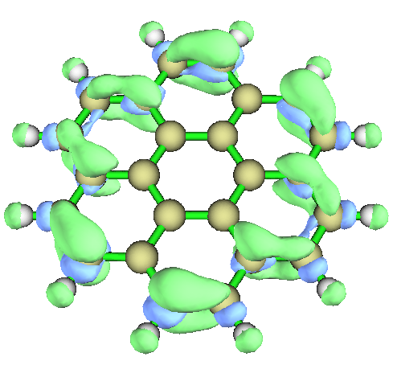
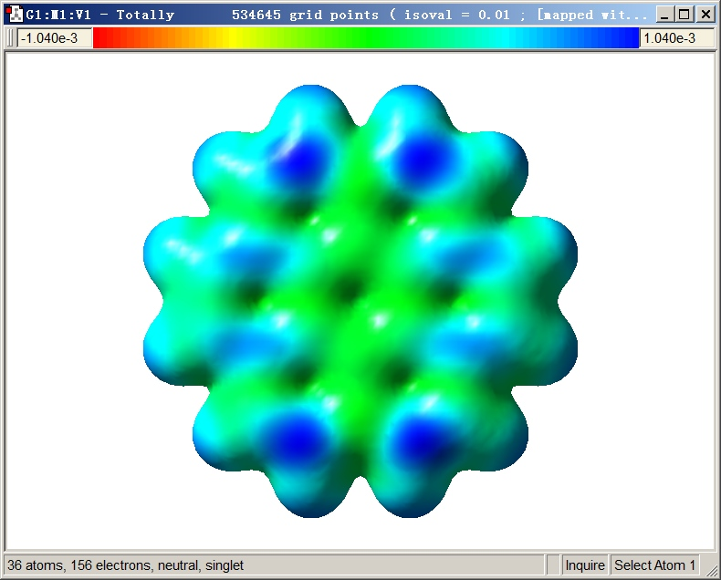
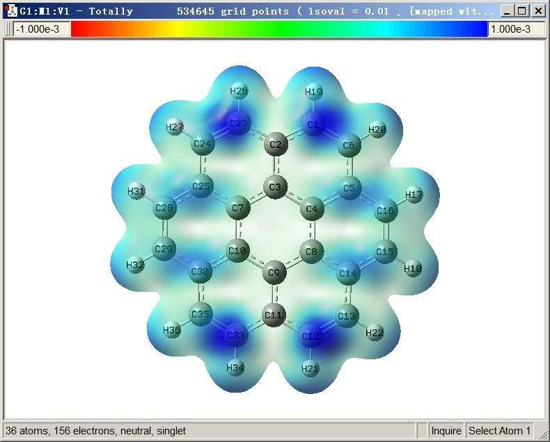
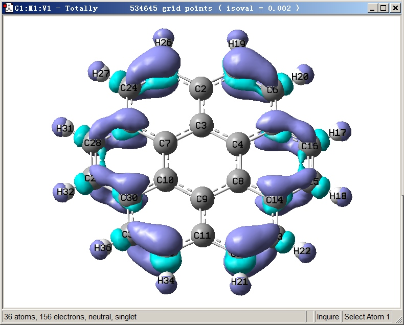
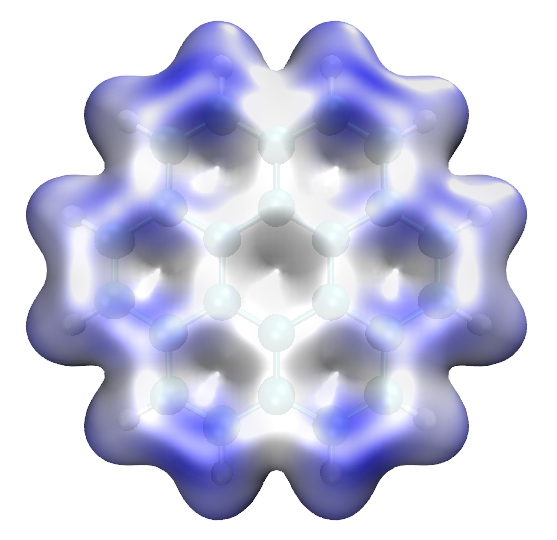

**基于Multiwfn产生的cube文件在VMD和GaussView中绘制填色等值面图的方法**

The way of plotting color-filled isosurface maps based on cube files generated by Multiwfn

文/Sobereva @[北京科音](http://www.keinsci.com/)  2018-Jan-6

## 0 前言

填色等值面图是一种重要的描述三维实空间函数分布特征的方法，最常见的就是分子表面静电势填色图，就是将静电势这个函数在电子密度等值面上各个位置的数值大小通过颜色表现出来。这种图笔者之前专门说过怎么绘制，见  
使用Multiwfn+VMD快速地绘制静电势着色的分子范德华表面图和分子间穿透图（含视频演示）  
<http://sobereva.com/443>  
巨大体系的范德华表面静电势图的快速绘制方法  
<http://sobereva.com/481>  
使用Multiwfn结合VMD分析和绘制分子表面静电势分布  
<http://sobereva.com/196>  
   
除了静电势外，也有很多其它函数也适合用填色等值面图考察，比如可以将福井函数、双描述符、HOMO/LUMO轨道波函数、平均局部离子化能(ALIE)、电子离域范围函数(EDR)等投影到电子密度等值面上，从而预测反应位点。实际上，利用Multiwfn的定量分子表面分析功能，可以对任意实空间函数构造等值面顶点，并计算任意实空间函数在上面的值，然后效仿《使用Multiwfn结合VMD分析和绘制分子表面静电势分布》的做法，即可通过在VMD中以point绘制方式显示出所有表面顶点，并根据pdb文件里的B因子的数据进行着色来绘制出填色等值面图。而更为一般化，也往往显示效果更好的做法是先用Multiwfn计算用来定义等值面的函数的格点数据，导出为cube文件；然后再计算出被投影的函数的格点数据，也导出cube文件。之后将这两个cube文件都载入到VMD、GaussView等程序里，就可以绘制填色等值面图了。此文就介绍一下在VMD和GaussView里具体怎么操作。  
  
本文使用的是Multiwfn 3.5(dev)版，可在<http://sobereva.com/multiwfn>免费下载，如果之前没用过强烈建议看看《Multiwfn入门tips》（<http://sobereva.com/167>）。gview用的是6.0.16版。VMD用的是1.9.3版，在<http://www.ks.uiuc.edu/Research/vmd/>可免费下载。系统为Win7-64bit。如果不知道cube文件是什么，建议看此文了解一下基本知识《Gaussian型cube文件简介及读、写方法和简单应用》（<http://sobereva.com/125>）。  
  
  

## 1 在Multiwfn中计算要用的cube文件

本文将以绘制晕苯(coronene)的福井函数f-在电子密度等值面上的填色图作为例子，用这种图可以预测体系亲电反应容易出现在哪。此体系的活性位点在笔者近期参与的一篇文章<http://www.tandfonline.com/doi/full/10.1080/00268976.2017.1403657>中也考察过。为了之后在VMD或gview中绘制这种图，我们先用Multiwfn计算体系电子密度cube文件和f-的cube文件。如果对福井函数不了解，应先看看《亲电取代反应中活性位点预测方法的比较》（<http://www.whxb.pku.edu.cn/CN/abstract/abstract28694.shtml>）。  
  
先在Gaussian中在B3LYP/6-31G*下优化中性状态的晕苯，将得到的chk文件转换为fch后命名为N.fch。然后基于优化的中性的晕苯的结构，将电荷和自旋多重度改为1 2（即+1阳离子态），算个单点任务（切勿做优化任务），将得到的chk转换并命名为N-1.fch。这里N-1中的N代表中性时的电子数，因此N-1.fch就意味着这个fch里记录的是+1电荷阳离子态的波函数信息。  
  
启动Multiwfn，输入以下内容  
N.fch  
5   //计算格点数据  
1   //电子密度  
2   //中等质量格点（如果是大体系，建议选high quality grid以保证之后绘制的图像质量较好）  
2   //将格点数据导出为当前目录下density.cub。然后手动把此文件改名为N.cub  
0   //回主菜单  
5   //计算格点数据  
0   //自定义运算  
1   //将有1个文件对N.fch进行运算  
-,N-1.fch   //将令N.fch的函数值减去N-1.fch的函数值  
1   //电子密度  
2   //中等质量格点（必须与产生N.cub时用的格点设定严格相同）  
2   //将格点数据导出为当前目录下density.cub。然后手动把此文件改名为f-.cub  
  
然后可以直接关闭Multiwfn。如果想看一下刚刚算出来的f-函数的等值面图的话，选-1，然后恰当设置isovalue使图像能充分体现不同区域函数分布，比如设成0.002的时候图像如下。由于在靠边缘区域f-有较大正值（绿色主导），因此边缘的碳的亲电反应活性比中间的碳明显要高。  

  
  

## 2 在GaussView中绘制填色等值面图的过程

  
下文对操作的每一步都详细写明了，如果没能画出来，应反复仔细阅读反复尝试  
  
把N.cub拖到gview里  
Results - Surfaces/Contours  
Cube Actions - Load Cube，选f-.cub  
此时Cubes Available里面会有两套格点数据。选中第一个，把Density框里的数值改为0.01  
Surface Actions - New Mapped Surface - OK  
如果你的默认背景不是白色，选File - Preference - Display Format，点Background Color右边的按钮将颜色改成白色  
  
此时屏幕上显示出的表面对应电子密度=0.01 a.u.的等值面，颜色对应于f-在这个表面上不同位置的数值，色彩刻度条在窗口上方。色彩刻度按照红-绿-蓝的顺序变化，对应f-数值由负到正。默认的色彩刻度下限是-0.00104 a.u.，上限是0.00104 a.u.。  

  
之后我们改进图像效果：  
在图像上点右键，选View - Display Format  
切换到Surface标签页，Format选Transparent。如果Fade mapped surface values没选上则选上。适当调节Transparent滑杆，使得色彩浓度合适，能清晰反映不同区域差异，同时图像又比较通透  
在色彩刻度下限和上限的文本框里分别输入-0.001和0.001并按回车，使得色彩刻度上下限是比较整的数  
  
最终图像效果如下，可见图像效果不错，图中越蓝的地方f-越大，亲电反应活性越高，这和在Multiwfn里看到的f-等值面图展现的分布特征是完全对应的。  

  
这里顺带一说怎么在gview里通过f-.cub显示其等值面，经常有人问此类问题。启动gview，将f-.cub拖入gview，选Results - Surfaces/Contours，Density设个合适的值比如0.002，选Surface Actions - New Surface，即得到下图。紫色和青色分别对应等值面为正和为负的区域。如果要改等值面颜色，进入File - Preferences - Colors - Surface Colors，选Default项，然后修改颜色设定即可。  

  
  

## 3 在VMD中绘制填色等值面图的过程

个人觉得在VMD里通过cube文件绘制的填色等值面图效果没gview好，操作也略微麻烦些，但好处是免费，而且比gview灵活得多，比如可以让Multiwfn把电子密度等值面上的福井函数的极值点位置找出来，导出成pdb文件，然后一起显示在VMD里，不过这点在本文不涉及，有兴趣可以参阅Multiwfn手册4.12.4节的信息和《使用Multiwfn结合VMD分析和绘制分子表面静电势分布》里的步骤。  
  
启动VMD，然后执行以下操作：  
Display - Rendermode - GLSL  
Display - Depth Cueing将雾化关掉  
Display - Axes - Off关闭坐标轴  
将N.cub拖进VMD Main窗口载入之，然后在出现的项目上点右键选Load Data into Molecule  
点Browse，选择f-.cub，点Load载入之，再关闭窗口  
在VMD命令行界面输入color Display Background white将背景改为白色  
Graphics - Representation，Drawing Method设为CPK  
点Create Rep新建用于显示等值面的层  
Drawing Method设为Isosurface，Isovalue设0.01。Vol右边的选项改为Vol0: N.cub，Draw右边的选项改为Solid Surface，Show右边的选项改为Isosurface  
Coloring Method改为Volume，右边的选项改为“1:”，Material改为Transparent  
点Trajectory标签页，Color Scale Data Range下面两个框分别输入-0.001和0.001，之后按回车（别输入一个后就按回车，必须两个都输入完再按一次回车）  
Graphics - Materials，选Transparent，把Opacity一项往右拉，使得填色等值面透明度降低，从而令表面的颜色更明显  
  
最终图像如下，越蓝说明f-越正，和gview的图展现的信息一致  

  
在VMD里如果想调节色彩刻度的颜色变化，可以进Graphics - Colors，点Color Scale，Method选其它的。  
  
怎么在VMD里显示f-.cub的等值面本文就不说了，按照《使用Multiwfn观看分子轨道》（<http://sobereva.com/269>）里说的步骤做就行了，只不过是把分子轨道的cube文件改成f-.cub。
