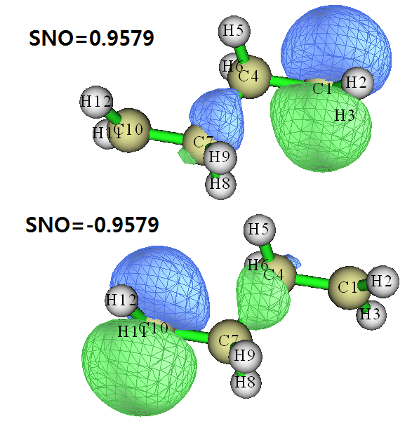
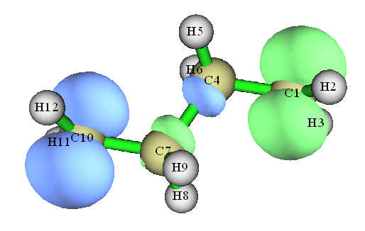

**在Multiwfn中基于fch产生自然轨道的方法与激发态波函数、自旋自然轨道分析实例**

The way of generating natural orbitals based on fch file in Multiwfn and analysis instances about excited state wavefunctions and spin natural orbitals

文/Sobereva @[北京科音](http://www.keinsci.com)

First release: 2018-Jan-8  Last update: 2020-Nov-6  
 

## 0 前言

在《详谈Multiwfn支持的输入文件类型、产生方法以及相互转换》（<http://sobereva.com/379>）和Multiwfn手册第四章开头都说过，对于Gaussian用户，如果要在Multiwfn中分析后HF波函数、TDDFT激发态波函数或者双杂化泛函的波函数，需要产生相应级别的自然轨道并让Multiwfn载入。自然轨道可以让Gaussian以.wfn/wfx形式输出，也可以让Gaussian将之存到.fch里。前者很容易，但此类输入文件在Multiwfn里没法进行需要利用基函数信息的分析（如Mayer键级、Mulliken电荷）；后者虽然没这个限制，但是导出过程很繁琐，需要Gaussian中运行两步，要用的关键词容易忘，而且之后还得在.fch开头自行填上saveNO。  
  
fch文件里是包含密度矩阵信息的，自然轨道也正是通过对角化密度矩阵得到的。但fch里的密度矩阵不会被Multiwfn所直接利用，Multiwfn从输入文件里只会读取轨道信息。从2018-Jan-7更新的Multiwfn开始，为了方便用户，笔者在Multiwfn中添加了一个功能，可以读取fch里的密度矩阵并产生各类自然轨道。本文目的是说一下相关细节，演示一下怎么用，并顺带简要讲一下激发态波函数的分析和自旋自然轨道的分析。  
  
   

## 1 关于fch里的密度矩阵和自然轨道

在chk里，以及转换出的fch文件里，至少包含了SCF级别的密度矩阵，对于后HF、双杂化泛函、TDDFT等任务，还会包含其它类型密度矩阵（前提是用了density或某些特殊关键词，而且当前理论方法在Gaussian中有解析梯度）。在fch文件里搜索Density就能知道包含哪些。这里罗列一下常见情况：  
HF、DFT、CASSCF任务：SCF  
CIS、TDDFT任务：CI、CI Rho(1)  
CCSD任务：CC  
MP2、双杂化泛函任务：MP2  
MP3任务：MP3  
MP4SDQ任务：MP4  
如果你的体系是开壳层（对于CIS/TD来说指的是参考态），还会包含自旋密度矩阵。比如，对一个三重态体系，如果你用的是比如# MP2/cc-pVDZ density关键词，则fch文件里会有这几个字段：  
Total SCF Density：HF级别的总密度矩阵  
Spin SCF Density：HF级别的自旋密度矩阵  
Total MP2 Density：MP2级别的总密度矩阵  
Spin MP2 Density：MP2级别的自旋密度矩阵  
如果体系是闭壳层，就没有Spin SCF Density和Spin MP2 Density了。  
  
所谓总密度矩阵，就是指Alpha和Beta密度矩阵的加和；而自旋密度矩阵，就是Alpha密度矩阵减去Beta密度矩阵。  
  
Multiwfn能产生的自然轨道有三类，和密度矩阵的关系如下：  
(a)自然轨道(Natural orbital, NO)：对总密度矩阵对角化得到。本征值是占据数，原则上范围是0.0~2.0，本征矢就是自然轨道系数。这种自然轨道也被称为Spatial natural orbital，因为不含自旋信息。如果体系是开壳层的，这种自然轨道也被确切叫做unrestricted natural orbital (UNO)。  
(b)Alpha自然轨道、Beta自然轨道：分别对Alpha密度矩阵和Beta密度矩阵对角化得到，分别描述Alpha和Beta电子，原则上占据数在0.0~1.0之间。这类自然轨道也被称为自然自旋轨道(natural spin orbital, NSO)。  
(c)自旋自然轨道(Spin natural orbital, SNO)：对自旋密度矩阵对角化得到，占据数在-1.0至1.0之间。占据数为正和为负的SNO分别描述Alpha单电子和Beta单电子。  
  
   

## 2 实例1：分析甲醛TDDFT计算的S1态波函数

运行以下输入文件，对甲醛在TD-PBE0/6-31G*级别下做电子激发计算，并且把S1态密度矩阵存到chk里（因为TD里的root选项默认为1）。  
%chk=C:\H2CO.chk  
 # PBE1PBE/6-31G* TD density  
  
 B3LYP/6-31G* opted  
  
 0 1  
  C                  0.00000000    0.00000000   -0.56221066  
  H                  0.00000000   -0.92444767   -1.10110537  
  H                 -0.00000000    0.92444767   -1.10110537  
  O                  0.00000000    0.00000000    0.69618930  
  
用formchk将chk转换为fch，里面此时会有Total SCF Density、Total CI Rho(1) Density、Total CI Density三个字段，分别对应于基态DFT密度矩阵、TDDFT非弛豫的S1态密度矩阵（可无视）、TDDFT弛豫的S1态密度矩阵。  
  
下面我们来考察一下S1态的C-O Mayer键级以及O的ADCH原子电荷。启动Multiwfn，依次输入  
H2CO.fch  
200  
16  //基于fch里的密度矩阵产生自然轨道  
CI  //载入的密度矩阵级别  
由于输入的是CI，所以Multiwfn从fch中读取了Total CI Density字段记录的S1态总密度矩阵，并立刻产生了相应的S1态自然轨道，占据数直接输出在屏幕上了（占据数稍微超过理论上0.0~2.0范围是正常情况，不用纠结）：  
Occupation numbers:  
    2.033734    2.002238    2.000812    2.000459    2.000148    2.000000  
    2.000000    0.996739    0.970938    0.000094    0.000062    0.000049  
    0.000019    0.000005    0.000002    0.000000    0.000000    0.000000  
    0.000000    0.000000   -0.000000   -0.000000   -0.000000   -0.000000  
   -0.000000   -0.000000   -0.000000   -0.000000   -0.000238   -0.000366  
   -0.000454   -0.000828   -0.001168   -0.002245  
此时，内存里的基函数信息已经被更新成了对应S1自然轨道的情况了，做各种基于基函数的分析的结果将是对应S1态的了。我们还要计算ADCH电荷，这是要用GTF信息的，但目前GTF系数还是对应基态DFT轨道的的（因为一开始载入的.fch里的轨道是基态DFT的），且现在轨道占据数已经变成了自然轨道占据数，所以之后做基于GTF信息的分析将没有任何物理意义。为了能计算S1态的ADCH电荷，我们此时应当选y，让程序把当前的波函数信息导出为当前目录下的new.mwfn，并自动载入之，此时内存里的GTF信息也变成对应S1态的了。这个new.mwfn文件我们以后也再可以反复利用。  
  
接着输入以下内容  
0  //退回主菜单  
9  //键级计算  
1  //Mayer键级  
得知C-O键级为1.18。然后输入  
n  //不导出键级矩阵  
0  //退回主菜单  
7  //布居分析  
11  //ADCH电荷  
1  //用内置的球对称化的自由原子密度  
得知O的ADCH电荷为-0.128。  
  
我们可以对比一下基态的情况。重启Multiwfn，载入H2CO.fch，此时内存里的基函数信息和GTF信息都是对应基态的，重做上述计算，发现C-O Mayer键级为1.98，O的ADCH电荷为-0.296。  
  
之所以激发态的C-O键级比基态的小得多，激发态的O的电荷也比基态的正得多，是因为此激发是n->pi*激发，一方面削弱了C-O键，一方面一部分电子从氧转移给了C。  
  
  

## 3 实例2：分析丁烷双自由基的自旋自然轨道

丁烷双自由基体系在《CASSCF计算双自由基以及双自由基特征的计算》（<http://sobereva.com/264>）中做了很详细的讨论，建议看看。本节的例子探究一下此体系的SNO轨道。  
  
运行以下输入文件  
%chk=C:\C4H8.chk  
 #p UB3LYP/def2SVP guess=mix nosymm  
  
 ub3lyp/6-31g(d) opted  
  
 0 1  
  C                 -0.74400100    1.78566400    0.00000000  
  H                 -0.60282700    2.33865300    0.92499500  
  H                 -0.60282700    2.33865300   -0.92499500  
  C                 -0.74400100    0.30988100    0.00000000  
  H                 -1.25452600   -0.08746700    0.88463900  
  H                 -1.25452600   -0.08746700   -0.88463900  
  C                  0.74400100   -0.30988100    0.00000000  
  H                  1.25452600    0.08746700   -0.88463900  
  H                  1.25452600    0.08746700    0.88463900  
  C                  0.74400100   -1.78566400    0.00000000  
  H                  0.60282700   -2.33865300   -0.92499500  
  H                  0.60282700   -2.33865300    0.92499500  
  
  
将chk转换成fch后，启动Multiwfn，依次输入  
C4H8.fch  
200  
16  
SCF   //考察DFT级别的密度矩阵  
  
此时程序问你，是产生空间自旋轨道（此时叫做UNO），Alpha和Beta各自的自然自旋轨道(NSO)，还是自旋自然轨道(SNO)。我们选3产生SNO，看到的占据数如下  
    0.957908    0.045983    0.043627    0.037531    0.021487    0.021280  
     0.020200    0.017324    0.008494    0.007915    0.006743    0.006539  
     0.000626    0.000604    0.000082    0.000082    0.000000    0.000000  
 ...略  
    -0.000000   -0.000000   -0.000082   -0.000082   -0.000604   -0.000626  
    -0.006539   -0.006743   -0.007915   -0.008494   -0.017324   -0.020200  
    -0.021280   -0.021487   -0.037531   -0.043627   -0.045983   -0.957908  
可见占据数为正的SNO当中只有一个数值较大的，即第一个（0.9579）；而占据数为负的SNO当中也只有一个数值较大的，即最后一个（-0.9579）。而且，我们也知道，由于此体系是个很理想的双自由基体系，本来就应该有一个Alpha和一个Beta单电子。因此，未成对的Alpha电子和Beta电子分布特征通过考察这两个轨道就足够得知了。  
  
我们选y产生new.mwfn并自动载入之，然后进入主功能0观看这两个轨道的特征。值得一提的是，new.mwfn被Multiwfn视为是开壳层的，因此形式上会有Alpha和Beta两套轨道，而我们产生的SNO轨道只有一套，此时SNO轨道占用的是用于记录Alpha轨道那部分空间（绝对不是说SNO的物理意义是Alpha轨道），而Beta轨道那部分没有意义，占据数也都是0。我们在主功能0的界面里可以选左上角的Orbital info.，从文本窗口里找出占据数为0.957908和-0.957908的轨道，可知序号分别是1和96（其实96就是体系的基函数数目，因此都没必要去列表里找，直接选就行），这两个轨道的图形如下：

  
可见，Alpha单电子主要分布在C1上，在C4-C7之间也有少量分布。Beta单电子主要分布在C10上，同样在C4-C7之间也有少量分布。  
  
如果我们想定量知道比如Alpha单电子在各个原子上的量，我们可以对主要表现Alpha单电子的SNO1做轨道成分分析。我们回到主菜单，依次输入  
8  //轨道成分分析  
8  //Hirshfeld方式做轨道成份分析  
1  //用内置的球对称化的自由原子密度  
1  //1号轨道  
结果为  
Atom     1(C ) :   70.148760%  
 Atom     2(H ) :    6.317230%  
 Atom     3(H ) :    6.317230%  
 Atom     4(C ) :    7.588237%  
 Atom     5(H ) :    1.254212%  
 Atom     6(H ) :    1.254212%  
 Atom     7(C ) :    5.065489%  
 Atom     8(H ) :    0.591654%  
 Atom     9(H ) :    0.591654%  
 Atom    10(C ) :    0.758644%  
 Atom    11(H ) :    0.056339%  
 Atom    12(H ) :    0.056339%  
数值和我们从轨道图形上看到的很好相符。  
  
众所周知，研究单电子分布最常用的方法是分析自旋密度。我们重新载入C4H8.fch，绘制一下自旋密度图，步骤见《谈谈自旋密度、自旋布居以及在Multiwfn中的绘制和计算》（<http://sobereva.com/353>），图像如下：  

  
我们再用主功能15，在Hirshfeld划分下计算自旋密度在各个原子空间中的积分值（原子自旋布居）：  
Atomic space        Value  
   1(C )            0.70928760  
   2(H )            0.04488357  
   3(H )            0.04488357  
   4(C )           -0.01371421  
   5(H )            0.00849956  
   6(H )            0.00849956  
   7(C )            0.01371421  
   8(H )           -0.00849956  
   9(H )           -0.00849956  
  10(C )           -0.70928760  
  11(H )           -0.04488357  
  12(H )           -0.04488357  
  
无论是从等值面图上，还是原子自旋布居上，都看到自旋密度分布特征基本等于主要描述Alpha单电子的SNO1和主要描述Beta单电子的SNO96特征的叠加。对于两个SNO基本没有重叠的体系两端的亚甲基的碳，其自旋布居和它对SNO的贡献量十分接近，而在C4、C7部分，由于两个SNO重叠厉害，导致显著的相互抵消，所以它们虽然对SNO贡献不很小，但是自旋布居却非常小。  
  
可见，分析SNO的好处是可以分别考察未成对的Alpha和Beta电子原本是怎么分布的，且可以从轨道分析的角度研究；而考察自旋密度，则便于了解在Alpha和Beta单电子分布发生一定程度抵消后的单电子“净”分布情况，分析也更为省事，不用讨论多个轨道。两种分析是互补的。
