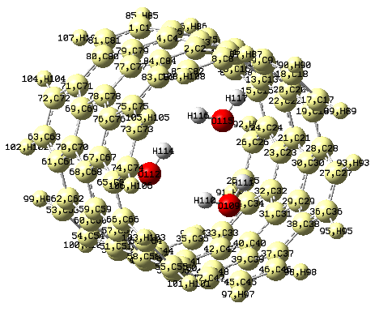
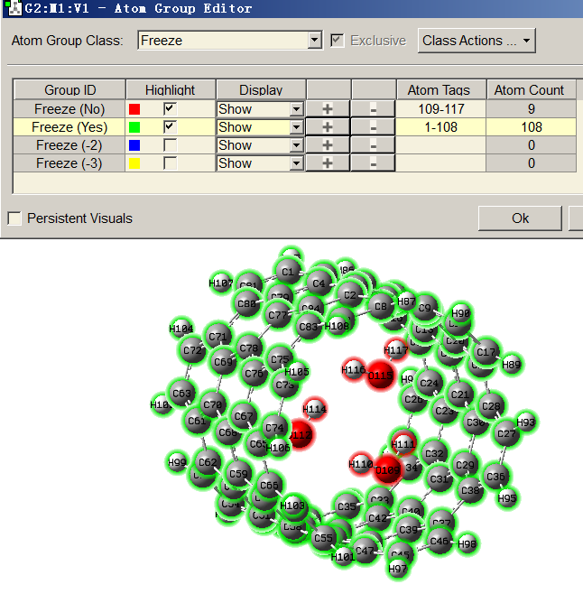

**在Gaussian中做限制性优化的方法**

The way to perform restricted optimization in Gaussian

文/Sobereva @[北京科音](http://www.keinsci.com)   2018-Jan-9

  

## 0 前言

量化计算时一般做的几何优化叫做全优化(full optimization)，与之相对的叫做限制性优化，即优化时冻结某些变量来实现特殊目的。经常有人在网上问Gaussian里怎么做限制性优化，每次都回复很麻烦，在本文就统一说一下。本文内容至少适用于Gaussian 09/16。  
  
对于有解析导数的方法，限制性优化并不会减低计算量，因为不管是否将某些变量冻结，所有原子的导数依然会照常计算，只不过其中被冻结的不会在优化过程中利用且不会纳入收敛判据而已。顺带提醒一下，初学者千万不要乱冻结，否则可能中途出错，或者难收敛，或者结果缺乏物理意义。冻结时一定要先搞清楚目的。另外，只要是做了冻结，那么优化肯定不会收敛到全局空间极小点，而只能够收敛到扣除被冻结变量的子空间当中的极小点去，因此用这样的结构再做振动分析，往往会出现虚频，这是非常正常的。  
  
下面按照冻结的类型分别介绍做法。文中会涉及笛卡尔坐标、内坐标、冗余内坐标优化的概念，不清楚的话建议看此文中相关介绍：《量子化学计算中帮助几何优化收敛的常用方法》（<http://sobereva.com/164>）。  
  
  

## 1 冻结某些原子坐标

冻结原子坐标常见有以下目的：  
(1)已经有了分子的X光衍射的结构，但由于只有重原子位置能准确测定（前提还是解析度足够高的情况），氢原子位置一般只是近似/粗略加上去的，故需要冻结重原子位置而对氢原子位置进行优化  
(2)研究固体表面吸附。往往利用3~4层原子表现固体表面，最底层原子一般要被冻结来表现体相结构，而其余原子允许在优化自由弛豫  
(3)用簇模型研究酶催化问题。建模时把体系的活性中心抠出来后，一般要将边界的氨基酸的骨架原子冻结，以免优化时候体系严重变形、坍塌  
  
在Gaussian中可以以不同方式冻结某些原子的笛卡尔坐标，但是并没有办法只冻结某个笛卡尔分量。  
  

### 1.1 用0、-1设置冻结

最简单的冻结某些原子坐标的方法就是在原子名后面把要冻结的写-1，不冻结的写0，opt后面最好写上cartesian。例如  
# B3LYP/6-31G** opt=cartesian  
  
Title Card Required  
  
0 1  
 O      0          0.00000000    0.00000000   -0.11081188  
 H     -1          0.00000000    0.58397589    0.44324751  
 H     -1          0.00000000   -0.58397589    0.44324751  
  
观看输出文件里的轨迹，表面上看会发现两个氢还是动了，这是因为Gaussian总是把体系调整到标准朝向下，如果对这个任务写上nosymm关键词避免此行为，则看到的轨迹中这两个氢的位置就始终不动了。关于nosymm关键词更多信息看《谈谈Gaussian中的对称性与nosymm关键词的使用》（<http://sobereva.com/297>）。  
  
上面的例子中=cartesian可以不写，但不写的话，程序会在默认的冗余内坐标下做限制性优化，对当前任务会使得优化所需步数多得多，而且会发现H-H的距离在最终结构和初始结构间有非常轻微的变化（属于算法层面的很细节问题，涉及到内坐标与笛卡尔坐标相互转换之类），因此建议还是写上=cartesian。  
  
当原子较多时，而且要冻的原子又不连着，手动去写-1就比较麻烦了，此时可以用gview。比如考察一个有限长度的碳纳米管里面塞入三个水的情况，假设我们想把碳纳米管坐标完全冻住，只允许水被优化，那么可以在gview里把碳纳米管部分选中成为黄色，如下所示  

  
然后进入Tools - Atom Groups，把类别切换到Freeze，然后点击Freeze(Yes)那一行中的+号把选中的区域添加到这个冻结组里。此时体系就被分为冻结和不冻结的两个组了，如下所示  

  
然后保存输入文件，就会看到碳纳米管部分的原子后头都有-1，水的后头都是0了，之后恰当设置关键词计算即可。  
  
  

### 1.2 用opt=readopt设置冻结

用opt=readopt来设置冻结往往比上一节的做法方便得多。用opt=readopt时Gaussian会建立一个被优化的原子的列表，默认情况下所有原子都在这个列表里，因此所有原子都会被优化。我们可以用notatoms把某些元素或者某些原子从被优化列表中去除，例如以下例子不会优化碳、氧，而只优化氢  
# PM6 opt=readopt  
  
test  
  
0 1  
 C                  0.00000000    0.00000000   -0.56221066  
 H                  0.00000000   -0.92444767   -1.10110537  
 H                 -0.00000000    0.92444767   -1.10110537  
 O                  0.00000000    0.00000000    0.69618930  
  
notatoms=C,O  
  
在notatoms后面也可以直接指定不被优化的原子的序号，也可以和元素名混写。例如上例也可以写为notatoms=1,4或notatoms=C,4。对于大体系，如果想立刻得到某个区域的原子序号从而能够直接写在notatoms后面，可以在gview里将那个区域选成黄色，然后进入Tools - Atom Selection, 直接把窗口中显示的序号信息复制到notatoms后面。  
  
readopt里还可以用noatom把优化列表清空、用atom把某些原子加入优化列表。比如如果写noatoms atoms=1,5-70 notatoms=N,O就代表先把被优化列表清空，然后把1,5-70原子加入，再把其中N和O元素的原子去掉。因此，最终被优化的原子就是1,5-70当中的非N,O元素的原子了。可见opt=readopt是非常灵活方便的。  
  
用opt=readopt时实际上也是在冗余内坐标下进行的优化，而且笔者发现没法在opt里写cartesian改成Cartesian坐标下优化，此时一开始就会报错。  
  
  

### 1.3 在冗余内坐标下设置冻结

Gaussian优化默认就是在冗余内坐标下做的，用opt=modredundant时可以在末尾空一行写上对冗余内坐标下优化额外做的修改和设定，modredundant意味着modify redundant internal coordinate。在末尾空一行处写原子序号，后面写个F（代表freeze），就表明这个原子被冻结，效果和原子后头写-1是一样的，可以写任意多个。下面的例子将两个氢冻住  
# B3LYP/6-31G** opt=modredundant  
  
Title Card Required  
  
0 1  
 O               0.00000000    0.00000000   -0.11081188  
 H               0.00000000    0.58397589    0.44324751  
 H               0.00000000   -0.58397589    0.44324751  
  
2 F  
3 F  
  
  

## 2 冻结某些内部变量

### 2.1 在内坐标下冻结

在内坐标下优化时，可以把内坐标表示的输入文件里的一些变量进行冻结。坐标后面空一行写的是允许被优化的变量，再空一行写的是冻结的变量。因此下例会在优化时会保持键角为80度。注意opt后面必须写z-matrix，否则优化会在冗余内坐标下进行，以内坐标方式定义的冻结就不生效了。  
#p B3LYP/6-31G** opt=z-matrix  
   
constraint optimization  
   
0 1  
 O                
 H                  1   B1  
 H                  1   B2    2  A1  
  
B1=0.76533395  
B2=0.76533395  
  
A1=80.0  
  
如果内坐标中有的直接写成了数值形式，有的以变量表示，则只有变量表示的内坐标会被优化。因此下例只会优化键角，而键长始终固定在0.9埃。  
 O                
 H                  1   0.9  
 H                  1   0.9    2  A1  
  
A1=80.0  
  
  

### 2.2 在冗余内坐标下冻结

在冗余内坐标下设置内坐标的冻结很方便，被冻结的内坐标可以随意定义，并不仅限于输入文件里出现的内坐标。比如优化水分子时候让H-H距离保持固定，可以写成  
# B3LYP/6-31G** opt=modredundant  
  
Title Card Required  
  
0 1  
 O               0.00000000    0.00000000   -0.11081188  
 H               0.00000000    0.58397589    0.44324751  
 H               0.00000000   -0.58397589    0.44324751  
  
2 3 F  
  
如果F前面写三个原子序号，就代表冻结这个键角；写四个原子序号，就代表冻结这个二面角，而且可以写无数多个。比如某个体系，写了opt=modredundant，然后末尾空一行写了  
3 6 F  
1 2 12 14 F  
55 F  
58 F  
6 1 7 F  
就代表优化时冻结了3-6距离、1-2-12-14二面角、55和58号原子坐标、6-1-7角度。  
  
  

## 3 广义化的内坐标(GIC)下设置冻结简例

Gaussian16开始增加了GIC，可以在优化过程中比冗余内坐标做更灵活的设定。详细说明见<http://gaussian.com/opt/>的GIC Info页，本文不打算细谈，只是给两个只有利用GIC才能实现的限制性优化的例子。  
  
第一个例子是在优化中令两个变量的差值保持恒定。addGIC代表从末尾读取额外的GIC设定，然后定义了两个GIC键长项，又定义了二者的差值项rcons，(freeze)代表令这个项在优化过程中被冻结。因此优化过程中两个O-H键长的差值始终不变（此例一开始相差0.1埃，最后还是相差0.1埃）  
# B3LYP/6-31g(d) opt=addGIC  
  
test  
  
0 1  
 O                  0.00000000    0.04716583    0.07081661  
 H                  0.00000000    0.69230018   -0.40226021  
 H                  0.00000000   -0.69230018   -0.44220387  
  
b12=R(1,2)  
b13=R(1,3)  
rcons(freeze)=b12-b13  
  
第二个例子是在优化二聚体时始终保持两个单体几何中心距离恒定，这是氨气与水二聚体的例子  
#p PM7 opt(gdiis,maxcyc=100,addgic)  
  
Title Card Required  
  
0 1  
 N                 -1.51786076   -1.12768292    2.39707540  
 H                 -1.11590788   -2.26462122    2.39707540  
 H                 -1.18452166   -0.65628274    3.21357213  
 H                 -1.18452166   -0.65628274    1.58057866  
 O                 -1.16213343   -0.15012738    6.00166916  
 H                 -0.20213343   -0.15012738    6.00166916  
 H                 -1.48258801    0.75480845    6.00166916  
  
XC1=XCntr(1-4)  
YC1=YCntr(1-4)  
ZC1=ZCntr(1-4)  
XC2=XCntr(5-7)  
YC2=YCntr(5-7)  
ZC2=ZCntr(5-7)  
F1F2(freeze)=sqrt[(XC1-XC2)^2+(YC1-YC2)^2+(ZC1-ZC2)^2]*0.529177  
  
可见用XCntr、YCntr、ZCntr可以把某个片段的几何中心的X、Y、Z坐标定义为GIC变量从而在之后被引用。在定义GIC变量时可以使用数学运算符和简单数学函数，此例我们把将两个单体几何中心间的距离定义为了F1F2变量，并且将状态设成了freeze，故优化过程中只有单体内部结构发生变化，而单体几何中心间距离始终不变。优化过程中GIC变量的数值会在输出文件中体现，由于GIC默认输出的是原子单位，因此例子中乘了0.529177把Bohr转化成常用的埃来输出。  
  
GIC看起来很好很强大，但是也不要太有过高的期待，因为用限制项设多了或设复杂了很容易运行中途报错。  
  
  

## 4 没有解析梯度时的优化

没有解析梯度的理论方法做几何优化时，用的是EF算法优化（而且没法改成别的）。由于此时是通过有限差分方式计算受力，耗时很高，而且每一步的耗时正比于被优化的变量数，因此程序要求用户必须明确指定哪些变量要被优化，被优化的变量要写成变量形式。下例在没有解析梯度的CCSD(T)级别下优化水分子，只优化两个氢的Z坐标  
#p CCSD(T)/def2TZVP opt nosymm  
  
niconiconi  
  
0 1  
O 0.00000000     0.00000000     0.11930801  
H 0.00000000     0.75895306    Z2  
H 0.00000000    -0.75895306    Z3  
  
Z2=-0.43723204  
Z3=-0.40723204  
  
上面例子写成内坐标形式当然也可以。如果坐标部分写成下面这样没有变量表示的情况  
O 0.00000000     0.00000000     0.11930801  
H 0.00000000     0.75895306    -0.43723204  
H 0.00000000    -0.75895306    -0.40723204  
则程序会认为要被优化的变量数为0，由于没事可干，会直接报下面的错误：  
 ************************************************  
 ** ERROR IN INITNF. NUMBER OF VARIABLES (  0) **  
 **   INCORRECT (SHOULD BE BETWEEN 1 AND 50)   **  
 ************************************************  
这个提示也显示了，EF算法优化的时候，被优化的变量最多只能有50个。
