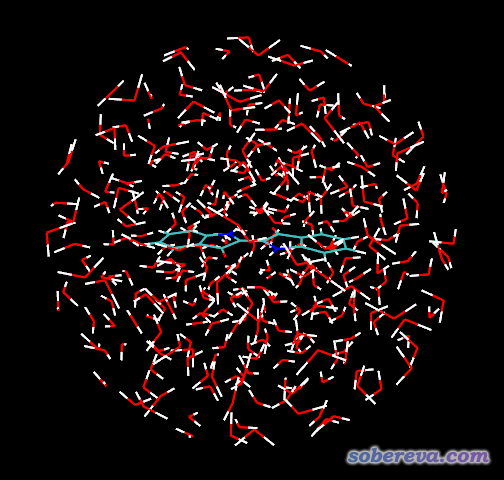
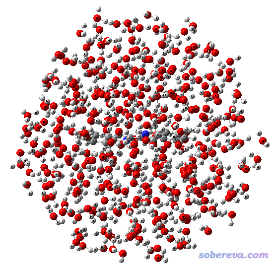
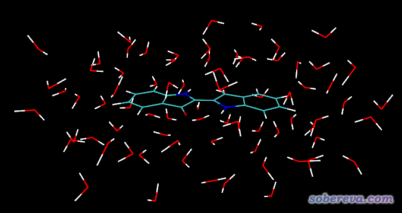
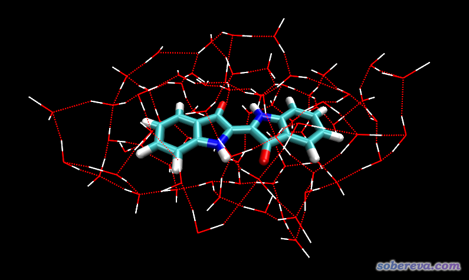

**构建被显式溶剂层包裹的分子的简单方法**

A simple way to build molecules surrounded by explicit solvent layers

文/Sobereva @[北京科音](http://www.keinsci.com)  2018-Jan-20

  
  

## 0 前言

溶剂模型分两大类，显式溶剂模型、隐式溶剂模型。在量子化学研究中，一般为了省事、方便以及为了考虑溶剂平均效应而用隐式溶剂模型，但是有时候溶剂效应没法靠连续介质的考虑方式描述，非得用显式溶剂模型不可。有些情况只需要很少的显式溶剂即可，比如水催化的反应，只需要把参与反应的水分子纳入体系即可。但研究许多问题的时候，显式溶剂放在哪、怎么放，哪些位置的显式溶剂会起到关键作用并不明确（比如考虑显式溶剂对UV-Vis光谱影响的问题），那么为了保险就得给整个分子加上一个溶剂层。通常显式溶剂和隐式溶剂是一起使用的，后者描述显式溶剂层外部的体相溶剂效应，这称为杂化溶剂模型。  
  
加溶剂层比较严谨、可靠的做法是对体系跑分子动力学，然后从中提取一些帧（可以均匀间隔采样，也可以做周期性退火，取对应0K的帧），然后把靠近溶质的溶剂分子连同溶质提取出来，再用量化方法优化。但这样做对于不懂MD的人门槛略高，有时候处理的体系还不好生成拓扑文件、弄到适合的力场参数。  
  
本文目的是介绍比较简单的给分子加上溶剂层的做法，不需要跑动力学。虽然没有MD严格，但对于搞量化的人来说多数情况也够用了，本文的方法也比较普适。本文使用的程序为Gaussian16 A.03、Packmol 16.344、VMD 1.9.3、MOPAC2016。本文以构建靛青(indigo)分子被显式水包围的体系作为例子。  
  
本文涉及的所有文件可在此处下载：<http://sobereva.com/attach/406.7z>。

Packmol的下载和使用方法见《分子动力学初始结构构建程序Packmol的使用》<http://sobereva.com/473>，VMD可在<http://www.ks.uiuc.edu/Research/vmd/>免费下载。VMD和Packmol的详细使用会在北京科音的“分子动力学与GROMACS培训班”里深入讲解，本文中只是用到哪说到哪。

## 1 用Packmol产生溶剂分子球完全包裹溶质的体系

Packmol是常用的构建动力学模拟体系的程序，一般在Linux下运行。下载后解压，运行make即可编译，然后把Packmol加入到PATH环境变量中后即可使用。  
  
将靛青分子和水分子的pdb文件准备好，分别叫indigo.pdb和H2O.pdb。写一个叫做mix.inp的Packmol输入文件，内容如下  
tolerance 2.0  
 output ball.pdb  
 filetype pdb  
 structure indigo.pdb  
   number 1  
   center  
   fixed 0. 0. 0. 0. 0. 0.  
 end structure  
 structure H2O.pdb  
   number 350  
   inside sphere 0. 0. 0. 10.  
 end structure  
  
这代表将靛青置于体系中央，然后在距离靛青中央10埃的球形空间内填充350个水，而且不能与靛青有不合理接触。运行packmol < mix.inp，很快在当前目录下得到ball.pdb。用VMD查看ball.pdb，如下所示  

  
由图可见，靛青分子完全浸在了水球里，没有裸露出来的地方。对于其它溶质分子，溶剂球的半径和填充的溶剂数目应当酌情而定，溶剂球不能太小从而导致溶质裸露；溶剂球也不宜太大，否则会令下一步的耗时过高。填充的溶剂数目不能太少，否则溶剂非常稀疏，之后一优化体系可能严重坍塌、出现溶质裸露情况；填充的溶剂数目也不能太大，否则Packmol会反复迭代总也收敛不了。可以反复多试一试。  
  
  

## 2 粗略优化溶剂球+溶质体系

Packmol构建体系时并不考虑分子之间的相互作用，只是让分子以没有不良接触的方式简单堆积起来。因此，上面构建的溶剂球+溶质体系和实际情况相距甚远。为了快速地让结构更合理一些，这里用Gaussian在普适型力场UFF下做个简单的优化。用gview载入上一节得到的ball.pdb，保存Gaussian输入文件。由于UFF力场终究很粗糙，让它直接优化整体的话可能会把溶质结构弄糟，因此输入文件里把靛青分子设为冻结状态（如果不知道怎么弄，看《在Gaussian中做限制性优化的方法》<http://sobereva.com/404>）。最终输入文件是ball.gjf，内容如下  
#p UFF=qeq opt geom=connectivity  
  
 Built with Packmol  
  
 0 1  
  C         -1   -0.35400000    5.30600000    0.00000000  
  C         -1    1.04000000    5.15500000    0.00000000  
  C         -1    1.65100000    3.90400000    0.00000000  
...略。坐标后面是连接关系。  
  
UFF后面的=qeq代表自动用QEq方式计算每个原子的原子电荷，否则原子将没有原子电荷，原子间静电相互作用就表现不出来，连氢键基本特征也不可能正确描述（因为常规强度的氢键的主要本质就是静电相互作用）。QEq电荷在《原子电荷计算方法的对比》（<http://www.whxb.pku.edu.cn/CN/abstract/abstract27818.shtml>）中有介绍。  
  
优化的输出文件是ball.out，图像如下所示，可见溶剂已不是简单的球形分布了，而是由于考虑了分子间相互作用，已经呈现出一定结构特征了。不过这个结构还是很粗糙。  

  
  

## 3 用VMD挖带着溶剂层的溶质体系

把ball.out用gview保存为UFF_opted.pdb。将此文件载入VMD。载入后，VMD会自动判断原子间连接关系，每一批相连的原子构成一个片段，有唯一的fragment号，号码从0开始。当前体系结构信息中先记录的是一个靛青，然后是350个水，因此靛青在VMD里叫fragment 0。我们先看看怎么选取原子合适。进入VMD界面里的Graphics-Representation，在Selected Atoms里输入same fragment as within 5 of fragment 0，这代表选中靛青分子，而且只要水的任意一个原子距离靛青原子小于5埃，则整个水也被选中。此时看到的图像如下：

  
可见，当前的选区设置很符合我们的需要，溶剂层厚度合适。厚度不能太大，否则包含的溶剂原子太多，之后做量化耗时高；厚度也不能太小，要不然溶质分子就露出来了。  
  
在VMD Main窗口中选中当前体系，选File-Save Coordinate，Selected atoms框里还是输入same fragment as within 5 of fragment 0，File type选xyz，点Save，然后文件名设为solvated.xyz并保存。  
  
  

## 4 用MOPAC2016优化溶质+溶剂层体系

上一步得到的溶质+溶剂层模型还是比较粗糙，定性合理都没法保证，用于量化计算前肯定是要做几何优化的。通常我们都用DFT来做，但是当前体系对DFT来说已经非常大了，有258个原子呢！比较合适的做法是，先用MOPAC在半经验级别下对这个分子团簇体系做个优化。MOPAC做半经验非常快（远比Gaussian快），优化几百原子体系花不了多少时间。MOPAC优化完了，体系就定性合理了，然后我们可以再用gview把根据化学直觉认为对自己研究的问题用处不大的溶剂分子再删掉一些，使得总原子数降低到DFT优化可以接受的程度，再用DFT优化。  
  
我们这里在MOPAC2016中用PM6-D3H4来做几何优化，它对分子间弱相互作用可以给出基本合理的描述。对PM6-D3H4和分子间相互作用计算不了解的人强烈建议看《大体系弱相互作用计算的解决之道》（<http://sobereva.com/214>）和乱谈DFT-D（<http://sobereva.com/83>）。不知道MOPAC怎么安装的看《MOPAC2012安装方法》（<http://sobereva.com/262>）。  
  
我们把solvated.xyz改写成MOPAC输入文件solvated.mop，内容如下  
PM6-D3H4 EF PRNT=2 EPS=78.3 precise  
 test  
 All coordinates are Cartesian  
  C         0.071000 0     -3.083000 0     -4.437000 0  
  C         0.384000 0     -1.826000 0     -4.974000 0  
  C         0.490000 0     -0.686000 0     -4.182000 0  
  C         0.272000 0     -0.832000 0     -2.814000 0  
 ...略  
  O        -2.733000        2.351000       -1.012000  
  H        -3.247000        2.606000       -1.824000  
  H        -2.196000        1.578000       -1.334000  
  O         1.434000       -3.488000      -11.108000  
  H         1.574000       -4.345000      -11.596000  
  H         0.754000       -3.740000      -10.430000  
 ...略  
  
这里写了EF PRNT=2，目的是使得优化过程可以通过笔者写的mopac2xyz程序(<http://sobereva.com/212>)转化为VMD可以观看的轨迹，便于了解优化过程以及提取最终优化后的结构。precise关键词是让计算精度更高一些。EPS=78.3代表通过COSMO隐式溶剂模型表现外部水环境（介电常数为78.3）。靛青的坐标后面都写了0，代表在优化过程中固定靛青结构不动。对当前例子是否固定溶质其实无所谓，但半经验方法终究没有DFT稳健、普适，对于某些特殊的溶质分子结构描述得并不好，如果初始溶质结构是DFT优化过的，但MOPAC优化时不固定其结构，那可能会把分子结构优化得比较糟糕。  
  
这个MOPAC任务在笔者Intel四核机子上一刻钟就算完了，输出文件是solvated.out。对于目前的MOPAC2016程序，笔者发现用32bit版本算此任务一开始会报错，而64bit版无问题。从输出文件靠末尾部分可以看到提示THE GEOMETRY MAY NOT BE COMPLETELY OPTIMIZED，并且提示加LET DDMIN=0.0可以优化得更充分。确实，用LET DDMIN=0.0的话，优化还可以进一步进行，结构还会进一步发生一些改变，但此处没有用这个关键词，是因为当前半经验级别下优化只是个粗略优化，其势能面就不是很准确，收敛到准确极小点也没太大必要，毕竟之后还要用DFT再优化。另外，用LET DDMIN=0.0的话对于这种分子团簇体系往往很难达到收敛限（因为容易震荡）。  
  
用mopac2xyz程序把solvated.out转化成.xyz轨迹文件，最后一帧，即优化后的结构，如下所示。图中把水之间的氢键在比较松的阈值下（O-H...O距离3.5埃，键角>140度）也显示了出来，可见在溶质分子周围水分子形成了应有的网状结构。

  
例子到此结束。之后就可以适当修改这个团簇结构，再用DFT优化了。多余的水可以删，而如果发现溶质有的地方明显暴露到外头，也可以在相应位置手动再加点水再优化。  
  
  
有人会觉得，这样优化，可能得不到团簇结构能量最小点。确实有这个问题，不过对于比较小的溶剂，特别是水这样的，这个问题不显著。本身优化过程步长不是无限小的，优化时是可以翻越势能面上很浅的、微不足道的势阱的（比如从MOPAC优化轨迹上就能看到溶剂层分子位置、朝向变化还是很大的），而且最终的结构还是经过UFF->半经验->DFT三段式优化，虽然可能达不到团簇最小点，但得到的团簇结构起码也是能量非常低的结构，用它来做量化计算讨论问题是合理的（何况也没有必然要求必须用能量最低的团簇结构，而只要能把溶剂-溶质的显式作用表达出来就够了）。但对于尺寸比较大的溶剂，若为了可靠、令溶剂层特征能够有代表性、反映实际情况，建议还是用MD+量化优化来产生溶剂层包裹的溶质结构。  
  

还有人会想，按照本文的过程，貌似得到的溶剂层排布只有一种，如何才能像MD那样能够得到不同的溶剂层排布方式的结构？实际上，在packmol输入文件中如果写了seed -1，则Packmol每次运行相同文件得到的结构都是不同的，因为它是利用随机数的，因此Packmol跑N次，最终就可以得到N种溶剂层排布。
