**后记1**：笔者后来又写了一篇文章介绍怎么对周期性体系做IGM分析，见《使用Multiwfn结合CP2K通过NCI和IGM方法图形化考察固体和表面的弱相互作用》（<http://sobereva.com/588>）。

**后记2**：2022年我提出了叫做IGMH的改进版IGM方法，图像效果显著好于IGM，还可以完全避免IGM图中误导性的着色出现，而且物理意义明显比IGM更强。务必阅读IGMH的全面介绍文章《使用Multiwfn做IGMH分析非常清晰直观地展现化学体系中的相互作用》（<http://sobereva.com/621>），其中还有十分详细的用Multiwfn做IGMH分析的教程。由于IGMH的计算基于真实密度而非像IGM那样基于粗糙的准分子密度计算，因此IGMH的耗时高于IGM。但对于几百个原子体系，在一般计算条件下在Multiwfn程序里做IGMH分析并无压力。**因此但凡不是特别巨大的体系，一律强烈建议用IGMH代替IGM！**而如果你希望耗时和IGM一样又不需要提供波函数文件的话，则**强烈建议用我于2025年提出的mIGM方法代替IGM**，效果好得多（与IGMH接近），见《使用mIGM方法基于几何结构快速图形化展现弱相互作用》（<http://sobereva.com/755>）。**总之，如今已经不再推荐使用IGM**。

**通过独立梯度模型(IGM)考察分子间弱相互作用**

Investigating intermolecular weak interactions via Independent Gradient Model (IGM)

文/Sobereva @[北京科音](http://www.keinsci.com)

First release: 2018-Apr-5  Last update: 2022-Feb-14

## 0 前言

早在2010年，笔者写了一篇《使用Multiwfn图形化研究弱相互作用》（<http://sobereva.com/68>），文中详细介绍了杨伟涛等人通过约化密度梯度(RDG)图形化考察弱相互作用的方法以及在Multiwfn中的实现。这种分析方法在文献中也常被叫做NCI（Noncovalent interaction）方法。此文贴出来后，不断有大量使用Multiwfn做RDG分析的文章涌现，而RDG分析方法也被很多研究者进一步发展，例如：  
(1)IRI（相互作用区域指示函数）方法，由我于2021年提出。它可以通过一个函数同时完美展现体系中各种类型的相互作用，完全替代了RDG的用处，强烈建议一读：《使用IRI方法图形化考察化学体系中的化学键和弱相互作用》（<http://sobereva.com/598>）  
(2)aRDG方法，用分析动力学过程中的弱相互作用，见《使用Multiwfn研究分子动力学中的弱相互作用》（<http://sobereva.com/186>）  
(3)将RDG与ELF联用，同时考察弱相互作用和共价相互作用，例子见《通过键级曲线和ELF/LOL/RDG等值面动画研究化学反应过程》（<http://sobereva.com/200>）。但有了IRI就没必要用这个了  
(4)对RDG等值面内部空间的实空间函数进行积分，从而能够定量讨论相互作用强度。见Multiwfn手册4.200.14节的例子

2017年，在Phys. Chem. Chem. Phys., 19, 17928中新提出一种叫做独立梯度模型（Independent Gradient Model, IGM）的方法。这个方法受到RDG方法的很大启发，但是底层思想不同。和RDG一样，IGM也是重在展现弱相互作用区域及其特征，但是有很多优势，简要列举如下，后文会详细说：  
(a)给出的信息会明确划分成片段间和片段内两套数据，因此想考察分子间相互作用时，不会被分子内相互作用所干扰。（实际上，用RDG方法时，如果结合Multiwfn手册4.13.4节示例的格点数据屏蔽功能，其实也能达到相同目的）  
(b)计算时只依赖于原子坐标，而且计算很快。因为此方法计算时只需要自由原子密度，并不需要体系的波函数信息，而自由原子密度是内置于IGM分析程序当中的。（实际上，RDG也可以基于准分子(promolecular)密度来近似地快速计算）  
(c)IGM方法给出的等值面图比RDG更为饱满一些，不像RDG图在格点稀疏的时候容易出现难看的锯齿和窟窿  
(d)可以考察每一对原子间的相互作用程度  
(e)可以定量给出每个原子、每对原子对片段间相互作用的影响程度，而且可以利用VMD通过着色直观地展现  
(f)在分子间相互作用区域，IGM方法里定义的δg函数的大小与相互作用强度有正相关性

本文的目的一方面是介绍IGM方法，一方面通过实际体系示例怎么通过Multiwfn做IGM分析。阅读本文前，强烈建议仔细阅读前述博文，至少弄清楚RDG分析的基本原理以及在Multiwfn中的操作，否则在理解本文内容时可能遇到困难。

Multiwfn可以免费在<http://sobereva.com/multiwfn>下载，读者务必使用目前官网上的最新版本。如果对Multiwfn不了解，看《Multiwfn入门tips》（<http://sobereva.com/167>）和《Multiwfn FAQ》（<http://sobereva.com/452>）。除本文提到的方法外，Multiwfn还支持一大票弱相互作用分析方法，可谓是弱相互作用分析的武器库，看《Multiwfn支持的弱相互作用的分析方法概览》（<http://sobereva.com/252>）。

**使用Multiwfn做IGM分析发表文章时，除了必须要引用Multiwfn程序在启动时提示的Multiwfn的原文外，还应当引用以下两篇文****章**：  
(1) Phys. Chem. Chem. Phys., 19, 17928 (2017)：IGM方法的原文  
(2) J. Comput. Chem., 43, 539 (2022) DOI: 10.1002/jcc.26812：里面对IGM方法、我对IGM的扩展以及在Multiwfn中的具体实现都有充分的介绍

此外，非常推荐阅读《一篇最全面介绍各种弱相互作用可视化分析方法的文章已发表！》（<http://sobereva.com/667>）和《Angew. Chem.上发表了全面介绍各种共价和非共价相互作用可视化分析方法的综述》（<http://sobereva.com/746>）介绍的笔者的两篇综述文章，其中对IGM在内的各种弱相互作用可视化分析方法有非常全面系统的介绍并给了大量应用例子，也推荐在引用上述文章时一起引用。

## 1 IGM方法的原理

IGM的原文Phys. Chem. Chem. Phys., 19, 17928 (2017)里有此方法的介绍，后来我在IGMH的原文J. Comput. Chem. (2022) DOI: 10.1002/jcc.26812里对此方法有更全面、系统的介绍，这里主要解释一下IGM最核心的思想。我们先看一个很简单的情况，氢分子。在氢分子的轴线上，H1和H2的电子密度分布如下所示，这里用的原子的电子密度是原子在孤立状态下计算的

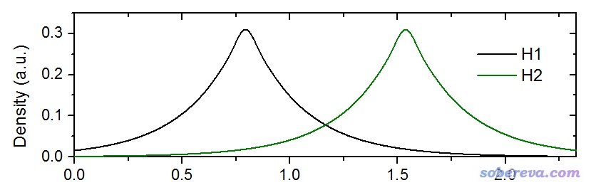

从上图可看出，在两个原子间，两个原子的梯度方向正好是相反的，这个区域H1的电子密度的梯度为负（即往左边密度增大），而H2的电子密度的梯度为正（即往右边密度增大）。因此，在原子间，两个原子的密度梯度是相互抵消的，而且在两原子正中央正好精确抵消，导致准分子密度（原子自由状态密度叠加构建的密度）的梯度为0，此处也正是与准分子密度相对应的键临界点(BCP)的位置。

一般方式计算的准分子密度的梯度等于各个原子密度梯度的加和。而IGM型密度梯度，则是把每个原子的梯度先取绝对值再加和。二者求差，就得到了所谓的δg函数。对上面的氢分子体系，图示如下

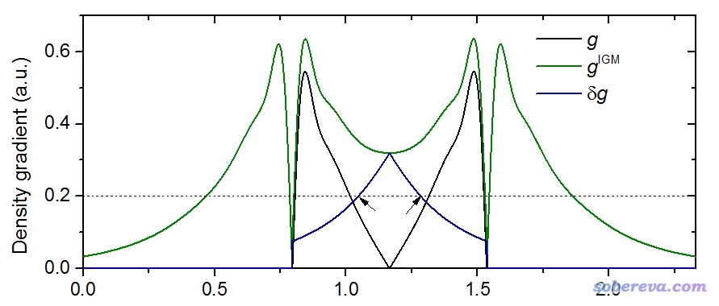

图中黑线是一般方式计算的准分子密度梯度，在原子核和原子连线中点都为0。绿线是IGM型密度梯度，由于计算时对两个原子密度梯度都取了绝对值，所以不会相互抵消，在原子之间其数值也很大，它也是普通方式计算的密度梯度的上限。两种密度梯度的差值，即δg，对应图中深蓝色曲线，可见利用δg这个函数可以明确地把原子间相互作用区域展现出来。而且，原子间相互作用越强，相互作用区域的δg就会越大。这是因为如果原子间相互作用较弱，那么优化后的结构中两个原子距离就会较远，它们相交叠的区域将是各自密度梯度已经比较小的部分，此时IGM型密度梯度和普通密度梯度相差也就没那么大了。

之所以当前这个方法叫做IGM（独立梯度模型），是因为常规方式计算准分子密度梯度时，相当于原子密度梯度之间发生了“干涉”，影响了“相位”。而在计算IGM型密度梯度时，纯粹是原子的密度梯度大小的简单叠加，不存在干涉现象，因此这些原子的密度梯度就彼此“独立”了。

δg是个三维实空间函数，有不同的考察方式，如果图形化展现的话，一般是像RDG那样绘制等值面图。比如对上面的氢分子体系，如果绘制δg=0.2的等值面图，就肯定会看到两个氢之间出现了等值面，因为上图中对应Y=0.2的虚线和δg曲线在黑色箭头标注的位置出现了相交。

δg对应于Multiwfn中第22号实空间函数。用主功能4对其绘制填色平面图的话，就可以看到下面的效果。下图是GC碱基二聚体平面上的情况

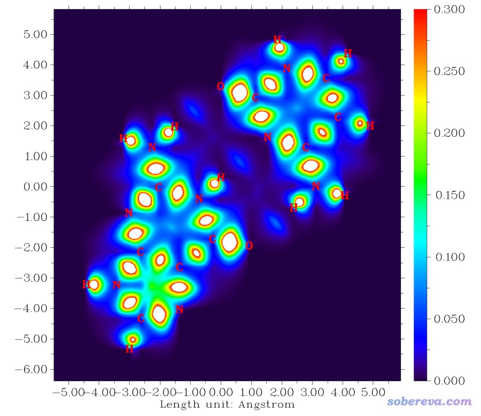

由图可见，所有成键的原子间δg都较大，最大值处都超过了图中色彩刻度上限0.3因此显示为白色。而弱相互作用区域，比如N-H...N的氢键区域，只有一块深蓝色，说明这样的地方δg相对较小，作用较弱，但终究比没有相互作用的地方δg值要大。IGM原文里通过测试还发现，二聚体的结合能，和两个单体间对应弱相互作用的BCP位置上的δg值有很好的正相关性。因此δg是个很有用的函数。

δg可以划分为用于展现片段内相互作用的δg_intra和展现片段间相互作用的δg_inter。在说这个之前，这里先把δg的比较严谨的数学定义给出来。下式中i是原子序号，▽ρ是梯度矢量，abs(▽ρ)代表对里面▽ρ矢量的每个分量都取绝对值（还是保持矢量形式），| |代表对矢量取模。

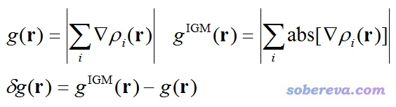

IGM原文中计算δg_intra和δg_inter只考虑到两个片段的情况，但笔者将之推广到了多个片段的情况，可表达为：

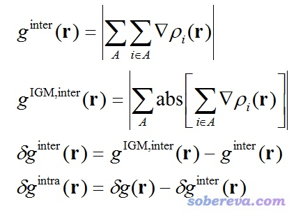

式中A是片段编号。计算时不要求所有片段的并集必须对应整个体系，但不对应时，在计算δg的时候必须只考虑这些片段涉及的原子。只要想明白了δg是怎么定义的，就很容易理解δg_inter为什么是这样定义的。

由上式可见，δg_intra+δg_inter=δg。δg衡量的是体系中所有原子间相互作用，稍加变通就成了只体现片段间相互作用的δg_inter，再把这部分从δg中扣除就成了描述片段内相互作用的δg_intra。IGM的这个思想相当不错。

对δg_intra和δg_inter分别绘制等值面图，就可以清楚看到分子内和分子间存在相互作用的区域。还可以像RDG分析时那样，把sign(lambda2)rho函数以不同颜色投影到这两个函数的等值面上，从而能够清楚地判断相互作用区域是吸引还是互斥作用，以及强度如何。另外，观看δg_intra等值面的时候还可以像RDG分析那样，把电子密度较大的区域的δg_intra值设为0，这样等值面就只体现出分子内弱相互作用区域了，而化学键区域就都被屏蔽掉了。

还可以定义原子对δg指数，用于要考察相互作用的两个片段间的每对原子的相互作用大小。这个指标在IGM原文里没有提出，是我把IGM实现进Multiwfn的时候顺带想出来的。计算某两个原子间的这个指数，就是把这两个原子各自作为一个片段来计算它们之间的δg_inter函数，然后再对这个函数在全空间进行积分，数值越大显然说明两个原子间作用越强。然后，可以再计算原子δg指数，就是把这个原子与另一个片段中所有原子的原子对δg指数进行加和。之后，可以在VMD里将每个原子按照其δg指数进行着色，哪些原子对片段间相互作用起主要贡献就一目了然了。

下面我们用Multiwfn通过IGM方法研究一系列体系，使读者了解IGM分析在Multiwfn中的用法以及IGM方法的价值。IGM方法灵活程度很高，读者务必举一反三。本文用到的所有文件都可以在此下载：<http://sobereva.com/attach/407/file.rar>。本文使用的VMD是1.9.3版，可在<http://www.ks.uiuc.edu/Research/vmd/>免费下载。由于本文讨论的都是基于promolecular密度的IGM分析，所以输入文件只需要包含结构信息就行了，常见的记录分子结构的.xyz、.pdb、.mol等格式，以及记录波函数信息的.fch、.wfn、.molden等格式都可以用。Multiwfn支持的输入文件中哪些能提供结构信息见《详谈Multiwfn支持的输入文件类型、产生方法以及相互转换》（<http://sobereva.com/379>）。

注：下文的例子的数据和图像是基于较早的Multiwfn版本得到的，后来Multiwfn在IGM分析方面又做了一些改进，故目前版本的结果与下文例子会有些许不同，以最新版本为准。

要注意，和RDG方法一样，所有用IGM分析的体系的几何结构一定要经过在恰当的级别下优化，否则可能会给出错误的分析结果。上面提供的文件包里的结构都是经过优化的。用高精度晶体衍射得到的结构也可以，但是如果考察的相互作用牵扯到氢原子，则应当固定重原子而把氢原子位置进行优化（因为氢原子位置是没法准确测定的），详见《实验测定分子结构的方法以及将实验结构用于量子化学计算需要注意的问题》（<http://sobereva.com/569>）。

## 2 实例：绘制甲酸二聚体的δg图像

此例演示一下怎么将IGM方法中定义的δg函数绘制成平面图和等值面图。本例使用的是文件包里的aceticacid_dimer.xyz，这是甲酸二聚体，所有原子都在Z=0的XY平面上。

首先绘制体系平面上的填色图。启动Multiwfn，依次输入  
aceticacid_dimer.xyz  
4   //绘制平面图  
22   //δg函数  
1   //填色图  
[回车]  //用默认的格点设定  
1  //XY平面  
0  //Z=0  
从屏幕上直接显示的图像看不出什么特征来，这是因为默认的色彩刻度对当前体系并不合适。屏幕输出的信息中可以找到这样的提示，表明当前平面上函数最小值为0，最大值为0.54956：  
The minimum of data:  0.000000000000000E+000  
 The maximum of data:  0.549560853101836  
因此，为了让不同区域的函数值能够被不同颜色区分开，我们需要调整色彩刻度，让下限和上限大体与函数值最小值和最大值分别相仿佛。于是关闭图像，输入  
1  //修改色彩刻度  
0,0.5  //设定色彩刻度范围为0~0.5  
4  //允许显示原子标签  
1  //使用红色标签  
此时再输入-1，重新显示出的图像如下

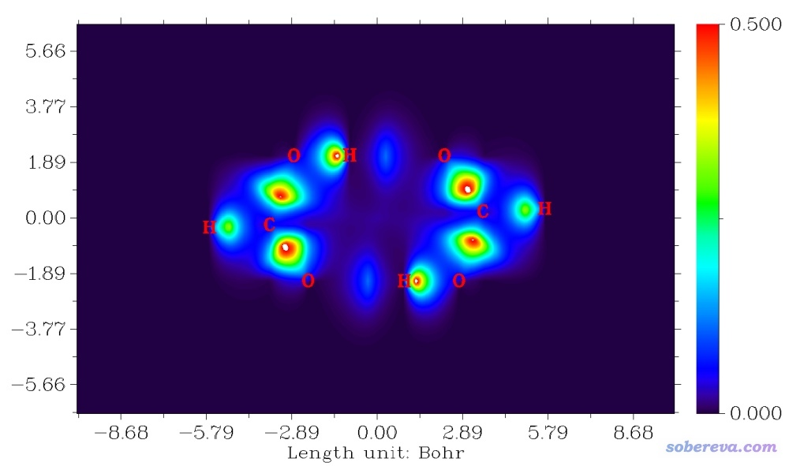

此图体把体系中的共价键和单体之间的两条氢键都展现出来了。由于共价键明显比氢键强，所以相应区域的δg数值明显比氢键区域的要大得多。δg函数在某种程度上与DORI有相同的价值，即可以体现出体系中任何类型的相互作用，但是δg还可以把强度差异体现出来，而DORI不反映这一点。

接下来我们绘制一下δg函数的等值面图。选-5退到主菜单，然后依次输入  
5  //计算格点数据  
22   //δg函数  
2  //中等质量格点  
-1  //观看等值面  
在不同的等值面数值(isovalue)下看到的等值面如下所示

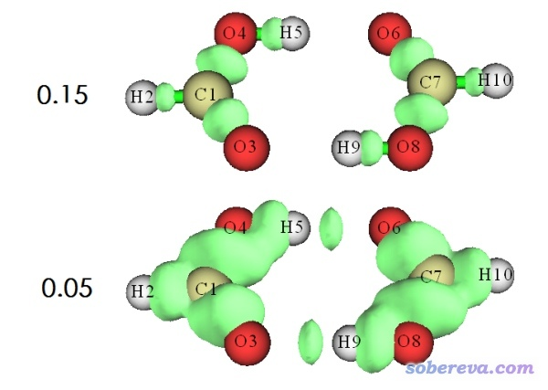

可见在isovalue=0.15时，只有化学键区域被展现了出来。而当isovalue减小到0.05时，氢键作用区域才出现。读者可以尝试把isovalue逐渐由大到小调节，看等值面怎么变化，看到的现象是越弱的相互作用对应的等值面出现得越晚。因此，当我们只对化学键感兴趣而不想讨论弱相互作用的时候，只需要绘制isovalue较大时的δg等值面即可。

## 3 实例：用IGM考察苯酚二聚体中的相互作用

上面的例子仅仅是前戏，当前这个例子才展示Multiwfn中专门的IGM分析模块的用法。IGM模块在使用时需要定义片段，Multiwfn允许定义无数个片段。当定义n个片段时，n个片段内的相互作用和n个片段间的相互作用可以分别展示互不干扰，而且程序还允许对每一对片段之间的相互作用进行细节分析。所有定义的片段的并集并不要求是整个体系，比如对10聚体团簇我们可以只把其中离得近的三个分子定义成三个片段来分析它们的相互作用，而其它单体在计算时会被忽略。一个片段并不需要对应一个分子，完全可以将一个大分子划分成两个甚至多个片段。用IGM模块时即便你并不打算分离片段间和片段内相互作用，也至少要定义一个片段来将你感兴趣的区域的原子纳入进去。

本例我们将把苯酚二聚体的两个单体各定义为一个片段来分析片段间的相互作用。启动Multiwfn，载入苯酚二聚体的结构文件phenoldimer.xyz，然后依次输入  
20   //图形化分析弱相互作用  
10   //IGM分析  
2    //定义两个片段  
1-13   //片段1包含的原子。即第一个苯酚的原子序号范围  
14-26    //片段2包含的原子。即第二个苯酚的原子序号范围  
2    //中等质量格点（约512000个点）  
然后程序开始计算格点数据，很快就算完了。

用过RDG方法分析弱相互作用的人肯定对RDG vs sign(lambda2)rho的散点图不陌生，类似地，我们可以绘制δg或δg_intra或δg_inter
vs sign(lambda2)rho的散点图来考察体系中的相互作用。我们先绘制δg vs
sign(lambda2)rho的散点图。在后处理界面选择-1，然后选1，就得到了相应的图像  
 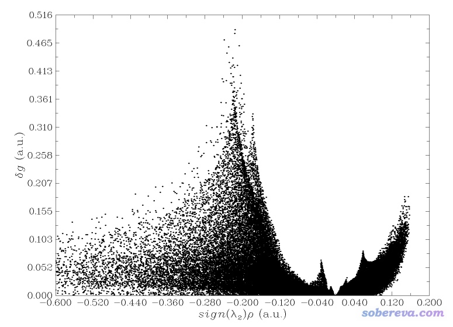

按照讨论RDG散点图的方式讨论此图，我们看到图中sign(lambda2)rho显著大于0的区域有一大堆点，因此可以说体系里存在位阻作用。在sign(lambda2)rho约-0.04的位置有一个峰，由于这个位置电子密度不很大，但又不很接近于0，因此可以初步判断应该是对应苯酚二聚体之间的氢键。在sign(lambda2)rho很负的区域有大面积的峰，由于这些位置电子密度较大，因此可以认为是对应化学键区域的点。若我们在后处理界面选择-1后选择1，得到的将是体现片段间作用的δg_inter
vs. sign(lambda2)rho散点图；如果选择2，得到的将是体现片段内作用的δg_intra vs.
sign(lambda2)rho散点图。我们上面展示的图相当于这两种图的叠加。有兴趣者也可以选择-1后选择4，会把δg_intra和δg_inter分别用黑色和红色的点同时显示在同一张图上便于分别讨论。  
  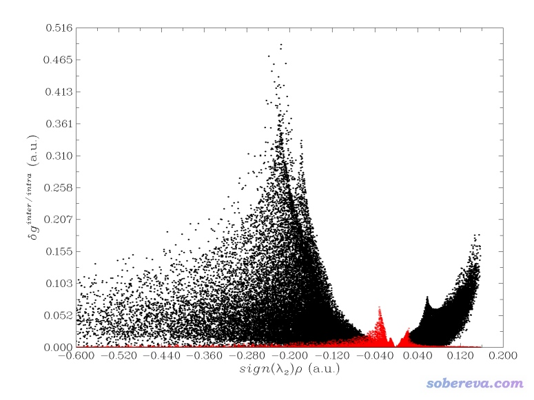

然后我们来看看等值面图。后处理菜单选4 Show isosurface of grid data，然后我们可以选择观看δg_inter、δg_intra以及δg的等值面图，前两者如下所示

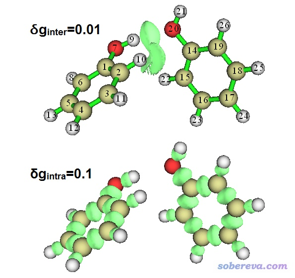

由图可见，利用IGM方法，可以非常好地把片段内和片段间的相互作用分离开。而用RDG方法的时候，为了达到这个目的，需要通过Multiwfn的主功能13来试图对RDG格点数据进行屏蔽（见Multiwfn手册4.13.4节的实例），这麻烦得多，有时候还得来回试参数。

接下来我们利用VMD来绘制sign(lambda2)rho填色的δg_inter等值面图。在后处理菜单中选择3来把δg_inter、δg_intr、δg、sign(lambda2)rho的格点数据分别导出为当前目录下的dg_inter.cub、dg_intra.cub、dg.cub和sl2r.cub。将dg_inter.cub和sl2r.cub都拷到VMD目录下，把Multiwfn自带的examples目录下的VMD作图脚本IGM_inter.vmd也拷到VMD目录下，然后启动VMD，在命令行窗口输入source IGM_inter.vmd，就立马看到以下图像

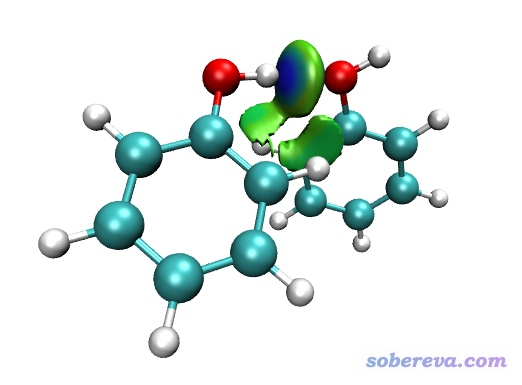

这个IGM_inter.vmd脚本和Multiwfn自带的绘制RDG填色图的脚本RDGfill.vmd非常类似。不过由于δg_inter和RDG的函数特征还是存在差异的，所以IGM_inter.vmd脚本默认用的色彩刻度是-0.05~0.05，与RDGfill.vmd用的不同，不过对图像的解读还是和RDG填色图完全一样。上图当中形成氢键的区域等值面颜色是明显的蓝色，因此应当认为确实形成了氢键。而在旁边的区域还有大面积绿色扁片，体现相应弱相互作用区域电子密度很小，数值接近0，因此作用强度较弱，应当解释为色散作用。对此体系的IGM分析结论和RDG方法是完全一样的。不过，做过RDG分析的人会明显感觉IGM的等值面和RDG等值面的特点还是有一定区别的，主要差异在于RDG等值面整体比较薄，而IGM等值面整体比较丰满。丰满带来的好处是等值面边缘比较平滑，也不像RDG等值面那样往往出现斑驳难看的窟窿。用IGM的时候，使用比RDG分析时明显更少的格点数就可以达到与之同档次的图像效果。

绘制δg_intra的填色图的做法是把dg_intra.cub、sl2r.cub、examples\IGM_intra.vmd都拷到VMD目录下，然后在VMD里执行source IGM_intra.vmd。图片就不在这里展示了。

下面我们把两个苯酚之间的相互作用分解成原子的贡献来考察。在Multiwfn的IGM模块的后处理菜单中选6 Evaluate contribution of atomic pairs and atoms to interfragment interaction，然后选High quality积分格点，算完后，当前目录下就出现了atmdg.txt。文件中先给出这样的信息  
 Atom dg index in fragment  1  
  Atom    9 :    0.468547  
 Atom   10 :    0.279359  
 Atom    2 :    0.237590  
 Atom    7 :    0.216155  
 Atom    1 :    0.182576  
...略  
 Atom dg index in fragment  2  
  Atom   20 :    0.427777  
 Atom   15 :    0.277831  
 Atom   14 :    0.273219  
 Atom   22 :    0.243161  
...略

这就是之前提到的原子δg指数，体现了两个苯酚中各个原子对苯酚间相互作用贡献的程度，由大到小排序。通过这样信息，可以很方便而且定量地考察原子对感兴趣的弱相互作用的贡献程度。

再往下是原子对δg指数，体现两个片段间的原子对对总相互作用的贡献  
  Atom pair dg index (zero terms are not shown)  
    9   20 :    0.215895  
    7   20 :    0.079773  
    9   14 :    0.078497  
...略

上面给出的定量数据靠不靠谱？我们对照前面给出的带着原子序号的δg_inter图，可以看到δg指数较大的原子确实都离δg_inter等值面较近。原子对δg指数中9-20是最大的，这俩原子确实紧紧夹着对应氢键的δg_inter等值面。7-20、9-14等原子对的距离也都不很远，而且连线穿过δg_inter等值面，这是它们的原子对δg指数不太小的原因。可见，程序给出的原子和原子对δg指数都是对考察弱相互作用很有用的指标。

值得一提的是，也不要过度解释上面这两个指数、夸大这两个指数的意义，这俩指标和衡量相互作用程度最关键的相互作用能并没有直接的内在联系。如果你真的需要准确讨论原子和原子对对弱相互作用能的贡献，比较简单的做法是利用分子力场来计算，见《使用Multiwfn做基于分子力场的能量分解分析》（<http://sobereva.com/442>）。有的原子电荷计算方法如RESP、ADCH需要波函数信息，如果你只能提供结构信息，则可以用Multiwfn里的电负性均衡方法(EEM)计算原子电荷，此方法计算飞快，几百个原子体系瞬间就能算完，默认参数下得到的EEM电荷与B3LYP/6-31G*下的CHELPG电荷相仿佛，很适合描述原子间静电相互作用。

输出完atmdg.txt后，Multiwfn还问你是否把atmdg.pdb输出到当前目录下。这个pdb文件里beta值和占有度（occupancy）字段分别记录的是原子δg指数的10倍和百分比原子δg指数。如果你将这个文件载入VMD，并且按照beta或occupancy属性进行着色的话，那么不同原子对弱相互作用的贡献将可以通过颜色一目了然地考察。这里我们输入y，让程序输出此文件，然后将文件载入VMD，进入Graphics - Representation，Drawing method设CPK，Coloring Method设Beta，此时看到图形窗口中不同原子已经根据δg指数着色了。默认的色彩刻度是程序根据当前情况自动判断的，想改的话可以点击Trajectory标签页然后调整Color Scale Data Range。我们把色彩刻度上限从自动判断的值改为更大的值1，使得色彩变化更柔和一些，然后看到的就是下图的效果。VMD默认的色彩刻度是红-白-蓝（RWB）方式变化，因此下图中颜色越红的原子δg指数越小，越白的原子δg指数越大。如果想调整色彩刻度定义就进入Graphics - Colors - Color Scale来修改。

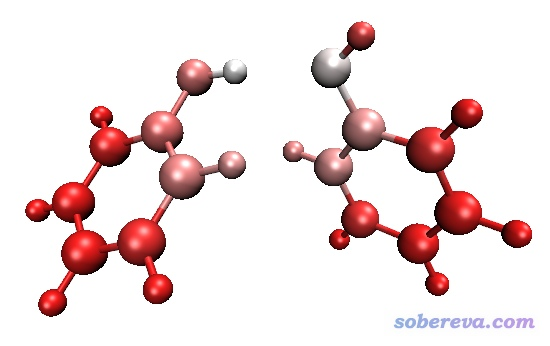

根据原子δg指数着色的分子结构图和δg_inter等值面图也可以绘制到一起。即首先按照前述方法把填色的δg_inter等值面图用VMD脚本显示出来，再载入atmdg.pdb，然后以上述方式修改显示设定，得到根据原子δg指数着色的CPK风格的分子结构图，并且把显示δg_inter等值面图的那个ID里面的显示分子结构的那个表示(Rep)给删除掉。最后效果将会是下面这样：

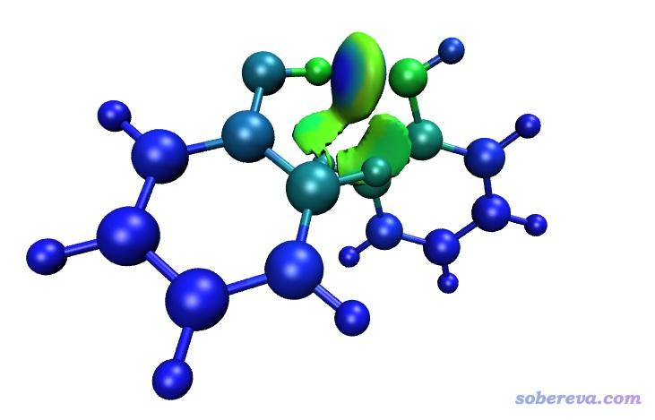

之所以上面的图对原子δg指数的着色和之前不一样了，是因为VMD里色彩刻度只能用一种。由于IGM_inter.vmd脚本里面有语句把色彩刻度变化设成了蓝-绿-红(BGR)，因此此时的图像中，原子δg指数越大的原子显得越绿，越小的显得越蓝。绘制上图时我还在Graphics-Representation里把显示等值面的Material设成了AOShiny，这样填色效果比默认的Opaque材质更不容易受到光线的影响。

Multiwfn在输出atmdg.txt的同时还输出我提出的IBSIW（intrinsic bond strength index for weak interaction）指数，这借鉴了《Multiwfn支持的分析化学键的方法一览》（<http://sobereva.com/471>）中介绍的用于衡量化学键强度的IBSI指数的思想。IBSIW相当于将原子对δg指数除以两个原子间以埃为单位的距离再乘以100。经过笔者粗略测试，IBSIW比起单纯的原子对δg指数在衡量原子间弱相互作用强度上往往更合理一些。Multiwfn把IBSIW输出到当前目录下的IBSIW.txt中，其中不仅有每对原子的数值，也有把各个原子涉及到的IBSIW都加和的数值。

## 4 实例：考察主-客体复合物中的弱相互作用

这个例子我们考察一个主-客体复合物之间的弱相互作用。结构文件是本文提供的文件包里的host-guest.xyz。

我们要把主体和客体分子各定义为一个片段，所以我们得知道两个分子各自的原子序号范围。如何快速得到一个大体系中某个分子的序号范围？这可以利用gview6的片段选择功能，这里示例一下。gview6不支持xyz文件，但支持pdb文件，所以我们先得转换一下格式，用Multiwfn就可以做这个转换。启动Multiwfn，载入host-guest.xyz，然后依次输入  
100  //主功能100  
2   //导出文件  
1   //导出为pdb格式  
C:\host-guest.pdb  //导出的路径

用gview6载入此文件，然后在一个客体原子上点右键，选择Select Fragment of Atom xxx，此时与这个原子有键连关系的所有原子都会被选中成为黄色，然后选主菜单中的Tools-Atom Selection，在新窗口中会看到原子的编号范围，是127-153，把这行字符复制下来，之后就可以直接粘贴到Multiwfn窗口中了（对有的体系，选中的区域的原子序号是不连续的，gview会给出比如1-5,8,20-30这样的字符串，这种字符串也同样可以直接粘贴到Multiwfn里定义片段）。显然，当前体系里其它原子，即1-126，就是主体分子的序号范围了。

我们开始做这个体系的IGM分析，在Multiwfn中载入host-guest.xyz，然后依次输入  
20  
 10  
 2  
 1-126  
 127-153  
 -10  //修改延展距离  
 0  //把默认的延展距离从默认的2 Bohr改为0  
 2  //中等质量格点

此例修改延展距离是因为根据体系结构可知，当前体系中弱相互作用区域肯定都在体系内部区域，因此计算IGM格点数据的时候用的盒子没必要在体系四周往外扩一定距离。在计算的点数相同的情况下，盒子越小，则均匀分布在盒子里的格点之间的间隔就越小，图像效果就会越好，等值面会越平滑。

本例我们就看一下填色的δg_inter等值面图。按照上一节例子用IGM_inter.vmd脚本绘图，我们发现图上只出现了很小很零散的等值面，并没有很好体现主-客体之间的相互作用。这是因为前面提到过，相互作用越弱的区域δg越小，由于当前体系主-客体之间是范德华作用，强度很弱，因此如果不把δg_inter等值面数值设小的话是基本看不到什么的。我们遂在Representation界面里把Isovalue改为较小的值，比如0.003，此时看到的图像如下。作为对比，下图也把同样格点设定下的基于准分子密度的RDG填色等值面图附上了（是用Multiwfn主功能20的子功能2来产生格点数据然后由VMD绘制的，具体步骤看手册4.20.2节）。  
 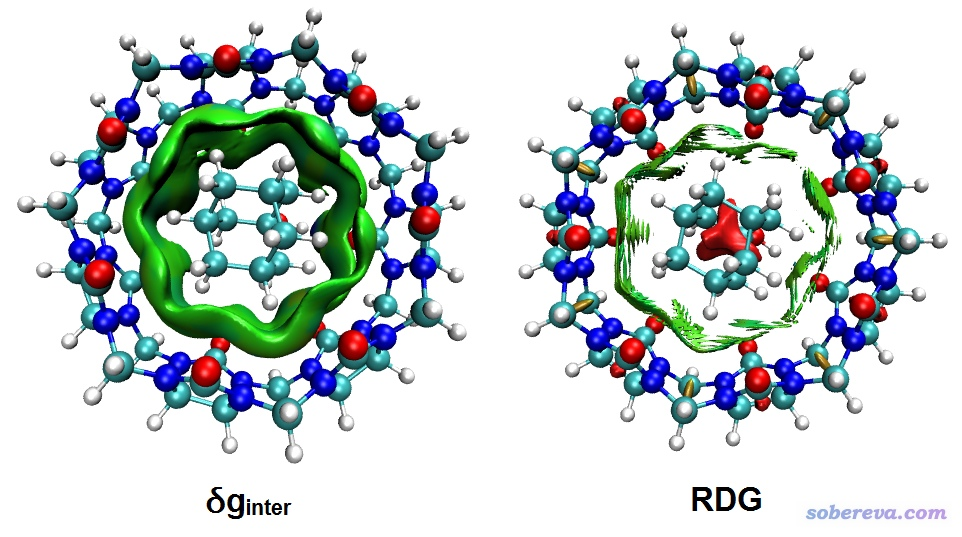

图像效果好坏高下立见！同样格点间距情况下，IGM的图圆润丰满富态得多，而RDG的图则颇为毛糙，锯齿明显，显得十分贫穷。要改善RDG图的图像效果，需要用明显更小的格点间距，但代价就是要算的格点数将大为增加。虽然把RDG等值面数值稍微改大点可以让等值面更平滑、连续一些，但代价就是周围会出现很多多余的等值面，把图像弄脏。

下面我们把δg_inter等值面图和根据原子δg指数着色的结构图绘制在一起。由于当前体系弱相互作用几乎都是色散作用，根据sign(lambda2)rho填色后的颜色基本都是绿色，所以要不要填色效果无所谓，所以我们绘制时候只把δg_inter显示成等值面而不填色，这样在根据原子δg指数对结构着色的时候就可以随意设定色彩刻度了。让Multiwfn产生atmdg.pdb文件，由于体系比苯酚二聚体略大了一些，所以计算δg指数过程的耗时也高了不少。把dg_inter.cub和atmdg.pdb都拖入VMD，在VMD里经过一番调节，最后得到了下图，效果相当不赖！图中主体分子中越红的地方对主-客体相互作用贡献越大，看着非常直观。

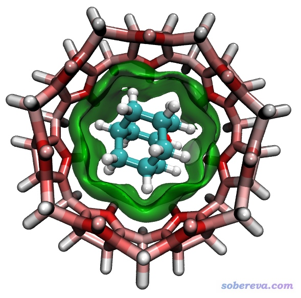

为了获得上图，在VMD中具体做的设定和调节如下  
(a)在Graphics-Representation中，切换到对应atmdg.pdb的页面，设立两个Rep，Selected Atoms分别设为fragment 0和fragment 1，分别对应主体和客体分子（在VMD中，相互键连的每批原子都有一个独立的fragment号）。选中主体分子对应的Rep，Drawing Method设Licorice，Material设EdgyShiny，Coloring Method设Beta，然后在Trajectory标签页里把色彩刻度下限和上限分别设为-0.2和0.2。之后选中客体分子对应的Rep，Drawing Method设CPK，Coloring Method用Name，Material设Glossy，然后把Sphere Scale设为1.2，Bond Radius设0.9。  
(b)在Graphics-Representation中，切换到对应dg_inter.cub的页面，把Drawing Method设为Isosurface，Isovalue设为0.003，Drawing设为Solid Surface，Show设为Isosurface。然后把Coloring Method设ColorID并且在旁边的下拉框中选7 Green。最后把Material设为Edgy Glass。  
(c)在Graphics-Color里选Color Scale标签页，把Method从默认的RWB改为BWR，这样原子δg指数从0.0到0.2范围的变化就通过由白变红方式展现了。

## 5 实例：考察Actos四聚体中的相互作用

Actos是一种药物分子，笔者过做分子动力学模拟了此体系在真空下的四聚体（共180个原子）。这里笔者随便从中抽出一帧，用Grimme的xtb程序作了优化，得到的最终结构是本文的文件包里的4Actos.xyz。本节我们考察一下其中单体间的弱相互作用，由此进一步展示IGM分析的片段设定。

首先我们考察体系中所有单体间的弱相互作用对应的δg_inter填色等值面图，因此我们要把每个单体各定义为一个片段。启动Multiwfn，载入4Actos.xyz，然后依次输入  
20  
 10  
 4   //四个片段  
 1-45  //单体1的序号  
 46-90  //单体2的序号  
 91-135  //单体3的序号  
 136-180  //单体4的序号  
 3   //鉴于体系不小，为了保证等值面质量，这次我们用高质量格点  
 3   //导出cube文件  
此时产生的dg_inter.cub和dg_intra.cub分别描述的是这个四聚体当中所有单体间的弱相互作用和所有单体内的弱相互作用。然后和之前的例子一样用IGM_inter.vmd和IGM_intra.vmd绘制等值面图，如下所示。左图是脚本直接绘制出来的，右图是为了便于辨别分子，把不同单体用不同颜色显示了  
 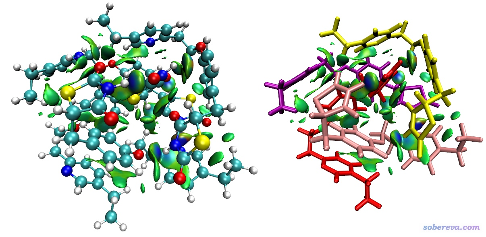

图像把各处弱相互作用出现区域和特征都很好地展现了，但是看着终究有点乱。我们可以把弱相互作用一对一对地考察。比如我们只想把上图中红色和肉色分子之间的δg_inter等值面展现出来，那么我们可以选0退出IGM分析界面，然后依次输入  
10  //再次进入IGM分析模块  
2   //定义两个片段  
1-45  //红色的分子对应的原子序号  
135-180   //粉色的分子对应的原子序号  
2   //中等质量格点（用高质量格点当然也可以。通过对比会看到，中等质量格点的等值面也不比之前用高质量格点的差多少，体现出IGM对格点质量依赖性较低的优点）

然后和之前介绍的一样利用IGM_inter.vmd绘制填色等值面图。在VMD里显示出来后，我们把分子结构用两个Rep来显示，都用Licorice风格。第一个Rep的选择范围写的是fragment 0 3，用来显示我们感兴趣的那两个分子，Bond Radius设0.2；另一个Rep的选择范围写的是not fragment 0 3，用来显示另外两个分子，并且为了让它们存在感低一些，把Material设成Transparent使它们透明，且Bond Radius设为更小的0.1。此时看到的图像如下：

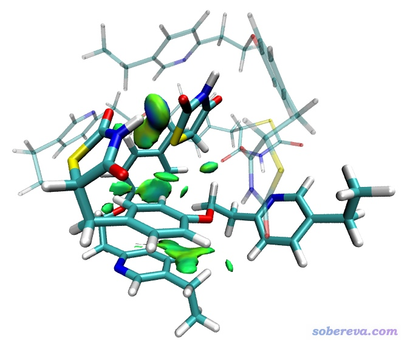

图像效果非常理想，仅有感兴趣的两个分子之间的弱相互作用被展现出来，其它区域的弱相互作用完全没有出现在图中扰乱视觉。IGM比RDG方法关键性的好处就是指哪打哪，而且打的地方还可以进一步分解成原子和原子对的贡献。我们让Multiwfn把当前情况对应的atmdg.pdb产生出来，拖到VMD里以Licorice风格显示并用Beta字段着色，并把原先显示fragment 0 3的那个Rep取消显示，看到如下效果

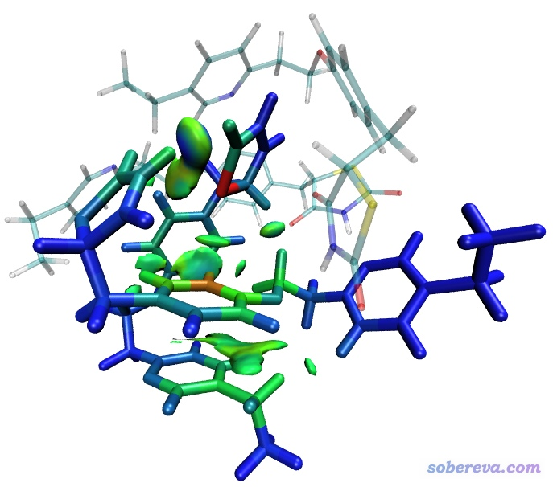

当前色彩刻度变化是蓝-绿-红，因此对于图中以不透明方式显示的两个分子，蓝色代表原子的δg指数接近于0，故对两个分子间的弱相互作用几乎没有贡献；绿色代表原子的δg指数不小，明显参与了弱相互作用；桔色甚至红色代表相应原子的δg指数很大，仔细图像的话，会发现原因是这些原子都参与了不止一对分子间弱相互作用，因此值得特别关注。

当前这个四聚体还可以以其它方式划分片段。比如我们可以把分子1作为一个片段，而分子2、3、4作为第二个片段，那么IGM分析就能专门考察1与2-3-4三聚体之间的弱相互作用，而三聚体内部的弱相互作用则不会捣乱。我们也可以把其中两个分子作为一个片段，另两个分子作为另一个片段，这样两个二聚体之间的弱相互作用就会被展现，而二聚体内部的弱相互作用则不会呈现。IGM方法可谓极尽灵活。

## 6 实例：考察DNA中碱基之间的弱相互作用

前面的例子都是考察分子间弱相互作用，利用IGM也可以考察分子内弱相互作用，只要恰当定义片段即可。这里我们以考察DNA中碱基之间的弱相互作用作为例子。通过分子力场优化后的DNA片段是文件包里的DNA_single.pdb。为了看起来更清楚一点，这个DNA只保留了一条链。这个文件里有10个核苷酸，我们这里只考察靠中部位置的三个碱基之间的相互作用，即下图中用球棍方式绘制的三个碱基

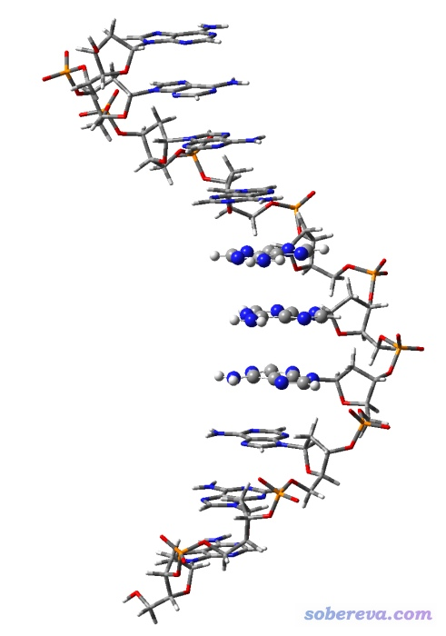

我们还是可以利用gview选中碱基部分，然后在Tools-Atom Selection里方便地看到编号。这三个碱基的原子编号范围分别为107-120、139-152、171-184。启动Multiwfn，载入DNA_single.pdb，然后依次输入  
20  
10  
3  //定义三个片段  
107-120  
139-152  
171-184  
10  //在图形窗口中设定盒子  
为了节约计算量而且省内存，我们在图形窗口中通过调节盒子尺寸和位置，使得盒子差不多刚好套住可能出现弱相互作用的区域，如下图这样  
 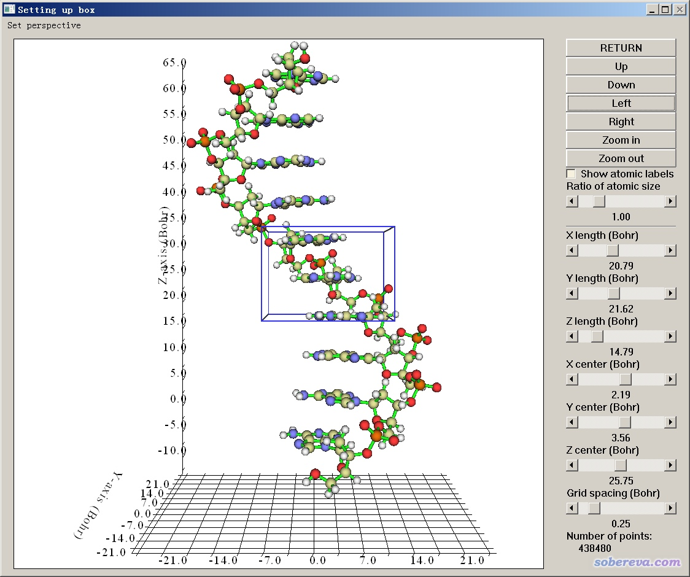

关闭图形窗口，程序就开始计算格点数据了。之后把格点数据导出，用IGM_inter.vmd脚本在VMD里作图，然后在Graphics-Representation里把等值面数值改为0.005，看到的图像效果如下

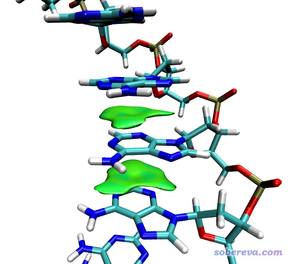

可见图像很干净，等值面很平滑，很好地展现出了碱基之间的pi-pi堆积作用。

## 7 考察BCP位置的δg衡量相互作用强度

AIM理论中的键临界点(BCP)一般被认为是原子间相互作用路径上最有代表性的点，通过考察这个点的实空间函数可以用来表征相互作用强度、特征。IGM原文表1中指出BCP位置的δg和相互作用强度有很好正相关性。我们这里对HF线型四聚体当中三个氢键对应的BCP的δg进行一下考察。如果对Multiwfn做拓扑分析搜索临界点不熟悉，可以参看《使用Multiwfn做拓扑分析以及计算孤对电子角度》（<http://sobereva.com/108>）。

本文的文件包里4HF.wfn是基于M062X/TZVP下进行结构优化，然后在M062X/def2-TZVP下产生的波函数文件。我们先启动Multiwfn，载入4HF.wfn，然后依次输入  
2  //拓扑分析  
3  //以每两个原子连线中点为初猜搜索临界点，一般能够找到所有的BCP  
0  //显示分子结构和临界点

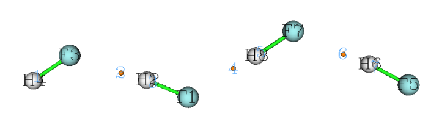

由图可见对应三个氢键的三个BCP的编号分别是2、4、6。关闭图形窗口，进入选项7，然后输入要查看属性的BCP序号。我们先输入2，从屏幕上的数据我们可以直接读到包括δg在内的各种实空间函数值，部分贴在这里：  
Density of all electrons:  0.3332066650E-01  
 Potential energy density V(r): -0.3698198590E-01  
 Delta_g:  0.7562586676E-01

然后再次进入选项7，输入4，得到对应中间氢键的BCP的性质  
Density of all electrons:  0.3714890342E-01  
 Potential energy density V(r): -0.4270021580E-01  
 Delta_g:  0.8258706914E-01

之后再查看6号BCP的性质  
Density of all electrons:  0.3110958174E-01  
 Potential energy density V(r): -0.3333690144E-01  
 Delta_g:  0.6951460311E-01

由数据可见，δg的大小顺序是BCP4 > BCP2 > BCP6，因此体现出氢键强度应该是F7-H8...F1 > F1-H2...F3 > F5-H6...F7。对于同类键来说，BCP电子密度越大、势能密度越负则相互作用强度越大。由上面给出的数据可见，通过δg体现的强度顺序和电子密度、势能密度体现的强度顺序是完全一致的。而且如果考察氢键键长的话，根据键长越短键强越大的这个多数情况奏效的规律，结论也是和δg判断的是一致的。

## 8 总结&其它

本文介绍的IGM方法是对流行的RDG（NCI）方法的一个重要的补充。IGM的优点主要有以下几条  
(1)可以很自由地定义片段，没纳入片段的部分不会被考虑，而且片段内和片段间的相互作用可以明确地分离展现，这使得图像可控性很强，想展现什么就展现什么，不像RDG方法那样各种相互作用同时出现在图上，还得想办法对格点数据做屏蔽或者ps来消除不感兴趣又扰乱视觉的部分。  
(2)可以通过计算原子和原子对δg指数定量反映原子和原子对对片段间相互作用起到的影响程度，而且原子的贡献还可以通过着色一目了然地在VMD中展现出来，便于识别关键原子。  
(3)IGM等值面比RDG等值面平滑丰满得多，因此用较少数目的格点就可以达到满意的图像效果，计算耗时和内存消耗量因此较低。  
(4)不同区域的δg的大小可以体现相互作用强度，因此可以通过调节δg等值面数值来决定是只显示较强的相互作用，还是所有相互作用都显示出来。另外，还可以通过考察BCP处的δg值来定量衡量特定相互作用的强度。

但是，IGM也并非能完全代替RDG，有以下两点原因  
(1)IGM虽然有基于波函数的版本，但是定义得比较抽象，效果也没比基于promolecular密度的IGM方法更好，因此Multiwfn也没打算支持之。对于对精度要求较高，特别是相互作用区域的实际密度可能与promolecular密度相差较大时，RDG还是应当优先考虑。  
(2)IGM不适合用来考察体系中所有弱相互作用。因为考察这个需要把整个体系（或某个局部区域的原子）定义为一个片段，然后考察这个片段的δg_intra。但是，这样呈现出的图像要么只显示化学键区域，要么显示的是化学键+弱相互作用区域。如果想只把弱相互作用区域显示出来，就需要根据sign(lambda2)rho的范围将sign(lambda2)rho很负的区域进行屏蔽（用IGM后处理菜单中的5 Screen delta_g_intra at high density region实现），但实际发现这么的做效果并不如RDG好，往往是isovalue调到能令弱相互作用等值面能较好显示时，其它区域的一些杂碎等值面又出来了。另一种做法是直接计算整体的δg函数格点数据，再用Multiwfn的主功能13对距离原子较近区域的δg函数的格点数据进行屏蔽，从而只保留弱相互作用区域，但这样终究稍微麻烦点，不如直接用RDG。

在Multiwfn手册的4.20.10节里还有关于IGM方法的更多例子，建议大家阅读本文后阅读。另外，在《18碳环（cyclo[18]carbon）与石墨烯的相互作用：基于簇模型的研究一例》（<http://sobereva.com/615>）介绍的笔者的一篇文章中还用IGM考察了18碳环与石墨烯之间的相互作用，效果很好，建议一看。

IGM的作者在2020年基于δg还定义了一个叫IBSI（内禀键强指数）的量，用于衡量化学键强度，Multiwfn也可以计算。关于这个方法请在《Multiwfn支持的分析化学键的方法一览》（<http://sobereva.com/471>）搜索IBSI查看介绍。

还值得一说的是，如果你用的输入文件包含波函数信息（如.wfn、.fch、.molden文件），则进行IGM分析的时候程序会让你选择sign(lambda2)rho的类型，第一种是基于实际电子密度计算的，第二种是基于promolecular密度近似计算的。原理上来说，用前者时散点图、等值面图的填色效果结果比后者会更有意义（但文中涉及的脚本里的色彩刻度在某些时候可能需要进行一些修改），而耗时也会高得多。当输入文件只含结构信息时，sign(lambda2)rho总是基于promolecular密度近似计算的。

之前在<http://sobereva.com/399>里介绍过怎么绘制有填色效果的RDG散点图，这很便于将散点图上的位置与填色等值面图相互对照，对于IGM散点图也完全可以绘制类似的效果，只不过需要用的gnuplot程序的作图脚本有所不同。具体做法见手册4.20.10.1节末尾。效果如下所示

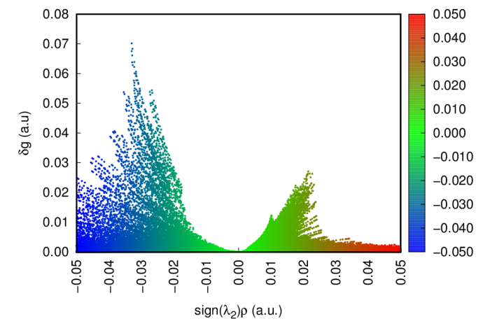

在<http://bbs.keinsci.com/forum.php?mod=redirect&goto=findpost&ptid=9472&pid=149548>还有人分享了基于Python的绘制这种图的脚本，这样就不需要装gnuplot了。
