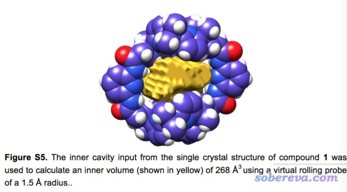
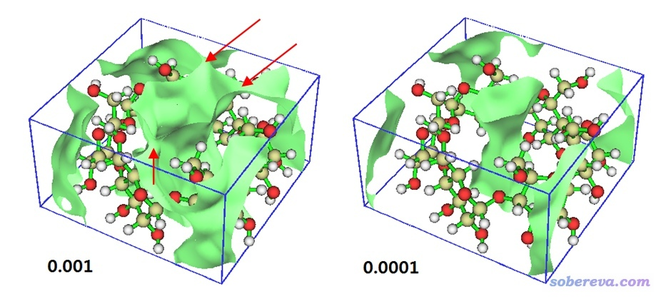
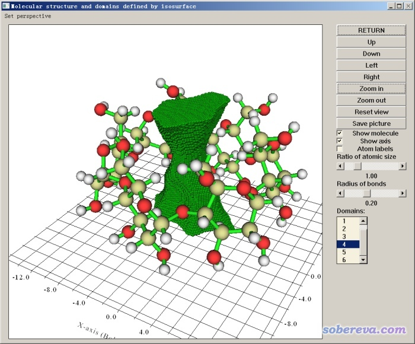
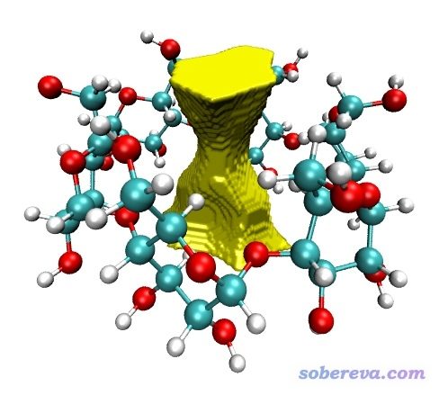
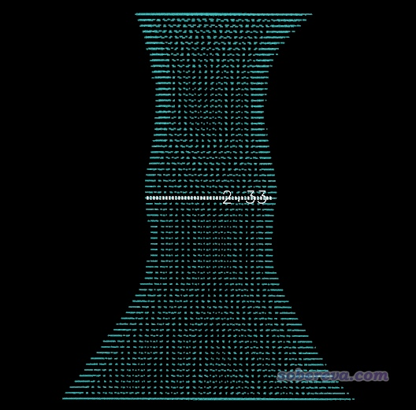
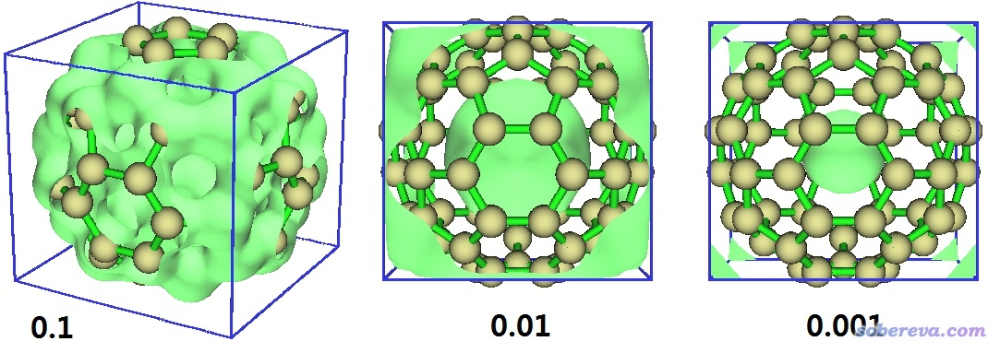
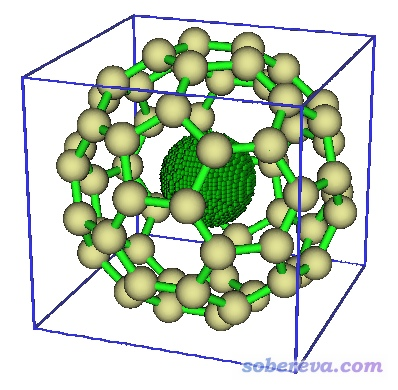
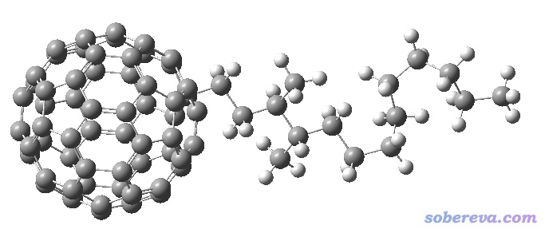
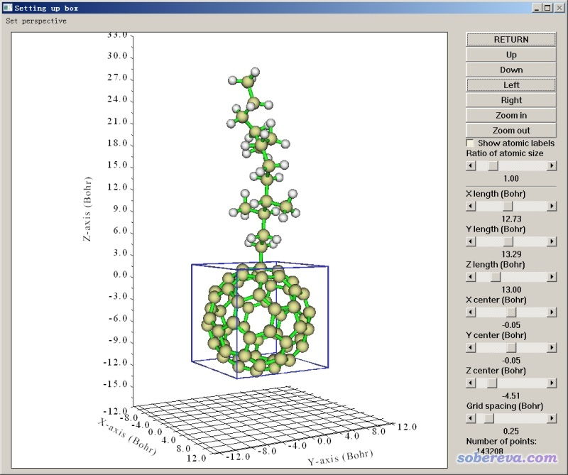

**注****1**：本文的方法适合展现分子内部的孔洞。如果你是希望展现周期性动力学模拟或者晶胞当中的自由区域（未被原子占据的区域）并计算其体积，应当使用此文的方法：《使用Multiwfn图形化展示分子动力学模拟体系中的孔洞、自由区域》（<http://sobereva.com/539>）和《使用Multiwfn计算晶体结构中自由区域的体积、图形化展现自由区域》（<http://sobereva.com/617>）。

**注2**：Multiwfn还有计算分子孔洞直径的功能，见《使用Multiwfn计算分子和晶体中孔洞的直径》（<http://sobereva.com/643>）。

**使用Multiwfn可视化分子孔洞并计算孔洞体积**

Using Multiwfn to visualize molecular cavity and calculate cavity volume   
文/Sobereva @[北京科音](http://www.keinsci.com) 

First release: 2018-Feb-28  Last update: 2021-Jul-26  
 

## 1 前言

前些天有个人在思想家公社QQ群里问这种图怎么绘制，怎么计算孔洞体积  

  
其实有很多程序和在线服务器都是专门用来显示孔洞、口袋并计算其体积的，但是这些程序绝大部分都是给生物分子用的，而对于小分子体系，要么完全不适用要么不好用。而利用十分灵活的Multiwfn，可以很容易地显示出分子孔洞并计算其体积。为了实现这个目的时更方便，笔者在原先Multiwfn基础上又稍微做了扩展。本文使用的是2021-Jul-26更新的Multiwfn。本文会结合几个例子讲解原理以及说明具体怎么操作。  
  
Multiwfn可以在<http://sobereva.com/multiwfn>免费下载，如果对Multiwfn不了解，看《Multiwfn入门tips》（<http://sobereva.com/167>）和《Multiwfn FAQ》（<http://sobereva.com/452>）。使用本文功能计算孔洞体积发表文章时务必按照程序启动时显示的要求恰当引用Multiwfn。  
  
  

## 2 原理

何以定义分子孔洞？一个简单的做法是，把每个原子在自由状态的电子密度进行叠加成为promolecular density（准分子密度），相当于原子出现在分子中对应的位置，但电子密度还没有因为成键而分布发生弛豫的状态。准分子密度的某个等值面内的区域我们认为是分子内的区域，而这个等值面外部的区域就可以作为分子孔洞了。  
  
有些孔洞是封闭的，比如富勒烯内部区域；但有些孔洞是与外界连通的，比如纳米管，对于这种情况，计算准分子密度的时候必须恰当设定盒子（即格点数据计算范围），让这个盒子恰好括住孔洞出现的区域，此时既在盒子内部，又在准分子密度等值面外的区域就是孔洞区域了。  
  
周期表里几乎所有元素在自由状态的球对称化的密度都是内置于Multiwfn的，因此Multiwfn可以很迅速、方便地构建准分子密度。计算准分子密度不需要波函数信息，所以输入文件就用含有结构信息的文件即可，比如.pdb、.xyz、.mol这些常用的记录分子结构的格式都是Multiwfn支持的。  
  
上面是基本原理，更具体到程序实现时是这样的：进入Multiwfn的域分析功能（主功能200里的子功能14），将被计算的实空间函数设为准分子密度。然后恰当设定域的定义，令域对应于准分子密度小于某个值（如<0.001或0.0001 a.u.）的空间范围。然后选择计算格点数据并做域分析，期间要恰当设定盒子范围，选择恰当的格点间距（盒子尺寸相同时，格点间距越小则点数越多，耗时越高、耗内存越多，而体积计算结果也越准确）。程序会计算均匀分布在盒子内每个格点的准分子密度，然后通过特殊的方法将每一批空间上相互连通的格点都赋予唯一的编号，也因此一个编号对应于一个域。之后，在后处理菜单中，就可以选择查看各个域的分布，找到对应于孔洞的那个域的编号，之后就可以计算相应的域的体积。在Multiwfn里可以通过小圆点叠加的方式显示指定的域，如果想要更好的绘制效果，还可以把域导出成为.cub文件，其中处于域内部的格点数值为1，外部为0（盒子边界的点也被设为0以保证等值面看起来总是封闭的），然后可以载入VMD、gview等程序来观看等值面，把等值面数值设为0~1之间的值比如0.5即可令等值面勾勒出孔洞范围。  
  
注意孔洞的图形和体积是没法唯一定义的，对于Multiwfn这种考察孔洞的方式，结果会受到定义域所用的准分子密度数值的影响。下面是alpha环糊精体系准分子密度=0.001和0.0001 a.u.时候的等值面图，盒子被设为恰好紧贴着分子边缘  

由图可见，如果用0.001等值面，则中间孔洞区域就经由箭头所示的区域和外部区域联通了，因此没法定义对应于孔洞的域并计算其体积。如果用0.0001等值面，如由图所示，孔洞区域和外部区域是完全隔绝开的，因此此时是可以考察孔洞的特征的。用多大等值面数值来划分域最合适，本身就是有任意性的，可以根据实际情况来决定。按照Bader的AIM理论，电子密度0.001 a.u.等值面被用来定义气相下分子范德华表面，因此看似用0.001更好，但是又由于上述问题，0.001未必总能被用来定义孔洞。总的来说，能用0.001时候建议用0.001，如果不合适，则可以考虑降低到比如0.0001再看看。  

一般情况为了方便、快速，基于上述准分子密度计算孔洞体积。但如果你能得到体系的波函数文件，想计算孔洞更为准确，不怕花费更多耗时，那么可以把含有波函数信息的文件（如.wfn、.fch等）载入Multiwfn，按照与本文一致的操作即可得到实际密度下的孔洞体积。

  

## 3 例：alpha环糊精

本例将计算alpha环糊精中间的孔洞区域体积并绘制孔洞图形，结构文件在此下载[alpha-cyclodextrin.pdb](http://sobereva.com/usr/uploads/file/20180228/20180228190154_69432.pdb)，这是从CCDC结构数据库中提取的环糊精结构。  
  
启动Multiwfn，载入pdb文件，然后输入  
200  //主功能200  
14  //域分析  
2   //设定用于定义域的实空间函数  
1   //对于只含有分子结构信息而没有波函数信息的输入文件，函数1对应于准分子密度  
3   //设定域的定义规则  
<0.0001  //将电子密度小于0.0001 a.u.的区域作为域  
1   //计算格点数据并产生域  
-10  //修改延展距离  
0   //延展距离被设为0，此时盒子会紧贴着分子边界设定  
1   //低质量格点。如屏幕提示所示，这个模式使用间距为0.2 Bohr的格点，格点数共978588。这样的精度对当前体系已经足够用了  
  

然后Multiwfn开始计算格点数据并且确定格点怎么归属为域。从屏幕上可以看到最终产生了6个域，包含的格点数、对应的体积也都显示了：

Domain:     1    Grids:       4    Volume:     0.005 Angstrom^3

Domain:     2    Grids:   12010    Volume:    14.238 Angstrom^3

Domain:     3    Grids:    5822    Volume:     6.902 Angstrom^3

Domain:     4    Grids:   39654    Volume:    47.009 Angstrom^3

Domain:     5    Grids:   13949    Volume:    16.536 Angstrom^3

Domain:     6    Grids:    7438    Volume:     8.818 Angstrom^3

  

接下来我们可以选3来在图形界面里观看各个域。在右下角列表里选择哪个域，哪个域对应的区域就会以小圆球叠加方式显示出来。我们挨个看后发现对应孔洞的那个域的编号是4号，如下所示，孔洞图形可以很好地反映当前分子实际的孔洞特征。

  

Multiwfn的域分析模块可以在感兴趣的域中对特定的函数进行积分，做法是选择选项1，然后输入域的编号，再选择被积分的函数。不管选择什么被积函数，域的体积和域的X/Y/Z上下限总是会被输出的。这里我们对对应孔洞的4号域进行积分，而且我们目前对这个域里其它性质不感兴趣，故选择100号函数（用户自定义函数。默认情况下这个函数处处为1，也因此对它积分没有任何计算耗时），结果如下：

Integration result:    0.3172320000E+03 a.u.

Volume:  317.232000 Bohr^3  (   47.008943 Angstrom^3 )

Average:    0.1000000000E+01

Maximum:    0.1000000000E+01   Minimum:    0.1000000000E+01

Position statistics for coordinates of domain points (Angstrom):

X minimum:   -2.7823  X maximum:    3.1445  Span:    5.9268

Y minimum:   -2.6823  Y maximum:    2.6095  Span:    5.2918

Z minimum:   -3.1770  Z maximum:    3.9140  Span:    7.0910

可见，孔洞的体积是47 Å^3（Integration result后面的值是对被选择函数的积分结果，由于被积的用户自定义函数默认情况下处处为1，也因此得到的积分值恰好也是这个域的体积值），这和之前在产生域之后直接输出的各个域的体积信息中的相应值是一样的。同时如输出所示，此孔洞Z坐标最大值和最小值分别为3.914埃和-3.177埃，因此Z方向跨距，即孔洞长度，是7.09埃。

  
然后介绍下怎么把域导出来放到VMD程序里观看。VMD是非常强大、灵活的化学体系可视化程序，可在<http://www.ks.uiuc.edu/Research/vmd/>免费下载。在刚才的域分析后处理界面里选择10，然后输入4，则4号域就被导出为了当前目录下的domain.cub。将分子.pdb文件和domain.cub都拖到VMD里，进入"Graphics"-"Representation"，Selected Molecule那一栏切换到对应分子结构的项，把Drawing method设为CPK。然后把Selected Molecule那一栏切换到对应.cub文件的项，把Drawing method设为Isosurface，Draw设为Solid Surface，Show设为Isosurface，Isovalue设为0.5。Coloring Method设为Color ID，假设我们要用黄色就在旁边选择4 Yellow。然后在文本窗口输入color Display Background white把背景变成白的，此时图像效果如下：  

稍微修改作图设定，弄成本文开头的图那种风格也很容易。

另外，我们还可以用后处理界面的选项11把指定的域的边缘格点导出为当前目录下的domain.pdb文件，其中每个粒子对应一个边缘格点。把这个pdb拖进VMD程序，Drawing Method设为sphere，即可在图形窗口看到各个边缘格点。之后还可以按键盘上的2键，然后点击两个粒子，这两个粒子的连线，以及它们的间距，就会直接显示出来，因此可以十分方便地测量孔洞的各个地方的尺寸，例如下图。为了看着清楚，这里选择了Display - Orthographic以使用正交视角。另外，注意在Graphics - Labels里可以设定原子标签、连线是否显示。

当前的pdb文件里分子朝向刚刚好，正好是孔洞方向冲着分子Z轴，因此按照上文计算方式可以直接得到对应于孔洞的域。但是，如果pdb文件里这个分子是斜着的，本例的做法就不行了。对这种情况，应当先在gview或VMD等程序里把分子朝向调正，从而能够在Multiwfn里定义矩形盒子来恰好框住孔洞区域。

## 4 例：富勒烯

下面我们来计算富勒烯C60的内部空腔体积。如上文提到的，计算结果和空腔图形也是受到计算时选择的准分子密度阈值影响的。为了帮助选择合适的阈值，我们可以先利用主功能5看看等值面图形。C60的pdb文件可在这里下载[C60.pdb](http://sobereva.com/usr/uploads/file/20180228/20180228190134_95736.pdb)。  
  
启动Multiwfn，载入C60.pdb，然后依次输入  
5  //计算格点数据  
1  //准分子密度  
-10  
0  //不留延展距离，而让盒子紧贴体系边缘  
1  //低质量格点，对于粗略考察足够了（注意此处主功能5里的格点质量的“低/中/高”和域分析模块的这个概念不同。前者的“低/中/高”对应的是不同的总格点数，而后者对应的是不同格点间距）  
-1  //观看等值面  
  

在界面里选择Show data range可以把盒子范围显示出来。我们随便考察几个等值面数值，图像分别如下

  
可见，准分子密度等值面为0.1的时候里外连通，此设定下没法划分出对应空腔的域。而0.01和0.001时里外都断开了，因此都可以计算空腔体积，而不同设定下结果必定不同，等值面数值越小时空腔对应的域越小。取什么数值up to you，但一定要在文章中说清楚空腔是怎么定义的。  
  
下面同上一节一样计算域，先回到主界面，然后依次输入  
200  
14  //域分析  
2   //设定用于定义域的实空间函数  
1   //准分子密度  
3   //设定域的定义规则  
<0.001  //将小于0.001 a.u.电子密度的区域作为域  
1   //计算格点数据并产生域  
-10  //修改延展距离  
0   //延展距离设为0  
1   //低质量格点  
  
输出信息如下：  

Domain:     1    Grids:     101    Volume:     0.120 Angstrom^3

Domain:     2    Grids:     104    Volume:     0.123 Angstrom^3

Domain:     3    Grids:     137    Volume:     0.162 Angstrom^3

Domain:     4    Grids:     140    Volume:     0.166 Angstrom^3

Domain:     5    Grids:    5972    Volume:     7.080 Angstrom^3

Domain:     6    Grids:      97    Volume:     0.115 Angstrom^3

Domain:     7    Grids:      99    Volume:     0.117 Angstrom^3

Domain:     8    Grids:     145    Volume:     0.172 Angstrom^3

Domain:     9    Grids:     147    Volume:     0.174 Angstrom^3

  
根据前面0.001 a.u.下的准分子密度等值面图，从屏幕输出的信息上一眼就能看出5号域肯定是对应富勒烯的空腔的，因为体积7.08 Å^3比其它域都大得多。5号域的图形如下。由于空腔接近圆形，我们可以推算出空腔半径为1.19埃。  

  
  

## 5 例：修饰的富勒烯

这是我随便画的一个体系  

  
对这个体系，如果我们要计算富勒烯里的空腔体积，让盒子紧贴着整个体系的边缘定义就不合适了，因为由于修饰上去的基团很大，很多格点将会分布在无关区域，白浪费计算时间。对这种只需要考察某个局部区域空腔特征的情况，我们应当令盒子只包围感兴趣的区域。  
  

在Multiwfn设定格点的界面里，提供了很多种方式定义格点。对于当前情况，使用图形界面来调整盒子中心位置、盒子尺寸是最方便的，这对应10 Set box of grid data visually using a GUI window选项。进入之后会看到下面的界面。在其中可以拖动相应滑框来移动盒子中心X/Y/Z位置、调整盒子X/Y/Z尺寸，以及调节格点间距。当前状况对应的格点数实时显示在窗口右下角。把盒子设成下图这样就是比较合适的了，正好框住富勒烯部分。

  
各项都设好后，就可以选Return，程序马上就按照当前的设定计算格点数据、产生域了，其它的就没什么好说的了。
