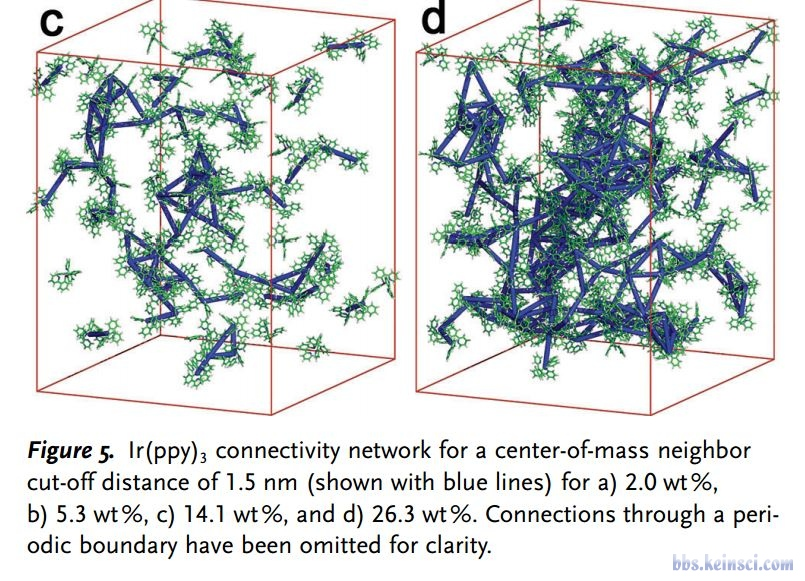
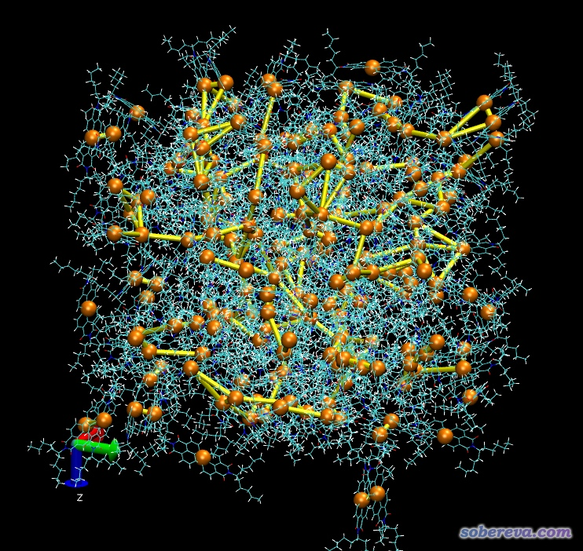

**在VMD中将距离较近的分子质心连线的脚本**

A script to link the centers of mass of molecules that are close together in VMD

文/Sobereva @[北京科音](http://www.keinsci.com/)  2018-Mar-7

  
  

在计算化学公社论坛上有人问下图这种把距离较近的分子质心连线的图怎么绘制

  
  
其实这种问题用VMD的tcl脚本非常容易实现，下面是笔者写的绘制这种图的tcl脚本，20多行就实现了。可见VMD脚本稍微会一点就能解决很大问题。  
  
draw delete all  
draw color orange  
set nres [llength [lsort -unique [[atomselect top all] get residue]]]  
for { set ires 1 } { $ires <= $nres } { incr ires } {  
set sel [atomselect top "resid $ires"]  
set COM [measure center $sel weight mass]  
set x($ires) [lindex $COM 0]  
set y($ires) [lindex $COM 1]  
set z($ires) [lindex $COM 2]  
draw sphere "$x($ires) $y($ires) $z($ires)" radius 1.5  
$sel delete  
}  
  
draw color yellow  
set crit 10  
for { set ires 1 } { $ires <= $nres } { incr ires } {  
for { set jres [expr $ires+1] } { $jres <= $nres } { incr jres } {  
set dx2 [expr ($x($ires)-$x($jres))**2]  
set dy2 [expr ($y($ires)-$y($jres))**2]  
set dz2 [expr ($z($ires)-$z($jres))**2]  
set dist [expr sqrt($dx2+$dy2+$dz2)]  
if { $dist<$crit } {  
draw cylinder "$x($ires) $y($ires) $z($ires)" "$x($jres) $y($jres) $z($jres)" radius 0.5  
}  
}  
}  
  

## 原理：

原理很简单，先得到体系中的残基数，然后把每个残基的质心存到数组里，与此同时在质心位置绘制一个圆球。  
  
之后循环每一对残基，如果质心距离小于阈值，就调用draw cylinder命令绘制圆柱将二者质心相连。  
  
  

## 用法：

先把结构文件或轨迹载入VMD，然后把上面的脚本拷到VMD文本窗口执行，就会看到图形窗口已经呈现下面的效果了（用的示例文件在此：[snapshot-1.rar](http://sobereva.com/usr/uploads/file/20180307/20180307190609_26856.rar)）。

  
  
连线阈值默认是10埃，可以通过set crit那行后面的值控制。  
  
如果不想显示圆球，就把draw sphere那行开头加上#注释掉。圆球半径通过draw sphere末尾的radius后面的参数控制，圆球颜色通过此命令上面的draw color后面的颜色名控制。  
  
圆柱半径通过draw cylinder那行末尾的radius后面的值控制，圆柱颜色通过此命令上面的draw color后面的颜色名控制。  
  
修改过脚本后，重新把脚本复制到文本窗口，就会自动删掉之前绘制的图形重新绘制一遍。如果是轨迹，当前在哪帧，就会按照哪帧的结构来绘制。
