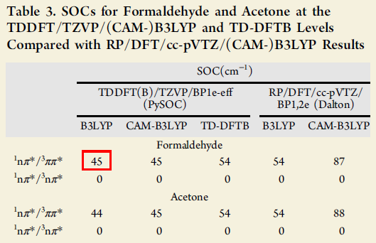
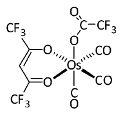
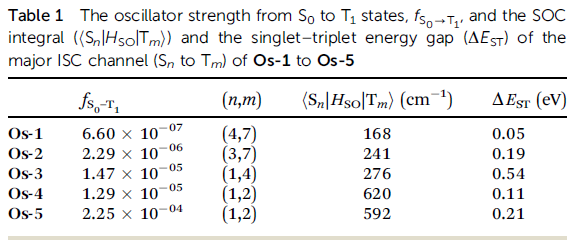

**2018-Dec-29注：**有不少人表示PySOC运行不了。只要读者使用本文的操作系统、严格按本文的操作步骤计算，至少本文的例子是绝对能运行成功的。读者应当先确保本文例子能运行正常，由此确认安装方式和自己的操作过程无误后再去跑你自己的体系。如果你当前没有本文用的系统，可以用VMware虚拟机装，半小时就能装好。 

**2019-Feb-10注**：笔者后来又写了《使用ORCA在TDDFT下计算旋轨耦合矩阵元和绘制旋轨耦合校正的UV-Vis光谱》（<http://sobereva.com/462>），用起来明显比用Gaussian+PySOC方便得多，还更快、更准确，且完全免费，因此在笔者来看PySOC没什么使用价值了，本文仅适合了解计算原理之用。读者不要再以任何形式问笔者PySOC的使用问题，笔者不予回复，笔者一律建议用ORCA算SOC矩阵元。

**使用Gaussian+PySOC在TDDFT下计算旋轨耦合矩阵元**

Using Gaussian+PySOC to calculate spin-orbit coupling matrix elements with TDDFT   
文/Sobereva @[北京科音](http://www.keinsci.com)

First release: 2018-Mar-15  Last update: 2019-Mar-30

## 0 前言

本文会简要介绍旋轨耦合矩阵元的基本知识和计算原理，然后介绍怎么使用Gaussian结合完全开源免费的PySOC程序在研究激发态最常用的TDDFT方法下计算各个单-三重态之间的旋轨耦合矩阵元。其实PySOC使用起来一点也不难，希望看过此文的Gaussian用户不会出现就为了计算旋轨耦合矩阵元而去买昂贵的ADF程序的情况。本文对于理论部分只是简要提及，便于读者能够理解计算结果和计算意义，系统的相对论量子化学知识介绍可以参看相关专著，诸如Dyall写的Introduction to Relativistic Quantum Chemistry就很好。限于篇幅和表达方式的限制，具体、细碎、系统的东西在文中不好呈现，相关内容会在北京科音(<http://www.keinsci.com>)的高级量子化学培训班里讲授。  
  
  

## 1 旋轨耦合矩阵元的基础知识

薛定谔方程是标量方程，求解得到的波函数是“一分量”的。而考虑相对论效应时与薛定谔方程对应的叫做Dirac方程，解出来的波函数用含有四个分量的spinor（旋量）表示，体现出电子与正电子、alpha与beta自旋间的耦合。由于基于Dirac方程计算实际化学体系耗时较高（但也没一些文章和书籍里说得那么离谱），为了使求解更容易进行，不同的人提出了不同方法将Dirac方程进行变换，使四分量哈密顿中的电子和正电子部分脱耦合，从而得到描述电子部分的二分量方程，此时其alpha和beta自旋还是耦合在一起的。变换成二分量的方法非常多，诸如FW(Foldy-Wouthuysen)、X2C、ZORA(Zero-order regular approximation)、DK(Douglas-Kroll)、IOTC等。这些二分量哈密顿算符可以写为非相对论部分、标量相对论部分和旋轨耦合（H_SO）这三类算符的加和。因此，旋轨耦合本质上来自于相对论效应。  
  
在不考虑相对论效应的情况下，电子波函数的空间部分和自旋部分是可以分离的。旋轨耦合体现的是电子自旋与电子轨道运动的相互作用，因此当考虑旋轨耦合算符后，电子波函数的空间和自旋部分就不能分离了。因此，当考虑旋轨耦合后，就没有诸如单重态、三重态这样的概念了。当不考虑旋轨耦合时，不同自旋多重度之间的态之间哈密顿矩阵元精确为0，换句话说就是没有相互作用。但是把旋轨耦合算符引入哈密顿之后，不同自旋多重度的态之间就可以发生相互作用，因此最终得到的本征态将是不同自旋多重度的态的线性组合。  
  
所谓旋轨耦合矩阵元，就是指<i|H_SO|j>这种积分，它体现出i、j两个电子态之间的旋轨耦合作用的大小。在能够计算旋轨耦合矩阵元的一些程序和计算了旋轨耦合矩阵元的文章中，它往往也被称为旋轨耦合常数（但注意旋轨耦合常数这个词也有其它指代）。  
  
计算旋轨耦合矩阵元有什么用？最常见的用处就是通过微扰方式计算磷光发射速率或磷光寿命。磷光发射是三重态激发态到单重态基态的跃迁，当不考虑旋轨耦合时，由于这两个态自旋部分正交，因此计算跃迁偶极矩时候结果精确为0，导致振子强度为0，故是跃迁禁阻的。而当以微扰的方式考虑旋轨耦合的时候，则单重态里面就会掺进去一定三重态成份，而三重态里面会掺进去一定单重态成份，因此再计算跃迁偶极矩的时候，由于会引入单-单重态和三-三重态的跃迁偶极矩，因此结果就不严格为0了。至于具体如何通过本文计算的旋轨耦合矩阵元计算磷光速率，笔者之后会另文介绍。此外，计算旋轨耦合矩阵元还被用于考察系间窜越速率（正比于相应两个态之间旋轨耦合矩阵元的模方），通过二阶微扰方法还可以通过旋轨耦合矩阵元计算多重态因为旋轨耦合效应导致的子态的能级分裂（这被称为ZFS，零场分裂）。  
  
计算旋轨耦合矩阵元的时候H_SO的算符定义并不唯一，取决于用什么方法把Dirac方程变换为二分量。把Dirac方程对于分子体系最完整的哈密顿形式，即Dirac-Coulomb-Breit哈密顿做FW变换得到的是Breit-Pauli (BP)哈密顿，多数程序里和文献里都是取BP哈密顿中的旋轨耦合算符H_SO来计算旋轨耦合矩阵元，常用的ORCA也是如此，这样处理比较简单。但也有其它情况，比如Dalton程序也支持用DK哈密顿的旋轨耦合算符来计算，而ADF则是基于ZORA来计算。  
  
很多程序都可以计算旋轨耦合矩阵元。大多数程序支持的是在MCSCF或多参考方法级别下计算，比如ORCA、GAMESS-US、Molpro、Molcas等。然而众所周知，这类方法不黑箱，需要使用者能够恰当定义活性空间，而且计算较耗时，用于诸如较大的配合物体系比较困难。然而，具有较强磷光发射能力的体系大多却正是含有过渡金属的配合物体系，这类体系主流的研究手段是TDDFT。因此，在TDDFT下计算旋轨耦合矩阵元这一点非常重要。可惜的是，能做到这点的程序很有限。常见的就三个，一个是贼贵的ADF，一个是虽然开源免费，但是使用门槛比ADF高得多的Dalton，还有一个是ORCA，在这方面做得很好，见《使用ORCA在TDDFT下计算旋轨耦合矩阵元和绘制旋轨耦合校正的UV-Vis光谱》（<http://sobereva.com/462>）。  
  
Gaussian在旋轨耦合计算方面是个显著软肋，只支持MCSCF下计算旋轨耦合矩阵元，而且还很不好用。好在，在J. Chem. Theory Comput., 13, 515−524 (2017)一文中，作者发布了一个名为PySOC的开源免费的小工具，可以基于Gaussian的TDDFT的输出文件在TDDFT级别下计算旋轨耦合矩阵元，解决了很多人长期发愁的一大问题，使用方法将在本文后面详细介绍。  
  
  

## 2 旋轨耦合矩阵元的一些特点

旋轨耦合矩阵元是个复数，有虚部也有实部，有些程序（如ADF）会分别输出这两部分，有的程序（如PySOC）则只给出它的模，即实部和虚部的平方和开根号。  
  
旋轨耦合算符可写为其x、y、z三个分量加和的形式，多数量化程序（如ORCA、Dalton等）会分别计算、分别输出；而有的程序（如PySOC）并不分别计算并分别输出，而是在计算的时候就合在一起了。三个分量有的对应实部有的对应虚部，程序在给出三个分量时经常将虚部用负数表示。  
  
我们最关心的一类旋轨耦合矩阵元是单重态与三重态间的，PySOC计算的也正是这种矩阵元。之所以三重态叫三重态，是因为它包含三个子态(sublevel)，自旋磁量子数分别为+1、0和-1。单重态与三重态的不同子态之间的旋轨耦合矩阵元并不相同。有的程序（如PySOC）会分别输出单重态与每个子态的旋轨耦合矩阵元，也有的程序只给出总大小，相当于单重态与每个子态旋轨耦合矩阵元的平方和开根号。  
  
由于旋轨耦合矩阵元数量级比较小，因此一般用cm^-1为单位表示，与常用单位的转换关系是：1Hartree=219474.6363cm^-1、1eV=8065.5447cm^-1。  
  
  

## 3 关于旋轨耦合积分

确定了H_SO的形式，就可以计算两个电子态之间的旋轨耦合矩阵元了。通过推导，它可以写为基函数间的旋轨耦合算符对应的积分（旋轨耦合积分）的线性组合，组合系数涉及轨道展开系数和组态系数。  
  
H_SO其中包含单电子旋轨耦合算符H_SO1和双电子旋轨耦合算符H_SO2，前者体现电子自旋与它绕着原子核的轨道运动的耦合，后者体现电子自旋与这个电子绕着其它电子的轨道运动的耦合。前者很好算，花不了什么时间，然而对于较大体系，计算后者耗时非常高，牵扯到双电子积分的导数。然而，H_SO1和H_SO2的贡献都在同一个数量级，若直接忽略后者甚至能对旋轨耦合矩阵元带来达到1/3程度的误差。为了降低双电子旋轨耦合积分的耗时，有人提出自旋轨道平均场(SOMF)的处理方法，修改了H_SO2算符的形式，使得双电子旋轨耦合以平均场的方式近似计算（类似于Hartree-Fock的思想），这使耗时大为降低，而带来的误差可忽略不计（对于不是特别重的原子来说）。这种自旋轨道平均场的做法在实际量化程序中一般是以称作Atomic-mean field integral (AMFI)的方式具体实现的，在计算时只保留SOMF的单中心项，使得耗时更低，尽管误差也会稍大一点。  
  
有效原子电荷(Zeff)方法也是非常常用的近似计算旋轨耦合积分的方法。它的思想是，由于实际研究发现H_SO1和H_SO2部分有比较好的比例关系，因此，可以修改H_SO1项，来把H_SO2的效果等效地吸入H_SO1里面。这样仅需要花费计算H_SO1项的耗时，就可以同时体现出H_SO2的效果了。Zeff这种做法是目前最便宜的考虑旋轨耦合的做法，比AMFI便宜得多，但是误差比较明显，可能能达到百分之十几、二三十甚至更多（和体系、元素、参数有关。对于很重的过渡金属误差可能较大）。Zeff的还一个很大好处是可以结合赝势使用来节约耗时，同时等效考虑标量相对论效应。比如计算一个Pt的配合物，如果用Zeff，那么可以给Pt用相对论赝势，这样即便不用相对论哈密顿，Au的标量相对论效应也考虑了，而且在此基础上通过很便宜的Zeff方式就能把旋轨耦合效应也考虑了，真是美哉！反之，用AMFI的时候不仅考虑旋轨耦合这部分相对更昂贵，对Pt还得用全电子基组（算一个的耗时顶得上算一把轻原子），而且雪上加霜的是还得用相对论哈密顿考虑标量相对论效应。可见，以Zeff方式计算旋轨耦合积分来得到旋轨耦合矩阵元，对于大体系是很理想的做法。虽说精度差一些，但对于大体系来说，一般也没必要那么较真。  
  
使用Zeff的一个关键是有效电荷。把H_SO2的效果吸入H_SO1就是通过把H_SO1里面原子核电荷改为有效电荷来实现的。有效电荷是前人拟合出来的，比如可以通过计算一批体系的零场分裂能，通过令计算值和实验值尽可能相符来得到。有效电荷的好坏直接影响Zeff方法的精度，而且，仅当要算的元素有已经拟合好的有效电荷的时候才能用Zeff方法处理。有效电荷的数值一定程度上受到当初拟合它用的计算级别的影响，但影响不至于特别大，只要自己用的基组和当初在拟合时相差不是特别大就可以用，比如当初是在6-31G*下拟合的，你结合cc-pVDZ、def2-SVP、6-311G*等使用也没问题。有些有效电荷是对于赝势基组来拟合的，你用的时候可以结合其它赝势基组用，但你用的赝势和拟合时候用的赝势所赝化的内核电子数必须相同，比如不能当初是对小核赝势基组拟合的有效电荷，你却结合大核赝势基组来用。  
  
有不同的人提出不同的有效电荷，最常用的一套是Koseki在90年代搞的一套。在JPC, 96, 10768 (1992)中对6-31G*拟合了前三周期元素有效电荷，在JPC, 99, 12764 (1995)中对SBKJC赝势拟合了一直到碘的所有主族的有效电荷，在JPCA, 102, 10430 (1998)中对SBKJC赝势拟合了所有d、ds族过渡金属的有效电荷。拟合时候都是用MCSCF做的，结合如今常用的DFT也没什么问题。SBKJC赝势如今不怎么用，它对过渡金属是小核，对主族是大核，在Gaussian里直接写SDD、lanl2所用的赝势也是这种情况，因此可以把这套有效电荷搭配常用的SDD、lanl2赝势来用。  
  
  

## 4 PySOC的特征和原理

PySOC可以在<https://github.com/jzpathfinder/pysoc>下载。程序虽然开头俩字母是py，强调程序里用了Python，但实际上大部分都是Fortran写的。此程序的主要用处是结合Gaussian计算TDDFT级别下的单重态-三重态间的旋轨耦合矩阵元，基态要求是闭壳层单重态。程序目前支持G09，笔者发现似乎没法正常处理G16的输出（网友提供了可以兼容G16的方法，见<http://bbs.keinsci.com/thread-19813-1-1.html>）。PySOC应当也可以在Windows下用，但本文都只涉及Linux的情况。  
  
PySOC实际上还支持DFTB+程序，DFTB+是用来做DFTB方法的计算的。DFTB从精度和速度上类似于半经验版的DFT，将DFTB和TDDFT弄在一起就是TD-DFTB，耗时比一般的TDDFT低得多。根据PySOC原文的测试，基于TD-DFTB得到的旋轨耦合矩阵元比起TDDFT的相差很多，并没什么卵用，所以本文也不去谈怎么把PySOC和DFTB+结合使用。  
  
PySOC的运作机制是这样的：首先用户用Gaussian09做TDDFT计算得到同等数目的单重态和三重态激发态，并保留rwf文件。然后启动PySOC.py，这个脚本就会调用Gaussian自带的rwfdump工具从rwf文件中提取各种接下来用的信息，比如组态系数、分子轨道展开系数，并且从Gaussian输出文件中提取一些信息，比如激发能、基组定义。然后PySOC自动调用附带的修改版MolSOC以Zeff方式计算旋轨耦合积分，这里MolSOC是一个可以独立运行的专门用来计算旋轨耦合积分的程序。接下来PySOC就按照其原文里的公式，将旋轨耦合积分、组态系数、分子轨道展开系数组合到一起，得到包含基态在内的各个单重态与各个三重态激发态间的旋轨耦合矩阵元。  
  
原版的PySOC和原版的MolSOC都有一些不完美的地方，于是笔者进行了修改，下文一切操作的步骤一律都是相对于这里提供的修改版来说的。笔者的PySOC+MolSOC修改版下载地址：<http://sobereva.com/soft/sob_PySOC_MolSOC.zip>  
  
笔者的修改版相对于原版在功能上主要有以下改变：  
1 把SOC矩阵元输出文件的态的序号输出格式改为了两位（原版只留了一个字符的位置，因此态数如果是两位数就会被显示为星号，不便考察）  
2 PySOC默认会计算激发态之间的跃迁偶极矩，但是这没什么用，而且笔者发现虽然对于TDA计算得到的跃迁偶极矩是正确的，但是对于TD计算，得到的跃迁偶极矩并不合理。于是笔者删除了计算这个的功能，PySOC计算大体系的总耗时由此可降低约40%。PS：如果真需要计算激发态间的跃迁偶极矩，可以用Multiwfn，结果可靠，速度也快。见《利用Multiwfn计算Gaussian输出的激发态之间的跃迁偶极矩》（<http://sobereva.com/227>）。  
3 修改了MolSOC里定义有效电荷的sozeff.f文件。此程序自带的有效电荷是其作者自己拟合的前五周期主族的（用B3LYP结合DZVP全电子基组下拟合，见JCC,30,832 (2009)），以及极个别其它零碎的元素。显然只有这些有效电荷根本不够用，结合赝势算配合物都不行。笔者遂把上面提到的所有Koseki拟合的有效电荷都补充进去了。  
  
  

## 5 PySOC的安装、配置

用PySOC最好系统别太老，否则一方面系统自带的Python版本太老会导致PySOC的Python脚本无法正常运行（要求Python版本>=2.7，可以用python --version命令查看本机python版本），另一方面由于PySOC和MolSOC预编译版是在较新的系统下编译的，在老系统上运行会因为找不到较新的glibc库而出错。笔者建议用CentOS/RHEL >7.0版。如果是较老的系统，也可以升级Python，并且自己编译PySOC和MolSOC。  
**注**：很多本文的读者反映PySOC没运行成功，很大一部分是因为用的Python版本问题不合适所致的。笔者这里用的CentOS 7.2自带的Python是2.7.5版。如果你运行不成功，尝试用这个或相近版本的Python。  
  
首先将修改版的PySOC+MolSOC解压，比如PySOC解压后的目录为/sob/pysoc，MolSOC解压后的目录为/sob/molsoc_modified。分别进入这两个目录，都运行chmod +x * -R命令，使这俩目录和子目录下的所有文件都有可执行权限。  
  
把pysoc/bin/pysoc.py里的scrip_soc变量改为实际的PySOC可执行文件路径，比如scrip_soc = '/sob/pysoc/bin'。对于当前情况，/sob/pysoc/bin目录里面会看到有个soc_td，这正是笔者编译出来的PySOC中由Fortran写的代码对应的可执行文件。  
  
修改/sob/pysoc/input_template/init.py，把脚本里的g09root改为g09所在目录（和安装Gaussian时的g09root环境变量指向的路径一致），把molsoc_path改为实际的修改版molsoc的路径，比如molsoc_path = '/sob/molsoc_modified/molsoc0.1/bin/molsoc0.1.exe'。  
  
修改用户目录下的.bashrc文件，添加export PATH=$PATH:/sob/pysoc/bin/。之后重新进入终端，就可以在任意目录下直接输入pysoc.py来调用这个运算脚本了。  
  
进入/sob/molsoc_modified/molsoc0.1/bin目录，会看到有三个可执行文件，对应不同有效电荷的情况，你当前的计算适合哪种情况，就把哪个可执行文件改名为molsoc0.1.exe。这三个文件对应的情况为：  
molsoc0.1_1.exe：保留了作者自己对前五周期主族拟合的有效电荷（用于全电子计算，对DZVP拟合），加入了Koseki对d、ds族金属结合SBKJC小核赝势拟合的有效电荷  
molsoc0.1_2.exe：保留了作者自己对前三周期拟合的有效电荷，对第四、五周期主族改为了Koseki对SBKJC大核赝势拟合的有效电荷，加入了对d、ds金属koseki对小核SBKJC赝势拟合的有效电荷。  
molsoc0.1_3.exe：把前三周期元素改为了Koseki对6-31G*拟合的有效电荷，对第四、五周期主族改为了Koseki对SBKJC大核赝势拟合的有效电荷，加入了对d、ds金属koseki对小核SBKJC赝势拟合的有效电荷。  
一般来说，推荐用molsoc0.1_3.exe，对应于前三周期都用全电子基组，而对之后的元素用SDD、lanl2等赝势的情况，这是最常见的情形。  
  
再次提醒，使用PySOC在用赝势的时候，赝化的电子数一定要和SBKJC对应，缺乏基础知识的话仔细看《赝势的函数形式以及在量子化学程序中定义的方式》（<http://sobereva.com/188>）、《谈谈赝势基组的选用》（<http://sobereva.com/373>）、《在赝势下做波函数分析的一些说明》（<http://sobereva.com/156>）。比如你把molsoc0.1_3.exe改名为了molsoc0.1.exe以令PySOC能够调用它，若你要计算个含碘的体系，那对碘就不能用def2系列或者cc-pVnZ-PP系列了，因为它们对主族是小核，而Koseki拟合有效电荷时用的SBKJC对主族是大核。  
  
如果你想自己编译PySOC也可以，最好用ifort编译器。在/sob/pysoc/src目录下，修改Makefile里的编译器和库的目录，然后直接运行make，就会产生soc_td，将之挪到/sob/pysoc/bin目录下就可以用了。  
  
如果要自己编译MolSOC，就进入/sob/molsoc_modified/molsoc0.1/source源代码目录，里面会看到有sozeff_1.f、sozeff_2.f、sozeff_3.f三个文件，它们是用来设定有效电荷的，分别对应于上述molsoc0.1_1.exe、molsoc0.1_2.exe、molsoc0.1_3.exe的情况，打算用哪套有效电荷组合就把哪个.f文件改名为sozeff.f。之后运行make来编译，默认会调用ifort编译，并产生可执行文件/sob/molsoc_modified/molsoc0.1/source/molsoc0.1.exe。  
  
  

## 6 PySOC的使用

用PySOC计算旋轨耦合矩阵元之前需先自行用Gaussian09运行TD(50-50,nstates=x)任务计算单重态和三重态各x个，x设多大up to you。由于程序只能处理笛卡尔型基函数，因此必须写上6d 10f关键词。虽然程序手册里没明确强制要求，但实际发现nosymm也得写，否则PySOC貌似没法正常解析输出文件。另外还得写GFInput让Gaussian把基组定义输出出来。输出文件名字必须为gaussian.log，并且必须保留下来rwf文件，名字为gaussian.rwf。以下是输入文件开头部分的例子：  
%rwf=gaussian.rwf  
# td(50-50,nstates=5) wB97X/TZVP 6D 10F nosymm GFInput  
  
注：PySOC对态数、泛函没有任何限制，但是由于MolSOC只支持角动量<=f的基函数的旋轨耦合积分的计算，因此用的基组不能包含f以上角动量基函数（由于高角动量函数对于TDDFT计算以及旋轨耦合矩阵元的影响很小，这个要求无关大碍）。  
  
G09算完后，确保gaussian.rwf和gaussian.log都在当前目录了，将init.py从/sob/pysoc/input_template里拷到当前目录下，然后用文本编辑器打开它。Gaussian做TD(50-50)计算时nstates设了几，就把此文件里n_s =和n_t =后面的序列从1一直写到多少。比如nstates设了5，init.py里就要设n_s = [1, 2, 3, 4, 5]和n_t = [1, 2, 3, 4, 5]。有的时候我们可能要算几十个态，手动从1写到最后相当麻烦，为了方便大家使用，我把从1到100的序号附到这个文件里了，并在开头加了#来注释掉。比如算了40个态，想计算S0~S40与T1~T40之间的旋轨耦合矩阵元，那就把从1到40的序号复制到n_s和n_t后面的方框里就行了。  
  
最后，运行pysoc.py即可，程序就会根据当前目录下init.py的信息利用gaussian.rwf和gaussian.log文件进行运算了，屏幕上输出的都是一堆烂七八糟对用户没什么用的debug信息。PySOC的计算耗时和体系大小、计算的态数都有关系，小体系一两分钟就能算完，而大体系、上百个态的情况甚至需要算半个小时乃至更多。可惜PySOC没有被并行化，没法利用多核的优势。算的态数很多的时候，建议以诸如pysoc.py > pysoc.out方式运行来把输出信息重定向到某个文件里，要不然可能由于屏幕上输出信息量太大导致拖慢计算。  
  
算完后当前目录下会看到一大堆文件，有的是PySOC调用rwfdump导出的数据，有的是MolSOC程序的输入输出文件，有的是PySOC运行产生的一些中间信息。其中soc_out.dat是最重要的输出文件，这就是各个态之间的旋轨耦合矩阵元。这是其中一条输出：  
sum_soc, <S0|Hso|T1,1,0,‐1> (cm‐1): 115.94270 81.98387 0.01644 81.98387  
代表S0和T1之间总SOC是115.94 cm-1，它由这行后面的<S0|Hso|T1_Ms=1>、<S0|Hso|T1_Ms=0>、<S0|Hso|T1_Ms=-1>三个值求平方和开根号得到，这里Ms指T1子态的自旋磁量子数。另外当前目录下还会产生ene_out.dat，这里面是各个态的激发能。  
  
下面我们通过两个实例演示怎么使用PySOC。本文所有Gaussian计算用的都是G09 E.01 Linux版，系统是CentOS 7.3。计算前读者应当根据本文第5节的方式把PySOC运行环境进行了恰当配置、恰当修改了相关的.py文件。下面例子用的有效电荷对应的是上文提到的molsoc0.1_3.exe的情况（即用户已经把此文件改名为了molsoc0.1.exe）。更老的G09版本笔者未经测试，建议不要用老于D.01版的，尤其是早期G09程序的TD(50-50)选项有bug，PySOC肯定运行不正常。  
  
  

## 7 实例1：计算H2CO的单-三重态间的旋轨耦合矩阵元

本例我们考察一个很简单的体系，甲醛。在PySOC原文的表3中，给出了这个体系的计算结果，如下所示  

这里我们要重现红框中的值。通过查看甲醛的分子轨道和电子跃迁信息，可以知道红框中的值对应的是<S1|H_SO|T2>。从表中的数据也可以看到，在B3LYP下，PySOC基于Zeff的结果（45cm-1），和更严格的在Dalton中通过直接计算单、双电子旋轨耦合积分得到的结果（54cm-1）还是比较相符的。虽然误差不能说非常小，但从实用性角度来说，准确度也够了。（注：PySOC原文11式是错的，文中给出的旋轨耦合矩阵元并没有乘以系数1/3）  
  
首先我们在PBE0/TZVP级别下优化甲醛分子，输入文件如下。  
# PBE1PBE/TZVP opt  
  
test  
  
0 1  
 C                  0.00000000    0.00000000   -0.56221066  
 H                  0.00000000   -0.92444767   -1.10110537  
 H                 -0.00000000    0.92444767   -1.10110537  
 O                  0.00000000    0.00000000    0.69618930  
  
然后把优化好的结构保存成新的Gaussian输入文件，内容如下，所用计算级别和原文表3一致。虽然我们只需要考察S1和T2，但正如《Gaussian中用TDDFT计算激发态和吸收、荧光、磷光光谱的方法》（<http://sobereva.com/314）>中所提到的，算的态数不应当正好卡着要研究的态。如果感兴趣的是第i态，那么计算到i+3态一般是比较稳妥的，因此本例我们总共计算5个单重态和5个三重态。  
%rwf=gaussian.rwf  
# td(50-50,nstates=5) B3LYP/TZVP 6D 10F nosymm GFInput  
  
test  
  
0 1  
 C                  0.00000000    0.00000000   -0.52513500  
 H                  0.00000000    0.93987900   -1.11261300  
 H                  0.00000000   -0.93987900   -1.11261300  
 O                  0.00000000    0.00000000    0.67200400  
  
运行g09 < H2CO.gjf > gaussian.log，算完后当前目录下就有了gaussian.log和gaussian.rwf。然后把/sob/pysoc/input_template/init.py文件拷到当前目录，用文本编辑器打开它，确认n_s和n_t都被设为了[1, 2, 3, 4, 5]。然后，直接输入pysoc.py命令来运行之，由于体系很小而且考虑的态数也很少，眨眼间就算完了。屏幕上最后会提示有报错“forrtl: severe (153): allocatable array or pointer is not allocated”，这没有关系，这是因为笔者的修改版把PySOC计算跃迁偶极矩的部分给去掉了所致，这不影响旋轨耦合矩阵元的输出。  
  
打开当前目录下产生的soc_out.dat，从中会看到这行  
sum_soc, <S 1|Hso|T 2,1,0,-1> (cm-1):        49.81285        0.00000       49.81285        0.00000  
即其中第一个数字49.81285 cm-1就是总的<S1|H_SO|T2>矩阵元。这个值和文献中的45 cm-1略有偏差，原因是原文计算时候并没有修改MolSOC里默认的有效电荷，即用的是MolSOC作者自己搞的有效电荷，而我们现在用的则是Koseki拟合的有效电荷。可见有效电荷的不同，对于结果是会产生一定影响的，但影响不至于很大。倘若我们运行pysoc.py之前是把molsoc0.1_1.exe改名为了molsoc0.1.exe，即计算H,C,O元素的时候用MolSOC作者自己搞的有效电荷，结果将为44.73483 cm-1，和PySOC原文里的精确一致。  
  
  

## 8 实例2：计算Os配合物的单-三重态间的旋轨耦合矩阵元

有较强发磷光能力的分子一般都是含有靠后周期的d金属的配合物，因为这样的金属会引入显著的旋轨耦合效应，这类配合物体系是需要考察单-三重态旋轨耦合的主要场合之一。Gaussian+PySOC以Zeff方式计算这类体系是否靠谱？我们这里重现一下Phys. Chem. Chem. Phys., 16, 26184 (2014)文章里的旋轨耦合数据。此文研究了一系列含有Os、Au、Cu、Ag的配合物，通过Gaussian在B3LYP/6-31G*结合lanl2DZ做了几何优化，然后使用ADF在B3LYP结合TZP全电子基组并考虑ZORA标量相对论效应下算了最低10个单重态和三重态，之后计算了激发态间的旋轨耦合矩阵元。计算时候都以PCM模型考虑了二氯甲烷的溶剂效应。此文考察了不少体系，为了节约时间，我们就考察其中比较小的Os-4，结构如下  

  
本节例子涉及的文件都可以在此下载：[Os-4.rar](http://sobereva.com/usr/uploads/file/20180315/20180315050059_53921.rar)  
  
首先我们用gview等程序构建Os-4结构，保存输入文件，优化此体系同时做振动分析确认无虚频。我们用的计算级别和原文一致，输入文件如下（其实Os用SDD会更好，参见《谈谈赝势基组的选用》<http://sobereva.com/373>）  
# B3LYP/genecp opt freq scrf(solvent=CH2Cl2)  
[...略]  
  
C O F H  
6-31G*  
****  
Os  
lanl2DZ  
****  
  
Os  
lanl2DZ  
  
  
将优化后的结构保存成新的输入文件，做电子激发计算。我们用的泛函和原文一样也是B3LYP，也是算最低10个单重态和三重态。原文用的是ADF，这程序很非主流，其基组都是基于Slater函数的，因此文中用的TZP基组在Gaussian这样的基于高斯函数的程序中没有严格对应的。我们这里就用基于高斯函数的3-zeta基组中质量上乘的def2-TZVP来做计算（这对于当前计算来说其实有点浪费了），整体和TZP能达到同一个档次。由于def2-TZVP对Os是小核赝势基组，笔者的修改版MolSOC里又加入了Koseki对所有d族对小核赝势拟合的有效电荷，因此此时正好可以用PySOC来计算（如果在Gaussian里用更昂贵、更准确的DKH2标量相对论方法结合全电子基组来做此体系的TDDFT计算，PySOC则没法用，因为没有对MolSOC添加对过渡金属全电子基组拟合的有效电荷）。  
  
Os-4的电子激发计算输入文件如下（Os-4_TD.gjf）  
%rwf=gaussian.rwf  
# b3lyp/def2TZVP scrf(solvent=CH2Cl2) TD(nstates=10,50-50) 6d 10f nosymm gfinput  
[...略]  
  
然后运行g09 < Os-4_TD.gjf > gaussian.log。由于用的基组较大，因此耗时还是不短的。算完后把init.py拷到当前目录，把其中的n_s和n_t后面都改为[  1,  2,  3,  4,  5,  6,  7,  8,  9, 10]，然后运行pysoc.py > pysoc.out，过一会儿就算完了。  
  
文献中在表1中给出了各个Os配合物发生主要系间窜越的两个态之间的旋轨耦合矩阵元，对Os-4给出的是<S1|H_SO|T2>，数值为620 cm-1，在S0结构下它们的能级差（即垂直S1-T2能级差ΔE_ST）为0.11eV。  

  
我们看看我们算的。打开ene_out.dat，会看到S1和T2能量分别为3.9079eV和3.9945eV，能级差为0.09eV，和文献给出的值之间的绝对差异很小。然后打开soc_out.dat，会看到  
sum_soc, <S 1|Hso|T 2,1,0,-1> (cm-1):       593.44440      419.62830        0.69267      419.62830  
即我们算出来的<S1|H_SO|T2>为593cm-1，和文献给出的620cm-1之间的相对误差才不到5%。虽然相符这么好不免有些巧合，但至少也足够说明我们用的赝势+Zeff的廉价考虑标量相对论效应和旋轨耦合效应的组合对于配合物是可靠的。  
  
笔者在更廉价的基组上也做了计算测试，配体用6-311G*，Os用SDD，这个档次对此体系耗时仅为def2-TZVP时的1/4，算出来的<S1|H_SO|T2>为539.9cm-1，ΔE_ST=0.093eV。可见单-三重态能级差用6-311G*结合SDD已经足够算准，旋轨耦合矩阵元对基组更敏感点，但当前级别至少也足够给出定性合理的结果。  
  
  

## 9 总结

Gaussian+PySOC这种组合可以很容易地计算TDDFT级别下的旋轨耦合矩阵元，虽然PySOC计算本身也花时间，但耗时比TDDFT过程低一个数量级，即曰只要TDDFT算得动，单-三重态旋轨耦合矩阵元就可以轻易获得。虽然PySOC的结果基于比较糙的Zeff方法，但精度对于考察包括过渡金属配合物在内的较大体系来说够用了。

如果你不是非得用Gaussian不可，那么相对于本文的做法，用ORCA是好得多的选择，更快、更方便还更准确，看《使用ORCA在TDDFT下计算旋轨耦合矩阵元和绘制旋轨耦合校正的UV-Vis光谱》（<http://sobereva.com/462>）。

免费的Dalton也可以算TDDFT下的单-三重态旋轨耦合矩阵元，但门槛稍高，而且算激发态间的旋轨耦合矩阵元耗时远高于用Gaussian+PySOC或ORCA。
