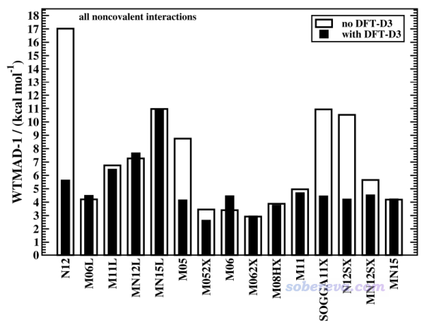
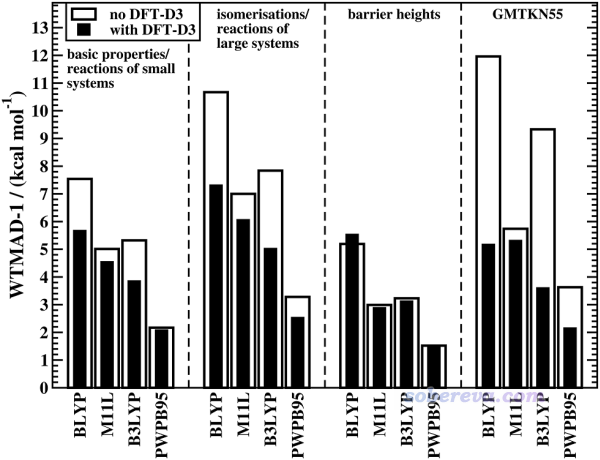

**谈谈“计算时是否需要加DFT-D3色散校正？”**

Is it necessary to add DFT-D3 dispersion correction when calculating?

文/Sobereva @[北京科音](http://www.keinsci.com)

First release: 2018-Apr-21  Last update: 2022-May-29

## 0 前言

笔者经常被问及的一个问题就是“我要计算xxx，是否需要加DFT-D色散校正？”。关于DFT-D，在以下博文里已经有充分的介绍：  
乱谈DFT-D  
<http://sobereva.com/83>  
DFT-D色散校正的使用  
<http://sobereva.com/210>  
大体系弱相互作用计算的解决之道  
<http://sobereva.com/214>  
其实把以上博文所述内容都弄明白，什么时候该加DFT-D色散校正就已经应该心里很有数了。但是鉴于还是有大量初学者犯糊涂，我觉得有必要在此文里再强调一下，也算是对上面文章的补充。下文第一节是介绍一些常识，如果想对什么时候该加DFT-D这个问题了解更深刻可以看看，如果只是急于获得答案，可以略过。

## 1 化学体系中的相互作用常识

在“量子化学波函数分析与Multiwfn程序培训班”（<http://www.keinsci.com/workshop/WFN_content.html>）中笔者对化学体系中的相互作用本质有极其全面详细的介绍，推荐希望深入了解的人参加，这一节仅非常简要谈一下相关信息，便于读者能理解后文的内容。化学体系中的相互作用主要分为化学键作用和弱相互作用两大类。从相互作用能上看，前者一般强度比较强，共价键和离子键都属于此类，也可以叫强相互作用；而后者一般强度比较弱，比前者通常弱一个数量级。弱相互作用既可以是分子间的，也可以是分子内的。弱相互包括范德华作用、pi-pi堆积作用、氢键、二氢键、卤键，以及后来很多人炒作概念而提出来的碳/硫/磷/金/银/铜...键等等。还有个词叫做非共价相互作用（noncovalent interaction），这个词的范畴相当于弱相互作用和离子键的并集。

弱相互作用如上所列，形式多样，但主要本质只有两个：  
(1)静电相互作用。可以起到互斥作用也可以起到吸引作用，看具体情况（体系，以及相对位置）。这里说的静电相互作用也把极化作用包含进去了。  
(2)色散作用。它起到吸引作用。必须从量子力学角度才能予以解释。而从量化理论角度来讲，它对应于电子的长程的库仑相关作用。  
一般强度的氢/二氢/卤/硫/磷键等等是以静电吸引主导，色散作用为辅构成的，这点通过能量分解也可以体现出来。而一般说的范德华相互作用，以及pi-pi堆积作用的本质都是色散作用。  
注1：还有个作用叫交换互斥，它起到互斥作用，不管算什么类型相互作用都要考虑这个，只有在较近距离（比如小于两个原子的范德华半径和）的时候才开始凸显出来，且原子间距离越近此作用越大。正是这个作用使得弱相互作用的势能曲线总是有极小点，而不会令原子间距离因为静电吸引和色散作用而无限减小。  
注2：“范德华作用”这个词描述的是电中性的两个原子之间的非共价相互作用，故本质包含了交换互斥和色散吸引作用两个部分。这个词可以囊括比如两个氩原子间的相互作用的全部内涵。这个词也可以用来描述无极性分子间的全部相互作用（但实际上，没有绝对严格意义的无极性分子，比如就连一般说的无极性分子氮气也有四极矩，可以认为是局部极性，因此氮气之间也有静电相互作用，讨论见<http://sobereva.com/209>。但本文就不咬文嚼字了）。至于一些初级的教材里说的范德华作用包括“诱导力、色散力、取向力”，这种歪曲的说法应该彻底从量化研究者的脑海中删除。  
注3：弱相互作用实际上也伴随着一些共价作用，但共价作用此时仅仅是个“陪衬”而已，对弱相互作用能贡献程度极小，故在弱相互作用范畴里不需要专门特意考虑（但是弱相互作用范畴里面也有强度很大的情况，比如能到100kJ/mol数量级的氢键，此时共价作用就不能忽视了，此文说的弱相互作用不考虑此情况）。  
注4：笔者强烈建议仔细看一下此文和其中提到的原文，对于正确认识氢键的作用本质极有益处：《透彻认识氢键本质、简单可靠地估计氢键强度：一篇2019年JCC上的重要研究文章介绍》（<http://sobereva.com/513>）。  
注5：对pi-pi作用感兴趣者，强烈建议阅读我写的对于这种作用特别详细的介绍和讨论《谈谈pi-pi相互作用》（<http://sobereva.com/737>）

不管是什么DFT泛函，什么理论方法，对上面提到的静电相互作用和交换互斥作用总是可以至少定性正确地表现。然而老一代泛函对于色散作用描述极糟（如SVWN、PBE、PW91），或者根本不能描述（如BLYP、B3LYP），因此这些泛函完全没法描述范德华结合、pi-pi堆积这样本质来自于色散吸引的弱相互作用，结果会定性错误；而考察氢键等静电主导的弱相互作用时，虽然多数情况定性正确，但肯定定量明显不准。这些泛函有这些问题一方面是拟合参数的时候没有考虑弱相互作用体系，一方面是泛函的相关势的长程渐进行为明显不对。

为什么Grimme要提出DFT-D？出发点就是解决老一代泛函计算弱相互作用糟糕的情况。更确切来说，解决的是对色散作用描述糟糕的问题。因此，DFT-D叫做色散校正。但要注意，色散校正，或者解决传统泛函描述色散作用烂的方法绝对不止DFT-D这一种，还有很多其它做法，比如vdW-DF、XDM、TS、LRD、DFT-ulg、dDSC、OBS等等，由于这些方法要么实现复杂、要么会导致计算耗时增加许多、要么效果不好、要么还没有被主流程序普遍支持等原因，时下流行程度和DFT-D相比微不足道，以至于DFT-D简直成了色散校正的代名词。

DFT泛函不加色散校正就不能描述好弱相互作用了？非也。由于弱相互作用越来越受重视，从21世纪00年代中期开始提出的泛函越来越多地注重对弱相互作用的描述。比如2006年的M05-2X描述各种弱相互作用就已经挺不错了，因为在拟合参数的训练集中已经纳入了弱相互作用体系，之后08年的M06-2X在这方面又得到了一定进步。而比如08年提出的ωB97XD，在提出当初就已经带了DFT-D2校正以使得计算各类弱相互作用能够有比较好的能力。至于从2006年开始提出的双杂化泛函，由于里面已经包含了MP2成份，而MP2本身就已经能够定性正确描述色散作用，因此双杂化泛函对各类弱相互作用都有比较好的描述能力，哪怕其中有的不及M06-2X，但也总比较老一代的泛函要强得多得多。

DFT-D第一代是2004年提出的，2017年提出了第四代（DFT-D4）。截止到2019年初，最流行的还是2010年提出的DFT-D3，它纯粹基于几何结构来计算色散校正能，加到原有泛函的能量上就是色散校正后的能量，比如加到B3LYP能量上就成了B3LYP-D3能量。更多信息见前面提到的《DFT-D色散校正的使用》和《乱谈DFT-D》，这里不再累述。DFT-D1/2/3都只利用几何信息而不考虑体系电子结构，计算都很迅速，几乎不增加任何计算量，故是“免费”的。而到了DFT-D4，校正能才考虑电子结构（依赖于原子电荷），带来的好处就是可以合理体现电子结构对色散校正的影响（比如同一个结构下，激发态和基态是不同的，单重态和三重态是不同的，中性和离子状态是不同的...特别是对于计算诸如金属氧化物等原子电荷数值较大的情况，由于考虑了实际电子结构，结果会比用DFT-D3更好）。关于DFT-D4，笔者写过专门的文章介绍：《DFT-D4色散校正的简介与使用》（<http://sobereva.com/464>）。

对于该不该、有无必要加DFT-D3这个问题，下面对计算弱相互作用的情况和计算其它任务的情况分别说。

## 2 计算弱相互作用的情况加不加DFT-D3？

这里说的计算弱相互作用，显然包括计算分子间相互作用能、优化分子二聚体/多聚体几何结构（以及随后的振动分析）、研究物理吸附等场合。对于很多柔性大分子，存在显著的分子内相互作用，因此弱相互作用对其不同构象间的相对能量、构象结构影响极大，故研究它们的构象问题也属于下述的“计算弱相互作用”的范畴里。是否存在明显分子内/分子间相互作用其实一看结构心里就有数，只要非键连的原子之间距离挨得较近，就应当考虑弱相互作用。如果化学直觉不够而不好判断，可以用Multiwfn做IGM分析，见《通过独立梯度模型(IGM)考察分子间弱相互作用》（<http://sobereva.com/407>）；或者做RDG/NCI分析，见《使用Multiwfn图形化研究弱相互作用》（<http://sobereva.com/68>），操作都十分简单，敲几下键盘的事。

当你研究的问题涉及到弱相互作用，而且当前用的理论方法不足以合理描述色散作用，色散校正是一定要加的！鉴于DFT-D3是免费的而且是最流行的色散校正方法，我们一般首选加DFT-D3。比如说B3LYP描述色散作用完全失败，当拿它计算pi-pi堆积这种完全由色散作用所控制的弱相互作用时，不加色散校正结果是荒唐的。而用B3LYP计算氢键这种静电主导而色散作用为辅的弱相互作用时，加色散校正后的结果也才可能用来发文章（可能有人看到这句话会突然跳出来说：我看那谁谁谁，还挺有名的，以前用B3LYP算氢键不是也发文章了？要知道，弱相互作用的计算在最近十几年发展极其迅速，05年之前DFT算弱相互作用的文章完全没法看，05~10年的文章也只能有选择性地参考，10年之后的DFT算弱相互作用的文章才算是进入成熟期。研究者们对DFT做弱相互作用计算的认识在这期间也发生了翻天覆地的变化。除非碰上外行审稿人或者投极烂的期刊，这年头用B3LYP算弱相互作用能发表才怪。）

当研究弱相互作用相关的问题时，如果目前用的DFT泛函已经可以不错地描述色散作用了，比如用的是M06-2X，那显然DFT-D3不是必须加的，加了不会有什么坏处，但带来的改进甚微。如果用的是双杂化泛函，由于对色散作用也已经描述不错了，因此不加D3算各种弱相互作用的精度也不赖，至少不至于因不加D3而被审稿人拒，但考虑到从统计结果来看，加了D3后精度改进还是有不少油水的，所以建议总是加上。很多后来提出的双杂化泛函，比如PWPB95、DSD-PBEP86，由于在提出时就已经带着D3了，所以用的时候更是强烈建议带着D3（值得一提的是，Gaussian16里写DSD-PBEP86关键词的时候自动就是带DFT-D3的）。

以下给出Grimme在Phys. Chem. Chem. Phys., 19, 32184 (2017)中列出的几个泛函的弱相互作用平均计算误差，D3用的是BJ阻尼：  
BLYP：18.56 kcal/mol  
BLYP-D3：3.70 kcal/mol  
B3LYP：15.43 kcal/mol  
B3LYP-D3：2.94 kcal/mol  
PWPB95：5.74 kcal/mol  
PWPB95-D3：2.27 kcal/mol  
可见，BLYP、B3LYP加D3后改进甚大，不加D3误差大到根本没法用。PWPB95双杂化泛函加了D3之后也有很大改进。

下面是不同明尼苏达系列泛函加D3前后的平均误差情况。明尼苏达系列泛函只能用零阻尼形式的D3校正。

可见，对于计算弱相互作用常用的M06-2X，加D3的意义不大，改进甚微。仅对于M06-2X计算pi-pi堆积，我建议还是尽量加上D3，因为对这种情况M06-2X有时误差可能略大，加D3后有不可忽略的改进。并非所有明尼苏达系列泛函算弱相互作用都不错，有的实在是非常糟糕，而且加D3都救不活，比如MN15L这种。关于某些明尼苏达系列泛函加D3校正后结果仍较烂原因的一些细致的探讨，可以看J. Phys. Chem. Lett., 6, 3891 (2015)。

对于后HF、多参考方法等等，是没有色散校正这一说的。DFT-D仅能用于DFT、DFTB、HF、半经验。高档次后HF方法，比如MP4、CCSD(T)，已经可以很准确计算各类弱相互作用体系了，也没什么系统性误差，且误差已明显小于DFT泛函结合DFT-D校正后的误差了，显然对这些精细的方法再试图通过相对来说形式较为粗俗的DFT-D来校正是没有任何意义的，因此也没人对这些方法去拟合DFT-D参数。而至于MP2，由于耗时和双杂化差不多，而算弱相互作用精度又不及双杂化（氢键除外），因此也没人专给它搞DFT-D参数。  
（后记：2018年有人提出了给MP2加DFT-D3的方法，叫MP2D。虽然比MP2在计算色散作用上有明显改进，但相比于带色散校正的双杂化泛函在精度上完全没有优势，所以完全没存在意义。2022年有有人给SCS-MP2加上DFT-D3，叫SCS-MP2D，也同样没有什么实际价值）

有人问：“我用xxx泛函，我知道计算弱相互作用能的时候有必要加D3，那优化和振动分析有没有必要？”显然有必要！D3校正能是依赖于几何结构的，因此，D3校正本质上校正的是体系的势能面，会令所有依赖于势能面的问题都受到影响，自然也包括优化出的结构（势能面极小点的位置）、振动频率（取决于势能面极小点处Hessian矩阵）、IRC（质权坐标下的势能面上的能量极小路径）等。你算能量时候用D3，就代表你已经知道考虑D3校正对于研究当前体系是有意义的，如果几何优化等任务不加D3，怎么说得通？必然会糟至审稿人吐槽，何况D3还是免费的。所以，优化、振动分析、单点、IRC等等，要加D3都加，如果确信没必要加，那就都不加。

另外，如果你研究的是一系列体系，用的是同一个泛函，只要其中一个加了D3，其它所有的计算全都得加D3，否则没法横向比较。如果涉及到能量直接求差的情况，比如复合物能量减去各个片段能量、一个构象减去另一个构象的能量，那所有涉及的体系加不加D3就更得统一，否则能量求差毫无意义。

可能有时候研究的问题并不直接牵扯弱相互作用，但是体系内又存在弱相互作用，这时候如果你用的泛函描述色散能力不足，那照样也得加D3。比如说研究某个大分子的局部异构化过程，这个过程本身不怎么涉及到弱相互作用特征的变化，但大分子其余部分存在分子内弱相互作用（比如有一些内氢键），对这种情况，你若是用M06-2X算的则D3可加可不加，但用B3LYP算就应当加D3。或许你不觉得对此问题加D3有什么必要，但毕竟加D3又不花钱又基本没坏处，还省得之后审稿人找碴又让你加D3重算，何故不加？而且还完全排除了不考虑色散作用会对结果产生不可忽略的误差的风险。

## 3 与弱相互作用无关的情况加不加DFT-D3？

因为D3校正仅仅是基于几何结构计算校正能，与电子态无关，而且只改变能量而不影响体系的波函数，因此对这些问题，加不加D3结果都一样：计算某个结构下的gap、轨道、偶极矩、极化率、NMR、原子电荷、键级、静电势分布等等。因为这些问题不涉及体系的能量或者能量对核坐标的导数。D3也不会影响这些问题的计算结果：垂直激发能、理论电子光谱（不考虑振动耦合时）、垂直电离能、垂直电子亲合能、垂直单-三重态能量差等等，因为计算不同电子态时用的几何结构相同，把D3校正能精确抵消了。但是，D3可以间接地对上述问题产生影响。比如一个二聚体，用B3LYP和B3LYP-D3优化出来的结构可能相差很大，那显然最终计算的偶极矩、吸收光谱等性质也会有明显不同。

诸如有人问过我，计算激发态用不用加D3，那显然得看你算激发态的什么。算垂直吸收/发射能和振子强度、计算激发态与基态的密度差、计算NTO等等，前面说了，D3丝毫不可能影响结果，因为结构没变，而且D3不影响波函数。而对于激发态几何优化，D3显然会影响结果，而且如果优化基态时加了D3则优化激发态也得加，得保持统一。

对于主要只体现化学键作用的体系，加D3是没必要的，虽然加了也没坏处。诸如优化有机小分子、简单配合物（如二茂铁）、简单阴阳离子体系（比如乙酸钠、硫酸钙）等等，加D3基本不会对结果产生任何影响。一方面是D3里面有阻尼函数，阻尼函数会使得校正函数在近程区域衰减为0，从而避免影响原先DFT泛函就已经能描述良好的范畴，另一方面是对于这些较强的相互作用，微小的色散作用的影响本身就是可以忽略的。但如果是有机大分子、配体比较大的配合物（此时配体间容易有弱相互作用）、比较大的阴阳离子对等等情况，弱相互作用的存在不可忽略，当使用对色散作用描述烂的泛函的时候建议加上D3。

对于计算小体系化学反应能（也包括原子化能、生成焓等），没有太大必要加D3，但是如果体系比较大，对于描述色散作用能力不足的泛函还是建议加上D3。毕竟体系原子数一多，体系内弱相互作用总量就会较大，更严谨地来说，体系中的中、长程电子相关总效应会较大。D3虽然原本目的是校正色散作用的描述能力，但实际上也等效地一定程度改进了很多老泛函在中、长程区域对电子相关描述能力的不足。

下面的图来自Phys. Chem. Chem. Phys., 19, 32184 (2017)，可见D3对于反应能的计算精度是有一定改进的，而且对大体系改进得比小体系更多。

但加D3后结果变差也不是不可能，要想找反例总能找得到。比如JCTC, 13, 3537 (2017)报道PBE0-D3算生成焓比PBE0精度有所下降。不过，相对于一些负面消息，更多的文献测试还是体现出D3会带来积极的效果。

从上图看D3对能垒计算结果并无改进，但实际研究工作往往是研究一整套化学反应过程，若优化极小点、算极小点能量用D3的话，对过渡态也一定得用D3来保持统一。

虽然上面已经讲了很多，但肯定有些初学者由于基础知识不足，面对一些情况对于加不加D3还是会迷糊。简单一句话：**不知道该不该加就加**。反正又免费用着又方便，且有益无害。
