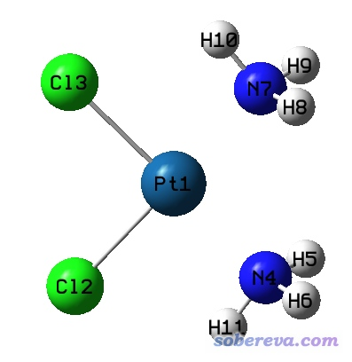
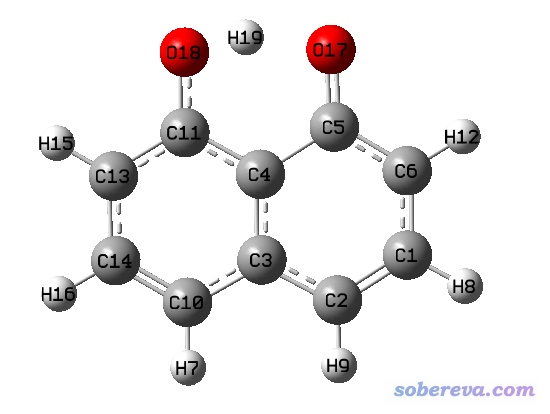
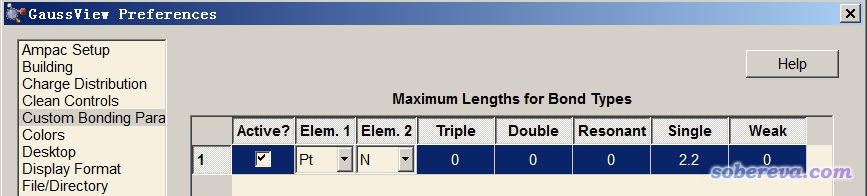
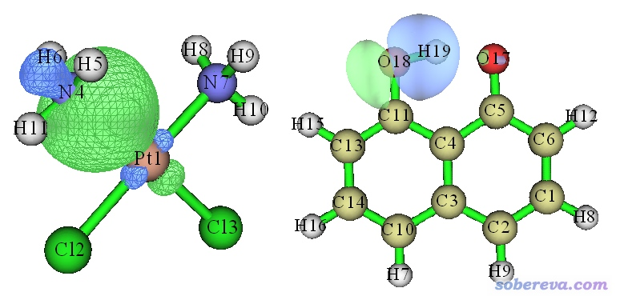
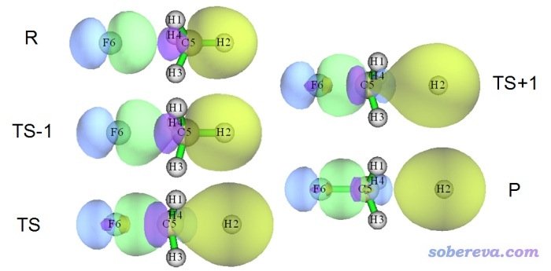
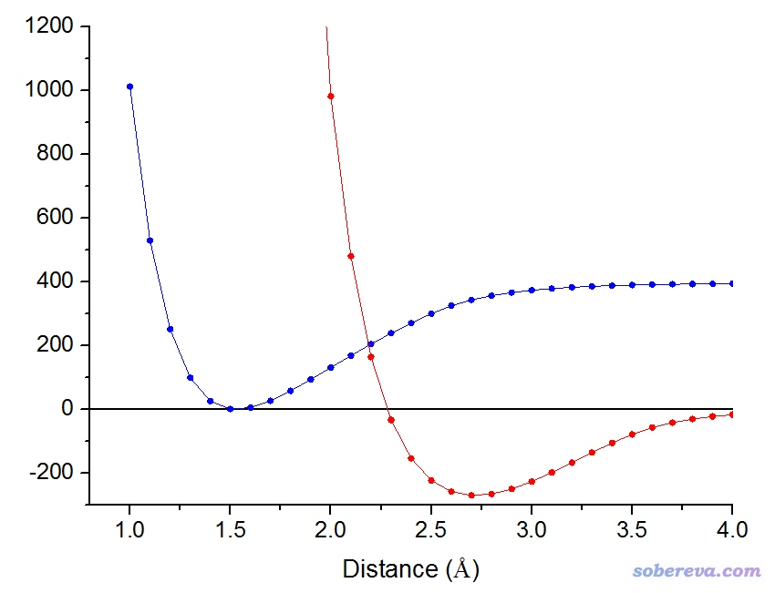
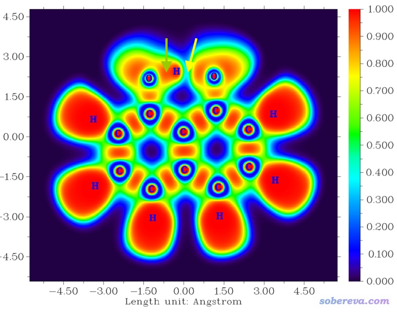
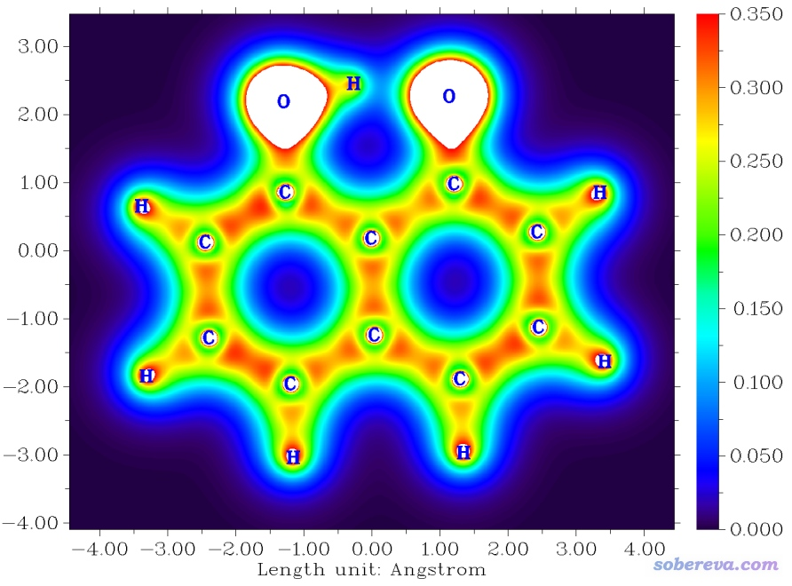
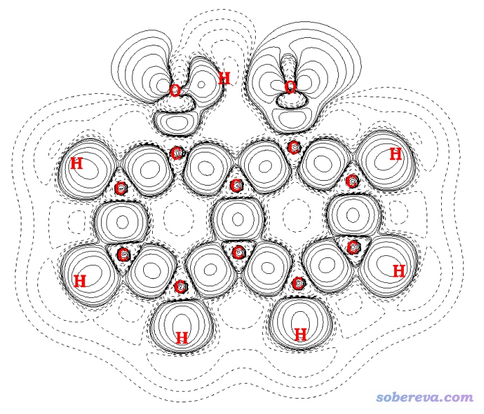
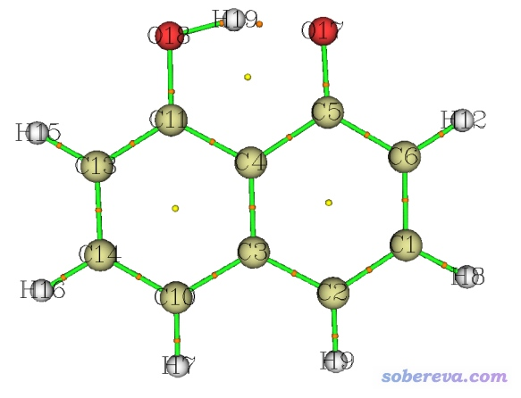

**谈谈原子间是否成键的判断问题**

On the judgement whether there are bonds between atoms

文/Sobereva @[北京科音](http://www.keinsci.com/) 

First release: 2018-Apr-27  Last update: 2025-Nov-13

## 0 前言

经常有人在网上问类似这种问题：“我优化出的结构，在gview里怎么显示A原子和B原子没有成键啊，应该成键才对啊，我是不是算错啦？”这种问题每次都解释一遍比较麻烦，遂写此文专门谈一谈。

如果对于化学体系中的相互作用类型缺乏基本的了解，建议看一下《谈谈“计算时是否需要加DFT-D3色散校正？》（<http://sobereva.com/413>）第1节的简要介绍。对于“键”这个主题感兴趣的读者，有兴趣可以看看Chemistry is about energy and its changes: A critique of bond-length/bond-strength correlations（Coord. Chem. Rev., 344, 355 (2017)），其中有不少有益的讨论，有助于加深对“键”这个概念的认识。如果大家想全面了解关于化学键的分析手段，务必要看《Multiwfn支持的分析化学键的方法一览》（<http://sobereva.com/471>）。本文涉及到一些Multiwfn相关内容，若对此程序不了解，看《Multiwfn入门tips》（<http://sobereva.com/167>）和《Multiwfn FAQ》（<http://sobereva.com/452>）。此程序可以在官方主页<http://sobereva.com/multiwfn>免费下载。

讨论原子间是否成键这个问题前，首先要明确，原子间是否成键，绝对没有一刀切的标准。键本来就是个人为定义的抽象的概念，从实验上也没法直接观测到“键”这个东西，只能通过实验或理论计算得到的一些可观测性质去试图反映，或者通过一些纯理论的分析方法去试图具象化“键”这个概念。因此原子间是否成键，绝对不是一个非黑即白的问题。对明显成键的情况，无论用什么方法去分析讨论，结论都会是“成键了”；对明显没成键的情况，无论用什么方法去分析讨论，结论都会是“没成键”；而对于非典型、模棱两可的“灰色地带”，非要讨论是否成键，是没有太大意义的，而且从不同角度去讨论，结论可能大相径庭。虽然对“灰色地带”非要判断俩原子间是否成键没什么意思，但从实用角度来说，有些人还是希望做个一刀切式的判断。下面就依次说一些常见的用来判断是否成键的做法。

## 1 根据几何关系判断

用可视化程序打开包含结构信息的文件，程序会自动显示哪些原子是键连的，哪些没有键连。如果输入文件里有键连关系信息（比如pdb文件的CONECT字段、mol或mol2文件的记录拓扑关系的字段），那么有的可视化程序可能会直接根据这些信息来设定成键方式。可视化程序也往往会自动根据原子间的距离结合原子半径等信息判断是否成键。例如在默认情况下，Multiwfn在显示体系结构时，判断原子间是否显示化学键是看原子间距离是否小于两个原子的CSD共价半径和的1.15倍（关于原子半径，详见《简谈原子半径》<http://sobereva.com/255>）。Multiwfn以这种方式判断是否成键虽然并不严格（本来也不可能存在严格的办法），但从直觉上就知道是基本靠谱的，因为如果两个原子间形成了非常典型的化学键，那么键长和两个原子的共价半径之和应当相差不多；而如果实际键长超过共价半径和都高达15%了，那肯定有什么因素导致他们的成键被极大地削弱，说它们没成键也不至于很冤枉。

对于常用的可视化程序gview，有这么几种情况：  
(1)载入gjf：如果gjf里面用geom=connectivity定义了原子间连接关系，则会根据连接关系显示成键。否则自动判断成键  
(2)载入chk/fch：会直接按照其中的连接关系显示成键（chk/fch文件中有专门的字段记录原子连接关系）  
(3)载入out/log：自动判断连接关系（Gaussian输出文件里没有原子连接关系信息）

gview判断成键的规则并没有公开，但和Multiwfn用的思想比较类似，在<http://bbs.keinsci.com/thread-56839-1-1.html>中有人专门把gview的成键判据扒了出来。gview判断成键的标准往往过于苛刻，导致本来按理说100%可以算是成键的情况却往往判断成不成键。比如下面的二氯二胺合铂是在B3LYP/SDD/6-31G*下优化的，这是非常常用且合理的计算配合物的级别，结果gview愣是认为Pt和NH3没有成键。然而稍有化学常识的人都知道，它俩肯定应当算是形成了配位键。

下面的体系是C10O2H7-阴离子，用M06-2X/6-311G**优化的。从结构上就能知道，O18-H19距离并不远，应该当成成键才是，而且有不少方法可以论证这一点，而gview居然显示它们没有成键。

上述两个例子暴露出gview根据几何距离判断成键的明显不足，所以千万别把gview是否判断为成键太当回事。而上面提到的两类键，用Multiwfn显示的时候都会被判断成成键，说明Multiwfn用的判断标准更好一些。尽管如此，利用原子间距离一刀切来判定成键终究是很粗鄙的做法。值得一提的是，gview从6.0开始，已经支持了自定义成键规则。进入File - Preferences，例如按照下图设置，就可以让Pt-N之间距离小于2.2就被判断成单重键。还可以增加判断Resonant键（介于单重键和二重键之间）、二重键、三重键的距离阈值上限。

如上修改后，重新载入二氯二胺合铂的文件，或者选Edit-Rebond重新判断成键，就会发现Pt已经和N连上了。如果你是用的gview 5.0.x及以前的版本，则成键判断标准是没法改的，只能自己用Modify bond工具手动连上你觉得本应该被视为成键的原子了。

在Multiwfn里有个计算原子连接性指数的功能，用主功能100的子功能9直接计算，见手册3.100.9节的介绍，可以用.fch、.wfn、.xyz、.mol等各种支持的含有原子坐标信息的文件作为输入文件。当原子间距离大致等于或小于两个原子的共价半径和的时候，这个函数接近1.0。当键长进一步增加，此函数会逐渐平滑降低，到距离达到共价半径和两倍时，此函数几乎为0。这个原子连接性指数可以视为当前结构下某个键存在的百分比，这比起用一刀切方式判断“存在”还是“不存在”明显更有意义。

得一提的是，经常有初学者对量子化学最基本知识缺乏了解，以为在gview里是否连键会影响结果。对于量化计算来说，在gview里怎么连键的，换句话说，在gjf文件里geom=connectivity提供的原子间连接关系是什么样的，**对于量化计算完全不影响结果，因为没有哪个量化理论方法在计算过程中是依赖于用户设定的成键关系的**！每次北京科音初级量子化学培训班（<http://www.keinsci.com/workshop/KEQC_content.html>）讲结构建模的时候我总是会特意强调这一点。仅对于涉及到分子力学的计算，连接关系才必须指定，因为这直接影响到计算时势函数的设定。

也经常有人问我另一个著名、流行的可视化程序VMD中的键的判断问题，我专门有一篇文章说明：《谈谈VMD可视化程序的连接关系的判断和设置问题》（<http://sobereva.com/534>）。

## 2 根据键级大小判断

键级是非常有用的讨论化学键的手段，键级的定义有非常多，有经验性地通过可观测量（诸如键长、电子密度等）定义的，也有利用波函数来定义的，在《Multiwfn支持的分析化学键的方法一览》（<http://sobereva.com/471>）一文中对键级有全面的介绍和讨论。笔者之前的文章J. Phys. Chem. A, 117, 3100 (2013)里对常见的键级也有充分的分析对比。目前最常用的，也是比较适合判断成键问题的，是Mayer键级，从形式上看它也算是60年代末提出的Wiberg键级用于现代量子化学计算的广义化形式。Multiwfn程序可以十分方便地基于.fch、.molden等文件计算Mayer键级。Multiwfn也可以算模糊键级，物理意义上相当基于模糊原子空间定义的Mayer键级。

Mayer键级是基于量子化学计算产生的波函数计算的。对于同类键（比如C-O键和C-O键之间比较），其数值通常和键的强度有正相关性，也因此，随着键的强度变化其数值会平滑变化。比如通过《通过键级曲线和ELF/LOL/RDG等值面动画研究化学反应过程》（<http://sobereva.com/200>）一文中的例子可以看到，随着键的长度增加/降低，相应的Mayer键级会逐渐减小/增加。这也体现出化学键内在的特征，即键是一个“强度”问题，并没有一个一刀切式的判断“是否”存在的标准。Mayer键级从物理意义上可以理解为原子间共享的电子对数，因此对于单/双/三重键，由于基本上是共享一/两/三对电子，Mayer键级应比较接近1.0/2.0/3.0，而没有或几乎没有成键的原子间Mayer键级应当很接近0。显然，Mayer键级不直接告诉你化学键是否存在，只不过给你一个反映键的存在性的定量数值，一刀切的标准怎么设，只能由研究者在理解Mayer键级物理意义和基本特征的基础上自行定夺。

用Multiwfn计算Mayer键级超级容易。启动Multiwfn，把.fch等文件拖入到Multiwfn窗口，输入9，回车，1，回车，程序即会把数值大于0.05的键级都输出出来。比如对于前面C10O2H7-阴离子的例子，在M06-2X/6-311G**波函数下，两个O-H键的结果为  
17(O )   19(H )    0.32208317  
18(O )   19(H )    0.71849440  
可见O18-H19键级比较大，虽然离1.0有一定距离，但算是成键毫不为过。而O17-H19的键级较小，远小于0.5，因此还不足以算是成键，但是其数值又明显大于0，因此可以认为在当前体系中，O17-H19存在一定的化学键作用特征，但若说是“成键了”则太过了。

顺带提醒一下，算Mayer键级的时候用的基组千万不能有弥散函数，否则结果毫无意义（虽然大家知道对于计算阴离子体系的能量等问题加弥散函数是很有必要的，但在计算Mayer键级的时候可以把弥散函数砍掉再算个单点来产生波函数），而前面提到的模糊键级则不怕弥散函数。计算Mayer键级也不要用过大的基组，在诸如6-31G*、def2-SVP、6-311G**这种档次计算的结果已经合理了，如果非要用比如cc-pVQZ等很大的基组，结果可能反倒更差。

像NaCl这种明显是离子键的体系，按照一般化学观念来说，应该没有共享电子，Mayer键级似乎应该接近于0，但实际中Mayer键级对共价性的程度区分度往往不高，离子性很高的键也可能键级不接近0。比如对NaCl在B3LYP/6-31G*下算的Mayer键级数值约0.8，因此无疑算是成键的，而这某种程度上相当于把Na-Cl键“误”当成了极性极高的共价键来看待了。再比如乙酸钠，明显乙酸根和Na+是离子键，而在B3LYP/def2-SVP下算出来Na与每个氧之间的Mayer键级为0.31，由于有两个氧，因此相当于Na+与乙酸根总键级已经超过了0.6。可见，Mayer键级只要明显大于0，就可以算存在化学键。

关于更多的Mayer键级的信息和使用的注意事项，请阅读《Multiwfn支持的分析化学键的方法一览》（<http://sobereva.com/471>）中的相应部分。

## 3 根据是否存在BD型NBO判断

有些人使用NBO程序做NBO分析，认为如果NBO程序给出了对应A-B键的BD型NBO轨道，就可以算作A-B之间成键了。这种做法非常不科学，我强烈不建议使用这种做法！用NBO者，必懂NBO的基本原理、基本思想，否则必被坑。NBO的相关资料在这里有汇总：<http://bbs.keinsci.com/thread-102-1-1.html>。NBO程序在产生NBO轨道的时候，是通过特定的算法自动进行搜索产生的，而搜索过程中引入了大量人为的、存在任意性的、缺乏物理意义的设定，其中关键的是NBO轨道的占据数。在两个原子间搜索BD型NBO轨道时，若相应的NBO的占据数稍微低一些，则这个NBO就会被pass掉，不呈现在最终NBO列表中。用这种算法产生的NBO轨道来判断成键是非常不合适的。比如前面看到的C10O2H7-阴离子的例子，用Gaussian自带的NBO 3.1计算，本该算作成键的O18-H19却没有出现对应的BD型NBO轨道，可见十分误导。

## 4 根据是否存在对应的定域化分子轨道判断

使用轨道定域化方法判断是否成键是很好的做法。轨道定域化方法在《Multiwfn的轨道定域化功能的使用以及与NBO、AdNDP分析的对比》（<http://sobereva.com/380>）文中有十分详细的论述和示例，这里不再多说和演示。轨道定域化方法的目的是产生定域化轨道，有很多不同算法，这些算法中不管是哪个，都比通过搜索来产生NBO轨道的处理优雅得多得多，也明显更有物理意义。只要产生出的占据的定域化轨道中有主要对应于某两个原子的轨道，就可以说这两个原子是成键的。而且由于与此同时还能给出成键轨道的图形，放在文章当中会成为证明原子间成键很好的论据。比如前面提到的二氯二胺合铂里的Pt-N键以及C10O2H7-阴离子中的O18-H19键，它们所对应的通过Pipek-Mezey方法产生的定域化分子轨道如下所示：

是否存在BD型NBO轨道对于判断处于平衡结构的体系的成键问题都经常不合理，更别提用于成键特征模棱两可的过渡态了。而通过定域化分子轨道讨论则完全没这个问题，因为在整个化学过程中定域化轨道的变化都是平滑、连续的。比如下图是一个SN2反应过程中几个关键的点的定域化分子轨道的图形，顺序是R→TS-1→TS→TS+1→P，要形成的新键对应的轨道用绿/蓝色表示，要断裂的键对应的轨道以黄/紫色显示。由图可见定域化分子轨道很好地描述了这个SN2反应过程中成键特征的变化。

顺带一提，对定域化分子轨道做轨道成分分析，还可以了解键的极性。比如B3LYP/6-31G**下对乙醇的O-H键对应的定域化分子轨道做SCPA轨道成分分析，O贡献68.5%，H贡献27.5%。而在同样级别下，对NaCl的Na-Cl键对应的定域化轨道做轨道成分分析，结果是Na贡献89.4%，Cl贡献10.6%，由于其极性极高，因此被视为离子键。

## 5 根据势能曲线拐点判断

有一种在数学上比较严格，但化学意义并不明确的一刀切判断成键与否的做法是寻找键解离势能曲线的拐点。所谓拐点就是曲线的曲率（即曲线的二阶导数）变号的位置。如果键长小于拐点，可认为成键；如果大于拐点，则认为不成键。下图的蓝色曲线是通过UB3LYP/6-311G*以对称破缺方式对乙烷碳碳键进行柔性扫描产生的势能曲线，红色曲线是它的二阶导数曲线。在2.28埃的位置红色曲线与Y=0的横线正好相交，因此2.28埃就是乙烷C-C键势能曲线的拐点。

此体系平衡结构下C-C键键长大约是1.5，如果以拐点作为判断成键与否的标准，相当于超过平衡键长52%以内都算作是成键的。相比于本文第1节谈到的几何结构判断标准，拐点这个标准应该说是极其宽松的。这个判断方式是否有意义，应自行定夺。基于势能曲线，我们也完全可以定义其它的判断成键的标准，比如说，可以将势阱深度一半的位置作为一刀切的标准，对于当前体系差不多是r(C-C)=2.17埃的位置。

基于势能曲线来判断成键的做法普适性差，只对于简单体系，尤其是双原子分子比较适用。而对于复杂体系里的某些键，往往根本没法定义恰当的扫描方式（比如环中的），或者即便扫出来了，可能结果也与周围其它原子存在明显耦合而没法被用来判断成键。

PS：想获得本节的图其实很简单。用量化程序做扫描，将结果导入到Origin里，A列是键长，B列是电子能量。然后新增一列C，设为每个点相对于势能曲线最低点的能量差。然后选Analysis-Mathematics-Differentiate，X和Y列分别选A和C，Derivative Order选2，选中Savitzky-Golay Smooth，然后点OK。此时就会出现D列，就是二阶导数曲线。把A列数据作为X轴，C、D列数据作为Y轴，绘制折线图，即可获得上图。本文使用的是Origin 9。

## 6 利用ELF、价层电子密度、变形密度判断共价键的存在

这一节提及的几个方法主要是用来判断共价键的存在性的，对于讨论离子键没直接用处。

电子定域化函数(ELF)是一种十分重要、笔者十分推荐的、普适性非常强的考察什么地方存在共价键的方法，在“ELF综述和重要文献小合集”（<http://bbs.keinsci.com/thread-2100-1-1.html>）中有丰富的学习资源，故这里不再详谈。在ELF分析方面Multiwfn特别强大和易用。十分常用的对ELF进行分析的做法是绘制填色平面图，绘制方法在上述合集中提到的博文中以及Multiwfn手册4.4节都介绍了。对于C10O2H7-阴离子的例子，其分子平面上的ELF图如下

在绿色箭头所指位置，ELF数值很大，近乎达到了ELF值域上限1.0，因此认为形成了共价键是一点问题也没有的。而黄色箭头所指位置，ELF数值较小，甚至连0.5都没到，因此不适合判断为形成了共价键。

对体系的总电子密度绘图对于讨论成键问题没什么用处，而笔者在物理化学学报, 34, 503（<http://www.whxb.pku.edu.cn/EN/10.3866/PKU.WHXB201709252>）中提出可以利用价层电子密度判断是否形成共价键。价层电子密度在Multiwfn中也可以很便利地绘制，即载入含有波函数信息的文件后，先进入主功能6，选择选项34把内核轨道占据数清零，然后再照常绘制电子密度图即可。对于C10O2H7-阴离子，价层电子密度填色图如下

可见，形成共价键的原子间价层电子密度都相对来说比较大，在当前色彩刻度设定下呈现橙色或红色，距离较小的那个O-H键也符合这个特点。而距离比较远的O...H之间价层电子密度明显非常低，颜色呈青蓝色，因此相较之下不适合判断为形成了共价键。

变形密度体现的是构成体系的原子在产生相互作用前后体系电子密度的变化，在《使用Multiwfn作电子密度差图》（<http://sobereva.com/113>）中对其有详细的介绍并介绍了绘制方法。C10O2H7-阴离子的变形密度的等值线图如下

图中实线是数值为正（电子密度增加）的区域，虚线是数值为负（电子密度减小）的区域。距离近的O-H之间是实线区域，体现出这个区域形成了共价键。因为众所周知，共价键的形成总伴随着两个原子间电子密度的显著增加。而距离远的O...H之间则并非都是实线，因此没法说形成了典型的共价键。

还有很多其它的实空间函数也可以用来判断是否存在共价键问题，比如SCI（J. Phys. Chem. A, 122, 3087）、电子能量密度（Angew. Chem. Int. Ed. Engl., 23, 627）、LOL（J. Mol. Struct. (THEOCHEM), 527, 51）、eta指数（J. Phys. Chem. A, 114, 552）、|势能密度|/拉格朗日动能密度（J. Chem. Phys., 117, 5529）等等，这里不再多说，它们都可以通过Multiwfn非常方便地分析，在《Multiwfn支持的分析化学键的方法一览》（<http://sobereva.com/471>）里都有介绍。

## 7 根据IRI方法图形化判断

IRI（interaction region indicator）是笔者在Chemistry—Methods, 1, 231 (2021) DOI:10.1002/cmtd.202100007中提出的方法，在《使用IRI方法图形化考察化学体系中的化学键和弱相互作用》（<http://sobereva.com/598>）中专门做了介绍，图文并茂，例子丰富，简单易懂，读者务必一看。IRI分析方法可以将化学体系里所有的相互作用，包括弱相互作用和化学键作用，同时通过图像清晰地展现出来，因此通过IRI图可以一目了然判断原子间有没有成键，**笔者强烈推荐！**由于博文写得特别详细，本文就不累述了。

## 8 根据AIM理论的键临界点(BCP)判断

AIM理论在《AIM学习资料和重要文献合集》（<http://bbs.keinsci.com/thread-362-1-1.html>）中有丰富的学习资源。AIM中有个概念叫键临界点(BCP)，有的人用两个原子间是否有BCP作为它们是否成键的依据。BCP是基于电子密度从数学角度严格定义的概念，其实化学意义说不上多明确。从实际角度来看，BCP算是存在化学键的必要非充分条件。化学键属于强相互作用，这一般总会导致BCP的出现，而BCP的出现未必代表两个原子形成了化学键，比如就连两个Ne原子形成的复合物中也会发现Ne之间存在BCP。不存在BCP时通常可以说相应两个原子间没有化学键程度的作用，但是不能说两个原子不存在明显的弱相互作用。比如笔者在Chemistry—Methods, 1, 231 (2021) DOI:10.1002/cmtd.202100007中所指出的，有的分子内氢键（甚至不弱）明明存在，但却没有对应的BCP。

对于C10O2H7-阴离子，通过Multiwfn找出的BCP如下图的桔色小球所示。虽然H19-O17之间算不上化学键，但由于已经产生了十分显著的内氢键（甚至由于这个内氢键的存在，使得O18-H19的距离比一般羟基中O-H键长大不少），因此在H19-O17之间也发现了BCP。

总之，BCP的出现条件比化学键的存在要宽松得多。因此BCP的存在不是化学键存在的证据，而不存在BCP则可作为否认两个原子间存在化学键的强有力的依据。另外，通过BCP位置上各种实空间函数的数值，还可以判断原子间相互作用的特征，在《Multiwfn支持的分析化学键的方法一览》（<http://sobereva.com/471>）和《AIM键临界点处电子密度拉普拉斯值符号判断相互作用类型失败原因的图形分析》（<http://sobereva.com/161>）文中也有很多讨论。
