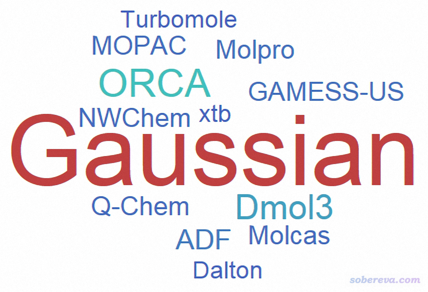
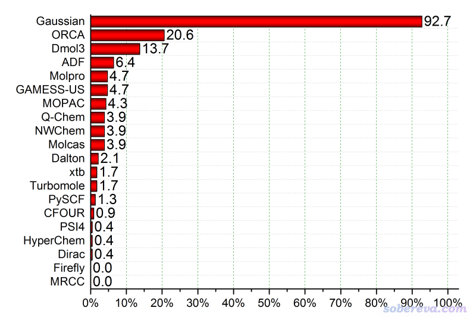
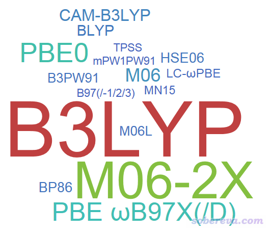
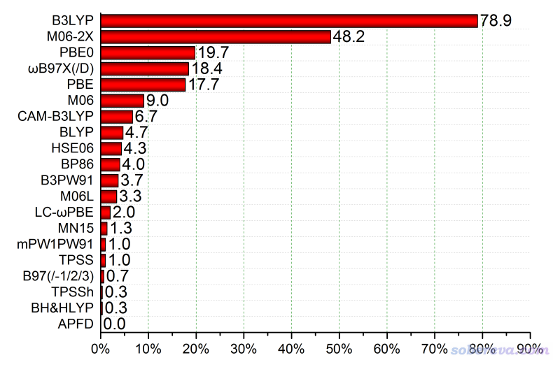

注：2021年的统计结果见《2021年计算化学公社论坛“你最常用的计算化学程序和DFT泛函”投票结果统计》（<http://sobereva.com/599>）

**2018年度计算化学公社杯最常用的量子化学程序和DFT泛函投票结果统计**

文/Sobereva @[北京科音](http://www.keinsci.com)  2018-May-27

  
  
  
在2018年4月16号，在著名的计算化学公社论坛(http://bbs.keinsci.com)开展了为期一个月的“你最常用的量子化学程序投票”（<http://bbs.keinsci.com/thread-9713-1-1.html>）和“你最常用的DFT泛函投票”（<http://bbs.keinsci.com/thread-9712-1-1.html>）。现对投票结果进行总结和评论。未来可能每隔一两年重新举行一次投票。  
  
  

## 1 你最常用的量子化学程序投票

可投程序有20种，投票者共233人，按照得票数目绘制的云字图如下，得票太少的被忽略了  

本投票每个人最多选三项，且所投的程序必须占平时全部研究工作的10%以上。按照得票率绘制的图如下  

由图可见，每10个量化工作者里就至少有9个人频繁使用Gaussian，得票率远远甩开其它程序。Gaussian在整个量化程序界的流行程度占据绝对主导优势，这个状况在十年内应该不会有太大改变。ORCA是除了Gaussian外用户最多的程序，发展势头良好，从统计看已经有约1/5的普通量化研究群体开始在日常研究中使用ORCA。有很多人认为ORCA正在威胁Gaussian的地位，但在短期内还不足以与之抗衡，毕竟ORCA虽然比Gaussian在不少地方有巨大的优势，但在大部分量化研究者需要的诸多功能上还有很大空白，诸如连十分重要的IRC都没有，meta系列泛函连二阶解析导数都不支持（而Gaussian都支持到三阶了），而且也缺乏gview那样的极佳的专属可视化工具。  
  
令我稍微有点意外的是Dmol3的用户比我预想的多，居然能排到第三位。对于孤立体系（分子、团簇），笔者强烈不建议购买和使用Dmol3（注：后来我专门写了一篇文章全面表明我对此的观点<http://sobereva.com/508>），又贵又弱又封闭，还根本没法结合Multiwfn做各种分析。要想图纯泛函计算速度快应当用ORCA，图功能完整、全面应当用Gaussian。我相信Dmol3的用户当中很大一部分都是初学者被忽悠才用的。ADF的得票率能排到第四，也高于我的预期，我对ADF的看法和对Dmol3类似。我相信Dmol3和ADF的用户比率在以后一定会下降，因为以后免费的程序会越来越优秀，这俩程序目前看来是优势的点会逐渐丧失。此外，由于其它软件的教学资源越来越丰富，且有计算化学公社和思想家公社QQ群等交流平台，用户间交流越来越便利，因信息不对称被忽悠而买这俩程序的人应当会越来越少。有一篇文章<http://sobereva.com/489>，十分建议不了解ADF却又对之好奇、甚至有购买欲望的人阅读一下。  
   
Molpro得票率只有约5%，这很合乎现状，毕竟不同程序支持的方法侧重点不同，Molpro重点在MCSCF/多参考，现在大部分人都用DFT因此不会去用DFT做的不理想的Molpro。预计在未来，Molpro用户的比率应该也不会有太大变化，但有可能会因为免费的ORCA的冲击，以及Molcas的免费版OpenMolcas、Molcas@UU的推出而丧失一些。  
  
GAMESS-US虽然知名度非常高（在早年应该说知名度仅亚于Gaussian），而且是综合性程序，但用户比率如今却非常低，可见早已失势。GAMESS-US近年来发展缓慢，呈老态龙钟状态，而且免费且强大的ORCA的迅速崛起，再加上GAMESS-US使用颇复杂，如今的年轻人也不爱这类刻板、古董风格的程序，GAMESS-US以后的市场必定会越来越小。GAMESS-US虽然在一些功能上也有优势，但那些功能都不是一般量化研究者用得到的。事实上，从计算化学公社论坛量化版的GAMESS-US分类的帖子来看，现在用GAMESS-US的大多都是要做LMO-EDA能量分解计算的人，如果等什么时候这个优势也被其它程序彻底取代，GAMESS-US就会加速灭亡。  
  
MOPAC以其对半经验方法的全面支持和高效，有4%的人在用，比较正常。但随着越来越多的人认识到做类似半经验DFT的GFN-xTB方法的xtb程序的好处，MOPAC的地位恐怕要不保。但MOZYME还是MOPAC的独家优势。  
  
Q-Chem一直处于不温不火的状态，年引用次数也就区区六七百，这次从投票情况看用户数目也确实就Gaussian一个零头。不流行主要在于Q-Chem定位和Gaussian一样，虽然也有一些Gaussian没有的优势，但是这些优势对一般用户并不重要，而相对于Gaussian来说又有很多不足，再加上ORCA火了，尤其是曾经Q-Chem引以为傲的TDDFT二阶解析导数在Gaussian16里已经有了，Q-Chem以后的生存应该比较困难。这程序不收费都未必有很多人用，更别说还是收费的，而且license和机子绑定，用户体验的机会都不多（虽说可以申请试用）。  
  
有点意外的是Firefly虽然不流行，但竟然可怜到一票未得。而HyperChem这个给本科生教学用的程序竟然还都得了一票。PSI4的用户之少也超过预期，毕竟PSI4在SAPT等方面还是很有价值的，却居然只有1票。NWChem、Molcas、Dalton的得票率和预期的一致，用户数都不多，都是少部分人冲着它们的特色功能去的。  
  
  
  

## 2 你最常用的DFT泛函投票

可投泛函有20种（明显感觉不会有多少人用的泛函就没纳入可投范围），投票者共299人，按照得票数目绘制的云字图如下，得票太少的被忽略了  

本投票每个人最多选三项，且所投的泛函必须占平时全部研究工作的10%以上，带不带DFT-D3校正算同一个泛函。按照得票率绘制的图如下  

  
投票期间一开始B3LYP和M06-2X咬得很厉害，齐头并进，结果后来姜还是老的辣，B3LYP最终依然保住了流行程度的No.1的宝座。毕竟M06-2X跟B3LYP比，速度慢，对积分格点要求高，而且D3弥补了B3LYP以往的一个重大软肋，再加上以后还有其它泛函出来，因此我感觉M06-2X的得票率如今已经饱和了，以后超过B3LYP的可能性不是很大。  
  
ωB97XD（含ωB97X）、PBE0、PBE这回得票率非常接近，仅次于M06-2X，这是情理之中。ωB97XD和同年的M06-2X比，有种“既生瑜何生亮”的感觉，要是没有M06-2X把它的市场份额抢了的话，ωB97XD如今的流行程度应该会更高。  
  
M06得票率符合预期，有一定市场，但还不算很流行，跟M06-2X没得比。M06L的用户比预期少得多，本以为和M06能差不多。MN15号称普适性好，但还不成气候，一方面是G16才支持，另一方面是这种各个方面都还成，但又都不突出的泛函，很难克服用户的“替换成本”流行开。  
  
TPSSh和TPSS知名度也挺高，虽然如今算不上流行，但本以为也能有个大约2~3%的得票率，没想到现状很惨淡，TPSSh一票，TPSS三票。其实这俩泛函算过渡金属还是可以的。  
  
B97系列和BH&HLYP也都很惨，其实还是有用武之地的。LC-ωPBE有些人用，估计大多都是冲着ω调控去的。BP86和BLYP这俩GGA泛函得票率比同为GGA的PBE低那么多，感觉有点意外，其实这俩泛函用处是很大的，BP86公认是经典的算配合物的泛函，而根据GMTKN55的测试，BLYP结合D3在GGA泛函中算弱相互作用是几乎最好的，很适合在ORCA中开RI算大体系弱相互作用，希望这俩泛函的价值别被低估。CAM-B3LYP在非主流泛函里算是混得不错的，这和它适合算大共轭体系激发态以及(超)极化率有密切关系。  
  
APFD这回丢人丢大发了。此泛函在exploring第三版里被强行推销，几乎所有计算都用APFD，结果没成想，一票未得，说明烂泛函怎么推都没用。
