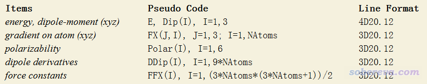
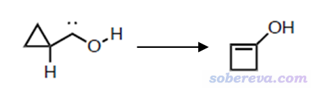
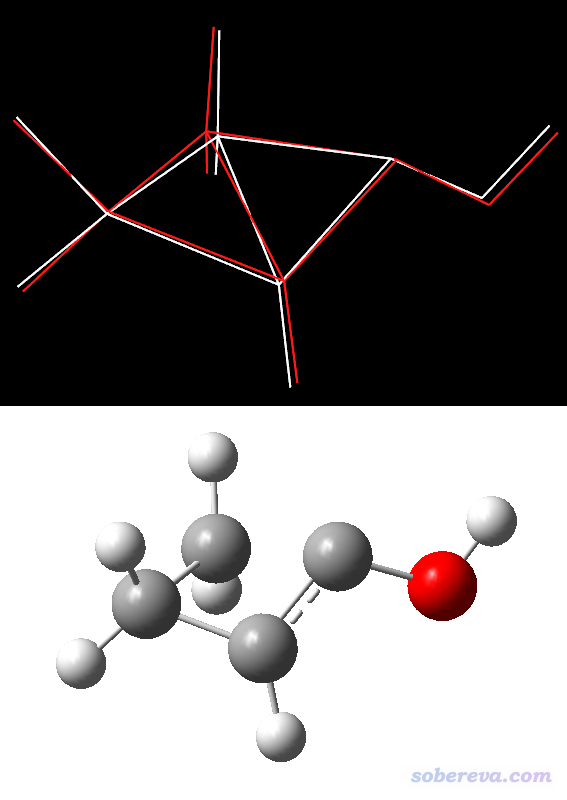
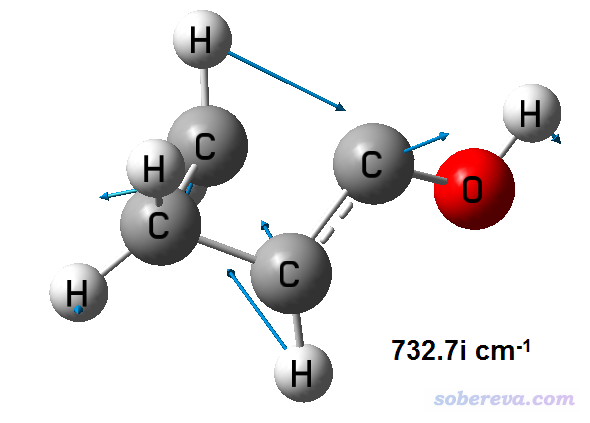
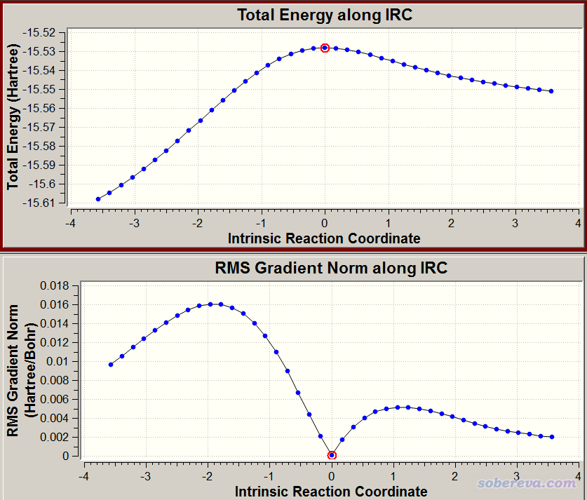
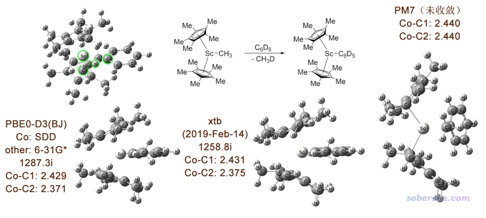

**注****：本文仅仅非常简略说明xtb的用法，在北京科音高级量子化学培训班（**[**http://www.keinsci.com/workshop/KAQC_content.html**](http://www.keinsci.com/workshop/KAQC_content.html)**）中笔者专门用一节极为详细、完整讲解xtb的用法以及各种版本GFN理论的背景知识并给了大量例子，还对xtb做从头算动力学的方式给出了特别详尽的说明和丰富的应用例子，欢迎参加**！ 

**将Gaussian与Grimme的xtb程序联用搜索过渡态、产生IRC、做振动分析**

Use Gaussian with xtb program to search for transition states, generate IRC, and perform vibration analysis 

文/Sobereva @[北京科音](http://www.keinsci.com)

First release: 2018-May-29  Last update: 2024-Oct-2

## 0 前言

在《盘点Grimme迄今对理论化学的贡献》（<http://sobereva.com/388>）一文中笔者曾简单提到GFN-xTB方法，说白了就是类似于DFTB那种半经验意味的DFT，精度不错普适性也好，对与之耗时相仿佛的半经验方法和DFTB带来了极大的冲击。Grimme开发了名为xtb的专门做GFN-xTB计算的程序。xtb程序用过的人都说好，速度很快，普适性挺好，推出不久已经开始有很多人使用了，在《2018年度计算化学公社杯最常用的量子化学程序和DFT泛函投票结果统计》（<http://sobereva.com/420>）里已经有一些得票率了，而且一些第三方程序已经支持xtb了，比如Multiwfn (<http://sobereva.com/multiwfn>)可以读取xtb的振动分析的输出来绘制红外光谱、基于xtb产生的波函数做波函数分析和绘制分子轨道，molclus程序可以结合xtb来做团簇构型和分子构象搜索（见<http://www.keinsci.com/research/molclus.html>）。另外计算化学公社上fhh2626还写了NAMD与xtb结合做QM/MM的界面（<http://bbs.keinsci.com/thread-7583-1-1.html>）。

xtb程序目前可以做单点、优化、振动分析等任务，但是对于一般计算化学研究者来说，还希望能够找过渡态、产生IRC，并且希望振动分析的结果（特别是虚频模式）可以可视化，但这些xtb程序目前还做不到。好在Gaussian从09开始加入了external关键词，在进行极小点/过渡态优化、IRC、振动分析等任务时，可以从外部文件直接读入能量、受力、Hessian，而外部文件的这些信息可以用任意程序来产生，当然也包括xtb，不过需要自己写个接口才能实现。因此Gaussian可以被当做一个“optimizer”来使用，这种用法似于ASE（atomic simulation environment）程序。

本文介绍的这个接口笔者称为gau_xtb，可以从这里下载：[**http://sobereva.com/soft/gau_xtb**](http://sobereva.com/soft/gau_xtb)。如果大家的实际研究中使用了此接口，请务必这样引用：Tian Lu, gau_xtb: A Gaussian interface for xtb code, <http://sobereva.com/soft/gau_xtb> (accessed month day, year) 。此页面里的脚本始终兼容目前最新版本xtb。当笔者发现xtb的更新导致老的gau_xtb脚本不能用的时候，笔者会在此网页里对脚本进行更新。因此如果你发现gau_xtb无法正常调用xtb时，首先应当把xtb和gau_xtb都更新为最新版。

笔者还另写了一篇文章，《Gaussian与ORCA联用搜索过渡态、产生IRC、做振动分析》（<http://sobereva.com/422>），将Gaussian和ORCA联用也带来很多好处，有兴趣可以看看。

下面先介绍xtb的基本用法，然后介绍gau_xtb接口的原理，之后给出具体例子。如果大家已经会用xtb，对接口的原理和细节不感兴趣，只想马上用起来，直接看第4节就行了。

**注**：经常有人问怎么用本文提供的接口联用不成功，还怀疑是本文的接口不支持较新版本的xtb。在此明确说明，本文的接口没任何问题。通过实测，至少令G16 C.01结合xtb 6.5.1以及G16 C.02结合xtb 6.6.1、6.7.1运行都没问题。遇到跑自己的任务失败时，起码先把本文提供的例子重复一遍，死活不成功的话，在读懂接口脚本的内容基础上，让脚本输出一些中间信息（比如脚本里用ls命令显示当前目录下的文件都有哪些、用cp命令将临时产生的文件复制出来然后人工进行检查），总能搞明白原因。另外也不要用一些稀奇古怪的运行环境。

## 1 xtb简介

借本文的机会简单介绍一下xtb的相关知识和使用。在<https://xtb-docs.readthedocs.io/en/latest/contents.html>可以看到在线手册。

### 1.1 xtb的安装

xtb是开源的，可以在<https://github.com/grimme-lab/xtb/>下载到源代码，如果想自行编译的话参看《Grimme的xtb程序的编译方法》（<http://sobereva.com/521>）。作为普通用户，直接用<https://github.com/grimme-lab/xtb/releases>里提供的预编译好的版本即可，文件名为比如xtb-191025.tar.xz这样的形式，代表2019年10月25日发布的版本。这是Linux版，目前没有预编译的Windows版。

创建一个目录，比如/sob/xtb。将比如xtb-191213.tar.xz放进去，在此目录下执行tar -xJf xtb-191213.tar.xz目录解压之，之后应当会看到此目录下出现了bin、lib64等目录。

用gedit或vi等工具编辑~/.bashrc文件，加入以下语句  
export PATH=$PATH:/sob/xtb/bin  
export XTBPATH=/sob/xtb/share/xtb  
export OMP_NUM_THREADS=N  
export MKL_NUM_THREADS=N  
export OMP_STACKSIZE=1000M  
ulimit -s unlimited  
其中N是并行计算时使用的CPU核心数，不要超过CPU的物理核心数。

然后保存.bashrc文件，重新进入终端，xtb就可以用了。

注：根据我的诸多测试，发现xtb（至少对于GFN2-xTB真空下计算而言）做优化、动力学的速度在大约12核的时候就封顶了，用更多的核来并行对速度的提升微乎其微，某些情况下反倒速度还稍微变得更慢。因此，如果你的机子的物理核心数很多，比如三、四十核，那么建议把N设为12，同时跑多个任务来充分利用计算资源。如果你的CPU比如只有6核，那么N就设6核就好了。但是，如果你要做振动分析，那么用几十核还是值得的，比如36核速度可以达到12核的两倍出头（这是由于振动分析是基于有限差分做的，原理上并行效率可以做得较高）。

### 1.2 xtb的基本使用

xtb的输入文件就是一个xyz文件，这是最常用的记录分子结构的格式之一，很多程序都可以产生。用Multiwfn产生也可以，可以把fch、pdb、mol、wfn、wfx、molden等Multiwfn能认的格式载入Multiwfn，然后进入主功能100的子功能2，选择输出xyz文件。由于这个文件格式非常简单，比如自己把Gaussian的.gjf文件编辑一下产生也可以。

xtb的详细使用说明也可以通过xtb -h查看。几个比较常用的选项如下  
-c或--chrg：设定体系净电荷  
-u或--uhf：设定alpha电子数减beta电子数（相当于自旋多重度减1）  
--gbsa：使用GBSA隐式溶剂模型。目前支持的溶剂有acetone、acetonitrile、benzene、CH2Cl2、CHCl3、CS2、DMF、DMSO、ether、H2O、methanol、n-hexane、THF、toluene  
--alpb：使用ALPB隐式溶剂模型。目前支持的溶剂有acetone、acetonitrile、aniline、benzaldehyde、benzene、ch2cl2、chcl3、cs2、dioxane、dmf、dmso、ether、ethylacetate、furane、hexandecane、hexane、methanol、nitromethane、octanol、woctanol、phenol、toluene、thf、water  
--molden：计算结束后产生molden.input，这是Molden输入文件  
--gfn：选择GFN-xTB理论的版本，可以为0、1、2。如--gfn 0就代表GFN0-xTB。GFN2-xTB物理上最严格，多数情况精度最佳，但有时候SCF收敛困难；GFN1-xTB不如GFN2-xTB严格，平均精度稍逊一点，但SCF收敛容易（因此明显更适合SCF难收敛的金属团簇等情况），耗时也比GFN2-xTB低一些。GFN0-xTB精度最烂但速度也最快，非常适合快速简单粗暴地搞巨大体系，但对于找过渡态的目的就太糙了而不建议用

常用任务类型：  
--sp：计算单点（此为默认，可不写）  
--grad：计算梯度  
--opt [级别]：几何优化。级别默认为normal，更佳的是tight、verytight、extreme  
--hess：计算数值Hessian并做振动分析  
--ohess [级别]：优化后自动计算Hessian并做振动分析  
--md：基于当前结构做分子动力学（目前xtb还支持metadynamics，详见手册）  
--omd：优化后做分子动力学

例如：  
对yoshiko.xyz做真空中的单点计算，电荷为1，自旋多重度为2（alpha比beta电子多1个）：xtb yoshiko.xyz --chrg 1 --uhf 1 -sp  
对yohane.xyz做甲苯溶剂下优化和振动分析，体系是默认的中性单重态：xtb yohane.xyz --ohess --gbsa toluene

xtb运行时一方面会在屏幕上输出信息，同时也会在当前目录下产生一大堆文件。这些文件的含义在自带的文档里有说明。

xtb目前有解析梯度，但只支持数值Hessian。--hess或-ohess任务做完会输出g98.out，是模仿高斯freq输出格式来输出频率、红外强度、正则坐标。后者没用。

--opt任务产生的xtbopt.xyz是最后结构的xyz坐标文件，其中第二行是对应的能量。xtbopt.log是含有优化过程每一帧的多帧xyz文件，后缀改为.xyz后就可以拖入VMD查看优化轨迹。

Multiwfn可以载入xtb用--molden产生的molden.input文件做十分丰富的波函数分析，相关知识看《Multiwfn入门tips》（<http://sobereva.com/167>）、《Multiwfn FAQ》（<http://sobereva.com/452>）。

Multiwfn载入--hess或--ohess的输出文件后，进主功能11，选择IR或Raman，进入界面后选0就可以绘制出相应的光谱，超级容易。更多信息见《使用Multiwfn绘制红外、拉曼、UV-Vis、ECD、VCD和ROA光谱图》（<http://sobereva.com/224>）。

### 1.3 xtb的控制文件

xtb运行时还可以载入控制文件（xcontrol），见在线手册。通过控制文件，可以对xtb的运行细节做更多的控制、实现更多的功能。有些设置（比如设置体系净电荷）既可以通过上述选项来指定，也可以在控制文件里指定，前者的优先级更高。

控制文件的文件名随意，通过-I指定。比如控制文件名字叫inp，那就可以比如这样执行：  
xtb rei_ayanami.xyz -I inp --molden --chrg 1

控制文件里可以设置很多字段，每个字段通过$开头，到下一个$结束。例如计算当前体系时alpha电子比beta电子多两个，并且让3,19,20,21,22原子的位置在优化过程中被冻住，则控制文件的内容应当为：  
$spin=2  
$fix  
atoms:3,19-22

更多xtb细节请看自带的文档，在北京科音的高级量子化学培训班（<http://www.keinsci.com/workshop/KAQC_content.html>）里会对GFN系列方法的原理和xtb的用法做深入全面讲授。

## 2 Gaussian的external功能简介

关于Gaussian的external功能的使用，详见<http://sobereva.com/g09/k_external.htm>。简单来说，Gaussian的输入文件里写上比如external='./xtb.sh'，在计算时候就会以这样的方式调用当前目录下的xtb.sh脚本：  
xtb.sh layer InputFile OutputFile MsgFile FChkFile MatElFile  
各个参数的含义可以看手册，后五个是文件名，这里我们主要关心的是其中第二个参数InputFile和第三个参数OutputFile。如果查看Gaussian输出文件，会发现这样的提示  
 Running external command "./xtb.sh R"  
         input file       "/sob/g09/scratch/Gau-28355.EIn"  
         output file      "/sob/g09/scratch/Gau-28355.EOu"  
         message file     "/sob/g09/scratch/Gau-28355.EMs"  
         fchk file        "/sob/g09/scratch/Gau-28355.EFC"  
         mat. el file     "/sob/g09/scratch/Gau-28355.EUF"  
其中"/sob/g09/scratch/Gau-28355.EIn"和"/sob/g09/scratch/Gau-28355.EOu"正是分别传递给xtb.sh的InputFile和OutputFile的文件名。

InputFile文件是Gaussian产生的，记录了当前步的信息，格式为：  
原子数  需要的导数  电荷  自旋多重度  
原子1元素序号  X  Y  Z  MM电荷 MM原子类型  
原子2元素序号  X  Y  Z  MM电荷 MM原子类型  
...  
原子N元素序号  X  Y  Z  MM电荷 MM原子类型  
如果当前任务只需要能量信息，“需要的导数”为0；如果需要受力，则为1（比如几何优化任务）；如果还需要Hessian，则为2（比如freq任务，以及优化或IRC时用了calcfc等情况）。

OutputFile是要在执行xtb.sh时候由这个脚本来生成的，里面记录能量、受力、Hessian等，按照手册的要求格式为：

其中诸如4D20.12是数据格式，稍微懂点Fortran就能明白。按照这个格式产生好OutputFile文件，则Gaussian就会从中读取当前任务需要的信息开展计算。比如如果当前任务只需要能量，则填上能量和偶极矩那一行即可，而如果比如需要Hessian，则整个文件所有信息都得填上。此文件中的偶极矩、极化率对于本文涉及的优化、走IRC、振动频率计算都是不需要的，可以直接填0（但相应地，涉及到这些信息的Gaussian输出，比如偶极矩、freq任务的红外强度等也将都为0）。

要想将Gaussian和xtb联用，关键就是要恰当编写xtb.sh，使得这个脚本可以基于InputFile里的信息去调用xtb计算出当前结构下的能量、受力、Hessian，并按照Gaussian要求的格式转化出OutputFile文件。下一节就介绍怎么实现。

## 3 Gaussian与xtb的接口xtb.sh的编写

笔者写好的xtb.sh文件在本文一开始提到的压缩包里有。这是bash shell脚本，本节解释一下脚本内容，需要懂得一些Linux命令和shell编程知识才能完全理解（值得一提的是，写这种脚本并非必须用bash shell，也并非必须是Linux环境才能用external功能。比如在Windows下也完全可以写成.bat脚本，例如Windows版Gaussian调用NBO6就是通过external来调用NBO6的.bat文件实现的）。

xtb.sh文件里$2、$3分别对应于xtb.sh接收到的第2、第3个参数，也即InputFile和OutputFile文件名。脚本首先用  
read atoms derivs charge spin < $2  
从InputFile中把原子数、需要的导数、电荷、自旋多重度分别读到atoms、derivs、charge、spin四个变量里，然后用以下命令构建一个mol.tmp文件  
cat >> mol.tmp <<EOF  
$atoms

$(sed -n 2,$(($atoms+1))p < $2 | cut -c 1-72)  
EOF  
这个mol.tmp文件是xyz文件的雏形，还需要做两个处理才能变成xyz格式文件，一方面是把从InputFile读过来的元素序号转化成元素名，另一方面是把读过来的以Bohr为单位的坐标转化成埃。为此，笔者写了个Fortran小程序genxyz.f90，编译好的可执行文件是压缩包里的genxyz。这个小程序稍微懂点编程的人都能看懂，就不解释了。xtb.sh以下两行就是调用genxyz把当前目录下的mol.tmp转化为mol.xyz  
./genxyz  
rm -f mol.tmp

之后，脚本设置xtb并行运行时的线程数，并根据读入的自旋多重度，将之减1，算出来-uhf后面的参数。然后根据当前任务需要的导数信息，来判断在调用xtb时是用-grad还是用-hess  
export OMP_NUM_THREADS=4  
export MKL_NUM_THREADS=4  
uhf=`echo "$spin-1" | bc` #nalpha-nbeta  
if [ $derivs == "2" ] ; then  
 echo "Running: xtb mol.xyz --chrg $charge --uhf $uhf --hess --grad > xtbout"  
 xtb mol.xyz --chrg $charge --uhf $uhf --hess --grad > xtbout  
elif [ $derivs == "1" ] ; then  
 echo "Running: xtb mol.xyz --chrg $charge --uhf $uhf --grad > xtbout"  
 xtb mol.xyz --chrg $charge --uhf $uhf --grad > xtbout  
fi

xtb程序默认用的是GFN1-xTB理论，如果想用原理上更好的GFN2-xTB，可以将上述调用时的参数里加上--gfn 2来改用之。

最后，xtb.sh如下调用笔者自编的extderi程序产生OutputFile文件。对应的源代码extderi.f90也很简单，就不解释了  
./extderi $3 $atoms $derivs  
extderi会读取xtb运行后在当前目录下产生的gradient、hessian文件，分别提取受力、Hessian信息，并且从xtbout文件中读取能量，然后输出到OutputFile中。传递给extderi的三个参数$3、$atoms、$derivs分别告诉这个程序要产生的OutputFile文件的文件名是什么、总共多少原子、要读取/写入哪些导数信息。

xtb.sh中还用了一些rm -f命令，用来删除xtb产生的各种文件，确保Gaussian运算后当前目录不残留多余的文件。

## 4 Gaussian与xtb联用搜索过渡态、做振动分析、产生IRC应用示例

注：以下数据用的是本文刚发布的时候的xtb程序算出来的，结果和最新版本xtb可能不同。

我们这里将Gaussian与xtb联用，搜索一下下图所示的环丙基卡宾异构化过程的过渡态

对应的Gaussian输入文件是本文压缩包里的TS.gjf，开头两行如下  
%chk=mol.chk  
#P opt(ts,calcfc,noeigen,nomicro) external='./xtb.sh'

可见这里用的是常用的opt=TS方式搜索过渡态，因此输入文件里的结构应当是这个与实际过渡态比较像的过渡态初猜结构。opt里必须写nomicro，否则Gaussian在优化的时候会试图调用分子力学的optimizer去搞，达不到我们的目的。这里我们刻意保留了chk文件，因为这样的话之后做IRC、freq任务就可以直接用geom=allcheck从chk文件中读取已经优化好的过渡态结构来计算了。注意对于当前情况，不能在这里直接写opt freq，必须把opt和freq拆成两步做才行，否则freq任务会出错。另外，由于当前任务的能量、导数都调用xtb来算了，因此理论方法和基组就不需要写了。

我们确保机子里已经装好Gaussian了，xtb也已经配置好了从而可以直接通过xtb命令调用了，然后把TS.gjf、xtb.sh、genxyz和extderi都放到当前目录下，把xtb.sh里的OMP_NUM_THREADS和MKL_NUM_THREADS都设为CPU的物理核心数。再运行诸如g09 < TS.gjf |tee TS.out，就开始计算了。

这里特别强调一点，如果你的Gaussian的Default.route里已通过-M-设置为默认并行做Gaussian计算，一定要改为串行计算（如果不想动这个文件就在.gjf文件里设%nproc=1），否则在Gaussian通过external方式调用外部脚本期间会造成很高无意义的CPU资源消耗，导致总耗时增加。

此任务收敛很顺利，13步就收敛了。找到的过渡态精度如何？下图上半部分是将Gaussian+xtb找到的过渡态（白线）与B3LYP/TZVP下找到的过渡态（红线）放在一起进行对比，已经按照《在VMD中计算RMSD衡量两个结构间的几何偏差》（<http://sobereva.com/290>）文中的做法将两个结构进行了Align使之最大程度匹配。下图下半部分是过渡态结构的球棍图，便于读者看清楚结构。

从上面的对比来看，GFN-xTB方法当初虽然没有特意考虑过渡态问题，但是优化过渡态的结果和较好精度的B3LYP/TZVP比，误差基本可以接受，至少定性正确。大家可以用Gaussian+xtb尝试用不同初猜搜索过渡态，等搜出来一个看着基本合理的过渡态，再用DFT去进一步优化（当然，Gaussian+xtb不是干这个的唯一选择，笔者也尝试了用PM7半经验方法优化这个过渡态，结果也一样定性正确，至于和Gaussian+xtb给出的结构孰优孰劣，从相对于B3LYP/TZVP结构的RMSD偏差上看半斤八两）

接下来再做一下振动分析，看看虚频情况。虽然xtb直接就能做振动分析给出振动频率，但是不便于观看振动模式，而通过Gaussian+xtb联用，结果就可以直接用gview看了。输入文件是本文文件包里的freq.gjf，内容只有两行，为  
%chk=mol.chk  
#P freq geom=allcheck external='./xtb.sh'  
运行之，结果是压缩包里的freq.out。虚频模式的正则矢量如下

从振动动画上看，过渡态确实找对了。虚频大小是732cm-1，而B3LYP/TZVP下是686.7cm-1，PM7下是843.1cm-1，可见Gaussian+xtb的结果合理，而且误差比PM7明显更小。

最后，我们再走一下IRC。输入文件是本文文件包里的IRC.gjf，内容为  
%oldchk=mol.chk  
#P IRC(maxpoints=20,calcfc) geom=allcheck external='./xtb.sh'  
这里用%oldchk是避免IRC任务改写之前的chk。用Gaussian执行之。gview看到的IRC如下

可见IRC曲线很光滑，而且所有点的结构都正常，证明Gaussian和xtb联用很成功。

对于上面这个普通有机反应，xtb和PM7都可以给出定性正确的结果。但对于比较复杂、比较难算的牵扯过渡金属的反应情况又会如何？笔者用Sc金属引发C-H活化的反应做了个测试，结果如下。具体来说，笔者是先用肯定稳妥的PBE0-D3(BJ)优化出过渡态（下图左上角。涉及反应的原子被高亮了），然后用这个结构作为初始结构，再用Gaussian+xtb和PM7分别在相应级别下优化过渡态。为了便于对比，三个级别得到的结构都摆成了相同视角。C1和C2分别指的是苯基和甲基上与Sc成键的碳。

可见，Gaussian+xtb很好地维持住了PBE0-D3(BJ)的过渡态结构，而且虚频、键长都很合理，笔者也跑了IRC，也很顺利且结果正常。然而在PM7下过渡态严重变形，跑了一百多步还在严重震荡，最后一帧结构也完全看不出能收敛到合理过渡态的迹象。从最后的结构看，Sc没有和两个茂环配位，反倒是与其中一个碳配位了；另外，Sc和甲基、苯基的碳的键长居然变得相同了。这说明，用PM7哪怕试图做这种反应的预优化也根本没法用。

虽然本文只考察了两个体系，但至少证明Gaussian+xtb用来粗略研究化学反应是充分可行的，值得在实际研究中广泛使用。对于普通有机体系，这种做法比起直接用Gaussian自带的PM6/PM7优势不显著。但碰到略诡异，尤其是涉及过渡金属的体系，预感半经验方法连定性正确结果也给不出的时候，则十分建议改用Gaussian+xtb。

最后提醒一下，虽然GFN-xTB往往很不错，但也别以为它的普适性和精度能和一般的DFT计算抗衡。例如优化Li2，M06-2X/def2-TZVP下结果是2.7064埃，实验值是2.6729埃，但xtb优化出来是2.2991埃，误差还是不小的，尽管比PM7优化出来的1.8106埃已经强得多了。

如果你要用本文的做法计算很重的元素，比如Pt，有一点主要注意，即虽然Gaussian与xtb联用时Gaussian自己并不会去做任何量化计算，但是由于你没写基组，Gaussian程序内部默认当前设的基组是STO-3G，程序会进而判断你当前体系里的所有元素是否对于STO-3G有定义，如果没有就报错。对很重的元素STO-3G都是没有定义的。为了避免这个报错，解决办法就是关键词里写上UGBS，这是一个几乎涵盖整个周期表的基组，因此就不会因为当前的基组对元素没有定义而报错了。
