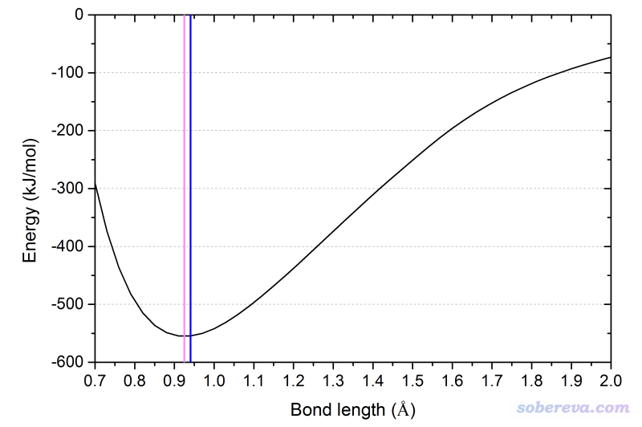
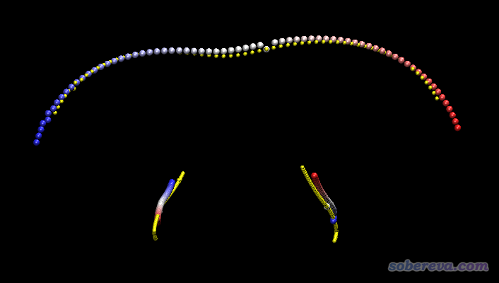
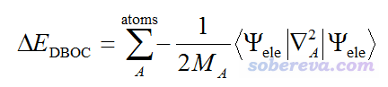

**谈谈温度、压力、同位素设定对量子化学计算结果产生的影响**

On the impact of temperature, pressure, and isotope settings on quantum chemistry calculation results

文/Sobereva @[北京科音](http://www.keinsci.com)

First release: 2018-Jun-1   Last update: 2024-Oct-28

  
  
经常有量子化学初学者问诸如这种问题：怎么计算特定温度/压力下体系的结构、重水和轻水的结构有什么区别。每次回复都比较麻烦，索性写一个小文章专门谈一下温度、压力、同位素设定会对哪些常见的量子化学问题计算结果产生影响、对哪些完全没有影响。为讨论方便，这里假定用户用的是Gaussian，其可以通过pressure、temperature关键词分别设定压力和温度，还可以设定同位素，比如把坐标部分的H写为H(iso=2)就等于用氘。本文的讨论对于其它各种量子化学程序也是完全适用的，因为原理都是共通的。下文中所说的单点能意指电子能量，不知道什么叫电子能量的话看《谈谈该从Gaussian输出文件中的什么地方读电子能量》（<http://sobereva.com/488>）。  
  
  

## 1 压力设定产生的影响

在各种Gaussian可以做的任务中，压力设定仅仅会对freq任务产生的热力学数据产生影响。更具体来说，影响的仅仅是热力学数据中的热力学校正量部分中的平动熵部分。在《使用Shermo结合量子化学程序方便地计算分子的各种热力学数据》（<http://sobereva.com/552>）介绍的笔者开发的Shermo程序手册的附录部分给出了各种热力学校正量的详细的表达式，可见其中只有平动熵部分才依赖于压力(P)。之所以平动部分会依赖于压力设定，这本质上是因为程序计算热力学数据的时候是把体系当做理想气体考虑的，此时平动部分的公式是通过三维势箱模型推导出来的，而三维势箱的体积V，正是根据大家熟知的PV=nRT的理想气体公式算出来的，其中牵扯到P。  
  
这里再强调一下，量子化学在计算一个体系的时候，是把体系当做处于真空状态来计算的。而计算热力学数据时，考虑的是处于理想气体状态下的1mol的当前体系。既然是理想气体，就说明忽略了分子间一切相互作用，因此不管压力设多少，始终都是按理想气体算的，改变的仅仅是平动项贡献里的参数P而已。所以千万别以为在高压下体系是凝聚相的，于是你把pressure设得很大，量化程序就把当前体系按照凝聚相考虑。  
  
压力对热力学数据以外的任何量子化学程序计算结果（比如优化的结构、振动频率、电子激发能、NMR、偶极矩等等）都不产生丝毫影响，原因从计算原理上稍微想一下就知道。比如计算单点能，这要求解分子体系的电子薛定谔方程，而这方程里哪项体现压力的影响了？既然不依赖于压力，算出来的能量啊、波函数啊，以及各种相关的量都明显不可能受压力设定影响。做计算一定要懂一些最基本的原理（PS：这些从事计算必备的知识在北京科音量子化学培训班里都会讲）。  
  
在第一性原理计算领域，研究的主要都是周期性体系，这种情况压力确实会产生影响，比如不同压力设定下做晶胞优化会得到不同的晶胞参数，这是因为计算的体系本身就是凝聚相体系，会对压力设定直接产生响应。  
  
  

## 2 温度设定产生的影响

温度对量化计算能产生的影响远比压力设定多。下面分情况说。  

### 2.1 温度对结构的影响

化学体系的电子薛定谔方程中根本就没有温度这一项，显然不管用什么理论方法计算，得到的单点能、波函数都是完全与温度设定无关的。而势能面就是各种几何结构下单点能的集合，因此势能面也与温度完全无关。几何优化要找的就是势能面上的驻点（一般感兴趣的是其中的极小点和过渡态），因此温度设定根本就不可能对opt任务优化出的结构有丝毫影响。

注：仅有一个例外是诸如CP2K等多数第一性原理程序以及ORCA等少数量子化学程序支持有限温度DFT计算，也即DFT计算时开smearing，可以设定一个电子温度，让轨道按照Fermi-Dirac分布的方式占据（此时前线轨道占据数可以为非整数），这样得到的体系的能量、波函数、与势能面相关的特征确实一定程度上依赖于电子温度。但Gaussian等绝大多数量子化学程序不支持有限温度DFT计算，而且就算ORCA等程序支持这种计算，平时计算时也都不设电子温度，此时电子占据方式对应0 K的情况，轨道上的电子占据数都为整数。本文都不考虑设了电子温度这种极特殊的情况。  
  
网上有一个严重以讹传讹，令无数初学者信以为真的说法：几何优化得到的是0K下的结构。这明显是在胡说八道。哪怕是在0K下，由于存在零点能，因此分子依然有内振动，这个道理学过量子力学处理谐振子模型的人都懂。既然还在不断振动，就意味着没有确切的核坐标，怎么来“优化”得到？得到什么？我们做几何优化得到的是势能面的极小点，而“极小点”和“势能面”不是实际可观测的，而是我们使用了玻恩奥本海默近似后得到的便于理论讨论而虚构出来的概念。说“极小点”这个概念的时候，意味着已经彻底舍弃了“温度”这一概念，哪怕0K也算温度。  
  
但值得一提的是，量化上可以计算的一个和结构有关的量是和温度有关的，这称为振动平均结构。只要有温度，分子就在振动，可以对振动过程取个平均结构。在谐振近似下，由于势函数相对于平衡坐标（优化出来的坐标）是对称的，因此振动平均结构和极小点结构完全相同；而在非谐振近似下，就可以不再是对称的了，此时振动平均结构就会偏离极小点，而且温度越高，从经典力学角度看，由于核具有更大动能、运动范围更广，因此与极小点结构偏离得越多。  
  
在Gaussian中可以做非谐振计算，比如对HF使用# B3LYP/def2SVP opt freq=anharm temperature=1000关键词，则输出文件里非谐振计算部分就会输出平衡结构、0K下和当前设定的温度下的振动平均结构：  
平衡结构：0.9247埃  
0K振动平均结构：0.940614埃  
1000K振动平均结构：0.940704埃  
  
为了便于直观理解，在下面的HF解离曲线图上，用粉色竖线标注了平衡结构位置，用蓝色竖线标注了0K下振动平均位置。可见由于此势能面的非对称性，导致振动平均键长大于平衡键长。

  
    
常规量化计算不会去讨论振动平均结构，而且计算振动平均结构要做非谐振计算，对稍大一丁点的体系都是极为耗时的。平时就用极小点结构说事就够了。

### 2.2 温度对热力学量的影响

温度对热力学数据的影响是全方位的，量化程序做振动分析给出的内能、焓、熵、自由能、热容全都依赖于温度，这通过前面提到的Shermo程序（<http://sobereva.com/soft/shermo>）文档附录里的公式一看便知。  
  
再多说几句，实际上有一个概念叫自由能面，就是所有结构下计算的自由能的集合。通常来说势能面（也可以叫电子能量面）主导了自由能面的形状，但熵效应明显的时候往往也有定性的偏差。自由能面上也可以定义一阶鞍点、极小点这样的概念，由于自由能是依赖于温度的，因此不同温度下的自由能面也是不同的，相应地，自由能面上的一阶鞍点、极小点位置也不同。自由能面上的一阶鞍点是很有意义的，因为在变分过渡态理论中，计算势垒的位置就应该取自由能面上的一阶鞍点，用这个点来定义过渡态这个概念比用势能面上的一阶鞍点意义更充分、更严格。但由于在自由能面上优化很复杂（耗时极高、没有解析梯度），一般量化程序不支持，故人们平时都是将势能面上的一阶鞍点视为过渡态。

### 2.3 温度对光谱的影响

计算分子振动频率需要的是极小点处势能面的导数信息，计算过程完全不牵扯温度，因此温度也不可能对freq任务算出来的振动频率有丝毫影响。与振动模式相关的红外强度、拉曼活性，都是以能量对外电场、坐标的导数方式计算的，显然也根本不牵扯温度。  
  
值得一提的是模拟理论拉曼光谱时应当基于拉曼强度进行展宽，而不是直接基于Gaussian直接给出的拉曼活性进行展宽，这点在《使用Multiwfn绘制红外、拉曼、UV-Vis、ECD和VCD光谱图》（<http://sobereva.com/224>）中有明确说明。将拉曼活性转化为拉曼强度的过程中，需要输入温度（本质上是因为要考虑玻尔兹曼平均），因此温度会影响模拟得到的拉曼光谱。  
  
我们平时研究的红外光谱都是对应振动基态到第一振动激发态的跃迁，相应的吸收称为基带。但当温度较高时，体系会有一定比率出现在振动激发态上，处于振动激发态的体系向更高振动激发态的跃迁对应红外光谱上的热带。要想计算对应热带的吸收频率，必须做非谐振计算才能得到有意义的结果。  
  
在《使用Multiwfn绘制构象权重平均的光谱》（<http://sobereva.com/383>）中提到，对于可能有较多热可及（即在当前温度下容易发生互变）的构象、构型的体系，绘制光谱时要考虑Boltzmann权重，而这个权重是直接依赖于温度的，见《根据Boltzmann分布计算分子不同构象所占比例》（<http://sobereva.com/165>）。因此，从这个角度上，温度会影响模拟的光谱。但温度的这种影响显然不是量化程序里写个temperature关键词就了事的，看完以上文章就知道具体该怎么做了。  
  
说得更远一些，也可以藉由动力学来考虑温度对光谱的影响。比如可以对一个体系跑动力学，每隔一定帧数计算一次UV-Vis光谱，然后对光谱做时间平均。由于温度会显著影响动力学过程，因此温度会的影响会体现在最终的光谱上。

### 2.4 温度对其它问题的影响

现在多数主流量化程序都能做从头算动力学(AIMD)，温度显然直接影响模拟结果。但是对于Gaussian，写temperature关键词没有任何用处，得用IOp来专门地设定热浴。  
  
温度对于IRC不可能有任何影响，因为IRC是质量权重坐标上的能量极小路径，能量极小路径是势能面上的拓扑特征，和温度一点关系没有。  
  
量子化学上能计算的问题太多，显然不可能逐一讨论，稍微了解一下原理，自然而然就能判断出温度是否能对当前研究的问题产生影响。如果自己理论知识不足，找个最简单的体系算算试试，对比一下结果，立刻就明白了。  
  
  

## 3 同位素设定产生的影响

不同同位素体现在原子核质量不同。我们一般用的量化程序都是在玻恩奥本海默近似下做的计算。由于要求解的电子薛定谔方程里面根本没有原子核质量这一项，所以同位素设定完全不影响势能面，显然单点能，以及优化出来的极小点/过渡态结构等都不会受到同位素的影响。  
  
热力学数据计算结果和同位素设定密切相关。比如平动贡献部分，平动配分函数里直接就有个体系总质量项。转动贡献部分，需要的转动惯量也直接依赖原子质量。由于前面说了，不同同位素下振动频率明显不同，因此热力学数据的振动部分贡献也依赖同位素设定。Gaussian在计算热力学数据的时候用的是丰度最大的同位素，但实际上严格来讲，应当把所有同位素的情况的热力学数据都算出来，然后按照丰度取平均。但这么做实在麻烦，通常影响也不大，所以一般不这么做（有的时候考虑一下还是有益的，比如Cl，丰度最大的Cl-35和次大的Cl-37比例是3:1，次大的占比也不小了）。  
  
振动频率是怎么算出来的，在《基于fch中的Hessian矩阵计算振动频率的简单程序Hess2freq》（<http://sobereva.com/328>）给出了详细描述。在最简单的谐振近似下，由于振动频率是力常数矩阵的本征值折算的，而力常数矩阵又是质量权重坐标下的Hessian矩阵，牵扯到了原子质量，故同位素设定直接影响振动频率。而且与振动模式对应的正则坐标是力常数矩阵的本征矢，而红外强度、拉曼活性分别对应于偶极矩、极化率对正则坐标的一阶导数，因此红外强度和拉曼活性也受到同位素的影响。  
  
例如，在B3LYP/def2-SVP下，HF的谐振频率是4080.4 cm-1，红外强度是94.6 KM/Mole，而氘代后（即DF），频率减小到了2958.1 cm-1，红外强度减小到了49.7 KM/Mole。之所以频率变低了很容易理解，因为HF和DF的极小点位置相同，此处势能面曲率相同，可以理解为振动的源动力相同，但由于氘比氕更重，显然振动更慢。  
  
类似地，其它的振动谱，如振动圆二色谱（VCD）、拉曼光学活性谱（ROA），也都依赖于同位素设定。至于电子光谱，跟原子质量毫无直接关系，因此不受任何影响。除非是要绘制比如构象权重的电子光谱，由于同位素设定直接影响各个构型/构象的自由能，进而影响分布比例，此时同位素的影响才会体现光谱上。  
  
虽然如前所述，同位素设定不影响优化出来的几何结构，但由于影响了振动特征，显然会影响振动平均结构。

同位素设定也会影响IRC。因为IRC是质量权重坐标下的能量极小路径，既然涉及质量权重了，肯定结果会依赖于原子质量。为了便于了解这一点，下面把HCN->CNH氢迁移完整IRC中的所有点叠加到一起显示。绘制这个图的时候，利用了《Gaussian的IRC任务输出转换为.xyz轨迹文件的工具》（<http://sobereva.com/285>里的）中的GauIRC2xyz工具将IRC轨迹转化为了xyz轨迹格式，然后载入到了VMD里以多帧叠加方式进行显示。

上图中，上方是氢迁移的轨迹，下方是碳和氮移动的轨迹。黄色圆球对应的是氘代的情况，彩色圆球对应的是没有氘代的情况，原子按照红->白->蓝的轨迹移动。可见，氘代前后IRC确实发生了不小变化。  
  
同位素设定对于AIMD模拟明显也会产生影响，比如最常用的BOMD形式，本质上用的就是高中就学过的牛顿方程，里面明显牵扯到原子质量。  
  
对于其它绝大部分量化上研究的问题，同位素设定都不会产生任何影响，这里就不再一一讨论了。  
  
实际上，如果要进一步改进玻恩奥本海默近似下的计算结果，可以给原先计算的能量上加上对角波恩奥本海默校正项(DBOC, Diagonal Born-Oppenheimer correction)，其表达式如下：

可见其中牵扯到原子质量。因此考虑DBOC项的话，同位素设定其实也是会影响单点能以及优化出的几何结构的。但是DBOC的数量级非常非常小，比平时研究能用到的最高级的理论方法和基组造成的误差还小，而且只对很轻的元素才可察觉得到，故平时研究根本不考虑。能计算DBOC的程序非常少，其中相对知名的也就是CFOUR，介绍见《CFOUR程序的编译和使用方法简介》（<http://sobereva.com/150>），它可以在HF、MP2、CCSD级别下算DBOC，如果再结合MRCC还能在更高级别下算。CFOUR在考虑DBOC下优化时只能用数值梯度。J. Chem. Phys., 118, 3921 (2003)对一些体系的DBOC效应进行了研究，对于BH（氢化硼），DBOC效应对平衡键长的影响才区区0.0007埃，对谐振频率的影响才2 cm-1。对于更重的原子影响会更微乎其微。可见平时研究没必要考虑DBOC，对于初学者来说，就简单认为同位素质量根本不影响能量和几何结构就完了。  
  
  
最后再强调一下，所有能够影响势能面的设定，对于上面提到的所有任务都会产生直接影响，包括理论方法和基组的选择、考察的电子态、溶剂效应的考虑、泛函积分格点的设定、双电子积分精度的阈值（Gaussian里的int=acc2e）、相对论效应的考虑、外电场/背景电荷的设定、冻核近似的设置，以及是否使用DFT-D、Counterpoise等对能量的校正等。其它设定如果不知道是否会产生影响，just try。至于SCF收敛限这种问题，由于对能量及其导数的计算影响不是系统性的而是随机性的，所以姑且不将之作为会影响势能面的设定，只要实际计算的时候别设得太松就行。
