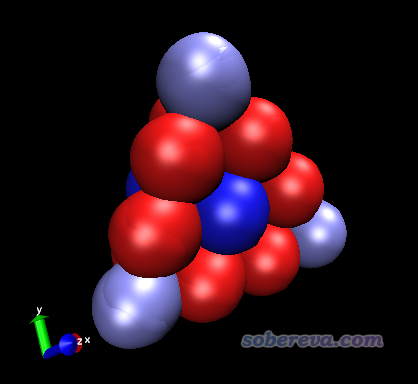
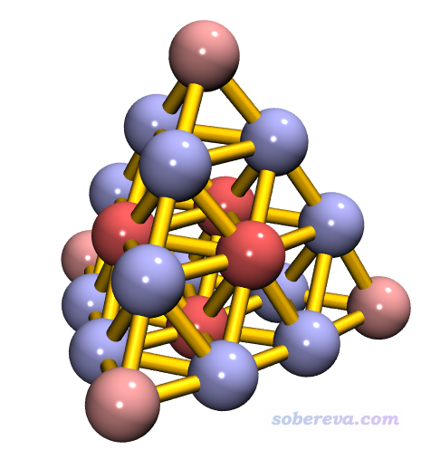
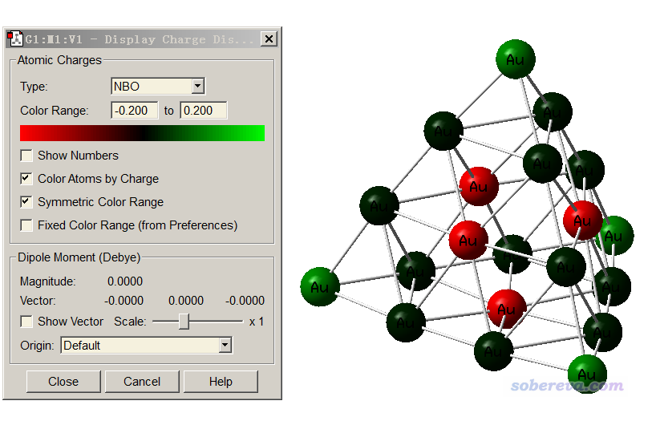
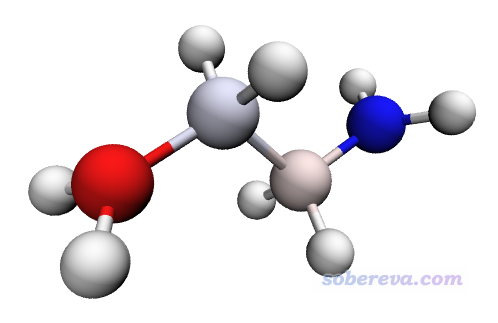
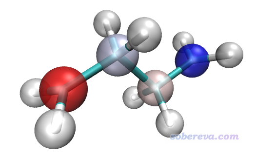
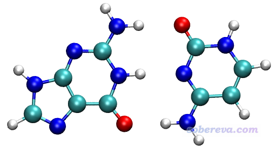
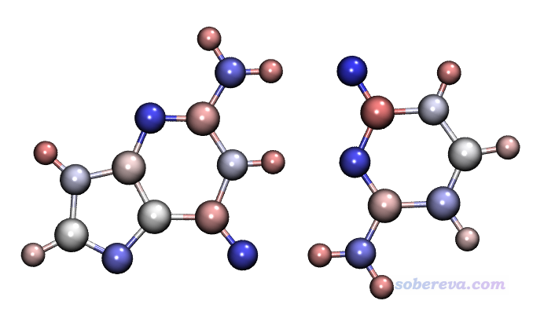
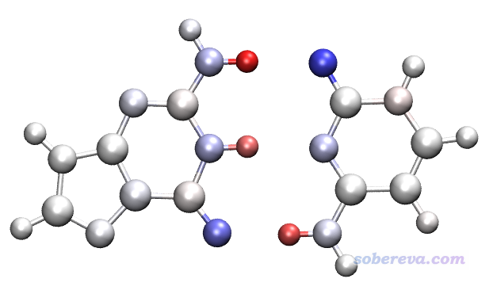
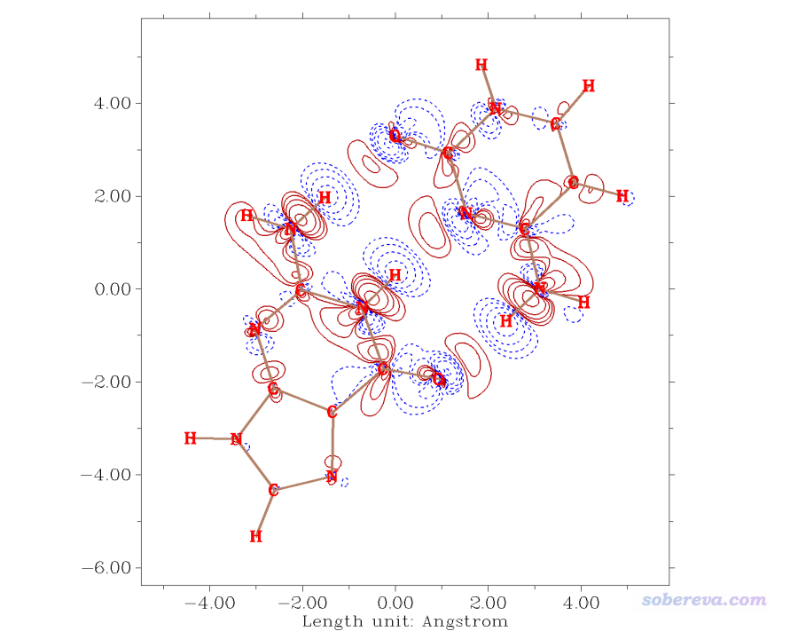
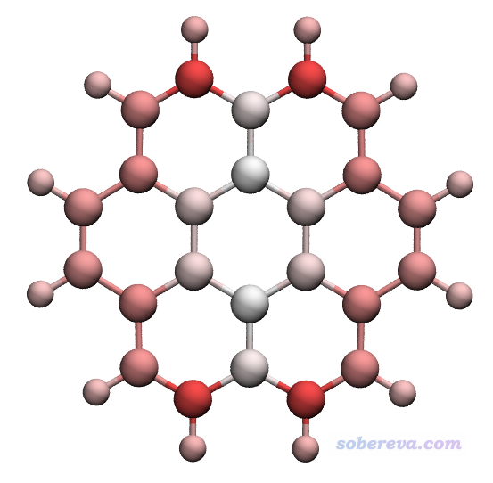

**使用Multiwfn+VMD以原子着色方式表现原子电荷、自旋布居、电荷转移、简缩福井函数**

Using Multiwfn+VMD to exhibit atomic charges, spin populations, charge tansfer and condensed Fukui function via coloring atoms

文/Sobereva @[北京科音](http://www.keinsci.com)   2018-Jun-3

## 0 前言

在图像中表现原子电荷分布、原子自旋布居的时候通常都是将数值标在原子上面，但当原子很多的时候，就会导致图像上的数字密密麻麻，难以辨认，而且也不好直观去考察。有一种做法可以解决这个问题，就是通过原子的颜色来表现其原子电荷、自旋布居等属性的正负和大小，这样非常直观。在VMD程序中支持这种着色方式，在笔者之前一个文章中也利用过这种做法，见《将GROMACS的原子电荷信息读入VMD的方法》（<http://sobereva.com/365>）。在笔者的《通过独立梯度模型(IGM)考察分子间弱相互作用》（<http://sobereva.com/407>）一文中也利用了原子着色方法，表现了各个原子对指定的弱相互作用的贡献。

Multiwfn程序主功能7在计算完原子电荷后可以导出记录原子坐标和原子电荷的.chg格式的文件，它和常见的.xyz格式的唯一区别是每个原子后面增加了一列，用于记录原子电荷。对于2018年6月3日及以后更新的Multiwfn程序，如果以这种.chg文件作为输入文件，那么在主功能100的子功能2当中可以导出.pqr格式。pqr格式和pdb格式关键差异在于多增加了两列，一列记录原子电荷，另一列记录原子半径。.pqr是可以直接载入到VMD程序中的，而且载入后可以直接根据原子的电荷值来着色。本文就举几个例子完整说一下操作，并且把这种做法用于展示原子自旋布居、原子电荷的变化、简缩福井函数上。

Multiwfn可以在其主页<http://sobereva.com/multiwfn>上免费下载，本文用的是2018年6月3日更新的3.6(dev)版。如果对Multiwfn不了解，看《Multiwfn入门tips》（<http://sobereva.com/167>）和《Multiwfn波函数分析程序的意义、功能与用途》（<http://sobereva.com/184>）。如果不了解原子电荷，看《原子电荷计算方法的对比》（<http://www.whxb.pku.edu.cn/CN/abstract/abstract27818.shtml>）。本文用的VMD是1.9.3版，可以在<http://www.ks.uiuc.edu/Research/vmd/>免费下载。

本文涉及到的各种文件可以在这里下载：<http://sobereva.com/attach/425/file.rar>

## 1 用着色方式展现Au20团簇的原子电荷

此例我们用原子着色方式展示一下正四面体的20个Au组成的Au20团簇的原子电荷分布，这里用笔者提出的普适性和合理性良好的ADCH原子电荷，原文见<http://dx.doi.org/10.1142/S0219633612500113>，<http://sobereva.com/714>里介绍的笔者的综述文章的末尾的横向测试也充分证明了ADCH电荷很出色。启动Multiwfn，依次输入  
Au20.fch  
7  //布居分析  
11  //ADCH电荷  
1  //使用内置的球对称化密度计算ADCH电荷

算完之后，程序问你是否在当前目录下导出Au20.chg文件，选择y。之后，重启Multiwfn（也可以退回到主菜单然后选隐藏选项-11来重新进入选择输入文件的界面），载入Au20.chg。之后进入主功能100，选择子功能2，此时的选项1对应于输出.pqr文件，选择这个选项，然后输入Au20.pqr。此时Au20.pqr就在当前目录下产生了。此文件可以用文本编辑器打开，其倒数第一列是原子的Bondi范德华半径，倒数第二列就是.chg文件里记录的ADCH原子电荷了。

启动VMD，把Au20.pqr拖入VMD Main窗口载入，进入Graphics - Representation，把Coloring Method设为Charge（按照原子电荷那一列着色），把Drawing Method设为VDW，此时看到各个原子以不同颜色展示了，如下所示。

接下来我们调节选项来改进图像效果：  
(a)关闭坐标轴：选择Display-Axes-Off  
(b)把背景设为白的：在VMD的命令行窗口输入color Display Background white  
(c)修改色彩刻度变化方式：默认是RWB方式色彩变化，即红-白-蓝，我们选择Graphics-Colors-Color scale，Method设为BWR，这样原子电荷从最小变化到最大就对应于蓝-白-红方式的色彩变化了  
(d)修改圆球尺寸和材质：在Representation界面里把Sphere Scale设为0.5，然后把Material设为Glossy，这比默认的材质更有光泽感  
(e)修改色彩刻度：在Representation界面的Trajectory标签页里把Color Scale Data Range下限和上限分别设为-0.15和0.15然后按回车（默认的色彩刻度是卡着最小值和最大值设定的，即-0.06~0.11，此时颜色变化过大，不那么柔和。我们把数值范围设大一点，而且让上限和下限绝对值相同，这样色彩更舒服，而且还便于直接通过偏蓝还是偏红来判断电荷是正值还是负值）  
(f)增加键连显示：在Representation界面里点击Create Rep，Coloring Method设Color ID，旁边的框选32 orange，Material设AOEdgy，Drawing Method设DynamicBonds，把Distance Cutoff设3.6，Bond Radius设0.2  
此时效果应该已经很好了，应确保已经开了GLSL（Display-Rendermode-GLSL），这样效果才能充分展现。如果要效果更好，可以用内置的Tachyon渲染器渲染，见此文的说明《用Multiwfn+VMD做RDG分析时的一些要点和常见问题》（<http://sobereva.com/291>）。Tachyon渲染后的图像如下

从图中可见处于每个面中间和顶角的金带微量正电荷，其它原子带微量负电荷。由于这个体系中每个原子带电量很小，因此不同原子电荷计算方法算出的结果正负号可能不同，没必要太纠结于此。

值得一提的是，平时常用的gview也能根据原子电荷进行着色。载入Gaussian输出文件或者fch文件，选Results - Charge distribution，按照如下设置即可显示（当前显示的是NPA电荷）

然而，跟VMD的效果一比，gview的效果简直丑爆了。不仅色彩变化方式没法改，而且模型很难看、缺乏灵活的可调节设定。

## 2 用着色方式展现丁烷双自由基的自旋布居

如果不了解自旋布居，看《谈谈自旋密度、自旋布居以及在Multiwfn中的绘制和计算》（<http://sobereva.com/353>）。这一节我们通过原子着色方式直观展现丁烷双自由基的自旋密度在各个原子上的净分布量。这个体系在以前的博文中出现过多次，见《CASSCF计算双自由基以及双自由基特征的计算》（<http://sobereva.com/264>）、《谈谈片段组合波函数与自旋极化单重态》（<http://sobereva.com/82>）、《在Multiwfn中基于fch产生自然轨道的方法与激发态波函数、自旋自然轨道分析实例》（<http://sobereva.com/403>）。本文用的丁烷双自由基的fch文件是用对称破缺DFT计算得到的。我们首先计算这个体系的原子自旋布居，这里就用常用的Becke方法计算。

启动Multiwfn，依次输入  
C4H8.fch  
15  //模糊空间分析  
1   //对原子空间积分。默认是Becke方式划分原子空间  
5   //积分自旋密度  
然后按照Multiwfn手册5.4节的方法，把屏幕上输出的自旋布居拷出来：  
 0.81112088  
  0.00391514  
  0.00391514  
 -0.04754640  
  0.01069745  
  0.01069745  
  0.04754640  
 -0.01069745  
 -0.01069745  
 -0.81112088  
 -0.00391514  
 -0.00391514  
之后，我们回到主菜单，进入主功能100的子功能2，选择导出.xyz文件。手动编辑此文件，把开头两行去掉（原子坐标和注释行），然后利用Ultraedit等专业文本编辑器的列模式，把上面的自旋布居粘到.xyz文件最后一列，之后把文件后缀改为.chg。处理好的文件就是本文的文件包里的C4H8.chg。

把C4H8.chg载入Multiwfn，按照上一节的做法转换成C4H8.pqr。此时此文件里原子电荷那里一列就对应于原子自旋布居了。（值得一说的是，xyz和chg都是自由格式，手动编辑方便，而pqr文件是固定格式，手动编辑不便，所以此例才先手动编辑得到chg文件再转换成pqr文件）

把C4H8.pqr拖到VMD里，Drawing Method用CPK，Material用Diffuse，还是根据Charge进行着色，把色彩刻度范围从默认的-0.81~0.81改小到-0.2~0.2，这样可以让自旋布居绝对值比较小的原子也能稍微有一点颜色（否则中间两个原子由于自旋布居太小，完全是白的）。此时看到的图像如下

此图展现出未成对电子主要分布在两端的碳原子上，而且自旋方向相反。而中间的碳原子也带微量单电子，所以不是纯白色。

从上图中看不出各个原子是什么元素，如果通过颜色又想体现出元素，又想展现出原子属性值，那么可以用两个Rep。我们把目前已经有个一个Rep删掉，即点击Delete Rep按钮，然后点Create Rep建立一个新Rep，用Charge着色，用VDW风格显示，材质设Transparent，Sphere Scale设0.3，色彩范围还用-0.2~0.2。然后再点击Create Rep，用Name着色，用Licorice风格显示，材质用Opaque。然后进入Graphics-Material，把Transparent的Opacity设0.7降低其透明度。此时用自带的Tachyon渲染器渲染出的图如下

可见元素和原子的自旋布居大小同时展现了出来，互不干扰。

## 3 根据原子电荷体现示意鸟嘌呤-胞嘧啶碱基对中的静电相互作用以及电荷转移

本文文件包中GC目录中的GC.xyz是鸟嘌呤(G)-胞嘧啶(C)碱基对的结构，两个碱基之间通过氢键维持二聚体的稳定结合。在《谈谈“计算时是否需要加DFT-D3色散校正？”》（<http://sobereva.com/413>）中提到，氢键的主要本质就是静电相互作用，多数情况静电相互作用又可以通过原子电荷之间的库仑作用近似描述，本例的体系就是这种情况。本例将对GC中的两个碱基都用原子着色方式展现其原子电荷，使得静电相互作用可以较直观地考察。

本例绘制过程不能像本文第1节那样直接对二聚体计算原子电荷然后绘图。因为两个单体结合在一起的过程中，原子电荷也会发生变化。对二聚体计算的原子电荷，相当于是已经发生了电荷转移、极化之后的情况了，而不是体现两个单体原本的电荷分布。而要想描述单体间的静电相互作用，我们应当用单体原本的电荷分布来表现。这类似于笔者之前在《使用Multiwfn结合VMD分析和绘制分子表面静电势分布》（<http://sobereva.com/196>）中通过静电势填色的范德华表面穿透图展现水二聚体中的静电相互作用，当时就是对两个单体分别计算产生的范德华表面，而非是对二聚体进行的计算。

我们首先把G、C的坐标从xyz文件中提出来，改写成.gjf文件，关键词用# M062X/6-311G** nosymm。注意这里nosymm很重要，不写这个的话，单体计算时Gaussian会自动平移和旋转体系坐标到标准朝向，这样得到的单体的fch文件里的坐标就和复合物不同了，之后绘图会比较麻烦。关于nosymm此文有更多讨论：《谈谈Gaussian中的对称性与nosymm关键词的使用》（<http://sobereva.com/297>）。

对G.gjf和C.gjf用Gaussian计算，得到G.fchk和C.fchk，然后再用Multiwfn计算，产生记录了ADCH电荷的G.chg和C.chg，之后再转换为G.pqr和C.pqr。之后，把这俩文件拖进VMD，在Representation界面里把显示设定都设为相同，都用CPK风格，用charge着色，色彩刻度都设成-0.5~0.5，用BWR色彩过渡方式，材质用EdgyShiny，看到的图像如下

从图中的原子颜色可见，两个单体是以原子电荷正负互补的方式结合的，即带正电的氢（粉色）与带负电的氮或氧原子（蓝色）紧密接触，这种正负电荷间的静电吸引正是氢键作用的主要本质。

接下来，我们通过原子着色直观考察一下形成二聚体时各个原子电荷的变化情况，这要计算二聚体状态的原子电荷与单体的原子电荷的差值。笔者发现用ADCH电荷（原子偶极矩校正的Hirshfeld电荷）计算这个体系的二聚过程的原子电荷变化不太理想，和密度差图差异较大，原因是因为Hirshfeld权重函数本身不太理想（过于平滑、随径向距离收敛太慢），如果改用权重函数收敛更快的Becke划分就没这个问题了。因此下面使用原子偶极矩校正的Becke电荷考察当前问题，计算这种电荷就是在Multiwfn主功能7里面选子功能10。

对GC.fch进行计算，得到GC.chg，然后把GC的原子电荷，以及对G和C分别计算的原子电荷都拷到Excel里（文件包里的charges.xls），令GC的电荷减去G和C的原子电荷，从而得到形成二聚体时原子电荷的变化量。然后把GC.chg复制成GCdiff.chg，把其中的原子电荷替换为刚才算出来的原子电荷的变化量。之后把GCdiff.chg转化为GCdiff.pqr，用VMD作图，色彩刻度用-0.1~0.1，色彩刻度用BWR，得到下图

红色和蓝色的原子分别对应于形成二聚体后原子电荷增加和减小的原子。可见形成二聚体后氢键中的氢原子失去了电子，原子电荷变得更正，因此呈红色；氢键受体重原子呈蓝色，说明原子电荷有所减小，明显得了电子。氢键给体重原子也同样得了一定电子，但得的量很少，因此呈淡蓝色。

可以用Multiwfn绘制此二聚体的片段密度差图，方法见《使用Multiwfn作电子密度差图》（<http://sobereva.com/113>），所得图像如下，红色实线和蓝色虚线分别对应形成二聚体时电子密度增加和减小的部分。

可见密度差图和上面根据原子偶极矩校正的Becke电荷的结论一致，在氢键的氢附近确实电子密度减小了。

## 4 对原子根据简缩福井函数着色

之前笔者在《基于Multiwfn产生的cube文件在VMD和GaussView中绘制填色等值面图的方法》（<http://sobereva.com/402>）中举了一个绘制晕苯的福井函数f-的例子，没看过的一定要看一下。这回我们计算简缩福井函数f-，并用原子着色方式展现。不了解福井函数者参看“概念密度泛函综述和重要文献合集”（<http://bbs.keinsci.com/thread-384-1-1.html>）。

晕苯的N电子和N-1电子状态的fch文件都在本文的文件包里的coronene目录下，对这两个fch文件都计算Hirshfeld原子电荷。用这个电荷是因为在笔者写的《亲电取代反应中活性位点预测方法的比较》（物理化学学报, 30, 628 (2014) <http://www.whxb.pku.edu.cn/CN/abstract/abstract28694.shtml>）等文章中都体现Hirshfeld电荷在各种原子电荷中相对来说较适合讨论反应位点问题。然后把N和N-1态的原子电荷放到Excel里，令N-1态的原子电荷减去N态的原子电荷，即得到简缩福井函数f-，将其数值写入到对应于此体系的chg文件的最后一列（即coronene.chg），再转换为coronene.pqr。用VMD作图，以CPK显示，色彩刻度用-0.07~0.07，色彩变化用BWR，得到下图

图中越红的原子，拥有越大的简缩福井函数f-，因此越容易发生亲电反应。可以将此图和《基于Multiwfn产生的cube文件在VMD和GaussView中绘制填色等值面图的方法》里的f-等值面图以及把f-投影到分子表面上的图对比，会看到传达的信息是相同的，只不过表现形式不同而已。

注：明显更简单、省事的计算简缩福井函数的做法是用Multiwfn的专用功能，敲几下键盘就能直接算出来所有类型的简缩福井函数和简缩双描述符，见《使用Multiwfn超级方便地计算出概念密度泛函理论中定义的各种量》（<http://sobereva.com/484>）。

最后值得一提的是，本文这种对原子着色表现原子属性的做法是极度普适的，绝不仅仅限于文中讨论的情况。比如还可以用这种方法表现Multiwfn计算出来的原子跃迁电荷、原子对分子轨道（或NTO等其它轨道）的贡献、原子对空穴/电子分布的贡献、原子偶极矩的大小、原子的电子动能（原子空间内对动能密度的积分）、原子的源函数值、原子的简缩双描述符、电子激发前后电荷的变化、外加电场前后电荷的变化等等。而其它程序计算的原子极化率、原子受力大小等也都可以用这种方式展现。
