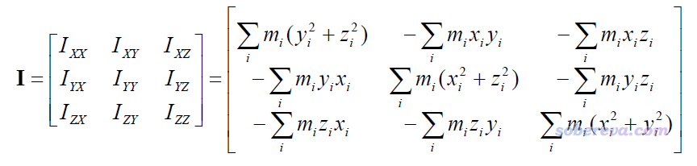
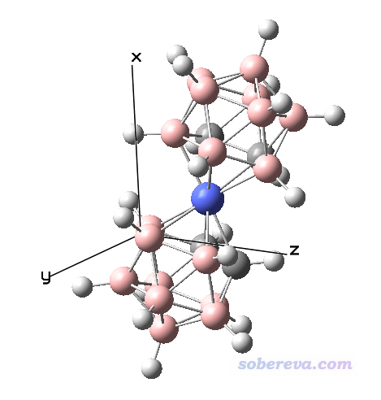
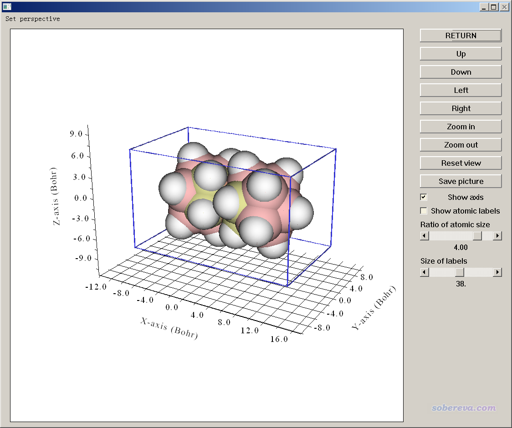
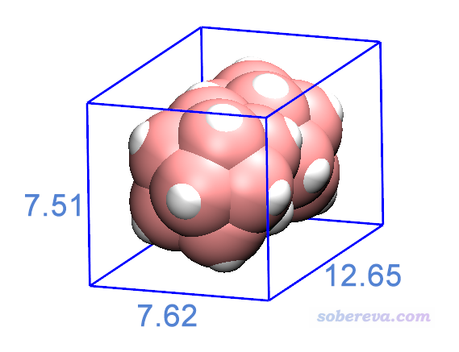
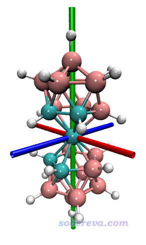
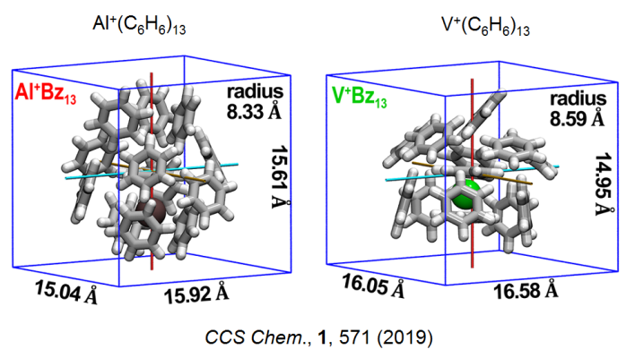
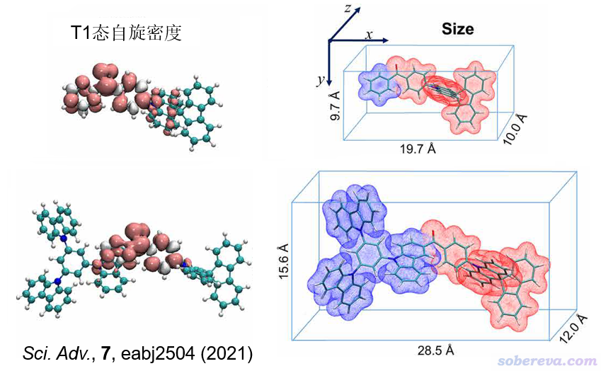

**使用Multiwfn计算分子的长宽高以及显示分子的主轴**

Using Multiwfn to calculate the length, width and height of molecules

文/Sobereva @[北京科音](http://www.keinsci.com)

First release: 2018-Jun-10  Last update: 2021-Oct-23

## 0 前言

经常有人问怎么计算分子的长宽高，之前笔者在《谈谈分子半径的计算和分子形状的描述》（<http://sobereva.com/190>）一文中也曾讨论分子的长宽高怎么算，但那个博文用的蒽的例子过于简单，而实际分子形状往往比较复杂，而且结构文件里的分子的朝向可能歪斜着，没法直接用那篇博文里的做法。本文介绍通过Multiwfn程序非常方便、准确地计算长宽高的做法。读者请务必使用最新版本Multiwfn，可以在官网<http://sobereva.com/multiwfn>下载。如果读者对Multiwfn不了解，看《Multiwfn入门tips》（<http://sobereva.com/167>）和《Multiwfn FAQ》（<http://sobereva.com/452>）。没看过《谈谈分子半径的计算和分子形状的描述》的读者应先看一下了解相关基本知识。

## 1 计算分子长宽高的原理

计算长宽高的第一步，是先把分子“摆正”，让分子最长的轴冲着某个笛卡尔轴。手动在可视化程序里旋转不准确，而且比较麻烦。一个自动化的做法是计算分子的惯性矩张量，如下所示：  
 

式中x,y,z是相对于质心的原子坐标，m是原子质量。这个3*3矩阵的三个本征矢对应分子的三个主轴，彼此正交，相应的本征值是绕着主轴的转动惯量。最小的本征值对应的主轴是分子的最长轴，最大的本征值对应的是分子的最短轴。因此，如果我们旋转分子，让分子的三个主轴朝向正好对应三个笛卡尔轴，分子就被摆正了。代码实现其实很容易，就是利用惯性矩张量的本征矢矩阵来对各个原子的坐标做个线性变换而已。

摆正之后，寻找x坐标最小的原子，减去其范德华半径，记为xmin；寻找x坐标最大的原子，加上其范德华半径，记为xmax，则x方向尺寸就是xmax-xmin。类似地，对y、z方向也都这么计算。这样分子的长、宽、高就都有了。

当然，能用长宽高来描述一个分子，前提是这个分子必须能够通过矩形来比较好地描述，诸如一个分子是月亮形，或者比如碳纳米管侧面接出来一个长链，或者是一个四面体形的团簇，此时长宽高这种描述就没什么意义，且有误导性。而且，注意很多大分子有很多不同构象，不同构象的长宽高算出来可能差异很大，这种情况也不适合用长宽高这种概念说事。另外，还有的分子用球形、柱形、椭球形等形式描述更恰当，此时也不要局限于用长宽高来描述。

## 2 计算长宽高实例

例如当前有一个pdb文件，用可视化程序打开后，看到其朝向和位置如下图所示。我们想计算其长宽高

.mol、.xyz、.pdb、.fch等含有结构信息的Multiwfn可以识别的格式都可以直接载入到Multiwfn里面计算长宽高。什么格式含有什么信息看《详谈Multiwfn支持的输入文件类型、产生方法以及相互转换》（<http://sobereva.com/379>）。启动Multiwfn后，载入此pdb文件，然后依次输入  
100  //主功能100  
21   //输出各种描述体系结构的信息  
size  //计算分子尺寸  
此时程序自动把体系平移和旋转，各个主轴都分别冲着各个笛卡尔轴了。屏幕上显示以下信息  
Farthest distance:   21(H )  ---   45(H ):    10.250 Angstrom  
 vdW radius of   21(H ): 1.200 Angstrom  
 vdW radius of   45(H ): 1.200 Angstrom  
 Diameter of the system:    12.650 Angstrom  
 Radius of the system:     6.325 Angstrom  
 Length of the three sides:    12.650     7.513     7.619 Angstrom

从中可以看到，体系中相距最远的两个原子是H21和H45，二者的Bondi范德华半径也输出了，将俩原子的范德华半径加到它们之间的距离上，就是屏幕上输出的体系的直径，屏幕上输出的半径是其一半。可见利用Multiwfn计算分子半径/直径很方便。Length of the three sides后面的三个值就是体系的三个边长，可以被视为长宽高。

如果想把长宽高图形化地展现一下，选择屏幕上的选项1 Visualize the new orientation and molecular box，会看到下图，图中蓝色方框的三个边长正对应于分子的长宽高。下图把Ratio of atomic size设为了4.0，此时图上原子球的半径正对应于Bondi范德华半径，可见蓝色方框正好卡着范德华表面。

如果想把坐标已经被Multiwfn旋转后的当前体系导出成pdb文件，从而能在VMD等程序中显示，可以选择2 Export the geometry in new orientation as new.pdb in current folder，此时当前目录下就会产生new.pdb。此文件中有个CRYST1字段，记录了此体系的长宽高。如果用VMD程序（<http://www.ks.uiuc.edu/Research/vmd/>）载入此pdb文件，就会读入盒子信息，并可以绘制出来。

把new.pdb拖到VMD里载入，然后在命令行窗口输入pbc box，盒子就被显示出来了。将背景改为白色，选Display-Orthographic用正交视角，在Graphics-Representation里把体系设置以VDW风格显示，然后把长宽高手动ps到图上去，就看到了下图的效果。

顺带一提，利用VMD的绘图命令，还可以把主轴绘制出来。把new.pdb载入到VMD后，把以下内容复制到VMD的命令行窗口运行（最后要按一次回车确保最后一条命令运行了）  
set lena [molinfo top get a]  
 set lenb [molinfo top get b]  
 set lenc [molinfo top get c]  
 set cenx [expr $lena/2]  
 set ceny [expr $lenb/2]  
 set cenz [expr $lenc/2]  
 draw color red  
 draw cylinder "$cenx $ceny 0" "$cenx $ceny $lenc" radius 0.15 resolution 20  
 draw color green  
 draw cylinder "0 $ceny $cenz" "$lena $ceny $cenz" radius 0.15 resolution 20  
 draw color blue  
 draw cylinder "$cenx 0 $cenz" "$cenx $lenb $cenz" radius 0.15 resolution 20

调节显示方式为CPK，然后就会看到下面的图像，红绿蓝三个圆柱对应于三个主轴

下面是两篇已发表的文章中使用Multiwfn的这个功能的实例

下图中对分子不同片段表面分别着色突出显示的做法见《使用Multiwfn和VMD计算分子表面积和片段表面积》（<http://sobereva.com/487>）。

