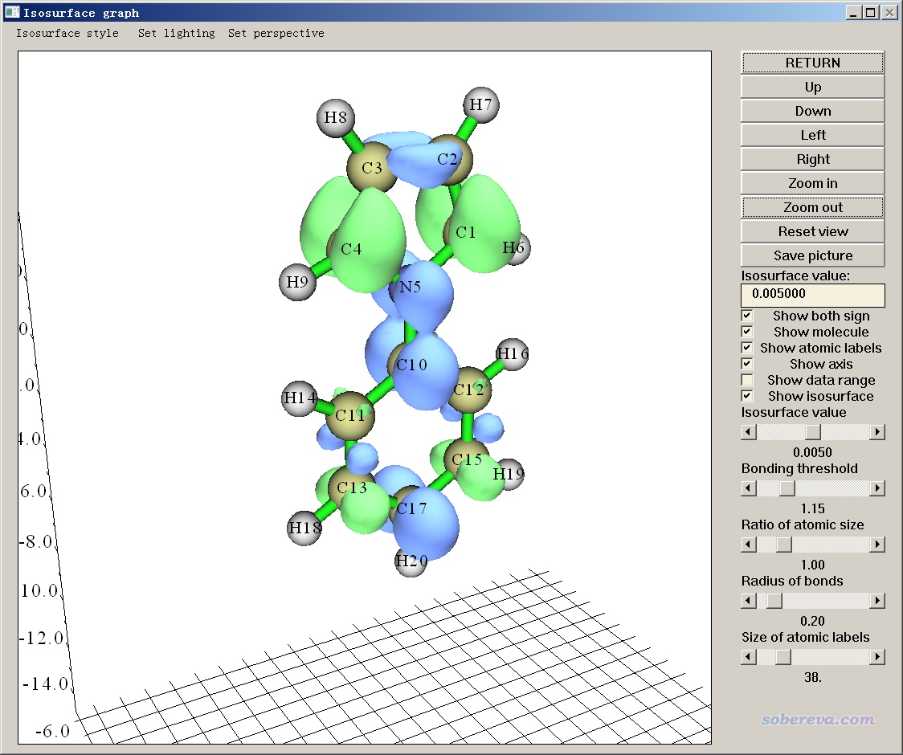

**使用Multiwfn计算激发态之间的密度差**

Using Multiwfn to calculation electron density difference between excited states

文/Sobereva @[北京科音](http://www.keinsci.com)

First release: 2018-Jul-28   Last update: 2022-Jul-14

## 1 前言

使用Multiwfn计算密度差、绘制各种密度差图形非常简单，在《使用Multiwfn作电子密度差图》（<http://sobereva.com/113>）中有充分示例，其中也包括绘制激发态与基态间的密度差，这对于讨论电子跃迁过程中的电子转移特征很有意义。对Multiwfn稍有了解的人肯定也都明白，通过Multiwfn同样也可以绘制激发态之间的密度差，只要让Gaussian等量化程序输出记录了相应两个激发态的波函数的文件，然后按照常规步骤绘制密度差即可。

但是，有时由于特殊需要，我们要对一大批激发态两两之间计算密度差，如果用量子化学程序对每个激发态都做一次计算来产生记录了其波函数的文件，显然是很繁琐的事情；即便可以用脚本自动化实现，但总耗时也比只做一次电子激发计算高很多。好在Multiwfn可以读取Gaussian等程序的激发态计算任务的输出文件，一次性就能把各个激发态的.mwfn文件全都产生出来。.mwfn是Multiwfn支持的记录波函数信息的一种格式，见《详谈Multiwfn支持的输入文件类型、产生方法以及相互转换》（<http://sobereva.com/379>），对于TDDFT等方法计算的激发态，这样得到的.mwfn文件里记录的是激发态的自然轨道。之后想对哪两个激发态之间绘制密度差就利用哪两个态的.mwfn文件即可，非常方便，本文就结合Gaussian示例一下操作。更多关于此功能的说明可参见Multiwfn手册3.21.13节。

另外，有了激发态的.mwfn文件后，将之载入Multiwfn后还可以对激发态做各种波函数分析，比如计算电荷分布、键级等等，分析实例可参看《在Multiwfn中基于fch产生自然轨道的方法与激发态波函数、自旋自然轨道分析实例》（<http://sobereva.com/403>）等文章。

Multiwfn可以从其主页<http://sobereva.com/multiwfn>上免费下载，不了解Multiwfn的读者建议参看《Multiwfn入门tips》（<http://sobereva.com/167>）和《Multiwfn波函数分析程序的意义、功能与用途》（<http://sobereva.com/184>）。Gaussian用的是G16W A.03。本文涉及的文件可在此下载：[file.zip](http://sobereva.com/attach/429/file.zip)

## 2 实例：绘制N-苯基吡咯的激发态之间的密度差

首先使用以下输入文件，在PBE0/6-31G*级别下做TDDFT计算，得到最低五个单重态激发态的信息。IOp(9/40=4)是为了让Gaussian输出所有绝对值大于1E-4的组态系数，这些组态系数连同基态分子轨道将被用于构建激发态自然轨道。不写IOp(9/40=4)的话，默认情况下只输出绝对值大于0.1的组态系数，此时Multiwfn产生的激发态自然轨道将很不准确。

%chk=C:\N-phenylpyrrole.chk  
# PBE1PBE/6-31g(d) TD(nstates=5) IOp(9/40=4)  
  
B3LYP/6-31G* opted  
  
0 1  
 C                 -0.00000000    1.12162908    1.82507914  
 C                 -0.00000000    0.71310006    3.13457424  
 C                 -0.00000000   -0.71310006    3.13457424  
 C                 -0.00000000   -1.12162908    1.82507914  
 N                 -0.00000000    0.00000000    1.00627307  
 H                 -0.00000000    2.11821416    1.41565311  
 H                 -0.00000000    1.36582111    3.99707730  
 H                 -0.00000000   -1.36582111    3.99707730  
 H                 -0.00000000   -2.11821416    1.41565311  
 C                  0.00000000   -0.00000000   -0.41287403  
 C                  0.00000000   -1.20626109   -1.13056908  
 C                  0.00000000    1.20626109   -1.13056908  
 C                  0.00000000   -1.20041809   -2.52387419  
 H                  0.00000000   -2.15723816   -0.61186005  
 C                  0.00000000    1.20041809   -2.52387419  
 H                  0.00000000    2.15723816   -0.61186005  
 C                  0.00000000   -0.00000000   -3.23381724  
 H                  0.00000000   -2.14896316   -3.05414223  
 H                  0.00000000    2.14896316   -3.05414223  
 H                  0.00000000   -0.00000000   -4.31975533

将得到的chk用formchk转换为fch文件。然后启动Multiwfn，依次输入  

N-phenylpyrrole.fch  //刚得到的fch文件。里面记录的是基态的DFT轨道  
18   //电子激发分析  
13   //产生激发态的.mwfn文件  
N-phenylpyrrole.out  //刚得到的输出文件  
1-3   //假设当前我们只需要产生前三个激发态的.mwfn文件  
马上，当前目录下就产生了NO_0001.mwfn、NO_0002.mwfn、NO_0003.mwfn，分别是记录了第1、2、3激发态自然轨道的.mwfn文件。

假设我们目前想考察第3激发态（S3）与第1激发态（S1）之间的密度差的等值面图，就重启Multiwfn，然后输入  
NO_0003.mwfn  
5  //计算格点数据  
0  //自定义操作  
1  //之后有一个文件会作用到一开始载入的文件上  
-,NO_0001.mwfn   //令NO_0003.mwfn的属性减去NO_0001.mwfn的属性  
1   //属性设为电子密度  
2   //中等质量格点  
-1   //观看等值面图  
在图形窗口中把等值面数值设小到0.005，看到下图。绿色区域为正，蓝色区域为负，分别代表S3比S1密度多和少的区域。

实际上之后还可以做更多的分析，比如可以按照手册4.13.6节示例的将密度差转化为电荷位移曲线、按照手册4.18.3节示例的将密度差的正、负部分平滑化为高斯分布并计算电荷转移长度等等，这里就不再多述了。

Multiwfn如上方式产生的激发态的.mwfn文件对应的是非弛豫的激发态密度，这没有弛豫的激发态密度那么真实，但好处是不需要额外耗时。如果非要用弛豫的激发态密度来求差，那就不得不对每个激发态分别做计算来产生波函数文件了，而且每次耗时和计算激发态能量梯度的耗时相仿佛，故代价较高。使用比如# PBE1PBE/6-31g(d) TD(nstates=5,root=3) out=wfn关键词所产生的.wfn文件记录的就是第3激发态的弛豫密度对应的自然轨道。关于弛豫和非弛豫密度的更多信息见<http://bbs.keinsci.com/thread-5738-1-1.html>。
