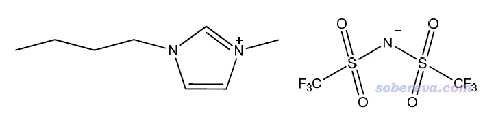

**通过SMD溶剂模型描述离子液体溶剂环境的方法**

The method to describe solvent environment of ionic liquid via SMD solvation model

文/Sobereva @[北京科音](http://www.keinsci.com)  2018-Aug-7

离子液体已被广泛作为溶剂。常有人问离子液体溶剂环境怎么在量子化学计算中体现，本文就专门说一下。阅读本文之前务必先阅读《谈谈隐式溶剂模型下溶解自由能和体系自由能的计算》（<http://sobereva.com/327>）了解基础知识。

## 1 原理

Truhlar搞出来的SMD溶剂模型是一种比较普适的隐式溶剂模型。原理上，只要你给了溶剂的以下参数，就可以通过SMD溶剂模型描述溶剂环境：  
● 静态介电常数eps(298K)  
● 动态介电常数epsinf或折射率（前者是后者的平方）  
● Abraham氢键酸度：来自Abraham的一些文章  
● Abraham氢键碱度：来自Abraham的一些文章  
● 气液界面表面张力(298K)  
● 芳香度：溶剂分子中芳香碳占重原子（即非氢原子）的比例  
● 卤素度：溶剂分子中卤素占重原子（即非氢原子）的比例

对于SMD溶剂模型而言，离子液体作为溶剂并没有任何特殊性，只要提供了离子液体的以上参数，就可以用SMD恰当地描述离子液体溶剂环境。这种做法的可靠性在SMD原作者的一篇文章J. Phys. Chem. B, 116, 9122 (2012)中得到了充分验证，文中测试了一批常见的离子液体体系。从测试结果看，在计算溶解自由能的计算精度上，离子液体和普通分子作为溶剂的情况差不多，尽管对于有的离子液体误差比较大，比如[EMIM][PF6]。

用SMD描述离子液体的一个困难之处是很多离子液体的SMD参数找不全。如果你感兴趣的只是溶剂-溶质之间的极性部分作用还好，只需要定义eps，有些时候也需要定义epsinf（或折射率），这就够了，而其它参数不会被利用；而如果还需要考虑溶剂的非极性部分贡献，那就很麻烦，表面张力可能还不难找，但Abraham氢键酸度和碱度没地方搞去。

为了解决离子液体SMD参数往往找不全的问题，JPCB那篇文章里提出一个模型叫SMD-GIL，其中GIL是generic ionic liquid的缩写。这个模型并不是一个新的溶剂模型的形式，它的意思只不过是把除了芳香度和卤素度以外的SMD参数都直接设为许多离子液体实验上已知的参数的平均值。SMD-GIL的参数值在JPCB文中给了：  
静态介电常数=11.5  
折射率=1.43（折合动态介电常数=1.43^2=2.0449）  
Abraham氢键酸度=0.229  
Abraham氢键碱度=0.265  
表面张力=61.24 cal/mol/A^2  
而离子液体的芳香度和卤素度自己根据其化学组成手动一算就知道。

根据JPCB文中的测试，使用SMD-GIL参数计算和使用实际离子液体的实验参数做SMD计算得到的结果精度半斤八两，互有胜负。因此，通过SMD溶剂模型描述你用的离子液体，有实验值的参数可以直接用实验值，而没有的就用SMD-GIL给出的离子液体的平均参数代替即可，结果是合理的；或者如果你懒得找实验参数，则所有参数都用SMD-GIL的也完全没问题。JPCB文中也给出了一些常见离子液体的实验参数，见文中表1、3。

## 2 实例：计算乙醇在[BMIM][NTf2]中的溶解自由能

[BMIM][NTf2]的结构如下  
 

乙醇在[BMIM][NTf2]中的常温下的溶解自由能实验值为-3.76 kcal/mol（来自那篇JPCB文章补充材料Table S1.6，对应气相和溶剂下都是1M标准态浓度）。我们看看利用SMD-GIL的参数算出来的结果是多少。如《谈谈隐式溶剂模型下溶解自由能和体系自由能的计算》所述，我们先对结构优化，然后用M052X/6-31G*在溶剂模型下和气相下分别算个单点，求差就是常温下的溶解自由能（对应气相和溶剂下都是1M标准态浓度）。

SMD几乎是目前最流行的隐式溶剂模型，因此很多主流程序都已经支持SMD，比如Gaussian、NWChem、ORCA、GAMESS-US等（而非主流的Dmol3和ADF之流尚不支持）。这里我们用量化计算最常用的Gaussian作为例子，结构已经在B3LYP/TZVP下优化过（用什么级别优化无所谓，只要是合理级别即可，对溶解自由能计算结果影响很小）。

单点任务的输入文件如下：

# M052X/6-31G*  
  
B3LYP/TZVP opted  
  
0 1  
 C                  1.17643900   -0.39950500    0.00000000  
 H                  1.15236000   -1.03828400    0.88463100  
 H                  2.11738900    0.15557800    0.00000000  
 H                  1.15236000   -1.03828400   -0.88463100  
 C                  0.00000000    0.55417200    0.00000000  
 H                  0.04041900    1.20079700   -0.88644000  
 H                  0.04041900    1.20079700    0.88644000  
 O                 -1.20073500   -0.22291400    0.00000000  
 H                 -1.95570500    0.37470800    0.00000000  

溶剂模型下的单点任务的输入文件如下。这里我们自己完全自定义了一个新溶剂，除了芳香度和卤素度以外的溶剂参数就是上面提到的SMD-GIL的平均离子液体溶剂参数。

# M052X/6-31G* SCRF(SMD,read,solvent=generic)  
  
B3LYP/TZVP opted  
  
0 1  
 C                  1.17643900   -0.39950500    0.00000000  
 H                  1.15236000   -1.03828400    0.88463100  
 H                  2.11738900    0.15557800    0.00000000  
 H                  1.15236000   -1.03828400   -0.88463100  
 C                  0.00000000    0.55417200    0.00000000  
 H                  0.04041900    1.20079700   -0.88644000  
 H                  0.04041900    1.20079700    0.88644000  
 O                 -1.20073500   -0.22291400    0.00000000  
 H                 -1.95570500    0.37470800    0.00000000  
  
eps=11.5  
epsinf=2.0449  
HBondAcidity=0.229  
HBondBasicity=0.265  
SurfaceTensionAtInterface=61.24  
CarbonAromaticity=0.12  
ElectronegativeHalogenicity=0.24

上面文件中设的CarbonAromaticity就是芳香度，ElectronegativeHalogenicity是卤素度。[BMIM][NTf2]的化学组成为C10H15F6N3O4S2，重原子数（非氢原子数）为25，此体系中咪唑环上的碳属于芳香碳，数目为3，因此芳香度为3/25=0.12。体系中卤素有6个，因此6/25=0.24就是卤素度。

对两个文件用Gaussian16 A.03版进行计算，气相单点能为-154.9998251，溶剂下单点能为-155.0061949，因此溶解自由能为627.51*(-155.0061949+154.9998251)=-3.997 kcal/mol，和实验值-3.76 kcal/mol相符不错。
