**重要提示**：本文介绍的方法笔者已经发表于[Theor. Chem. Acc., 139, 25 (2020) DOI: 10.1007/s00214-019-2541-z](https://link.springer.com/article/10.1007%2Fs00214-019-2541-z)，其中专门对pi电子结构分析的算法和应用做了详细、深入的介绍和讨论，给了许多应用例子，本文读者看完后务必看一下这篇文章。使用本文提到的Multiwfn的功能的读者，**除了必须引用Multiwfn的原文以外**，**也务必同时引用上述文章**。

**2021-Sep-25****注**：笔者后来在Chemistry—Methods, 1, 231 (2021)中提出了IRI-pi分析方法，可以非常直观地考察pi作用类型（单重还是双重pi作用）以及pi作用强度，非常有实用价值，在《使用IRI方法图形化考察化学体系中的化学键和弱相互作用》（<http://sobereva.com/598>）做了介绍，对下文内容是重要的补充，请读者务必一看。

**在Multiwfn中单独考察pi电子结构特征**

Separate investigation of π electronic structure in Multiwfn

文/Sobereva @[北京科音](http://www.keinsci.com)

 First release: 2018-Aug-7  Last update: 2021-Oct-10

## 0 前言

对一些化学体系，特别是含有共轭特征的，我们往往只对其pi电子特征感兴趣，因为pi电子特征直接影响体系很多方面的性质，比如芳香性、反应活性和反应位点等。考察pi电子特征有很多不同手段，比如计算ELF（电子定域化函数）和LOL（定域化轨道定位函数）、计算pi电子布居、计算pi键级等等。Multiwfn是分析电子结构特别强大的工具，在Multiwfn中可以非常方便地对各种类型体系做各种形式的pi电子结构的分析，在本文就统一说一下。由于Multiwfn支持的分析方法极多，限于篇幅肯定不可能各种情况面面俱到都说一遍，希望读者能充分举一反三。

本文对应Multiwfn最新版本的情况，Multiwfn可以在其主页<http://sobereva.com/multiwfn>上免费下载。如果不了解Multiwfn，强烈建议参看《Multiwfn入门tips》（<http://sobereva.com/167>）、《Multiwfn FAQ》（<http://sobereva.com/452>），不知道怎么产生Multiwfn输入文件的读者应当看《详谈Multiwfn支持的输入文件类型、产生方法以及相互转换》（<http://sobereva.com/379>）。

为了便于表述，本文简单地把轨道分为pi轨道和sigma轨道两种，只要不属于前者的就算后者，哪怕这些轨道有的是并不是用于构成sigma键的内核轨道、孤对电子轨道。占据pi轨道的电子被称为pi电子。本文用的.fch文件皆为Gaussian 16 A.03版在B3LYP/6-31G*级别下计算产生，结构也在同级别优化过。

本文用到的输入文件皆可以在这里下载：[**file.rar**](http://sobereva.com/attach/432/file.rar)。

顺带一提，Multiwfn也可以以轨道方式展现孤对电子，以及计算分子轨道、NTO等轨道中孤对电子所占成份，参看Multiwfn手册4.200.6.2节的例子。

## 1 原理

在Multiwfn中，把sigma占据轨道占据数清零，而令pi占据轨道的占据数保持不变，那么接下来照常做的各种波函数分析就只由pi电子贡献了，即体现的就是pi电子特征。反之，如果想只研究sigma电子，那么把pi轨道占据数清零而令sigma轨道占据数保持不变再做分析即可。并非Multiwfn里所有功能都可以这么分离sigma和pi电子的贡献，但至少对所有三维空间函数的分析，以及本文提到的其它类型的分析，都是可以这么分离考察的。

在Multiwfn里，想修改轨道占据数，就进入主功能6的子功能26，根据提示选择轨道、输入要改成的占据数即可。要想找出来哪些是pi轨道，可以用Multiwfn的主功能0来依次观看，参见《使用Multiwfn观看分子轨道》（<http://sobereva.com/269>）。然而，对于较大体系，轨道数目很多，这么凭肉眼去找是非常费时费力的。万幸的是，Multiwfn专门提供了现成的功能，可以自动判断出pi轨道并设定这些轨道或其它轨道的占据数，这使得单独分析sigma和pi电子特征异常容易。对于纯平面体系（即所有原子恰在XZ或YZ或XY平面）和非纯平面体系，Multiwfn判断pi轨道的方法截然不同，尤其是对后者Multiwfn有独创的判断方法，因此在下文中，纯平面和非纯平面体系会分别举例。

另外，对于很多分析，对全部电子进行分析得到的结果并不等于单独分析pi和sigma电子的结果，此时注定没法严格精确做到分离sigma和pi的贡献。而那些结果可以精确分解为轨道贡献加和的分析方法，显然都是可以精确分解为sigma和pi的贡献的。对于常见的一些分析，情况是这样的：  
ELF：sigma和pi不可严格分离，即ELF-pi和ELF-sigma之和不等于ELF。对LOL也是如此。  
电子密度（及其梯度、拉普拉斯）、电子对静电势的贡献：可以严格分解为sigma和pi的贡献  
Mulliken键级、Laplacian键级：可以严格分解为sigma和pi的贡献  
Mayer键级、多中心键级：仅对于纯平面体系才可以严格分解为sigma和pi的贡献  
电子布居数、自旋布居数：可以严格分解为sigma和pi的贡献  
至于其它以上没有提及的分析，稍微推导一下公式，或者拿小体系测试一下，便知是否可以精确分离成sigma和pi的贡献。

## 2 对纯平面体系考察pi电子结构

下面举一些例子演示怎么对纯平面体系考察pi电子结构。

### 2.1 绘制菲的ELF-pi等值面图以及计算ELF-pi二分点数值

ELF是极为重要的衡量电子定域性和离域性的三维函数，不了解此函数的人应当参看《ELF综述和重要文献小合集》（<http://bbs.keinsci.com/thread-2100-1-1.html>）。计算ELF的时候若只考虑pi电子，得到的就是ELF-pi，这对于考察芳香性十分有价值，有机体系的芳香性也都是因为pi电子多中心离域而产生的。在《衡量芳香性的方法以及在Multiwfn中的计算》（<http://sobereva.com/176>）中笔者对ELF-pi有充分的介绍。

第一个例子，我们对一个典型的纯平面分子菲绘制ELF-pi等值面图。作为示例，首先我们用笨办法，即人工挑pi轨道来实现pi轨道占据数的清零。启动Multiwfn，载入本文文件包里的phenanthrene.fch，然后进入主功能0观看轨道。从文本窗口提示的信息可知，第47号轨道是HOMO。因此我们把轨道切换到47，然后依次把轨道按照序号从大小进行观看。只要发现pi轨道，就手动记录下来编号。由于当前体系一共有14个碳原子，每个碳原子上有一个pi电子，而当前体系是闭壳层，因此一共有14/2=7个pi占据轨道，即曰当我们从47号轨道开始按照序号减小依次观看轨道，总共找出来7个pi轨道时，就说明所有占据的pi轨道都已经找齐了。最后发现，这7个pi轨道编号是36,40,43-47。

之后，退出主功能0的图形界面，依次输入以下命令，就可以绘制出ELF-pi轨道图形了  
6  //修改波函数  
26  //修改某些轨道的占据数  
0  //选择所有轨道  
0  //把所选轨道占据数设为0  
36,40,43-47  //pi轨道编号  
2  //占据数设为2.0，即恢复这些pi轨道原先的占据数  
q  //退回上一级菜单  
-1  //退回到主功能菜单  
接下来，按照正常的步骤绘制ELF等值面图，得到的便是ELF-pi的等值面图了。依次输入  
5  //计算格点数据  
9  //ELF  
2  //中等质量格点  
-1  //观看等值面图  
等值面数值设为0.7，显示风格设为透明时看到的等值面图如下所示（若你旋转图像，会看到ELF-pi在分子平面上有个节面）

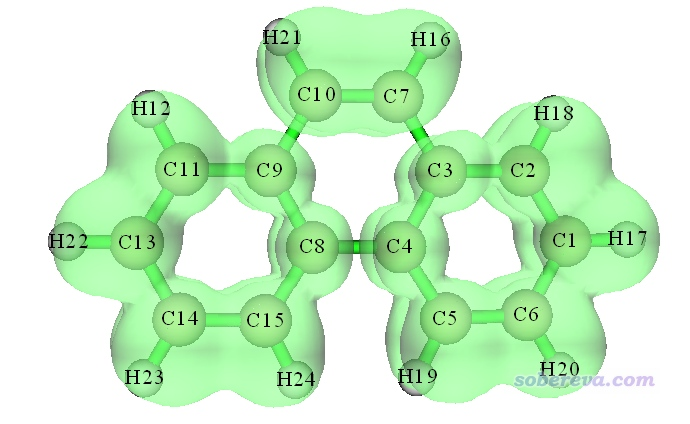

从这张图可以看到，两侧的六元环上的ELF-pi等值面是连通的，但中间六元环上的ELF-pi不是连通的，在C9-C10、C3-C7、C4-C8的地方都断开了，这体现出中央六元环上的pi电子六中心共轭程度明显不及边缘的六元环，因此芳香性不及两侧的六元环强。

一些文献中对体系会用ELF-pi二分点数值来衡量芳香性强弱，这个值就是对应多中心共轭的ELF-pi等值面刚断开时的等值面数值。我们仔细逐渐调节等值面数值，如下所示，会看到令中间六元环的ELF-pi等值面首次发生断裂的等值面数值约为0.53，而两侧的六元环上的ELF-pi等值面首次断裂的等值面数值约为0.765，这从定量角度上也体现出两侧六元环上的电子共轭程度明显更强。

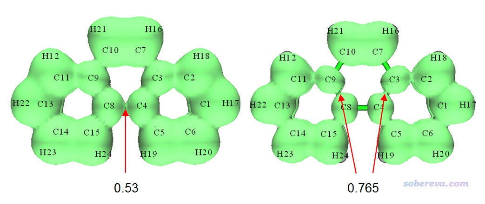

下面，我们来看如何让Multiwfn自动找出来pi轨道并把其它轨道占据数清零，从而以明显简单得多的方式就能得到上面的图。本例菲分子是个纯平面分子，用Gaussian对它做计算时，哪怕输入文件里它的结构是斜着的，由于Gaussian自动会把被计算的体系摆到标准朝向下，因此最终得到的fch文件里菲也会正好平行于某个笛卡尔平面。对于当前体系，你进入主功能0时，从屏幕上输出的坐标就可以看到当前体系所有原子都在YZ平面上，X坐标皆为0。像这种情况，可以直接让Multiwfn判断pi轨道。Multiwfn用的判断方法很简单，当程序检测到所有原子在YZ平面上时，如果一个轨道中S或PY或PZ型高斯函数的系数绝对值大于某个阈值，就认为这个轨道不是pi轨道，反之则是pi轨道。启动Multiwfn后只需要依次输入以下命令就可以实现pi以外轨道占据数清零的目的：  
phenanthrene.fch  
100  //主功能100  
22  //自动检测pi轨道并设定占据数  
0  //让程序自动判断体系在XY、YZ、XZ中的哪个平面上  
输出信息如下所示  
 This system is expected to be in YZ plane  
 Expected pi orbitals, occupation numbers and orbital energies (eV):  
    36      2.000000    -10.789622  
    40      2.000000     -9.671071  
    43      2.000000     -8.472032  
    44      2.000000     -7.649069  
    45      2.000000     -7.059917  
    46      2.000000     -6.033737  
    47      2.000000     -5.730233  
    48      0.000000     -0.993257  
    49      0.000000     -0.820463  
...略  
 Total number of pi orbitals:    56  
 Total number of electrons in pi orbitals:   14.000000  
 Total number of inner electrons:    28  
即程序找出来56个pi轨道（包括占据和非占据的），上面一共有14个电子，同时提示体系内核电子数有28个（每个碳的1s上的两个电子都是内核电子，当前14个碳，故2*14=28）。然后程序问你怎么处理这些轨道，屏幕上的提示写得非常清楚：  
1 把识别出的所有pi轨道占据数都清零  
2 把其它轨道的占据数都清零  
3 把价层pi轨道占据数清零  
4 把除了价层pi轨道以外的轨道占据数清零  
对于此例，我们为了获得ELF-pi，就选2就行了（如果你的目的是获得ELF-sigma，则显然应该选1）。之后退回到主菜单，然后按上文的步骤利用主功能5照常绘制ELF，即可得到ELF-pi的图。

如果你嫌调节ELF-pi等值面数值来找ELF-pi二分点数值的做法不够精确，那么可以用Multiwfn强大的拓扑分析模块来实现。此模块做拓扑分析不仅可以用于电子密度从而实现Atoms in molecules (AIM)分析，对任何Multiwfn支持的实空间函数原理上也都适用。关于拓扑分析模块的更多信息见《使用Multiwfn做拓扑分析以及计算孤对电子角度》（<http://sobereva.com/108>）。我们对ELF-pi进行拓扑分析，找出来的(3,-1)型临界点的位置和这个位置上的ELF-pi数值就分别对应于ELF-pi的二分点位置和此二分点的数值。

为了做ELF-pi拓扑分析，我们在按照如上方式把pi轨道以外的轨道占据数都清零并回到主菜单后，依次输入  
2  //拓扑分析  
-11  //切换做拓扑分析的实空间函数  
9  //ELF（如果想对LOL做拓扑分析，则此处选10）  
6  //在球型空间内随机撒初猜点做临界点的搜索（这种搜索方式适合ELF-pi、LOL-pi、电子密度拉普拉斯函数等分布特征与电子密度相差较大的函数）  
-1  //以每个原子核为中心的特定半径（默认为3 Bohr）的球形区域内撒初猜点并开始搜索。默认每个原子附近撒1000个。当前体系共24个原子，因此共尝试24*1000次临界点搜索。此过程耗时较高需耐心等待  
-9  //返回上一级菜单  
0  //观看临界点  
点击图形窗口右侧的相应选项，把临界点标签和原子标签显示出来，把(3,-1)以外的临界点都取消显示，此时看到的图如下所示（由于初猜点是随机撒的，你运行此例得到的临界点序号可能与图中的不同）

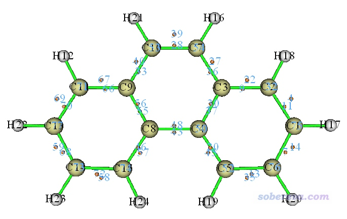

图中每一个桔色小圆球对应一个(3,-1)，也即ELF-pi的二分点。可见诸如43和48号临界点对应的就是C4-C8之间的二分点。如果要考察比如43号临界点的ELF-pi的数值，就在图形窗口右上角点击RETURN按钮关闭图形界面，然后选择选项7（查看临界点属性），输入43，此时从屏幕上输出信息中就能找到  
Electron localization function (ELF):  0.5255798572E+00  
即精确的二分点数值为0.525，和我们之前看图肉眼判断出的0.53几乎精确一样。因此，找ELF-pi二分点数值要求不高的时候直接看等值面图就够了，精度要求较高时则可以用很准确但耗时也较高的拓扑分析方式得到。

注：如果你关心的二分点在图形界面里看不到，并且你确信那里应该有二分点，可能是随机搜索的时候没搜出来。可以重新进入选项6选-1再次搜索，然后再次进入图形窗口检查，直到搜出来为止。

还顺带一提的是，Multiwfn还可以把临界点上的特定函数分解为各个轨道对其的贡献。i轨道的贡献等于把i轨道以外的轨道占据数清零后再计算的函数值。当然，只对那些可以精确分解为轨道贡献的函数如电子密度，分解出的各轨道贡献的加和才等于直接算出来的结果。比如我们想考察ELF-pi的43号临界点处各个轨道对电子密度的贡献，那么在拓扑分析界面依次输入  
7  //查看临界点属性  
43d  //分解第43号临界点的属性  
1  //分解电子密度  
[直接按回车，考虑所有占据轨道]  
此时如下所示，所有占据轨道对43号临界点的电子密度的贡献值和贡献百分比全都得到了，其中44号起主导作用，贡献了50%，如果你看轨道图也会发现44号轨道显著覆盖了C4-C8之间的区域。Sum of above values就是指所有轨道贡献加和，Exact value就是指直接算的结果，二者相同，体现了电子密度可以精确分解为轨道贡献的事实。  
 Contribution from orbital    44 (occ= 2.000000):      0.014123 a.u. ( 50.05% )  
 Contribution from orbital    36 (occ= 2.000000):      0.010034 a.u. ( 35.56% )  
 Contribution from orbital    47 (occ= 2.000000):      0.003773 a.u. ( 13.37% )  
 Contribution from orbital    43 (occ= 2.000000):      0.000285 a.u. (  1.01% )  
 Contribution from orbital    46 (occ= 2.000000):      0.000000 a.u. (  0.00% )  
 Contribution from orbital    40 (occ= 2.000000):      0.000000 a.u. (  0.00% )  
 Contribution from orbital    45 (occ= 2.000000):      0.000000 a.u. (  0.00% )  
 Sum of above values:      0.02821475 a.u. ( 100.00% )  
 Exact value:      0.02821475 a.u.

虽然也可以用这种方式将ELF-pi二分点上的ELF-pi值分解为轨道的“贡献”，但由于ELF函数形式的原因，你会发现这样强行分解成轨道贡献并没什么实际意义，所有轨道贡献之和与直接算的值相差甚远。

如果你退出拓扑分析模块，然后如前述做法照常绘制ELF等值面图，那么ELF-pi临界点和等值面图会显示在一起，便于考察临界点和函数分布之间的关系。下图是ELF-pi=0.525的等值面，可见在C4和C8之间，等值面的二分位置正好和拓扑分析搜索出来的二分点相交

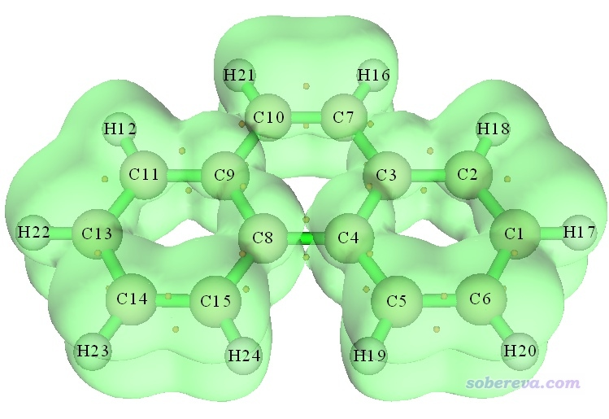

《18碳环等电子体B6N6C6独特的芳香性：揭示碳原子桥联硼-氮对电子离域的关键影响》（<http://sobereva.com/696>）介绍的笔者的Inorg. Chem., 62, 19986 (2023)文章计算了18碳环两种等电子体B6C6N6和B9N9的ELF-pi二分点数值，是很典型的ELF-pi分析例子，推荐大家仔细阅读此文，也推荐作为范例引用。

### 2.2 绘制卟啉分子平面上方1.2 Bohr处的LOL-pi的填色图

LOL和ELF的函数分布特征非常类似，物理意义也很接近，在前述的ELF资源汇总贴里也有LOL的介绍，有时候LOL图比ELF图看着更清楚舒服。类似于ELF与ELF-pi、ELF-sigma的关系，对于LOL也可以绘制LOL-pi和LOL-sigma。本例我们绘制卟啉分子平面上方1.2 Bohr处的LOL-pi的平面填色图，这样可以非常清晰地展现卟啉分子中pi电子离域特征。这里用1.2 Bohr并没有特别的理论依据，只不过经过测试发现这个距离的LOL-pi平面图对pi电子特征展现得比较清楚。当然绘制LOL-pi等值面图也可以，只不过对此例，等值面图不如平面图对LOL-pi分布特征展现得那么充分。

启动Multiwfn，载入本文文件包里的porphyrin.fch，进入主功能0会看到所有原子都在X=0的YZ平面上，因此我们要绘制的应当是X=1.2 Bohr的YZ平面。接着在Multiwfn里输入：  
100  //主功能100  
22  //检测pi轨道  
0  //自动检测分子平面  
2  //把pi轨道以外的轨道占据数清零  
0  //返回主菜单  
4  //绘制平面图  
10  //LOL  
1  //填色图  
按回车用默认的格点数  
3  //YZ平面  
1.2  //X=1.2 Bohr  
很快，平面图就蹦出来了：

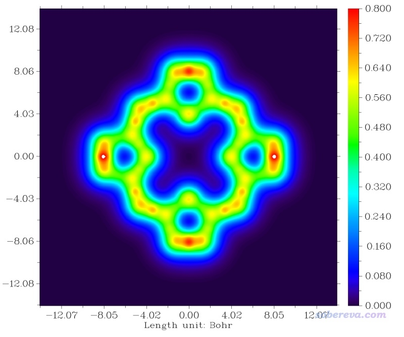

此时的图像效果还不十分理想。我们需要修改作图设定。关闭图像，然后依次输入  
-8  //把坐标单位切换为埃，从而与习俗一致  
-2  //修改坐标刻度间隔  
2,2,0.1  //X,Y坐标刻度间隔为2，纵坐标刻度间隔为0.1  
1  //修改色彩刻度上下限  
0,0.66  //下限和上限  
4  //显示原子标签  
7  //以青色显示  
17  //修改显示原子标签的距离  
2  //原子核位置距离作图平面小于2 Bohr的原子都在图上显示出标签（2 Bohr是随意设的，对当前例子只要大于1.2 Bohr即可）  
y  //距离超过2 Bohr的原子以较细字体显示标签（对于本体系设y还是n都不影响所得图像）  
8  //显示化学键（程序按照原子核距离和原子半径自动判断是否成键）  
14  //棕色显示化学键  
0  //保存图像  
此时当前目录下就出现了名为dislin.png的图像文件，如下所示

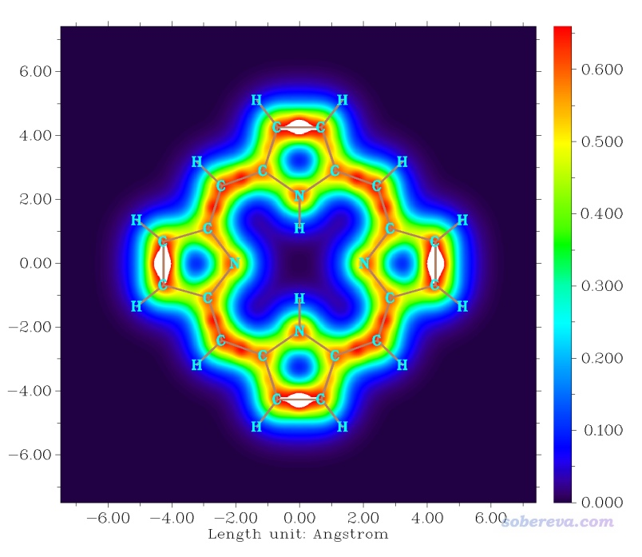

由图可见，在左边和右边五元环的内侧、上边和下边五元环的外侧，LOL-pi较大数值区域连通成了一个大环，非常清楚地展现出了pi电子主要的离域路径。如果你用AICD（<http://sobereva.com/294>）或GIMIC（<http://sobereva.com/155>）绘制磁感生环电流，会看到绕着pi电子离域的大环有显著的环电流出现。如果你用Multiwfn通过ICSS方法（<http://sobereva.com/216>）分析，也会看到那个大环内侧的外磁场被显著屏蔽，这都显示出了卟啉分子显著的芳香性。

### 2.3 计算苯酚的pi电子布居数和绘制pi电子密度分布图

笔者在《亲电取代反应中活性位点预测方法的比较》（<http://www.whxb.pku.edu.cn/CN/abstract/abstract28694.shtml>）中2.7节曾指出，利用pi电子分布可以考察亲电反应位点。文中是考察垂直于平面的Pz轨道的布居数，实际上，如果把pi轨道以外的轨道占据数清零再做布居分析，得到的原子布居数直接就对应了原子的pi电子数。本例以苯酚为例来演示。

启动Multiwfn，依次输入  
phenol.fch  //在本文的文件包里  
100  //主功能100  
22  //检测pi轨道  
0  //自动检测分子平面  
2  //把pi轨道以外的轨道占据数清零  
0  //返回主菜单  
7  //布居分析  
5  //Mulliken布居分析  
1  //输出Mulliken布居数和原子电荷  
n  //不输出.chg文件

屏幕上看到的碳的布居数如下（看Population。Net charge对当前情况无意义）：  
 Atom     1(C )    Population:    1.03706    Net charge:    4.96294  
 Atom     2(C )    Population:    0.98865    Net charge:    5.01135  
 Atom     3(C )    Population:    1.05314    Net charge:    4.94686  
 Atom     4(C )    Population:    0.97316    Net charge:    5.02684  
 Atom     5(C )    Population:    1.09090    Net charge:    4.90910  
 Atom     6(C )    Population:    0.99054    Net charge:    5.00946  
当前体系中，C3和C5是羟基的两个邻位碳，C1是对位碳，C2和C4是间位碳。由数据可见，邻、对位碳上pi电子数比间位上的更多，暗示更容易发生亲电反应，这和实验结论是一致的。不过，实验上对位产物比邻位多，而当前结果与此矛盾，这和《亲电取代反应中活性位点预测方法的比较》文中发现的情况相同，说明光靠考察pi电子分布量并不能完全说明问题。若用Multiwfn计算福井函数、双描述符、平均局部离子化能等（如何在Multiwfn里实现参看Multiwfn手册4.A.4节），结论都是对位比邻位活性强，和实验完全一致。

接着，我们可以再看看苯酚的pi电子密度等值面图是什么样，接着在Multiwfn里输入  
0  //回到布居分析界面  
0  //回到主菜单  
5  //计算格点数据  
1  //电子密度  
2  //中等质量格点  
-1  //显示等值面图

等值面数值设为0.04时看到的等值面图如下

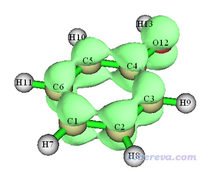

可见由于不同碳上带的pi电子数差异不大，因此从电子密度等值面图上看不出有多大差异。像这种情况，绘制分子平面上方比如1埃处电子密度填色图，则可以看得清楚得多。

关闭图形窗口，在Multiwfn里接着输入  
0  //回到主菜单  
4  //绘制平面图  
1  //电子密度  
1  //填色图  
按回车用默认格点数  
0  //修改延展距离  
1  //延展距离改为1 Bohr（因为pi电子分布区域在体系内侧，作图时不用在分子边缘留出太大空隙）  
1  //XY平面  
1a  //Z=1埃  
之后，在后处理菜单把色彩刻度下限和上限分别设为0和0.03，并且显示出原子标签，恰当设定坐标轴刻度等细节，最终看到的图像如下

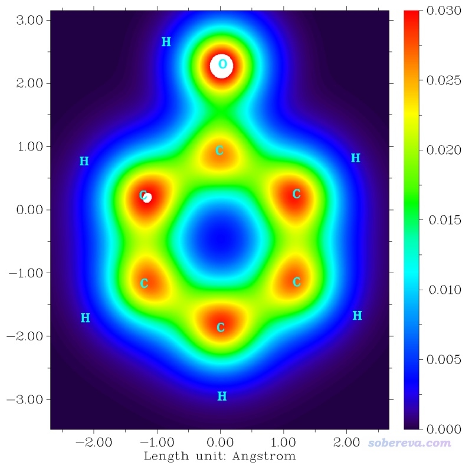

由图明显可见，在分子上方1埃的平面上，邻、对位的pi电子密度大于间位的，因为桔红色更深、范围更大，这和我们做的pi电子布居分析结论一致。

### 2.4 计算菲的pi多中心键级

此节演示对菲计算pi多中心键级，从而考察菲的中间的芳环共轭程度高还是边缘的芳环共轭程度高，看看能否进一步验证ELF-pi的分析结论。多中心键级在前述的《衡量芳香性的方法以及在Multiwfn中的计算》和Multiwfn手册3.11.2节都有介绍。

启动Multiwfn，依次输入  
phenanthrene.fch  
0  //在主功能0里观看一下边缘六元环和中间六元环的原子序号，按照逆时针或顺时针顺序记录下来备用  
100  //主功能100  
22  //检测pi轨道  
0  //自动检测分子平面  
2  //把pi轨道以外的轨道占据数清零  
0  //返回主菜单  
9  //键级分析  
2  //多中心键级  
3,4,8,9,10,7  //中间六元环的原子序号  
9,8,15,14,13,11  //边缘六元环的原子序号  
屏幕上显示的中间六元环的计算结果为：  
The multicenter bond order:    0.0237488557  
边缘的为：  
The multicenter bond order:    0.0565680226  
即边缘的六元环共轭程度明显比中间的六元环要高，多中心键级更大，和ELF-pi的分析结论相同。

如果要考察pi电子对应的Mayer键级也很容易，选择0返回键级分析菜单，然后选1计算Mayer键级即可。会看到这样的输出  
 The total bond order >=  0.050000  
 #    1:         1(C )    2(C )    0.52086147  
 #    2:         1(C )    4(C )    0.06618967  
 #    3:         1(C )    6(C )    0.36615890  
 #    4:         2(C )    3(C )    0.33674614  
 #    5:         2(C )    5(C )    0.09901526  
 #    6:         3(C )    4(C )    0.32998162  
 #    7:         3(C )    6(C )    0.06162677  
 #    8:         3(C )    7(C )    0.22763945  
...  
芳香环上的C-C键Mayer键级往往在1.5左右，即形式上类似于一个sigma键加上半个pi键。当前把sigma电子都扣掉了，因此剩下的C-C键的键级就变成零点几了，其中有的大一些有的小一些。在本文的第一张图，即ELF-pi=0.7的等值面图上看到，C3-C7之间等值面是断开的，而C3-C2和C3-C4等值面都是连通的，体现在pi电子Mayer键级上就是C3-C7键级小而C3-C2和C3-C4键级相对略大。

## 3 对非纯平面的体系考察pi电子结构

### 3.1 基于LMO区分sigma和pi电子的原理

前面已经通过大量例子充分展现了怎么对纯平面体系考察pi电子结构。对于非平面体系，分子轨道当中往往既有pi成份也有sigma成份，看似没法严格把sigma和pi电子分离，但实际上，基于定域化分子轨道(LMO)，还是可以做到sigma-pi分离的。如果不熟悉轨道定域化这个概念，务必看《Multiwfn的轨道定域化功能的使用以及与NBO、AdNDP分析的对比》（<http://sobereva.com/380>）。把分子轨道做轨道定域化转化为LMO之后，根据结构化学知识，一般就可以轻易指认哪些是pi型LMO哪些是sigma型LMO。然而，当体系一大了，人工看轨道图形来进行指认是很麻烦的事情。为解决此问题，笔者提出了一个自动检测pi型LMO的方法并且实现在了Multiwfn里，在Theor. Chem. Acc., 139, 25 (2020)中笔者做了详细介绍。这个检测方法不复杂，原理如下：对每个LMO计算轨道成份，如果某个原子贡献超过了某个阈值，那么这个LMO就被认为是单中心LMO（比如对应孤对电子的轨道、内核轨道等），应当被忽略。对剩下的轨道，假定对LMO贡献最大的两个原子是A和B，程序会计算0.7*R(A)+0.3*R(B)和0.3*R(A)+0.7*R(B)这两个点处的轨道密度（即轨道波函数的平方），这里R是指原子核坐标。如果这两个点的轨道密度同时都大于一个阈值，那么这个轨道就被认为是sigma型LMO，而其它的就被认为是pi型LMO。这种判断方式的原理易于理解，如果这两个点处的轨道密度特别小，就意味着这个轨道基本只体现pi特征，因为pi轨道在两个原子连线上有个节面。这种判断方法至少对于笔者测试过的各种有机体系是很合理、稳妥的，至于金属团簇之类复杂情况还没有充分测试过（如果不放心的话，可以在主功能0里看轨道图形人工检查一下自动找出来的pi型LMO对不对，如果有不合适的，就在主功能6的子功能26里通过手动修改轨道占据数使情况合理）。

注意，令Multiwfn做轨道定域化的时候必须是用默认的Pipek-Mezey方法来做，不能改用Foster-Boys方法来做，因为前者可以给出sigma和pi分离的LMO，而后者产生的多重键对应的LMO是sigma和pi混合的。默认的Pipek-Mezey是基于Mulliken布居实现的，此时基组最好不要带弥散函数（对于定域化占据轨道但也不是一定不行，也可以实际试试效果）。如果有特殊原因必须带弥散函数，并且发现默认的Pipek-Mezey得到的定域化轨道不好，建议改用基于Becke布居的Pipek-Mezey方法，但对于较大体系昂贵得多得多。

对于纯平面体系，虽然也可以做轨道定域化、基于LMO来区分开sigma和pi电子，但是完全多此一举，相对于直接基于分子轨道来区分不会有额外好处，分析结果也是相同的。

### 3.2 对苯甲酮绘制LOL-pi等值面图

下面看一个对非纯平面体系苯甲酮考察pi电子结构的例子。

启动Multiwfn，依次输入  
benzophenone.fch  //在本文的文件包里  
19  //轨道定域化  
1  //对占据轨道做轨道定域化（非占据轨道对分析结果无贡献，故不用对非占据轨道也做定域化）  
100  //主功能100  
22  //检测pi轨道  
-1  //当前内存里的轨道是定域化过的轨道  
0  //开始检测pi轨道。用屏幕上的选项可以修改判断pi轨道的阈值，这里暂且不改  
此时屏幕上提示了检测出的pi型LMO的编号，一共发现了7个，接着输入  
2  //把其它轨道占据数清零  
0  //回到主菜单  
5  //计算格点数据  
10  //LOL  
2  //中等质量格点  
-1  //观看等值面图  
观看到的图像如下所示

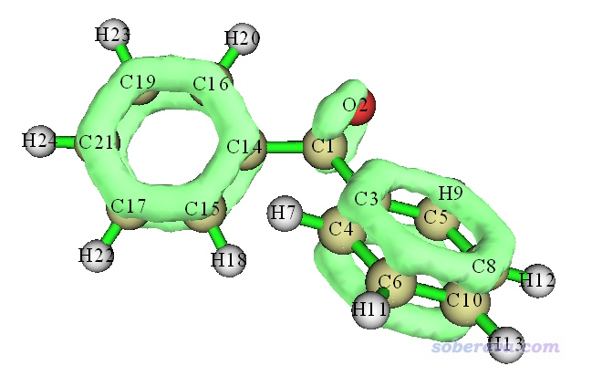

此图和我们期望的一致，等值面把pi电子区域充分勾勒了出来，而sigma电子、孤对电子都没有被体现。由于这个体系是非平面体系，不好选取作图平面，所以就不用演示绘制平面图了。

我们还可以像之前对纯平面体系所做的那样，绘制电子密度图、做布居分析、计算pi键级等等。值得一提的是，对这样非纯平面体系计算Mayer键级、多中心键级，对sigma电子算的结果和对pi电子算的结果的总和，和直接对总电子算的结果是不同的，但差异一般不显著。此体系的苯环的六中心键级计算结果为  
考虑全部电子：0.0773346195  
只考虑pi电子：0.0755099345  
只考虑sigma电子：0.0024250360  
将0.0755099345与0.0024250360相加结果为0.0779349705，和考虑全部电子时候的0.0773346195非常接近。

再对此体系的C=O键计算Mayer键级，结果为  
考虑全部电子：1.81239410  
只考虑pi电子：0.75232404  
只考虑sigma电子：1.06873978  
sigma和pi单独算的结果之和为0.75232404+1.06873978=1.82106382，和考虑全部电子时的1.81239410也很接近。此例体现出，对非平面体系基于LMO划分sigma和pi电子，计算的键级还是有近似可加和性的。

### 3.3 对螺烯局部绘制pi电子密度等值面图

Multiwfn在基于LMO指认pi型LMO的时候能够加约束条件，可以要求此LMO中贡献最大的两个原子必须属于某个原子序号范围。这个功能比较有用，比如我们想对一段DNA片段中的碱基部分绘制ELF-pi图，而不希望磷酸基部分的pi电子也显示出来，就可以利用这个约束设置。

下面我们对如下所示的螺烯绘制pi电子密度等值面图，绘制的时候只绘制分布在中间四个六元环上的pi电子。

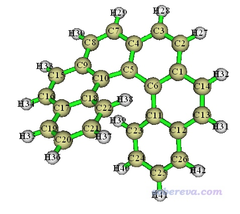

启动Multiwfn，载入本文文件包里的helicene.fchk，然后依次输入  
19  //轨道定域化  
1  //对占据轨道做轨道定域化  
100  //主功能100  
22  //检测pi轨道  
-1  //当前轨道是定域化过的轨道  
5  //设定约束条件  
1-18  //中间四个六元环的碳的编号（懒得自己记录编号的话可以利用gview直接把选定区域的原子序号直接提出来，可参考<https://www.bilibili.com/video/av26312703/>里面的演示）  
0  //开始检测pi轨道  
螺烯中间四个六元环一共有18个碳原子，它们上面共有约18个pi电子。屏幕上提示找出来了9个pi型LMO，正好对应18个电子，因此LMO肯定识别对了，也不用人工看LMO图形检查了。然后选2将其它轨道占据数清零，之后照常绘制电子密度等值面图，结果如下图左侧所示。下图右侧是不做约束而绘制的所有pi电子的等值面图。

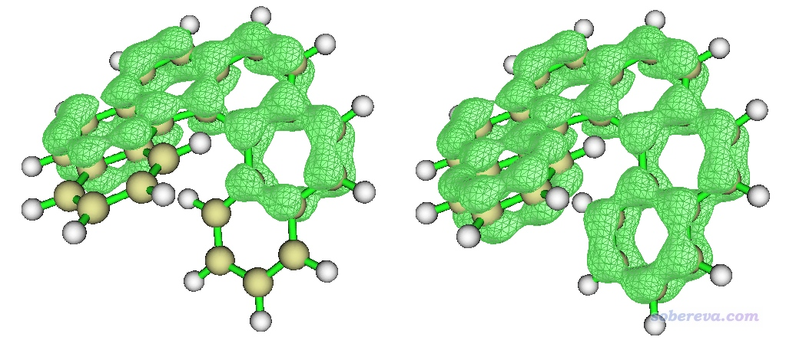

由于LMO的高度定域化特征，我们可看到上图的左图和右图的中间四个六元环上电子密度分布特征完全相同。

### 

### 3.4 对螺烯各个碳原子计算pi和sigma布居数

此例对螺烯各个碳原子计算pi和sigma布居数。判断出pi型LMO后，把pi轨道以外的轨道占据数清零，再用Multiwfn做布居分析得到的显然就是pi布居数了。类似地，如果把pi轨道占据数清零，再用Multiwfn做布居分析得到的显然就是sigma布居数了（也包括内核电子。如果不想把内核电子算进去，手动再减去内核电子数即可）。正如计算原子电荷的方法很多，计算pi布居数的方法也很多，这里就用比较常用的、接受度也比较高、也不怕弥散函数的Hirshfeld方法来算。

启动Multiwfn，载入本文文件包里的helicene.fchk，然后依次输入  
19  //轨道定域化  
1  //对占据轨道做轨道定域化  
100  //主功能100  
22  //检测pi轨道  
-1  //当前轨道是定域化过的轨道  
0  //开始检测  
螺烯一共有26个碳原子，屏幕上提示识别出的13个pi轨道上的pi电子数一共26个，即每个碳一个，显然识别对了。然后输入  
2  // 把其它轨道占据数清零，  
0  //返回主菜单  
15  //模糊空间分析  
-1  //修改空间划分的定义  
3  //用Hirshfeld划分，而且是基于程序内置的自由原子密度  
1  //对各个原子空间进行积分  
1  //被积函数是电子密度

然后我们就得到各个原子上的pi电子数了，即下面输出中的Value值  
  Atomic space        Value                % of sum            % of sum abs  
    1(C )            0.98589185             3.791847             3.791847  
    2(C )            0.94199198             3.623003             3.623003  
    3(C )            0.94339795             3.628411             3.628411  
    4(C )            0.98692756             3.795831             3.795831  
    5(C )            0.98574768             3.791293             3.791293  
    6(C )            0.98389723             3.784176             3.784176  
...略

对于这样得到的pi布居数，也可以按照《使用Multiwfn+VMD以原子着色方式表现原子电荷、自旋布居、电荷转移、简缩福井函数》（<http://sobereva.com/425>）介绍的方法进行着色来直观展现。下图是Theor. Chem. Acc., 139, 25 (2020)中我对碳纳米管片段用这种方法绘制的pi电子布居数图，不过pi电子数是Mulliken方法算的（主功能7里选主功能5，然后选1，读Population），这比Hirshfeld方法快得多但怕弥散函数。

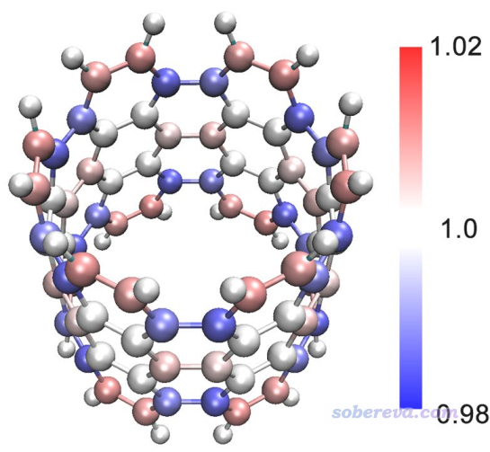

sigma布居数也类似地计算，这里就不再演示了。

《使用Multiwfn基于Hirshfeld-I划分计算特定类型电子在各个原子上的分布量》（<http://sobereva.com/697>）一文和本节内容高度相关，建议读者一看。

## 4 使用VMD渲染得到更好效果

如果想得到比直接用Multiwfn显示的等值面效果更好的图像，强烈推荐按照《在VMD里将cube文件瞬间绘制成效果极佳的等值面图的方法》（<http://sobereva.com/483>）中的做法利用VMD脚本绘制。比如下图是借助VMD渲染出来的对苯甲酮的LOL-pi等值面图，效果绝佳，而步骤却异常简单！

这里顺带给大家看一下笔者将本文的方法用到过的最大体系，[144]-annulene的效果。下图是基于Multiwfn产生的LOL-pi格点数据，用VMD渲染后的等值面图，可见非常理想地将这个巨大的共轭体系的pi电子共轭路径十分清晰直观地展现了出来！

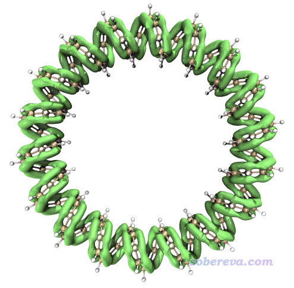

下图是笔者对手性共轭碳纳米带体系绘制的LOL-pi=0.4的等值面图，可见等值面充分将pi共轭路径展现了出来，图像很漂亮。

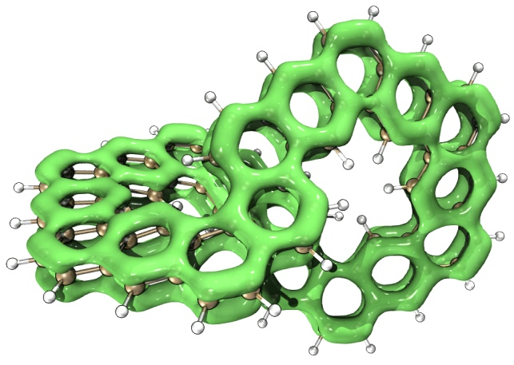

下图的体系和上面的结构类似，但是边缘有些碳是sp3杂化的，由图可见在它们上面没有LOL-pi等值面，清楚地体现出电子的pi共轭在这样的地方被截断了。

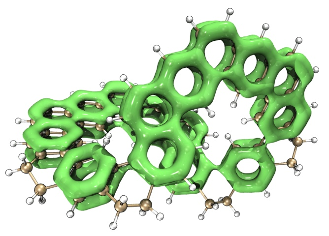

一篇Nature Communication文章（见<http://bbs.keinsci.com/thread-29087-1-1.html>）和一篇J. Am. Soc. Chem.文章（见<http://bbs.keinsci.com/thread-29300-1-1.html>）也都使用了上面介绍的方法绘制了LOL-pi等值面图清楚地展现了pi共轭路径。

## 5 总结&其它

pi电子在化学体系中有重要地位。本文充分演示了如何在Multiwfn中考察pi电子结构。虽然没有示例怎么考察sigma电子结构，但想必仔细阅读本文的人都知道怎么做，只不过就是让程序识别出pi轨道后，选择把pi轨道占据数都清零，然后照常分析即可。Multiwfn中对pi电子的分析绝不仅限于文中所列出的这些，希望读者在理解本文例子的基础上，充分灵活运用Multiwfn的各种分析功能，举一反三，解决实际遇到的问题。

Multiwfn还可以计算任意类型轨道的pi成份，这个功能非常有用，在此帖专门做了介绍：《Multiwfn已支持计算任意轨道的pi成份》（<http://bbs.keinsci.com/thread-13110-1-1.html>），强烈建议一看！

在笔者的pi电子分析算法原文Theor. Chem. Acc., 139, 25 (2020) DOI: 10.1007/s00214-019-2541-z论文中，对于pi电子分析还有更多、深入、更充分的讨论，并且给了更多例子，**请读者切勿忘记阅读此文**。

下面列举的笔者的很多研究文章都充分使用了LOL-pi讨论了电子离域性、芳香性，**非常推荐作为LOL-pi的典型应用范例引用！**  
• 笔者在《谈谈18碳环的几何结构和电子结构》（<http://sobereva.com/515>）和《一篇最全面、系统的研究新颖独特的18碳环的理论文章》（<http://sobereva.com/524>）中专门考察了比较新颖的18碳环体系的pi电子结构，而且考察的不仅是常规的位于环上、下方的pi轨道，还考察了比较少见的在环平面上的pi轨道（in-plane pi轨道），此研究后来正式发表于Carbon, 165, 468 (2020)，里面还全面运用了其它方法分析了18碳环独特的电子结构特征，十分建议一看  
• 在《深入揭示18碳环的重要衍生物C18-(CO)n的电子结构和光学特性》（<http://sobereva.com/640>）一文中还介绍了笔者发表的Chem. Eur. J., 28, e202103815 (2022)一文，其中也充分利用了LOL-pi非常清晰直观地考察了C18-(CO)2、C18-(CO)4、C18-(CO)6的pi共轭情况的差异  
• 在《不寻常的环[18]碳前驱体C18Br6的电子结构和芳香性》（<http://sobereva.com/664>）里介绍的笔者的Chem. Eur. J. 2023, 29, e202300348中还使用了LOL-pi考察C18-Br6的电子结构  
• 在《18碳环等电子体B6N6C6独特的芳香性：揭示碳原子桥联硼-氮对电子离域的关键影响》（<http://sobereva.com/696>）介绍的笔者的Inorg. Chem., 62, 19986 (2023)中利用LOL-pi充分展现了18碳环的等电子体B6C6N6和B9N9的电子离域特征差异  
• 在《深度揭示互为等电子体的苯、无机苯和carborazine的芳香性的显著差异》介绍的笔者的Chem. Eur. J., 30, e202403369 (2024)文章中利用LOL-pi清晰地讨论了苯和无机苯、carborazine的电子离域性的差异。此外，此文还用Multiwfn计算了这三个体系的pi布居数，从pi布居分布的均匀性的角度对芳香性进行了对比讨论，很建议一看

本文示例的都是DFT波函数。而后HF波函数（也包括其它各种多组态波函数）是以自然轨道形式记录的，对纯平面体系可也以按照本文第二节的做法照常区分sigma和pi轨道。而由于轨道定域化没法用于后HF波函数，因此对于非平面体系的后HF波函数，一般是没办法区分sigma和pi轨道从而单独考察sigma和pi电子特征的。但这也不是那么绝对，其实运用一些技巧也可以解决：  
(1)对这样的体系用DFT计算一次，得到LMO轨道，再用判断轨道pi成份的功能判断自然轨道的pi特征百分比，高于一定数值的就当做是准pi轨道  
(2)对于比如甲苯这样的体系，有三个准pi轨道离域在苯环上，可以让程序自动挑出来。先令甲苯的苯环平行于XY平面（做法见<http://sobereva.com/178>），然后用Gaussian单点计算的时候加上nosymm关键词避免朝向被自动调整，将得到的波函数载入Multiwfn，用主功能6的子功能-4把甲基上的原子的GTF都删掉，然后进入主功能100的子功能2，选择0因为当前轨道是离域的轨道，然后选择XY平面，再输入两个阈值（见屏幕上的提示，建议用自动推荐的），然后准pi型轨道编号就被找出来了。
