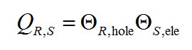
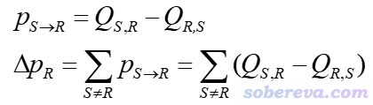
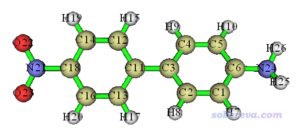
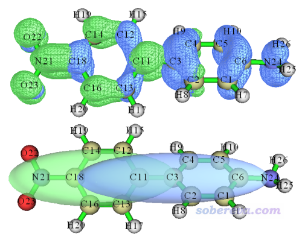
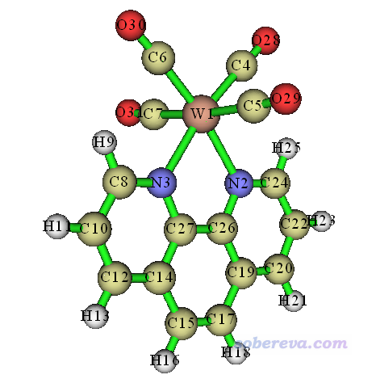
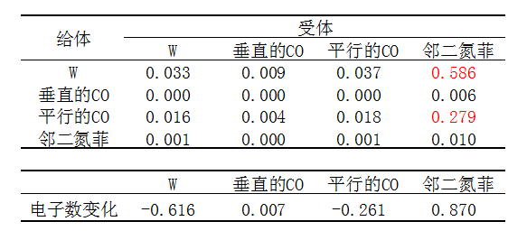
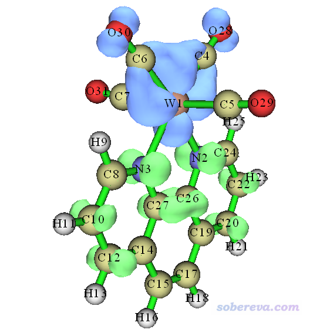

**后记1**：在本文介绍的IFCT分析思想的基础上，笔者又提出了电荷转移光谱（charge-transfer spectrum, CTS）的概念，可以从电荷转移角度将总的UV-Vis光谱进行分解分析，从而洞悉光谱的内在本质，见《使用Multiwfn绘制电荷转移光谱(CTS)直观分析电子光谱内在特征》（<http://sobereva.com/628>）。非常建议本文读者之后阅读。

**后记2**：从2022-Mar-15更新的Multiwfn版本开始，在IFCT分析输出中会直接给出电荷转移百分比CT(%)和局域激发百分比LE(%)，在指认电子激发类型的时候极其方便和严格！在IFCT分析中，CT(%)被定义为所有片段间电子转移量总和乘以100%，LE(%)被定义为所有片段内电子重分布量的总和乘以100%。

**在Multiwfn中通过IFCT方法计算电子激发过程中任意片段间的电子转移量**

Using the IFCT method in Multiwfn to evaluate amount of electron transfer between arbitrarily defined two fragments during electronic excitation

文/Sobereva @[北京科音](http://www.keinsci.com)

First release: 2018-Aug-31  Last update: 2022-Jan-1

## 1 前言

电子激发过程中电子是怎么转移的是一个非常重要的问题。量子化学上计算激发态有成熟的方法，见《乱谈激发态的计算方法》（<http://sobereva.com/265>）、《Gaussian中用TDDFT计算激发态和吸收、荧光、磷光光谱的方法》（<http://sobereva.com/314>）。利用这些方法得到的激发态波函数，我们就可以得到激发态电子分布，然后可以通过比如激发态密度与基态密度求差、计算激发态原子电荷与基态原子电荷的差值等方式来考察电子转移特征，这在笔者之前写的《使用Multiwfn作电子密度差图》（<http://sobereva.com/113>）、《电子激发过程中片段间电荷转移百分比的计算》（<http://sobereva.com/398>）、《在Multiwfn中基于fch产生自然轨道的方法与激发态波函数、自旋自然轨道分析实例》（<http://sobereva.com/403>）等很多文章当中都涉及了。然而，虽然我们可以以这些方式获知体系不同区域的电子密度或所含电子数在电子激发过程中变化了多少，却无法得知电子转移内在细节，即哪个片段转移给了哪个片段多少电子，至多可以按照《电子激发过程中片段间电荷转移百分比的计算》的做法把体系划分为两个片段，考察两个片段间在电子激发过程中的电子净转移量。然而，不同区域间电子转移的细节信息无疑是非常有考察价值的，对于我们深入探究电子激发的内在特征极为有益。曾经笔者写过一篇《使用Multiwfn做电荷分解分析(CDA)、绘制轨道相互作用图》（<http://sobereva.com/166>），读过此文的读者肯定感受到，若能把电荷转移的细节弄清楚，可以把许多问题剖析得深入得多。

为了能考察清楚电子激发过程中体系任意两个片段之间电子是如何转移的，笔者提出了一个既简单效果又十分理想的方法，我将之称为IFCT (interfragment charge transfer)方法。此方法已在Multiwfn中实现了，本文就介绍一下原理，并举一些例子。目前IFCT尚未正式发表在学术期刊，以后笔者会专门写一篇论文来详细介绍此方法，在此论文发表之前，如果你打算利用这个方法发文章，在引用Multiwfn的原文的同时也请引用Multiwfn手册3.21.8节，其中对此方法以及在Multiwfn中的实现有详细的说明。另外，在Multiwfn手册4.18.8节中也对此方法给出了分析实例。

由于IFCT方法的重要价值，此方法在笔者实现进Multiwfn后不久就已经在不少文章中被使用，比如Nature Chemistry (2023) DOI: 10.1038/s41557-023-01368-x、Bioconjugate Chem. (2020) DOI: 10.1021/acs.bioconjchem.0c00020、Eur. J. Inorg. Chem., 2019, 4350、Solar Energy, 201, 872 (2020)、Org. Elect., 71, 212 (2020)、J. Mater. Chem. C, 7, 2604 (2019)等。

注意本文提到的Multiwfn手册章节都是对应2018-Oct-12及以后更新的手册，别看更早版本的。本文使用的Multiwfn是2018-Oct-12更新的3.6(dev)版，也不要用更老版本的。Multiwfn可以在其主页<http://sobereva.com/multiwfn>上免费下载。如果不了解Multiwfn，强烈建议参看《Multiwfn入门tips》（<http://sobereva.com/167>）和《Multiwfn波函数分析程序的意义、功能与用途》（<http://sobereva.com/184>）。

## 2 IFCT方法的原理

这个方法目前只支持CIS、TDHF、TDA-DFT和TDDFT方式算做的电子激发计算，这些方法都是单参考方法，通过单激发组态函数的线性组合描述激发态波函数。

IFCT分析是基于片段对空穴和电子的贡献实现的。在《使用Multiwfn做空穴-电子分析全面考察电子激发特征》（<http://sobereva.com/434>）中详细介绍了空穴（电子从哪激发走）和电子（电子被激发后去哪）的概念以及如何计算。IFCT方法通过下式计算电子激发过程中某片段R到某片段S的电子转移量：

ΘR,hole体现了被激发的电子中R占了多少，ΘS,ele体现了电子要去的地方S占了多少，二者之积定义为R->S的电子转移量明显是合理的。R占空穴越多，S占电子越多，则R->S转移得就越多。这种片段间电子转移量的计算方法还可以从其它角度来充分论证合理性，见手册3.21.8节的讨论。

如上定义了片段间单向电子转移量后，我们还可以定义两个片段间电子净转移量，即两个方向转移的差值，如下图第一个式子所示。然后还可以定义某个片段的电子净变化量，即这个片段与所有其它片段间电子净转移量的加和，如下图第二个式子所示。

前面式子中的Q矩阵的对角元，形式上是“片段向自己转移的电子量”，物理意义可以解释为在片段中有多少电子由于被激发而在片段内发生了重新分布。

IFCT方法计算的电子转移情况对应的是非弛豫的激发态密度，它没有弛豫的激发态密度那么真实，但好处是构造容易，无需额外耗时，对于讨论电子激发特征已经够了。关于弛豫和非弛豫密度的更多信息见《使用Multiwfn做空穴-电子分析考察电子跃迁特征》（<http://sobereva.com/434>）。

## 3 IFCT方法在Multiwfn中的使用

IFCT方法在Multiwfn中使用所需的输入文件在Multiwfn手册3.21节开头有详细说明。此分析需要两类文件：  
1 记录了参考态波函数的文件，是刚启动Multiwfn时就需要载入的  
2 记录了激发态的组态系数的文件，是进入IFCT分析功能时需要载入的  
简单来说，对于Gaussian用户，要做IFCT分析一般就用TDDFT方法算激发态即可。计算时候应当带IOp(9/40=4)关键词使得绝对值大于1E-4的组态系数都输出出来以使得分析结果可靠。如果你要分析第i激发态的电子转移情况，nstates最好设为不小于i+2。把算完得到的chk转换为fch文件后就可以作为第1类文件，而Gaussian输出文件可作为第2类文件使用。Multiwfn支持的一大堆电子激发分析，也包括IFCT，绝不仅限于Gaussian用户能用，诸如ORCA、GAMESS-US、Firefly用户也可以，详见手册3.21节开头的说明。结合ORCA使用涉及的文件准备流程我还专门写了个文章进行介绍：《Multiwfn结合ORCA的TDDFT计算做空穴-电子等分析的方法》（<http://sobereva.com/758>）。

进入IFCT分析功能后，选择使用的计算空穴和电子的成份的方式，然后定义片段，片段可以定义无数多个。之后各个片段间电子单向转移量、净转移量、片段的电子数的变化都会一次性输出。片段定义既可以手动直接输入，也可以从外部文本文件读入，文件中每行记录一个片段包含的原子序号，例如  
1,3,6-10,12  
2,4,5  
11  
13-15

计算空穴和电子的成份的方式一般就选Mulliken-like划分即可，此方法速度很快，一般也是比较可靠的，最大的缺点是不能用于有弥散函数的情况，否则结果可能是严重误导性的。IFCT分析也可以用更可靠、也不怕弥散函数但明显更昂贵的Hirshfeld划分来做。没有弥散函数时，Mulliken-like划分和Hirshfeld划分得到的结果一般不会有显著差异。

## 4 实例

下面通过两个体系来演示在Multiwfn中通过IFCT方法考察片段间电荷转移。Gaussian用的是G16 A.03版。本文例子的相关输入输出文件皆可在此下载：<http://sobereva.com/attach/433/file.rar>

### 4.1 D-pi-A体系：NH2-biphenyl-NO2

我们首先考察一个典型的Donor-pi-Acceptor型体系，如下所示。NH2是电子给体基团，联苯起到pi桥作用，NO2是电子受体基团。对于此体系的电荷转移激发态来说，肯定是NH2一侧电子整体向NO2一侧转移。本例我们把此体系划分为三个片段进行研究，即氨基、联苯、硝基。

首先对此体系在常用的B3LYP/6-31G*级别下进行优化，然后用以下设定做TDDFT计算，将得到5个单重态激发态。IOp(9/40=4)如前所述必须要加上。  
%chk=D-pi-A.chk  
# CAM-B3LYP/6-31g(d) TD(nstates=5) IOp(9/40=4)  
计算完毕后将chk转换为fch，不会转换的话看《详谈Multiwfn支持的输入文件类型、产生方法以及相互转换》（<http://sobereva.com/379>）。用CAM-B3LYP是因为此泛函做TDDFT描述电荷转移激发比较不错，当前体系有一些激发态是电荷转移激发态。普通有机体系用6-31G*做TDDFT就足以得到合理的结果。

启动Multiwfn，然后依次输入  
D-pi-A.fchk  //在本文的文件包里  
18  //电子激发分析  
8  //使用IFCT方法分析电子转移。若要用Hirshfeld划分就选2  
1  //Mulliken-like方式计算空穴和电子的分布  
D-pi-A.out  //上述TDDFT任务的输出文件，在本文的文件包里  
此时屏幕上提示Multiwfn检测出当前.out文件里有5个激发态的信息，问你分析哪个。作为例子，这里分析第2激发态，这是个电荷转移激发态。在Multiwfn里继续输入：  
2  //分析基态到第2个激发态跃迁时的电子转移  
3  //定义3个片段。这一步如果输入0，说明从外部文本文件里读取片段设定  
24-26  //作为片段1的氨基的原子序号  
1-20  //作为片段2的联苯的原子序号  
21-23  //作为片段3的硝基的原子序号  
提示：当通过肉眼不好找片段里原子序号的情况，可以利用gview方便地提取选定区域的原子序号，可参考这个视频<https://www.bilibili.com/video/av26312703/>。

IFCT分析耗时很低，屏幕上立刻看到了结果，如下所示。如果不打算重新定义片段或接着分析其它激发态，Multiwfn就可以关了。如果还要分析其它激发态，就选0退出，然后再次进入这个IFCT分析功能，重新选择要考察的态即可。  
 Contribution of each fragment to hole and electron:  
  1  Hole:  13.27 %     Electron:   1.14 %  
  2  Hole:  81.24 %     Electron:  57.79 %  
  3  Hole:   5.49 %     Electron:  41.06 %  
 Construction of interfragment charger-transfer matrix has finished!

 Variation of population number of fragment  1:  -0.12127  
 Variation of population number of fragment  2:  -0.23445  
 Variation of population number of fragment  3:   0.35572

 Intrafragment electron redistribution of fragment  1:   0.00152  
 Intrafragment electron redistribution of fragment  2:   0.46950  
 Intrafragment electron redistribution of fragment  3:   0.02256

 Transferred electrons between fragments:  
  1 ->  2:   0.07669       1 <-  2:   0.00928     Net  1 ->  2:   0.06741  
  1 ->  3:   0.05449       1 <-  3:   0.00063     Net  1 ->  3:   0.05386  
  2 ->  3:   0.33360       2 <-  3:   0.03174     Net  2 ->  3:   0.30186

从上面的Net值（净转移量）可见，电子整体是从氨基往硝基方向单向转移的，氨基->联苯净转移了0.06741电子、联苯->硝基净了转移0.30186电子，而且氨基直接净转移到硝基上的还有0.05386电子。虽然由数据可见实际上也有些反方向的转移，比如硝基也有0.03174电子在电子激发时转移到了联苯上，但远小于联苯向硝基转移的0.33360。把净转移量进行加和，就得到了片段所带电子量的变化。如上所示，联苯减少了0.23445电子，氨基减少了0.12127电子，硝基增加了0.35572电子。

上面数据也体现出，在这个电子激发过程中，分子两端的硝基和氨基的电子没有出现显著的片段内的重新分布，电子要么走，要么来。而中间的联苯上的电子出现了显著的重新分布，数值达到0.46950，体现出电子激发显著地影响了联苯的电子结构，因此联苯在这个电子跃迁过程中占据重要地位。

如果想把定量数据和图形相结合，那么建议用Multiwfn绘制空穴-电子图，参见《使用Multiwfn做电子-空穴分析考察电子跃迁特征》（<http://sobereva.com/434>）。对当前体系第二激发态绘制的空穴-电子图如下图的上半部分所示，而把空穴和电子分布转化为平滑的高斯函数分布后更便于观看，如下图下半部分所示

上图中蓝色区域是“空穴”，即电子走的地方；绿色区域是“电子”，即电子去的地方。此图和我们的IFCT分析结果是完全相符的。在氨基部分，只有蓝色等值面出现，因此IFCT分析表示氨基几乎完全没有得到电子；在联苯区域，既有绿色也有蓝色等值面出现，这正对应IFCT分析所表明的，联苯既从氨基部分接受了一些电子，联苯自己的电子也向硝基转移走了很多，由此导致联苯上的电子重分布程度很显著。而且蓝色等值面在联苯上比绿色等值面看起来范围更大，这也正对应了IFCT分析所表明的联苯在电子激发过程中电子数是减少的。在硝基部分绿色等值面占绝对主导，这和IFCT分析所显示的硝基是明显得电子的结论相吻合。但如IFCT数据所示的，硝基上的电子也不是一丁点没转移到别处去，因此硝基上还是看到了稍许的蓝色等值面。可见，IFCT的定量数据，都可以通过空穴-电子等值面图予以直观的解释。大家若有兴趣，请用IFCT方法结合空穴-电子分析考察其它几个激发态的特征。

前面说过，IFCT分析默认用的计算片段对空穴和电子贡献的方法（一种类似Mulliken的方法）不能用于有弥散函数的情况。但诸如体系是阴离子，不用弥散函数说不过去，这时候就需要改用Becke划分来做了，下面举个例子。启动Multiwfn，然后依次输入  
D-pi-A.fchk  
18  //电子激发分析  
1  //空穴-电子分析  
2  //分析基态到第2个激发态跃迁时的电子转移  
1  //显示和分析空穴、电子等函数的分布  
2  //中等质量格点（对于中、小体系够了。如果是大体系，起码选High quality grid来用更多的格点数）  
此时程序开始计算空穴、电子以及其它一些函数的格点数据，算完后接着输入  
10  //导出空穴的格点数据  
1  //完整形式的空穴  
11  //导出电子的格点数据  
1  //完整形式的电子  
0  //返回  
0  //返回主功能18的菜单  
此时当前目录下已经有了hole.cub和electron.cub，接着输入  
8  //IFCT分析  
y  //使用当前目录下的hole.cub和electron.cub里的空穴和电子分布做IFCT分析  
3  //定义3个片段  
24-26  //作为片段1的氨基的原子序号  
1-20  //作为片段2的联苯的原子序号  
21-23  //作为片段3的硝基的原子序号  
此时看到以下结果  
 Contribution of each fragment to hole and electron:  
  1  Hole:  13.33 %     Electron:   1.45 %  
  2  Hole:  80.47 %     Electron:  57.89 %  
  3  Hole:   6.19 %     Electron:  40.65 %  
 Construction of interfragment charger-transfer matrix has finished!

 Variation of population number of fragment  1:  -0.11884  
 Variation of population number of fragment  2:  -0.22573  
 Variation of population number of fragment  3:   0.34456

 Intrafragment electron redistribution of fragment  1:   0.00193  
 Intrafragment electron redistribution of fragment  2:   0.46586  
 Intrafragment electron redistribution of fragment  3:   0.02518

 Transferred electrons between fragments:  
  1 ->  2:   0.07717       1 <-  2:   0.01163     Net  1 ->  2:   0.06554  
  1 ->  3:   0.05419       1 <-  3:   0.00090     Net  1 ->  3:   0.05330  
  2 ->  3:   0.32713       2 <-  3:   0.03586     Net  2 ->  3:   0.29127  
结果和之前基于默认的类似Mulliken划分的方法算的结果在定量上略有差异，但差异并不显著。由于基于Becke划分做IFCT分析需要额外多做一步，并且对大体系会花一些时间，因此除非用了弥散函数，否则就用默认的方法做IFCT分析就行了。

### 4.2 配合物体系：W(CO)4(phen)

本节我们用IFCT方法考察一下下面的W(CO)4(phen)配合物体系在电子激发过程中的片段间电子转移情况

此体系里四个羰基中有两个是平行于邻二氮菲配体的，有两个是垂直于它的，因此应当区别对待，故本体系我们这样划分片段：  
1 中心金属W（原子序号1）  
2 垂直于邻二氮菲的两个羰基（原子序号31,7,5,29）  
3 平行于邻二氮菲的两个羰基（原子序号30,6,4,28）  
4 邻二氮菲（原子序号2-3,8-27）  
对于IFCT方法，片段虽然可以随意划分，但划分得应当尽量有化学意义，能够有助于分析我们感兴趣的电子激发过程中的信息。片段定义顺序完全无所谓。

本例对W(CO)4(phen)在B3LYP泛函结合6-31G*和SDD赝势基组下进行优化，然后在CAM-B3LYP泛函下通过TDDFT计算最低5个激发态。相应的Gaussian输入输出文件都在本文的文件包里。

启动Multiwfn，然后输入  
W_CO4_phen.fchk  //在本文的文件包里  
18  //电子激发分析  
8  //使用IFCT方法分析电子转移  
1  //Mulliken-like方式计算空穴和电子的分布  
W_CO4_phen.out  //TDDFT任务的输出文件，在本文的文件包里  
1  //作为示例，分析第1激发态  
4  //定义4个片段  
1  //片段1（中心金属W）的原子序号  
31,7,5,29  //片段2（垂直于邻二氮菲的两个羰基）的原子序号  
30,6,4,28  //片段3（平行于邻二氮菲的两个羰基）的原子序号  
2-3,8-27  //片段4（邻二氮菲）的原子序号

结果如下  
 Contribution of each fragment to hole and electron:  
  1  Hole:  66.54 %     Electron:   4.92 %  
  2  Hole:   0.71 %     Electron:   1.40 %  
  3  Hole:  31.64 %     Electron:   5.56 %  
  4  Hole:   1.11 %     Electron:  88.12 %  
 Construction of interfragment charger-transfer matrix has finished!

 Variation of population number of fragment  1:  -0.61619  
 Variation of population number of fragment  2:   0.00691  
 Variation of population number of fragment  3:  -0.26082  
 Variation of population number of fragment  4:   0.87010

 Intrafragment electron redistribution of fragment  1:   0.03273  
 Intrafragment electron redistribution of fragment  2:   0.00010  
 Intrafragment electron redistribution of fragment  3:   0.01759  
 Intrafragment electron redistribution of fragment  4:   0.00975

 Transferred electrons between fragments:  
  1 ->  2:   0.00934       1 <-  2:   0.00035     Net  1 ->  2:   0.00899  
  1 ->  3:   0.03700       1 <-  3:   0.01557     Net  1 ->  3:   0.02143  
  1 ->  4:   0.58632       1 <-  4:   0.00054     Net  1 ->  4:   0.58577  
  2 ->  3:   0.00040       2 <-  3:   0.00444     Net  2 ->  3:  -0.00405  
  2 ->  4:   0.00629       2 <-  4:   0.00016     Net  2 ->  4:   0.00613  
  3 ->  4:   0.27882       3 <-  4:   0.00062     Net  3 ->  4:   0.27820

把上面的数据整理成下表更便于考察，电子转移量中数值较大因此需要重点关注的项用红色高亮了，而其它项都很接近0而可以不去特意讨论。下表中对角元对应片段内电子重分布量。

由数据可见，当前这种电子跃迁，主要是特征是中心金属的电子向邻二氮菲转移，以及平行的羰基向邻二氮菲转移，转移量分别为0.586和0.279。前者被称为metal-to-ligand charge transfer (MLCT)，后者被称为ligand-to-ligand charge transfer (LLCT)。因此，这个电子激发是MLCT为主LLCT为辅的激发。而LMCT (ligand-to-metal charge transfer)几乎不出现在当前电子跃迁过程中（总量仅为0.00035+0.01557+0.00054，可完全忽略不计）。对于配合物体系，除了MLCT、LLCT、LMCT这些电荷转移特征外，还多多少少会有一定的MC (metal-centered)和LC(ligand-centered)特征。MC特征对应的电子量对应于Intrafragment electron redistribution of fragment  1后面的0.03273。而诸如邻二氮菲上的LC特征对应的电子量则是Intrafragment electron redistribution of fragment  4后面的0.00975。

从电子数的变化来看，电子跃迁过程中W失去大量电子，平行的羰基也失去不少电子，它们几乎都转移到了邻二氮菲上。而垂直的羰基在旁边看热闹，几乎完全没有参与电子激发。

值得一提的是，上面的表格所有元素加和正好为1，这是可以严格证明的（见手册3.21.8节），这正对应于当前电子激发只激发了一个电子的事实。

下面是这个激发对应的空穴-电子分布图，将直观的图形和上述IFCT分析结果相结合，可以更好地了解电子激发特征。由图可见确实当前研究的激发主要是平行的羰基和W上的电子向邻二氮菲转移。

图中没有哪个片段既有绿色等值面也有蓝色等值面分布，因此没有哪个片段具有较明显的片段内电子重分布现象，故上面的表的对角元都几乎为0。只有那些既有空穴也有电子出现的区域上才有不可忽略的片段内电子重分布量。

## 5 总结

本文简要介绍了Multiwfn中考察电子激发过程中电子转移量的IFCT方法的原理，并且给出了两个应用例子。例子虽简单，但相信已经足够令读者了解到此方法的灵活和强大，此方法在Multiwfn中使用也极其方便，耗时也极低。如果将IFCT的结果和Multiwfn绘制的空穴-电子图一起结合讨论，效果更佳。在电子激发计算文章当中充分利用IFCT方法必定能令讨论明显更为深入透彻，使文章增光添彩，望读者们多实践。

本文这种方法算的片段间电荷转移数据还可以绘制成热图（填色矩阵图）的形式，更为鲜明直观，做法参见《使用Multiwfn绘制跃迁密度矩阵和电荷转移矩阵考察电子激发特征（含视频演示）》（<http://sobereva.com/436>）。
