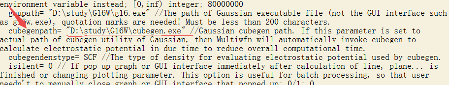
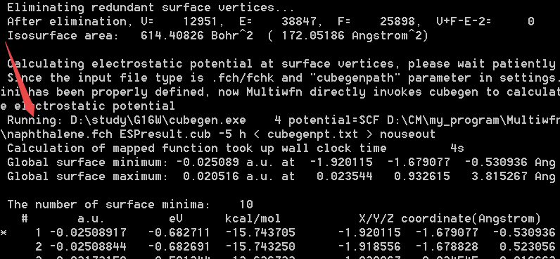

**注1**：**2020-Jul-4及以后版本的Multiwfn的自身的静电势代码计算速度较之前版本有脱胎换骨般提升**，见《Multiwfn的计算静电势的内部代码速度得到了极大的提升！》（<http://bbs.keinsci.com/thread-18268-1-1.html>）、《Multiwfn使用的高效的静电势算法的介绍文章已于PCCP期刊发表！》（<http://sobereva.com/614>）。对于计算拟合静电势电荷、分子表面静电势的定量分析**强烈不建议按照此文这样调用cubegen**，直接用Multiwfn自己的计算静电势的代码速度更快！！！只有通过主功能5计算静电势格点数据、主功能17做静电势的盆分析等需要计算整个空间均匀分布的静电势格点数据的时候，调用cubegen耗时才会更低。

**注2**：对于上述为数不多的适合调用cubegen的情况，如果你的波函数是ORCA算的，而且也没有Gaussian的话，可以用此文的做法节约分子表面静电势分析的耗时：《对ORCA用户大幅节约Multiwfn做分子表面静电势分析耗时的方法》（<http://bbs.keinsci.com/thread-16499-1-1.html>）。

**Multiwfn现已可以调用cubegen使静电势分析耗时有飞跃式的下降！**

文/Sobereva @[北京科音](http://www.keinsci.com)

First release: 2018-Aug-18  Last update: 2021-Jun-8

静电势是极为重要的实空间函数，Multiwfn (<http://sobereva.com/multiwfn>)中支持众多静电势相关分析，例如《静电势与平均局部离子化能综述合集》（<http://bbs.keinsci.com/thread-219-1-1.html>）这里提到的相关博文。考虑到Gaussian里的cubegen工具计算静电势速度比Multiwfn快，为了降低Multiwfn中使用较普遍的“绘制静电势平面图”和“分子表面静电势分析”功能的耗时，在之前的Multiwfn手册4.12节中明确说过怎么借用cubegen工具来显著节约耗时，但是大部分国内用户似乎不怎么看手册，而且手动调用cubegen对一些不懂什么是命令行界面的初学者来说“有难度”。

为了用户便利地显著降低静电势分析耗时，在2018-Aug-18于Multiwfn主页<http://sobereva.com/multiwfn>更新的Multiwfn 3.6(dev)版中，settings.ini文件里新加入了一个参数cubegenpath，如果这个参数被设为了本机的实际cubegen路径（Windows下的格式比如"D:\study\G16W\cubegen.exe"，Linux下的格式比如"/sob/g16/cubegen"），而且你的输入文件是fch或fchk，当Multiwfn做以下分析时，将直接自动调用cubegen代替Multiwfn内部代码计算静电势，使得总耗时有巨大下降，特别是对于大体系。  
(1) 绘制静电势曲线（主功能3）  
(2) 绘制静电势平面图（主功能4）  
(3) 各种需要计算静电势格点数据的功能（例如用主功能5计算静电势格点数据、用主功能17对静电势做盆分析、用主功能200的子功能14对静电势做域分析等）  
(4) 计算拟合静电势电荷，目前包括MK、CHELPG和RESP （主功能7的相应子功能）  
(5) 计算TrEsp原子跃迁电荷（如何实现见手册4.A.9）  
(6) 对静电势做定量分子表面分析（主功能12）  
Multiwfn还有很多其它和静电势有关的分析，但由于计算量小，就没有考虑借用cubegen算静电势。

经测试G09和G16的cubegen都可以直接调用，而且计算结果和基于Multiwfn内部代码算的静电势完全相同。G09自带的cubegen有bug，并行模式运行时结果往往诡异，因此对G09的cubegen，Multiwfn在调用时采用串行方式计算，只有用G16的cubegen时才用并行方式计算（并行核数和settings.ini里的nthreads相同）。Multiwfn通过判断cubegenpath里有无g16或G16字样来判断是G09还是G16的cubegen。

如果你不是Gaussian用户，但又想通过如上方式节约静电势计算时间，那么可以先用Multiwfn把其它量化程序产生的.molden文件、GAMESS-US或firefly输出文件（.gms）这些含有基函数信息的文件用Multiwfn转化为.fch格式，再用此fch文件作为输入文件即可。转换方式见《详谈Multiwfn支持的输入文件类型、产生方法以及相互转换》（<http://sobereva.com/379>）。

顺带一提，cubegen支持的各种实空间函数中，只有静电势计算速度快于Multiwfn，其它函数（如电子密度、电子密度拉普拉斯函数、分子轨道波函数等）的计算速度都远慢于Multiwfn，而且cubegen对于静电势以外的函数在计算时没法并行，故Multiwfn计算其它函数的时候不会考虑利用cubegen。

由于目前Multiwfn可以直接调用cubegen了，因此之前手册4.12.7节介绍的用户手动在命令行下调用cubegen降低静电势耗时的做法已被废除，不再被支持，手册这一节已被删去。

cubegenpath设置示例 

Multiwfn在分子表面静电势分析时自动调用cubegen时的截图 

注意事项1：如果Multiwfn借用cubegen的时候算小体系没问题，但算大体系的时候中途崩溃，有可能是cubegen可用内存不足所致。解决办法是通过GAUSS_MEMDEF环境变量设置cubegen可用内存量，见《巨大体系的范德华表面静电势图的快速绘制方法》（<http://sobereva.com/481>）中关于GAUSS_MEMDEF的说明。

注意事项2：cubegen计算静电势是基于.fch文件里的密度矩阵实现的。有的时候.fch文件里有多种密度矩阵，默认情况下使用SCF密度矩阵。如果你做的是后HF、TDDFT等计算，为了计算后HF波函数或激发态波函数的静电势，你需要修改settings.ini里的cubegendenstype参数成为对应的密度矩阵标识。比如，你用# MP2/cc-pVTZ density关键词产生了.fch文件，那么里面既有SCF密度矩阵也有MP2密度矩阵，如果你不改cubegendenstype参数，那么利用cubegen算的静电势将是HF级别的；如果你把cubegendenstype参数改为MP2，则cubegen算的静电势将是MP2级别的。更多关于.fch文件里密度矩阵的信息见《在Multiwfn中基于fch产生自然轨道的方法与激发态波函数、自旋自然轨道分析实例》（<http://sobereva.com/403>）文中的说明。

注意事项3：如果你通过Multiwfn里的某些功能对波函数进行了修改，比如通过主功能6里的子功能26对轨道占据数进行了修改，之后通过调用cubegen算的静电势将还是对应最初波函数的，因为.fch文件的内容没有被修改。如果你想基于修改过的波函数借用cubegen计算静电势，则应当在修改波函数后先用主功能100的子功能2把当前波函数导出为.fch文件，此文件中的SCF密度矩阵将对应于当前波函数，因此若再将导出的这个.fch文件作为输入文件借用cubegen计算静电势，对应的就是修改后的波函数的情况。

---

PS：之前肯定有人也直接用过cubegen计算静电势.cub文件，但通过Multiwfn调用cubegen来计算静电势.cub文件，比直接用cubegen计算静电势.cub文件要好的多得多，有这些原因：  
(1)Multiwfn全交互式操作，每一步提示超级明白易懂，因此不需要像用cubegen那样记忆命令行  
(2)Multiwfn在设定格点方面超级灵活，选项十分丰富，无论想怎么设格点，都能找到对应的选项可用。反之cubegen在设定格点方面很笨拙、非常死板、不人性化，我在此帖的回帖中有更多说明：<http://bbs.keinsci.com/thread-10685-1-1.html>  
(3)Multiwfn调用cubegen算完静电势格点数据后可以不借助第三方工具就直接绘制成等值面，还可以计算对应变形密度(deformation density)的静电势，对一些讨论颇有用，见比如《静电效应主导了氢气、氮气二聚体的构型》（<http://sobereva.com/209>）。
