本文的实例操作部分有视频演示，见：<https://www.bilibili.com/video/av35812201/>

**使用Multiwfn绘制跃迁密度矩阵和电荷转移矩阵考察电子激发特征**

Using Multiwfn to plot transition density matrix and charge transfer matrix to investigate electron excitation characteristics

文/Sobereva @[北京科音](http://www.keinsci.com)

First release: 2018-Nov-12  Last update: 2021-May-27

## 0 前言

跃迁矩阵（transition matrix）是一个泛称，表示各种蕴含了电子跃迁特征信息的矩阵。其中最常被研究的是跃迁密度矩阵（transition density matrix, TDM），其它的各种跃迁矩阵都是由TDM衍生而来，或者与TDM存在密切关系。大多数跃迁矩阵有两种表现形式，一种是实空间形式，可以通过等值面图、平面图来表现；另一种是一般意义的矩阵形式，矩阵元的标号可以对应于基函数序号、原子序号、片段序号，可以通过绘制热图（即填色矩阵图）来直观地展现。通过这些图可以一目了然地了解体系各个位点和位点间的耦合对电子激发的影响，对于帮助了解电子激发内在特征十分有帮助。本文介绍的研究方法和Multiwfn中的空穴-电子分析在原理上存在一定共通性，在展现形式上也有互补性，可以相结合讨论来更好地表征电子激发特征。

本文的主要目的是介绍怎么用Multiwfn产生和分析各种类型跃迁矩阵的等值面图和热图，使得读者可以在研究电子激发问题时拥有更强大的手段。Multiwfn可在其主页<http://sobereva.com/multiwfn>免费下载。如果对Multiwfn不了解，建议参看《Multiwfn入门tips》（<http://sobereva.com/167>）和《Multiwfn FAQ》（<http://sobereva.com/452>）。强烈建议在阅读本文前先仔细阅读《使用Multiwfn做空穴-电子分析全面考察电子激发特征》（<http://sobereva.com/434>）和《在Multiwfn中通过IFCT方法计算电子激发过程中任意片段间的电子转移量》（<http://sobereva.com/433>），这十分有助于更好地理解本文的内容。如果读者对于电子激发计算比较陌生，务必先看《Gaussian中用TDDFT计算激发态和吸收、荧光、磷光光谱的方法》（<http://sobereva.com/314>）。

值得一提的是很久以前笔者专门写过一篇相应博文《绘制跃迁密度矩阵平面图分析电子跃迁》（<http://sobereva.com/136>），这篇文章介绍的是如何在Multiwfn中绘制原子TDM的热图，此文发布后有大量研究文章都使用Multiwfn做了这种分析，比如J. Phys. Chem. C, 121, 2574 (2017)、RSC Adv., 7, 19576 (2017)、J. Mol. Model., 23, 28 (2017)等等。但现在来看这篇文章相对于目前版本的Multiwfn来说已经完全过时了，而且写得很糙，有些叙述也不太准确，所以看本文后就不要再看那篇文章了。

在讲操作和实例之前，先介绍一下跃迁密度矩阵(TDM)及相关概念。

## 1 基础知识

密度矩阵是对特定的某个电子态而言的，它是这个电子态波函数的一种变相表现形式。我们一般说的密度矩阵特指一阶约化密度矩阵，通过它可以获得这个态的各种单电子性质，诸如电子分布、偶极矩、静电势等。TDM则是对两个态之间的跃迁而言的，基于它可以获得跃迁过程中的一切单电子性质，诸如原子跃迁电荷、跃迁电/磁偶极矩等。TDM有两种表现形式，一种是实空间形式，另一种是一般意义上的矩阵形式（基函数表象下的形式），这两种表现方式在讨论实际问题时各有所长，下面依次介绍。类似地，TDM所衍生的跃迁偶极矩密度矩阵也有这两种表现形式，它与跃迁偶极矩密切相关，下面也一起介绍。

注：不考虑旋轨耦合时，TDM既有空间部分也有自旋部分，不同自旋多重度的电子态之间的TDM精确为0，但本文说的TDM及相关的矩阵，以及在Multiwfn中所产生的，一律是空间部分，因此即便是比如单重态跃迁到三重态对应的TDM也不是零矩阵。

### 1.1 TDM的实空间形式

对多电子体系，基态与激发态间的TDM的实空间形式T(r;r')通过下图第一个式子得到。

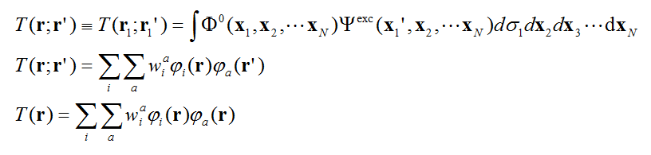

式中Φ0是基态波函数，Ψexc是某个激发态波函数，x是电子的自旋+空间坐标，σ是自旋坐标，r是空间坐标。之所以叫做“实空间形式”，是因为这样的TDM的两个指标是三维空间的坐标矢量。

如果计算激发态用的方法是单参考方法，比如常见的TDDFT、CIS、ZINDO，则激发态波函数通过各种单激发组态函数的线性组合来描述，此时T(r;r')可以更确切地写为上图第二个式子，其中a和i分别是空轨道和占据轨道序号，w是组态函数的系数。

由于r含有三个分量，因此T(r;r')是六维函数，没法简单地通过图像表示。如果我们取TDM的对角元，即让r=r'，此时T(r;r')就变成了T(r)，即上图的第三个式子，这叫做“跃迁密度”。由于它是三维函数，可以很容易地作图来考察。

跃迁密度看起来有点抽象，为了便于理解，我们可以考虑一个最简单的情况，即电子激发恰可以完美地通过一个占据轨道i向一个空轨道a的跃迁来描述，此时T(r)=φi(r)*φa(r)。显然跃迁密度有的地方为正有的地方为负，但正负不是我们这里关心的，这里我们只关心大小。跃迁密度越大的地方，对应i、a轨道在此处重叠越显著，即这两个轨道波函数的乘积的绝对值大；而i、a重叠小的地方，显然跃迁密度也会很小。实际的电子激发一般都不可能被一对轨道跃迁所完美描述，而应当广义地描述为“空穴→电子”。推广一下，我们也可以近似认为跃迁密度大的地方正是空穴和电子重叠程度大的地方。跃迁密度小的地方并不是说这样的地方在电子激发过程中没有牵扯到，只不过是说空穴和电子并没有“同时”在这个地方有较大分布。假设一个电子激发是A区域向B区域的电子转移激发，那么看到的跃迁密度图应该是在A和B相交的地方有较大分布，而在其余地方则较小。值得一提的是，由于分子轨道间的正交性，T(r)在全空间积分必定恰为0。

将跃迁密度分别与x,y,z坐标变量相乘，就得到了跃迁偶极矩密度的x,y,z三个分量，如下所示。

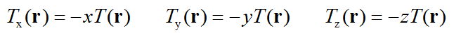

比如对Tx(r)进行全空间积分，就恰等于跃迁偶极矩的X分量。因此，利用跃迁偶极矩密度，可以十分方便地考察体系各个位置对跃迁偶极矩的贡献。众所周知，决定了电子态间跃迁概率的振子强度正比于跃迁偶极矩的模的平方（这点在<http://sobereva.com/314>中介绍了），因此对跃迁偶极矩密度作图，就可以一目了然地了解体系哪些区域对两个态间的跃迁概率有什么样的贡献。

上面所说的跃迁偶极矩特指跃迁电偶极矩，这也是我们平时最关心的跃迁偶极矩的形式。实际上还有跃迁速度偶极矩、跃迁磁偶极矩等。Multiwfn也可以给出跃迁磁偶极矩密度，公式见Multiwfn手册3.21.1.2节，将之全空间积分就是跃迁磁偶极矩了，这和用于绘制ECD光谱的转子强度直接相关。

### 1.2 TDM的常规矩阵形式

分子轨道本身是三维实空间函数，但是定义了基函数后，就可以将之通过各个基函数的展开系数来表示。类似地，在一套特定基函数下，TDM的两个指标就不再是连续的实空间坐标r和r'了，而是基函数的序号。此时基态与激发态之间的TDM可以通过下图第一个式子计算，它与实空间形式的TDM间可以通过下图第二个式子转化。

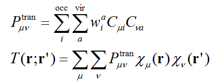

通过sum-over-states (SOS)方法计算体系的一些属性等场合需要利用到激发态之间的跃迁信息，因此激发态之间的TDM也是有实际价值的，Multiwfn也能给出，公式这里就不多说了。

一种常用的直观展现各个矩阵元大小的方式是热图(heat map)，即图像里每个格子对应一个矩阵元，根据矩阵元的数值对格子进行着色，这样一目了然就知道哪些矩阵元数值较大，以及是正是负，TDM也可以以这种方式展现。

TDM看起来比较抽象，如何通过观看它的热图来提取有意义的信息？我们可以看一个最简单的情况，假设体系只有两个基函数，而且电子激发可以完美地用轨道i→轨道a的跃迁来描述，此时的TDM如下，其中比如C_2a就代表a轨道中第2个基函数的展开系数。注意为了和文献中绘制的TDM的热图的习俗相一致，此处矩阵元的序号顺序和一般数学上的矩阵序号顺序不同。

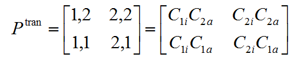

我们先看TDM的对角元。根据上面的表达式可见，如果(1,1)矩阵元的绝对值很大，必然1号基函数同时在i和a中的系数很大，可以广义地说1号基函数对空穴和电子都有很大贡献，或者说空穴和电子在1号基函数上有显著重叠。虽然密度矩阵是对称矩阵，但TDM一般不是对称矩阵。根据上式可见，如果(1,2)矩阵元比较大，则说明1号基函数和2号基函数分别在i和a中的展开系数的绝对值较大，可以广义地说1号基函数参与空穴较大而且与此同时2号基函数参与电子较大，根据笔者提出的IFCT分析的思想，从物理上可以理解为这种电子激发会导致体系的电子从1号基函数向2号基函数转移。而如果(2,1)矩阵元比较大，则说明电子激发会造成体系的电子从2号基函数向1号基函数转移。

相对于上一节提到的跃迁密度图，显然TDM热图还蕴含了更多信息，即它的非对角元还体现了电子转移特征，这在跃迁密度图上不直接体现。

### 1.3 原子TDM、片段TDM

上述这种TDM对应的热图并不是很好分析，因为基函数只有数学意义，通常不是我们感兴趣的层面。我们感兴趣的通常是电子激发牵扯到体系中的哪些原子，以及电子是怎么在原子间转移的。为此，我们可以把TDM人为地“收缩”成原子TDM，之后矩阵元的序号就对应原子序号了。收缩方式并不唯一，Multiwfn支持下面几种方法，从形式上看大同小异，被不同文献所使用：

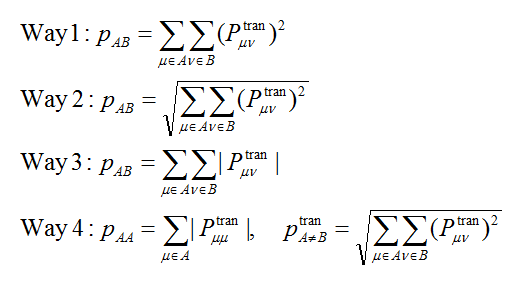

其中μ、ν是基函数序号，A、B是原子序号。TDM矩阵元有正有负，但正负号没太大物理意义，还会导致直接加和时相互抵消，因此上述把TDM收缩成原子的方法都是先通过取绝对值或者求平方把TDM矩阵元的符号去除后再加和成原子。由于氢原子通常对化学上感兴趣的电子激发贡献极小，因此为了矩阵的热图看着紧凑，通常在作图时忽略氢原子。

注：按照上述方法2,3,4产生的p矩阵是真正意义上的原子TDM，而第一种方法产生的p矩阵，其实严格来说不叫原子TDM，它对应的是所谓的correlated electron-hole probability diagram (CEHPD)这种图的矩阵，(A,B)矩阵元被解释为同时在A和B原子上发现空穴和电子的概率，见比如J. Chem. Phys., 113, 10002 (2000)和J. Am. Chem. Soc., 129, 14257 (2007)的例子。但不管上述哪种方法构建的p矩阵，在定性特征上都是相似的，绘制出的热图的效果一般也定性相同。为了叙述方便，下面都用“原子TDM”来统一称呼。

为了讨论方便，还可以构建并绘制片段TDM，它通过把原子TDM矩阵元直接加和来构建。

原子/片段TDM的一般形式可以这么示意：

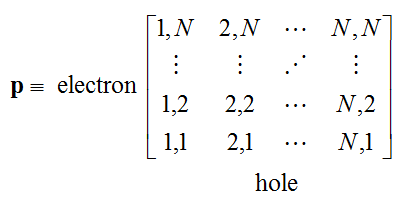

类似于对TDM的分析，我们对此矩阵可以近似这么理解：如果对角元(I,I)大，就说明电子和空穴同时在I位点上具有较大分布；如果非对角元(I,J)大，就说明空穴在I位点上大，同时电子在J位点上大，因此可以认为此电子激发伴随着I向J的电子转移。如果矩阵的左上部分和右下部分是基本对称的，即(I,J)≈(J,I)，就暗示电子激发时I→J和J→I的转移量基本相同，基本没有出现电荷的净转移。

值得一提的是，一些文献使用的TDM是按照下式对称化后的形式

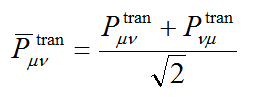

我不建议效仿这些文献用对称化后的TDM讨论，因为基于这样的TDM构建的原子/片段的跃迁矩阵的对角元就不再体现电子转移方向的信息。此时的(A,B)或(B,A)矩阵元大，只能简单地说A-B之间存在电子转移，这在一些文章中也被称为A和B存在相干(coherence)。

### 1.4 原子/片段的电荷转移矩阵

要注意，上面讨论TDM时提到的“电子”和“空穴”只是一种抽象的概念，这和Multiwfn中的空穴-电子分析方法中所定义的空穴和电子虽然在物理意义上类似，但绝对不是一码事，因为Multiwfn的空穴-电子分析里的空穴和电子是通过数学形式严格定义的。也因此，TDM图所展现的特征，和Multiwfn产生的空穴、电子的分布特征，虽然大多数情况下能对应起来，但并非总是能很好对应。

在笔者来看，比原子/片段TDM物理意义明显更明确，也同时更有实际价值的是原子-原子或片段-片段的电荷转移矩阵(charge transfer matrix)。电荷转移矩阵虽然和TDM的关系不是特别近，但也可以算是原子跃迁矩阵的一种。这种矩阵是笔者提出的IFCT分析方法的副产物，它的定义很简单，其矩阵元(I,J)=Θ(I,hole)*Θ(J,electron)。这里比如Θ(I,hole)就是指I原子或片段在hole中所占比率。比率的计算方法并不唯一，Multiwfn也支持不止一种算法，详见前述的《在Multiwfn中通过IFCT方法计算电子激发过程中任意片段间的电子转移量》一文。

根据IFCT方法的思想，(I,I)矩阵元直接对应电子激发时在I位点发生的电子重分布量，而(I,J)矩阵元直接对应从I位点向J位点转移的电子量。电荷转移矩阵显然也可以通过热图表现，这种分析方法在目前撰文时笔者还没发表，但笔者认为，有了电荷转移矩阵的热图，其实就没太大必要再用原子/片段TDM热图分析了，因为电荷转移矩阵比原子/片段TDM物理意义明显更明确，解释起来更清楚，而且和Multiwfn给出的空穴、电子分布图形总是精确对应。

### 1.5 原子跃迁偶极矩矩阵

跃迁偶极矩矩阵的矩阵元定义为对应的TDM矩阵元与相应基函数间的偶极矩积分的乘积。跃迁偶极矩矩阵有X,Y,Z三个分量，诸如X分量矩阵的所有矩阵元加恰为体系跃迁偶极矩的X分量。也可以将跃迁偶极矩矩阵收缩成基于原子的形式，原子跃迁偶极矩矩阵的X,Y,Z分量定义为

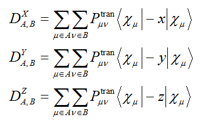

诸如X分量矩阵的(A,A)矩阵元就是完全由A原子自己对体系跃迁偶极矩X分量的贡献，而(A,B)则对应于A、B原子产生的联合贡献。还可以定义原子总跃迁偶极矩矩阵，其中每个矩阵元是相应X,Y,Z分量的平方和。原子跃迁偶极矩矩阵还可以进一步收缩成基于片段的形式。通过绘制原子/片段跃迁偶极矩矩阵的热图，对于解释跃迁偶极矩的大小、分析主要来源是有益的。

## 2 Multiwfn中与跃迁密度相关的分析

### 2.1 相关功能

在Multiwfn中，与本文主题有关的功能如下，都在主功能18里：  
(a)子功能1：这是空穴-电子分析模块，在计算空穴和电子格点数据的同时会顺带计算出前面提到的跃迁密度和跃迁偶极矩密度格点数据，可以直接观看其等值面、导出cube文件。  
(b)子功能8：这是IFCT分析模块，可以导出前述的原子-原子电荷转移矩阵到当前目录下的atmCTmat.txt。  
(c)子功能9：产生基态与激发态，以及激发态与激发态之间的TDM，可以导出为当前目录下的tdmat.txt。也可以导出TDM.fch，此文件中记录密度矩阵的段落对应于新产生的TDM。  
(d)子功能11：可以计算各个原子对基态与激发态间的跃迁偶极矩的贡献（《使用Multiwfn+VMD绘制片段贡献的跃迁偶极矩矢量》<http://sobereva.com/396>一文用到了此功能），还可以导出原子跃迁偶极矩矩阵到当前目录下的以AAtrdip开头的.txt文件中。  
(e)子功能2：这是本文的重点，用来绘制原子/片段跃迁矩阵的热图。跃迁矩阵可以以不同方式得到：可以让此功能直接生成基态到激发态的TDM，也可以从Gaussian输出文件中读取基态到激发态的TDM，也可以从前述的tdmat.txt或AAtrdip.txt或atmCTmat.txt中读取相应类型的矩阵。

以上功能具体使用细节在手册3.21节的相应章节里有非常详细易懂的说明，在此就不细说了，后文将通过实例进行演示。

### 2.2 输入文件

使用上述主功能18的子功能1、8、9、11，以及使用子功能2时打算直接产生TDM的话，需要以下两类文件，更具体说明参见Multiwfn手册3.21节开头。  
·第一类文件：记录了参考态波函数的文件，是刚启动Multiwfn时就需要载入的  
·第二类文件：记录了激发态组态系数的文件，是进入相应分析功能时需要载入的  
对于Gaussian用户，一般就用TDDFT算激发态即可（用CIS、TDHF、TDA-DFT亦可）。计算时候应当带IOp(9/40=4)关键词使得绝对值大于1E-4的组态系数都输出出来以使得分析结果可靠。把算完得到的chk转换为fch文件后就可以作为第一类文件，而Gaussian输出文件可作为第二类文件使用。这些分析绝不仅限于Gaussian用户能用，诸如GAMESS-US、Firefly、ORCA等用户也可以用，详见手册3.21节开头的说明。结合ORCA使用涉及的文件准备流程我还专门写了个文章进行介绍：《Multiwfn结合ORCA的TDDFT计算做空穴-电子等分析的方法》（<http://sobereva.com/758>）。

使用子功能2绘制热图时如果从tdmat.txt或AAtrdip.txt或atmCTmat.txt中直接读取相应类型的矩阵，那么第一类文件同前，载入第二类文件的时候输入这些txt文件的路径即可（文件名不能改为别的，否则程序不知道读的是哪类矩阵）。

使用子功能2绘制热图时如果想从Gaussian输出文件中直接读取TDM，那么第一类文件同前，载入第二类文件的时候输入Gaussian输出文件路径即可。此时Gaussian计算时必须写density=transition=x IOp(6/8=3)关键词，代表把基态到第x激发态的TDM输出到输出文件里，而IOp(9/40)则不再需要写。这种用法一般没必要用，也只会给出对称化后的TDM。仅当你的体系很大，不得不使用ZINDO半经验方法计算的时候，才需要以这种方式把ZINDO级别的TDM提供给Multiwfn绘制成热图（Multiwfn自己没法产生ZINDO这些半经验方法对应的TDM）。

## 3 实例

本文用的Multiwfn 3.6(dev)是2018-Nov-12更新的版本，绝对不要用更老版本，Gaussian用的是G16 A.03版。

### 3.1 绘制跃迁密度和跃迁偶极矩密度图

首先以一个简单分子N-phenylpyrrole（N-苯基吡咯）为例演示一下怎么绘制和讨论跃迁密度和跃迁偶极矩密度图。下面用到的.fch和.out文件是使用cam-b3lyp/6-31+G(d) TD(nstates=5) IOp(9/40=4)关键词产生的。

启动Multiwfn然后输入  
examples\excit\N-phenylpyrrole.fch  //文件在Multiwfn自带的examples文件包里  
18  //电子激发分析  
1  //空穴-电子分析  
examples\excit\N-phenylpyrrole.out  
1  //考察基态(S0)到第1个激发态(S1)的跃迁  
1  //计算和可视化空穴、电子、跃迁密度等函数  
2  //中等质量格点

算完之后，屏幕上输出了很多信息，大部分是与空穴-电子分析相关的，其中有一条和当前主题有一定关系：  
 Transition dipole moment in X/Y/Z:  -0.000021  -0.000045   1.767332 a.u.  
这是基于跃迁偶极矩密度格点数据在全空间做的积分值，即基态到第1激发态的跃迁偶极矩，其数值和Gaussian输出文件里的十分接近，以下是N-phenylpyrrole.out的第773行：  
       state          X           Y           Z        Dip. S.      Osc.  
         1         0.0000      0.0000      1.7813      3.1729      0.3935  
二者十分接近体现出当前研究用的格点设定是足够合理的，因此之后看到的跃迁密度和跃迁偶极矩密度的等值面图是可以充分说明实际问题的。

在后处理菜单中选选项5显示出来跃迁密度的等值面图，如下图左半边所示。如果选选项6，再选择一个分量，比如这里选Z，就会显示出跃迁偶极矩密度Z分量的等值面图，如下图右半边所示。等值面数值用的是默认的0.001。

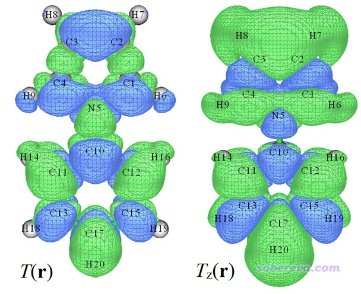

图中绿色和蓝色分别对应正值和负值等值面。跃迁密度等值面遍布整个体系，暗示当前研究的电子激发是整体跃迁，空穴和电子都分布在整个体系上，这点也可以通过绘制空穴和电子等值面图进一步确认（后处理菜单中选3）。跃迁偶极矩密度Z分量图实际上就是跃迁偶极矩密度乘上Z坐标再取负值后对应的图（图中Z轴由下指向上），从图中可见体系各个地方对跃迁偶极矩Z分量都有贡献，由于图中绿色区域显著大于蓝色区域，这解释了为什么当前的电子激发的跃迁偶极矩Z分量是明显的正值（1.767 a.u.）。

下图显示的是跃迁偶极矩密度X分量的等值面图，X是垂直于分子平面的方向。可以看到分子平面左右两侧的等值面颜色恰好相反，正负部分精确抵消，这是为什么当前体系的跃迁偶极矩的X分量精确为0。

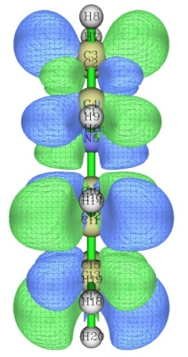

我们再来看S0到S5的跃迁情况。按照屏幕上的提示用相应选项退出空穴-电子分析模块，再次进入，让你输入要考察的激发态的时候选择5，然后按照前述步骤绘制跃迁密度、跃迁偶极矩密度以及空穴&电子图，分别如下所示

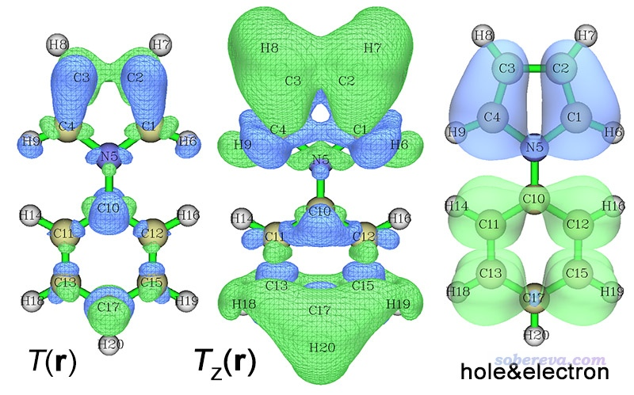

从空穴&电子图上看，此电子激发是明显的电荷转移激发，因为空穴几乎都分布在吡咯上，电子几乎都分布在苯环上，所以电子和空穴的重叠程度低，这导致体系各处的跃迁密度的数值都不太大，也因此上图的S0→S5的跃迁密度等值面图看起来等值面范围比起S0→S1的要小得多。当前的电子激发的跃迁偶极矩Z分量为1.06 a.u.，为什么是明显的正值也是从Tz(r)图上一目了然地就可以了解，主要是因为分子两端有显著的正贡献，明显超过了其它一些零星区域的负贡献。

上面的例子展现了跃迁偶极矩密度对于讨论体系局部对跃迁偶极矩贡献的重要价值。但要注意的是，跃迁偶极矩密度是依赖于原点的选择的，比如体系在Z正方向整体平移10埃，那么得到的跃迁偶极矩密度Z分量图就会和之前显著不同，原因从其表达式上很容易理解，因为它是在T(r)的基础上乘了个-z项（也因此，越接近原点的区域，跃迁偶极矩密度肯定倾向于越小）。而跃迁密度虽然与跃迁偶极矩之间的关系相对间接一些，但好处是其图像完全不依赖于原点的选取。

在笔者来看，从表象到深层原因，有这么个顺序：  
吸收/发射强度←振子强度←跃迁偶极矩←跃迁偶极矩密度←跃迁密度←空穴&电子分布  
就算我们不在文章里用跃迁(偶极矩)密度图来讨论，但脑子里有跃迁(偶极矩)密度的概念，对于我们想明白一些问题的本质也是极有帮助的。

如果在空穴-电子分析模块里先选一次选项"-1 Toggle calculating transit. magnetic dip. density in option 1"将之状态切换为Yes然后再计算格点数据，则算完格点数据后屏幕上会输出跃迁磁偶极矩矢量，并且可以在后处理菜单中选相应选项绘制跃迁磁偶极矩密度图。

跃迁密度、跃迁电/磁偶极矩密度也都可以通过后处理菜单中的选项导出cube文件，通过它还可以在Multiwfn里将之绘制成曲线图、平面图。过程参考《使用Multiwfn计算（超）极化率密度》（<http://sobereva.com/305>）中的相应做法。

对大多数实际研究的体系，跃迁偶极矩并不是像此例这样恰好冲着某个笛卡尔轴的，若我们想通过一张跃迁偶极矩密度图就能讨论它的贡献来源，应当旋转体系让体系跃迁偶极矩平行于某个笛卡尔轴，比如X轴，然后再重新用诸如Gaussian做一次电子激发计算并结合nosymm关键词，之后再用Multiwfn绘制并分析跃迁偶极矩密度X分量图即可。具体做法见《让体系(跃迁)偶极矩平行于某个笛卡尔轴的方法》（<http://sobereva.com/507>）。

### 3.2 绘制基态到激发态的原子TDM的热图

本例我们演示绘制下图所示的Donor-pi-Acceptor型长链分子NH2-C8-NO2的基态到激发态的原子TDM的热图，gjf,、out、fchk文件在examples\excit\NH2_C8_NO2目录下都提供了，Gaussian计算用的关键词为CAM-B3LYP/6-31G* IOp(9/40=4) TD(nstates=10)。一般来说原子TDM的热图只适合讨论一维链状体系，这样热图坐标轴上的序号才和原子位置容易对应起来，如果不是一维体系的话建议改用下一节示例的片段TDM图讨论。

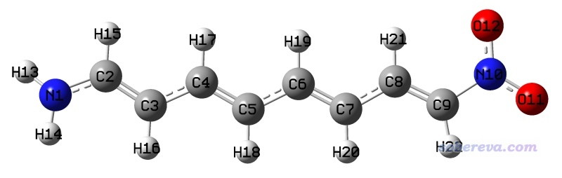

前面提到，原子TDM的热图里一般是忽略掉氢原子的，因此为了让热图里的序号和结构图里的序号直接对应，在计算前已经把氢原子的序号排到了非氢原子的后头，做法是在gview里，进入Edit - Atom List，选Edit - Reorder - All atoms: Hydrogens Last，然后再保存输入文件（如果你计算前没这么做也没关系，计算之后再这么在gview里操作一下，非氢原子序号也能和Multiwfn绘制的非氢原子构成的原子TDM热图对应上）。

启动Multiwfn，然后输入  
examples\excit\NH2_C8_NO2\NH2_C8_NO2.fchk  
18  //电子激发分析  
2  //绘制原子/片段跃迁矩阵的热图  
examples\excit\NH2_C8_NO2\NH2_C8_NO2.out  
1  //考察S0→S1激发。然后程序会产生这个跃迁对应的TDM  
n  //不对刚产生的TDM做对称化  
1  //用第1种模式（见本文1.3节的说明）将TDM收缩为原子TDM，此做法比较常用效果也好  
1  //绘制热图  
此时看到下图。默认的色彩刻度下限为0，上限为矩阵元的最大值。

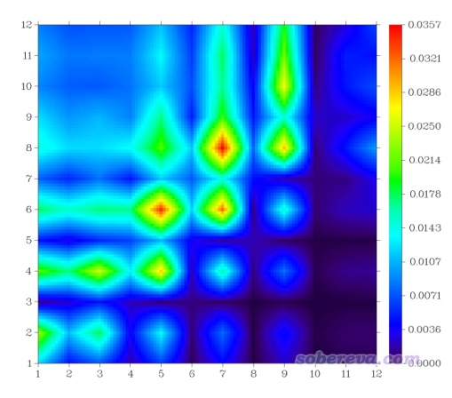

如前所述，这种图的对角元的大小体现在什么位置上电子和空穴同时有显著分布，而考察非对角元的时候，要先看横坐标（对应空穴位置），再看纵坐标（对应电子位置），根据热图中相应位置的数值大小，就可以知道电子在体系各位点间是怎么转移的。此例图中的对角线大部分都被绿色或红色包围，这立刻体现出这个跃迁必然是全局激发，激发的电子会牵扯几乎整个体系。此图不是沿对角线左上和右下对称的，对角线左上部分的数值整体比右下角部分更大，而且主要是在对角线附近比较大，因此此图反映出电子激发过程中各非氢原子上的电子会往与之近邻的原子转移，而且序号小的原子往序号大的原子转移的程度比序号大的原子往序号小的原子转移的更大。由于此体系非氢原子的序号顺序是从氨基向硝基排过去的，因此可以推测这种S0→S1激发导致电子从氨基端往硝基端整体移动。

如果觉得TDM的热图还有些抽象，可以结合空穴-电子分析给出的空穴&电子等值面图考察，如下所示

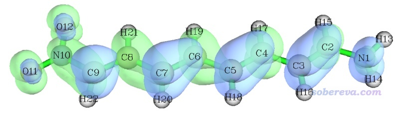

确实，从空穴&电子等值面图看到的情况和基于TDM热图做出的结论是基本一致的（尽管从原理上并不直接对应，因为此图展现的空穴和电子是严格定义、严格计算的，而分析TDM图时提及的空穴和电子只是抽象、含糊的概念）。

如果想绘制其它激发态的TDM热图就先退出热图绘制功能，再次进入时选择相应的态即可。绘制热图的功能的后处理菜单中有很多选项，含义不言自明，手册里也讲了，这里对其中几个专门提一下。"4 Toggle if taking hydrogens into account"用来切换是否考虑氢原子，如果选一次切换为Yes，再次作图，看到的图就是下面这样。氢原子序号是13~22，确实从图上看氢原子没怎么参与电子激发，对应的矩阵元数值都很小，因此把氢纳入S0→S1激发的热图确实没有什么意义。

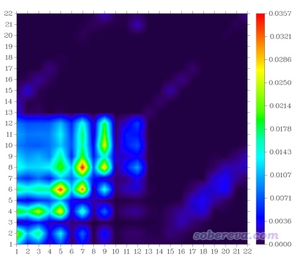

再看热图的格子之间插值对结果的影响。默认情况下插值10次，这样得到的图像比较平滑。如果选择6 Set the number of interpolation steps between grids然后输入1，就相当于不做插值，得到的图像如下所示。此时每个格子正好对应一个矩阵元，虽然对应关系精确，但看着就没那么舒服了。默认用的10次插值已经够大了，设得更大也可以，绘图时间会变得更长，而比默认设定所得图像并没什么明显改进。

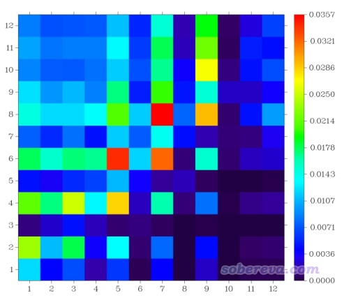

后处理菜单有个选项"Switch if normalizing the sum of all elements to unity"，如果将之状态切换为"Yes"，则程序会给矩阵数据乘上一个系数，使得所有矩阵元加和数值为1。这个设定对于当前这个电子激发的图没什么明显影响，但对于某些电子激发，不开这个选项的话可能矩阵元最大值也是非常小的，而开了这个选项后可以显著增大所有矩阵元的数量级，使得热图效果较好时色彩刻度上限不需要设得特别小。

我们再来看看构建原子TDM的时候选择模式2、3、4的时候图像效果分别各是什么样，如下所示

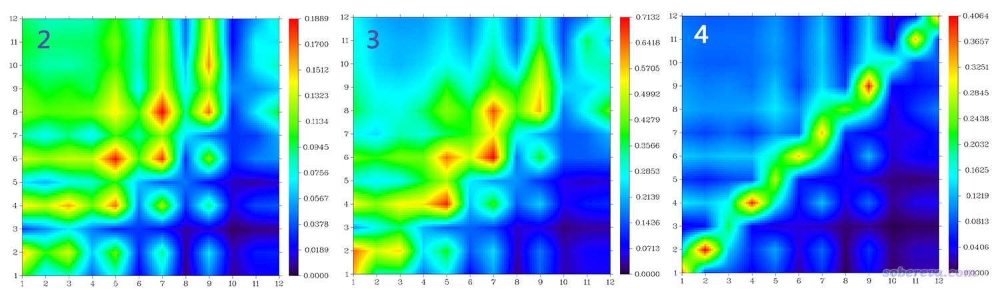

从图像上看，以上三张图和之前基于模式1构建的原子的TDM的热图传达的信息很类似。模式2、3的图像效果也都还可以，都可以用，但模式4对应的图不是很理想，由于其构建对角元和非对角元用的公式不同，导致图像上过度强调对角元了，而非对角元的特征展现得不是非常清楚。

我们再来绘制一下原子-原子电荷转移矩阵对应的热图，这种图和空穴&电子等值面图在原理上是严格对应的，可以严格对比。启动Multiwfn，依次输入  
examples\excit\NH2_C8_NO2\NH2_C8_NO2.fchk  
18  //电子激发分析  
8  //IFCT分析  
1  //类Mulliken方式计算空穴、电子的成份  
examples\excit\NH2_C8_NO2\NH2_C8_NO2.out  
1  //考察S0→S1激发  
-1  //导出原子-原子电荷转移矩阵到当前目录下的atmCTmat.txt中  
2  //绘制原子/片段跃迁矩阵的热图  
atmCTmat.txt  
1  //将刚载入的atmCTmat.txt里的矩阵绘制为热图  
此时看到的图像如下

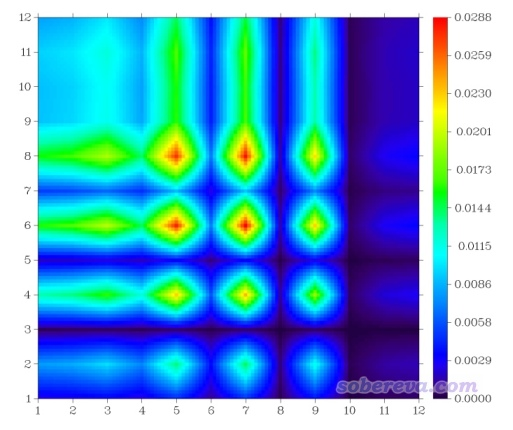

此图和之前基于模式2给出的原子TDM的热图的基本特征较为相似，但也有不可忽视的差异。当前这个图的每个非对角元比较严格地展现了原子间的电子转移量，我认为比原子TDM图更有意义。一列一列地看此图的话，可以直观地看到碳链上的每个原子都往它前端和后端的原子上转移了电子，往硝基一侧转移的明显更多一些。比如由图可见第5列的第6个矩阵元的数值大于第4个矩阵元，因此C5→C6的电子转移量大于C5→C4的。

我们再看看其它激发态的热图。S0→S2的第1种模式构建的原子ATM图，以及S0→S9的原子-原子电荷转移矩阵图如下所示，对应的空穴&电子等值面图也都附上了。由于S0→S9明显牵扯到了氢原子，因此绘图的时候也把氢考虑了进去（之所以S0→S9激发没有用原子TDM图展示，是因为此图与空穴&电子等值面图对应并不很理想）

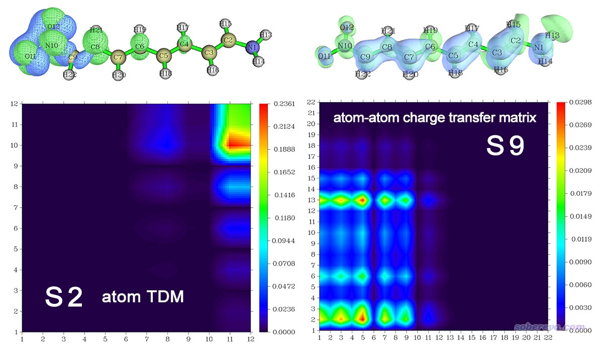

S0→S2的热图右上角有一块数值较大区域，体现出在体系末端的硝基部分，空穴和电子同时有较大分布。而且图像最右侧一列数值都不是很小，因此可以认为硝基向体系的中央区域转移了一定量的电子，这与空穴&电子等值面图上看到的情况相一致，也可以描述为硝基部分与体系中间区域在S0→S2激发时存在所谓的“相干”。

从S0→S9的原子-原子电荷跃迁矩阵热图中可以看出，电子从1~5、7~9号原子的区域往13号氢原子上转移电子非常明显，这和空穴&电子等值面图传递的信息完全对应。6号原子上几乎只有明显的绿色等值面，说明6号原子的电子没有给其它原子，而是从其它原子上获得了不少，相应地，热图上Y=6那一行颜色也比较鲜明，而X=6那一列则颜色很暗。可见，空穴&电子等值面图视觉效果最为直观，但是如果结合原子-原子电荷跃迁矩阵热图一起讨论，可以从定量角度理解得更透彻，而且也避免了等值面数值设定的任意性导致做出不合理判断的可能。

### 3.3 绘制基态到激发态的片段TDM的热图

这一节我们用下面这个体系作为例子，主要演示一下绘制基于片段的TDM的热图。用到的文件可以在这里下载：<http://sobereva.com/attach/436/file.rar>。

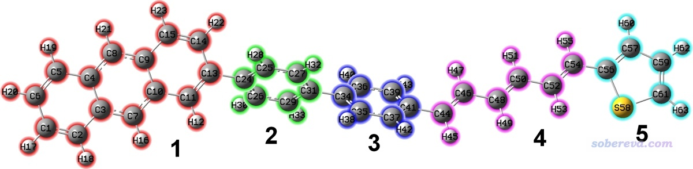

绘制片段TDM的热图的时候片段可以随意定义，矩阵元的序号就是片段的序号，所以也就不用要求体系中的原子序号必须和体系中原子坐标有对应关系，因此对于任意形状的体系，哪怕是星形、环形等都可以使用，非常灵活，而且图像展现的信息比原子TDM热图更为紧凑。当前我们按照上图标注的颜色对片段进行划分。

此体系的Gaussian的TDDFT输入文件是文件包里的tdmat.gjf，关键词为# CAM-B3LYP/6-31G* TD(nstates=10) IOp(9/40=4)。运行后得到文件包里的tdmat.out，同时产生的chk文件转换后是文件包里的tdmat.fchk。

绘制片段TDM热图前我们先看看S0→S1的原子TDM热图。启动Multiwfn，依次输入  
tdmat.fchk  
18  //电子激发分析  
2  //绘制原子/片段跃迁矩阵的热图  
tdmat.out  
1  //考察S0→S1激发。然后程序会产生这个跃迁对应的TDM  
n  //不对刚产生的TDM做对称化  
1  //用第1种模式将TDM收缩为原子TDM  
1  //绘制原子TDM的热图

看到的图像如下

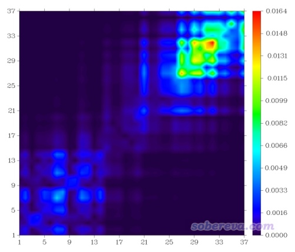

像当前体系这样原子数比较多，又含有环的情况，将体系结构和热图上的坐标进行对应比较麻烦，虽然也可以自行编辑图片来标记坐标轴什么范围对应体系的什么区域，比如像我很早前写的<http://sobereva.com/136>文中的图那样，但比较费事，而且如果体系特征更复杂的话，很难去标记。若是原子序号都不是连贯的，甚至根本没法标记。而自定义片段来绘制片段TDM就没这个问题了。

片段可以在Multiwfn界面里直接输入，也可以从文本文件中读取。如果片段多的话，建议还是写文本文件来定义片段，这样以后重新作图时就不用再次重新输入一遍了，也免得输入的时候万一输错而前功尽弃。记录片段设定的文件名随意，我们新建一个叫tdmfrag.txt的文件，写上以下内容，每一行定义一个片段：  
1-23  
24-33  
34-43  
44-55  
56-63  
横杠代表范围，格式很灵活，也可以写成例如2,4,9-14,88这种更复杂的形式。体系比较大的时候，如果不好确定片段里的原子序号，可以用gview来辅助给出，做法参看本文文首的视频里的演示。

然后在Multiwfn窗口里继续输入  
-1  //读入片段定义  
0  //从外部文件中读入  
tdmfrag.txt   //定义了片段的文件路径  
5   //修改色彩刻度范围  
0,0.4   //把色彩刻度下限和上限设为0和0.4  
1   //绘制热图  
此时看到下图，横/纵坐标序号现在对应的是片段序号了，空穴&电子等值面图也一并附上（isovalue用的是0.001），蓝框标注的部分是4号片段（己三烯）

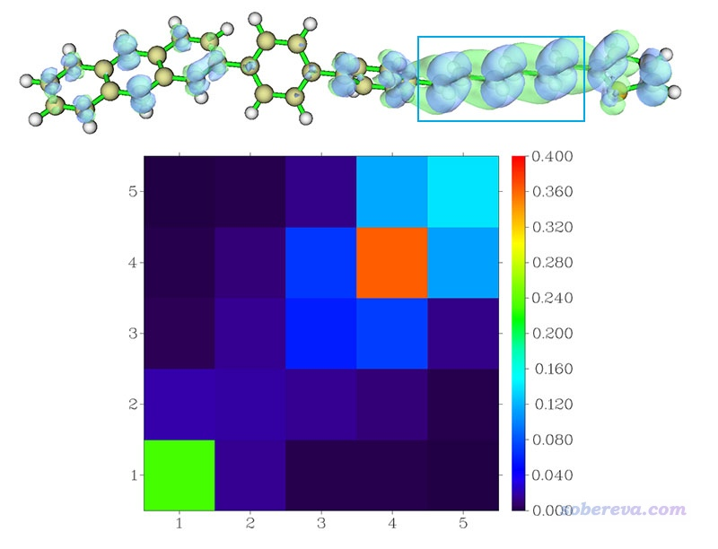

根据热图中的颜色，我们得知电子和空穴大部分都在片段4上，也一定程度同时出现在片段1和5上，这和等值面图看到的情况大体一致。由于图上非对角元不大，因此这种电子激发没有造成很显著的片段间电子转移。粗略地说，这个激发的主体特征是片段4上的局域激发。

如果进入热图绘制功能的时候载入的是IFCT模块产生的atmCTmat.txt文件，然后再同上载入片段设定，那么绘制的就是片段-片段电荷转移矩阵的热图了。这里就不再演示了，请大家自行绘制。

下面把S2~7的TDM热图绘制出来并手工合并在一起，得到下图：

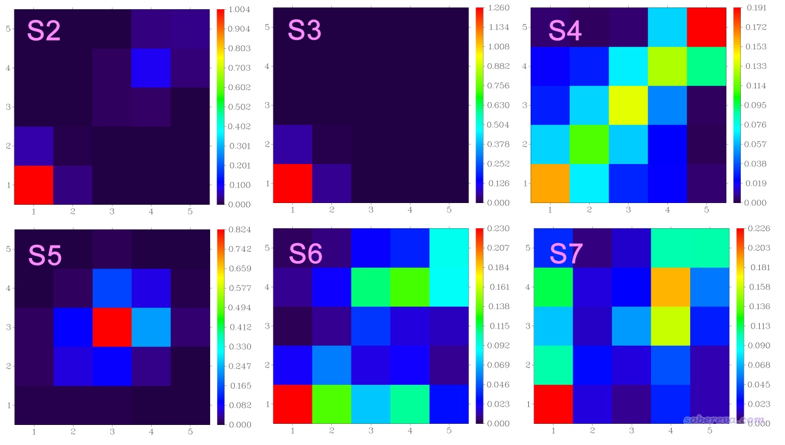

S2~S5的图的非对角元的数值相对于对角元来说都不显著，这种情况下只要看哪些对角元较大，就知道哪些片段在电子激发过程中被明显牵扯到。可见S0到S2、S3的跃迁主要都是在片段1，即分子中蒽的那部分，但S2也稍微牵扯到片段4，总的来说这两种跃迁都可以算是局部激发。而S0→S4一看就是整体激发。S5可以判断为主要是片段3那个苯环的局域激发，但也多多少少牵扯到其近邻区域。S6和S7彼此间有点呈现镜像关系，由图可见体系各个片段在电子激发时都牵扯到了，要么有空穴分布，要么有电子分布，要么二者都有。对于S0→S6来说，根据热图的颜色我们可以推测片段2、3、4向片段1转移了电子，片段3、5也往片段4有电子转移。如果你写文章的时候要同时讨论基态到一大批激发态的特征，显然像这样把相应的热图都合并到一起放到文章里是非常直观的。

### 3.4 绘制跃迁偶极矩矩阵的热图

这一节演示一下怎么绘制跃迁偶极矩矩阵的热图，考察这样的图有助于我们搞清楚体系不同区域对跃迁偶极矩的贡献，它和跃迁偶极矩密度等值面图有类似的价值，但表现形式不同。这里还用NH2-C8-NO2那个体系的S0→S1跃迁作为例子。

首先生成原子的跃迁偶极矩矩阵。启动Multiwfn，依次输入  
examples\excit\NH2_C8_NO2\NH2_C8_NO2.fchk  
18  //电子激发分析  
11  //将跃迁电/磁偶极矩分解为基函数和原子的贡献  
examples\excit\NH2_C8_NO2\NH2_C8_NO2.out  
1  //考察S0→S1激发  
1  //电偶极矩  
y  //将原子的跃迁偶极矩矩阵导出  
如屏幕的提示所示，矩阵数据已经导出到当前目录下AAtrdip开头的文件中了。其中AAtrdipX.txt是原子跃迁偶极矩矩阵X分量的数据文件，本例我们就是要考察跃迁偶极矩的X分量的情况，因此下面要用这个文件。

重启Multiwfn，输入  
o  //载入上次的输入文件  
18  //电子激发分析  
2  //绘制原子或片段的跃迁矩阵的热图  
AAtrdipX.txt

此时屏幕上看到  
Sum of all elements (including hydrogens):     -4.38875223  
Maximum and minimum (including hydrogens):      0.65818572     -0.82543408  
Sum of all elements (without hydrogens):       -2.86353889  
Maximum and minimum (without hydrogens):        0.65818572     -0.82543408  
此处的-4.38875223是包括氢在内的所有矩阵元的加和。由于跃迁偶极矩矩阵某个分量的所有矩阵元加和正对应于跃迁偶极矩的这个分量，因此-4.38875223就是S0→S1激发的跃迁偶极的X分量，这和Gaussian输出文件里下面这部分看到的-4.3881是直接对应的。  
 Ground to excited state transition electric dipole moments (Au):  
       state          X           Y           Z        Dip. S.      Osc.  
         1        -4.3881     -0.2570      0.0075     19.3211      1.6097

如上面提示所示，当前的矩阵元最小值是个负值-0.825，但是绘制热图的功能默认把色彩刻度下限设为0，因此我们得改一下色彩刻度，而且最好要让色彩刻度上、下限的绝对值相同，这样正负部分刻度是对称的。可以反复尝试找到令图像最能充分反映矩阵特征的数值。范围设太小的话，超过色彩刻度上限和下限的部分分别会显示为白色和黑色，就不美观了；而范围太大的话，矩阵元的差异就不容易通过颜色分辨开。

我们接着在Multiwfn里输入  
5  //修改色彩刻度范围  
-0.7,0.7  //色彩刻度下限和上限  
1  //绘制热图  
所得图像如下。这里也把这个激发的跃迁偶极矩密度X分量的等值面图一起附上便于对比，等值面数值设为了0.01

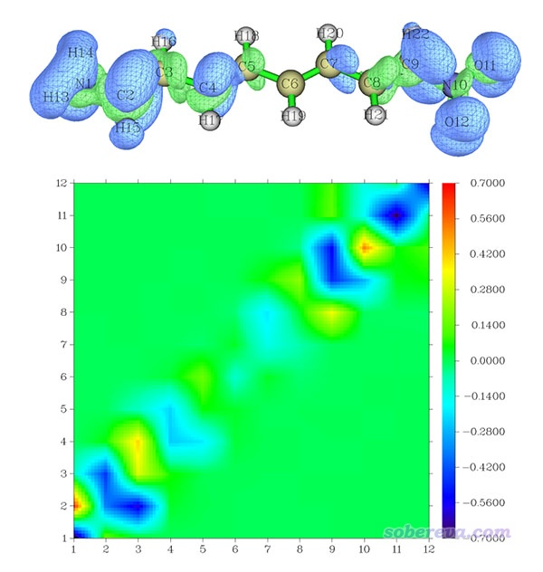

这个热图越蓝(越红)的矩阵元对跃迁偶极矩X分量起到越负(越正)的贡献。由于图上大部分都是蓝色的，因此所有矩阵元加和必然为负，解释了跃迁偶极矩X分量为什么为显著的负值-4.388。图上明显偏离对角线的矩阵元数值都很接近0，即都是绿色，因此原子间的长程耦合对于跃迁偶极矩X分量基本没有贡献。图上有几个部分蓝色很显著，比如(2,2)附近、(9,9)附近等，体现出这些位点及近邻的区域产生了明显的负贡献，这也正好对应等值面图上这些区域以蓝色等值面为主的现象。也有的位点比如(1,2)是明显的正值，这说明这俩原子间的耦合对跃迁偶极矩X分量有明显正贡献，这也正对应于等值面图上所看到的1-2原子间都是绿色等值面的现象。热图的中部基本都是一片绿，数值很小，相应地等值面图上分子中部没有什么等值面出现。

可见，将跃迁偶极矩密度和跃迁偶极矩矩阵结合到一起分析，对于弄清楚跃迁偶极矩的内在构成很有帮助。

### 3.5 绘制激发态间的跃迁密度矩阵的热图

这一节演示用Multiwfn绘制激发态到激发态的跃迁密度矩阵的热图，用NH2-C8-NO2的S1→S2跃迁作为例子。

首先产生S1→S2对应的跃迁密度矩阵数据文件。启动Multiwfn，依次输入  
examples\excit\NH2_C8_NO2\NH2_C8_NO2.fchk  
18  //电子激发分析  
9  //产生跃迁密度矩阵  
2  //产生两个激发态间的跃迁密度矩阵  
examples\excit\NH2_C8_NO2\NH2_C8_NO2.out  
1,2  //考察S1→S2激发  
直接按回车用默认的阈值  
0  //不对产生的跃迁密度矩阵做对称化  
n  //不产生TDM.fch文件  
现在当前目录下已经有了记录S1→S2跃迁密度矩阵的tdmat.txt。

重新启动Multiwfn，输入  
o  //载入上次的输入文件  
18  //电子激发分析  
2  //绘制原子或片段的跃迁矩阵的热图  
tdmat.txt  
1  //以方式1构建原子跃迁密度矩阵  
1  //绘制热图  
得到的图像如下。S2的密度减去S1的密度对应的密度差的等值面图也一并附上了，怎么绘制看《使用Multiwfn计算激发态之间的密度差》（<http://sobereva.com/429>）。

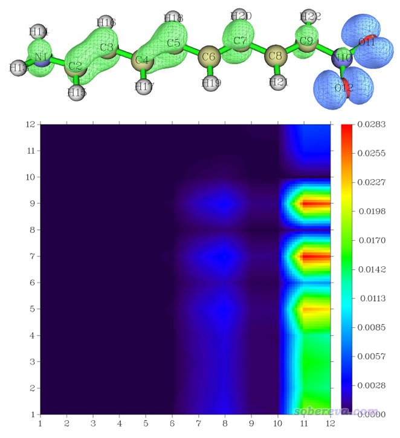

由于热图右侧X=11,12那一条中1~9号原子对应的区域数值很大，因此我们可推测在S1→S2激发过程中11、12号原子向1~9号原子转移了大量电子，这和等值面图上看到的结论完全一致。此例体现出密度矩阵热图不仅对于分析基态到激发态的跃迁很有益，对于讨论假想的激发态之间的跃迁也同样可以用。

## 4 技巧：对一批激发态批量绘制热图

如果你一次要考察一大批激发态，一个一个生成图像文件嫌麻烦，那么可以用Linux的shell脚本实现。

一次性产生指定范围激发态的片段TDM热图的脚本是Multiwfn程序包里examples\scripts\allTDM.sh文件。把3.3节用到的tdmat.fchk、tdmat.out、tdmfrag.txt和allTDM.sh都放到Multiwfn目录中，然后进入Multiwfn目录，用chmod +x allTDM.sh给其加上可执行权限，然后运行./allTDM.sh，这个脚本就会自动调用Multiwfn，在当前目录产生1.png、2.png直到7.png，对应S0-S1、S0-S2直到S0-S7的以模式1方式构建的片段TDM的热图。整个运行过程转眼就能完成，极其方便。

一次性产生指定范围激发态的片段-片段电荷转移矩阵的热图的脚本是Multiwfn程序包里examples\scripts\allCTmat.sh，执行方式同上。

默认的输入文件名、要算的激发态范围都可以自己编辑脚本来修改，脚本很简单，一看就秒懂。如果对如何通过脚本批量执行Multiwfn一无所知的话，建议看手册5.3节的相关说明。

## 5 总结&其它

本文全面地介绍了跃迁密度、跃迁密度矩阵、跃迁偶极矩密度、跃迁偶极矩矩阵、电荷转移矩阵等概念，并结合实例介绍了如何通过Multiwfn进行绘制和分析，同时还与Multiwfn的空穴-电子分析、密度差图等进行了对照。例子充分展现出分析上述函数和矩阵对于表征电子激发、弄清楚电子激发以及跃迁偶极矩的内在特征非常有帮助，十分值得在涉及电子激发问题的研究中充分灵活运用。

最后再强调一下，TDM和电荷转移矩阵虽然大多数情况下定性一致，但是有时也会出现定性不同的情况，尤其是非对角元上的差异可能较大，比如3.3节例子里的S0→S4激发。存在明显差异的时候，一般都是电荷转移矩阵元数值较大而TDM矩阵元较小（更深层的原因一定程度上是因为计算TDM非对角元的时候不同组态对应的项出现一定程度的正负抵消）。当电子激发没有一个组态函数占明显主导的情况，这两种矩阵出现定性不符的几率相对较大。凡是遇到把空穴&电子等值面图和TDM放在一起时发现特征不怎么对应的时候，建议使用电荷转移矩阵代替TDM。鉴于电荷转移矩阵物理意义更清楚，只用它来讨论而不用TDM是完全可以的。

有人问对比一系列体系或者一个体系的不同激发态的时候是否需要把TDM、电荷转移矩阵的色彩刻度统一。在我来看，如果你的目的是判断各个激发态的特征，比如是LE还是CT、涉及哪些片段间电荷转移，那么色彩刻度不是必须统一，让各个态的特征都能展现得尽可能鲜明才好。而如果你要定量考察不同跃迁中片段间耦合、电子转移的程度差异，那么色彩刻度应当统一。

在《一篇最全面、系统的研究新颖独特的18碳环的理论文章》（<http://sobereva.com/524>）中介绍的笔者的论文中（后来其中电子激发和非线性光学部分专门正式发表于Carbon, 165, 461-467 (2020)），笔者使用跃迁偶极矩密度方法探究了18碳环这种电子结构十分特殊的体系的S0->S21激发具有非常强吸收的原因，是跃迁偶极矩密度分析的很好的范例，非常推荐读者一读。

本文中各种跃迁矩阵图的颜色都是以默认的彩虹方式变化的，色彩变化实际上是可以在Multiwfn的绘制跃迁矩阵的功能里通过选项“9 Set color transition”随意调节的，支持一大堆色彩变化方式，比如蓝-白-红、灰度等等。Multiwfn产生的矩阵数据也可以导出，然后放到第三方作图程序如Origin里绘制成热图，届时有更多选项可以调节作图效果，更为灵活。在Origin里的绘制方法见本文顶端的视频里的演示。
