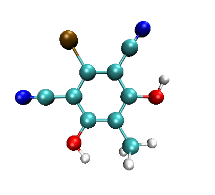

**基于OpenBabel批量产生特定基团以任意方式接到苯上的结构的方法**

A method to batch generate structures in which specific groups are attached to benzene in arbitrary way based on OpenBabel

文/Sobereva@[北京科音](http://www.keinsci.com)  2018-Sep-6

## 1 前言

最近在计算化学公社论坛有人问（<http://bbs.keinsci.com/thread-10797-1-1.html>），怎么自动产生一大批带有指定基团的取代苯，他希望CH3、H、CN、F、Cl、Br、I、OH基团以随机方式组合接到苯上面。我认为最简单的实现方式莫过于自己写个小程序产生各种取代苯的SMILES字符串，然后用OpenBabel产生三维结构，本文就介绍一下怎么实现。希望读者能举一反三，对于类似的问题也可以通过类似的方式解决。也有人提议通过把基团的三维结构直接拼接到苯上实现，但当基团是多个原子的时候，得考虑基团朝向问题，显然会比较麻烦。

SMILES是一种格式十分简单的描述分子结构的字符串，它在化学信息学里有重要的地位。比如苯酚的SMILES字符串表示为c1ccccc1(O)。SMILES只记录了原子间的连接关系，大部分分子都可以通过SMILES字符串来描述（而对于复杂的笼状体系就不太适合了）。如果对此不熟悉，请阅读<https://en.wikipedia.org/wiki/Simplified_molecular-input_line-entry_system>，里面对SMILES有十分简洁清晰的介绍。通常记录SMILES字符串的文件后缀为.smi。

OpenBabel是一款知名的化学文件格式转换程序，可以在<http://sourceforge.net/projects/openbabel/>免费下载。如果你是CentOS的用户，可以用yum install epel-release命令添加EPEL源之后用yum install openbabel命令直接装上。OpenBabel的还可以做基于力场的几何优化、加氢/去氢、合并/拆分文件、相似性对比、结构排序/对齐等。OpenBabel可以基于SMILES字符串通过CORINA算法快速、近似产生分子三维结构，因此只要把取代苯的SMILES字符串构建出来，即可通过OpenBabel得到三维结构。当然，这样得到的三维结构是很粗糙的，但作为像样的方法做几何优化的初猜结构是足够的。

## 2 产生各种取代苯SMILE字符串的代码

在搞懂SMILES字符串定义规则的前提下，稍微懂得编程的人都可以很容易地写出前述8种取代基以随机方式接到苯的六个位点的SMILES字符串的代码。以下是笔者用Fortran写的，由于很容易理解，就不再详细解释了。源代码文件和编译好的可执行文件可以在此下载：<http://sobereva.com/attach/440/file.rar>

!A tool for generating SMILES strings of substituted benzene. Programmed by Sobereva, 2018-Sep-6  
program gensubben  
implicit real*8 (a-h,o-z)  
integer,parameter :: nsub=8  
character*10 :: sub(nsub)=(/ "(C)","","(C#N)","(F)","(Cl)","(Br)","(I)","(O)" /)  
character*100 string  
nmol=20 !The number of molecules to be generated

CALL RANDOM_SEED()  
open(10,file="subben.smi",status="replace")  
do imol=1,nmol  
 ic=1  
 string=" "  
 do ipos=1,6  
  if (ipos==1.or.ipos==6) then  
   nlen=2  
   string(ic:ic+1)="c1"  
  else  
   nlen=1  
   string(ic:ic)="c"  
  end if  
  ic=ic+nlen  
  CALL RANDOM_NUMBER(ran)  
  isub=int(ran*nsub)+1  
  nlen=len_trim(sub(isub))  
  string(ic:ic+nlen-1)=trim(sub(isub))  
  ic=ic+nlen  
 end do  
 write(10,"(a)") trim(string)  
 write(*,*) trim(string)  
end do  
close(10)

write(*,*) "subben.smi has been generated in current folder, press ENTER button to exit"  
read(*,*)  
end program

启动程序后，此程序就会产生以随机方式产生20个取代苯，SMILES字符串既输出到屏幕上，也输出到当前目录下的subben.smi中。每次运行时产生的SMILES字符串都不同，以下是某此运行时产生的字符串中的前五个：  
c1(Cl)c(I)c(F)c(C#N)cc1(O)  
c1(I)cc(F)cc(C)c1  
c1(F)cc(O)c(I)c(Br)c1(O)  
c1(O)c(Cl)c(Br)c(I)c(F)c1(Br)  
c1c(C#N)c(O)cc(F)c1(I)  
c1(C#N)c(F)c(Br)c(Br)c(F)c1(O)

## 3 通过OpenBabel批量把SMILES字符串转化为三维结构

首先去OpenBabel官网下载安装包然后安装。安装后就可以在操作系统的命令行模式下（对于Windows指的是cmd或powershell）直接通过obabel命令调用了。虽然此程序也有图形界面，但用着还不如命令行模式方便。此程序的常用命令在这里有介绍：<https://open-babel.readthedocs.io/en/latest/Command-line_tools/babel.html>。

把上一节自写的程序产生的subben.smi放到当前目录下，在命令行模式下输入obabel subben.smi -O out.pdb --gen3d -m，马上就在当前目录下产生了out1.pdb、out2.pdb ... out20.pdb，这就是20种取代苯结构了。命令行中的--gen3d代表自动产生三维结构，-m代表进行拆分。

产生的这些结构可以拖到VMD中，然后用Extensions - Visualization - Multiple Molecule animation轮回显示，如下所示

如果你想在产生三维结构的时候顺带通过MMFF94高精度有机小分子力场进行优化，那么运行以下命令即可，所得的pdb文件里的结构就都是优化过的了。  
obabel subben.smi -O out.pdb --gen3d -m --minimize --ff MMFF94
