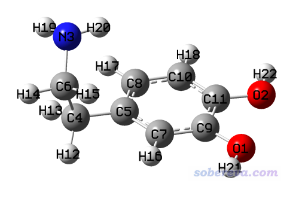
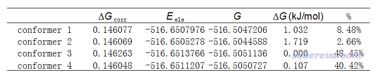
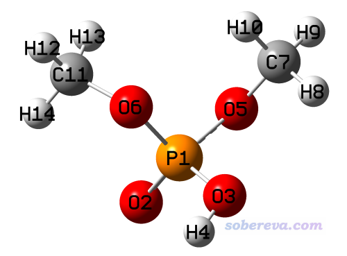
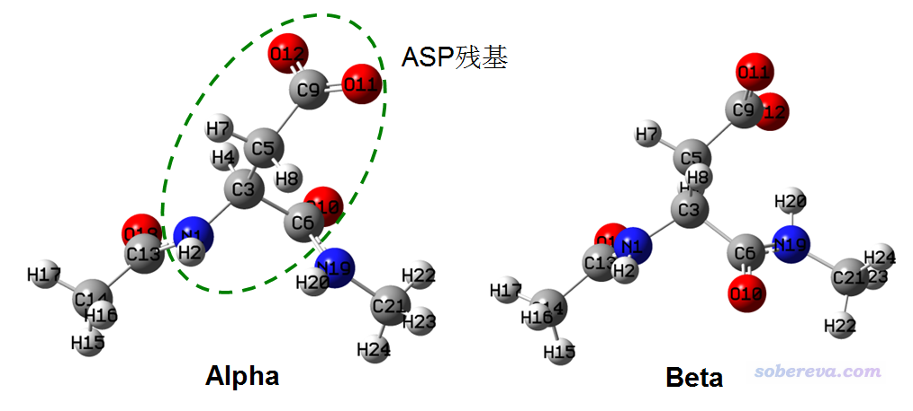
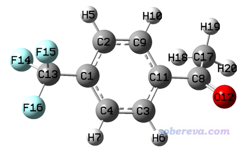
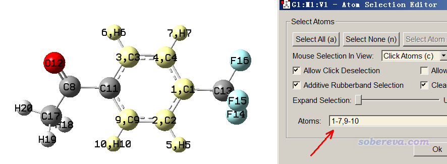
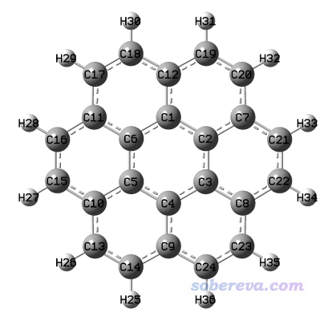
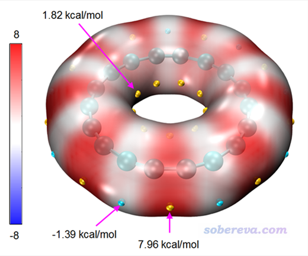
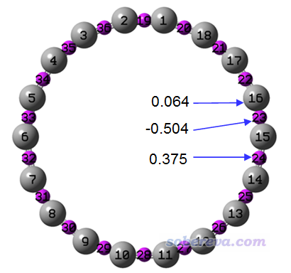

**补充1**：后来又写了《计算RESP原子电荷的超级懒人脚本》（<http://sobereva.com/476>），脚本会自动调用Gaussian和Multiwfn完成所有需要的计算，使得RESP电荷计算过程惊人的简单，从初始结构文件到给出最终RESP电荷，仅仅一行命令就能实现！

**补充2**：笔者后来写了《RESP2原子电荷的思想以及在Multiwfn中的计算》（<http://sobereva.com/531>），其中介绍的RESP2电荷是RESP的扩展，更恰当地考虑了溶剂对溶质电荷分布的极化效应，比起RESP电荷更适合用于凝聚相的分子动力学目的，强烈建议看完本文后一看。

**RESP拟合静电势电荷的原理以及在Multiwfn中的计算**

Principle of RESP charge and its calculation in Multiwfn

文/Sobereva@[北京科音](http://www.keinsci.com)

First release: 2018-Sep-13  Last update: 2022-Aug-27

**摘要**：本文介绍在分子动力学领域非常常用的拟合静电势电荷和Kollmann提出的RESP型拟合静电势电荷的原理和思想，并介绍Multiwfn程序中十分强大、灵活的RESP电荷计算模块，演示如何通过此模块计算标准的RESP电荷以及考虑了各种自定义约束时的拟合静电势电荷。仔细阅读本文后，读者会充分感受到Multiwfn是计算RESP电荷最方便、最快捷、最灵活、最普适的工具，再也没有必要用其它程序去算了。本文对原理、实现细节、用法介绍得非常详细，如果你仅仅是想立刻计算RESP电荷，那么直接看一下2.1节的RESP模块的简要介绍，再看3.1节的例子并效仿去做即可，**理解能力正常的人2分钟内就能学会！**

本文内容对应Multiwfn最新版本的情况，不要用老版本，否则情况可能与本文明显不符。最新版本可在其主页<http://sobereva.com/multiwfn>下载。如果对Multiwfn不了解，可阅读《Multiwfn入门tips》（<http://sobereva.com/167>）和《Multiwfn波函数分析程序的意义、功能与用途》（<http://sobereva.com/184>）。

PS：由于Multiwfn计算RESP电荷方面的各种优越性，目前已经有大量已发表的文章都是用Multiwfn算的RESP电荷，比如J. Membrane Sci., 605, 118105 (2020)、J. Mol. Liq., 305, 112845 (2020)、Molecules, 25, 895 (2020)、Phys. Chem. Chem. Phys., 22, 5577 (2020)、ACS Appl. Polym. Mater., 2, 685 (2020)、J. Phys. Chem. B, 124, 1148 (2020)、J. Am. Chem. Soc., 142, 18174 (2020)、Nature Sustainability (2023) DOI: 10.1038/s41893-023-01172-y等等，以往的靠Antechamber算RESP电荷的做法可以完全弃了。

如果你的研究中使用Multiwfn计算了RESP电荷，请在发表的文章中提及并务必引用Multiwfn启动时提示的程序原文。也建议同时按照《Multiwfn使用的高效的静电势算法的介绍文章已于PCCP期刊发表！》（<http://sobereva.com/614>）末尾的说明引用介绍Multiwfn中静电势计算算法的文章。

## 1 原理

## 1.1 拟合静电势电荷简介

原子电荷是描述化学体系电荷分布最常用的一种模型，每个原子带的净电荷用一个位于原子核的点电荷来描述，计算方法并不唯一，笔者在《一篇深入浅出、完整全面介绍原子电荷的综述文章已发表！》（<http://sobereva.com/714>）和《原子电荷计算方法的对比》（<http://www.whxb.pku.edu.cn/CN/abstract/abstract27818.shtml>）文中对此有充分的介绍和对比讨论。原子电荷计算方法可分为很多类，其中拟合静电势电荷是其中极为重要的一大类，笔者在《拟合静电势电荷的计算方法》（<http://bbs.keinsci.com/thread-221-1-1.html>）对各种拟合静电势电荷有较全面介绍，如果你连静电势都不懂是什么的话，推荐阅读《静电势与平均局部离子化能综述合集》（<http://bbs.keinsci.com/thread-219-1-1.html>）中的相关资料。

简单来说，拟合静电势电荷通过使原子电荷能尽可能好地重现基于波函数计算的分子范德华表面附近和外侧的静电势来得到（换句话说，是通过最小二乘法最小化基于原子电荷计算的与基于波函数计算的静电势在这些拟合点上的偏差得到，并同时通过拉格朗日乘子法约束原子电荷加和等于体系净电荷）。由于对这些区域的静电势重现性越好的原子电荷才能越好地通过经典的库仑公式描述分子间静电相互作用，而拟合静电势电荷在原理上又是对静电势重现性最好的原子电荷，因此拟合静电势电荷在基于经典力场的分子动力学领域特别受宠，被使用极其广泛。平时我们做分子动力学研究中，遇到一个新的小分子要模拟，通常就用拟合静电势电荷作为其原子电荷（但由于往往需要考虑与力场兼容性，可能有其它更恰当的选择）。

拟合静电势最常见、最知名的就是Merz-Kollman (MK)和CHELPG这两种，求解过程都是先根据几何结构和原子范德华半径确定分子范德华表面附近和外侧的拟合点位置，再基于波函数计算这些位置上的静电势，然后构造A矩阵和B矢量，做个q=A^(-1)B的矩阵运算，所得的q矢量就包含了求出来了拟合静电势电荷，具体公式和细节在Multiwfn手册3.9.10节有介绍。MK和CHELPG结果通常差异不太大，算法上的差别仅在于拟合点位置的设置上不同，CHELPG的结果在旋转不变性角度上比MK稍微好一点（旋转不变性是指体系整体朝向发生改变时对结果的影响，理应不该受到影响。但由于拟合点分布的原因，结果或多或少会有一点旋转依赖性）。

原子范德华半径在《简谈原子半径》（<http://sobereva.com/255>）中有介绍，有不同定义。计算拟合静电势电荷时用的原子半径一般是和范德华半径差不多的半径，半径选取的不同，拟合点的位置和数目就会不同，因此会影响结果。MK和CHELPG原文里都直接给出了一些原子的半径定义，但只对前三周期做了定义。而涉及更后面的元素时该用什么半径，没有确切答案，有人建议用UFF力场的非键半径除以1.2作为缺半径时候用的半径，这种做法是基本合理的。

MK和CHELPG电荷计算过程中都有格点密度的概念。对于MK电荷指的是在原子范德华表面附近及外侧的各个壳层上单位面积中的拟合点数，对于CHELPG电荷则体现在原子范德华表面附近及外侧一定距离内的三维空间中均匀分布的拟合点的密度。原理上，格点密度越高，格点数就越多，拟合结果就越准确，旋转依赖性同时也越低，但在计算静电势上花的耗时也越多。

## 1.2 拟合静电势电荷用于柔性分子模拟时的特殊考虑

对于模拟刚性分子的情况，MK和CHELPG电荷都非常适合，不需要考虑其它原子电荷计算方法。然而，对于有多重构象的柔性分子，基于MK和CHELPG为代表的一般的拟合静电势电荷做模拟主要存在以下问题：  
(1)结果对构象依赖性较大。柔性分子有很多不同构象，动力学模拟过程中构象经常发生变化，而拟合静电势电荷计算结果又对构象很敏感。如果只用一个构象去计算拟合静电势电荷并基于这种电荷做模拟研究，显然会对动力学行为以及不同构象间相对能量的计算结果带来误导性，因为只靠一套电荷注定没法较均衡、公平地描述不同构象。  
(2)单一构象下拟合的原子电荷不能体现原子的等价性。例如甲醇的甲基上的三个氢是化学等价的，在一般温度的动力学模拟过程中甲基也会频繁发生旋转，因此理应三个氢具有相同的电荷，然而任何构象下拟合出来的这三个氢的拟合静电势电荷都不是全同的（因为体系没有顺着甲基键轴的三重旋转对称性），因此这个问题也会给模拟带来一定不合理性。  
(3)被包埋的原子电荷拟合不准确。静电势拟合点都分布在分子范德华表面附近及外侧一定距离内，对于与多个原子相连的原子（如sp3杂化的碳），尤其是大分子内部的原子，由于它们距离拟合点较远，这些原子电荷的拟合质量较低、数值不确定性大。而且，随着构象变化，这些原子的电荷波动往往很显著，故这些原子的存在也等同于加剧了拟合静电势电荷的构象依赖性问题。

只有把上述问题解决，才可以较好地把拟合静电势电荷用在柔性分子的动力学模拟问题中。

对于上述问题(1)，一种比较好的解决办法是在拟合过程中考虑多构象。先确定各个构象权重，然后在构建A矩阵和B矢量的元素的时候利用各个构象下的拟合点并同时考虑权重值，这样得到的原子电荷就至少可以对权重比较大的那些构象的分子表面的静电势都有较好的描述。这种做法在J. Am. Chem. Soc., 114, 9075 (1992)一文中专门做了讨论。当然，这种考虑多构象的做法对于可旋转的键比较多的柔性分子会非常昂贵，因为体系的构象数是随可旋转的键增加呈指数型增加的。PS：还有一种做法是把各个构象下分别计算的拟合静电势电荷做权重平均，但结果在原理上不如在拟合过程中就考虑多构象那么好。

对于上述问题(2)，可以在拟合过程中对化学等价的原子施加等价性约束以使得它们的原子电荷相同，具体实现是把A矩阵的这些原子对应的行进行合并（即加和到一起），再把列也进行合并，对B矢量的相应的行也进行合并，最后求解此时维度已变小的矩阵方程来得到原子电荷，这样化学等价的原子就对应同一个电荷值了。PS：还有一种做法是先照常算出拟合静电势电荷，然后把化学等价的原子电荷取平均，但这样做得到的电荷对静电势的重现性不如前面说的做法好，人为因素更大。

对于上述问题(3)，在Kollman的RESP电荷原文中提出的解决思想是在衡量基于原子电荷与基于波函数算的静电势偏差的函数中引入惩罚函数，使得非氢原子的电荷有被拉低的倾向。他们选择的是双曲形式（hyperbolic）的惩罚函数，其中涉及一个紧密度参数b和一个限制强度参数a，前者一般都设0.1，而后者可以在实际计算时调节，数值越大惩罚函数效果越强，原子电荷被拉低的倾向越明显，也会同时导致静电势重现性变得越差。显然a参数要恰当选择，一般取小于等于0.001的值，也有文献用比较大的0.01。实测发现，引入这种形式的惩罚函数使得那些处于体系较外侧，因此与拟合点距离比较近故数值确定性较高的原子的电荷计算结果受影响相对较小，而令那些被包埋因而拟合质量较差的原子的电荷较明显地被拉低，由此很大程度上削弱了它们的数值不确定性。Kollman认为这种做法也明显降低了拟合静电势电荷的构象依赖性，而且又不会像考虑多构象那样显著增加计算耗时。引入双曲形式的惩罚函数后，拟合静电势电荷不再能一步求解出来，而需要做迭代直到所有原子电荷变化都很小。由于迭代时每一步计算量很小，所以是否引入双曲函数并不会对耗时带来太大影响。

一般使用基于原子电荷和基于波函数在拟合点上计算的静电势的偏差的RMSE和Relative RMSE（RRMSE）来衡量所得原子电荷对静电势的重现性。对于单个结构来说，使用上述任何特殊做法后，都会令RMSE/RRMSE相对于标准的MK或CHELPG的情况产生一定程度的增大，但是考虑到可以解决普通拟合静电势方法对于柔性分子在模拟中存在的明显问题，牺牲一些静电势重现精度、容忍RMSE/RRMSE稍微变大是明显值得的。

顺带一提，拟合静电势方法有个很大局限性就是对深度包埋的原子注定没法得到能真实反映其带电状态的原子电荷，比如对碳纳米管包夹小分子的体系计算其中小分子的原子电荷，以及计算周围被配体围满的过渡金属的电荷，拟合静电势电荷方法是不可能准确体现其实际电荷分布特征的，因为这些原子离大部分或者所有拟合点都太远，它们的原子电荷对拟合点处静电势重现性影响甚微，因此拟合静电势方法也不可能算准它们的实际电荷。这个问题无论利用上述提及的任何手段都无法解决，因此只能用其它原子电荷计算方法，比如笔者提出的原子偶极矩校正的Hirshfeld电荷(ADCH)，或者知名的NPA等。不过，如果你计算原子电荷的最终目的仅是通过原子电荷表现体系与体系外部其它原子的静电相互作用而不在于了解实际电荷分布状况，那么对上述存在原子深度包埋的体系用拟合静电势电荷完全没问题。

## 1.3 RESP电荷

Kollman等人在J. Phys. Chem., 97, 10269 (1993)中提出的Restrained ElectroStatic Potential (RESP)电荷可以说是到目前为止最适合用于柔性小分子做分子模拟（包括动力学、构象分析、分子对接等）用的原子电荷，很大程度解决了MK/CHELPG电荷存在的前述问题。RESP电荷的拟合分为以下两步，利用到了上一节提到的许多思想。  
• 第一步：拟合电荷时使用双曲惩罚函数对非氢原子施加弱限制（a=0.0005），不约束原子的等价性，所有原子的电荷都被拟合。这一步允许原子电荷变化有最大的自由度，以充分让极性原子尽可能好地拟合静电势。  
• 第二步：拟合电荷时使用双曲惩罚函数对非氢原子施加强限制（a=0.001），只允许sp3杂化的碳、亚甲基的碳，以及它们上面的氢的电荷被拟合，而其它原子的电荷保持上一步最后的状态。拟合中还约束每个-CH3, =CH2, -CH2-基团上的氢的电荷保持等价性。  
之所以RESP电荷分成两步，是因为作者经过谨慎测试发现，只有这么做，才能既解决普通拟合静电势电荷用于柔性分子的模拟时存在的问题，又不令外加限制和约束对静电势的重现性和原子电荷的质量带来太大损害。

RESP原文里用的拟合点分布和MK电荷相同，但也完全可以改用CHELPG电荷的拟合点分布。虽然Kollman等人认为RESP电荷已经很大程度减小了普通拟合静电势电荷的构象依赖性，但是，如果比较讲究的话，在拟合RESP电荷的时候还是应当同时按照上一节所述，在拟合过程中考虑多构象。

正由于RESP电荷很适合分子动力学模拟目的，因此在RESP电荷提出后，著名的蛋白质与核酸力场AMBER从其94版开始将RESP电荷作为了其获得原子电荷的标准方法。后来发展的普适性有机小分子力场GAFF也将RESP电荷作为御用电荷，和AMBER相兼容的以描述糖类为主的GLYCAM力场也基于RESP电荷。不过，GLYCAM为了充分考虑构象依赖性问题，是先对每种单糖在TIP3P水模型下模拟50~100ns，取100~200个结构，对每个结构计算RESP电荷后再取平均。

能算RESP电荷的程序不多，以往最知名、最常用的是免费的AmberTools程序包里的用于产生Amber程序用的有机小分子拓扑和力场信息的Antechamber程序，通过这个程序产生RESP电荷时它会自动调用RESP电荷提出者开发的代码。用Antechamber产生RESP电荷比较麻烦，得先用它产生带有特定关键词的Gaussian输入文件，Gaussian算完了之后得让它再读入Gaussian输出文件，因此使用者非得有Gaussian不可，而且Antechamber的运行参数也不怎么好记，此外，此程序对于无机或者金属有机体系都没法处理。还有个有点名气的计算RESP电荷的在线程序叫R.E.D.（<http://upjv.q4md-forcefieldtools.org/RED/>），这网站做得什么时候看都闹心、看着眼晕，反正我是完全用不明白，感觉把简单问题严重复杂化了。鉴于目前没有真正方便、好用的计算RESP电荷的程序，笔者在Multiwfn的布居分析（主功能7）中加入了RESP电荷计算功能，使用简单至极，而且这个模块的设计极为灵活和普适，能做的事绝不仅限于计算RESP电荷，这在后文将做介绍。有了Multiwfn就再也没必要用Antechamber和R.E.D.了。  
PS 1：NWChem、CP2K、Gaussian16 >=C.01、ORCA >=6.1版也号称能计算RESP电荷，但实际上那仅仅是支持在拟合静电势电荷计算过程中加入惩罚函数而已，**根本不算是一般意义的RESP电荷**（没用两步式拟合、没考虑等价性约束，更考虑不了构象权重），根本不适合用于小分子动力学模拟！不要随便看到某个程序支持RESP电荷就真以为能直接用它算！  
PS 2：只要拟合点位置完全相同，那么对一般体系，Multiwfn算的RESP电荷就和Antechamber给出的精确相同。但由于Antechamber利用的是Gaussian的MK电荷计算功能产生的拟合点，而Multiwfn和Gaussian产生MK拟合点位置的代码有一定差异，因此Multiwfn和Antechamber算的RESP电荷也略有出入，但二者都是完全合理的。相关说明详见《关于为什么Multiwfn算的出RESP电荷与Antechamber的有所差异》（<http://sobereva.com/516>）。

一个与RESP电荷关系比较密切的是AM1-BCC电荷，它在动力学模拟领域用得也很多。此电荷于J. Comput. Chem., 21, 132 (2000)提出，目的是以很便宜的方式就可以得到接近HF/6-31G*下计算的RESP电荷。AM1-BCC计算速度极快，它首先在AM1级别优化结构并基于AM1算的静电势得到拟合静电势电荷，这步耗时不高，之后会再做个查表方式的键电荷校正(BCC)，这步更是几乎完全不花计算时间。AM1-BCC算起来比RESP省事不少，只需要用Antechamber通过一个命令就可以计算。不过，AM1-BCC电荷在原理上终究只是RESP电荷的近似，对应的也只是不咋地的HF/6-31G*级别的RESP电荷，鉴于在如今的计算条件下，基于DFT优化一百多原子的结构并计算静电势都不是难事，而且做模拟的专业人士相对于图省事、省时更看重结果的好坏，特别是再加上诞生了Multiwfn这极为便利的计算RESP电荷的工具，我觉得就完全没有必要用AM1-BCC了，除非你要快速处理大批量分子。

## 1.4 在拟合静电势计算过程中施加电荷约束

计算拟合静电势电荷时，可以通过拉格朗日乘子法添加各种约束条件。其中最有意义的是添加电荷约束条件，就是让某个原子的电荷或者指定的一批原子的电荷总和等于特定值。前面提到，标准的RESP电荷的第二步计算时，除了sp3杂化的碳、亚甲基的碳以及它们上面的氢以外的各个原子的电荷都保持第一步计算的结果，这就是通过这种约束来实现的。电荷约束还可以实现很多特殊目的：  
(1)生物大分子、聚合物等体系都是一个个单元聚合而成的，这样的大分子中每个组成单元部分被称为残基，描述这类体系的力场都是对每种残基来给出原子电荷，因此整体电荷就由各个单体拼接而成。显然每个单体的净电荷得是整数。我们若想自己计算残基的原子电荷，就可以将残基两端用恰当的基团或片段进行封闭，然后通过电荷约束另残基部分电荷为期望的整数。（也有做法是不做电荷约束，而是之后自己手动调节残基里的原子电荷使残基的净电荷为整数，但这样显然任意性太强，原理上也远不如用电荷约束好）  
(2)有的力场比如GROMOS，利用了电荷组(charge-group)概念来降低cut-off方式计算静电作用的误差。每个电荷组包含数个原子，里面所有原子电荷加和为整数，比如每个羧基的总电荷要求为0，而它解离掉质子后电荷要求为-1。为了获得与电荷组概念相兼容的拟合静电势电荷，就可以利用电荷约束来保持各个片段的电荷为指定的整数。  
(3)有的时候可能基于二聚体或多聚体波函数来计算拟合静电势电荷，我们希望每个分子的电荷都为0，那么就可以利用电荷约束来实现。

显然，用电荷约束的时候所得拟合静电势电荷的RMSE或RRMSE肯定是大于不用约束时候的。电荷不能瞎约束，既得满足自己的特殊目的，又必须能大致符合实际电荷分布特征，乱约束会令所得电荷对静电势的重现性大打折扣，使模拟结果变差。

上述提到的内容的一些具体公式本文就不给出了，感兴趣者可参阅Multiwfn手册3.9.16节。

## 1.5 关于计算拟合静电势电荷的量子化学计算级别的选用

包括RESP在内的拟合静电势电荷计算结果直接受到量子化学中几何优化和计算静电势用的计算级别的影响。这里对计算级别的选用做一下建议。

(1)结构优化：对于计算拟合静电势电荷的目的，结构必须经过优化，但结构优化精度只要达到不错就可以了，不用要求超级精确，当然也不能太次。一般情况，理论方法就用常用的B3LYP即可，如果你不是量子化学内行的话，那么建议你在优化时总是带上DFT-D3色散校正。对前三周期元素，基组就用6-311G**即可。如果体系里有第四周期及之后的原子，对它们就用SDD赝势和它标配的赝势基组即可。

(2)计算静电势：泛函还是用B3LYP就可以。带不带DFT-D3校正对静电势计算结果无任何直接影响，因此可带可不带。如前述的《原子电荷计算方法的对比》一文的图5所示，只要基组达到中等质量，继续增大基组对结果也没有什么显著影响。对前三周期元素基组用6-311G**就够了，过渡金属还用SDD即可，而诸如Br、I等第四周期及之后的主族元素，我建议用lanl08(d)，这是带d极化函数的赝势基组（SDD赝势原始标配的赝势基组对主族是不带d极化函数的，因此对静电势的描述注定不会很理想）。

如果对上述提及的名词和相关知识不了解，请仔细阅读《DFT-D色散校正的使用》（<http://sobereva.com/210>）、《简谈量子化学计算中DFT泛函的选择》（<http://sobereva.com/272>）、《谈谈量子化学中基组的选择》（<http://sobereva.com/336>）、《谈谈赝势基组的选用》（<http://sobereva.com/373>）。

如果打算把拟合静电势电荷用在溶剂环境下进行模拟，那么在几何优化和计算静电势的时候都应当通过隐式溶剂模型表现溶剂环境。溶剂环境对几何结构影响往往不太大，但对于静电势影响总是很显著，尤其是对于极性较大的溶剂来说。这是因为溶质的电荷分布会被溶剂所显著极化，对于隐式溶剂模型而言，溶剂的介电常数越大，表现出的溶剂对溶质电荷的极化效应就越强。对于像水这样极性很大的溶剂，显然计算拟合静电势电荷的情况若不考虑隐式溶剂模型来反映出溶质的电荷分布被溶剂极化的现象，这样的原子电荷无论用在显式还是隐式水模型下的动力学模拟中，结果都会显著不合理。对于Gaussian用户，就用默认的IEFPCM隐式溶剂模型即可。如果对这些内容不了解，参见《谈谈隐式溶剂模型下溶解自由能和体系自由能的计算》（<http://sobereva.com/327>）。

比如你要模拟一个不含第四周期及之后元素的普通有机分子在乙醇中的动力学行为，若你是Gaussian用户，那么你只需要用# B3LYP/6-311G** em=GD3BJ opt scrf=solvent=ethanol关键词做计算，同时通过%chk指定chk文件产生的位置，等任务结束后，将chk转换为fch文件，然后交给Multiwfn计算MK或CHELPG或RESP电荷即可，这样算出来的电荷也正对应于B3LYP/6-311G**级别的静电势。如果不知道怎么把chk转换成fch，参见《详谈Multiwfn支持的输入文件类型、产生方法以及相互转换》（<http://sobereva.com/379>）中关于fch文件部分的说明。

若你计算拟合静电势电荷最终是打算结合可极化力场去用，那么拟合静电势的时候就别再用隐式溶剂模型了，因为外环境对溶质的可极化效果此时不需要由原子电荷等效地体现，而是有专门的项（如可极化偶极、Drude振子）来体现。

**注**：如果你的原子电荷是用于溶剂环境下的非可极化力场的分子动力学模拟目的，其实最理想的做法并不是像上述那样直接在隐式溶剂模型下算RESP电荷，而是将隐式溶剂模型下和气相下算的RESP电荷取平均，这称为RESP2(0.5)电荷。关于这点，笔者在另一篇文章做了非常详细的阐述，做分子动力学的人务必在读过本文后阅读：《RESP2原子电荷的思想以及在Multiwfn中的计算》（<http://sobereva.com/531>）。

## 2 Multiwfn中的拟合静电势电荷计算功能

本节介绍一下Multiwfn中的拟合静电势电荷计算功能的设计和使用。

## 2.1 Multiwfn中的两个与拟合静电势电荷有关的模块

Multiwfn里目前有两套计算拟合静电势电荷的模块：  
(1)主功能7中的子功能12和13，分别用于计算标准的CHELPG和MK电荷。此功能在很老的Multiwfn版本中就有。  
(2)主功能7中的子功能18，这叫RESP计算模块，一方面可以用于计算标准形式的RESP电荷，另一方面可以计算带有自定义的电荷约束、原子等价性约束、惩罚函数参数的MK和CHELPG拟合静电势电荷。而且拟合过程中支持多构象。

相比之下，(1)的功能比较简单，没太多好说的。(2)远比(1)更强大、更普适，选项较多，因此在下文就专门介绍一下。

使用这两个模块要求Multiwfn的输入文件里包含波函数信息，更确切来说，是至少包含GTF信息。哪些输入文件包含GTF信息，看过《详谈Multiwfn支持的输入文件类型、产生方法以及相互转换》（<http://sobereva.com/379>）就自然明白了。量子化学程序产生的诸如.wfn、.wfx、.fch、.gms、.molden等格式的文件都可以作为输入文件。由于Multiwfn支持格式丰富，Gaussian、ORCA、GAMESS-US、NWChem、Molpro等几乎所有主流量化程序都可以结合Multiwfn计算RESP电荷。

如果你的CPU核数多于四核，别忘了启动Multiwfn之前把settings.ini里的nthreads设为实际CPU核数，以使用所有CPU核心并行计算来降低耗时。

## 2.2 Multiwfn中的RESP计算模块的选项

进入Multiwfn主功能7的子功能18（RESP计算模块）后会看到一堆选项，其含义光看选项上的文字就应该能理解。下面依次说说。

如果你想按照Kollman在RESP原文里定义的做法来计算标准的RESP电荷，直接选选项1即可。由于这个过程包含两个步骤，所以被称为two-stage RESP fitting。

如果你想只想计算普通的拟合静电势电荷，选择选项2即可。这个过程只需要一步，因此也叫one-stage ESP fitting。在计算前，你可以用选项4来设定计算时对非氢原子施加的双曲惩罚函数的a、b参数大小，用选项5设定原子等价性约束，用选项6设定电荷约束。默认情况下，惩罚函数的b=0.1、a=0.0005，要求每个CH3和CH2基团中的氢的电荷等价，不施加电荷约束。

用选项4也可以人为修改标准RESP电荷计算过程中每一步的惩罚函数参数。在选项4和5里分别由用户自定义的等价性约束和电荷约束不仅对于one-stage ESP fitting有效，对于two-stage RESP fitting也有效，但仅对其第一步生效（根据标准的RESP拟合过程可知，在其第二步自定义约束是基本没意义的，或者说这样会和方法本身定义的约束方式造成冲突）。

设计算RESP电荷和计算普通拟合静电势电荷时都可以在拟合时考虑多构象，只要计算前先选-1，从外部文件中读取各个构象路径以及构象权重即可。

默认情况下是基于MK拟合点来计算的，如果想改用CHELPG的，选选项3可以修改。而且用选项3选择分布拟合点的方法后，还可以设定拟合点分布的具体参数，比如对于MK来说可以设每平方埃的点数、拟合点有几层等。Multiwfn默认的格点密度已经足够大了，一般不需要再调得更大。

计算标准RESP电荷，以及计算普通拟合静电势电荷但要求CH3和CH2基团中的氢的电荷等价时，程序需要利用原子间连接关系来进行判断哪些原子的电荷要被拟合、哪些是要求等价的氢原子等等。默认情况下，两个原子间距离小于二者CSD共价半径和的1.15倍就被当成成键。如果觉得连接关系和期望的不符，一个做法是选择选项7，从指定的.mol文件中读取连接关系。.mol也叫MDL file，是一种常用的记录分子结构的格式，其中有连接关系字段。.mol用常用的gview就可以生成，gview里把哪些原子之间用键连上，保存出来的.mol文件里的连接关系就会有相应的体现。另外，也可以在Multiwfn主功能0里面修改连键的阈值，哪些键此时是连着的直接从图形窗口就能看到，把阈值调到所有原子间键连关系都合适后，再进入RESP模块进行计算，则计算时用的键连关系和主功能0的图形窗口中看到的将是一样的。

先选择一次选项8把状态切换为Yes后，在计算RESP或普通拟合静电势过程中，Multiwfn会从用户输入的Gaussian的pop=MK或pop=CHELPG并带有IOp(6/33=2)关键词的任务的输出文件中直接读取拟合点的位置和拟合点上的静电势数值，此时Multiwfn就不会自己去设定拟合点位置并计算静电势了。另外，Gaussian还有个选项IOp(6/42=x)，x是设定用pop=MK做拟合静电势电荷计算时候每平方埃上的拟合点数，建议用6，这也正对应于Multiwfn默认的情况。一般来说，从Gaussian输出文件里读取拟合点的这个功能一般用不着，但如果你习惯在服务器上做计算，而在配置不怎么样的PC上用Multiwfn做分析和写文章，那么就这个功能就能派上用场了，在PC上计算拟合静电势电荷时直接读服务器上产生的带有拟合点信息的Gaussian输出文件即可。还有，如果你可能对一个体系多次计算拟合静电势电荷，每次计算用不同的设置，那么产生带有拟合点信息的Gaussian输出文件后，就不用每次做拟合静电势计算的时候重算静电势了，省了很多时间。  
注意：pop=MK或CHELPG IOp(6/33=2) IOp(6/42=x)关键词必须对单点任务加，绝对别用在opt任务上，否则优化任务中Gaussian会对初始结构输出一次静电势拟合点信息，对最后结构也会输出一次静电势拟合点信息，两次显然是不同的。如果让Multiwfn读取这样任务的输出文件，Multiwfn就会被搞糊涂，读取的可能是初始结构的拟合点信息，显然此时的结果可能是严重不合理的。

Multiwfn拟合静电势时可以考虑额外的拟合点，也就是对于非原子中心位置的点也可以对其拟合电荷，这对于某些情况很有意义，见3.6节。

Multiwfn一般以交互式方式运行，但也完全可以以命令行方式运行，一条命令就可以直接计算出拟合静电势电荷了，见《计算RESP原子电荷的超级懒人脚本（一行命令就算出结果）》（<http://sobereva.com/476>）。还可以写脚本批量计算一大堆分子的RESP电荷，方法见手册5.2和5.3节的说明。

有一些更细节上的东西这里就不提了，大家可参阅Multiwfn手册3.9.16节，对应RESP计算模块的介绍。下面就通过各种实例来演示Multiwfn的RESP计算模块的使用，同时也帮助大家更好地理解RESP电荷的思想还有前述的诸多讨论。

## 3 计算实例

下文用到的所有文件都可以在此下载：<http://sobereva.com/attach/441/file.rar>。本文用的Gaussian是G16 A.03，Multiwfn用的是2018-Sep-11更新3.6(dev)版。

## 3.1 标准的RESP电荷计算实例：乙醇环境中的多巴胺

下面我们对简单有机小分子多巴胺计算标准的RESP电荷。此体系有多个构象，这里我们用的是在《gentor：扫描方式做分子构象搜索的便捷工具》（<http://bbs.keinsci.com/thread-2388-1-1.html>）中搜索出来的能量最低的构象，如下所示。

Gaussian的优化任务输入文件如下所示，坐标部分略，完整文件是本文文件包里的dopamine-single下的dopamine.gjf。  
%chk=dopamine.chk  
 # B3LYP/6-311G** em=GD3BJ opt scrf=solvent=ethanol  
    
  Title Card Required  
    
  0 1

算完后把dopamine.chk用formchk转成fch。启动Multiwfn，依次输入  
dopamine.fch  
7  //布居分析与原子电荷计算  
18  //RESP模块  
1  //计算标准RESP电荷  
在普通4核Intel CPU下，只需要10秒左右就算完了。输出信息最后显示的就是标准的RESP电荷，如下所示

  Center       Charge  
    1(O )  -0.5406591096  
    2(O )  -0.5360249634  
    3(N )  -1.0237492930  
    4(C )  -0.3004859752  
    5(C )   0.1711380986  
    6(C )   0.5622482232  
    7(C )  -0.3931634336  
    8(C )  -0.2705581837  
    9(C )   0.2620223130  
   10(C )  -0.3419200343  
   11(C )   0.2508650859  
   12(H )   0.0727236261  
   13(H )   0.0727236261  
   14(H )  -0.0640806350  
   15(H )  -0.0640806350  
   16(H )   0.1956777773  
   17(H )   0.1606950156  
   18(H )   0.2044556422  
   19(H )   0.3674982935  
   20(H )   0.3689299792  
   21(H )   0.4257617766  
   22(H )   0.4199828057  
Sum of charges:   0.0000000000  
RMSE:    0.002097   RRMSE:    0.110460

结果非常正常。注意看的话，会发现12和13号氢，以及14和15号氢的原子电荷精确相同，因为它们都是-CH2-基团上的氢，在RESP计算的第二步被强制约束相等。输出的RMSE和RRMSE值都不大，一般达到当前程度的数值，就算拟合质量比较不错了，而如果RMSE和RRMSE都很大，则说明靠原子电荷模型已经无法准确描述体系范德华表面附近及外侧的静电势了，而需要用更复杂的电荷分布模型（比如在原子核或化学键上引入点偶极矩、点四极矩之类）。

最后程序问你是否把算出来的原子电荷导出到当前目录下的dopamine.chg文件中，如果输入y就会导出。chg文件的格式很简单，就是记录元素名、原子坐标和电荷值。Multiwfn里的某些功能是需要靠chg文件作为输入文件提供原子电荷信息的，比如若你将chg文件作为输入文件就可以用Multiwfn的主功能3、4、5计算和绘制基于原子电荷产生的静电势，以及通过主功能7的子功能-2基于原子电荷计算指定片段间的静电相互作用能。

在计算过程中输出了不少信息，为了便于大家更好地理解计算细节，下面解读一下。

计算一开始程序先确定拟合点的位置，在屏幕上输出当前计算用的原子半径，以及总拟合点数，如下所示。如果碰到第四周期及之后的元素，此处程序会让你输入那些元素的半径，一般就直接按回车让程序用UFF半径除以1.2的值即可。  
 Atomic radii used:  
  Element:H      vdW radius (Angstrom): 1.200  
  Element:C      vdW radius (Angstrom): 1.500  
  Element:N      vdW radius (Angstrom): 1.500  
  Element:O      vdW radius (Angstrom): 1.400  
  Number of MK fitting points used:     13394

然后程序就对拟合点计算静电势。算完静电势之后程序就开始RESP电荷的第一步的计算，即对非氢原子施加弱限制（a=0.0005）计算常规的拟合静电势电荷。前面提到，施加双曲形式的惩罚函数时需要迭代求解，因此从下面的输出看到程序作了迭代。到了第7轮的时候，原子电荷最大变化值已经小于阈值0.000001了，于是宣告收敛。  
  No charge constraint is imposed in this stage  
 No atom equivalence constraint is imposed in this fitting stage

 **** Stage 1: RESP fitting under weak hyperbolic penalty  
 Convergence criterion: 0.00000100  
 Hyperbolic restraint strength (a): 0.000500    Tightness (b): 0.100000  
 Iter:   1   Maximum charge variation:    1.0067306224  
 Iter:   2   Maximum charge variation:    0.0503406929  
 Iter:   3   Maximum charge variation:    0.0040155661  
 Iter:   4   Maximum charge variation:    0.0003425806  
 Iter:   5   Maximum charge variation:    0.0000329903  
 Iter:   6   Maximum charge variation:    0.0000032384  
 Iter:   7   Maximum charge variation:    0.0000003207  
 Successfully converged!

然后程序开始RESP电荷第二步的计算，输出信息如下所示  
 **** Stage 2: RESP fitting under strong hyperbolic penalty  
  Atoms equivalence constraint imposed in this fitting stage:  
  Constraint   1:   12(H )   13(H )  
  Constraint   2:   14(H )   15(H )  
  Fitting objects: sp3 carbons, methyl carbons and hydrogens attached to them  
  Indices of these atoms:  
     4C    12H    13H     6C    14H    15H  
  Convergence criterion: 0.00000100  
  Hyperbolic restraint strength (a): 0.001000    Tightness (b): 0.100000  
  Iter:   1   Maximum charge variation:    1.0237531514  
  Iter:   2   Maximum charge variation:    0.0068739119  
  Iter:   3   Maximum charge variation:    0.0000294328  
  Iter:   4   Maximum charge variation:    0.0000001351  
  Successfully converged!

由输出可见，程序根据RESP电荷的计算规则以及原子连接关系，自动判断出12H和13H是需要被视为等价的，14H和15H也是需要被视为等价的。然后程序告诉你4C、12H、13H、6C、14H、15H要么是sp3或甲基碳，要么是这些碳上的氢，因此按照RESP电荷的标准计算规则，这些原子的电荷需要在第二步进一步进行拟合，而且施加强限制（a=0.001）。最后经过四步就收敛了。对于某些体系，第二步没有原子需要进一步拟合电荷，此时第二步就会直接跳过。

如前所述，计算包括RESP在内的拟合静电势电荷时也可以直接从Gaussian输出文件里读取拟合点位置和静电势值。先用文件包里dopamine-single目录下的dopamine_pop_MK.gjf（里面的坐标是已优化好的坐标）做计算得到同名的out文件，然后在Multiwfn的RESP计算界面里选择一次选项8，再选1开始标准的RESP电荷计算，并按照提示输入.out文件的路径，之后一瞬间RESP电荷就算完了，和前面贴的计算结果差异最多就零点零几的数量级，差异来自拟合点数目和位置的不同。

## 3.2 考虑多构象的RESP电荷计算实例：气相的多巴胺

在《gentor：扫描方式做分子构象搜索的便捷工具》（<http://bbs.keinsci.com/thread-2388-1-1.html>）中通过DFT计算发现，多巴胺在气相下有四种构象能量明显低于其它构象，在常温下出现比率占明显的主导。此例我们就演示一下在计算RESP电荷过程中考虑这四种构象的权重平均。

为了能根据Boltzmann公式获得各个构象的出现比率，首先我们来计算这四种构象的自由能。怎么计算自由能在《谈谈隐式溶剂模型下溶解自由能和体系自由能的计算》（<http://sobereva.com/327>）中说得很明确。我们这里就用比较一般的做法来计算，先用档次一般的B3LYP-D3(BJ)/6-311G**做优化和振动分析获得自由能的热校正量，然后基于此结构再用更好但也更贵的M06-2X/def2-TZVP级别计算单点能，相加就是精度比较好的常温下的自由能，而且总耗时也不算太高。而计算静电势的fch文件我们还是用B3LYP-D3(BJ)/6-311G**下产生的就够了，当然你用M06-2X/def2-TZVP计算产生的也行，结果原理上更好，但由于基组更大，计算静电势过程中耗时也会更高。相应的输入输出文件都在本文文件包里的dopamine_4conf目录下。

计算出四个构象的相对自由能后（以自由能最低的为零点），代入《根据Boltzmann分布计算分子不同构象所占比例》（<http://sobereva.com/165>）文中的表格里，即可得到Boltzmann权重，如下所示：

PS：如果你想得到溶剂下的Boltzmann权重，应当利用SMD溶剂模型计算溶解自由能，加到上面的气相自由能上，然后再计算Boltzmann权重。这点在《谈谈隐式溶剂模型下溶解自由能和体系自由能的计算》中有详述。

把前面opt freq任务产生的四个构象的chk文件都转化成.fch并拷到当前目录下。然后创建一个文本文件，比如叫conf.txt，内容是每个构象的输入文件相对于当前目录的路径或者绝对路径，后面是权重值。权重加和显然必须为1。如果不懂什么叫“当前路径”的话看《将文件快速载入Multiwfn程序的几个技巧》（<http://sobereva.com/237>）。本例conf.txt内容如下所示  
dopamine1.fch 0.0848  
 dopamine2.fch 0.0265  
 dopamine3.fch 0.4844  
 dopamine4.fch 0.4041

启动Multiwfn，载入上面任意一个.fch（此处目的仅仅是让程序获得能够用于判断原子连接关系的分子结构信息，因此载入的哪怕只是当前体系任意一个构象的.pdb、.mol、.xyz这样只包含结构信息的文件也行），然后依次输入  
7  //布居分析与原子电荷计算  
18  //RESP模块  
-1  //载入构象列表  
conf.txt  //构象列表的实际路径  
1  //计算标准RESP电荷  
拟合静电势电荷的耗时几乎完全在计算静电势上，考虑N个构象的时候，要计算的静电势的次数就会变成只考虑一个的时候的大约N倍，因此当前例子耗时明显高于上一节的例子。考虑4个构象时计算结果如下

   Center      Charge  
      1(O )   -0.512712  
      2(O )   -0.494615  
      3(N )   -0.759750  
      4(C )   -0.234393  
      5(C )    0.060417  
      6(C )    0.314094  
      7(C )   -0.343044  
      8(C )   -0.116067  
      9(C )    0.271250  
     10(C )   -0.390258  
     11(C )    0.268994  
     12(H )    0.085643  
     13(H )    0.085643  
     14(H )   -0.025277  
     15(H )   -0.025277  
     16(H )    0.143222  
     17(H )    0.122552  
     18(H )    0.184873  
     19(H )    0.285920  
     20(H )    0.286160  
     21(H )    0.404082  
     22(H )    0.388544  
  Sum of charges:    0.000000  
  Conformer:    1   RMSE:    0.002885   RRMSE:    0.176042  
  Conformer:    2   RMSE:    0.002727   RRMSE:    0.163666  
  Conformer:    3   RMSE:    0.002234   RRMSE:    0.146771  
  Conformer:    4   RMSE:    0.002102   RRMSE:    0.134091  
  Weighted RMSE:    0.002249   Weighted RRMSE    0.144547

考虑多构象时，Multiwfn会对每个构象分别给出RMSE和RRMSE，以及给出权重平均的RMSE和RRMSE。从数据可见，当前的原子电荷对构象3和4的静电势重现性比起对构象1和2好不少，原因不难理解，因为conf.txt中构象3和4的权重明显比1和2大得多，因此所得原子电荷更侧重对构象3和4周围静电势的描述。

如果你只考虑一个构象，即在conf.txt里把dopamine1.fch权重设为1而把其它权重设为0，则输出的误差为（此时原子电荷值与只用dopmaine1.fch按照上一节的过程来计算的相同）  
 Conformer:    1   RMSE:    0.002047   RRMSE:    0.124925  
  Conformer:    2   RMSE:    0.002862   RRMSE:    0.171810  
  Conformer:    3   RMSE:    0.003391   RRMSE:    0.222734  
  Conformer:    4   RMSE:    0.004172   RRMSE:    0.266133  
可见此时的原子电荷对构象1的静电势表现得很不错，RMSE和RRMSE数值很小，而对实际中出现几率最大的构象3和4则描述质量不佳，显然模拟结果肯定也不算很理想。这体现出对柔性分子考虑构象权重的重要性。哪怕你就是为了省事，拟合静电势的时候只打算考虑单个构象，那么也应当尽可能用自由能最低的结构。

考虑多构象的时候也是可以直接从Gaussian输出文件里直接读拟合点坐标和静电势值的。就是对各个构象先用IOp(6/33=2,6/42=6) pop=MK进行计算，相应的输出文件已经提供在文件包里dopamine_4conf目录下的ESP子目录中了。比如把这四个.out文件都拷到C:\下，然后把confESP.txt写成如下内容  
C:\dopamine1_ESP.out 0.0848  
 C:\dopamine2_ESP.out 0.0265  
 C:\dopamine3_ESP.out 0.4844  
 C:\dopamine4_ESP.out 0.4041  
载入fch或任意含有当前体系结构信息的文件后，进入RESP计算功能，选-1，把confESP.txt的路径输进去，然后选一次选项8，再选择1计算RESP电荷，Multiwfn就会从这些Gaussian输出文件中读取各个构象的拟合点信息和静电势值并进行电荷计算了，结果马上就会输出出来。

## 3.3 施加等价性约束时的拟合静电势电荷计算实例：磷酸二甲酯

磷酸二甲酯在B3LYP-D3(BJ)/6-311G**下优化的结构如下所示。

此体系的两个甲氧基其实是化学等价的，实际模拟过程中容易绕O-P键旋转，因此O5、O6的电荷应当相同，C7、C11的电荷应当相同，同时两个甲基上总共六个氢（H8,H9,H10,H12,H13,H14）的电荷也理应相同。但是只考虑一个构型的话，是显然得不到这样的结果的。比如对上图结构直接用标准的RESP方式计算电荷，结果是O5=-0.378、O6=-0.435，明显缺乏等价性。本例就以此体系为例演示如何计算出满足上述等价性要求的拟合静电势电荷，我们将用RESP模块做带有自定义的原子等价性或电荷约束条件的一步方式（one-stage）的拟合静电势电荷计算。

首先建立一个文本文件，比如叫eqvcons.txt，里面每一行的原子会被要求在拟合时保持电荷相同。因此当前情况应当写成下面这样（先后顺序随意）：  
5,6  
 7,11  
 8-10,12-14

然后启动Multiwfn，载入本文文件包里C2H7O4P目录下的C2H7O4P.fch，然后依次输入  
7  //布居分析与原子电荷计算  
18  //RESP模块  
5  //设置拟合静电势计算时用的原子等价性约束（不改的话，对于一步方式的拟合，默认是约束每个CH2和CH3基团上的氢电荷相同）  
1  //从外部文件中读取等价性约束  
eqvcons.txt  //等价性设置文件的实际路径  
2  //做一步方式的拟合静电势计算  
计算结果如下。如屏幕提示所示，默认用的是弱限制参数（a=0.0005），这可以自己改。

   Center      Charge  
      1(P )    1.120525  
      2(O )   -0.622980  
      3(O )   -0.588773  
      4(H )    0.410987  
      5(O )   -0.403464  
      6(O )   -0.403464  
      7(C )    0.035298  
      8(H )    0.069429  
      9(H )    0.069429  
     10(H )    0.069429  
     11(C )    0.035298  
     12(H )    0.069429  
     13(H )    0.069429  
     14(H )    0.069429  
  Sum of charges:    0.000000  
  RMSE:    0.002541   RRMSE:    0.136047

可见结果完全满足我们做的等价性约束设置，原子电荷数值也都很合理，很有化学意义。如果我们不做自定义约束，而用默认的设置，则RRMSE结果为0.113024。虽然我们做自定义等价性约束令RRMSE有所增高，体现所得电荷对当前构型的静电势重现性略有下降，但是RRMSE并未增加太多，所以我们我们当前做的约束丝毫不算胡来。

注意设定等价性约束的时候不同批次原子之间不能有重叠，比如要求2-5等价而且4,8-10也等价是明显不行的。

在标准两步式RESP电荷计算时也照样可以设置电荷约束、等价性约束，但只是对第一步起效（默认情况下，第一步的时候既没有用任何等价性约束也没有使用电荷约束）。对于此例，载入上述eqvcons.txt后选择选项0做两步式RESP拟合，会发现最终结果里O5和O6的电荷相同了，但是C7、C11的电荷不同，不同甲基上的氢的电荷也不同。这是因为自定义约束对于第二步不生效，而且按照定义，第二步RESP拟合时甲基氢、甲基碳会被重新拟合。

## 3.4 施加电荷约束时的拟合静电势电荷计算实例：拟合水环境下天冬氨酸残基的原子电荷

一般的蛋白质力场都会直接定义常见的各种氨基酸残基的原子电荷，在力场原文、动力学程序自带的库文件等地方就能看到。但碰到一个力场原本没有考虑的残基的时候，显然原子电荷得自己搞。虽然天冬氨酸(ASP)残基在主流蛋白质力场里都已提供了原子电荷，但我们假定这是一个新的残基，于是自己来拟合原子电荷。拟合的时候显然不能直接拿一个孤立状态的ASP氨基酸作为模型，因为它的羧基上的OH和氨基上的一个氢在它以残基形式处于实际蛋白质中时是没有的；当然更不能直接就把羧基的OH和氨基的氢给去掉，否则量子化学计算时电子结构将非常诡异，和残基在实际蛋白质中的状态大相径庭。为了量子化学计算时能令残基的电子结构比较接近于在蛋白质中的状态，一般的做法是把残基的氮端用乙酰封闭，把碳端用甲胺封闭，形成ACE-ASP-NME模型体系，对这个体系优化、计算拟合静电势得到的ASP残基的原子电荷，就可以用于实际蛋白质的模拟中了。

蛋白质最典型的两种二级结构就是alpha螺旋和beta折叠，从构成它们的残基的角度看，在于残基骨架的phi和psi角度不同（不懂这个的话看下文）。有人建议在拟合残基静电势电荷的时候对骨架同时考虑这两种构象，本例我们就这么干。还要注意，残基的电荷必须为整数，我们当前考虑的是ASP在中性水环境中的状况，ASP侧链的羧基的质子会解离，因此计算的时候应当约束ASP残基的净电荷为-1，并且考虑到羧酸根的两个氧是化学等价的，最好再对这两个氧施加电荷等价性约束。而ASP侧链的CH2基团上的两个氢也应该要求等价。可见，当前这个例子综合性比较强，多构象、电荷约束、等价性约束全都用上了，这个例子搞懂了再搞其它体系就都很简单了。

首先我们用gview画一个ACE-ASP-NME，把phi和psi角度设为对应典型右手alpha螺旋的情况，即分别为-90度和-60度，保存为Gaussian输入文件alpha.gjf。再把两个角度设为对应典型beta折叠的情况，分别为-100度和130度（注：只要看一下标准的Ramachandran图就知道不同二级结构应该对应的典型的phi和psi角度）。然后把关键词都改成对应B3LYP-D3/6-311G**级别的优化任务，加上scrf关键词以通过默认的IEFPCM模型表现默认的溶剂（水）环境，并通过修改冗余内坐标设定把对应phi和psi的两个二面角在优化过程中设成冻结（不这样的话优化之后这两个角度变化会非常厉害，毕竟当前缺乏实际二级结构环境的束缚），怎么做冻结在《在Gaussian中做限制性优化的方法》（<http://sobereva.com/404>）里面明确说了。别忘了此体系净电荷是-1。写好的输入文件都在本文文件包的ACE-ASP-NME目录下。然后用Gaussian运行这两个输入文件，产生的.out文件在文件包里也提供了。优化后的两个结构如下所示

前面提到的phi角度指的就是图中的6-3-1-13，psi角度就是指的1-3-6-19。

我们写一个用来约束电荷的文件，比如叫chgcons.txt，里面每一行写上一批原子序号以及期望的这些原子电荷的总和，设多少个约束都可以。当前，ASP残基的原子序号是1-12（上图绿色虚线所勾勒的范围），我们希望它的总电荷为-1，因此在chgcons.txt里面写  
1-12 -1

（注：你考察的体系中原子序号不连续也没关系，Multiwfn输入序号的格式很灵活，比如写1,5-7,13-15,20 1.5就代表要求1,5,6,7,13,14,15,20原子电荷的加和为1.5）

然后再写一个原子等价性约束的文件eqvcons.txt，我们让O11和O12等价，H7和H8等价，因此内容为  
11,12  
 7,8

虽然体系两端的每个甲基上的三个氢也应当保持等价，但是由于这部分不是我们当前关心的，所以就不用对它们设等价性约束了。

然后再写一个构象列表文件比如叫conflist.txt，内容是计算后将chk转化出的alpha.fch和beta.fch的实际路径以及权重。这回我们就不以玻尔兹曼方式计算权重了，我们希望当前得到的原子电荷对此残基在alpha螺旋和在beta折叠中都能较好地描述，所以权重就都简单地设0.5。此文件内容应当如下所示，假设倆文件都放到了D:\下：  
D:\alpha.fch 0.5  
 D:\beta.fch 0.5

之后启动Multiwfn，载入alpha.fch和beta.fch任意其一，然后输入  
7  //布居分析与原子电荷计算  
18  //RESP模块  
5  //设置做拟合静电势计算时用的原子等价性约束  
1  //从外部文件中读取等价性约束  
eqvcons.txt  //等价性设置文件的实际路径  
6  //设置做拟合静电势计算时用的原子电荷约束  
1  //从外部文件中读取电荷约束  
chgcons.txt  //电荷约束文件的实际路径  
-1  //读取构象列表  
conflist.txt  //构象列表文件的实际路径  
2  //做一步方式的拟合静电势计算  
结果如下所示

   Center      Charge  
      1(N )   -0.568030  
      2(H )    0.298690  
      3(C )    0.232066  
      4(H )    0.003952  
      5(C )   -0.187247  
      6(C )    0.580605  
      7(H )    0.030942  
      8(H )    0.030942  
      9(C )    0.773254  
     10(O )   -0.602338  
     11(O )   -0.796419  
     12(O )   -0.796419  
     13(C )    0.782297  
     14(C )   -0.680390  
     15(H )    0.186825  
     16(H )    0.185208  
     17(H )    0.193426  
     18(O )   -0.651625  
     19(N )   -0.614772  
     20(H )    0.370949  
     21(C )    0.075908  
     22(H )    0.053163  
     23(H )    0.050423  
     24(H )    0.048587  
  Sum of charges:   -1.000000  
  Conformer:    1   RMSE:    0.002175   RRMSE:    0.017514  
  Conformer:    2   RMSE:    0.002087   RRMSE:    0.017379  
  Weighted RMSE:    0.002131   Weighted RRMSE    0.017446

以上计算结果非常合理，可见电荷约束、等价性约束全都生效了。而且由于对两个构象的权重设为了相同，从RRMSE上看误差都差不多，数值都不大，因此当前的拟合静电势电荷应该说可以比较好地描述ASP残基在各种蛋白中的状态。

如果计算时把alpha构象的权重设为1，而beta构象的权重设为0，则最终输出的静电势重现性误差为  
 Conformer:    1   RMSE:    0.002013   RRMSE:    0.016208  
  Conformer:    2   RMSE:    0.002786   RRMSE:    0.023200  
可见如果只考虑一个构象做拟合静电势电荷计算，则所得电荷没法很公平描述两种构象。

我们再看如果计算过程不引入残基的电荷为-1的约束条件会怎么样。不设这个约束的话，残基上的拟合静电势电荷加和为-1.033，静电势重现性误差为  
 Conformer:    1   RMSE:    0.002158   RRMSE:    0.017375  
  Conformer:    2   RMSE:    0.002089   RRMSE:    0.017401  
  Weighted RMSE:    0.002124   Weighted RRMSE    0.017388  
可见，即便不做约束，残基的净电荷和我们期望的-1.0差异也不大，也因此，做不做电荷约束对RRMSE基本没什么影响。当然，做电荷约束的好处就是免得我们再去考虑怎么把残基整体多出来的-0.033电荷尽量恰当地、人为地、偷偷摸摸地摊到残基的原子电荷里。

注意，电荷约束和原子等价性约束虽然可以同时使用，但是电荷约束不能只施加于被约束为等价的一批原子中的一部分。比如约束2-4原子等价，又约束1-10原子的总电荷为特定值，这是可以的，但如果此时约束的是3-10原子的总电荷是某个值，或者通过约束把4号原子电荷固定为某个值，这就和等价性约束冲突了。

虽然不同批次的等价性约束牵扯的原子如前所述不能有交集，但是不同批次的电荷约束是可以有交集的。比如本例，我们既要求1-12的总电荷为-1，又要求ASP侧链的COO部分电荷为-0.9，那就可以在chgcons.txt里写  
1-12 -1  
 9-11 -0.9

对于当前例子，如果你想输入一个命令就能完成电荷计算，而不想敲多次键盘在界面里进行操作，那么先写一个文本文件比如叫batch.txt，内容是在Multiwfn里每一步输入的命令，如下所示：  
7  
 18  
 5  
 1  
 eqvcons.txt  
 6  
 1  
 chgcons.txt  
 -1  
 conflist.txt  
 2  
 y  
然后把batch.txt、alpha.fch和计算涉及的三个txt文件都放到Multiwfn目录下，进入系统的命令行模式并进入Multiwfn目录，输入Multiwfn alpha.fch < batch.txt。算完后当前目录下就会出现alpha.chg，里面最后一列就是算出来的拟合静电势电荷了。更多关于silent方式运行Multiwfn的信息参阅手册5.2节。

## 3.5 利用局部或整体的点群对称性设置等价性约束示例

### 3.5.1 例：某小分子

算下面这个体系的拟合静电势电荷，理应让三个化学等价的氟的电荷相同，而且由于苯的局部空间等价性，理应让其两侧的原子等价，即H5=H7、H10=H6、C2=C4、C3=C9。

像这个体系小，手写这些等价性关系还好，而有时候碰上较大体系，按照空间关系一个一个手写等价性关系会很麻烦。此时可以让Multiwfn根据各个区域的点群对称性自动将对称等价的原子写入等价性约束设置文件，这里使用上面的分子示例一下。

启动Multiwfn，然后输入  
CF3benCOCH3.fch  
7  //布居分析与原子电荷计算  
18  //RESP模块  
5  //设置做拟合静电势计算时用的原子等价性约束  
11  //对整体或子结构的点群产生等价性约束并写入到当前目录下的eqvcons_PG.txt

接下来，我们要把体系中具有对称性的片段里的原子序号依次输进去。为了序号输入方便，建议用GaussView打开上面的fch文件，用选择工具将有对称性的片段的原子选成黄色，然后在Tools - Atom Selection里把序号拷到Multiwfn窗口中。例如选成下面这样

被选成黄色的片段是C2v点群，因此把对应的序号1-7,9-10提供给Multiwfn，Multiwfn就会将这块区域的对称等价的原子找出来并写入到当前目录下的eqvcons_PG.txt里。注：这里不能选中整个苯环，即1-7,9-11，因为这样的话这个片段将是D2h，Multiwfn会将C1和C11也判断为等价的。

按照上面的说明所述，我们现在在Multiwfn里输入1-7,9-10，之后看到以下信息  
 Detected point group: C2v  
 Number of symmetry-equivalence classes:    4  
 Class    1 (C ):    2 atoms  
    2,    4  
 Class    2 (C ):    2 atoms  
    3,    9  
 Class    3 (H ):    2 atoms  
    5,    7  
 Class    4 (H ):    2 atoms  
    6,   10  
 Accept and append to eqvcons_PG.txt in current folder? (y/n)  
可见对称等价的原子判断正确，因此我们选择y。此时你若打开当前目录下的eqvcons_PG.txt，会看到这4批等价性关系已经被写入了。

我们再利用这个功能把三个F也加入等价性约束文件里。在Multiwfn窗口里接着输入CF3的序号，即13-16，然后看到  
 Detected point group: C3v  
 Number of symmetry-equivalence classes:    1  
 Class    1 (C ):    3 atoms  
   14,   15,   16  
判断也正确，输入y。之后输入q来退出。最终当前目录下的eqvcons_PG.txt内容为：  
    2,    4  
    3,    9  
    5,    7  
    6,   10  
   14,   15,   16  
可见内容完全正确。之所以这里没把甲基的三个氢也类似地设成等价，这是因为此例我们做两步式标准RESP电荷拟合，在拟合的第二步自动就对这三个氢施加等价性约束了（显然，如果你要做一步式拟合，就需要手动添加这三个氢的等价性约束）。

然后在Multiwfn窗口里输入  
1  //从外部文件中读取等价性约束  
eqvcons_PG.txt  //等价性约束文件的路径  
1  //开始标准两步式RESP电荷拟合  
结果如下  
   Center      Charge  
     1(C )    0.009113  
     2(C )   -0.105600  
     3(C )   -0.140084  
     4(C )   -0.105600  
     5(H )    0.128787  
     6(H )    0.136148  
     7(H )    0.128787  
     8(C )    0.614008  
     9(C )   -0.140084  
    10(H )    0.136148  
    11(C )   -0.047549  
    12(O )   -0.466965  
    13(C )    0.434468  
    14(F )   -0.166721  
    15(F )   -0.166721  
    16(F )   -0.166721  
    17(C )   -0.451257  
    18(H )    0.123281  
    19(H )    0.123281  
    20(H )    0.123281  
 Sum of charges:   -0.000000  
 RMSE:    0.001518   RRMSE:    0.115139  
电荷非常合理，且完全满足我们期望的原子等价性。

### 3.5.2 例：晕苯（coronene）

再看一个具有较多原子且是高对称性的例子，晕苯。

由于拟合静电势电荷的拟合点的分布并不满足体系的对称性（此例为D6h），因此结果也不满足D6h对称性。比如C17、C18的结果理应是相同的，但直接用标准两步式RESP拟合算出来的结果分别是-0.2243和-0.2169。虽然差异不大，但终究令人不爽。虽然增加拟合点密度可以很大程度减小差异，但不能完全消除，而且还增加拟合过程耗时。最佳的解决办法是根据对称性施加等价性约束，但这么大体系，手写等价性约束非常费力，还容易搞错。这种情况我们也可以效仿上例让Multiwfn识别点群来解决。

启动Multiwfn然后输入  
coronene.fch  
7  //布居分析与原子电荷计算  
18  //RESP模块  
5  //设置做拟合静电势计算时用的原子等价性约束  
11  //对整体或子结构的点群产生等价性约束并写入到当前目录下的eqvcons_PG.txt  
a  //选所有原子  
等价原子立刻就判断出来了，完全正确  
 Detected point group: D6h  
 Number of symmetry-equivalence classes:    4  
 Class    1 (C ):    6 atoms  
    1,    2,    3,    4,    5,    6  
 Class    2 (C ):    6 atoms  
    7,    8,    9,   10,   11,   12  
 Class    3 (C ):   12 atoms  
   13,   14,   15,   16,   17,   18,   19,   20,   21,   22,   23,   24  
 Class    4 (H ):   12 atoms  
   25,   26,   27,   28,   29,   30,   31,   32,   33,   34,   35,   36  
然后输入以下内容，含义同上一个例子  
y  
q  
1  
eqvcons_PG.txt  
1  //执行两步式RESP拟合（由于对此体系，第二步没有被拟合的对象，因此和一步式拟合结果相同）

最终结果中，如上提示的那四批原子的电荷都相同了，和期望的一致。前面提到的C17、C18的电荷都是-0.220866，非常合理。

值得一提的是，有时候你输入片段里原子序号后，Multiwfn没有提示点群，这说明点群判断失败。但点群判断失败时不代表对称等价的原子没有合理判断出来，如果屏幕上提示的等价原子序号没问题的话，仍然可以选y将之写入eqvcons_PG.txt。如果发现连等价原子序号也有问题，那么可以按n取消，然后修改判断阈值，比如输入t 0.05代表把阈值设为0.05，之后再次输入序号尝试判断。默认的阈值是0.1，改大、改小都可以试试。当点群正确显示出来的时候等价原子肯定100%判断对了。

另外，在RESP模块的选项5里还可以选10来把对CH2、CH3上H的等价性约束的设置导出到当前目录下的eqvcons_H.txt。若将此文件内容和前述的eqvcons_PG.txt内容合并，然后读取，之后做一步式拟合，则可以令两类约束同时生效（但注意两种约束不能有冲突的项）。

## 3.6 例：对非原子中心的位置计算拟合静电势电荷

Multiwfn的RESP模块既可以对原子核位置做电荷拟合，也可以同时对非原子中心的点电荷进行拟合，这些额外的点电荷可以用于增强对特殊区域如孤对电子、sigma穴附近的分子表面静电势的描述，这样的思想已经应用于一些力场中，例如OPLS3力场、JCTC, 12, 3825 (2016)对G54A7力场的改进等。

对于18碳环体系，如果不考虑非原子中心的点电荷更是完全不能描述其分子表面静电势分布。此体系对静电势着色的范德华表面如下所示，出自笔者的研究18碳环体系的文章《一篇最全面、系统的研究新颖独特的18碳环的理论文章》（<http://sobereva.com/524>），此文强烈建议一看。

由于此结构具有D9h对称性，如果照常计算RESP电荷，所有原子电荷将为0，显然对分子表面静电势分布情况的描述能力为零，也不能描述此体系与其它体系之间的静电相互作用。如果按照下图，在Multiwfn计算RESP电荷时，同时将额外拟合中心放置于每个C-C键的中点，将可以得到下图所示的拟合结果

此时RESP模块输出的RMSE为0.00106。而如果不考虑这些额外拟合点，即直接照常计算RESP电荷（如前所述，结果会完全为0），则RMSE则高达0.00191。显然考虑额外拟合点对于表现18碳环的分子范德华表面外静电势分布的改进有大约一倍之多。

具体怎么做上图中的拟合，参见Multiwfn手册4.7.7节的Example 6，过程相当简单。

## 4 总结

本文介绍了拟合静电势电荷计算方法中的一些特殊的手段，包括等价性考虑、电荷约束考虑、多构象考虑、惩罚函数，这对于能获得适合用于分子模拟的拟合静电势电荷非常重要，但很多人都没有注意这些问题。Kollman等人提出的RESP电荷也正是综合利用了其中许多手段并设计了两步拟合过程，使得RESP成为最适合有机分子动力学模拟的原子电荷模型之一。非常流行的波函数分析程序Multiwfn加入RESP模块之后，使得标准的RESP电荷的计算以及在普通拟合静电势计算过程中利用以上提及的特殊手段变得超级容易，也解决了很多以往计算拟合静电势过程中常碰见的难题。此模块使用既简单又相当灵活，远胜于以往的RESP电荷计算程序。本文提供的多个例子将Multiwfn在这方面的强大做了充分的展现，同时也将计算拟合静电势电荷中需要考虑和留意的问题结合实例做了充分说明。希望读者读罢本文后多多把玩Multiwfn的RESP模块，将之运用到自己的研究当中，并向国内外同行推广。

---

## 附1：通过做两次一步静电势拟合等效地实现标准RESP两步拟合的示例

Multiwfn的RESP模块里选项1所做的标准RESP电荷的两步式的计算过程相当于是一个组合过程，由于选项2所做的一步式计算过程中可以自定义各种参数和设定，因此可以手动做两次在不同设定下的一步式计算来等效实现标准RESP电荷的计算，这也使得用户能够对标准的RESP电荷计算过程根据特殊需要进行自定义和改造，甚至于如果有特殊情况，还可以自己搞一个三步法乃至N步法的静电势拟合过程。这里就拿一个甲醇作为示例，输入文件为本文文件包里的methanol.fch。

直接对甲醇做标准RESP电荷计算结果如下

   Center      Charge  
      1(C )    0.235333  
      2(H )    0.004436  
      3(H )    0.004436  
      4(H )    0.004436  
      5(O )   -0.664522  
      6(H )    0.415880  
  Sum of charges:    0.000000  
  RMSE:    0.003262   RRMSE:    0.196194

下面我们做一步法拟合静电势计算实现标准RESP电荷计算的第一步。在RESP模块界面里依次输入  
5  //设置原子等价性约束  
0  //不做等价性约束  
2  //一步法拟合原子电荷  
此时结果如下。默认用的双曲惩罚函数参数和标准RESP电荷的第一步是一样的

   Center      Charge  
      1(C )    0.238915  
      2(H )    0.045904  
      3(H )   -0.018089  
      4(H )   -0.018089  
      5(O )   -0.664522  
      6(H )    0.415880  
  Sum of charges:   -0.000000  
  RMSE:    0.002089   RRMSE:    0.125640

然后写一个文本文件chgcons.txt，内容是把标准RESP电荷第二步不需要拟合的原子（对此例为羟基的原子）的电荷约束成上面算出的值，因此此文件内容为：  
5 -0.664522  
 6 0.415880

然后在Multiwfn界面里依次输入  
n  //不把刚才的电荷导出成chg文件  
4  //设置双曲惩罚函数参数  
2  //设置限制强度参数a  
0.001  //这是标准RESP电荷计算第二步用的a参数  
0  //回到上一级菜单  
5  //设置原子等价性约束  
2  //将CH2和CH3基团中的氢的电荷保持等价性，这是标准RESP电荷第二步所要求的  
6  //设置电荷约束  
1  //读取电荷约束设定文件  
chgcons.txt  
2  //一步法拟合原子电荷  
会看到结果和前面给出的标准RESP电荷相同。

技巧：当体系比较大的时候，自己写此例用到的chgcons.txt比较麻烦，还容易不慎弄错序号之类。为避免这个麻烦，可以先在当前目录下创建一个叫做chgcons_stage2.txt的空文件，然后做两步RESP电荷拟合，程序在自动做第二步拟合前就会自动往这个文件里写入在标准RESP拟合第二步时需要保持电荷不变的原子的序号和电荷，这样就省得自己手写chgcons.txt了。

## 附2：蛋白质配体的RESP电荷该用什么构象计算？

蛋白质-配体复合物是经常通过分子动力学研究的一类问题，这往往需要对小分子配体计算RESP电荷，经常有人问我应该取小分子的什么构象来计算、用不用先优化，我在这里统一说一下我的看法。

原理上，最理想的算这种情况的配体的RESP电荷的做法是：对真实的复合物动力学轨迹每隔一定帧数提取一次小分子结构算RESP电荷（直接算单点任务得到波函数文件就够了），然后对所有帧取平均。这样得到的RESP电荷可以对动力学过程中配体与外环境的作用有均衡的描述，而且哪个构象出现概率越大，哪个构象对计算的RESP电荷起到的权重越大、被照顾得越充分。但是这么做不仅麻烦、耗时高，而且由于原本并不知道配体的原子电荷，动力学也没法跑。一个折中做法是先用比如ADCH、AM1-BCC这样对分子表面静电势重现性还不错的原子电荷作为配体的“初猜”电荷去跑复合物的动力学，然后计算各帧平均的配体的RESP电荷，再用新的配体的原子电荷跑复合物的动力学...反复如此，最后配体的原子电荷就能确定下来。但显然这么做太折腾、太费时了，而且由于一些随机性因素，还未必最后能收敛。

如果你的蛋白-配体复合物是X光衍射测的，而且解析度较高，那么可以直接把配体抠出来，只对氢的位置用量子化学优化（为什么要这么做看《实验测定分子结构的方法以及将实验结构用于量子化学计算需要注意的问题》<http://sobereva.com/569>），然后算RESP电荷。这么做的合理性在于实验测的复合物中配体的构象是比较理想的结合状态，实际跑动力学的时候这种构象也应当是主导性的构象（假设模拟合理的话）。

如果你的蛋白-配体复合物结构是分子对接得到的，那么这个结构里配体的构象的合理性极其有限，甚至可能有明显不合理之处，显然不适合直接拿这样的构象算RESP电荷（哪怕是对氢原子做优化后）。我的一般建议是：先以对接得到的结构为初猜结构做个常规的配体分子的几何优化，然后计算RESP电荷，之后跑复合物的动力学。如果发现动力学过程中配体与蛋白质结合的主要构象与之前优化出来的配体构象相差不大，那么原子电荷就不用重新算；如果相差很显著，说明之前算的RESP电荷可能对于描述蛋白-配体相互作用不够理想，此时对动力学轨迹做个簇分析得到最有代表性的复合物构象，在动力学程序里对复合物做个力场级别的能量极小化，然后把配体抠出来直接算RESP电荷（不再经过量子化学优化），将之作为正式的复合物模拟用的配体的原子电荷即可。
