**2023-Sep-1注**：如果你的目的是对片段间相互作用能进行分解，并不关注各个原子的贡献，且体系也不是特别巨大，那么强烈建议用笔者在2023年提出的sobEDA和sobEDAw能量分解，其精度、普适性都远强于本文介绍的EDA-FF，用起来还更简单，是片段间能量分解的完美解决方案。介绍见《使用sobEDA和sobEDAw方法做非常准确、快速、方便、普适的能量分解分析》（<http://sobereva.com/685>）。

**使用Multiwfn做基于分子力场的能量分解分析**

Using Multiwfn to perform energy decomposition
analysis based on forcefield

文/Sobereva @[北京科音](http://www.keinsci.com)

First release: 2018-Sep-19  Last update: 2023-Jul-1  

## 0 前言

本文将介绍笔者提出的基于分子力场的能量分解方法的原理以及它在流行的波函数分析程序Multiwfn (<http://sobereva.com/multiwfn>)中和使用。我将这个方法命名为energy decomposition analysis based on forcefield，可以简称为EDA-FF。此方法耗时极低，结果物理意义明确，不仅在一些场合可以替代较昂贵的基于波函数的能量分解方法，而且还具有一些独特优势，诸如结果可以可视化、可方便地考察分子内弱相互作用等。目前，已有诸多文章使用了EDA-FF方法研究问题，并且得到了很有意义的结果，例如Phys. Chem. Chem. Phys., 25, 16707 (2023)、ACS Omega, 4, 13408 (2019)、J. Lumin., 223, 117198 (2020)、Nano Today, 33, 100868 (2020)、ACS Materials Lett., 2, 691 (2020)、Chem. Paper, 74, 3847 (2020)、J. Sep. Sci., 44, 2957 (2021)、Optik, 241, 167063 (2021)、Phys. Chem. Chem. Phys., 23, 4681 (2021)、Ind. Eng. Chem. Res., 59, 22605 (2020)等。

如果你将本文介绍的方法应用于你的研究中，在引用Multiwfn原文的同时也请引用笔者的这篇文章，可以视为EDA-FF的原文：*Mat. Sci. Eng. B*, **273**, 115425 (2021) DOI: 10.1016/j.mseb.2021.115425。其中笔者对EDA-FF方法做了简要的介绍，并将之用于研究18碳环与石墨烯的相互作用，这篇文章在《18碳环（cyclo[18]carbon）与石墨烯的相互作用：基于簇模型的研究一例》（<http://sobereva.com/615>）里有专门的介绍。

如果你对Multiwfn不了解，建议参看《Multiwfn入门tips》（<http://sobereva.com/167>）、《Multiwfn FAQ》（<http://sobereva.com/452>）、《Multiwfn波函数分析程序的意义、功能与用途》（<http://sobereva.com/184>）。

## 1 基于力场的能量分解的原理

能量分解是量子化学分析方法中的一个重要组成，它可以把片段间总相互作用能分解为有物理意义的能量项以便于考察相互作用的本质，这在《Multiwfn支持的弱相互作用的分析方法概览》<http://sobereva.com/252>）一文中有简要介绍。实际上，基于形式非常简单的分子力场(forcefield)，也可以对弱相互作用的成份进行拆解。虽然分子力场已被广泛用于分子动力学等领域，但是基于分子力场做能量分解研究的文章极少。考虑到通过力场做能量分解的潜在应用价值，笔者将之写入了Multiwfn程序中作为主功能21的子功能1，经实测发现效果不错。

分子力场里所谓的非键相互作用包括静电作用(electrostatic)和范德华作用(van der Waals)，后者可划分为起排斥作用的“交换互斥项”(repulsion)和起吸引作用的“色散项”(dispersion)。如果你对原子间相互作用本质缺乏了解，很建议读一下《谈谈“计算时是否需要加DFT-D3色散校正？”》（<http://sobereva.com/413>）中的相关介绍。大多数分子力场采用对势形式来计算原子间非键相互作用的静电(ele)、交换互斥(rep)和色散吸引(disp)部分，公式如下所示

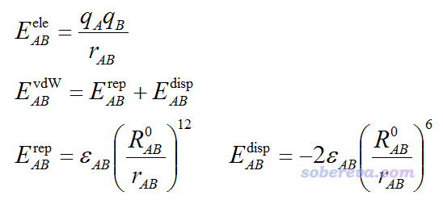

其中A,B是原子标号，q是原子电荷，r是原子间距离，ε是范德华作用势阱深度，R0是原子间非键距离，当r=R0时原子间范德华作用能恰等于势阱深度。

ε和R0是在分子力场里定义的。不同力场里根据原子所处化学环境的不同定义了不同原子类型，多数力场是根据原子类型来定义的范德华参数，不同原子类型的范德华参数有的相同有的不同。实际计算原子间范德华作用时用的参数一般是基于原子的范德华参数通过混合规则来产生的，比如UFF力场用的是下图第一行的规则，不同原子类型间的ε和R0取两个原子类型的ε和R0的几何平均。而对于AMBER和GAFF力场，规则如下图第二行所示，ε混合规则与UFF相同，但是力场对每个原子定义的是非键半径参数R*，原子间的非键距离参数通过相应原子的非键半径加和得到。

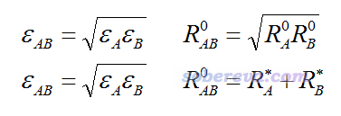

如上可见，计算原子间非键相互作用能非常简单。要想计算特定片段间的非键相互作用，就把片段间每一对原子的非键作用加和即可。这就是基于力场做能量分解的原理，很容易理解。Multiwfn目前支持流行的AMBER99、GAFF和UFF力场做能量分解，这三种力场的函数形式都是相同的，都是最简单形式的分子力场，静电作用仅通过原子电荷来体现，并没有像一些更复杂力场那样考虑原子多极矩或者可极化效应。（以后Multiwfn也可能会支持这些更复杂的力场形式）

Multiwfn中基于力场的能量分解功能相对于Morokuma、SAPT等主流的基于波函数的能量分解方法有以下优势  
 ·速度非常快，对很大的体系也只要一瞬间就能给出结果。而基于波函数的能量分解方法很难用到一百多个原子的体系（有的只能用到几十原子体系）  
 ·片段可以非常自由地划分，想考察哪两个区域的相互作用就相应地输入原子编号来定义即可  
 ·分子内弱相互作用可以方便地考察。而对于基于波函数的能量分解方法，考察分子内弱相互作用需要把分子拆成片段，其中牵扯很多麻烦的事情，具体细节上也很具有任意性。

然而基于力场的能量分解也有很多局限性：  
 ·受制于分子力场简单的函数形式，能量分解精度和基于波函数的方法还有差距，不能在定量精度上有太高要求  
 ·不同力场支持的元素不同，要考察的片段里面有力场不支持的元素就没法用  
 ·计算原子电荷的方法存在一定任意性，而且有的弱相互作用注定没法基于原子电荷来定性正确表现，比如卤键是由于卤原子有sigma-hole特征所产生的，这需要考虑原子四极矩或者非原子中心的点电荷才能描述  
 ·给出的结果没法体现片段间相互作用所产生的电子云的极化、电荷转移等因素的影响。  
 ·只能考察弱相互作用，而没法考察化学键这样的强相互作用（这方面即便是SAPT等很多基于波函数的能量分解方法也没法考察）

做这种能量分解所用的原子电荷必须对分子范德华表面附近的静电势有很好的重现性，否则不可能靠原子电荷较可靠地计算片段间静电相互作用。因此使用的原子电荷首选是拟合静电势电荷，其中最常见的是MK和CHELPG电荷。如果对拟合静电势电荷不了解，参看《RESP拟合静电势电荷的原理以及在Multiwfn中的计算》（<http://sobereva.com/441>）和《原子电荷计算方法的对比》（<http://www.whxb.pku.edu.cn/CN/abstract/abstract27818.shtml>）。所用原子电荷对静电势重现性哪怕达到“不错”的档次都太不够，比如用ADCH、CM5、AM1-BCC等电荷，虽然对静电势重现性也不错，仅次于拟合静电势电荷，但是算出来的静电相互作用能和拟合静电势电荷还是有一定差距的。

关于能量分解时力场的选择，如果是有机体系，就用AMBER或者GAFF就挺好。这两个力场的原子类型的名字虽然不同（一个很大差别是AMBER的是大写，GAFF的是小写），但实际上GAFF的范德华参数是从AMBER力场继承过来的，主要差别在成键参数上，因此基于哪个力场做能量分解都可以。虽然Multiwfn的能量分解也支持UFF力场，但一般不建议用UFF做能量分解，如后文的例子所示，对于哪怕合理的结构，UFF也往往严重高估互斥作用，甚至令本身稳定结合的分子间相互作用为正。不过将结构用UFF力场优化后可以消除这个问题，但由于UFF力场优化出的弱相互作用体系的结构往往也不太理想，所以能量分解结果还是不如AMBER和GAFF好。UFF力场最大好处是支持元素非常广泛，几乎覆盖了整个周期表。

用于做能量分解的几何结构应当是通过靠谱的级别进行优化过的，如果是来自于X光衍射晶体结构，应当冻结重原子的位置而对氢原子进行优化，因为氢原子的位置准确度很差，往往只是经验性地确定的。

## 2 基于力场的能量分解在Multiwfn中的使用

其实基于力场做能量分解，利用诸如GROMACS等分子动力学就能做，但是真要用起来，过程很麻烦。Multiwfn专门设计了一个模块来做这种能量分解，在设计上已经尽可能把分析流程简化了（但注定不可能做到完全傻瓜化）。基本使用流程如下：

(1)对体系中每类分子都创建一个文本文件（分子类型文件），里面包含分子中各个原子的原子类型和原子电荷。然后再写一个文本文件（分子列表文件），里面是分子类型文件的路径，还有相应类型分子的数目，详见后文。  
 (2)启动Multiwfn，读取一个含有当前体系结构信息的Multiwfn可以支持的输入文件。哪些文件被Multiwfn支持且带有结构信息，在《详谈Multiwfn支持的输入文件类型、产生方法以及相互转换》。（<http://sobereva.com/379>）里有明示，比如你用.fch、.mol、.pdb、.xyz、.wfn、.molden等等格式都可以  
 (3)进入主功能21（能量分解主功能）中的子功能1（基于力场的能量分解模块）。  
 (4)用选项3定义读取分子列表文件，从而给体系中各个原子分配原子类型和电荷。如果你要用的力场不是默认的AMBER & GAFF，则读取前先选选项-1切换成要用的力场。  
 (5)用选项2来定义片段，先设置要定义的片段数，然后输入各个片段包含的原子序号，输入格式很灵活，比如3,5-9,12-20,69。第(4)步和第(5)的顺序无所谓，可以互换。  
 (6)最后，选择选项1开始进行分析。各个片段间的相互作用能及物理成分，以及片段里各个原子对片段间相互作用能的贡献都会输出到屏幕上。

在写分子列表文件和分子类型文件的时候一定要*万分注意*，把分子列表文件和其中分子类型文件按顺序完全展开之后，原子的顺序必须和Multiwfn启动时载入的文件里的原子顺序完全一致，否则会由于原子电荷和原子类型指认顺序错误导致结果完全不合理。比如说，体系是三个水和两个乙醇构成的五聚体，结构信息里分子出现顺序是water,ethanol,ethanol,water,water，如果水分子的分子类型文件是C:\water.txt，乙醇的分子类型文件是C:\ethanol.txt，则分子列表文件内容就应当为  
C:\water.txt 1  
C:\ethanol.txt 2  
C:\water.txt 2

对于AMBER和GAFF力场，每个分子类型文件里的第一列为原子在力场中的原子类型，第二列是原子电荷，比如对于用AMBER力场描述的乙醇，可以为：  
CT -0.236494  
HC  0.080697  
HC  0.042845  
HC  0.080697  
CT  0.348325  
H1 -0.039425  
H1 -0.039425  
OH -0.609585  
HO  0.372365  
 对于UFF力场，虽然一种元素有的也对应多种原子类型，但由于范德华参数只取决于元素，因此用UFF力场时分子类型文件应当只包含一列，即原子电荷，而原子类型不用定义。

原子类型怎么指定？一种做法是根据原子类型的定义和实际体系中原子所处于的化学环境来人为判断。力场原文里以及一些涉及到分子力学的程序的一些文件中都有说明。比如AMBER的原子类型可以去看AMBER94力场原文，见J. Am. Chem. Soc., 117, 5179 (1995)的表1。GAFF的原子类型在其原文J. Comput. Chem., 25, 1157 (2004)表1里有介绍。为了方便，笔者在本文的文件包（见下一节开头）里也提供了parm99.dat和gaff.dat，这是AmberTools程序包里的参数文件，开头部分有AMBER99和GAFF力场的各种原子类型的说明。显然，自己这么去指认比较累，特别是体系原子数较多的情况，这时候可以利用第三方程序帮助我们指认。比如用AMBER力场做能量分解的话，我们可以用比如GaussView指认原子类型，见后文的例子。如果用GAFF力场的话，可以用比如免费的AmberTools中的Antechamber程序指认原子类型。其实个别原子类型指认不太准确也没太大问题，比如AMBER力场中H1、H2、H3原子类型对应的范德华参数相差不大。有时候可能体系中有的原子没有完全合适的原子类型，这个时候可以用这种元素的其它原子类型凑合一下。另外，如果你用的是AMBER或GAFF力场，但是当前体系里有个别元素（如许多过渡金属元素）在此力场中不支持，那么也可以借用UFF力场的参数来凑合一下，做法是在分子类型文件中把相应原子类型写为UF，程序看到有原子类型叫UF，自动就会用UFF力场对应的参数。值得一提的是，用GaussView指认原子类型的有时候可能显示的是问号，说明没能成功指认，这个情况就必须按上述方式自己手动指定这个原子的原子类型。

建议在选择选项1进行分析之前，用选项4把所有片段中的原子的类型和电荷输出到屏幕上，大致检查一下设定是否正确。如果有严重错误，对照元素名、原子类型和原子电荷，应该很容易就能发现。

Multiwfn的基于力场的能量分解功能中可以定义无数个片段，片段包含的原子范围是任意的，但是不能有某个原子同时处于多个片段里。可以把一个分子划分为不同片段考察分子内弱相互作用，但要注意，这些片段间至少要隔三个化学键（相对于键连关系而言，而不是原子间距而言），因为更近的话原子间的作用就不完全属于弱相互作用范畴了，此时通过力场的非键作用项来计算它们之间的相互作用是严重不合理的（这也是为什么一般分子力场里忽略相隔一个和两个化学键的原子间的非键作用，而对于相隔三个化学键的非键作用要么忽略要么刻意被大幅度削弱）。

如果计算前选一次选项-3，则计算过程中会把片段间每一对原子间的相互作用能都输出到当前目录下的interatm.txt文件中，便于你深入了解细节。如果计算前选了一次选项-4，那么计算过程中就会把各个原子对片段间总的/静电/互斥/色散相互作用能分别写入到当前目录下的atmint_tot.pqr、atmint_ele.pqr、atmint_rep.pqr和atmint_disp.pqr文件中，便于你通过着色方式一目了然地考察原子的贡献，后文有例子。

选项-2可以把计算静电相互作用用的1/r算符改为1/r^2算符，显然这样算出来的静电相互作用能会减小许多。加入这个设计是因为曾经有一些人利用这种做法近似地等效表现极性溶剂（诸如水）对静电作用产生的屏蔽效果。当然，真要严格把溶剂效应考虑到能量分解中，应当使用隐式溶剂模型，但是在Multiwfn中尚不支持。还有种等效考虑溶剂效应的做法是用Multiwfn的能量分解功能先照常计算片段间静电相互作用能，然后加上溶剂效应的极性部分对相互作用能的影响。有各种各样的隐式溶剂模型可以实现这个目的，参看《谈谈隐式溶剂模型下溶解自由能和体系自由能的计算》（<http://sobereva.com/327>）、《谈谈分子模拟中的隐式溶剂模型与GB模型》（<http://sobereva.com/42>）。比如你是用Gaussian，你可以带着scrf=solvent=[溶剂名]关键词通过"E(复合物)-∑E(单体)"公式计算溶剂下的结合能，然后去掉这个关键词再这么计算真空下的结合能，将两次结合能求差，作为溶剂效应对静电作用的影响。（溶剂效应的非极性部分对结合产生的影响也可以类似地计算，仔细看过<http://sobereva.com/327>这篇博文就知道怎么弄。但这部分既没法完全归属到色散作用也没法完全归属到交换互斥部分，只能作为一个额外的项）

## 3 实例

下面通过一些例子演示如何用Multiwfn做基于力场的能量分解。只要大家把这些例子中的操作完全领会了，亲自操作一遍，那么只要举一反三，就可以容易地把这种分析用于其它任何体系。下面的例子用到的文件都可以在此下载：<http://sobereva.com/attach/442/file.rar>。

本文使用的Multiwfn为2018-Sep-19更新的3.6(dev)版，绝对不要用更老版本。本文用到的Gaussian是G16 A.03版，GaussView是6.0.16版。

### 3.1 水二聚体

首先我们看一个最简单的例子，两个水分子通过氢键形成的二聚体，如下所示。

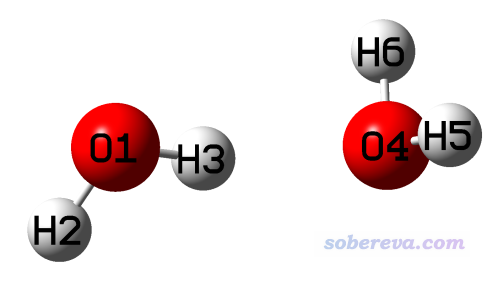

结构优化过程中我们使用优化弱相互作用体系又便宜又靠谱的B3LYP-D3(BJ)/6-311G**来实现。相关的文件都提供在了本文文件包的waterdimer目录下，这些文件包括：

dimer_opt.gjf和dimer_opt.out：对水二聚体优化的输入和输出文件，原子顺序是O1 H2 H3 O4 H5 H6  
 dimer.mol：用gview打开dimer_opt.out，然后保存的.mol文件，记录了优化后水二聚体的结构信息  
 water_opt.gjf和water_opt.out：对单分子水优化的输入和输出文件。注意此文件里的原子顺序与二聚体中是完全对应的，即O H H，这点非常重要  
 water.fch：在water_opt任务中产生的水分子的fch文件，包含了其B3LYP/6-311G**级别的波函数信息  
 mollist.txt：分子列表文件。其内容只有一行，即water.txt 2  
 water.txt：水分子的分子类型文件，包含它的原子类型和原子电荷信息

我们看到文件包里给出的water.txt内容如下：  
OW -0.737121  
HW  0.368560  
HW  0.368560  
 这说明第一个原子类型是OW，电荷为-0.737121，其余两个原子类型是HW，电荷为0.368560。下面说一下这个文件是怎么得来的。

如果大家比较熟悉AMBER分子力场，自然而然就知道水中的氧原子类型是OW，氢是HW。但如果你不知道该怎么设原子类型的话，又懒得自己去看力场原文，就把含有水分子结构信息的文件（比如文件包里提供的water.fch或water_opt.out）拖到gview里，点击界面上图标是粗体的A的按钮进入原子列表编辑器(Atom list editor)，点击桔红色的M按钮把原子类型显示出来，然后点击两次AMBER Type那一列的标题，此时窗口应当处于以下状态：

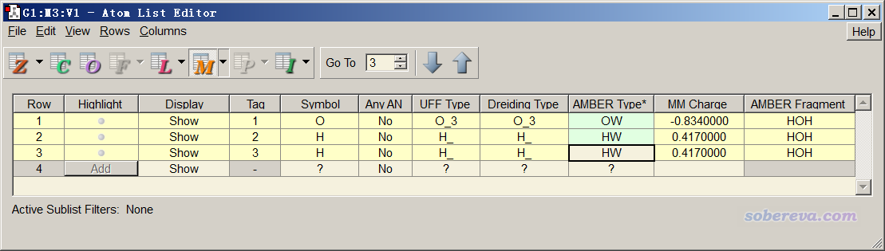

然后点击File - Export Data，保存的文件名输入water，就得到了water.txt。然后，通过Ultraedit等文本编辑器的列模式把除了AMBER Type那一列以外内容的列删掉，再把此文件里的第一行删掉，此时water.txt里就只有各个原子的原子类型了。然后我们计算水分子的MK原子电荷，启动Multiwfn，载入water.fch，然后输入  
 7  // 布居分析  
 13  // MK电荷  
 1  //开始计算  
 结果为  
 Center      Charge  
   1(O )   -0.737121  
   2(H )    0.368560  
   3(H )    0.368560  
 然后按照Multiwfn手册5.4节说的方法把所得原子电荷从命令行窗口复制到剪切板上，再用Ultraedit的列模式粘到water.txt里，就得到了文件包给出的water.txt了。

下面，我们开始做能量分解分析。将water.txt拷到当前目录下（如果你通过双击方式启动Multiwfn程序就拷到Multiwfn目录下），然后依次输入  
 dimer.mol  //含有二聚体结构信息的文件（如果你优化二聚体时保留了fch文件，载入fch文件当然也可以）  
 21  //能量分解  
 1  //基于力场的能量分解  
 3  //载入原子类型和原子电荷  
 mollist.txt  //分子列表文件的实际路径。此时程序就会从mollist.txt所记录的当前目录下的water.txt中读取原子类型和电荷，赋到当前体系中的两个水分子上  
 2  //定义片段  
 2  //将定义两个片段  
 1-3  //片段1包含的原子序号  
 4-6  //片段2包含的原子序号  
 如果想确认一下已定义的片段中的原子电荷和原子类型是否已经确实设好了，可以选选项4看一眼，输出为  
 *** Fragment   1:  
 Atom:    1(O )    Charge:   -0.737121    Type: OW  
 Atom:    2(H )    Charge:    0.368560    Type: HW  
 Atom:    3(H )    Charge:    0.368560    Type: HW  
 *** Fragment   2:  
 Atom:    4(O )    Charge:   -0.737121    Type: OW  
 Atom:    5(H )    Charge:    0.368560    Type: HW  
 Atom:    6(H )    Charge:    0.368560    Type: HW  
 可见原子类型和电荷都是正确的。

然后我们选选项1就可以分析了，一瞬间就输出了结果，如下所示：  
 Contribution of each atom in defined fragments to overall interfragment interac  
tion energies:  
 Atom    1(O )   Elec:   12.53  Rep:    3.85  Disp:   -2.21  Total:   14.17  
 Atom    2(H )   Elec:   -6.24  Rep:    0.00  Disp:    0.00  Total:   -6.24  
 Atom    3(H )   Elec:  -16.87  Rep:    0.00  Disp:    0.00  Total:  -16.87  
 Atom    4(O )   Elec:  -23.52  Rep:    3.85  Disp:   -2.21  Total:  -21.88  
 Atom    5(H )   Elec:    6.47  Rep:    0.00  Disp:    0.00  Total:    6.47  
 Atom    6(H )   Elec:    6.47  Rep:    0.00  Disp:    0.00  Total:    6.47

 Interaction energy components between all fragments:  
                         Electrostatic   Repulsive   Dispersion     Total  
 Frag   1 -- Frag   2:       -21.15         7.71        -4.43       -17.87  
 输出的单位都是kJ/mol。以上信息显示，两个水分子间总相互作用能为-17.87 kJ/mol，这个值和CCSD(T)/CBS算的高精度结果（见S66测试集原文J. Chem. Theory Comput., 7, 2427 (2011)）给出的-20.58 kJ/mol虽然有一定误差，但是已经比较接近了，至少用于定性讨论是绝对够的，对于非常廉价的分子力场来说能算到这样的精度也算不错了。以上数据也指出静电作用对水分子的结合产生了决定性的贡献，贡献高达-21.15 kJ/mol，因此毫无疑问这种一般强度的氢键的主要本质就是静电作用（有些文章做一大堆轨道分析基本都是鬼扯，完全没弄清楚主次）。色散作用也产生了贡献，但相对次要。而交换互斥作用则在一定程度上抵消了静电和色散产生的吸引作用。

在S66测试集的原文中，作者通过DFT-SAPT方法给出的水二聚体的色散作用能与静电作用能的比值为0.29，我们基于力场算出来的是4.43/21.15=0.21，也算与DFT-SAPT的结果定性相符。因此从水二聚体这个简单体系可见，只要用的力场和原子电荷合适，基于经典力场的能量分解一般还是靠谱的。力场计算结果和量化计算结果相符这么好的情况其实也比较有限，有时候差得不少，但即便如此，基于力场的能量分解给你的静电/交换互斥/色散的比值还是有非常有意义的。甚至于比如你用基于力场给出的静电相互作用能与总相互作用能的比值乘上量子化学算出来的结合能作为真实的静电作用能的近似估计，在我看来也未尝不可。

以上输出的信息也告诉了你各个原子对片段间相互作用的贡献，便于你认清哪些原子对片段间结合起到关键影响。如果你定义了N个片段，则给出的就是各个原子对这N个片段间相互作用能的贡献。所有原子贡献值加和等于总相互作用能（假设体系就有两个原子A和B，且各自定义为一个片段，那么这里给的A原子的贡献就相当于A-B之间相互作用能的一半）。由上面给出的数据可见每个原子的影响都不容忽视，毕竟体系里各个原子间距离都不远。对吸引作用产生最大贡献的是O4原子对应的静电作用（-23.52），而O4正是氢键受体原子，所以这个结果很容易理解。作为与O4直接发生氢键作用的H3也通过静电作用对结合产生了很大贡献（-16.87）。数据里看到只有氧原子的Rep和Disp不为0，这是因为HW这种氢的原子类型对应的范德华势阱参数为0，力场刻意忽略它对范德华作用的贡献（这是有原因的），而只表现它的静电作用。

如果你在能量分解界面里选择一次选项-3将其状态从默认的No切换成Yes，之后再选1进行分析时，程序会把片段间每一对原子的距离（埃）、相互作用能（kJ/mol）及其成份都输出到当前目录下的interatm.txt中，本例的此文件内容为  
 ******* Between fragment   1 and fragment   2:  
  Atom_i  Atom_j  Dist(Ang) Electrostatic   Repulsive    Dispersion     Total  
      1      4:     2.873       262.78         7.71        -4.43       266.05  
      1      5:     3.176      -118.86         0.00         0.00      -118.86  
      1      6:     3.176      -118.86         0.00         0.00      -118.86  
      2      4:     3.346      -112.79         0.00         0.00      -112.79  
      2      5:     3.762        50.16         0.00         0.00        50.16  
      2      6:     3.762        50.16         0.00         0.00        50.16  
      3      4:     1.916      -197.02         0.00         0.00      -197.02  
      3      5:     2.312        81.64         0.00         0.00        81.64  
      3      6:     2.312        81.64         0.00         0.00        81.64  
 从以上数据会发现，其实每一对原子间相互作用能都很大，关键来自于静电相互作用。比如两个氧原子O1和O4，由于电荷相同，而且数值不小，离得又近，因此静电互斥能高达262.78 kJ/mol。由于计算片段相互作用能时，原子间静电相互作用项很大程度正负抵消，因此片段间静电相互作用能，以及原子对片段间结合能的贡献量看起来数量级都远没有上面那么大。

### 3.2 circumcoronene与鸟嘌呤-胞嘧啶的三聚体

在J. Chem. Theory Comput., 9, 3364 (2013)一文给出的L7弱相互作用测试集中，有一个体系是circumcoronene（以下简写为C3）与鸟嘌呤(G)和胞嘧啶(C)的三聚体，以下简称为C3GC，其补充材料里给的结构已经在TPSS-D/TZVP级别下优化过了，如下所示。本节我们就对这个体系基于AMBER力场做一下能量分解分析，相关的文件都在本文文件包里的C3GC目录下。

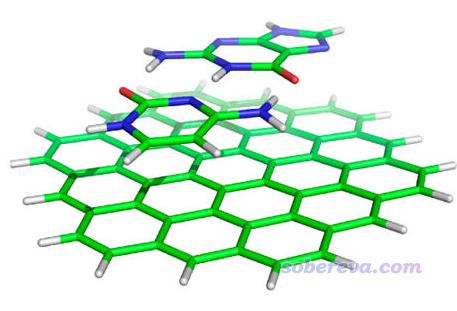

只有当所有类型分子里原子序号都是连着的时候，才能用Multiwfn做基于力场的能量分解计算，否则没法通过分子列表和分子类型文件对体系中各个原子设定电荷和原子类型。L7弱相互作用测试集的原文里补充材料里给的结构文件是C3GC.xyz，这个文件没法直接用，因为这里面单体里原子的序号不是连着的。怎么判断是不是连着，可以在可视化程序里把原子序号显示出来考察，但肉眼挨个看编号有时候比较累，最简单的判断方法如下：先把C3GC.xyz载入到Multiwfn，用主功能100的子功能2的选项1将之转换为C3GC.pdb（做转换是因为gview不支持.xyz格式），再将此pdb文件载入到gview里，在任意一个分子的任意一个原子比如C5上点右键，选Select Fragments of Atom C5（从gview 6开始才有这个选项），此时这个分子的原子就都被选中了，然后点Tools - Atom Selection，此时文本框里显示的序号是5-9,13-17,19,25-29，一看就知道序号不连着，如下所示。

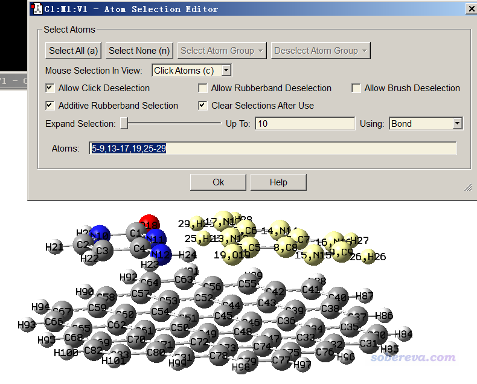

那么怎么让序号连着？方法很多，最简单的做法是进入gview的原子列表编辑器，点击下图示意的按钮

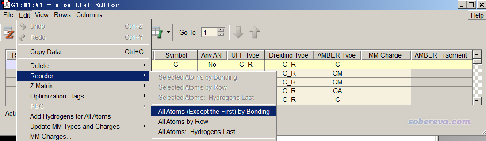

之后，图形窗口中所有原子序号都按照成键关系排序了，因此这三个片段里所有原子序号就都连着了，不信的话可以按上述方法检验一下。当前序号如下所示，可以看到胞嘧啶的原子序号是1-13，鸟嘌呤的序号是14-29，C3的序号是30-101。

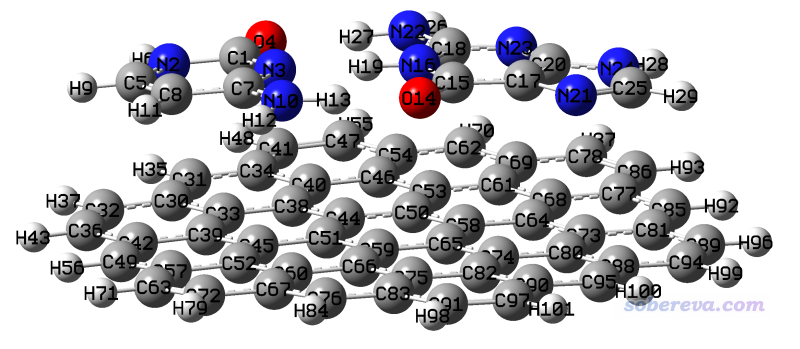

然后我们把这个序号重排好的结构保存为C3GC.pdb，覆盖原先的同名文件，并且在gview里把各个片段分别拷到不同的新窗口里，按照上一节所说的做法把gview判断出的AMBER力场的原子类型导出来，三个片段对应的文件分别命名为C3.txt、G.txt、C.txt。然后把每个片段都保存成.gjf文件，修改关键词为B3LYP/6-311G**，用Gaussian计算它们，得到对应的.fch文件。然后按照上一节的做法把各个.fch文件放到Multiwfn里计算MK原子电荷，再把各个单体的原子电荷分别拷到C3.txt、G.txt、C.txt里面作为第二列。最终处理好的这三个文件已经提供在本文的文件包里了。

注：由于C3这个片段较大，有72个原子，计算拟合静电势电荷计算量也较大，因此用Multiwfn计算的时候强烈建议让程序借用Gaussian里的cubegen工具，详见<http://sobereva.com/435>，此时在普通Intel 4核CPU下耗时不到3分钟。直接在Gaussian算单点的时候顺便算MK电荷也可以，加上pop=MK关键词即可，同时最好写IOp(6/42=6)，否则由于拟合静电势过程默认用的拟合点数偏少，结果不太可靠。

最后，写一个分子列表文件mollist.txt，内容为C3.txt、G.txt、C.txt的实际路径和对应的分子数目（显然都为1），并且顺序必须和C3GC.pdb里记录的分子顺序完全一致，因此内容为（假设文件都放到了C:\下）  
 C:\C.txt 1  
 C:\G.txt 1  
 C:\C3.txt 1

现在开始做能量分解分析。启动Multiwfn，输入  
 C3GC.pdb  
 21  //能量分解  
 1  //基于力场的能量分解  
 3  //载入原子类型和原子电荷  
 mollist.txt  //输入mollist.txt的实际路径  
 2  //定义片段  
 3  //设3个片段  
 1-13  //片段1包含的原子序号（C部分）  
 14-29  //片段2包含的原子序号（G部分）  
 30-101  //片段3包含的原子序号（C3部分）  
 PS：如提示所示，如果你要对此体系进行多次分析，嫌每次定义片段敲一遍键盘麻烦，设定片段数那一步可以输入0，然后输入含有片段定义的文件路径。文件里每一行对应一个片段里的原子序号。

选择选项1，分析结果如下（原子对结合能贡献部分的输出略）  
                         Electrostatic   Repulsion   Dispersion     Total  
 Frag   1 -- Frag   2:      -120.98        60.26       -45.54      -106.27  
 Frag   1 -- Frag   3:         1.88        44.86       -94.69       -47.95  
 Frag   2 -- Frag   3:         0.71        62.08      -132.62       -69.84

数据体现出，G-C之间结合非常强，高达-106.27 kJ，主要原因在于静电相互作用非常大，这直接源于GC之间形成了三对氢键。而C3和G、C之间的相互作用能也不小，这主要是由于它们之间有显著的pi-pi堆积作用，而pi-pi堆积作用本质又是色散作用，所以可见C3-G和C3-C之间的色散作用强度很大，比起G-C之间的大多了。由于C3就是个石墨烯片，与G、C直接作用区域是明显无极性的（即原子电荷非常小），因此C3与G、C之间的静电作用微乎其微。

笔者也使用了计算弱相互作用比较靠谱的B3LYP-D3(BJ)/6-311+G**结合counterpoise校正对G-C、C3-G和C3-C间的结合能做了计算，结果为  
 G-C（Frag 1 - Frag 2）：-143.97 kJ/mol  
 C3-C（Frag 1 - Frag 3）：-56.69 kJ/mol  
 C3-G（Frag 2 - Frag 3）：-76.27 kJ/mol  
 可见C3和G、C之间计算结果和基于力场算的很接近，但是G-C之间的结果差得比较多。这体现基于分子力场计算这种强度很大的弱相互作用的时候定量精度是比较有限的，此时别太拿定量数据说事，但用于讨论物理成分的比例还是没问题的，不至于有明显误导。

值得一提的是，由于包括AMBER在内的一般分子力场没有考虑多体项和可极化效应，因此算出来的三个片段总结合能和1-2、1-3、2-3结合能的加和是相同的。但是实际上，如果用量子化学来计算，E(123)-E(1)-E(2)-E(3)这样严格算出来的三聚化能和用三种二聚体模型算的1-2、1-3、2-3的结合能加和是不同的，因为还存在耦合项，这是通过一般分子力场所无法体现的。

pqr格式被不少可视化程序所支持，它和pdb格式很类似，但是pqr的每一行在原子坐标后面记录的是原子电荷和原子范范德华半径，在《使用Multiwfn+VMD以原子着色方式表现原子电荷、自旋布居、电荷转移、简缩福井函数》（<http://sobereva.com/425>）一文中有详述。将Multiwfn和VMD结合使用，可以通过对原子着色，一目了然地考察各个原子对片段间结合能的贡献（实际上在《通过独立梯度模型(IGM)考察分子间弱相互作用》<http://sobereva.com/407>一文中就是用了类似策略，但IGM展现出的原子对片段间结合产生的贡献是简单估计出来的，明显没有当前的能量分解这么有物理意义）。我们在能量分解界面里选择一次-4 Toggle if outputting atom contributions to .pqr files将之状态切换为Yes，然后再次选择选项1进行能量分解分析，算完之后当前目录下就出现了atmint_tot.pqr、atmint_ele.pqr、atmint_rep.pqr和atmint_disp.pqr（这些文件已提供在了本文文件包C3GC目录下的pqr目录下），这四个文件中的原子电荷那一列的数据分别对应于各个原子对片段间的总/静电/交换互斥/色散相互作用能的贡献，和屏幕上输出的值实际上是相同的。比如atmint_disp.pqr中片段1中的C1原子的原子电荷那一列的值就对应这个原子与片段2和片段3的所有原子的色散相互作用能的一半。将atmint_tot.pqr载入到VMD中绘制出来，设成根据Charge属性进行着色，把色彩刻度下限和上限从默认值分别改为-50和50，把G、C部分用CPK方式显示（selected atoms框里通过fragment 0 1来选取），把C3部分用Licorice风格显示（selected atoms框里通过fragment 2来选取），同时把氢键显示出来，把色彩变化方式设为BWR，此时图像如下（操作细节如果不懂就参考<http://sobereva.com/425>里面详细描述的步骤）：

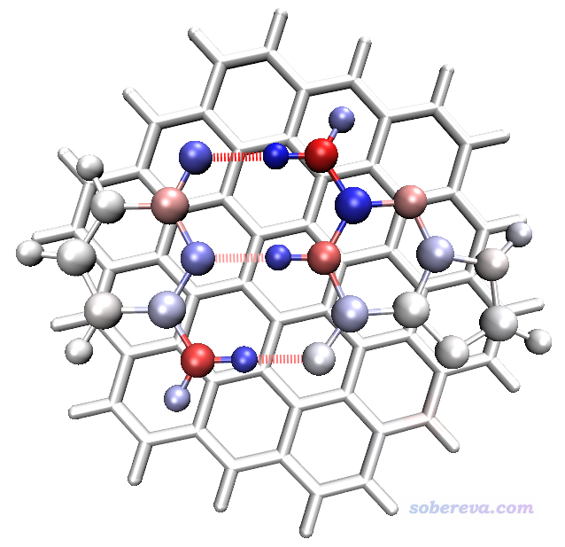

由于当前色彩刻度用的是蓝-白-红，因此图中颜色越蓝的原子，对应对总结合能的贡献值越负（起到越显著的吸引作用），越红的原子则起到越显著的互斥作用。而偏白色的原子，起到的作用就比较小了。从这个图上一眼就可以看出，形成每条氢键的氢键受体原子和与之作用的氢原子基本上都明显是蓝色，因此对结合的稳定性贡献极大；而氢键给体重原子颜色都是红色，说明它不利于结合，这是因为氢键给体重原子和氢键受体原子都带有较大而且符号相同的电荷，它们之间存在显著静电互斥作用。如果你想把细节搞得更清楚，可自行尝试把某个氢键给体原子设为一个片段，然后把其它片段的所有原子设成另一个片段，再来绘制这张图。与氢键作用区域比较远的G、C的原子以及C3的所有原子颜色都比较淡，并不是它们对片段间结合基本没起到作用，而是起到的作用相对来说太弱，因此在当前默认的色彩刻度下展现不充分。

假设我们想通过原子着色直观地考察一下C3与GC碱基对之间的色散作用，则接着在能量分解界面里这样输入  
 2  //重新定义片段  
 2  //定义两个片段  
 1-29  //片段1，定义为GC碱基对  
 30-101  //片段2，C3部分  
 1  //做能量分解分析  
 屏幕上输出以下内容，和之前C3-G和C3-C片段数值加和相同  
                         Electrostatic   Repulsion   Dispersion     Total  
 Frag   1 -- Frag   2:         2.59       106.94      -227.31      -117.79  
 当前目录下产生了四个pqr文件，这些文件已提供在了本文文件包C3GC目录下的pqr2目录下。把其中atmint_disp.pqr拖到VMD里，按照之前的做法显示成原子着色效果，但是把色彩刻度设为-10到10，并且选Display - Orthographic把视角设成正交，此时看到的图像如下

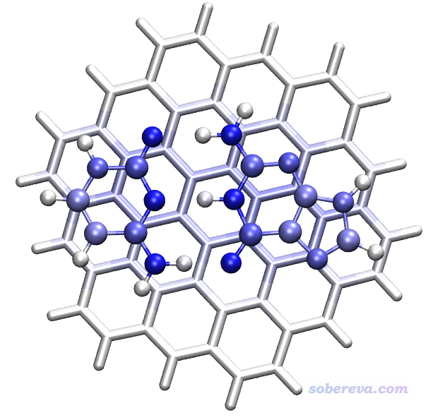

上图中，颜色越蓝的原子对C3与GC之间的色散吸引作用越大。由图可见，GC上各个重原子对色散作用贡献相仿佛，主要也是因为它们距离C3平面的距离都差不多，而且原子上带的电子数也相差不太大。GC上的氢原子都贡献微乎其微，这体现出氢原子由于带的电子数很少，而且由于其电负性小，在实际分子中其电子往往又被吸走不少，所以产生的色散作用很小。在C3上，直接与GC接触的那些碳的颜色呈现浅蓝，说明对色散作用有明显贡献，而离GC比较远的原子产生的贡献就很小了，这也体现出色散作用随距离衰减很快这个特点，它是随距离r增加呈1/r^6衰减的。  
 注：上图中GC上的重原子之所以很蓝而C3上的对等位置的原子却没那么蓝，是因为C3原子很多，GC上每个重原子与C3上一大片原子有色散作用，所以数值总和较大。而由于GC上本身原子数少，所以C3上每个原子只能与数目并不多的GC上的原子作用，故数值总和不是太大。如果你想让C3部分原子颜色更凸显一些，可以单独把C3那个Representation的色彩刻度范围设小一点，比如设-6到6。

肯定有读者想到，要是能把GC之间的三个氢键的键能独立求出来该多好。怎么实现这个目的，没有唯一做法，这相当于对体系进行划分。一个容易想到的做法是直接把氢键给体和受体部分定义为两个片段，比如我们考察N10-H13...O14这条氢键，输入  
 2  //重新定义片段  
 2  //定义两个片段  
 10,13  //片段1为N10-H13...O14中的给体部分  
 14  //片段2为N10-H13...O14中的受体部分  
 1  //做能量分解分析  
 结果是  
                         Electrostatic   Repulsion   Dispersion     Total  
 Frag   1 -- Frag   2:        71.27        21.78        -9.40        83.65  
 明明氢键作用的作用能应该是个负值，结果却成了正值，成了互斥作用，因此以这种划分方式试图求得氢键键能是明显不靠谱的，究其原因在于静电作用是长程作用，不能光把N10-H13...O14这一小块区域作用考虑了而完全忽略了其余原子间的作用。笔者也尝试了不少其它做法，虽然有的做法可以把氢键键能的数量级算对（例如把N10、H12、H13、O14原子对GC间的总结合能的贡献量加和），但是没法正确体现三条氢键的相对强度关系，主要一方面也是这因为这三条氢键挨得太近，互相耦合太厉害，而且极化作用明显，还牵扯到共振辅助等电子层面的效应。如果是出现多条氢键且出现位点离得比较远的情况，通过考察相应一块区域片段间的相互作用能，还是可以说明氢键键能的。

在《DFT-D色散校正的使用》（<http://sobereva.com/210>）一文中提到过，如果通过DFT-D3方法，用对应于完全没法描述色散作用的泛函的零阻尼的参数来计算片段间色散校正能，那么可以近似地估计片段间色散作用。笔者通过这种做法计算了色散作用能，如下所示，括号外的是基于B3LYP参数的，括号里的是基于BLYP参数的，单位都从程序给出的kcal/mol转化为了kJ/mol。  
 Frag 1 -- Frag 2: -21.67 （-26.65）  
 Frag 1 -- Frag 3: -71.84 （-87.78）  
 Frag 2 -- Frag 3: -94.60 （-115.10）  
 用BLYP和B3LYP的参数估算色散作用能谁更准确，没有SAPT能量分解数据作为参照的话很难说，但无论如何，我们看到以这种方式估计的色散作用能虽然在定量上和前面通过AMBER力场给出的有不小差异，但是趋势是完全相符的，尤其是BLYP的结果和AMBER力场算的在定量上也差得不远。PS：实际上有人在J. Chem. Theory Comput., 13, 1638 (2017)中建议在专门拟合的特殊参数下做DFT-D3校正能计算来作为可靠的DFT-SAPT方法给出的色散作用能的近似，不过没受到什么关注。

使用UFF做基于力场的能量分解通常不太靠谱，比如对当前体系结果为  
                         Electrostatic   Repulsion   Dispersion     Total  
 Frag   1 -- Frag   2:      -120.98       848.28       -80.36       646.94  
 Frag   1 -- Frag   3:         1.88        52.65      -107.41       -52.87  
 Frag   2 -- Frag   3:         0.71        68.89      -143.58       -73.99  
 可见C3与G、C的相互作用比较正常，相对大小与AMBER算出来的相同，但是G-C的相互作用能居然是正值，一看成份就知道是因为交换互斥作用被严重高估。这不是个别现象，而是常见现象，这正是为什么我不建议通过UFF做能量分解的原因。

如果你要研究的体系特别大，比如几百原子，从头算方法算单点都极为困难，也因此难以得到拟合静电势电荷，那么可以用一些虽然非常便宜的、只依赖于几何结构甚至只依赖于连接关系，又对静电势重现性依然不错的原子电荷，比如MMFF94电荷、对拟合静电势电荷拟合参数的EEM电荷（Multiwfn可以计算，见手册4.7.5节的例子和 3.9.15节的原理介绍），但是结果对静电作用描述的准确度相比用拟合静电势电荷对有的体系可能会大打折扣。比如笔者尝试过，如果用基于向B3LYP/6-31G*级别的拟合静电势电荷拟合参数的EEM电荷，则G-C之间的静电相互作用能就只有-74.26 kJ/mol了，明显偏小了。如果你研究的体系是比如蛋白质、核酸与小分子的作用，那应该通过力场直接定义的残基的电荷拼接得到这些生物大分子的电荷，用GROMACS、AMBER等适合生物体系的动力学程序都可以给你。

### 3.3 18碳环与石墨烯之间的相互作用

参见《18碳环（cyclo[18]carbon）与石墨烯的相互作用：基于簇模型的研究一例》（<http://sobereva.com/615>），里面有计算细节的描述且直接给了输入文件。

### 3.4 8字双环分子OPP与18碳环之间的相互作用

下图出自《8字形双环分子对18碳环的独特吸附行为的量子化学、波函数分析与分子动力学研究》（<http://sobereva.com/674>）介绍的笔者的Phys. Chem. Chem. Phys., 25, 16707 (2023)文章，各个原子对18碳环与主体分子OPP之间的相互作用能的贡献通过对原子着色进行了直观展现，对此例做EDA-FF用到的结构文件和输入、输出文件在本文文件包里C18_OPP目录中提供了。另外，下图中绿色等值面是IGMH图，介绍见《使用Multiwfn做IGMH分析非常清晰直观地展现化学体系中的相互作用》（<http://sobereva.com/621>）。

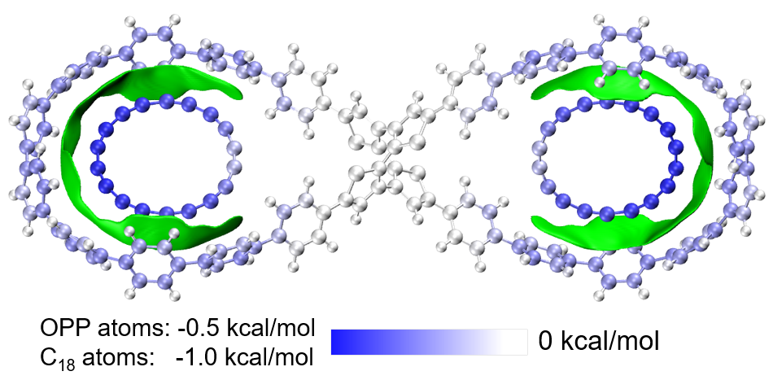

## 4 总结&其它

本文介绍了基于分子力场的能量分解的思想、在Multiwfn中的使用，并通过两个典型体系展现了这种能量分解的实用价值。读者只要举一反三，就可以很容易地把这种能量分解用于各种体系上。希望读者在搞清楚原理、认清基于力场的能量分解的局限性和独特优点的基础上，灵活、恰当地运用此方法讨论实际问题。

关于做基于力场的能量分解所用的原子电荷，最后再多说几句。对于复合物体系，在计算原子电荷时，应当使用单体在孤立状态下的模型进行计算，因为基于这样的原子电荷算的片段间的相互作用能的物理意义才明确，即对应的是忽略极化和电子转移效果时候的静电相互作用。而如果直接用复合物体系算原子电荷来做这种能量分解分析，那么算出来的静电作用能就说不清楚到底是什么了，虽然或许从结果的数值角度来说还挺不错。而且，用复合物结构计算拟合静电势电荷时，由于很多原子可能被包埋比较厉害，此时算出来的这些原子的电荷是明显不准确的，用于计算单体间静电作用能时会有严重误导性。

拟合静电势电荷是明显受构象影响的，将这种电荷用于能量分解目的时，原理上最理想的做法是直接取复合物中每个单体的结构直接计算。但是这样做可能会比较麻烦和耗时（当然如果你以精度为重则应当不怕麻烦），比如一个体系有8个同种分子，你就得算8次，而且每个分子还得作为不同类型的分子来考虑，得分别写分子类型文件并设定原子电荷。所以为了省事，如果体系当中这类分子的每个副本的构象差异不大，可以对同种类型分子只给一套原子电荷，因此就优化这个分子并且计算原子电荷即可，正如3.1节水分子二聚体那种。如果某些副本之间构象差异比较大，最好还是把构象显著不同的副本当成不同的分子类型、单独计算原子电荷为宜。（使用在《RESP拟合静电势电荷的原理以及在Multiwfn中的计算》<http://sobereva.com/441>中提到的构象平均的拟合静电势电荷或者构象依赖性小的RESP电荷虽然看似也可以，但由于这种做法对于特定构象的分子表面静电势重现性会打折扣，所以不太建议在当前情况下使用）。

有用户问为什么他用本文的方法Multiwfn给出来的单体间总作用能为正，有以下几个可能原因，请读者根据原理检查  
(1)体系没在合理级别下优化，导致位阻作用太强  
(2)选择的力场不合适（比如本来能用AMBER/GAFF的情况，却为了图省事用了不那么理想的UFF）  
(3)指认的原子类型有问题，导致有的原子的范德华参数不合理  
(4)原子电荷用的不合理，导致静电吸引强度被低估  
另外也有可能靠普通力场描述当前单体间相互作用过于粗糙，比如可能有些片段间的极化作用很强、轨道相互作用不可忽视（比如强度往往挺大的带电荷氢键就是这种情况，见《透彻认识氢键本质、简单可靠地估计氢键强度：一篇2019年JCC上的重要研究文章介绍》<http://sobereva.com/513>），此时就不适合用本文介绍的方法分析了，而应当做量子化学层面的能量分解，见此文的能量分解部分的简述：《Multiwfn支持的弱相互作用的分析方法概览》（<http://sobereva.com/252>）。
