**注1**：本文有对应的演示视频，必看！见<https://www.bilibili.com/video/av33733749/>

**凡是按照本文的详细说明还绘制不出来的人，一定要精确严格重复视频里的操作！应先把视频里的示例体系重复一遍，连这个例子都重复不出来者注意看本文文末的文字**

**注2：如果你对静电势分析感兴趣，吐血推荐看《化学体系的静电势的计算和分析方法汇总》（**[**http://sobereva.com/769**](http://sobereva.com/769)**）全面了解一下。**

**使用Multiwfn+VMD快速地绘制静电势着色的分子范德华表面图和分子间穿透图**

Using Multiwfn+VMD to rapidly plot electrostatic potential colored molecular van der Waals surface map and penetration map between molecules

文/Sobereva @[北京科音](http://www.keinsci.com)

First release: 2018-Oct-13  Last update: 2025-Jun-30

## 1 前言

静电势对于考察分子间静电相互作用、预测反应位点、预测分子性质等方面有重要意义，被广为使用，相关学习资料和笔者之前写过的全部跟静电势有关的博文见《静电势与平均局部离子化能综述合集》（<http://bbs.keinsci.com/thread-219-1-1.html>），免费的波函数分析程序Multiwfn（主页为<http://sobereva.com/multiwfn>）是分析分子静电势特别灵活、强大的工具。很久以前，笔者写过一篇文章《使用Multiwfn结合VMD分析和绘制分子表面静电势分布》（<http://sobereva.com/196>，以下简称“196”）介绍了怎么将Multiwfn和免费的可视化程序VMD相结合绘制静电势着色的分子范德华表面图以及分子间范德华表面穿透图，但是笔者在大量网上答疑中感到很多接受能力较差的Multiwfn用户还是不能很好按照博文里详细讲述的步骤做出图来，另一方面那篇博文的过程涉及很多手动操作过程，对于手慢的用户绘图效率较低。考虑到这些，笔者这次专门写一篇文章，介绍通过利用批处理文件和绘图脚本极其便利地绘制上述图形，将步骤最大程度简化。相信此文会令读者深感Multiwfn+VMD绘图又快又便利，初学者也能很容易地获得非常漂亮的图像。此文并不能完全取代之前那篇博文，那篇文章里对细节讲述很详细，如果能把那篇文章完整阅读、深刻领会，读者就可以根据实际要求恰当调节选项获得更好效果。

本文涉及两种展现分子表面静电势分布的做法，第一种是196文中已经详细交代的，用Multiwfn的主功能12对静电势做定量分子表面分析导出表面顶点文件vtx.pdb，载入到VMD中显示出来，并根据vtx.pdb的B因子字段数据（对应静电势）来着色。第二种是类似《基于Multiwfn产生的cube文件在VMD和GaussView中绘制填色等值面图的方法》（<http://sobereva.com/402>）文中的做法，用Multiwfn产生电子密度和静电势的cube文件，载入到VMD里，将静电势的数据以不同颜色映射到电子密度的等值面上。本文说的范德华表面是指Bader的定义，即把电子密度0.001 a.u.等值面作为范德华表面。

读者请务必使用Multiwfn官网上的最新版本。不了解Multiwfn的话参看入门贴《Multiwfn入门tips》（<http://sobereva.com/167>）和《Multiwfn FAQ》（<http://sobereva.com/452>）。笔者使用的VMD是1.9.3版，可在<http://www.ks.uiuc.edu/Research/vmd/>免费下载。这里笔者假定用户使用的是Windows系统。

本文的做法绝对不仅限于Gaussian用户，ORCA、GAMESS-US、NWChem、Molpro等绝大部分主流程序的用户都可以按照本文的做法绘制，只要提供带有波函数信息的文件即可，比如ORCA用户可以用orca_2mkl将gbw转换出来的molden文件代替本文例子中的fch文件。参考《详谈Multiwfn支持的输入文件类型、产生方法以及相互转换》（<http://sobereva.com/379>）。

**如果你以本文方式的方式绘制表面静电势图用于发表文章，至少要引用Multiwfn程序一启动时就显示的程序原文，也请同时按照《Multiwfn使用的高效的静电势算法的介绍文章已于PCCP期刊发表！》（<http://sobereva.com/614>）文末说的引用Multiwfn计算静电势的算法在PCCP上发表的原文。如果你同时在图中显示了分子表面静电势极值点位置，请同时也引用笔者的文章J. Mol. Graph .Model., 38, 314 (2012) DOI: 10.1016/j.jmgm.2012.07.004，此文详细介绍了Multiwfn中搜索分子表面静电势极值点的算法。如果你是给别人代算，也需要告诉对方需要引用上述文章。**

## 2 本文涉及的文件和准备工作

此文用到的所有输入文件都可以在此下载：<http://sobereva.com/attach/443/file.rar>。本文用到的.bat、.txt、.vmd文件在目前最新版Multiwfn的examples\drawESP目录下都可以找到，这些文件在这里介绍一下。

以下三个Windows下的批处理文件，在绘图前读者必须将它们放到Multiwfn所在目录下。  
ESPiso.bat：用于产生电子密度和静电势的cube文件，即density[序号].cub和ESP[序号].cub  
ESPpt.bat：用于产生分子结构和表面顶点的pdb文件，即mol[序号].pdb和vtx[序号].pdb  
ESPext.bat：在ESPpt.bat基础上，还会额外产生分子表面静电势极值点的pdb文件（surfanalysis.pdb）

ESPiso.txt、ESPpt.txt、ESPext.txt分别被上述三个.bat文件所利用，里面每一行记录了Multiwfn中每一步要输入的命令，在绘图前读者必须将它们放到Multiwfn所在目录下。

运行以上批处理文件调用Multiwfn计算前，读者要将被计算的分子的fch文件改名为1.fch放到当前目录下。双击批处理文件时，就会自动调用Multiwfn对当前目录下的1.fch文件进行计算并得到绘图所需的文件，并且会自动把结果文件拷到VMD目录下。在使用批处理文件前，用户必须自己编辑.bat文件，把里面默认的VMD目录D:\study\VMD193改成自己机子的实际VMD目录，如果VMD的路径里含有空格，则路径必须通过双引号扩住，如"D:\study\VMD 193"。

如果当前目录下还有2.fch、3.fch、4.fch，那么它们也会被这些批处理文件计算并产生相应的结果文件并自动拷到VMD目录下，这用于绘制范德华表面穿透图。

ESPiso.bat批处理脚本的运作原理在《详谈Multiwfn的命令行方式运行和批量运行的方法》（<http://sobereva.com/612>）有非常详细易懂的介绍，强烈建议感兴趣的读者看此文。

以下三个.vmd文件都是VMD的绘图脚本，在使用VMD绘图前读者必须将之拷到VMD目录下。  
ESPiso.vmd和ESPiso2.vmd：其中ESPiso2.vmd用于读取VMD目录下density1.cub、ESP1.cub、density2.cub、ESP2.cub...绘制成静电势填色等值面图。读者可以自行编辑这个文件修改里面默认的色彩刻度下限和上限，以及设置文件序号最多读取到多少，文件中的#开头的注释行都写得非常明白。ESPiso.vmd和ESPiso2.vmd的差异在于前者只是用于绘制单个分子的，而且一些作图设定不一样。  
ESPpt.vmd和ESPpt2.vmd：其中ESPpt2.vmd用于读取VMD目录下mol1.pdb, vtx1.pdb, mol2.pdb, vtx2.pdb...绘制静电势着色的分子表面顶点图。读者可以自行编辑这个文件修改里面默认的色彩刻度下限和上限、点的尺寸、文件序号最多考虑到多少。ESPpt.vmd和ESPpt2.vmd的差异在于前者只是用于绘制单个分子的，而且一些作图设定不一样。  
ESPext.vmd：用于读取VMD目录下的surfanalysis.pdb，将其中记录的分子表面静电势极值点绘制成圆球，里面默认用的颜色都可以自己改

最后，为了绘图时敲的命令更简短，读者应当用文本编辑器打开VMD目录下的vmd.rc文件（对Windows版VMD而言），在最后添加以下内容：  
proc iso {} {source ESPiso.vmd}  
proc iso2 {} {source ESPiso2.vmd}  
proc pt {} {source ESPpt.vmd}  
proc pt2 {} {source ESPpt2.vmd}  
proc ext {} {source ESPext.vmd}  
之后在VMD的文本窗口里只要输入比如pt，就等价于输入source ESPpt.vmd来执行这个作图脚本了。注意运行这些命令前用户在VMD里最好没做过任何其它操作，否则应该重启VMD，否则可能看不到预期的效果。

总结一下，绘图之前用户要做的事包括：  
(1)把examples\drawESP目录下的.txt和.bat文件拷到Multiwfn可执行文件所在目录  
(2)把.bat文件里的VMD路径改成实际路径  
(3)把examples\drawESP目录下的.vmd拷到VMD路径下  
(4)在vmd.rc里加入上述proc语句

按照以上说明配置后，就可以开始做下面的例子了。如果没成功重复出文中的图，说明要么没一个字一个字看上面的配置方式说明，要么没一个字一个字看下面的操作步骤。如果绘制某个体系的时候VMD里显示出了之前绘制过的其它体系，应当自行把VMD目录下相应的其它体系对应的pdb或cube文件删除。如果下文的透明的等值面显示得很诡异很难看，可能是显卡驱动和VMD不兼容而没能打开GLSL，尝试更新驱动或者用其它机子。

## 3 绘制单个分子的分子表面静电势图例子

下面以乙酰胺为例，分别绘制两种不同风格的分子表面静电势图，二者是并列关系，你觉得显示效果哪种好就用哪种。将Multiwfn的examples目录下的CH3CONH2.fch拷到Multiwfn可执行文件所在目录，改名为1.fch。

我们先通过表面顶点着色方式展现分子范德华表面静电势分布。双击ESPpt.bat，很快就运算完毕。然后启动VMD，在文本窗口输入pt，立刻看到下图

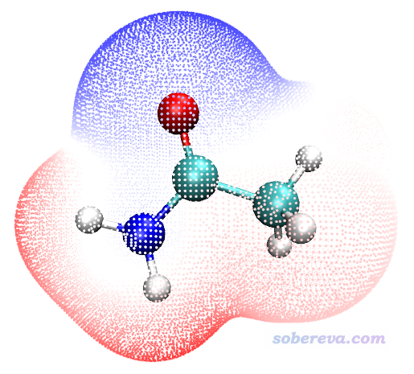

ESPpt.vmd脚本里默认色彩刻度是-50kcal/mol ~ 50 kcal/mol，对应颜色按照“蓝-白-红”过渡。如果想在VMD的界面里直接修改显示设定，诸如点的尺寸、色彩刻度范围等，见196一文。

接下来我们通过电子密度等值面着色展现分子范德华表面静电势分布。双击ESPiso.bat，也是很快就算完了。启动VMD（如果之前VMD已经打开了，关了它再重启之），然后在VMD文本窗口直接输入iso即可（在此之前绝对不要先运行pt命令！），看到的图像将很接近于下图。为了显示效果更好，笔者此处使用了VMD自带的Tachyon渲染器渲染，步骤在《用Multiwfn+VMD做RDG分析时的一些要点和常见问题》（<http://sobereva.com/291>）文中说明了，得到的图像比在图形窗口直接看到的更有光泽感而且有抗锯齿效果。

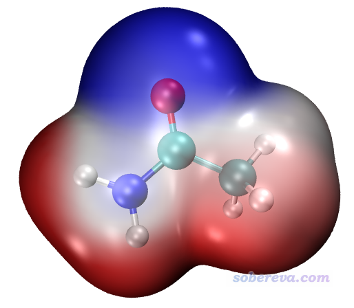

最后，再看怎么把范德华表面静电势极值点位置显示出来。双击ESPext.bat开始计算，它所干的事和ESPpt.bat一样，只不过还额外产生一个记录极值点的surfanalysis.pdb文件。按照如上任意一种方法显示出静电势图后，在文本窗口输入ext即会看到极值点也显示出来了。黄球对应静电势极大点，青球对应静电势极小点。以下左图是先输入pt再输入ext的效果，右图是先输入iso再输入ext然后用Tachyon渲染后的效果（之后在Graphics - Representation里把Selected Molecule切换为density1.cub，把Material选项材质改为Transparent，此时背面的极值点才能看到。如果你想默认就用这种材质，把ESPiso.vmd里的$id EdgyGlass替换为$id Transparent即可）

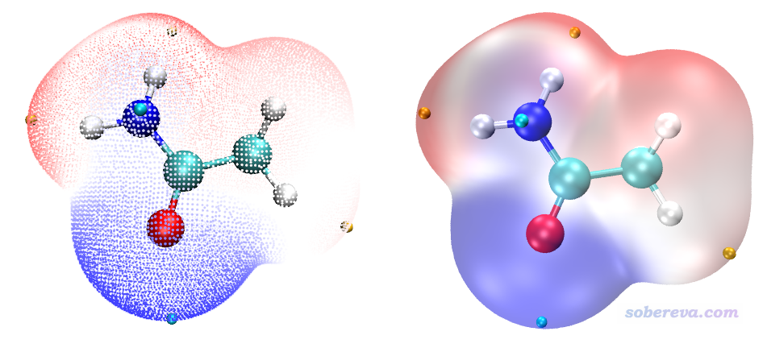

表面静电势极值点上的静电势的具体数值可以通过ps来标出来，在196文中详细说了。基本过程是先点击VMD的OpenGL图形窗口将之激活，点击键盘上的0进入VMD的查询模式，然后点击一个表面极值点对应的圆球（必须点正中心。如果目前同时显示了表面顶点则先关闭显示表面顶点免得妨碍选取），文本窗口里如果提示比如index 1，那么把这个数加上1就是它在surfanalysis.pdb中的实际序号，要加1是因为VMD的index编号是从0开始计的。要查看index 1的表面极值点对应的数值，就把surfanalysis.pdb里开头的注释行内容删掉，找到第2行，其倒数第2列的数值就是静电势的数值了。对当前体系，第2行内容如下  
HETATM    2  C   MOL A   1      -0.426  -2.953   0.281  1.00 44.12          C   
故44.12 kcal/mol就是index 1这个点的静电势值。注意对于带电体系，由于kcal/mol单位下的静电势数值可能超过了pdb格式的B因子这一列的可记录范围，此时Multiwfn自动会改用eV为单位记录，看一眼pdb文件开头提示用的是什么单位就知道了。顺带一提，在surfanalysis.pdb中静电势极大点和极小点分别用C和O原子表示。  
**还有一种更方便的查询极值点静电势数值的方法**：比如某个极值点是index 3，就在VMD窗口中输入[atomselect top "index 3"] get beta即可显示出数值。

## 4 绘制静电势着色的分子间范德华表面穿透图

绘制这种图实际上就是把每个单体的静电势着色的分子表面图显示到一起，从图中可以一目了然看到哪些地方范德华表面被互相穿透，由此可以讨论相互作用强度，还可以通过颜色讨论静电相互作用特征（一般是呈现静电势正负互补的，在《静电效应主导了氢气、氮气二聚体的构型》<http://sobereva.com/209>一文有详细讨论）。在产生输入文件过程中一定要记住，只需要对复合物进行优化，而单体的坐标必须直接从优化后的复合物的坐标里直接抠出来（比如可以用gview打开优化后的输出文件，把其中某个单体复制到一个新窗口里，保存成gjf文件），之后对各个单体做单点计算任务得到含有波函数信息的文件即可。对于Gaussian，一定要记得计算单体的时候要加nosymm关键词，否则由于Gaussian自动会把分子调整到标准朝向，导致坐标和复合物不对应。详见《谈谈Gaussian中的对称性与nosymm关键词的使用》（<http://sobereva.com/297>）。

### 4.1 Guanine-Cytosine碱基对

这个例子的Guanine和Cytosine单体的Gaussian输入文件，以及计算产生的.fch文件都提供在本文文件包里的GC目录下了。将1.fch（对应Cytosine）和2.fch（对应Guanine）都拷到Multiwfn目录下，双击ESPpt.bat，就会开始计算，输出文件被自动拷到了VMD目录下。然后启动VMD，在文本窗口输入pt2命令，得到基于表面顶点绘制的范德华表面穿透图

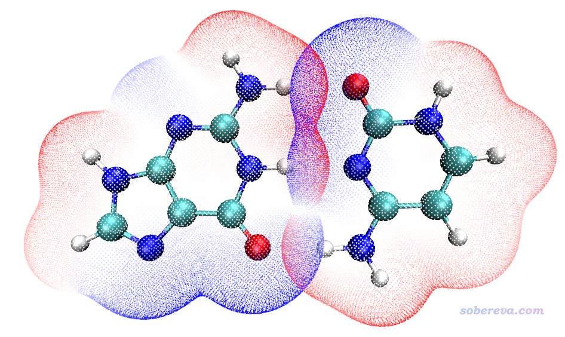

由图可见在形成氢键区域，范德华表面穿透很明显，而且是红色和蓝色相互穿透，体现静电势的互补特征，也反映出氢键的静电吸引相互作用的本质。在VMD里按键盘上的2，然后点击恰当的两个表面顶点，就可以通过测量顶点的距离来考察穿透距离，这在196文中已经说了，请仔细阅读（由于显示出来的距离值的文字是白色的，当前背景也是白色的，可能难以观察。只要把ESPpt2.vmd里的color Display Background white删掉再作图，或者VMD文本窗口输入color Display Background black命令，就可以切换到黑背景。为了便于点击恰当的表面顶点，建议一次只显示一个单体的表面顶点，即在VMD main窗口里双击vtx1.pdb或vtx2.pdb的单体的"D"标记将之取消显示，并且恰当旋转和缩放视角以便于点击顶点）

下面基于静电势着色的电子密度等值面再来绘制穿透图。双击ESPiso.bat，需要运算一会儿，算完后启动VMD，输入iso2命令，即得到下图（对于这种重叠图不建议用Tachyon渲染，否则等值面交界处会有明显痕迹，不好看）

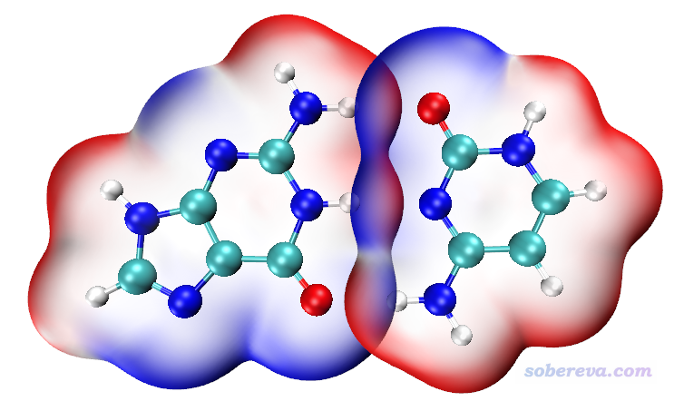

### 4.2 水四聚体

本文文件包里的water_tetramer里面的complex.gjf是含有优化过的四聚体的坐标的Gausian输入文件，1/2/3/4.gjf是基于其中每个单体坐标构建的Gaussian输入文件，计算产生的相应的.fch文件也都提供了。将这些fch文件拷到Multiwfn目录下，然后按照上一节的做法操作，得到如下两种图

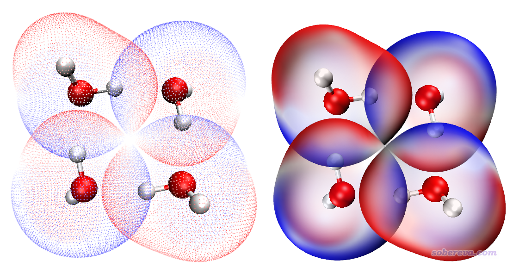

左边的图比较素雅清爽，右边的图比较浓郁。当然绘制左图时也可以把表面顶点尺寸加大，缩窄色彩刻度上下限来让颜色更艳一些，这些在196文章里都有涉及。

## 5 关于调节材质和色彩变化

对于有的复杂体系，在默认的EdgyGlass材质下可能绘图效果不是很理想，比如下面这个团簇体系，画面看起来很乱，不容易看清楚体系表面静电势特征：

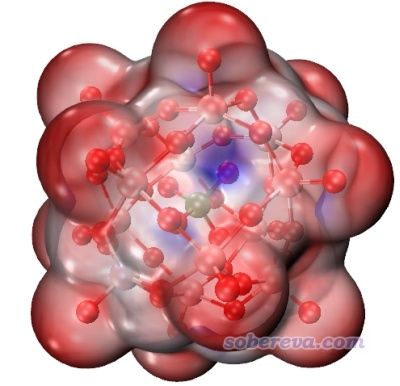

这个问题主要是透明度太高了。只要改一下材质即可。做法是进入Graphics - Materials，选择当前用的材质EdgyGlass，然后调节各个滑条，特别是Opacity（不透明度）。我们把材质改成下面的情况

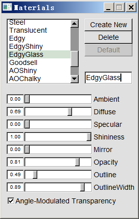

此时看到的图像如下所示，看着清楚多了。

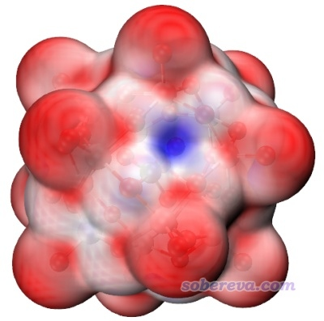

如果你不喜欢作图脚本用的蓝-白-红方式的色彩变化，可以进入Graphics - Colors - Color Scale，用Method下拉框将色彩变化方式设成别的。比如有很多文章用的是用红色代表负值部分，蓝色代表正值部分，为了与这种习俗对应，你就可以把Method设为RWB（Red-White-Blue）。

从VMD 1.9.4版开始支持更多的色彩刻度变化方式。如果想让着色的颜色更丰富，可以在使用iso命令显示出静电势着色等值面图之后运行以下命令将色彩刻度变化方式改为turbo并对材质进行恰当修改，这是按照彩虹色彩方式变化。命令中把色彩刻度下、上限分别改到了-0.06到0.06，应根据实际体系反复调节直到效果最好。  
color scale method turbo  
mol scaleminmax 0 1 -0.060000 0.060000  
display projection Orthographic  
material change outline EdgyGlass 0.590000  
material change outlinewidth EdgyGlass 0.340000  
material change opacity EdgyGlass 0.730000  
material change shininess EdgyGlass 0.80000  
material change diffuse EdgyGlass 0.800000  
material change specular EdgyGlass 0.250000

下面是对FOX-7分子使用以上命令修改作图设置后的效果，可见色彩很丰富  
重要提示：截止到2023-Jul-29，VMD 1.9.4正式版仍未发布，而非正式版bug奇多，还容易莫名其妙崩溃，个人建议在虚拟机里安装1.9.4非正式版。

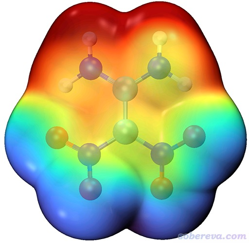

## 6 关于显示色彩刻度轴

如果想把色彩刻度轴显示出来，一个做法是进入Graphics - Colors，选择Color Scale标签页，然后把色彩刻度条截图截出来，用photoshop旋转、拉伸一下，然后把上下限数值标注上去即可。

另一个做法是先把静电势图显示出来，在VMD里选择Extensions - Visualization - Color Scale Bar，Autoscale选On，Use Molecule旁边的项目选density1.cub（假设你是通过iso命令来显示静电势着色的分子表面的），Use Representation选Isosurface。Color of labels选black，Label format选Decimal，然后点Draw Color Scale Bar。然后在VMD Main窗口里，把Color Scale Bar以外的项目的F字母都双击点成黑色将它们固定住，然后双击Color Scale Bar旁边的F将之变成红色使之可以移动。然后点击VMD的OpenGL图形窗口将之激活，点t键进入视角平移模式，按住鼠标在画面里拖动，把色彩刻度条挪到合适的位置。之后再按r恢复默认的旋转模式，在VMD Main窗口里把Color Scale Bar的F双击变成黑色使之固定住，而其它体系的F双击变成红色使之解除固定。最后效果如下所示

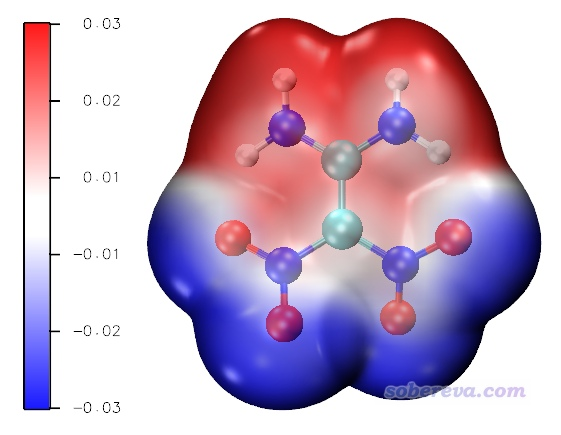

可以在图上标注一下或者在图例里说明一下刻度的单位。对于通过iso命令显示静电势着色等值面的情况，由于静电势cube文件里的单位是a.u.，所以刻度条上的单位也是a.u.，也可以自行ps成对应的其它单位的数值。如果你是用pt命令显示的，如前所述，单位可能是kcal/mol也可能是eV。

**如果你想让iso、iso2命令产生的表面静电势图以eV为单位**，按下面的做法（必须用2021-Aug-17及以后更新的Multiwfn）：  
把examples\drawESP目录下的ESPiso_eV.bat和ESPiso_eV.txt拷到当前目录下，用它们代替前文的ESPiso.bat和ESPiso.txt进行计算。把前述的ESPiso.vmd和ESPiso2.vmd拷到VMD目录下之后，把里面的set colorlow -0.8和set colorhigh 0.8前面的#去掉使之生效。这样得到的静电势cub文件就是以eV为单位记录的了，默认色彩刻度下限和上限将是-0.8 eV和0.8 eV，用上述的Color Scale Bar绘制的色彩刻度轴也是以eV为单位的了。PS：如果想以kcal/mol为单位，把ESPiso_eV.txt里的a.u.到eV的转换系数27.2114改成627.51，并恰当设置ESPiso.vmd和ESPiso2.vmd里的默认的色彩刻度上下限即可。

## 7 关于色彩刻度范围

我建议读者自行根据实际情况在VMD的Graphics - Representation的Trajectory标签页的文本框里调节色彩刻度的下限和上限，使得色彩可以尽可能充分地体现分子表面上不同区域静电势的差异。比如你感觉红、蓝颜色太淡，则应当把色彩刻度范围区间设小一点。如果有一大片地方全是相同的红色或相同的蓝色，因而区分不开差异，则色彩刻度范围需要设宽一些。需要考虑实际效果反复调节到最理想。

**对于离子体系，VMD作图脚本里默认的色彩刻度范围是非改不可的**。比如下图的阳离子体系，分子表面静电势处处为正，而且数值很大，如果用默认色彩刻度的话分子表面显然就只有一种颜色。对于这种情况，大家应启动Multiwfn，载入输入文件，进入主功能12，选0，即做分子表面上的静电势的定量分析，然后按照下图的示意，把色彩刻度的下限和上限分别设成Multiwfn输出的分子表面静电势最小值和最大值（最大值和最小值前头都有星号提示），此时这个阳离子分子表面不同区域静电势的差异就得以体现了。注：对于用ESPext.bat绘图的情况，从Multiwfn窗口里取a.u.为单位的值。而对于用ESPpt.bat绘图的情况，单位可能是kcal/mol（中性体系一般如此）也可能是eV（离子体系一般如此），用文本编辑器打开自动被挪到VMD目录下的vtx1.pdb文件，看一下开头的注释行的提示就知道应当读哪个单位的。

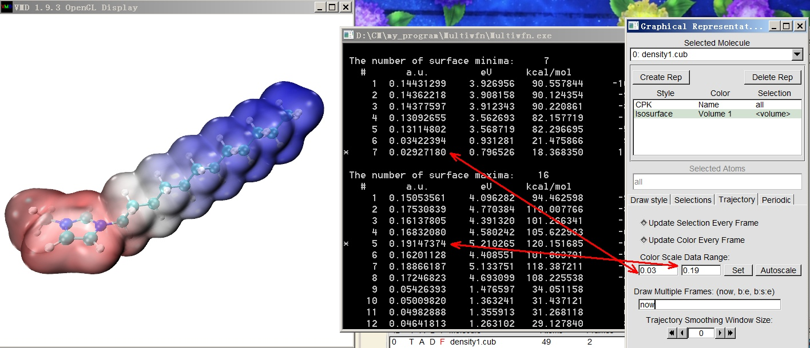

是否对各种体系总是适合使用表面静电势最负和最正值分别作为色彩刻度下限和上限呢？答案是否定的。虽然这么做能确保分子表面不同数值静电势的位置能对应不同颜色，但这往往不是什么好的选择，比如：  
(1)上、下限是个零碎的小数，令色彩刻度轴显得不够工整  
(2)上、下限不对称，导致白色的区域不是正好落在静电势为0的地方从而有碍判断。当然并不需要非得上下限对称，只不过不对称的时候需要自己确保色彩变化的中间颜色正好对应静电势零点，可以通过Graphics - Colors - Color Scale里的Midpoint进行调节。  
(3)视觉效果未必好。比如分子某处静电势特别负，若为了照顾这个位置而设置下限，可能导致静电势比较负的区域在着色上不容易区分差异。  
(4)横向对比一批分子表面静电势时，如果色彩刻度范围用得不统一，会造成误判。

## 8 其它细节

如果你目前还没根据自己机子实际情况修改Multiwfn的settings.ini文件里控制并行核数的nthreads参数，记得一定要将之改成CPU的物理核心数，要不然没法发挥CPU的实际计算能力。

本文的脚本的运行机制在《详谈Multiwfn的命令行方式运行和批量运行的方法》（<http://sobereva.com/612>）中做了十分详细的介绍。希望大家充分理解脚本中的语句的内容，以便根据自己实际情况修改，从而用起来更方便，比如可以在ESPpt.bat和ESPiso.bat倒数第二行分别加上del D:\study\VMD193\*.pdb和del D:\study\VMD193\*.cub来使得运行时自动把VMD目录下之前的pdb和cub文件删除。

本文的.bat批处理文件是Windows下的，如果想在Linux下也类似地通过脚本快速绘制，看Multiwfn手册4.A.13节的第9部分（此外，也可以手动在性能较好的Linux服务器上把VMD脚本绘图所需的文件算出来，然后自行拷到Windows的VMD目录下再用VMD的脚本绘图）。

ESPpt.txt里的0.15是Multiwfn中定量表面分析时的格点间距，如果改大这个值，表面顶点就会变得更稀疏，同时由于表面顶点数变少了，计算耗时也会降低。ESPiso.txt里面的命令对应于计算电子密度和静电势格点数据时分别用high quality grid和low quality grid（后者低于前者是为了节约静电势计算时间），对于一般情况这个设置已经效果较理想了，但如果体系涵盖的空间范围特别大（比如400个原子以上），必须提升格点质量增加计算的格点数这样作图效果才好（当然代价是耗时显著增加），否则等值面可能很不平滑而且对应静电势的颜色很模糊。具体做法是把ESPiso.txt内容改为  
5  
1  
4  
0.4  
0  
5  
12  
2  
2

本文最多考虑到了四聚体，更多聚体的穿透图也可以类似地绘制，比如绘制8聚体，就把ESPiso.bat和ESPpt.bat里计算命令的序号上限从4扩展到8，并且把ESPiso2.vmd和ESPpt2.vmd里的nsystem参数从4改成8，则运行这些绘图脚本时VMD目录下的后缀从1到8号的文件都会被载入和绘制。

常有人问为什么他通过ext命令绘制出的分子表面静电势极值点的数目和他自己在Multiwfn里用主功能12做静电势的定量分子表面分析给出的不符，这是因为ESPext.bat脚本把格点间距设成了0.15 Bohr，而Multiwfn默认用的是0.25 Bohr。格点间距越小表面顶点确定得越准确。显然不符的时候，通过ESPext.bat给出的更准。如果想要二者结果一样，在Multiwfn主功能12里进行计算前先选选项3修改格点间距为0.15 Bohr即可。

对于巨型体系的分子表面静电势的绘制，DFT方法优化并产生波函数文件的过程可能比较费劲，但可以使用xtb程序在很便宜的GFN-xTB级别（类似于半经验的DFT方法）下做优化并产生molden格式的波函数文件，可以直接作为上文提及的脚本的输入文件。这在《巨大体系的范德华表面静电势图的快速绘制方法》（<http://sobereva.com/481>）一文中介绍了。

如果你要绘制1000原子以上的特大体系的分子表面静电势图，像本文这样基于波函数来计算肯定是算不动的，应当使用《基于原子电荷极快速绘制超大体系的分子表面静电势图》（<http://sobereva.com/639>）里的做法，用Multiwfn基于原子坐标和原子电荷来计算，虽然准确性会打一定折扣，但耗时超级低，对于几千原子体系在一般个人电脑上也就是耗费几分钟的事。

ESPiso.bat里有个-ESPrhoiso 0.001的设置，如果你想了解这是什么含义的话，参看《巨幅降低Multiwfn结合VMD绘制分子表面静电势图耗时的一个关键技巧》（<http://sobereva.com/602>）。

如果体系带电荷特别多导致分子表面有的区域静电势数量级特别大，有可能导致ESPpt.bat涉及的vtx.pdb的B因子段落由于位数限制无法记录实际的静电势数值。解决办法是使用examples\drawESP目录下带_pqr后缀的那些文件代替前文提及的不带_pqr后缀的那些文件来计算以及在VMD中作图。带_pqr后缀的脚本会调用Multiwfn产生记录分子表面静电势的.pqr文件，其中charge那一列被用于记录静电势数值，由于没有位数限制，静电势无论多大都可以被记录（注意，总是以a.u.为单位记录）。

使用与本文类似的方法，还可以非常方便地绘制对于研究亲电反应位点非常重要的平均局部离子化能(ALIE)以及讨论亲核反应位点、亲电性非常有用的局部电子附着能（LEAE）着色的分子表面图，并且ALIE和LEAE表面极小点也可以一起显示出来，绘制过程见《使用Multiwfn和VMD绘制平均局部离子化能(ALIE)着色的分子表面图（含视频演示）》（<http://sobereva.com/514>）和《使用Multiwfn通过局部电子附着能(LEAE)考察亲核反应位点、难易及弱相互作用》（<http://sobereva.com/676>）。

很多次有人问怎么他用VMD渲染脚本（大概率是用的Multiwfn目录下的examples\scripts\VMDrender_full.bat）渲染出的分子表面静电势着色图太亮，白晃晃的。这是因为bat里渲染器选项用了-trans_raster3d，改成-trans_vmd就解决了，效果和Tachyon(internal)完全一样。

利用Multiwfn和VMD，还可以只对对应特定原子或片段的分子表面上的局部部分绘制静电势图，从而排除其它部分产生的视觉干扰，参见《使用Multiwfn结合VMD绘制分子局部区域表面静电势的方法》（<http://sobereva.com/750>）。

## 9 总结

本文介绍的绘制分子表面静电势图的方法算是目前最快、最好的绘制方法了，而且用到的Multiwfn和VMD都完全免费。相比之下，用GaussView绘制这类图的操作步骤多于此文，耗时远高于此文，效果也不如本文，而且程序是收费的而且挺贵，还没法把静电势极值点显示出来，也没法绘制穿透图，而且只能用fch/fchk作为输入文件，显然相对于本文介绍的方法来是不可取的。

## 10 附：几个文献中的应用实例

下面给出几个通过本文做法绘制的已发表的文章中的图像作为实例。

笔者专门发表了一篇18碳环电子结构的分析文章，简介见《一篇最全面、系统的研究新颖独特的18碳环的理论文章》（<http://sobereva.com/524>），其中就利用了本文的方法对此体系表面静电势分布进行了绘制，并根据《使用Multiwfn结合VMD分析和绘制分子表面静电势分布》（<http://sobereva.com/196>）里的做法对静电势不同区间面积分布进行了考察，结果如下图所示，可见效果极佳！

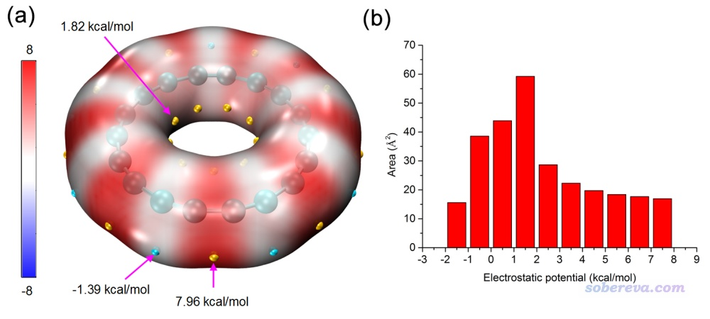

下图是《18个氮原子组成的环状分子长什么样？一篇文章全面揭示18氮环的特征！》（<http://sobereva.com/725>）介绍的笔者的ChemPhysChem, 25, e202400377 (2024)文中给出的18氮环的表面静电势填色图，以及静电势不同区间的面积和18碳环的情况的对比，明显能看出18氮环与18碳环在形成分子间相互作用的可能性上有极大的不同。

下面这张图是笔者研究18碳环弱相互作用的文章Carbon, 171, 514 (2021)中的图，左边是18碳环二聚体的，右边是18碳环在外部吸附水分子。可以见可以通过静电势互补原理能极好地解释为什么二聚体是这种构型。强烈建议大家阅读此文：《全面探究18碳环独特的分子间相互作用与pi-pi堆积特征》（<http://sobereva.com/572>）。更多的笔者关于18碳环的研究工作看<http://sobereva.com/carbon_ring.html>。

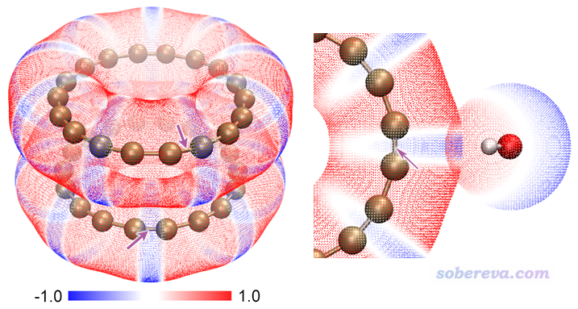

下图是《8字形双环分子对18碳环的独特吸附行为的量子化学、波函数分析与分子动力学研究》（<http://sobereva.com/674>）介绍的笔者的Phys. Chem. Chem. Phys., 25, 16707 (2023)文中的图，充分展现了18碳环吸附进OPP的大环部分后与其范德华表面的相互穿透，体现出这一对主、客体分子之间形状极其般配。

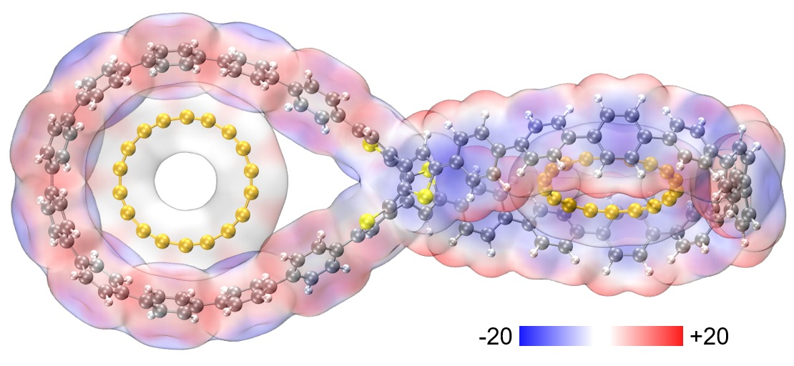

下面这张图右边是J. Mol. Struct.期刊上的一篇研究共晶的文章（DOI: [10.1016/j.molstruc.2020.128480](https://doi.org/10.1016/j.molstruc.2020.128480)）中对晶体局部的四个分子按照本文的做法绘制的静电势穿透图，可见将相互作用展现得非常清楚直观

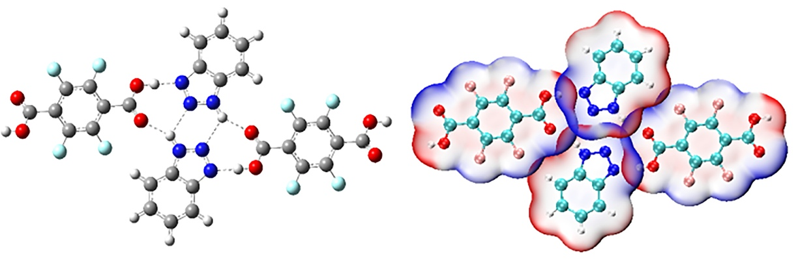

下面是Ind. Eng. Chem. Res. (2020)（DOI: [10.1021/acs.iecr.0c01451](https://doi.org/10.1021/acs.iecr.0c01451)）文章中使用本文方法绘制的图，体现的是1-乙基-3-甲基咪唑鎓氯化物和咪唑选择性吸附SO2，给出了六种构型。可见图中非常清晰地展现出氯离子与SO2静电势为正的硫区域接触，其它分子的静电势为正的部分与SO2静电势为负的氧区域接触，很好地体现出通过静电作用使得SO2被牢固吸附。

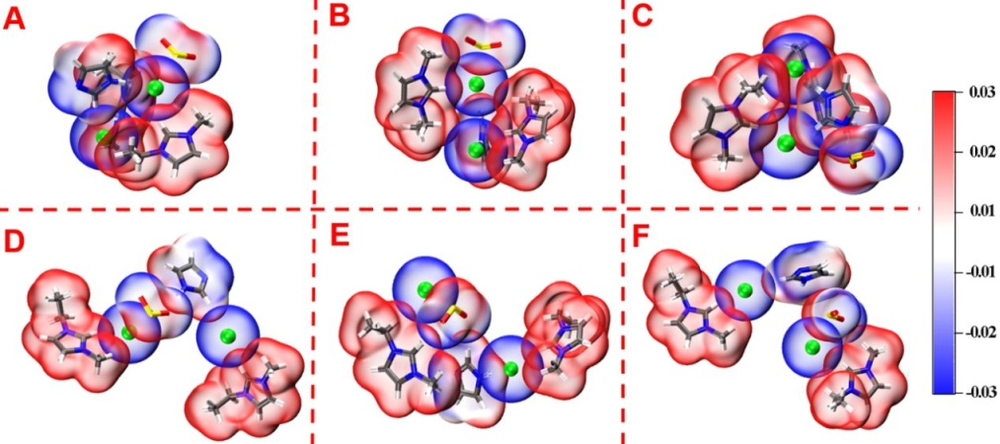

# 

# 附：图像无法绘制出来的排查方法

老有人问怎么按照此文的方法绘制不出来、VMD文本窗口提示找不到mol1.pdb、运行iso后提示Unable to load file 'density1.cub'...之类，几乎是周经问题，在这里明确统一回复一遍

1 首先必须确保用的是Multiwfn官网上的最新版本。VMD最好用1.9.3版（至少这个版本肯定没问题。1.9.4的非正式版绝对不要用！）  
2 确保ESPiso.bat或ESPpt.bat里的VMD路径设对了，否则脚本调用Multiwfn运行完产生的pdb、cub文件没法被自动挪到VMD目录下，显然运行iso等命令时VMD没法加载文件。如果VMD的安装路径里有空格，两边必须用双引号括起来。注：不要把VMD安装到默认的路径下，路径又长又有空格，初学者老是容易写不对！而且可能操作系统或某些防护软件的安全设置会妨碍在其目录下正常创建文件。笔者强烈建议把VMD安装到简短的比如D:\study\VMD193这样的目录中  
3 确保上述bat文件里给Multiwfn用的输入文件的路径无误。如果fch文件是在当前目录下的，直接写文件名就可以。如果你实际的文件是fchk后缀的，显然要么把实际文件的后缀手动改成fch，要么把bat文件里的输入文件的后缀改成fchk  
4 确保用的输入文件的文件格式合理，诸如用.xyz、.pdb之类根本没有波函数信息的格式显然不行。仔细看《详谈Multiwfn支持的输入文件类型、产生方法以及相互转换》（<http://sobereva.com/379>）了解什么格式包含波函数信息，用诸如.molden、.gms、mwfn、.wfn、.wfx等文件格式也都是可以的  
5 确保文中的.vmd后缀的脚本文件都放到了VMD默认的目录下（具体来说就是启动VMD后，在文本窗口里输入pwd并按回车，显示出的目录就是.vmd脚本文件该放的目录。正常情况就是VMD可执行文件所在的目录）  
6 确保改过vmd.rc后保存了此文件，并且确保VMD是在保存此文件后才启动的，否则不生效  
7 如果你要让Multiwfn调用cubegen做静电势计算且当前体系特别大，应确保已经设了GAUSS_MEMDEF环境变量，否则超过默认分配的内存上限时cubegen会崩溃。关于这个环境变量的含义和设置，参考《巨大体系的范德华表面静电势图的快速绘制方法》（<http://sobereva.com/481>）  
8 死活搞不明白原因的话，仔细从头阅读《详谈Multiwfn的命令行方式运行和批量运行的方法》（<http://sobereva.com/612>）直到介绍完ESPiso.bat的地方为止，由此搞清楚bat批处理文件的运作原理（极其简单！）。如果还没醒悟过来问题所在，在当前目录下下打开cmd窗口（不知道做怎么看<http://bbs.keinsci.com/thread-22940-1-1.html>），输入bat脚本名字运行之，从提示上判断哪里有问题（如果提示找不到文件，明摆着就是路径写错了，没别的原因！如果还不懂路径怎么写错了，就找个身边有最基本计算机常识的人给你看）。如果自行不会判断、死活无法解决，把cmd窗口输出的信息连同当前目录的窗口截图贴到Multiwfn的官方论坛上，笔者会回复

还老有人问为什么画出来的分子表面图处处是白色的而不是彩色的，通常就两种可能：  
• 你的体系的分子表面各处的静电势都很接近0，而当前色彩刻度范围又偏大，导致各处静电势的差异无法通过颜色充分体现。解决方法就是恰当减小色彩刻度上下限直到色彩显著  
• 静电势的cube文件没能正常载入VMD。可能是静电势的cube文件本身就没被正常计算出来，应仔细看VMD目录下ESP开头的cub文件是否已经出现、仔细看VMD文本窗口里有没有载入失败的提示，应根据脚本的运行原理试图解决。也可能你的体系较大、静电势的cube文件也较大（如好几百MB甚至更大），而你用的是32bit的VMD，由于可用内存限制而导致无法载入这么大的cube文件，这种情况应改用64bit版VMD。
