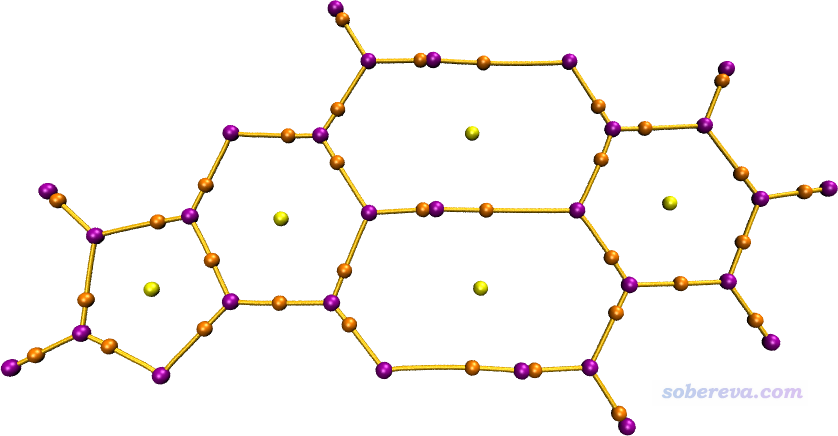
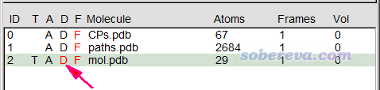
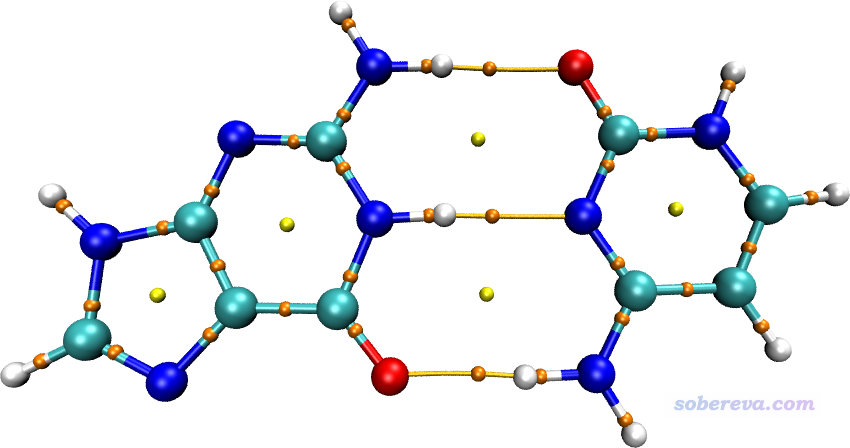
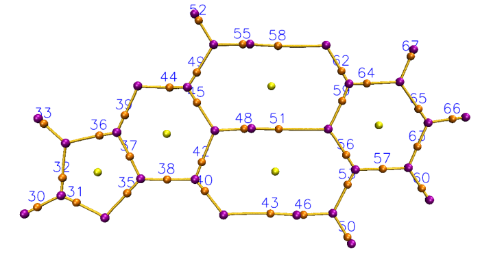
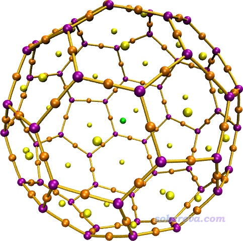
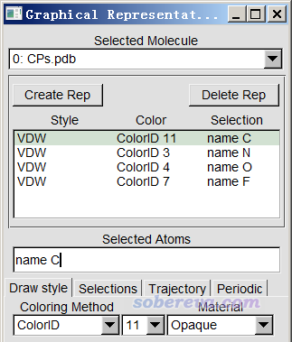

**注：本文介绍的操作有对应的视频演示，按照本文叙述的步骤操作还做不出来者务必观看：**[**https://www.bilibili.com/video/av33724816/**](https://www.bilibili.com/video/av33724816/)

**使用Multiwfn+VMD快速地绘制高质量AIM拓扑分析图**

Using Multiwfn+VMD to rapidly plot high quality AIM topology analysis map

文/Sobereva @[北京科音](http://www.keinsci.com)

First release: 2018-Oct-13  Last update: 2020-Dec-2

## 1 前言

AIM（Atoms-In-Molecules）是Bader发展的极其知名、重要的考察电子结构的一套方法，相关信息见《AIM学习资料和重要文献合集》（<http://bbs.keinsci.com/thread-362-1-1.html>）。Multiwfn（<http://sobereva.com/multiwfn>）在AIM分析方面极度灵活、强大，已被大量研究文章广泛使用，在Multiwfn中做AIM拓扑分析的操作在此文里介绍得非常明白：《使用Multiwfn做拓扑分析以及计算孤对电子角度》（<http://sobereva.com/108>）。Multiwfn目前的观看搜索出来的AIM临界点以及键径的界面中体系没法通过鼠标随意缩放和旋转，体系大的时候可能也不方便寻找感兴趣的临界点的序号。之前笔者写过一篇文章《Multiwfn结合VMD绘制AIM拓扑分析图》（<http://sobereva.com/207>）介绍了怎么把Multiwfn找出的临界点和键径放到强大而且免费的VMD程序中显示得到更好的效果，但是那篇文章手动操作步骤较多，估计一些用户嫌麻烦不愿意去实践，或者由于阅读理解能力差而无法成功实现。这里介绍一种基于脚本的将Multiwfn和VMD相结合的绘制AIM拓扑分析图（包括临界点、键径、分子结构）的做法，此方法绘图效果很好，过程极其简单，完全零基础的初学者应当也能瞬间学会。而且在VMD的图形窗口里找出自己感兴趣的临界点编号也很容易，之后就可以直接根据Multiwfn输出文件查询到选定的临界点上的各种属性。但也并不是说有了本文，之前那篇博文就没意义了，因为那里面详细交代了VMD里的操作细节，弄懂的话就可以根据自己需要调整显示效果。

本文内容对应于Multiwfn官网上最新版本，不要用太老版本。不了解Multiwfn的话参看入门贴《Multiwfn入门tips》（<http://sobereva.com/167>）。本文使用VMD 1.9.3版，可在<http://www.ks.uiuc.edu/Research/vmd/>免费下载。这里假定用户使用的是Windows系统，笔者用的是Win7-64bit。如果读者没有用过Multiwfn做过AIM拓扑分析的话，强烈建议阅读《使用Multiwfn做拓扑分析以及计算孤对电子角度》（<http://sobereva.com/108>）了解基础知识。本文的做法在Linux下同样可以轻易实现，只不过需要适当的变通。

## 2 本文涉及的文件和准备工作

首先，把Multiwfn的examples\scripts目录下的AIM.bat和AIM.txt拷到Multiwfn可执行文件所在目录。用文本编辑器编辑AIM.bat，把其中Multiwfn后面的文件名设成你要做AIM分析的文件的实际路径，把里面的VMD路径改为本机里VMD的实际路径（如果路径里含有空格则必须加双引号，如move /Y *.pdb "D:\study\VMD 193"）。然后把AIM.vmd这个VMD绘图脚本文件拷到VMD目录下，在VMD目录下的vmd.rc文件末尾加入一行proc aim {} {source AIM.vmd}，从而使得仅输入aim就可以调用AIM.vmd来绘图。准备工作就这些。

前述的AIM.bat是Windows下的批处理文件，会启动Multiwfn并按照AIM.txt里的命令对指定的文件进行计算。AIM.txt是输入流文件，里面每一行对应在Multiwfn的界面里要敲入的一个命令。如果你不知道Multiwfn怎么通过命令行调用的话，建议看手册5.2节，看了之后就会明白AIM.bat是如何工作的了。

AIM.txt指挥Multiwfn干的事有以下这些：  
(1)进入拓扑分析功能，通过依次使用选项2、3、4、5来搜索临界点，绝大多数情况这样搜索后都可以找齐临界点。然后通过选项8产生拓扑路径。  
(2)把找到的临界点导出到当前目录下的CPs.pdb，把产生的拓扑路径导出到当前目录下的paths.pdb。  
(3)对找到的所有临界点计算各种属性（为省时间，静电势不被计算，如果想算的话把AIM.txt里的-1改为1），然后导出到当前目录下的CPprop.txt。  
(4)将当前体系结构导出到当前目录下的mol.pdb。  
AIM.bat会把这些产生的.pdb都自动拷到VMD目录下。

所有Multiwfn支持的含有波函数信息的文件都可以用作输入文件，见《详谈Multiwfn支持的输入文件类型、产生方法以及相互转换》（<http://sobereva.com/379>）。

## 3 例：Guanine-Cytosine二聚体

这里我们用Multiwfn文件包里examples目录下的GC.wfn作为例子。把这个文件拷到Multiwfn可执行文件所在文件夹，编辑AIM.bat，把里面的输入文件改为GC.wfn的路径，然后双击AIM.bat。由于Multiwfn做AIM分析效率奇高，几秒钟就算完了，然后窗口也自动关闭了。如果当前目录下出现了CPprop.txt而且内容不为空就意味着正常算完了，这个文件里记录了每个AIM临界点的各种信息。然后启动VMD，在命令行窗口输入aim，此时AIM.vmd就被激活，它自动载入VMD目录下的CPs.pdb、paths.pdb和mol.pdb并显示出来，马上就看到了下图。注意下图不是直接从VMD的图形窗口中截的图，而是用VMD自带的Tachyon渲染器渲染的，这样有抗锯齿效果，Tachyon使用很简单，此文提了：《用Multiwfn+VMD做RDG分析时的一些要点和常见问题》（<http://sobereva.com/291>）。

上图中紫、桔黄、黄分别代表电子密度的(3,-3)、(3,-1)和(3,+1)临界点。此体系没有(3,+3)临界点，如果有的话是用绿球表示。桔黄色的曲线对应的是键径。如果你想修改临界点和键径的粗细、颜色，就编辑AIM.vmd即可，里面注释写得非常清楚。

实际上分子结构文件也被载入到了VMD，只不过没有显示出来。想显示的话，双击下面的D，使之变成黑色

然后分子结构也显示出来了，如下所示

如果想获知某个临界点的性质，比如上图中G-C之间最下面那个氢键对应的临界点，就先在VMD Main窗口里在paths.pdb左边的D标签上双击，从而取消显示键径以免碍事。然后点击VMD的OpenGL图形窗口激活之，按键盘上的0键进入查询模式（之后想返回默认的旋转模式就按键盘上的r键），点击那个临界点的中心，此时VMD的命令行窗口里就显示了以下信息  
Info) molecule id: 0  
Info) trajectory frame: 0  
Info) name: N  
Info) type: N  
Info) index: 42  
Info) residue: 0  
...[略]  
由于VMD的index是从0开始记的，因此这个临界点在Multiwfn中的序号应该是42+1=43。打开CPprop.txt，在里面找43号CP就看到这个临界点上的各种信息了，如下所示。初学者若看不懂这些输出的含义的话就仔细看Multiwfn手册2.6、2.7节关于实空间函数的介绍。  
 ================   CP    43,     Type (3,-1)   ================  
 Position (Bohr):    3.50762367463684   -2.05977861892542    0.00000000000000  
 Density of all electrons:  0.2608153147E-01  
 Density of Alpha electrons:  0.1304076574E-01  
 Density of Beta electrons:  0.1304076574E-01  
 Spin density of electrons:  0.0000000000E+00  
 Lagrangian kinetic energy G(r):  0.2053077113E-01  
 G(r) in X,Y,Z:  0.1152158405E-01  0.7936470033E-02  0.1072717046E-02  
 Hamiltonian kinetic energy K(r): -0.1212608211E-03  
 Potential energy density V(r): -0.2040951031E-01  
...略

AIM.vmd里还定义了批量显示临界点序号的命令labcp，也是在VMD命令行窗口里输入的，用法为：

labcp [类型] [文字尺寸] [偏移量X] [偏移量Y]

类型可以为all、3n3、3n1、3p1、3p3、no，其中n和p意为临界点符号中的-和+。文字尺寸可省，默认为1.8。偏移量X和Y也是可省的，默认分别为-0.1和0.0，可以用来控制标签相对于临界点的位置，前者越正则标签越靠左，后者越正则标签越靠上。大家还可以自己修改AIM.vmd来修改标签的颜色和粗细。这里给出labcp命令的几个例子：  
labcp all：显示所有临界点编号  
labcp no：删除所有临界点编号  
labcp 3n1 1.3：仅显示所有(3,-1)临界点编号，文字尺寸用1.3  
labcp 3p3 1.5 -0.05 0.1：仅显示所有(3,+3)临界点编号，文字尺寸用1.5，X,Y偏移量分别为-0.05和0.1  
使用labcp命令显示的序号和CPprop.txt文件里的序号是直接对应的，不需要手动加1。

AIM.vmd里还定义了标记特定序号的临界点的命令labcpidx，用法为labcp [序号] [文字尺寸] [偏移量X] [偏移量Y]。例如labcpidx "3 6 to 8 12 15" 2.1就代表把3、6、7、8、12、15号原子的标签以2.1的字号显示出来。

对Guanine-Cytosine二聚体显示出所有(3,-1)标签时的效果如下所示，笔者用的命令是labcp 3n1 1.5 -0.1 0.1

如果有的时候标签位置不太好、或者被原子挡住而看不清楚序号，可以缩放/旋转视角来解决，或者绘制标签的时候调整位移值、用更大的标签尺寸。如果想让标签完全不被绘制的物体挡住，那就只能自行用photoshop之类程序解决了，也没什么复杂的。

作为练习，大家可以自己算个C60，然后按照如上方法绘制拓扑分析图，应该得到如下效果

## 4 总结&其它

本文介绍的方法使得绘制高质量AIM拓扑分析图变得超级简单，值得大力推广。而且单从做AIM拓扑分析的角度，此文也把传统流程大为简化，操作效率大为提高，给初学者解释起来能少费很多口舌。

在《一篇最全面、系统的研究新颖独特的18碳环的理论文章》（<http://sobereva.com/524>）介绍的笔者的论文中，我将本文的方法应用于了电子结构很特殊的18碳环的二聚体，并且为了效果更好，在VMD里做了精细的调节，得到了非常漂亮的图像，建议感兴趣的读者看看。

对于大体系，如果想节约一些拓扑分析时间，可以把AIM.txt的第4、5行都给删掉，此时Multiwfn不会试图从每三个原子中心和每四个原子中心作为初猜去找临界点了（而只通过原子核位置和每两个原子中点作为初猜找临界点），这在少数情况下可能会导致漏掉个别临界点，但一般化学上感兴趣的临界点很少有可能会因此漏掉。

如果你想只让某一类临界点显示而不想所有的都显示，可以利用Multiwfn的拓扑分析界面里的选项-4里的子选项2 Delete some CPs删除特定类型的临界点之后再导出。更简单的做法是进入VMD的Graphics - Representation界面，在Selected Molecule一栏里选择CPs.pdb，然后就会看到下面的界面

C、N、O、F分别对应(3,-3)、(3,-1)、(3,+1)、(3,+3)，因此如果你不想显示(3,+1)和(3,+3)，就双击对应name O和name F项，使之变成红色来取消显示即可。另外，比如(3,-1)中你只想显示1,4,6,7,8号临界点，那么在Selected Atoms文本框里把name N改为name N and serial 1 4 6 to 8即可。如果你不想显示这几个(3,-1)临界点，那就写成name N and not {serial 1 4 6 to 8}。

类似地，也可以设置只显示或不显示哪些键径。从paths.pdb的内容可知，不同的拓扑路径对应于不同的残基号，因此在VMD里可以通过残基号来对显示情况进行设置。比如你不想显示3号和7号键径，就进入Graphics - Representation界面，在Selected Molecule一栏里选择paths.pdb，然后在Selected Atoms文本框里输入not resid 3 7即可。查询键径序号的做法是：按键盘上的0进入查询模式，然后点击键径上任意一个点，此时在文本窗口里resid:后面的数值就是这个键径对应的残基号。
