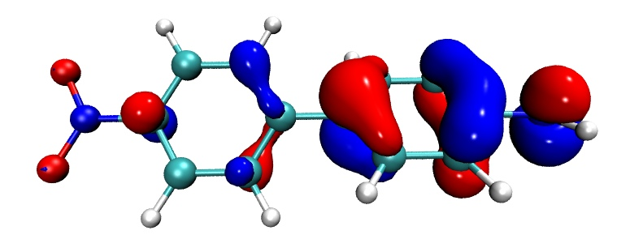

**注1：本文有完整的演示视频，初学者严格照着操作！5分钟内不可能学不会！**[**https://www.bilibili.com/video/av34024335/**](https://www.bilibili.com/video/av34024335/) （别说字太小看不清楚，登录后看1080p的，不可能看不清楚）  
注2：在本文的基础上，通过修改材质和恰当使用Tachyon渲染器，可以得到效果远胜于本文的轨道等值面图，务必在看过本文后一看：《用VMD绘制艺术级轨道等值面图的方法（含演示视频）》（<http://sobereva.com/449>）

**使用Multiwfn+VMD快速绘制高质量分子轨道等值面图**

Using Multiwfn+VMD to rapidly plot high quality isosurface map of molecular orbitals

文/Sobereva@[北京科音](http://www.keinsci.com)

First release: 2018-Oct-17  Last update: 2022-May-19

## 1 前言

数年之前，笔者写过一篇文章《使用Multiwfn观看分子轨道》（<http://sobereva.com/269>），其中十分详细介绍了怎么用Multiwfn自己的观看轨道的界面看轨道等值面图，以及如何绘制轨道的曲线图和平面图，也同时介绍了怎么把Multiwfn计算的轨道波函数的格点数据导出成cube文件，然后放到强大的VMD可视化程序里来获得更好的显示效果。那篇文章虽然对Multiwfn和VMD联用讲得非常清楚详细，但一些接受能力差的人和比较懒的人可能还是不愿意尝试用Multiwfn+VMD的组合去绘制轨道。本文的目的是介绍如何利用脚本，将Multiwfn+VMD联用绘制轨道的过程变得极尽方便。这种绘制方法比起常用的GaussView绘制轨道有极大的优势：(1)完全免费 (2)效果完爆GaussView (3)耗时远远低于GaussView（对大体系，本文的做法花的时间比用GaussView少两个数量级甚至更多）。相信读者花几分钟看过本文和演示视频后，就再也不想用GaussView看轨道了。

读者请务必使用Multiwfn官网上的最新版本。Multiwfn可以在其主页<http://sobereva.com/multiwfn>免费下载，如果对Multiwfn不了解的话强烈建议阅读《Multiwfn入门tips》（<http://sobereva.com/167>）。VMD用的是1.9.3版，可以在<http://www.ks.uiuc.edu/Research/vmd/>免费下载。各种量子化学程序产生的.fch/fchk、.molden、.mwfn文件以及GAMESS-US或Firefly程序的输出文件都可以作为输入文件来用Multiwfn看轨道，简单来说只要是能向Multiwfn提供基函数信息的文件都可以用，详见《详谈Multiwfn支持的输入文件类型、产生方法以及相互转换》（<http://sobereva.com/379>）。本文假定用户用的是Windows系统，在Linux系统下也可以类似地按照本文的做法快速地用Multiwfn+VMD绘制轨道，举一反三即可。

## 2 准备工作

首先把Multiwfn文件包的examples\scripts目录下的showorb.bat和showorb.txt都拷到Multiwfn可执行文件所在目录下。

showorb.bat是Windows下的批处理文件。用户要对它进行编辑，把里面的1.fch改成实际的输入文件名（如果输入文件就在当前目录下，就写文件名就行了，路径不需要写），并且把里面的VMD的路径改成你机子里VMD的实际路径。注意：如果VMD的路径里面含有空格，必须路径两边加双引号，比如move /Y *.cub "D:\study\VMD 193"。

showorb.txt里面每一行都是对应在Multiwfn的界面里要敲入的命令。编辑showorb.txt文件内容，把其中第三行设成你要绘制的轨道序号范围。比如你要考察10,20,21,22,23,28,29,30，就写成10,20-23,28-30即可。

把Multiwfn文件包的examples\scripts目录下的VMD绘图脚本showorb.vmd拷到VMD目录下，然后用文本编辑器编辑VMD目录下的vmd.rc，在最后插入此命令：source showorb.vmd。这样，VMD启动时就会自动执行这个绘图脚本，它定义了三个命令，可以在VMD的文本窗口里输入：  
orb：用来载入和显示轨道。比如你输入orb 33，就会载入VMD目录下的orb000033.cub，并把它的绘制方式修改为等值面图的形式。之后如果比如再输入orb 34，则33号轨道就会被撤销，而将orb00034.cub以等值面形式显示。此命令显示出的轨道等值面数值默认为0.05，可以自行编辑showorb.vmd来修改默认值。  
orbiso：用来修改等值面数值，比如用orb命令显示出了轨道后，再输入orbiso 0.02，就会把轨道等值面数值修改为0.02。  
orbclean：用来把VMD目录下所有orb开头的.cub文件全都删掉，免得VMD目录下文件积得多了之后太乱，如果你不嫌乱就不用运行这个。

做完了以上准备工作后，直接双击showorb.bat，这个脚本就会调用Multiwfn去对指定的输入文件计算要考察的各个轨道的格点数据，并且导出为cube文件。比如第20号轨道导出后就叫orb000020.cub。所有算出来的cube文件会被这个脚本自动挪到VMD目录下，只要你看到VMD目录下出现了相应cube文件就算运行成功了。然后启动VMD，在文本窗口输入 orb [序号] 命令就可以显示相应序号的轨道了。

## 3 实例

这里就用Multiwfn自带的一个NH2-biphenyl-NO2体系作为例子。把examples\excit目录下的D-pi-A.fchk拷到Multiwfn可执行文件所在目录，然后把它改名为1.fch（此文件名和showorb.bat里默认的输入文件名正好对应）。此体系的HOMO是56，假定我们要看它的HOMO-2到LUMO+2，即54到59号轨道，就修改showorb.txt，把其中第三行内容改为54-59。之后双击showorb.bat，算完后启动VMD，输入orb 56来看HOMO，立刻就看到下图，其中轨道波函数的正、负相位部分分别以红、蓝色表示。

如果比如还想看LUMO，就再输入orb 57即可，立刻就会切换为LUMO轨道。

如果想把等值面数值从默认的0.05改成更小的0.02，就输入orbiso 0.02。

如果看完轨道后，想把VMD目录下的cub文件都清掉省得占地方，输入orbclean即可。

## 4 其它

本文介绍了如何利用脚本，极其便利地将Multiwfn与VMD相结合，只用很少的时间就获得理想的轨道绘制效果，可谓绘制分子轨道最完美的解决方案。如果你没看过《使用Multiwfn观看分子轨道》（<http://sobereva.com/269>）的话强烈建议一看，以了解其中细节，便于根据需要调整作图效果。

**关于选择beta轨道**：对于非限制性开壳层波函数，在Multiwfn中beta轨道序号是排在alpha轨道之后的，如果当前有x个基函数，则1号beta轨道就是x+1，这点在《使用Multiwfn观看分子轨道》里已经明确说了。因此修改showorb.txt里轨道序号范围的时候也得对应地去设。懒得自己口算beta编号的话，可以在Multiwfn主功能0的界面里输入比如-30来查看第30号beta轨道对应的Multiwfn中的序号，也可以用通过界面左上角Orbital info.里的选项把所有轨道的基本信息都输出到文本窗口里，看特定编号的beta轨道在所有轨道中是第几号。

VMD的一个缺点是没有自带的显示原子序号的功能（至少是对目前撰文时最新的1.9.3版而言），不过可以用我写的脚本来显示，见《在VMD中显示原子序号的方法》（<http://sobereva.com/197>）。虽然显示效果不算很理想，但自己ps一下也没什么难的。

如果想获得更好的效果，强烈建议用Tachyon渲染器渲染，对某些材质显示的效果比直接在VMD图形窗口里看到的会更好，而且有抗锯齿的效果。Tachyon的使用方法在《用Multiwfn+VMD做RDG分析时的一些要点和常见问题》（<http://sobereva.com/291>）里有详细说明。本文的图就是Tachyon渲染出来的。

默认的等值面的显示材质是Glossy，如果想改成透明的，可以手动在VMD图形界面里改（进入Graphics - Representation，修改Material），推荐用EdgyGlass或Translucent。也可以修改showorb.vmd，把里面的Glossy替换为相应材质名即可。使用EdgyGlass或Translucent材质时，用不用Tachyon渲染器渲染效果相差不少。

轨道的正、负相位的颜色可以自己改。默认情况下红色是正相位，蓝色是负相位，想改的话到VMD的Graphics - Representation界面里改Color ID右边的值即可。也可以自行编辑showorb.vmd，把里面的ColorID后面的值改成你想用的颜色的ID号。

本文的脚本默认用中等质量格点进行计算，总的点数约512000个。对于较大体系，比如100原子以上体系，这样的点数往往就有点偏少了，会导致等值面图可能有棱角。此时建议用高质量格点，做法就是把showorb.txt里第四行的2改为3，当然耗时也会增加。另外，对于观看里德堡轨道（相关信息见《图解电子激发的分类》<http://sobereva.com/284>），Multiwfn计算格点数据的默认的延展距离不够大，可能造成以比较小的轨道等值面数值显示时轨道等值面被截断，因此应该在showorb.txt的第三行和第四行之间插入  
-10  
12  
这样延展距离就被加大到12 Bohr了，一般足够了。

如果之前用showorb.bat计算了比如20-30号轨道，然后又想考察比如35-40号轨道，就把showorb.txt里的轨道序号改成35-40，运行一遍，这样VMD目录下20-30和35-40轨道的cube文件就都有了，就都可以用orb命令看了。

PS：如果以本文方式绘制了分子轨道，**请记得引用Multiwfn程序一启动时就显示的Multiwfn程序原文**。

## 5 FAQ

如果在VMD文本窗口里输入比如orb 23时提示Could not read file orb000023.cub，应当检查VMD目录下是否确实有orb000023.cub。如果没有，有以下可能：  
(1)showorb.bat里VMD路径没写对，或者路径里有空格但是两边忘了加双引号  
(2)给Multiwfn用的输入文件格式不对，或者文件存在问题  
(3)showorb.bat里的输入文件路径没写对  
(4)showorb.txt里被计算的轨道序号范围没包括被考察的那个轨道  
(5)VMD装到了C盘的默认目录下，可能由于操作系统权限设置、安全防护程序等原因导致cub文件没法自动被挪到VMD目录下  
(6)用的VMD版本有bug。用VMD 1.9.3版100%没问题  
如果不理解本文用到的批处理文件是如何工作的，看《详谈Multiwfn的命令行方式运行和批量运行的方法》（<http://sobereva.com/612>）中的相关说明。

如果在VMD文本窗口里输入比如orb 23时提示invalid command name "orb"，有以下几种可能：  
(1)vmd.rc文件里没写入source showorb.vmd  
(2)vmd.rc文件里虽然写入了source showorb.vmd，但之后没保存文件，或保存完了没重启VMD  
(3)showorb.vmd文件没放到VMD目录下，导致VMD启动时没法自动运行此脚本
