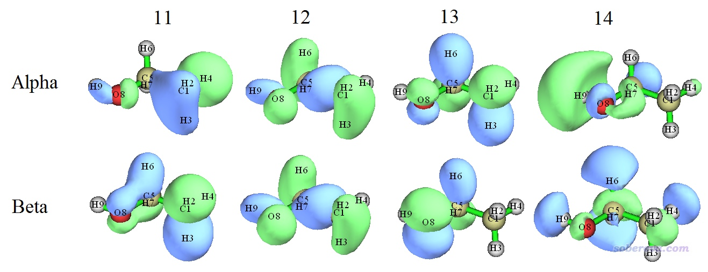
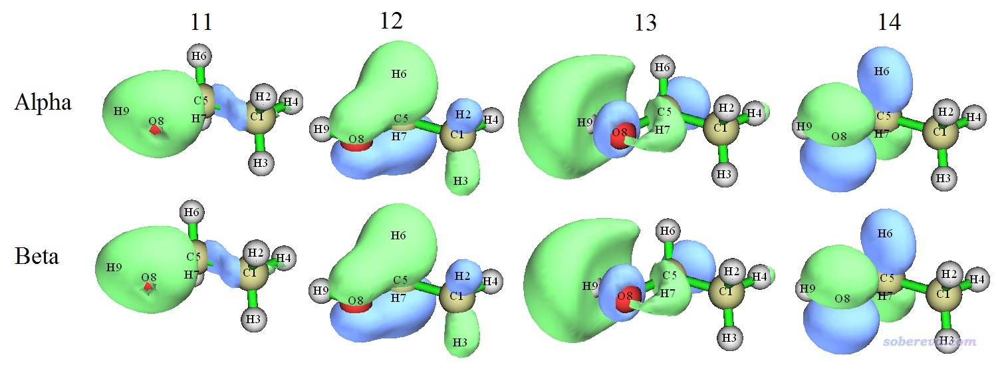
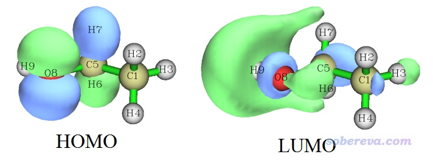
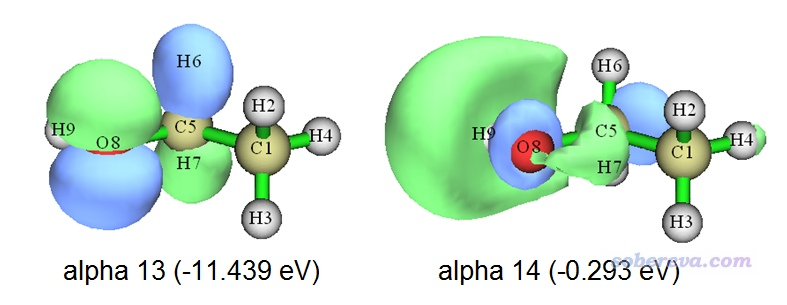

**用于非限制性开壳层波函数的双正交化方法的原理与应用**

Principle and application of biorthogonalization
method for unrestricted open-shell wavefunctions

文/Sobereva@[北京科音](http://www.keinsci.com)

First release: 2018-Nov-11   Last update: 2021-Sep-10

**摘要**：本文非常简要地介绍一下对非限制性开壳层波函数的alpha和beta轨道之间做双正交化的方法，并且以三重态乙醇为例介绍如何在Multiwfn中实现，使得其alpha和beta轨道最大程度匹配，从而便于讨论轨道。本文说的Multiwfn及其手册是官网上最新版本的情况。

## 1 相关知识

众所周知，非限制性开壳层计算（如UHF、UKS，以下简称为U）的时候alpha和beta是分别求解的，因此会产生alpha和beta这两套自旋轨道。对于自旋多重度>1的体系，以及自旋多重度为1的对称破缺态，由于自旋极化，会导致alpha和beta轨道不匹配，此时虽然alpha轨道自己是正交归一的，beta轨道自己也是正交归一的，但是alpha和beta之间不满足正交归一关系。更具体来说，第i号alpha轨道和第i号beta轨道之间重叠积分不为1，这俩轨道既可能轨道形状稍有偏差，也可能完全不同。因此，对于非限制性开壳层波函数，讨论轨道的时候必须分别去考察alpha和beta轨道，这是比较麻烦的事情。而且这种情况，体系的自旋密度是由所有占据轨道所决定的，因此没法只拿某几条轨道来讨论自旋密度。（不知道什么是自旋密度的话看《谈谈自旋密度、自旋布居以及在Multiwfn中的绘制和计算》<http://sobereva.com/353>）。

虽然限制性开壳层(RO)计算只会产生一套轨道，没有上述U计算的麻烦，但是相对于U，RO计算耗时高、难收敛，自旋密度、体系总能量和轨道能量也都没有U那么有意义，因此用RO回避上述问题也不是好的办法。

实际上，在U计算之后，可以做双正交化(biorthogonalization)变换来解决上述问题。双正交化的具体细节和实现在Multiwfn手册3.100.12节有详述，本文就不细说了。简单来说，双正交化是对alpha和beta轨道进行酉变换，使得alpha和beta之间完美满足或基本满足正交归一关系，同时又不破坏每种自旋轨道与其自己原有的正交归一关系。双正交化具体实现方式并不唯一，Multiwfn中的双正交化方法分成三步，经过这三步变换后，每个alpha和与之序号相同的beta轨道一般可以达到近乎完美匹配，因此之后就只需要讨论一套轨道即可（类似于RO轨道的情况）。

在双正交化过程中每种自旋的占据轨道和占据轨道会发生混合、空轨道和空轨道会发生混合（具体来说是酉变换），而不同自旋轨道间不会发生混合。这种变换不会导致体系任何可观测性质发生改变，因此如果使用双正交化后的轨道去计算体系总能量、总电子密度、自旋密度等等，结果和U计算给出的是完全相同的，在这点上类似于轨道定域化。双正交化后的轨道不再是Fock算符的本征函数，因此双正交化轨道也没有确切的轨道能量，而只能以Fock算符期望值的方式求轨道能量。

## 2 实例

### 2.1 三重态乙醇

下面我们对三重态乙醇做双正交化，来看看双正交化的实际效果和价值。首先我们先看一下UB3LYP/6-31G**下直接给出的这个体系三重态的几个分子轨道等值面图，如下所示。其中14号alpha轨道是alpha轨道中的HOMO，12号beta轨道是beta轨道中的HOMO。

由图可见，只有12号alpha与12号beta轨道匹配很好，形状和相位都肉眼看不出显著差别，而其它alpha和beta轨道之间完全匹配不上。alpha比beta占据轨道多两个（13和14），但显然当前情况我们不可能认为体系的自旋密度等于13和14号alpha轨道对应的密度之和，因为由于其它alpha和beta占据轨道形状的不匹配，它们也对自旋密度有直接的影响。

在Multiwfn中做双正交化需要的输入文件必须包含基函数信息，具体看《详谈Multiwfn支持的输入文件类型、产生方法以及相互转换》（<http://sobereva.com/379>）、《Multiwfn入门tips》（<http://sobereva.com/167>），对于Gaussian用户就用fch文件即可。UB3LYP/6-31G**下三重态乙醇的fch文件已经在Multiwfn自带的文件包里提供了，这里我们对它做双正交化。

启动Multiwfn，然后依次输入  
examples\ethanol_triplet.fch  
100  
12   //产生双正交化轨道  
2    //双正交化过程中考虑所有轨道（对于大体系，为节约时间，可以此处选1略过空轨道之间的双正交化，此时对于此例，在最终结果中编号在14以上的alpha和beta轨道将无意义）  
0    //不计算双正交化轨道能量  
 从屏幕上提示的信息可见双正交化分为三步进行，比如第一步输出的信息为  
Doing biorthogonalization for alpha    1 to   14, Beta    1 to   12  
 Singular values of orbital overlap matrix:  
   1.0000   1.0000   1.0000   1.0000   1.0000   1.0000   1.0000   0.9999  
   0.9999   0.9998   0.9995   0.9992  
这说明这一步是对1~14号alpha轨道和1~12号beta轨道做双正交化。下面的数值是经过双正交化后的alpha和beta轨道间的重叠积分。当前显示了12个等于或非常接近于1.0的数值，这代表这步双正交化后1~12号alpha和1~12号beta轨道已经非常完美地一一对应了。其余的轨道的双正交化会在接下来的步骤中进行。

之后Multiwfn把双正交化后的轨道波函数自动导出为当前目录下的biortho.fch文件，也把双正交化后的轨道信息导出为当前目录下的biortho.txt文件，此文件内容如下所示。

 S = Singular value, E = Energy (in eV), O= Occupancy, A=Alpha, B=Beta  
   
 Orb:     1   S= 1.0000   O(A)= 1.0   O(B)= 1.0  
 Orb:     2   S= 1.0000   O(A)= 1.0   O(B)= 1.0  
...[略]  
 Orb:    11   S= 0.9995   O(A)= 1.0   O(B)= 1.0  
 Orb:    12   S= 0.9992   O(A)= 1.0   O(B)= 1.0  
 -----------------------------------------------  
 Orb:    13   S= 1.0000   O(A)= 1.0   O(B)= 0.0  
 Orb:    14   S= 1.0000   O(A)= 1.0   O(B)= 0.0  
 -----------------------------------------------  
 Orb:    15   S= 1.0000   O(A)= 0.0   O(B)= 0.0  
 Orb:    16   S= 1.0000   O(A)= 0.0   O(B)= 0.0  
 Orb:    17   S= 1.0000   O(A)= 0.0   O(B)= 0.0  
...[略]

通过这个文件可以非常方便地考察双正交化后的alpha轨道与序号与之相同的beta轨道的匹配程度。由于上面列出来的轨道的S（Singular value，即相当于重叠积分）都很接近1，因此这些轨道的alpha-beta匹配程度都很好，只有alpha 12和beta 12的匹配程度稍差一点，但也很接近于1.0，因此这俩轨道的图形从肉眼上应该很难分辨。上面信息里O代表Occupancy，就是占据数的意思，为了观看方便，这个文件里把O(A)=O(B)=1.0、O(A)=1.0&O(B)=0.0和O(A)=O(B)=0.0三个部分用横线做了分隔。

此时程序还问你是否现在就载入biortho.fch文件，如果选y将之载入的话，内存里的轨道就对应于双正交化后的轨道了，之后你可以进入主功能0去查看轨道图形，也可以用主功能0的图形界面左上角的Orbital info.选项去查看这些轨道的基本信息，还可以用Multiwfn中的各种功能去分析轨道特征，比如计算轨道成分、轨道动能等。由于此例没计算双正交化轨道的能量，因此在导出的biortho.fch里“轨道能量”部分记录的是上述输出的singular value值。由于当前没有双正交化轨道的能量信息，因此当前biortho.fch里的这些轨道的序号顺序并不对应于其轨道能量顺序。

这里把11~14号双正交化后的alpha和beta轨道列出：

可见，双正交化后alpha和与之序号相同的beta在轨道形状上已经肉眼基本看不出任何区别了。此时，13和14号alpha轨道可以被冠以描述RO轨道时用的SOMO（单占据轨道）之名，这两个轨道对应的密度的加和正好就是当前体系UB3LYP/6-31G**级别计算的三重态的自旋密度。对比本文上面的两张图，也可以看到在双正交化前后，轨道特征往往差别不小。双正交化后的第13号alpha轨道基本正好对应原先的第14号alpha轨道，而双正交化后的第14号alpha轨道则不直接对应于之前任何一个alpha轨道，显然必定是两个或多个原先的alpha占据轨道发生了显著混合才产生出来的。

值得一提的是，乙醇的单重态基态在B3LYP/6-31G**下计算产生的HOMO和LUMO轨道图形如下

这个HOMO和LUMO分别非常像双正交化后的14号和13号alpha轨道。因此我们可以立刻明白，乙醇从单重态基态激发到最低三重态的过程，如果以轨道跃迁方式描述的话，可以近似说成是HOMO→LUMO的跃迁，因为这样跃迁后HOMO和LUMO就各有一个单电子了，这俩轨道又几乎恰好和双正交化后的两个SOMO对应。像这样重要的信息，如果我们不做双正交化的话，是没法这么容易了解到的。

### 2.2 三重态乙醇（计算双正交化轨道能量）

这个例子还是考察三重态乙醇，和上例不同的是这次我们也让Multiwfn产生双正交化轨道的能量，这样不仅可以讨论更多信息，而且Multiwfn会根据能量对轨道排序，讨论起来更方便。Multiwfn计算双正交化轨道的能量需要利用Fock矩阵，Multiwfn可以通过两种方式获得这个矩阵：  
(1)直接基于分子轨道能量和系数矩阵反解出来Fock矩阵。通常建议用这个方式，最为省事。但是如果使用了大量弥散函数，量子化学程序可能会自动去除一些线性相关基函数，这个时候就没法用这个做法了，只能用下面的方法  
(2)从特定文件里读取。可以从记录Fock矩阵的文本文件里读取，也可以从.47文件里读取（Gaussian可以直接产生），也可以从ORCA输出文件里读取，等等，详情见Multiwfn手册附录7。

启动Multiwfn，输入  
examples\ethanol_triplet.fch  
100  
12  //产生双正交化轨道  
2   //双正交化过程中考虑所有轨道  
1  //计算双正交化轨道的能量，Fock矩阵通过分子轨道的能量和展开系数直接产生  
y  //根据能量对双正交化轨道排序

此时产生了biortho.fch和biortho.txt，后者内容如下

...[略]  
 Orb:    10   S= 1.0000  E(A)=    -13.621  O(A)= 1.0  E(B)=    -13.450  O(B)= 1.0  
 Orb:    11   S= 0.9992  E(A)=    -13.057  O(A)= 1.0  E(B)=    -11.821  O(B)= 1.0  
 Orb:    12   S= 1.0000  E(A)=    -11.918  O(A)= 1.0  E(B)=    -11.866  O(B)= 1.0  
 -------------------------------------------------------------------------------  
 Orb:    13   S= 1.0000  E(A)=    -11.439  O(A)= 1.0  E(B)=     -5.806  O(B)= 0.0  
 Orb:    14   S= 1.0000  E(A)=     -0.293  O(A)= 1.0  E(B)=      2.817  O(B)= 0.0  
 -------------------------------------------------------------------------------  
 Orb:    15   S= 0.9992  E(A)=     13.876  O(A)= 0.0  E(B)=     15.431  O(B)= 0.0  
 Orb:    16   S= 1.0000  E(A)=     15.057  O(A)= 0.0  E(B)=     15.305  O(B)= 0.0  
 Orb:    17   S= 1.0000  E(A)=     18.508  O(A)= 0.0  E(B)=     19.028  O(B)= 0.0  
...[略]

由于这回我们要求Multiwfn计算双正交化轨道的能量，因此这次的biortho.txt里显示了算出来的轨道能量。由于我们也要求按照能量进行排序，因此可以看到轨道序号顺序确实和轨道能量相同了。注意排序的时候是将序号相同的alpha和beta的轨道能量平均值作为依据来排序的。另外，排序是对每一个批次产生的双正交化轨道分别进行排序的（上面信息中的两条横线把所有轨道分割成了三个批次），因此比如第2批次的轨道的能量不一定全都高于第1批次的轨道。

**注**：常有Multiwfn用户问为什么他得到的序号相同的alpha和beta双正交化轨道的形状看起来非常相似，但能量却差了非常多。这是因为开壳层体系的alpha和beta电子的分布通常不对称，而且通常连alpha和beta电子数都往往不同，也因此alpha和beta对应的Fock算符不同。而由于轨道能量是相应自旋的Fock算符求期望得到的，因此哪怕形状精确相同、序号相同的alpha和beta双正交化轨道的能量也注定会不同。如果你就是死活非得要求相同序号的alpha和beta能量相同（就跟限制性开壳层RO计算的情况似的），那你姑且把相同序号的alpha和beta轨道能量取平均得了（虽说没有明确的物理意义），这时的轨道能量相当于轨道波函数相对于alpha和beta电子的平均的Fock算符的期望值。

当前biortho.fch里的“轨道能量”信息是双正交化轨道的真实能量了。如果我们选择y载入biortho.fch，用主功能0的Orbital info.选项查看轨道基本信息，会看到下面这些，确实轨道能量和biortho.txt里显示的相同。  
     1          E(au/eV):   -19.26817    -524.3135 Occ: 1.000000 Typ: A  
...[略]  
    11          E(au/eV):    -0.47985     -13.0573 Occ: 1.000000 Typ: A  
    12          E(au/eV):    -0.43799     -11.9184 Occ: 1.000000 Typ: A  
    13          E(au/eV):    -0.42037     -11.4390 Occ: 1.000000 Typ: A  
    14          E(au/eV):    -0.01078      -0.2933 Occ: 1.000000 Typ: A  
    76 (     1) E(au/eV):   -19.23884    -523.5155 Occ: 1.000000 Typ: B  
...[略]  
    86 (    11) E(au/eV):    -0.43441     -11.8210 Occ: 1.000000 Typ: B  
    87 (    12) E(au/eV):    -0.43606     -11.8659 Occ: 1.000000 Typ: B  
对于beta轨道，上面信息中括号里的序号是从第一条beta轨道开始计的，括号外的是从第一条alpha轨道开始计的。

看一下现在的第13号和第14号alpha轨道。如之前所述，这俩占据轨道几乎完全描述了当前体系的单电子分布，因为其它的占据的alpha轨道都有与之匹配程度极高（重叠积分接近1）的beta占据轨道故而对自旋密度贡献基本为0。这俩轨道的图形和能量如下所示

可见由于Multiwfn对轨道做了排序，当前轨道能量和轨道序号是一致的（而上例中没排序，它俩序号是反着的）。另外，如果你将这俩双正交化轨道和ethanol_triplet.fch里记录的MO13（-10.083 eV）、MO14（-0.276 eV）对比的话，会发现轨道形状相差不太大，能量也相差不算特别大，这也体现Multiwfn给出的双正交化轨道的能量是合理的。

### 2.3 丁烷双自由基

本节用到的fch文件可在此下载：<http://sobereva.com/attach/448/C4H8-singlet.rar>。如果对双自由基计算不了解，参看《CASSCF计算双自由基以及双自由基特征的计算》（<http://sobereva.com/264>）和《谈谈片段组合波函数与自旋极化单重态》（<http://sobereva.com/82>）。

通过非限制性开壳层以对称破缺方式算的自旋极化单重态体系，比如双自由基、反铁磁性耦合体系，双正交化也可以做，但是此时不可能使得每个alpha轨道都能与一个beta轨道完美相对应。比如对丁烷双自由基体系，双正交化时候的第一部分的输出是这样的  
 Doing biorthogonalization for alpha    1 to   16, Beta    1 to   16  
 Singular values of orbital overlap matrix:  
   1.0000   1.0000   1.0000   1.0000   1.0000   1.0000   1.0000   1.0000  
   0.9998   0.9998   0.9998   0.9998   0.9992   0.9990   0.9989   0.3095  
可见，此时双正交化变换的效果是令alpha与beta凡是能匹配的都尽量匹配，这使得前15个轨道都有一一对应关系，重叠积分基本是1.0，但有一个alpha占据轨道就是没法与beta占据轨道相配对，重叠积分才0.3095。这样的输出信息体现在双正交化之后，我们可以就只依靠16号alpha和beta轨道来讨论体系的单电子分布以及双自由基本质特征。

顺带一提，如果想查看原本alpha和beta分子轨道之间的重叠积分，可以用Multiwfn主功能100的子功能5，具体说明详见Multiwfn手册3.100.5节。如果用这个功能里面的选项2输出对上述双自由基波函数的alpha MO和序号相同的beta MO之间的重叠积分，结果如下（以下只列出占据轨道部分）  
Overlap between the     1th alpha and beta orbitals:    0.036957  
Overlap between the     2th alpha and beta orbitals:   -0.036727  
Overlap between the     3th alpha and beta orbitals:   -0.001295  
Overlap between the     4th alpha and beta orbitals:    0.001066  
Overlap between the     5th alpha and beta orbitals:    0.982456  
Overlap between the     6th alpha and beta orbitals:   -0.958735  
Overlap between the     7th alpha and beta orbitals:    0.858202  
Overlap between the     8th alpha and beta orbitals:   -0.882210  
Overlap between the     9th alpha and beta orbitals:    0.994529  
Overlap between the    10th alpha and beta orbitals:   -0.990360  
Overlap between the    11th alpha and beta orbitals:    0.991034  
Overlap between the    12th alpha and beta orbitals:   -0.984323  
Overlap between the    13th alpha and beta orbitals:    0.991434  
Overlap between the    14th alpha and beta orbitals:   -0.991413  
Overlap between the    15th alpha and beta orbitals:   -0.995594  
Overlap between the    16th alpha and beta orbitals:    0.294899  
可见，如果不做双正交化，内核轨道部分（MO 1~4）alpha-beta匹配极差，看图可知主要是因为碰巧定域在了不同原子上，这无所谓。而价层部分，7、8号轨道alpha-beta之间匹配得也不很完美，重叠积分还不到0.9，因此比如讨论自旋密度、双自由基特征时如果简单忽略它们的影响原理上并不好，而在双正交化后就仅仅需要关注第16号轨道了。请大家自行用Multiwfn基于本文提供的fch文件观看以上提及的轨道的图形。
