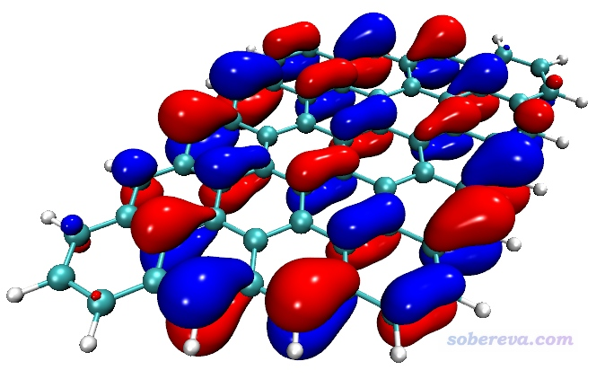
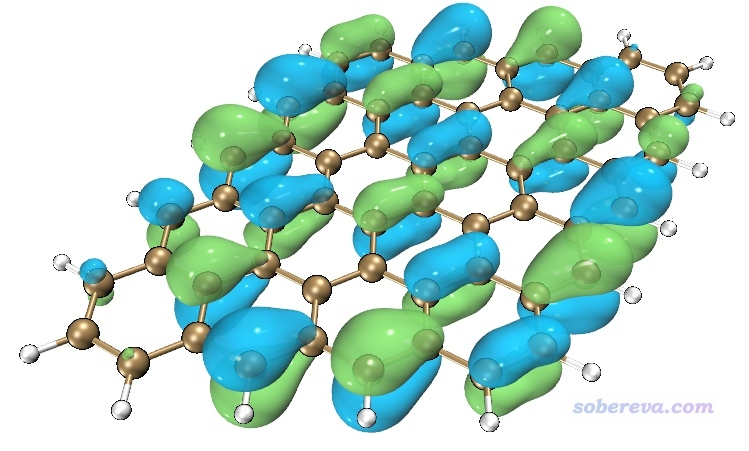
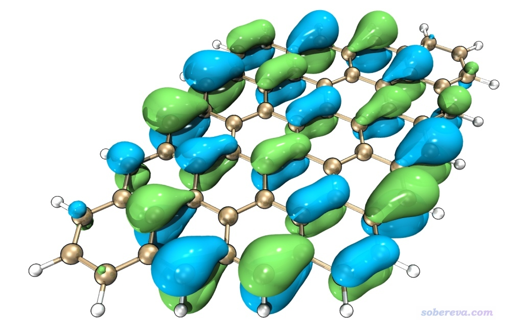
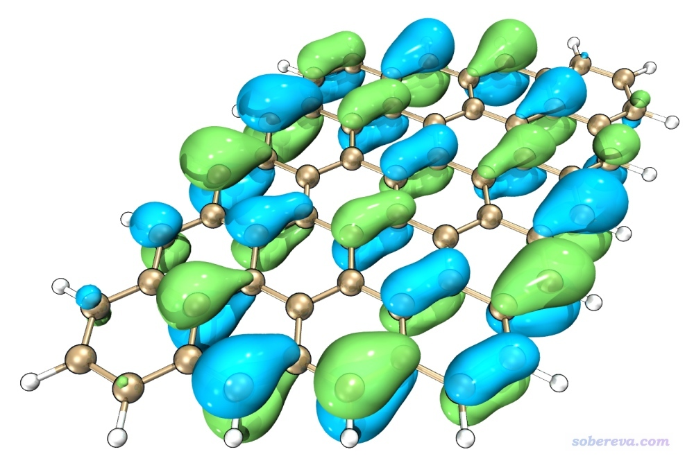
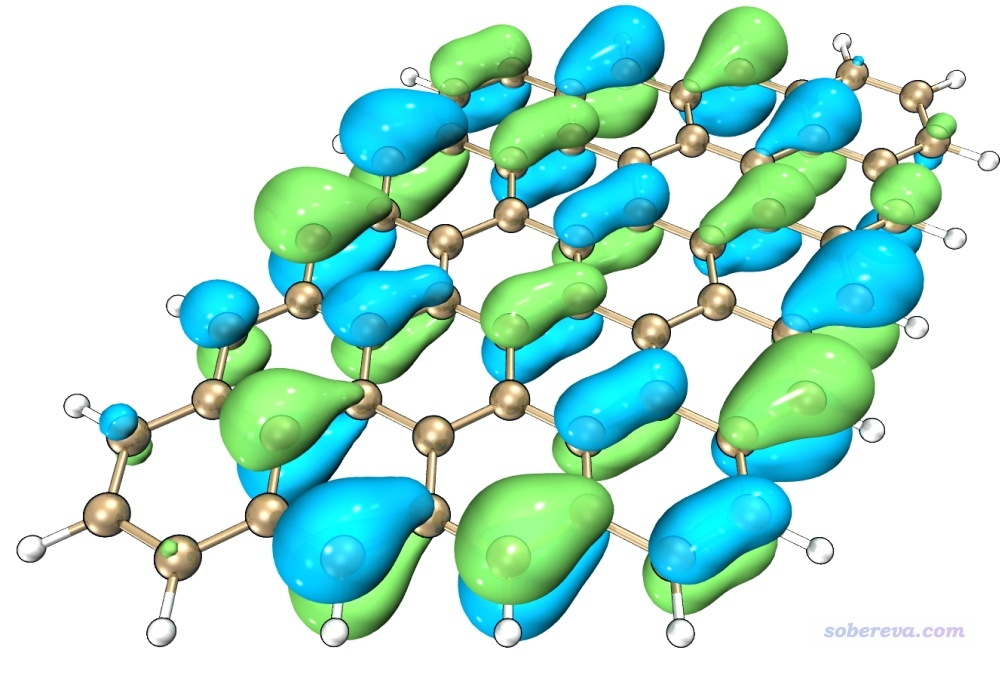
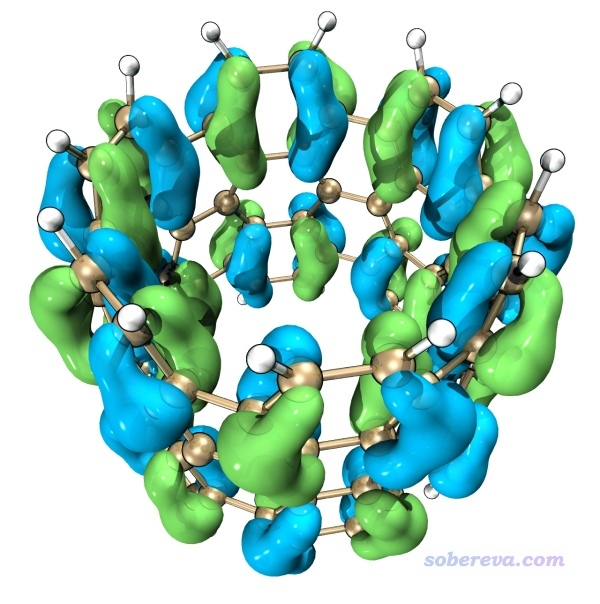
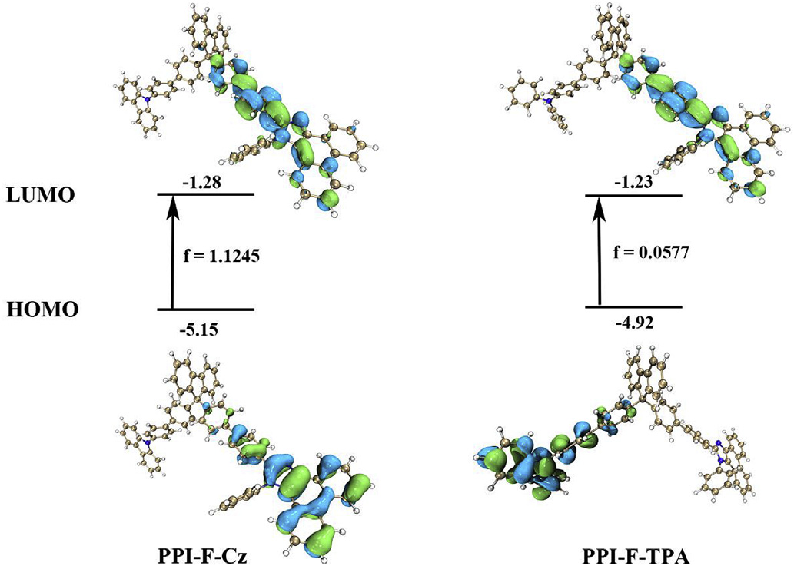

**注：本文的操作配有演示视频，请注意观看，五分钟就能学会画出本文里面的图像的效果，见**[**https://www.bilibili.com/video/av37101659/**](https://www.bilibili.com/video/av37101659/)

**用VMD绘制艺术级轨道等值面图的方法**

Method of drawing state-of-the-art orbital isosurface map using VMD

文/Sobereva@[北京科音](http://www.keinsci.com)

First release: 2018-Nov-30  Last update: 2021-Sep-19

在《使用Multiwfn观看分子轨道》（<http://sobereva.com/269>）中笔者详细介绍过怎么用Multiwfn绘制轨道，用起来又方便速度又快。后来笔者在《使用Multiwfn+VMD快速绘制高质量分子轨道等值面图》（<http://sobereva.com/447>，含演示视频）中演示了如何利用Multiwfn结合VMD非常简单快速地绘制出效果令人满意的等值面图，没看过此文者务必要看。在本文中，笔者进一步说明怎么恰当修改VMD的设定和利用Tachyon渲染器获得效果更完美、更出彩的图像。读者请务必使用当前官网上最新的Multiwfn版本。本文用的VMD是1.9.3版，**不要用其它版本！**

**如果用此文方法绘制轨道图发了文章，必须引用Multiwfn启动时提示的Multiwfn的原文。如果给别人代算，也必须明确告知对方这一点。**

本文通过一个石墨烯片段的某个轨道为例进行说明，此体系的fchk文件可在<http://sobereva.com/attach/449/6x6_graphite.rar>下载。大家先按照上文的过程将其第183号轨道显示出来，等值面用0.02。绘制前把showorb.txt里倒数第二行改为3，使得Multiwfn通过high quality grid格点计算MO183的格点数据。当前在VMD中看到的图像如下所示，虽然已经令人满意（已吊打gview的效果），但还不算很出众

下面我们试图绘制出更漂亮的效果。在Multiwfn程序包中，有一个examples\scripts\VMDrender.txt文件，用于在VMD里使用orb命令显示出轨道图形后进一步修改设定，参数都是我精心调节出来的，这里解读一下：  
color Name C tan：把名为C的原子改为tan颜色  
 color change rgb tan 0.700000 0.560000 0.360000：修改tan颜色的定义。这最终使得碳原子比其默认的深青色显得更柔美  
 material change mirror Opaque 0.15：修改不透明材质（用于显示分子结构）的mirror属性，大于0的时候通过考虑光线追踪的渲染器渲染的时候就会有反光效果  
 material change outline Opaque 4.000000：设定不透明材质的轮廓深度  
 material change outlinewidth Opaque 0.5：设定不透明材质的轮廓粗度。设置轮廓可以使原子有勾边效果（有效避免白色的氢原子在某些地方和白色背景连为一体）  
 material change ambient Glossy 0.1：设置用于显示等值面的Glossy材质的ambient属性  
 material change diffuse Glossy 0.600000  
 material change opacity Glossy 0.75：把Glossy材质改为微透明  
 material change shininess Glossy 1.0  
 mol modcolor 1 top ColorID 12：修改正值部分等值面的颜色为淡绿色  
 mol modcolor 2 top ColorID 22：修改负值部分等值面的颜色为淡蓝色  
 display distance -7.0：让视角距离画面的更远，可避免在窗口边缘的物体由于近大远小而畸变太厉害  
 display height 10：这句是避免因为减小了distance而导致图像变小  
 light 3 on：开启额外的3号光源令图像更亮

将VMDrender.txt里的内容直接复制到VMD的文本窗口里，此时看到的效果如下，此时已经比前面的图显得柔和多了。

为了效果更出色、加上抗锯齿效果，并且渲染出更大尺寸的图像，这里用Tachyon渲染器，而且为了能够精细调节参数，我们不用Tachyon (internal, in-memory rendering)直接渲染，而是让VMD调用Tachyon产生此渲染器的输入文件，然后再根据我们自设的参数手动调用Tachyon进行渲染。

适当缩放分子，使得分子大体充满整个VMD图形窗口，然后在VMD里选择File - render，选择Tachyon，然后点击Start Rendering。此时VMD目录下出现了vmdscene.dat和vmdscene.dat.bmp。vmdscene.dat就是Tachyon的输入文件，而vmdscene.dat.bmp是基于这个输入文件在默认设置下渲染出来的图像文件，此文件目前没用，可以删掉。

然后把Multiwfn的examples\scripts\目录下的VMDrender_full.bat和VMDrender_noshadow.bat拷到VMD目录下。这俩都是Windows下的批处理文件，先看VMDrender_full.bat的内容：  
tachyon_WIN32.exe vmdscene.dat -format BMP -o full.bmp -trans_raster3d -res 2000 1500 -fullshade -numthreads 4 -aasamples 24  
含义是，调用VMD自带的tachyon_WIN32.exe渲染器，用vmdscene.dat作为输入文件，在当前目录下渲染出full.bmp图像文件，用的透明着色选项是-trans_raster3d（实测效果比其它选项更好），渲染出的图像像素为2000*1500（通常来说已经足够大了）。-fullshade代表渲染时考虑阴影效果。-numthreads设定渲染时的线程数（建议设为CPU的实际物理核心数）。-aasamples是抗锯齿设定，数值越大抗锯齿效果越好。

现在双击VMDrender_full.bat进行渲染，耐心等候一阵子，得到如下full.bmp图像文件，可见效果极佳！非常光滑，而且富有立体感。

另外值得一提的是，在VMDrender_full.bat里可以再加一句-shadow_filter_off，此时虽然绘制出的图也有阴影效果，但透明的材质的物体，即轨道等值面，不会产生阴影，此时效果如下。下图好还是上图好请根据实际情况自行判断，总的来说下图显得更明亮一些。

VMDrender_noshadow.bat和VMDrender_full.bat的唯一差别就是前者渲染出的图没有任何阴影效果，因为把-fullshade替换为了-mediumshade，但也因此渲染速度快更快，得到的图像如下所示，显得比较干净简洁。

本文的设定对于示例体系很理想，但不代表用于其它体系效果同样好，请根据实际情况恰当修改，特别是材质（可以在Graphics - Materials里改）。

最后再随便展示一张图，以更充分展现本文做法的效果

下面这张图是Org. Elect., 69, 85 (2019)一文中按照本文的方法绘制出来的图

### 

## 附：图像无法绘制出来的排查方法

老有人问怎么按照此文的方法绘制不出来、VMD文本窗口提示找不到文件之类，在这里明确统一回复一遍

1 确保用的是Multiwfn官网上的最新版本、用的VMD是1.9.3版，确保VMD没有被安装到C盘的默认路径下（否则可能由于权限问题导致新文件没法在VMD目录下创建）  
2 确保showorb.bat批处理文件里的VMD路径确实设对了。如果路径里有空格，两边必须用双引号括起来  
3 确保showorb.bat里的输入文件的路径无误，并且showorb.txt文件确实在当前目录下  
4 确保用的输入文件的文件格式合理。诸如用.xyz、.pdb之类根本没有波函数信息的格式显然不行  
5 死活搞不明白原因的话，先进入操作系统的命令行模式，比如进入Windows的cmd（不会进的话自行Google搜索），并且确保当前处在Multiwfn目录下，然后把.bat文件里的命令一行一行敲进去运行，从屏幕的提示上判断是因为什么出错并试图解决。如果自行不会判断、无法解决，把最后那部分输出的信息的截图贴到Multiwfn的官方论坛上，笔者通常会在一天内回复

根据笔者答疑时的经验，>90%绘制不出来的原因都是路径没写对（现在的天朝计算机教育真是相当失败，很多搞计算化学的人居然连个路径都写不对，甚至有人还在路径里把双引号写成全角的，令我感到十分汗颜）。
