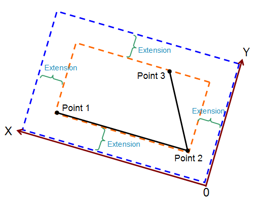

**Multiwfn FAQ**

文/Sobereva@[北京科音](http://www.keinsci.com/) 

First release: 2018-Dec-24   Last update:  2026-Mar-16

波函数分析程序Multiwfn（<http://sobereva.com/multiwfn>）如今已十分流行，本文针对用户常问的问题进行统一解答，也推荐所有Multiwfn用户完整阅读此文！此文会经常更新。本文分为四部分：(1)常识性问题 (2)安装、配置、运行问题 (3)一般使用问题 (4)和图像显示、绘图有关的问题。

## 1 常识性问题

Q1：Multiwfn是干什么的？有什么功能？  
A：量子化学程序计算之后会产生电子波函数。Multiwfn主要属于后处理程序，主要功能是对波函数进行分析，从而获得重要、丰富的对研究化学问题十分有益的信息，诸如成键强度和本质、电荷分布和电子转移的细节、分子间和分子内弱相互作用特征、电子的离域性和芳香性、电子激发的特征、体系对外场的响应、反应的优先位点和活性、分子的各种性质等等。Multiwfn也提供很多其它功能对于量子化学研究起到重要的实际帮助，例如绘制各类光谱、便利地产生输入文件、几何结构的操控和分析等。请仔细阅读《Multiwfn波函数分析程序的最新最全面的介绍文章已在JCP上发表！》（<http://sobereva.com/726>）里提到的文章，此文对截止到2024年8月的Multiwfn的特征和功能有极全面的介绍。也非常建议看《Multiwfn入门tips》（<http://sobereva.com/167>）里面给出的海量Multiwfn相关博文的列表，从这些文章标题就能看出Multiwfn的用途。

另外，在笔者的18碳环及衍生物的一系列研究中综合运用了大量Multiwfn的功能，是极好的实例，充分展现了Multiwfn的重要应用价值，十分建议阅读，研究工作汇总和大量相关博文见<http://sobereva.com/carbon_ring.html>。

**Q2：Multiwfn怎么引用？**  
A：使用Multiwfn发文章至少要引用Multiwfn程序的原文，这是Multiwfn的使用条款里明确声明的，Multiwfn程序一启动的时候屏幕上就赫然显示了其原文的引用方式，Multiwfn主页、手册里也明确说明了。**目前必须同时引用其两篇原文，即J. Comput. Chem., 33, 580-592 (2012)和J. Chem. Phys., 161, 082503 (2024)。如果甚至连这两篇原文都不肯正确引用，文章作者会被纳入黑名单并禁止在未来使用**。如果你用Multiwfn给别人代算，也必须告诉对方需要在文中进行引用。使用Multiwfn的不同功能、做不同分析，还另有不同的文章应当同时引用，参见Multiwfn可执行文件包中的How to cite Multiwfn.pdf文档的说明。笔者强烈希望用户都能按照此文档的说明以最恰当的方式引用Multiwfn及笔者的各种相关文章。Multiwfn不仅不收费，而且其开发还不拿纳税人一分钱、不被任何基金资助，恰当引用Multiwfn原文及笔者的相关文章是对Multiwfn持续开发和维护的最好的鼓励与支持！

顺带一提，Multiwfn中里有很多独家功能目前并未发表成为论文形式。在你的文中用到这些功能的话，除了要引用Multiwfn原文外，还应当引用Multiwfn手册里介绍相应功能的章节，格式为比如：  
Tian Lu, Section [章节号] of Multiwfn manual version [实际版本] (accessed 日月年） available at <http://sobereva.com/multiwfn>  
这里日月年是你下载Multiwfn手册的日期。具体格式可以按照期刊和编辑的要求修改，但应当能体现出如上信息。

Q3：求Multiwfn程序！求Multiwfn手册！  
A：求人不如求己。去官网<http://sobereva.com/multiwfn>的Download页面自行下载，不要钱，不需要注册。忘了官网地址时用Google搜Multiwfn，第一条就是（绝对别用百毒之流搜）。一般用户只需要下文件名末尾是bin的包，里面是可执行程序。manual这个词是手册的意思。

**Q4：Multiwfn怎么学？**  
A：Multiwfn的学习资源异常丰富，极少有计算化学程序有这么多、这么深入浅出的相关学习资源，也极少有程序手册写得像Multiwfn这般详细、贴心、易懂。而且Multiwfn本身也及其易用，没什么门槛。所以不要说什么“不会用Multiwfn”，不会用的前提一定是根本没有拿出哪怕几分钟时间去试图找相关的资料。

自学Multiwfn极其容易。首先务必读《Multiwfn入门tips》（<http://sobereva.com/167>）和《Multiwfn波函数分析程序的意义、功能与用途》（<http://sobereva.com/184>）以及本文，以了解Multiwfn相关的基本知识。然后针对自己要做的具体分析，在《Multiwfn入门tips》中的Multiwfn相关博文汇总里看有没有和自己做的分析直接对应的博文，或者看Multiwfn手册第四章提供的相应例子。Multiwfn手册第四章提供了上百个例子，所有Multiwfn比较常用的功能在里面都有示例。Multiwfn的所有功能的原理和程序实现在手册第三章相应章节也都有非常详细的介绍。要注意Multiwfn的功能极多，用法极其灵活，千变万化，一定要在博文和手册例子基础上充分举一反三。为了帮助一些理解能力差或者极度不情愿看文字学习的用户，笔者针对部分主题还专门录了一些简短的Multiwfn使用演示视频，汇总见<http://sobereva.com/video.html>。此外，强烈建议平时多去Multiwfn论坛看看，Multiwfn任何有关的新资源都会在那里发布，通过阅览其它用户的帖子也可以增进理论和程序使用水平。

特别建议参加笔者讲授的北京科音自然科学研究中心每年举办的“**量子化学波函数分析与Multiwfn程序培训班**”。波函数分析的理论、应用以及Multiwfn的详细使用都会非常全面、系统地介绍，可以一次性彻底学通、学透，而且每届培训都会充分体现波函数分析与Multiwfn的最新进展。培训是现场5天，视频1天，精心制作的幻灯片总量多达2400多页，海量知识可以学得一本满足！内容介绍和往届资料购买方式见<http://www.keinsci.com/workshop/WFN_content.html>，往届回顾见<http://bbs.keinsci.com/forum.php?mod=forumdisplay&fid=43&filter=typeid&typeid=247>，未来的培训时间安排见[http://www.keinsci.com](http://www.keinsci.com/)的首页预告栏。

Q5：有问题怎么求助？  
A：最佳的求助方式是在Multiwfn论坛发帖。在Multiwfn中文论坛<http://bbs.keinsci.com/wfn>发帖也行，在Multiwfn英文论坛<http://sobereva.com/wfnbbs>发帖也行，一般笔者会在一天内回复。如果你周围有外国Multiwfn用户，在他们遇到问题时，希望你能建议他们到Multiwfn英文论坛提问。如果你的问题实在很私密，迫不得已实在没法发到论坛上，也可以给Multiwfn开发者发邮件，邮件地址在Multiwfn启动时就显示了。不建议在任何其它地方咨询Multiwfn的问题，否则基本不可能获得Multiwfn开发者的回复。  
求助的时候注意尽可能把情况交代清楚、详细。问的问题表述含糊不清、没有提供对解决问题有效的信息的话，只会耽误获得有效解答的时间。

Q6：有没有使用Multiwfn做xxx分析的博文？以前看过xxx博文，找不到链接了怎么办？  
A：去《Multiwfn入门tips》（<http://sobereva.com/167>）给出的Multiwfn相关博文列表里找。在笔者的博客的索引页面<http://sobereva.com/list.html>里也可以直接通过相应词语试图搜索有无相关博文。  
并不是Multiwfn的各个功能笔者都写过相应的博文，博文绝对代替不了手册，二者目的不同。一些不是很值得专门写博文的内容笔者不会去写博文。没有找到相关博文的时候必须看手册，手册里绝对有每个功能的非常详细的介绍，大部分功能也都提供了例子。

Q7：有没有Multiwfn中文手册？  
A：Multiwfn是面向全世界用户的程序，自然手册是英文的，认真阅读《Multiwfn入门tips》（<http://sobereva.com/167>）后就不会再问这个问题了。Multiwfn手册内容极多（到Multiwfn 3.8版的时候都超过1100页了），更新非常频繁，开发者没精力同时维护英文和中文两个版本手册，更何况Multiwfn手册里根本没有各种复杂的形容词、副词、句式，比高考阅读理解题简单太多了。

Q8：有没有使用Multiwfn做xxx分析的文章可以给我作为例子？  
A：一个简单方法是用Google学术搜索搜，比如想找用Multiwfn做IGMH分析的文章，可以试图搜“Multiwfn IGMH”（尽管这样并不可能绝对完整搜出来所有用Multiwfn绘制DOS的文章）。另一个方法是下载《Multiwfn入门tips》（<http://sobereva.com/167>）里我给出的使用了Multiwfn发表的文章的pdf文件合集，然后用acrobat的对某个文件夹里的所有pdf文档进行全文搜索的功能进行搜索。注：由于Google学术给我推送的信息不完整，所以我提供的pdf合集里的文章数目远少于实际引用了Multiwfn的文章数。

**Q9：Multiwfn能支持什么程序？**  
A：Multiwfn的绝大部分分析功能都能支持几乎所有知名的基于Gaussian型基函数的量子化学程序，如Gaussian、ORCA、Molpro、NWChem、GAMESS-US、Dalton、PSI4、xtb、Q-Chem等等。有极少数分析只能支持Gaussian、ORCA等特定程序。第一性原理程序CP2K也是基于Gaussian型基函数描述波函数的，Multiwfn支持CP2K程序产生的.molden文件对周期性体系做波函数分析，但不是所有功能都支持，做法和详情参见Multiwfn手册2.9.2节。

Multiwfn目前没法对任何纯粹基于平面波的第一性原理程序比如Quantum ESPRESSO、CASTEP、VASP、Abinit等等产生的波函数进行分析。但有很多只需要几何坐标的分析，是可以基于这些程序优化出的结构来分析的，比如mIGM分析（<http://sobereva.com/755>）、Hirshfeld surface分析（<http://sobereva.com/701>）、EEM电荷计算、原子配位数计算、绘制表面距离投影图（<http://sobereva.com/589>）等等。

**Q9-2：Multiwfn能对周期性体系做波函数****分析么？**  
如果你要做周期性体系的波函数分析，有两种做法：  
(1)将晶体（体相或者晶体表面+吸附物）挖出个团簇，然后用量子化学程序当孤立体系计算得到波函数文件并用Multiwfn照常分析。注意此时不要讨论边缘部分的电子结构，因为由于边界效应，靠近簇的边缘的电子结构肯定是不真实的。分子晶体挖团簇的做法可参考《基于背景电荷计算分子在晶体环境中的吸收光谱》（<http://sobereva.com/579>），原子晶体挖团簇可参考《使用量子化学程序基于簇模型计算金属表面吸附问题》（<http://sobereva.com/540>），更多的需要注意的细节、对边界的处理等问题参见Multiwfn手册2.9.1节。  
(2)用CP2K做周期性计算并导出.molden文件，然后把晶胞参数信息写入.molden文件，然后就可以用Multiwfn观看轨道、做拓扑分析、计算各种实空间函数格点数据、绘制各种平面图、计算原子电荷和键级，等等，见比如《使用Multiwfn结合CP2K通过NCI和IGM方法图形化考察固体和表面的弱相互作用》（<http://sobereva.com/588>）、《使用CP2K结合Multiwfn对周期性体系模拟UV-Vis光谱和考察电子激发态》（<http://sobereva.com/634>）、《使用Multiwfn结合CP2K的波函数模拟周期性体系的隧道扫描显微镜（STM）图像》（<http://sobereva.com/671>）等等非常多文章，所有这些博文在http://sobereva.com博客右边CP2K分类里都可以找到。Multiwfn支持的海量功能中目前能完美地考虑周期性的，见Multiwfn手册2.9.2.2和2.9.2.3节的罗列。对于那些尚不明确声明支持周期性的功能，只有对距离盒子边缘足够远的区域做的分析的结果才是合理的。如果你想这么将就着分析，用CP2K计算时必须用较大的晶胞，使得被研究的区域与盒子边缘之间的缓冲区足够大，建议缓冲区不少于6埃（如果做个结果随缓冲区增大的收敛性测试更放心）。

Q10：Multiwfn支持Dmol3、ADF程序么？  
A：Multiwfn永远、绝对不会支持又贼贵又严重非主流的Dmol3和ADF！Multiwfn只支持高斯型基函数，这是所有主流量化程序用的基函数形式，而Dmol3和ADF分别利用数值型基组和STO型基组，注定不可能被Multiwfn支持，也极少有其它第三方波函数分析程序能支持这俩程序。VASP等基于平面波的程序也不被Multiwfn支持，本来就没有支持的必要，毕竟免费的CP2K做周期性体系的计算那么快速，结合Multiwfn创建输入文件那么方便，而且通过北京科音CP2K第一性原理计算培训班（<http://www.keinsci.com/workshop/KFP_content.html>）可以从零基础顺利上手，根本没必要用VASP。

**Q11：用Multiwfn做xxx分析应该用什么文件作为输入文件？怎样产生？**  
A：这点在《详谈Multiwfn支持的输入文件类型、产生方法以及相互转换》（<http://sobereva.com/379>）里解释得非常清楚。

Q12：目前的Multiwfn相比之前版本有哪些更新？  
A：看Multiwfn官网Update history页面。从1.0版到目前最新版本的所有更新都列在那了。

Q13：**Multiwfn相关博文里提及的一些选项怎么在我用的Multiwfn里没有？怎么结果和博文里的不同？怎么博文中提到的一些手册章节在手册里没有？**  
A：是因为你用的Multiwfn程序版本太老。在博文里通常会说明此博文用的Multiwfn版本，如果你用的版本是更老的，那很可能没有这个功能，或者结果、输出和博文里的不符。比如博文里说的是“本文用的是2018-Nov-20更新的3.6(dev)版”，那你如果用的是2018-Nov-20之前下载的3.6(dev)版就很可能情况和博文不符。Multiwfn程序刚启动的时候屏幕上会明确提示当前的版本是几几年几月几号更新的版本。Multiwfn手册也更新极度频繁，经常添加新章节，显然较新的博文提及的手册章节在老版本手册里可能没有，下载官网上最新的手册就完了。

Q13-2：我的Multiwfn是最新版的么？  
A：只要不是1天内下载的就绝对不要信誓旦旦地认为自己用的是最新的。Multiwfn程序的更新极度频繁，官网上Download页面里文件名带着(dev)后缀的版本是开发版(development version)，开发版经常一、两天就更新一次，最频繁时甚至可能一天内就更新两、三次。Multiwfn启动时明确在屏幕上显示了更新日期，去和Multiwfn官网上Download页面里的最新版上标注的last update日期对照便知是不是最新版。懒得对照就立刻去官网上下载一次覆盖原先的。我在回复Multiwfn的问题的时候始终假定对方用的是最新版，遇到不管什么Multiwfn的问题一律先尝试最新版，若仍有问题再问。

Q13-3：为什么我明明是刚下载的Multiwfn，程序启动时显示的更新日期却是老版本的？  
A：这是网络原因，不止一个用户曾反馈给我这种问题。我估计是有的网络服务运营商把Multiwfn老本程序缓存到他们服务器上了，导致用户下载的时候下载的是缓存的老版本。有三种解决办法：(1)用手机流量下载 (2)找个用其它网络的人下载然后传给你 (3)通过Multiwfn网站的Download页面中的MEGA网盘链接下载（如果你在大陆，需要特殊方式，你懂的）。还有一种可能是之前你下载的时候有的浏览器把老版本程序缓存到硬盘上了，应清空临时文件目录再试。

Q14：Multiwfn怎么念？  
A：见《Multiwfn程序名读法的统一说明》（<http://bbs.keinsci.com/thread-11011-1-1.html>）。

Q15-2：怎么避免错过Multiwfn更新？要是Multiwfn能自动更新就好啦！  
A：强烈建议用户按照此帖的方式自动接收Multiwfn的更新提醒：《推荐通过Visualping自动接收Multiwfn的更新提醒》（<http://bbs.keinsci.com/thread-12556-1-1.html>）。另外，有几位Multiwfn用户各自开发了方便的Multiwfn更新工具，懒得每次手动去Multiwfn官网下载新版本程序包的用户可以考虑使用，见：  
Multiwfn快乐更新小助手：<http://bbs.keinsci.com/thread-20052-1-1.html>  
mum: Multiwfn update manager：<http://bbs.keinsci.com/thread-20070-1-1.html>  
Updater for both Linux and Windows version of Multiwfn：<http://bbs.keinsci.com/thread-20109-1-1.html>  
A Python script for Multiwfn updates：<http://bbs.keinsci.com/thread-20115-1-1.html>  
Linux下利用cron实现对Multiwfn的自动定时更新：<http://bbs.keinsci.com/thread-36083-1-1.html>

Q15-3：运行Multiwfn需要什么计算机配置？需要买个较好的机子跑Multiwfn么？  
A：没法一概而论。Multiwfn里有的分析耗时极低，对大体系一眨眼也能算完，比如范德华势的计算（<http://sobereva.com/551>）。而有的分析耗时较高，比如对较大周期性体系做IRI分析图形化考察化学键和弱相互作用（<http://sobereva.com/598>）。只能说对于大多数分析，有个普通的个人电脑就够了。但如果你要做那些计算量很大的分析，尽量用CPU给力、核多的服务器，耗时会比用个人计算机低得多得多。Multiwfn对于高耗时的计算都做了充分的并行化。

## 2 安装、配置、运行问题

**Q15：Multiwfn怎么安装？**  
A：Windows版不用安装，解压后直接用。Linux下的安装方法在《Multiwfn在Linux下安装的中文说明》（<http://sobereva.com/688>）以及手册2.1.2节都写明了。Mac版安装方法看Multiwfn手册2.1.3节。

Q16：我用的Windows，双击Multiwfn.exe启动后是一个黑乎乎的窗口...我，我，我该怎么做？是不是中毒了？是不是进入黑客模式了？要在里面编程吗？  
A：莫慌！这叫命令行(command-line)窗口。Multiwfn不是纯图形界面程序（好处是又方便开发，又便于写脚本批处理，又不是必须依赖于图形环境才能使用），只有需要图形化展现数据的时候才会提供图形窗口。使用Multiwfn时总要睁大眼睛仔细看屏幕上每一个提示，接下来该干什么、有什么选项可以选、该以什么格式输入都提示得超级清楚，连输入例子都给了（e.g.后面的内容），无比贴心！绝对不要把屏幕上的英文当做人类无法阅读的乱码，那些提示信息的用词和语法比高考英语都容易，有个别不懂的用电子词典翻译即可，Multiwfn不可能做成中文界面的程序。Multiwfn手册和博文里的例子把每一步要敲的命令和每一步操作的含义都写得超级详细，不会操作时起码先照着例子敲一遍。

Q16b：怎么退出Multiwfn？  
A：按Ctrl+C可随时强制退出，也可以直接按窗口右上角的叉子按钮把窗口直接关了。如果处在主菜单，也可以输入q来优雅地退出。

Q17：计算时并行核数和内存怎么设？设多少合适？  
A：Multiwfn计算时并行的线程数通过settings.ini里的nthreads来设，建议等于当前机子CPU的物理核心数，这样速度最快。不懂啥叫物理核心和逻辑核心的话看《正确看待超线程(HT)技术对计算化学运算的影响》（<http://sobereva.com/392>）。如果你通过命令行方式执行Multiwfn，也可以通过-nt参数设置并行核数，此文说了：《详谈Multiwfn的命令行方式运行和批量运行的方法》（<http://sobereva.com/612>）。

Multiwfn没有一般意义上的内存使用上限设置，当前任务该需要多少内存就会试图用多少内存，如果机子内存不足（物理内存+虚拟内存的总和）就会崩溃；你若用的是32bit Windows版，Multiwfn至多只能用2GB内存，需要的内存量超过这个值时也必然崩溃。

在并行计算时需要考虑所谓的OpenMP stacksize内存设置。Multiwfn通过OpenMP方式进行并行计算，有些变量和数组是每个线程私有的，私有部分最多能利用多少内存取决于settings.ini里的ompstacksize设置，如果这个设得不够大的话也会崩溃。除非遇到OpenMP stacksize内存不足而报错，否则不需要改ompstacksize，改大了也不会令计算速度有任何提升。ompstacksize与nthreads的乘积绝对不能超过剩余物理内存量，内存实在不够的话可以索性将nthreads降低以令ompstacksize能够设大。

Q18：程序启动时出现找不到settings.ini的警告怎么办？  
A：Multiwfn每次启动时会试图载入settings.ini里的设置。Multiwfn首先在当前目录下寻找settings.ini，如果找不到，则会在Multiwfnpath环境变量设定的目录下找settings.ini，如果还找不到，则会使用默认设定（和settings.ini里的默认设置相同）。  
在Linux下启动Multiwfn时通常不是在Multiwfn目录下启动的，因此对于使用bash shell的用户，应当在用户主目录下的.bashrc中加入比如export Multiwfnpath=/sob/Multiwfn_3.6_bin_Linux，之后重新进入终端即生效。

Q19：Linux下启动Multiwfn时提示version `GLIBC_x.xx' not found报错  
A：这说明你的操作系统太老，系统里的GLIBC库的版本低于x.xx。这需要你装更新版本的Linux系统。网上也有直接升级操作系统的GLIBC库的方法可以尝试，但对于不很熟悉Linux的人有一定风险。你也可以自行在当前的机子上编译Multiwfn源代码，这样编译出来的肯定能在你机子上用。

Q20：怎么进入某些功能时提示Can't open X Windows display而自动退出？  
A：这说明Multiwfn此时试图显示图形，但你当前的环境是纯文本环境，因此没法显示出图形所致。如果你是通过一般方式的ssh登录远程服务器，或者你的Linux机子是在比如init 3模式下，那么Multiwfn所有涉及显示图形的功能都用不了。

Q21：Linux下运行出现Segmentation fault报错怎么解决？  
A：有以下可能原因：  
(1)没有严格按照手册2.1.2节的方式配置Linux。Ubuntu、Linux Mint等Linux系统的用户漏了设置ulimit -s unlimited这一步几乎一定会导致这种报错。  
(2)输入文件或者操作有问题  
(3)Multiwfn与你的操作系统有兼容性问题，或者是Multiwfn的bug。首先尝试Multiwfn最新版本，还不行的话尝试把nthreads设为1，即不用并行方式运行看能否解决。还不行的话尝试用其它Linux发行版运行试试，Multiwfn的Linux版测试都是在CentOS上进行的，对Redhat/CentOS支持是最理想的。也可以改用Windows版试试，或者在你的Linux机子下自行编译Multiwfn并运行试试。

**Q22：Windows下，在Multiwfn调用Gaussian计算时，提示“No executable for file l1.exe”错误**  
A：按照手册附录1说的，设置GAUSS_EXEDIR环境变量，将之指向Gaussian目录即可。

Q2_1：我想在远程Linux服务器上安装Multiwfn，但是按照手册里的说明安装motif库的时候，提示没有权限。  
A：找管理员装、或者借管理员的密码sudo装，或者用官网上可以下载的Multiwfn的noGUI版。此版本完全不依赖于图形库，所以运行前也不需要装motif库。但代价就是，这个版本丧失了所有与图形有关的功能，即不能显示图形、不能保存图像文件，而只有那些纯计算的功能可以用。

Q2023912：为什么Multiwfn出现不了图形窗口？  
A：可能你装的是noGUI版Multiwfn。如果你装的是标准版，但是你自行把settings.ini里的isilent设为了1，则需改回默认的0。还可能是你通过纯文本方式登录远程服务器运行的Multiwfn，此时注定无法显示图像。

Q2026316：安装新版本Multiwfn后还需要更换settings.ini么？  
A：Multiwfn出新版本时，settings.ini可能不变，也可能发生改变（比如里面添加新的参数、删除过时的参数、修改参数的默认值），因此强烈不建议新版本Multiwfn用旧版本Multiwfn自带的settings.ini！否则可能导致无法启动或结果异常。但一些用户装之前版本Multiwfn后已经对settings.ini做了不少修改，觉得对新版本Multiwfn自带的settings.ini重新改一遍较麻烦或者可能会漏掉之前做的一些修改，这种情况我建议用对比两个文件差异的程序或命令（如Ultraedit自带了两个文件对比功能，Linux下可以用对比文件的diff命令），由此快速识别新旧两个settings.ini的异同，然后要么对新的settings.ini进行修改，要么对旧的settings.ini里补充进新版本的settings.ini里的变化然后覆盖掉新版本的settings.ini。

## 3 一般使用问题

**Q23：为什么Windows下使用Multiwfn有时会闪退？为何Linux下使用Multiwfn有时会崩溃？**  
A：Windows下使用时遇到闪退是因为用户是通过双击Multiwfn图标启动的程序，当程序出错而崩溃时，运行窗口就会自动关闭，不明真相的用户总是形象地将这描述为“闪退”（笔者不喜欢这种称呼，客观地描述为“窗口突然关闭”多好）。如果你先进入操作系统的命令行模式再启动Multiwfn（在Windows下按住shift再点鼠标右键，就可以通过相应选项进入命令行模式），或者是在Linux下运行，即便程序崩溃也不会导致命令行窗口自动关闭，此时从窗口上显示的一些信息有助于了解是因为什么而出错（看不懂的话可以让开发者看）。

Multiwfn崩溃的常见原因有：  
1 用的输入文件类型不合理。应仔细看手册相关章节或相关博文里对输入文件要求的说明，别瞎猜着用。PS：对于计算机外行们，这里我顺带强调一下，绝对别让Windows隐藏文件扩展名（隐藏文件扩展名是Windows超超超级反人类的默认设定）！否则你往往都不知道那是什么格式的文件，文件载入错了Multiwfn自然会崩溃或者无法进行分析。如果正在阅读此文的你还在让Windows处于隐藏文件扩展名的状态，现在、马上、立即取消这**的设置！  
2 输入文件存在问题。常见情况有：  
(a)输入文件残缺不全。诸如文件没传完整，应自行用文本编辑器打开，看看最末尾的信息是否正常。如果是formchk转换出的fch，若转换还没结束就着急关了formchk显然也会导致得到的文件不完整  
(b)输入文件里有诡异信息。比如本该是记录数值的地方由于程序bug或计算设置不合理等原因输出的却是一堆星号，显然会无法读取  
(c)载入的文件内容的格式不符合要求。比如虽然molden输入文件是Multiwfn支持的，但有些不知名的程序产生的此文件可能格式不规矩，导致读取失败。再比如有些要载入的文件需要靠用户根据需要自行手写，如果写的格式不符合手册里的要求也可能导致读取失败而崩溃。  
3 在Multiwfn里的操作步骤不对。每一步操作都要仔细看屏幕上的提示。如果是新手应先把手册或博文里相关的例子完整重复一遍以确保操作方式正确。  
4 敲入的内容荒谬、不符合格式要求。诸如逗号误写成了全角的，提示该写空格的地方写的却是逗号，输入的原子、轨道等序号超过实际范围，该输入两个数值的地方输入了三个数值等等。Multiwfn在屏幕上的提示简直不能更贴心，所有让用户输入信息的地方都在提示中明确给了输入例子，严格按照提示中的格式写准没错。  
5 内存不足。如果用的是32bit Windows版，首先换成64bit Windows版再试。也可尝试加大settings.ini里的ompstacksize。如果是Linux版，若没有按照手册2.1.2节的过程安装，也可能由于可用的内存被严重限制住而导致这个问题。实在不行就把体系用的基组减小或想办法减少体系的原子数。  
6 Multiwfn让你输入导出的文件的路径时，你设成了C:\或C盘的某些敏感目录，在这些目录里往往因为操作系统权限设置或者安全防控程序设置原因无法创建新文件，从而导致文件输出失败而令Multiwfn崩溃。  
7 如果你做的分析依赖于NBO程序的输出文件，而且你的计算用了弥散函数，去掉弥散函数或者使用更新的NBO版本再试。因为有弥散函数时某些版本NBO输出的矩阵有问题，导致Multiwfn无法顺利载入。  
8 程序bug或兼容性问题。先尝试Multiwfn官网上的最新版本，如果通过反复测试能确认最新版本也有这个bug，把压缩后的输入文件、每一步敲入的命令、当前的操作系统版本发到Multiwfn官方论坛，笔者会很快回复。

**Q24：怎么把Multiwfn文本窗口里的数据拷出来？**  
A：仔细看手册5.4节。

**Q25：Multiwfn在窗口里输出的信息的靠前部分看不到，即便滚动条拉到头也看不全怎么办？**  
A：仔细看手册5.5节，加大窗口缓冲区即可。或者通过命令行方式运行，把输出信息都定向到指定的文件里。

Q26：载入文件时敲输入文件路径麻烦，有没有更简单的办法？  
A：看《将文件快速载入Multiwfn程序的几个技巧》（<http://sobereva.com/237>）。

Q27：Multiwfn里已经载入了一个文件，怎么载入一个新文件？  
A：一般建议重启Multiwfn，然后载入新文件，这样最稳妥。如果你不想重启，可以退回到程序主菜单，输入-11（是一个隐藏选项），就会看到Multiwfn刚启动的界面，然后就可以载入新文件了（这样做一般没问题。但如果之后发现分析结果异常，还是应当重启Multiwfn后再载入）。

Q28：导出的文件和图片产生到哪里了？我怎么找不到？  
A：如果程序允许你指定产生文件的路径，那肯定就在那个路径下。如果提示产生在了当前目录(current folder)，那就肯定在当前目录下。什么叫当前目录，在手册最开头，以及《将文件快速载入Multiwfn程序的几个技巧》（<http://sobereva.com/237>）中都写明了。

Q29：Multiwfn导出的文本文件（比如绘制光谱功能导出的spectrum_curve.txt）里每一列是什么含义？  
A：仔细看屏幕提示（若没看到就拉滚动条往上找），Multiwfn绝对、120%、一定会在导出文本数据的时候将文件里的每一列的含义提示得明明白白！！！

Q30：怎么通过命令行而非交互式方式运行Multiwfn？怎么把全部输出信息导出到文件里？  
A：看手册5.2节，使用silent方式运行Multiwfn即可。

**Q31：怎么让Multiwfn批量处理输入文件？**  
A：在Windows下写批处理脚本，在Linux下写shell脚本即可，非常简单。此问题在《详谈Multiwfn的命令行方式运行和批量运行的方法》（<http://sobereva.com/612>）里深入浅出介绍得超级详细，还顺便把脚本编写的各种常识都介绍了，非常建议一看！

Q32：Multiwfn相关博文和手册里经常提及的“实空间函数”(real space function)是什么意思？  
A：实空间函数(real space function)是指自变量是体系所处的实际三维空间坐标的函数，诸如电子密度、电子密度拉普拉斯函数、静电势、ELF等等都属于此类。Multiwfn的实空间函数分析功能极强，速度很快、支持的函数种类和分析方式非常全面，能算的绝大部分实空间函数在手册2.6、2.7节都介绍了。

Q33：输出数据是一堆星号，或者显示NaN是怎么回事？  
A：出现星号是由于数据太大，超过了预设的输出数据的格式所致。比如某个地方本来只能输出两位数，而实际数值是250，那么就会显示成星号了。NaN全称是not a number，也是非正常情况，比如可能是这个数据在运算过程中除以了0所致。有的时候出现星号、NaN是无害的，比如对一个阳离子做定量分子表面分析考察其分子表面上静电势特征，本来其表面上就没有静电势为负的区域，因此对静电势为负值部分计算的一些统计量可能就是这种无意义的输出，不用管它即可。但如果是本该输出有意义数据的情况却输出的是星号或者NaN，那要么是输入文件问题，要么是操作问题，要么是你对当前分析理解得有问题，要么是bug。

**Q34：分析、绘制静电势的时候速度太慢怎么办？**  
A：首先确保settings.ini里的nthreads已经设成了CPU的实际物理核心数，而且十几核及以上的情况改用Linux版。如果还慢，如果你计算的是静电势格点数据（用主功能5计算格点数据，或者主功能17盆分析过程中计算静电势格点数据），建议调用Gaussian自带的cubegen，看《Multiwfn现已可以调用cubegen使静电势分析耗时有飞跃式的下降！》（<http://sobereva.com/435>）或者手册5.7节；如果你算的不是静电势格点数据而是比如计算拟合静电势电荷、做分子表面静电势分析等，只能找个CPU更好的机子，或者用更小的基组或简化的模型。

Q35：什么级别产生波函数适合做波函数分析？  
A：波函数分析对基组的敏感性和分析方法有关。一般来说，波函数分析没必要特意用太高档次计算级别来产生波函数，因为大部分分析方法对于计算级别不是很敏感，用达到中等级别质量的波函数，比如B3LYP、M06-2X理论方法结合比如6-311G**、def-TZVP级别的基组，结果就已经足够好了，基组用到高档次3-zeta基组如def2-TZVP也就到头了。实际上，在DFT/6-31G*级别下的波函数分析结果一般也足够至少达到定性合理。因此用很高级别，比如CCSD/cc-pVQZ级别的波函数一般来说完全没必要，纯属浪费时间。理论方法一般用恰当的DFT泛函就够了，而用后HF方法产生波函数不仅很昂贵，而且一般也并不比用DFT波函数作分析有什么显著好处。

**Q36：波函数分析时能带弥散函数么？**  
A：看你用什么具体分析方法，绝对不能一概而论。那些直接依赖于基函数的分析通常都不能带弥散函数，否则结果没有任何意义。这主要是因为弥散函数的空间分布范围特别特别广，某原子的弥散函数会严重伸展到相邻的原子上去，这样的基函数的分布范围严重缺乏原子轨道的特征。明显这会在很多情况下导致问题，比如用Mulliken方法算轨道成份的时候，由于A原子的弥散函数严重伸展到B空间了，会导致本来应该归属到B原子的一些贡献量被误归属到了A原子。另外，对于这类直接依赖于基函数方法，用很大基组时的分析结果也未必比用中、小基组好，比如很大的4-zeta基组结果有可能还不如3-zeta基组好。不兼容弥散函数的方法有不少，比如Mulliken和SCPA分析（包括其对应的轨道成分分析、布居分析、PDOS绘制等）、Lowdin布居分析、Mulliken键级、Mayer键级、多中心键级（基于NAO的形式除外）、CDA分析等。凡是基于实空间函数或基于实空间的原子划分的各种分析，比如各种AIM框架下的分析、电子密度/ELF/LOL/静电势等实空间函数相关的分析和绘图、IRI/IGMH等弱相互作用图形化分析、拉普拉斯键级、ADCH电荷、Hirshfeld方法算轨道成份等等等等，一律都可以放心带弥散函数。如果搞不清楚的话，可以比较一下比如6-311++G*和6-311G*的差别，如果相差特别大而不是一星半点，一般就说明此方法不适合用于带弥散函数的情况。众所周知，算阴离子体系的能量的时候一般都需要带弥散函数，如果你要做的波函数分析怕弥散函数，也可以去掉弥散函数再算一次单点来产生不带弥散函数的波函数再做分析，但这时候用的基组应当不低于3-zeta档次。

Q37：溶剂效应怎么在波函数分析中体现？  
A：量子化学程序计算时用隐式溶剂模型即可。溶剂模型会使得溶质的波函数响应溶剂环境，因此溶质的波函数分析结果也将对应于被溶剂极化了的情况。

Q38：做某分析计算耗时高，怎么降低耗时？  
A：考虑以下做法  
(1)减小基组。但除非迫不得已不要低于6-31G*，否则定性正确难以保证。可以恰当使用混合基组，使得不是关键区域的原子用比关键区域更小的基组，甚至比6-31G*还小也不是不可以。  
(2)简化计算模型，比如把不重要的区域直接截掉（断键处该做饱和处理的时候要恰当处理）  
(3)在Multiwfn里用主功能6的选项-3或-4把不感兴趣区域的原子带的高斯型函数(GTF)删掉，这样对于之后的所有实空间函数的分析都会因此节约时间，因为Multiwfn里实空间函数都是基于GTF计算的。  
(4)恰当调节设定。有些设定恰当调节的话，可以显著节约时间而不至于令结果变差。比如你通过RDG图形化考察体系某个局部区域的弱相互作用时，可以把计算的盒子范围设成仅仅框住那个区域，此时达到同样显示效果的时候，就可以比起让盒子框住整个体系的时候用更少的格点数，从而节约时间。有时也可以在精度下降可以接受的情况下通过调节某些设定来降低耗时，比如模糊空间分析模块里对各个原子空间进行积分的任务，如果把settings.ini里控制每个原子的径向和角度部分格点数的radpot和sphpot改小，耗时显然就会降低，而精度也会下降。

**Q39：有些任务涉及三维空间中分布的格点，在出现的格点设定界面里应该怎么设合适？**  
A：Multiwfn里有很多任务是基于三维空间中均匀分布的格点来实现的，比如IRI和IGMH分析、盆分析、域分析、定量分子表面分析、空穴-电子分析、(超)极化率密度分析、ICSS分析等等。计算格点数据前首先会划定一个盒子范围，这些格点会按照特定的格点间距（grid spacing）均匀分布在这个盒子里，三个方向（对孤立体系一般用笛卡尔轴方向，对晶体用晶轴方向）各有一定格点数，乘积就是总格点数。显然，格点间距越小，分析结果就会越准确、显示的等值面会越光滑，但总格点数也会越多，导致计算耗时更高、占用内存更大、导出的cub文件占硬盘越大。因此设定格点有两方面因素要考虑：  
(1)格点的空间分布范围（盒子范围）：一般建议让盒子范围只框住感兴趣、被分析的区域。因为假设格点数目是固定的，盒子范围越小，盒子里的格点的间距就会越小，分析质量就会越高。如果假设格点间距是固定的，那么盒子范围越小，计算的格点数就会越少，耗时就会越低。因此只让盒子范围包围感兴趣的区域，而不让无关区域也纳入盒子范围，从哪个角度来说都是好事。怎么让盒子基本只覆盖感兴趣的区域，也确保不会有重要区域没有被纳入盒子，这需要根据你对分析方法和当前体系特征的理解来判断，没法一概而论，得具体问题、体系具体分析。Multiwfn的设定盒子的界面里提供了很多选项用来设置盒子范围，极度灵活，比如low/medium/high quality grid选项是根据体系的X,Y,Z方向的边缘原子的位置往各个方向加上延展距离（extension distance）来确定盒子范围的，用户可以用选项-10 Set extension distance of grid range...把默认延展距离修改为别的。界面里也有选项可以把两个原子间连线中点定义为盒子中心然后往各个方向加上延展距离来设置盒子（适合考察原子间相互作用区域），还可以直接在图形界面里可视化地挪动盒子和调节盒子尺寸，等等，定义盒子的方式非常丰富，选项的文字提示得极其明白。顺带一提，在Multiwfn观看等值面的图形界面里，可以选界面右侧的show data range复选框可视化查看当前的盒子范围。  
(2)格点间距或格点数。格点间距直接决定分析质量，而计算耗时正比于格点数。当盒子尺寸是确定的时候，显然格点间距越小则格点数越多，反之亦然。用户应当恰当设定格点间距或格点数达到分析结果质量和耗时的权衡。Multiwfn设定格点的界面里有low/medium/high quality grid选项，对于不同功能的含义是不同的，看屏幕上的具体提示，有时对应的是总格点数（如主功能5的情况），有时对应的是格点间距（如盆分析的情况，因为对格点间距敏感）。对于设置的是总格点数的时候，注意low/medium/high这三个词只是对于小体系而言的，如果是很大的体系，由于盒子大了，哪怕是medium quality grid格点数的格点间距也会很大，因此实际上得到的结果是很糙的，此时得用high quality grid或者，用允许手动输入格点间距的模式（例如4 Input the number of points or grid spacing in X,Y,Z, covering whole system）输入格点间距。  
总之，用户应当认真理解设定格点的界面的各个选项的含义，并根据实际情况选择适合的选项恰当地设置格点。还有不理解的话参考Multiwfn手册3.6节里的更多相关说明。

Q40：某些方法做布居分析、轨道成份分析时输出的诸如S、X、YZ、D0、D+1、D-1之类是什么意思？  
A：这是基函数符号。S就是S型基函数，X就是X型P角动量基函数，YZ就是YZ型D角动量基函数。D0、D+1之类是D角动量的球谐型高斯函数的符号。如果你不明白什么叫球谐型和笛卡尔型高斯函数，看《谈谈5d、6d型d壳层基函数与它们在Gaussian中的标识》（<http://sobereva.com/51>）和《球谐型与笛卡尔型Gaussian函数的转换关系》（<http://sobereva.com/97>）。如果你连基组的最基础知识，诸如基函数的角动量、壳层之类都不懂，那么很难正确理解这些输出，建议看《基组入门资料小合集》（<http://bbs.keinsci.com/thread-2190-1-1.html>）补补基础，或者参加北京科音举办的初级量子化学培训班。

**Q41：输出的结果是什么单位？**  
A：凡是没明确注明单位的，一律是原子单位（atomic unit，a.u.）。原子单位是一种单位制，不是一个具体的单位，对于不同的物理量的具体单位是不同的，比如对于电荷是e（e=elementary charge，基元电荷，即一个质子带的电荷量），对于距离是Bohr，对于电子密度是1/Bohr^3，对于静电势是Hartree/e，对于偶极矩是e*Bohr。如果你不清楚的话直接写a.u.就行了。原子单位的相关知识看<https://en.wikipedia.org/wiki/Atomic_units>。

Q42：Multiwfn给出的某种方法的分析结果为什么和其它某个程序给出的不一样，明明都是同一个输入文件？  
A：可能有以下原因：  
(1)其它程序对某个方法或者函数的定义与Multiwfn不同。比如NBO程序里计算Wiberg键级是以NAO为基计算的，而Multiwfn算Wiberg键级是基于对称正交化的基函数计算的。再比如AIM2000给出的电子密度拉普拉斯函数和一般定义不同，在前面多了个-1/4项。仔细看看手册就知道怎么回事。  
(2)利用的输入文件里的信息不一样。比如用.fch文件作为输入文件进行分析时，Multiwfn不利用其中的密度矩阵信息（极个别功能除外），而只利用.fch里的轨道信息，但有的程序利用的是.fch里的密度矩阵做波函数分析。如果.fch文件里的轨道信息和密度矩阵信息并不是对应同一个级别的，那么Multiwfn和那个程序的结果必然不同。  
(3)方法的具体实现不同。比如Multiwfn计算AIM电荷是基于均匀立方格点结合原子中心积分点算的，而AIMALL等程序里是其它实现方式。这通常不会造成定性的差异，但可能会造成可察觉的数值差异。

**Q43：用Multiwfn做拓扑分析，怎么得到某个临界点上的各种函数值？**  
A：笔者很纳闷为什么经常有用户问这个问题，在《使用Multiwfn做拓扑分析以及计算孤对电子角度》（<http://sobereva.com/108>）和手册4.2节的拓扑分析的例子里都充分体现了这一点，而且拓扑分析界面里也提示的非常清楚，显然是这个选项：7 Show real space function values at specific CP or all CPs。

**Q44：怎么产生cube文件？**  
A：cube文件是个容器格式，可以记录各种各样的实空间函数在某个空间范围内均匀分布的格点上的数值，介绍见《Gaussian型cube文件简介及读、写方法和简单应用》（<http://sobereva.com/125>）。所以问这个问题时你先得明确你到底要计算什么实空间函数。Multiwfn可以计算上百种实空间函数，手册2.6、2.7节都有介绍。要产生这些函数的cube文件，在载入输入文件后，进入主功能5，按照提示选择被计算的函数、设定格点即可，算完之后在后处理菜单中选2 Export data to Gaussian cube file in current folder即可导出成.cub文件。完整的例子见手册4.5.1节。

顺带一提，Gaussian自带的cubegen工具也可以产生特定实空间函数的cube文件，然而支持的实空间函数种类不到Multiwfn的1/10，而且速度慢得多（尤其是多核机子上），设定格点也远远没有Multiwfn方便，还得记忆使用命令，机子里还得装Gaussian，因此没有什么使用价值。cubegen唯一有用的地方也就是计算静电势很快，通过Multiwfn主功能5调用cubegen计算静电势cube文件比直接用cubegen明显更方便。

**Q45：怎么考察/计算/分析电子密度？**  
A：看《谈谈怎么考察、计算、分析化学体系的电子密度》（<http://sobereva.com/715>）。

Q46：做键级分析，有些数值很小的键级没显示怎么办？  
A：那些非常小的键级是可以忽略的，如果非要获得，可以根据提示让Multiwfn导出键级矩阵文件，读取对应的非对角元即可。也可以修改settings.ini里控制键级输出阈值的bndordthres，将之设小。

Q47：Mayer键级、多中心键级怎么有时候算出来是负的？  
A：首先必须确保没用弥散函数，否则结果一定没意义。如果没用弥散函数，Mayer键级有微小的负值的话，直接当成0就行了，微小负值并没有什么物理意义，是方法本身不足导致的。多中心键级也是如此。但如果算三中心键级的时候出现显著而不是微小的负值，则暗示存在三中心四电子(3c-4e)作用。可以再结合Multiwfn里的轨道定域化分析或者AdNDP分析进一步考察。

Q48：电荷分解分析（CDA）模块里绘制的轨道相互作用图里面连线非常混乱，密密麻麻，怎么办？  
A：恰当设置作图参数，总能调得清楚好看。见《使用Multiwfn做电荷分解分析(CDA)、绘制轨道相互作用图》（<http://sobereva.com/166>）末尾的幻灯片的讲解。

Q49：我使用Multiwfn做RDG（也叫NCI）分析过程中遇到xxx问题...  
A：仔细看本文，以及笔者专门写的《用Multiwfn+VMD做RDG分析时的一些要点和常见问题》（<http://sobereva.com/291>）。

Q50：Multiwfn做静电势的定量分子表面分析给出的极大点的数值怎么有的是负的？极小点的数值怎么有的是正的？  
A：这完全没有矛盾。极大点是指这个点的数值比周围位置数值大，是相对而言的，但不代表其绝对数值非得是正的。如果体系是中性的，一般来说，数值为负的分子表面静电势极大点没有太大实际意义，可以在后处理界面里使用根据数值范围删除极值点的功能将之删掉。对于极小点也是类似的理。

**Q51：怎么用Multiwfn做AIM分析？**  
A：AIM分析是一套理论，其中牵扯各种各样的、各种各样的分析方法，介绍看《AIM学习资料和重要文献合集》（<http://bbs.keinsci.com/thread-362-1-1.html>）。AIM中主要涉及的分析包括  
(1)对电子密度、电子密度拉普拉斯函数、动能密度、势能密度等实空间函数绘图。AIM里涉及到的所有实空间函数都可以用Multiwfn主功能3、4、5分别绘制曲线图、平面图、等值面图来考察，分别看手册4.3、4.4、4.5节的例子。  
(2)电子密度的拓扑分析，包括寻找临界点位置、考察临界点上的函数值、生成键径、产生盆间面。这可以通过Multiwfn主功能2实现。看手册4.2节的例子以及《使用Multiwfn做拓扑分析以及计算孤对电子角度》（<http://sobereva.com/108>）、《使用Multiwfn+VMD快速地绘制高质量AIM拓扑分析图》（<http://sobereva.com/445>）。  
(3)对电子密度做盆分析，包括计算AIM电荷、计算原子多极矩、实空间函数积分值等。这可以通过Multiwfn主功能17实现。看手册4.17.1节的例子，以及《使用Multiwfn做电子密度、ELF、静电势、密度差等函数的盆分析》（<http://sobereva.com/179>）。

Q53：用拓扑分析功能时，某些临界点找不到怎么办？提示Poincare-Hopf关系不满足怎么办？  
A：对某些临界点缺失的情况，首先尝试不同搜索临界点的方法、调节搜索临界点的参数，仔细阅读《使用Multiwfn做拓扑分析以及计算孤对电子角度》（<http://sobereva.com/108>），其中写得很详细。  
另外，也有可能根本不存在那个临界点，对于电子密度的临界点怎么判断这点看《利用约化密度梯度考察AIM临界点的位置》（<http://sobereva.com/267>）。  
对于ELF等函数分布特征复杂的函数即便极大点也可能不容易找全，如果你感兴趣的只是极大点，那么也可以用主功能17做盆分析，一般可以确保把所有极大点（在盆分析语言里叫吸引子）都找到，但是位置不太精确（格点间距越小越精确），因此可以将其坐标输入到拓扑分析主功能里的选项1里面作为找临界点的初猜坐标从而得到极大点的更精确的位置。  
实际上，只要自己感兴趣的临界点都找到了，即便还有某些临界点没有找到，并且由此可能导致提示Poincare-Hopf关系不满足，也根本无所谓，完全不妨碍你感兴趣的临界点的考察。特别是ELF等特征复杂的函数，哪怕对于小体系，找全所有临界点都是很困难的。

Q52：我已有一个格点数据文件（比如cube文件），怎么用Multiwfn计算各个原子对其中记录的函数的贡献？  
A：把settings.ini里的iuserfunc设为-1，此时用户自定义函数（user-defined function）将对应于基于内存中的格点数据线性插值产生的函数。然后启动Multiwfn，载入此格点数据文件，进入模糊空间分析模块（主功能15），选择1，然后选择user-defined function，程序就会对这个函数在各个原子空间内进行积分，结果就相当于原子对这个函数在全空间内的总值的贡献量。另外，主功能15里还可以选-5来定义片段，这样可以直接得到某个片段对被积函数的贡献。这种用法的一个实际例子见《使用Multiwfn计算（超）极化率密度》（<http://sobereva.com/305>）的第7节。默认情况下，主功能15用的是Becke方式定义的模糊原子空间，也可以用相应选项改为比如Hirshfeld、Hirshfeld-I之类。Multiwfn也可以实现在AIM方法定义的原子盆里对函数进行积分来得到原子的贡献，但这种划分比较昂贵，化学意义也不强，这里就不多提了。

## 4 图像显示、绘图方面的问题

这一节第一部分是综合性问题，第二部分专门针对很多人常问的绘制平面图的功能进行解答。

### 4.1 综合性问题

Q53：Multiwfn的图形界面的窗口太小，怎么弄大一些？  
A：从Multiwfn 3.6正式版开始，settings.ini里加入了plotwinsize3D选项，将其数值设得比默认值更大（更小）就可以加大（缩小）各个图形界面里显示三维物体的区域的尺寸，可以反复尝试选择一个对于当前运行环境最佳的值。

Q54：Multiwfn的图形界面尺寸太大，屏幕显示不下怎么办？  
A：有几种做法：  
(1)对于Windows，在“控制面板”-“显示”（或其它的控制操作系统的文本大小的界面）里面把文本尺寸改小，这需要重新登录系统  
(2)尝试把plotwinsize3D选项数值改小点  
(3)对于Windows版，如果只是主功能0的界面没法显示不完整，把settings.ini里的imodlayout设为1从而换成另一种布局再试  
(4)如果是在讲课时通过投影演示Multiwfn，由于一般用的是比较低的1024*768分辨率，除非用小字号，否则窗口几乎总是显示不全。如果你不想改系统设置，可以把imodlayout设为2，此时起码对于Win7中等字号设置的情况显示效果很理想。

Q55：显示三维物体的窗口能不能通过鼠标拖动来调节视角？  
A：目前的Multiwfn支持用鼠标拖动便利地调节视角，详见<http://bbs.keinsci.com/thread-53146-1-1.html>。另外，点Multiwfn图形窗口上方的Set perspective并选择相应选项，还可以手动输入确切的旋转角或距离值。此外，还可以借助免费的VMD程序来显示，显示大体系或格点数很多的等值面更快，而且图像显示质量往往更好、可调选项更丰富。Multiwfn的很多分析、计算结果都可以非常容易地导出并搞到VMD里显示出来。有些效果，如填色的等值面图，则必须通过VMD才能展现。笔者写过大量相关文章，比如《使用Multiwfn+VMD快速绘制高质量分子轨道等值面图》（<http://sobereva.com/447>）、《使用Multiwfn+VMD快速地绘制高质量AIM拓扑分析图》（<http://sobereva.com/445>）、《使用Multiwfn+VMD快速地绘制静电势着色的分子范德华表面图和分子间穿透图》（<http://sobereva.com/443>）、《基于Multiwfn产生的cube文件在VMD和GaussView中绘制填色等值面图的方法》（<http://sobereva.com/402>）、《使用Multiwfn+VMD以原子着色方式表现原子电荷、自旋布居、电荷转移、简缩福井函数》（<http://sobereva.com/425>）等等。

Q56：怎么设置保存出来的图像格式？  
A：看手册2.8节。顺带一提，如果绘制的图像是由文字、线条构成的，建议使用pdf（或svg、eps、wmf）格式，这样的图像是矢量图，可以无损缩放，而且线条显得非常平滑，文件也很小。默认的png格式是目前最佳的无损压缩的位图格式，适合含有复杂色彩、色彩平滑变化的图。

Q57：怎么设置保存出来的图像的像素？（有些人管这叫分辨率）  
A：如手册2.8节所说，settings.ini里graph1Dsize控制曲线图的图像文件的像素，graph2Dsize控制平面图的图像文件的像素，graph3Dsize控制三维物体的图像文件的像素。

Q58：图像线条锯齿严重，怎么让图像有抗锯齿效果？  
A：可以通过调节上述设置让保存出的图像的像素比较大，然后用Irfanview（免费小巧的极好的图像观看程序）、Photoshop等程序把图像尺寸缩小。在缩小的时候，程序会通过Lanczos、B-spline等算法重新采样，之后看到的图像就没有什么锯齿了，这是一种经典的抗锯齿方式。另外，对于以文字、线条为主的图，笔者强烈建议使用pdf、svg之类矢量图像格式，得到的图完全不会看到有锯齿现象（如果之后需要像素格式的图，可以把矢量图显示出来后再截图，或者直接转换成矢量格式）。凡是你对图像质量要求较高的时候，都不建议直接从屏幕上截图，因为屏幕上显示出来的图没有抗锯齿效果，特别是Linux系统下Multiwfn直接显示出来的三维图形可能锯齿非常明显。

Q59：图像上的字体能改么？  
A：用pdf时默认的字体最好看，因此对于色彩不是平滑变化的图强烈推荐用pdf。对于其它图像格式，对于Windows版，可以用settings.ini里的ttfontfile设置指定字体文件，具体看注释。也可以自己ps。

Q60：怎么有时刻度标签上相邻刻度的数值是相同的？比如都是0.01、0.01？  
A：这是因为刻度数值的位数太少，而这些刻度数值相差又很小，导致四舍五入后看起来相同。对于曲线图，可以修改settings.ini里的numdiglinexy来增加显示的位数；对于平面图，可以修改numdigxyz。

Q61：Multiwfn保存出的图像的线条/文字太细，怎么加粗？  
A：仔细看界面上的各个选项，如果界面里直接提供了设置线条粗细的选项，直接修改即可，如果改不了的话，或者是嫌文字太细，按照《加粗Multiwfn保存的图像的坐标轴和标签文字的方法》（<https://www.bilibili.com/video/av26311992/>）的方法通过ps加粗。

**Q62：Multiwfn算出来的格点数据怎么在VMD里绘制成等值面图？**  
A：参考此视频的演示：《使用Multiwfn结合VMD绘制自旋密度等值面图》（<https://www.bilibili.com/video/av26312131>）。

Q63：观看等值面（isosurface）的时候，等值面数值（isovalue）设多大合适？  
A：首先要知道，等值面是一种常用的展现三维函数在整个空间中分布特征的方式。等值面上每一个点的数值都和你设的isovalue值相同，通过等值面图的轮廓可以定性考察函数在不同空间位置的大小。isovalue的设定往往是有很强任意性的，没有唯一标准，不同isovalue下看到的等值面图像也是不同的。一般选取标准是让所得到的等值面图能较好展现不同区域函数大小的差异、能把你想主要表现的体系特征充分展现出来，同时图像美观便于理解。可以在Multiwfn里不断调节等值面数值直到满意为止。有时候可能单一isovalue下的图注定没法全面满足要求，此时可以同时给出多个isovalue下的等值面图，在极其灵活的VMD里还允许在一张图里同时显示多个等值面，比如《通过Multiwfn绘制等化学屏蔽表面(ICSS)研究芳香性》（<http://sobereva.com/216>）第7节的图。

Q64：Multiwfn里显示的等值面中的绿色和蓝色代表什么？  
A：绿色等值面上的每个点与你设的isovalue值相同，蓝色等值面上的每个点与你设的isovalue值符号相反。至于具体代表什么物理含义，那得看你考察的是什么函数，isovalue是怎么设的。对于专用于观看轨道等值面的主功能0，isovalue只能设为正值，因此绿色和蓝色的等值面必然分别对应的是轨道波函数的正相位和负相位的等值面。

Q84：绘制三维结构时，怎么修改原子和键的颜色？  
A：如果想修改默认的键的颜色，调节settings.ini里的bondRGB参数。要设定的是红(R)、绿(G)、蓝(B)的分量，分量范围从0到1。比如黑色对应0,0,0，白色对应1,1,1，亮绿色对应0.0,1.0,0.0，暗红色对应0.3,0.0,0.0。如果想调节原子球的颜色，需要设定settings.ini里的atmcolorfile。比如atmcolorfile= C:\asuka\color.txt代表从C:\asuka\color.txt文件中读取原子的色彩设定，此文件需包括每个元素色彩的红、绿、蓝分量。建议大家直接基于examples目录下的模板文件element_color.txt来修改，想调节哪个元素的颜色就修改哪个元素即可，其它的不用动。

Q85：图形窗口里显示的键和期望的成键关系不符怎么办？  
A：Multiwfn默认是根据原子半径和原子间距离判断成键的，距离小于两个原子半径之和乘上一个因子就会被视为成键，这个因子可以通过图形界面右侧的Bonding threshold滑条进行修改。如果Multiwfn载入的是mol和mol2这种自带成键关系的格式，图形窗口里默认显示的成键方式与文件里记录的相一致。

如果你用的输入文件不是mol或mol2，而且发现Bonding threshold怎么改也改不成所有键的显示方式都满意的状态，可以选择图形窗口的菜单栏里Other settings - Load bonding connectivity from mol/mol2 file，然后输入一个mol或mol2文件路径，Multiwfn就会把成键方式显示得与你提供的这个文件里记录的连接关系相一致。你可以在比如GaussView里把成键关系调好，然后保存成mol2，然后令Multiwfn读取。

Q86：VMD基于Multiwfn计算的格点数据绘制的填色等值面图怎么是黑色的？  
A：注意这些问题  
(1)可能是某些VMD版本有bug，确保用的是VMD 1.9.3  
(2)可能是你的GPU驱动与VMD兼容性问题，更新GPU驱动或者换个机子再试  
(3)如果你用的是32bit的VMD，由于其内存可用量最多只有2GB，当cub文件很大时，可能无法正常载入，导致无法对等值面着色。用64bit VMD再试，可以在这里下载第三方编译的VMD 1.9.3 64bit：<http://bbs.keinsci.com/thread-23119-1-1.html>

### 4.2 与主功能4绘制的平面图有关的问题

笔者借此机会强烈建议打算用Multiwfn绘制平面图的用户都认真仔细照着手册4.4节一大批绘制平面图的例子操作一遍，努力领会每一步操作的含义，把这些例子都搞明白了就可以少问很多初级问题，同时掌握很多技巧。

Q65：绘制平面图时绘制体系的哪个截面合适？  
A：平面图是展现三维函数在体系某个截面上的分布的方式。平面图的缺点是没法像等值面图一样把函数在整个三维空间中的分布特点通过一张图大体体现出来，但优点是可以最完整地展现某个截面上的函数变化特征。只有当你对体系某个截面上的函数变化特征感兴趣、由此可以帮助你讨论问题的时候，才适合绘制平面图来将之充分展现。比如你想通过ELF函数考察水分子中的O-H键，那就很适合绘制水分子平面的平面图，这个平面正好穿过两个O-H键键轴，因此可以很充分地体现出O-H键的内在特点。再比如，你想作图考察苯酚pi电子分布特征，那你可以在苯酚子上方比如1埃的位置，绘制平行于苯分子的电子密度的平面图（这个1埃是随意取的，差不多能大致穿过pi电子分布的主体区域）。笔者有大量博文，手册里也有大量例子，都充分体现出利用平面图可以充分讨论很多问题。如果你的体系结构特征复杂，很难恰当选取一个或几个截面充分展现体系电子结构特点怎么办？那就别绘制平面图了呗，绘制等值面图啊。

Q66：怎么设定作图区域？  
A：平面图在绘制之前，需要划定一个作图区域（plotting region），即体系的某个截面上的一个确切的区域。在这个区域里均匀分布指定数目的格点，函数值就是在这些位置上计算的。在绘制平面图的过程中，你会看到Multiwfn里提供了丰富、灵活的选项来定义作图区域，各个模式在手册3.5.2节解释得非常清楚。其中有两类定义方式最为常用：  
(1)绘制某个笛卡尔平面：即绘制XY或YZ或XZ平面。假设你选的是绘制YZ平面，由于YZ平面有无数个，每个对应不同的X值，因此程序还会让你输入X值。程序会根据体系Y和Z坐标最大、最小的原子的位置划定实际作图区域，并往四周延展指定距离（称为“extension distance”，延展距离），免得绘制出的图的边缘正好卡着边缘原子的原子核位置，造成感兴趣的区域被截断。  
(2)通过三个点定义一个平面：中学都学过，三点定义一个面。你可以手动输入三个点的坐标，也可以通过输入三个原子序号通过它们的原子核位置来定义一个面。实际的作图区域按照下图示意的方式来确定

上图中，extension就是延展距离，X和Y轴就是绘制出的图像的横轴和纵轴，实际的作图区域是蓝色虚线框住的范围。可见，三个点（或原子）的选择，以及三个点（或原子）输入的顺序，不仅影响作图区域的大小，也影响图像的朝向。用户应当根据实际情况恰当设定以得到满意的结果。

**Q67：感兴趣的区域在图上显示不全怎么办？**  
A：作图区域是怎么确定的，在上面已经解释得很清楚了。显然，加大延展距离就可以让作图区域变得更大，让原本没显示出来的地方也可以被纳入到作图区域中。设定延展距离的选项就是定义作图区域那一步里的选项0: Set extension distance for plane type 1~5。当你通过三个点（或原子）定义作图平面时，如果选择的点很不合理，那么即便加大延展距离也不会有好的效果，可能导致真正感兴趣的区域又歪斜又严重偏离中心位置。

Q68：绘制出来的平面图里面的内容是歪着的，或者感兴趣的区域不在图像的中央，怎么解决？  
A：一种做法是在定义作图平面的时候恰当定义，结合上文的示意图，恰当选择三个原子或者输入三个恰当的点。还一种做法是先尝试绘制一次，记录下歪斜的角度和偏离中心的程度，然后在重新绘制的时候在定义作图平面时设定旋转角和平移量，详见此贴的示例：<http://bbs.keinsci.com/thread-11037-1-1.html>。如果你并不需要坐标轴的话，最简单的方法是通过ps等程序直接把图像中需要的部分抠出来，然后旋转一下就完了。

**Q69：绘制的平面图里面有些原子的标签没显示出来是怎么回事？**  
A：只有当某个原子与作图平面的垂直距离小于特定阈值时，这个原子在这个平面上的投影位置才会显示出原子标签（倘若没有这个阈值设置，所有原子标签都显示出来，对于大体系，图上的标签将何等混乱可想而知）。没显示出来标签的那些原子显然是因为其距离作图平面超过了默认阈值。阈值可以在后处理界面通过选项17 Set distance threshold for showing atom labels进行修改。阈值设定之后，你还可以选择是否把超过这个阈值的原子用比较细的字体显示出表现，以区别那些离作图平面比较近的原子。这个选项的默认值通过settings.ini里的disshowlabel参数控制。

Q70：等值线图里面怎么标注等值线数值？标注的数值不好看怎么办？  
A：后处理菜单中选2 Enable showing isovalue on contour lines然后重新作图。程序自动会在曲率比较小的线条上标注等值线数值，可能标的位置不太合期望，而且可能有人嫌字号、字体不理想，这没办法，毕竟计算机程序没有人的审美。你可以参考着自动标注的等值线数值，自行用ps之类工具把等值线数值以你觉得最美观的方式标上去，比如笔者J.Mol.Model.,19,5387(2013)这篇文章里的图3就是这么做的。

Q71：等值线图怎么设置等值线数值和线条颜色、粗细、风格？  
A：用后处理菜单中的选择3 Change setting of contour lines进入等值线设定界面，其中各个选项的含义一看选项上的文字就能秒懂，在手册3.5.4节还有详细解释。线条粗细和风格可能在屏幕上直接显示的时候体现不出来，但在保存的图像中肯定会体现出来。

Q72：怎么在填色图上把等值线也同时显示上去？  
A：照常绘制填色图，然后在后处理菜单中把显示等值线的选项打开。

Q73：平面图里的横、纵坐标单位怎么改为埃？  
A：后处理菜单里选择-8 Change length unit of the graph to Angstrom。

Q74：填色图里为什么有的区域是白色、黑色的，代表什么？  
A：在默认的色彩过渡方式下，白色代表函数数值高于色彩刻度上限的区域，黑色代表低于色彩刻度下限的区域。如果你不喜欢这个处理，希望低于（高于）色彩刻度下限的区域就是用下限（上限）颜色表示，可以在主功能4的后处理菜单中的Set color transition选项里选择“1 Rainbow”。

Q75：填色图、着色等值面图的色彩刻度上下限怎么设合适？  
A：一般来说，色彩刻度（color scale）的上下限的设定的主要原则是能够通过色彩的不同，使得图中不同区域函数值的差异能充分展现出来，而且从审美上比较漂亮。色彩刻度范围若设得太宽，不同区域的颜色差异往往体现得不够显著；刻度范围若设得太窄，函数值超过刻度范围的区域就完全没法体现出差异。因此刻度范围必须择情而定，需要反复尝试找到尽可能理想的。

Q76：填色图/着色地形图里色彩刻度的颜色过渡方式能改么？  
A：可以。主功能4绘制填色平面图或者着色地形图的后处理菜单中有Set color transition选项，可以修改色彩过渡方式，Multiwfn内置了非常多的色彩刻度方式，可以多试试，总有一个适合你。在一些绘制填色矩阵图的界面里也可以看到这个选项。另外，也可以在后处理菜单中让Multiwfn把平面图的数据导出为plane.txt，然后载入sigmaplot、surfer、Origin、matlab等程序再绘制填色图，届时作图设定更丰富，也有很多色彩过渡方式可供选择。

Q77：我把平面图的平面数据导出成plane.txt之后，想用sigmaplot之类的第三方程序绘制，用哪几列数据绘制？  
A：导出文件的时候仔细看屏幕上的提示，根据实际情况判断。比如你绘制的是YZ平面，程序会提示The column 1,2,3,4 correspond to X,Y,Z and function value, respectively，显然在第三方程序里绘制时，横轴和纵轴分别应当用第2、3列的数据，而函数值对应第4列。  
再比如你通过三个原子定义作图平面，导出数据时Multiwfn会提示你  
The column 1,2,3 correspond to Cartesian X,Y,Z coordinates, respectively  
The column 4,5,6 correspond to X,Y coordinates in the graph and function value, respectively  
显然，应该将4、5、6列的数据分别作为横轴、纵轴和函数值，而对应于格点在实际三维空间中的X,Y,Z坐标的1、2、3列当前用不着。

Q78：填色图的色彩刻度条的标签间隔怎么改？  
A：后处理界面里有选项-2 Set stepsize in X,Y,Z axes进行设置，其中的Z轴就是指色彩刻度轴。

Q79：图上的原子标签能改成显示原子序号么？字号、字体能改么？  
A：后处理菜单中选择18 Change style of atomic labels可以修改显示方式，可以选择只显示序号、只显示元素、元素和序号同时显示，默认设置可以通过settings.ini里的iatmlabtype来设。标签字号可以通过settings.ini里的pleatmlabsize来设。字体问题看Q59。

Q80：绘制出来的平面图怎么和分子结构图合并到一起便于观看？怎么把键显示在平面图上？  
A：看《将分子结构图和Multiwfn绘制的平面图准确合并的方法》（<http://sobereva.com/274>）。另外，Multiwfn在后处理界面也提供了选项8 Enable showing bonds可以将化学键（根据距离判断）用直线显示出来，这样也可以使得体系结构在平面图上体现得更清楚。但哪怕两个原子被判断为成键，如果其中任何一个距离当前定义的作图平面距离超过阈值（怎么设阈值看本文Q69），则这个键将不会显示在图上。

Q81：平面图的横、纵坐标对应什么？  
A：当你绘制的是某个笛卡尔平面时，比如你当前选的是YZ平面，那么图上的横轴、纵轴坐标就分别是平面图上数据点在三维空间中的Y、Z轴坐标。如果你是通过其它方式定义的作图平面，那么横、纵坐标仅仅体现的是距离作图平面起点位置的相对坐标，只反映相对空间关系，和三维空间中的X,Y,Z坐标没有直接联系。

Q82：怎么把AIM分析中的临界点、键径、盆之间的分界面显示在平面图上？  
A：先用主功能2做AIM拓扑分析，然后退回主菜单，再照常绘制平面图，凡是与作图平面垂直距离小于阈值的临界点、组成键径的点都会直接显示在图上，这个阈值以及其它相关设定可以在后处理菜单中的4 Set details of plotting critical points and paths选项中设置。另外，在后处理菜单中有选项可以在图上生成和绘制盆之间的分界面。详见手册4.4.6节的例子。

Q83：怎么用Multiwfn基于格点数据文件绘制曲线图、平面图？  
A：把settings.ini里的iuserfunc设为-1，此时用户自定义函数（user-defined function）将对应于基于内存中的格点数据线性插值产生的函数。然后启动Multiwfn，载入此格点数据文件，进入绘制曲线图或平面图的功能（主功能3、4），被绘制的函数选择user-defined function即可。如果iuserfunc设为-3，则使用B-spline插值，所得图像会更为光滑，但个别情况可能会有一些虚假现象，比如本身是尖峰的位置变成了顶端光滑的峰（尽管曲率很大）。
