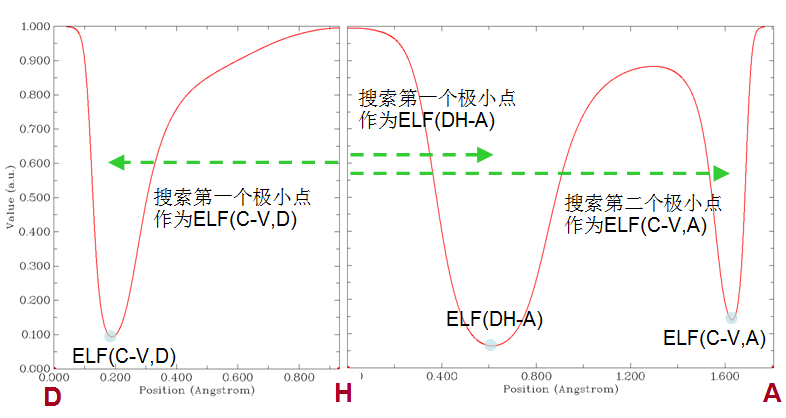
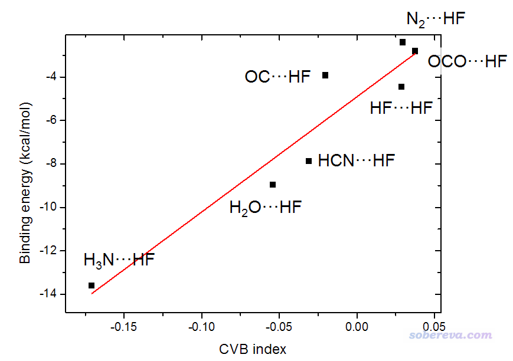
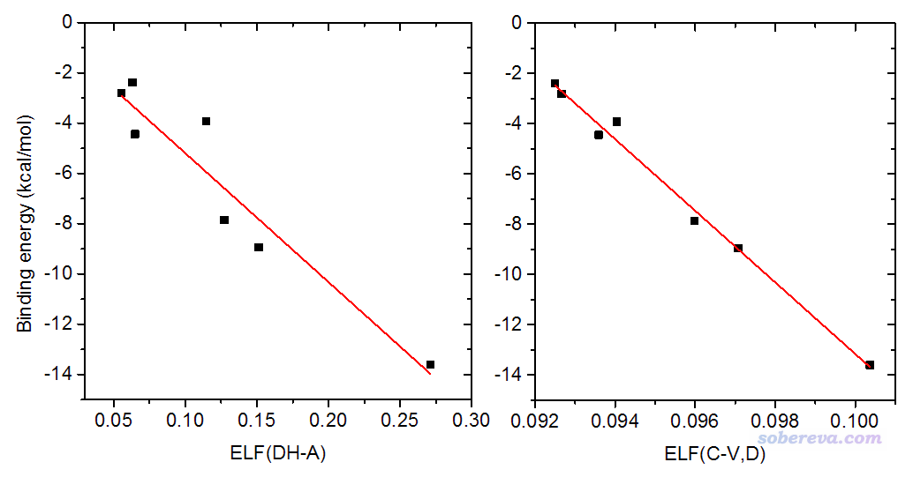
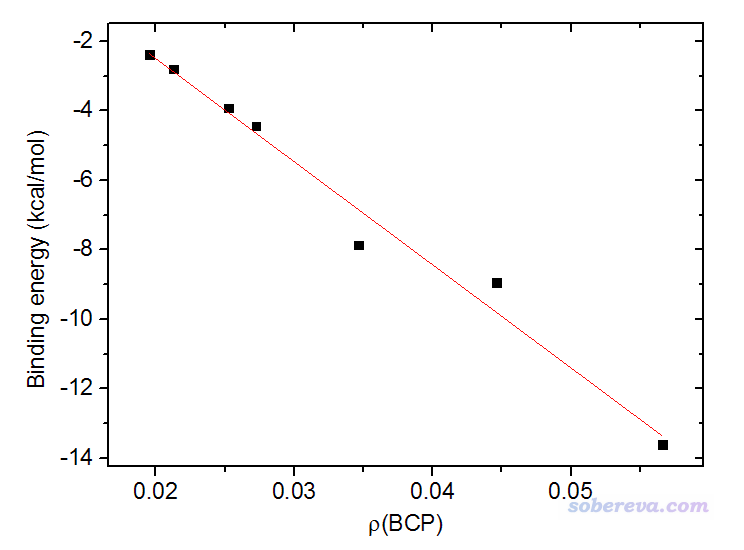
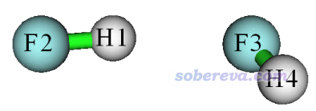
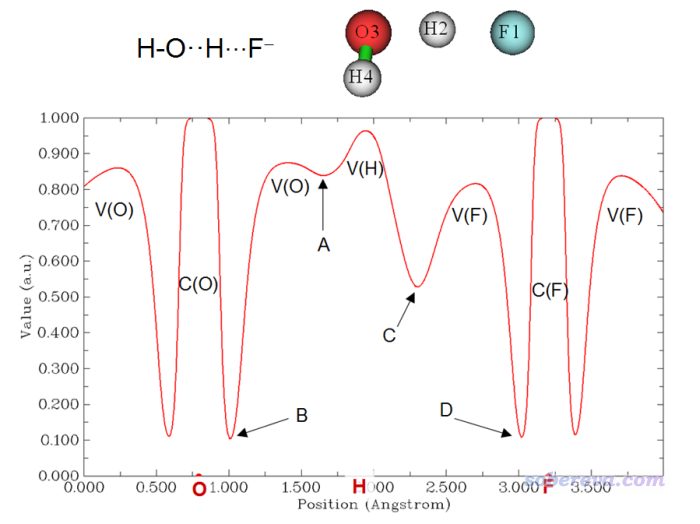
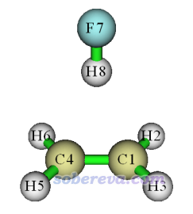
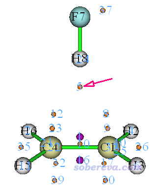

**使用Multiwfn计算CVB指数考察氢键强度**

Using Multiwfn to calculate CVB index and measure strength of hydrogen bonds

文/Sobereva@[北京科音](http://www.keinsci.com)

 First release: 2019-Feb-5  Last update: 2019-Feb-6

**摘要**：本文介绍基于电子定域化函数(ELF)定义的用于衡量氢键强度的CVB指数，并且演示怎么在Multiwfn程序（<http://sobereva.com/multiwfn>）中计算。掌握这个方法，在讨论氢键问题的时候相当于多了一个很有用的工具。

## 1 CVB指数的思想以及计算方法

core-valence bifurcation (CVB)指数是最初在Theor. Chem. Acc., 104,13 (2000)中由Silvi等人提出的一种考察氢键强度的方法，它利用了电子定域化函数(ELF)的拓扑分析的思想。如果对ELF不熟悉的话，请参阅《ELF综述和重要文献小合集》（<http://bbs.keinsci.com/thread-2100-1-1.html>）。后来有不少文章都使用了这个指数讨论氢键，比如Struct. Chem., 16, 203 (2005)、J. Phys. Chem. A, 115, 10078 (2011)，在一篇从理论角度分析氢键的综述Chem. Rev., 111, 2597 (2011)中也对CVB指数进行了介绍。

一般的氢键可以写为D-H...A的形式，其中D是氢键给体原子（donor），A是氢键受体原子（acceptor）。用ELF盆分析的语言来描述的话，这块区域由以下的ELF盆构成：  
V(D,H)：D和与之成键的H共同构成的价层(valence)盆  
C(D)和C(A)：D原子和A原子的内核(core)盆  
V(A)：A原子的价层盆  
相邻的盆之间都有所谓的二分点(bifurcation point)，对应于拓扑分析语言里的(3,-1)型ELF临界点。如果你不懂什么叫二分点、不懂怎么计算的话，可以看看《在Multiwfn中单独考察pi电子结构特征》（<http://sobereva.com/432>）一文中对ELF-pi函数考察其二分点的例子，本文第四节的例子也通过ELF拓扑分析考察了二分点。

CVB指数在Theor. Chem. Acc.那篇文章中的定义为：**CVB index = ELF(C-V) - ELF(DH-A)**  
其中ELF(C-V)代表内核盆与价层盆之间的二分点数值，ELF(DH-A)代表V(D,H)与V(A)之间的二分点数值，也即H与A原子间(3,-1)型ELF临界点的ELF数值。CVB指数越负，通常氢键越强，这点在原文以后后续一些文章里都通过实例进行了验证。比较强的氢键的CVB指数一般明显为负；极强、带有明显共价特征的氢键可以达到很负的数值；中等强度氢键的CVB指数一般在0附近；较弱的氢键的CVB指数一般明显为正。其实为什么会这样也不难理解，因为氢键越强，H和A之间的距离通常越近，H...A作用的共价性也会越显著，势必ELF(DH-A)会越大、导致CVB index越负。其实说白了，CVB指数的名字虽然重在core-valence二分点数值，但真正关键的其实是ELF(DH-A)的数值，不同氢键的ELF(DH-A)的差异远比ELF(C-V)大得多得多。

在CVB指数的原文里，对CVB指数的计算细节没有说清楚，这导致之后不同文章在计算CVB指数的时候用的具体做法不同，而且CVB指数原文里的数据还存在错误，尤为明显的错误是把符号搞反了，而且在后来的某些相关文章中和CVB有关的叙述还往往是错的，总之被搞得一团糟，那些文章里的CVB数值也很难或根本无法重现出来。

笔者在Multiwfn里专门加入了CVB指数的自动计算功能，是主功能200的子功能1，只要输入D、H、A原子的序号即可计算。在Multiwfn中计算CVB指数的做法是笔者提出来的，笔者认为这种方式计算不仅耗时很低（基本上秒算）、操作极简单、实现极容易，而且意义明确。

在Multiwfn的这个功能中，CVB指数定义为：**CVB index = ELF(C-V,D) - ELF(DH-A)**  
其中，ELF(DH-A)不是通过拓扑分析搜索出来的精确的V(D,H)与V(A)之间的二分点的数值，而是在H-A连线上计算ELF曲线，从中取H和A之间ELF极小点的数值，因为这样计算容易得多。而且由于精确的二分点位置几乎就在H-A的连线上，因此Multiwfn中这种近似方式得到的ELF(DH-A)与按照CVB指数原始定义计算的ELF(DH-A)几乎没有差异。  
上式中ELF(C-V,D)的物理意义是D原子上的core-valence二分点数值。Multiwfn中虽然也可以通过其强大的拓扑分析功能（主功能2）得到准确的这种二分点位置和数值，但这种二分点在实际中往往不好考察，同一个原子可能有多个这样的二分点，在选取上有任意性。而且如果是第二周期之后的原子，二分点会更多，考察时更麻烦。而且笔者也认为，用精确的二分点也并没有太强的物理意义，因为它们往往都不在D-H连线方向上，因此和氢键特征也联系不紧密。考虑到这些，在Multiwfn自动计算CVB指数的功能中，ELF(C-V,D)是直接取D-H连线上相应的ELF极小点数值。

Multiwfn自动计算CVB指数的功能中会计算三个量，思想很简单，如下所示：

实际上你也完全可以通过主功能3来绘制ELF曲线（例子看Multiwfn手册4.3节），并让程序给出极小点位置和数值，由此手动得到CVB指数，只不过使用Multiwfn自动计算CVB指数的功能在操作上方便得多。上图中顺带搜索到的ELF(C-V,A)并没什么实际用处，但是可能有的用户对此感兴趣，所以程序也会顺带输出。

由于Theor. Chem. Acc.那篇文章里的数据有一定问题，而且对测试体系计算氢键结合能用的级别在现在来看非常烂（B3LYP/6-31G**），因此文中的数据不足为信。笔者用这篇文章里的一部分氢键二聚体，在可靠的B3LYP-D3(BJ)/def2-TZVP下优化并得到波函数文件，使用Multiwfn自动计算CVB指数的功能做了计算，并且用计算氢键结合能精度很高的MP2/jul-cc-pVQZ结合counterpoise校正计算了氢键结合能，结果如下

可见，CVB指数和氢键结合能之间的线性关系虽然不算完美，但线性关系还是很显著的。如果把OC...HF这个例外不计的话，那么线性关系就很理想了。

其实，CVB指数的两个组成部分自身也与氢键强度存在明显相关性（起码对这批体系而言），如下所示

由于“CVB指数 vs 结合能”的图和“ELF(DH-A) vs 结合能”很相似，所以CVB指数的重点是ELF(DH-A)，哪怕忽略ELF(C-V,D)其实也无大碍。ELF(C-V,D)与结合能的线性关系很好，但并不好从物理意义上解释原因，同时也可以看到对不同氢键其数值差异很小。总之，当你用CVB指数讨论氢键的时候，也可以顺带检验一下其两个组成部分和氢键强度的相关性。

值得一提的是，对这些氢键二聚体，笔者发现AIM理论里的键临界点(BCP)的电子密度ρ(BCP)和结合能的关系颇好，如下所示（笔者也考察了BCP处势能密度，发现与结合能的线性关系远没有这么好）。ρ(BCP)用Multiwfn可以非常容易地计算，见《使用Multiwfn做拓扑分析以及计算孤对电子角度》（<http://sobereva.com/108>）。AIM的相关知识看《AIM学习资料和重要文献合集》（<http://bbs.keinsci.com/thread-362-1-1.html>）。**关于此项研究，笔者专门发表了论文，主要内容介绍见《透彻认识氢键本质、简单可靠地估计氢键强度：一篇2019年JCC上的重要研究文章介绍》（**[**http://sobereva.com/513**](http://sobereva.com/513)**），****此文对于氢键的研究意义很大，请读者务必一读**。

## 2 CVB指数在Multiwfn中的计算一例：HF...HF

只有在2019-Feb-5及之后更新的Multiwfn中才有CVB指数自动计算功能。不了解Multiwfn的话看《Multiwfn入门tips》（<http://sobereva.com/167>），不知道怎么产生Multiwfn需要的输入文件的话看《详谈Multiwfn支持的输入文件类型、产生方法以及相互转换》（<http://sobereva.com/379>）。常见的.fch、.molden、.wfn等格式都可以作为CVB指数计算功能的输入文件。

下面以HF...HF作为例子演示在Multiwfn中计算CVB指数，由Gaussian 16 A.03在B3LYP-D3(BJ)/def2-TZVP下优化并产生的wfn文件是examples目录下的HF_HF.wfn，体系结构如下

启动Multiwfn，输入  
examples\HF_HF.wfn  
200  // 其它功能(part2)  
1  // 计算CVB指数和相关的量  
2,1,3  //氢键给体原子、氢原子和氢键受体原子的序号

输出信息如下  
Core-valence bifurcation value at donor, ELF(C-V,D):  0.0936  
 Distance between corresponding minimum and the hydrogen:   0.743 Angstrom

Core-valence bifurcation value at acceptor, ELF(C-V,A):  0.1408  
 Distance between corresponding minimum and the hydrogen:   1.628 Angstrom

Bifurcation value at H-bond, ELF(DH-A):  0.0648  
 Distance between corresponding minimum and the hydrogen:   0.614 Angstrom

The CVB index, namely ELF(C-V,D) - ELF(DH-A):    0.028768

各项是什么含义，只要仔细看了上一节就肯定明白。输出中还顺便把相应的ELF曲线极小点与氢原子之间的距离显示了出来。

## 3 某些极强氢键的特殊考虑

对于某些极强的氢键，由于H和A之间的作用也非常强，存在显著共价特征，此时V(D,H)二分为V(D)和V(H)，例如下图所示的体系（由于O-H-F基本在一条直线上，所以就不把O-H和H-F的ELF曲线图单独绘制了，而是为了省事直接绘制O-F连线上的图）。

此体系中，由于F形式上是以F-阴离子形态存在，与带正电的氢的作用极强，这使H和F之间已经存在不可忽视的共价性（而一般氢键的主要本质是静电作用），因此在对应的二分点C位置，ELF数值远大于一般强度氢键的情况。H与F强烈吸引，导致水分子中的O3-H2键遭到很大破坏，拉长了O3-H2的距离，也同时导致V(H2)独立的ELF盆的出现，因此曲线上出现了极小点A。

像上面这种明显不具备典型D-H...A氢键特征的体系，前述的Multiwfn的CVB指数自动计算方法是明显不适用的，强行用的话结果是没意义的，必须通过主功能3作图并手动计算。这个体系可以认为存在两种氢键O-H...F和O...H-F，二者的结合能存在明显差异，其CVB指数在计算的时候也应当分别考虑：  
考察O-H...F时，CVB index = ELF(B) - ELF(C)  
考察O...H-F时，CVB index = ELF(D) - ELF(A)   
由于ELF(B)和ELF(D)差不太多，而ELF(A)显著大于ELF(C)，因此O...H-F的CVB指数明显更负，体现O...H-F的结合强度比O-H...F肯定大得多。

在Multiwfn手册的3.200.1节当中还有关于CVB指数更多的信息，有兴趣的读者建议看看。

## 4 氢键受体不是单一原子情况时CVB指数的计算

有很多氢键的受体并不是特定的某个原子，比如pi-氢键，是以富集的pi电子云作为氢键受体。这种情况下，也没法用前述的Multiwfn中自动计算CVB指数的功能来计算，而需要根据实际情况手动进行计算。这里以HF...乙烯二聚体作为例子。B3LYP-D3(BJ)/def2-TZVP下优化并产生的波函数文件是examples目录下的C2H4_HF.wfn。其结构如下

先计算ELF(C-V,D)。按照之前用到的做法，在F7-H8连线方向上绘制ELF，查看对应的极小点即可。启动Multiwfn并输入  
examples\C2H4_HF.wfn  
3  //绘制曲线图  
9  //绘制ELF  
0  //设定延展距离  
0  //延展距离设为0（使得图的两端正好是两个原子核位置）  
1  //输入两个原子序号定义直线  
7,8  
把弹出来的图关闭，后处理菜单选择6，在屏幕上看到  
Minimum X (Bohr):    0.356648  Value:    0.94377038E-01  
这个极小点的数值0.0944即是ELF(C-V,D)。

对于当前体系的ELF(DH-A)，我们应当通过做ELF拓扑分析找到对应H8与乙烯pi区域之间的ELF二分点位置来得到其数值。接着在Multiwfn里输入  
0  //返回主菜单  
2  //拓扑分析  
-11  //选择要做拓扑分析的函数  
9  //ELF  
6  //在特定圆球内随机撒初猜点的方式找临界点  
4  //将圆球中心定义为三个原子的中点  
1,4,8  //将C1,C4,H8的中心作为圆球的中点，这时圆球的区域内理应会包含当前要找的氢键处的ELF二分点  
0   //开始在圆球内随机撒初猜点来找临界点（撒的点数可以事先通过选项11设定，圆球半径也可以自设）  
-9  //返回拓扑分析主界面  
0  //观看临界点分布  
看到的图如下所示，为了清楚，这里只显示出(3,-1)和(3,-3)型ELF临界点，分别是桔球和紫球。

我们看到在H8与pi电子区域之间找到了ELF二分点，即5号临界点。点右上角的RETURN退出图形窗口，选择选项7考察临界点属性，再输入5，在屏幕上看到  
Electron localization function (ELF):  0.1240943921E+00  
即此体系氢键的ELF(DH-A)=0.1241。因此，此氢键的CVB指数为0.0944-0.1241=-0.0297。

由于这个体系对称性较高，其实不做拓扑分析也可以得到ELF(DH-A)，也就是用主功能3绘制H8与C1-C4的中点连线上的ELF曲线，然后从中取对应的极小点，数值和上面做拓扑分析得到的完全一致。但如果体系对称性不那么高，显然就没法这么通过ELF曲线图比较准确地得到实际二分点位置的ELF值了。
