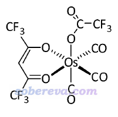
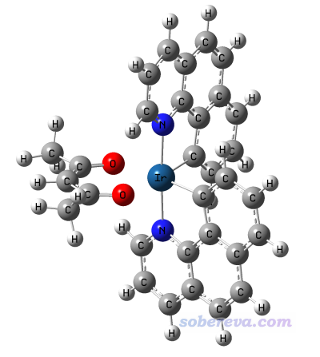
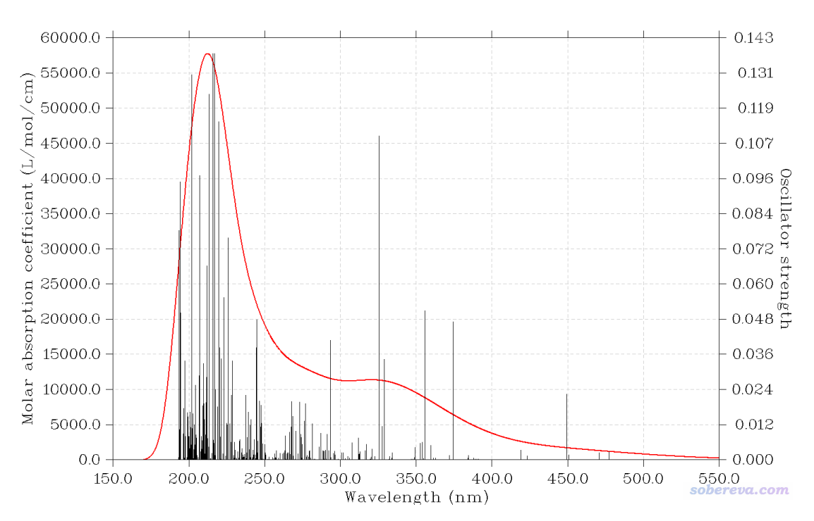
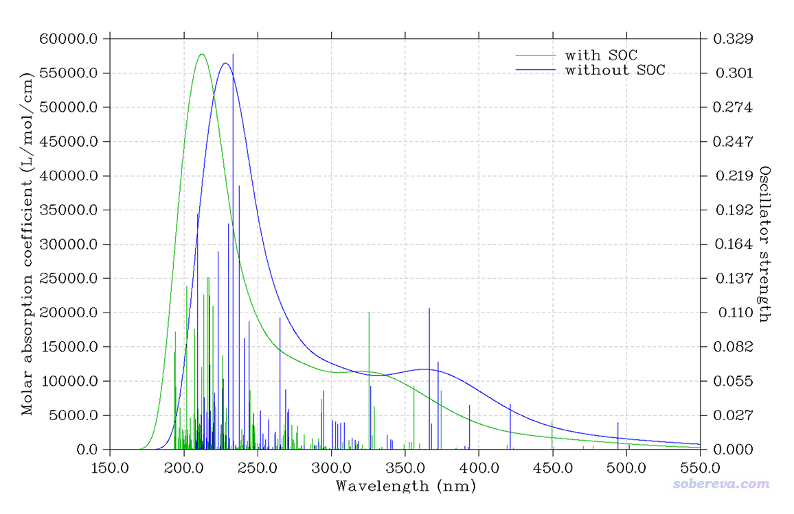
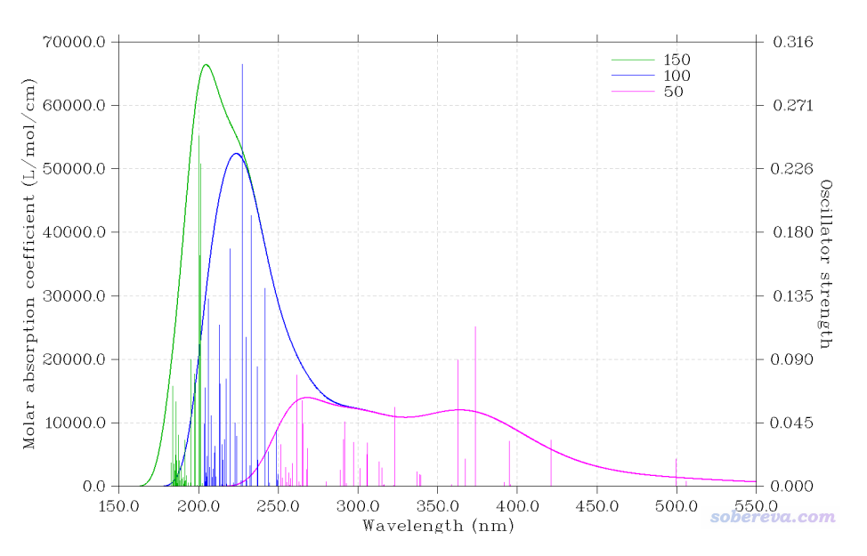
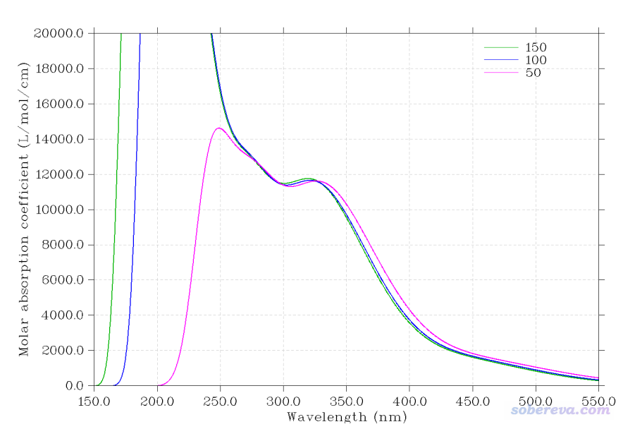
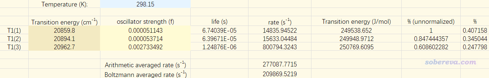

**使用ORCA在TDDFT下计算旋轨耦合矩阵元和绘制旋轨耦合校正的UV-Vis光谱**

Using ORCA to calculate spin-orbit coupling matrix elements and plot spin-orbit coupling corrected UV-Vis spectra under TDDFT

文/Sobereva@[北京科音](http://www.keinsci.com)

First release: 2019-Feb-10  Last update: 2021-Jul-10

## 1 前言

看本文前，强烈建议先看《使用Gaussian+PySOC在TDDFT下计算旋轨耦合矩阵元》（<http://sobereva.com/411>）了解一些旋轨耦合矩阵元计算的基本知识，以及看《Gaussian中用TDDFT计算激发态和吸收、荧光、磷光光谱的方法》（<http://sobereva.com/314>）了解TDDFT计算的相关知识。TDDFT和旋轨耦合(Spin-orbit coupling, SOC)方面的理论性的内容在本文就不多提了，笔者假设读者已经看了上面两篇具备了相关常识。如果你不会装ORCA，看《量子化学程序ORCA的安装方法》（<http://sobereva.com/451>）。

从ORCA 4.1开始，ORCA支持了TDDFT下闭壳层体系的旋轨耦合的计算，旋轨耦合算符对应的是Breit-Pauli哈密顿，可以做的相关的事包括：  
·计算旋轨耦合矩阵元  
·计算旋轨耦合对基态和激发态能量的影响  
·计算考虑旋轨耦合时的振子强度和转子强度，结合Multiwfn可以绘制考虑旋轨耦合后的光谱  
本文就对ORCA的TDDFT的旋轨耦合计算进行基本介绍，其中最主要是讲旋轨耦合矩阵元的计算和绘制旋轨耦合校正的UV-Vis光谱，最后也简单谈一下用ORCA的这种SOC-TDDFT计算有无可能给出靠谱的磷光发射速率的问题。

使用ORCA在TDDFT下计算旋轨耦合矩阵元相对于使用之前笔者介绍的Gaussian+PySOC的组合有下列好处：  
(1)ORCA开RI的时候做TDDFT计算本身远比Gaussian快得多，除很小体系外至少快一倍，而气相的结果可以与Gaussian很好相符  
(2)ORCA对学术用户完全免费  
(3)PySOC只能用较low的有效核电荷(Zeff)方式考虑旋轨耦合。而ORCA不仅支持Zeff，还支持更精确的旋轨耦合平均场(SOMF)方式考虑  
(4)PySOC大部分是Fortran写的，有一小部分莫名其妙地偏要用Python编写，导致在Windows下运行不方便，而很多操作系统下由于Python版本原因导致PySOC运行不成功。而ORCA在所有操作系统下都能顺利运行  
(5)用ORCA计算比用Gaussian+PySOC的组合方便不少，而且还省得让Gaussian往硬盘里保存很占地方的rwf文件  
总的来说，ORCA算是目前在TDDFT下计算旋轨耦合矩阵元最理想的程序。

下面结合实例介绍ORCA的SOC-TDDFT计算。涉及的输入输出文件都可以在此处下载：<http://sobereva.com/attach/462/file.rar>。本文用的是ORCA 4.1.1。

**笔者遇到多次本文的读者没有任何ORCA使用基础知识，也不具备相关理论常识，就胡乱参照本文计算，这是绝对不行的！十分推荐通过北京科音高级量子化学培训班（**[**http://www.keinsci.com/KAQC**](http://www.keinsci.com/KAQC)**）非常完整全面系统学一遍ORCA，就全明白了，绝对不要稀里糊涂地用ORCA。并且旋轨耦合矩阵元所有计算细节在培训里面也都详细讲了，并且利用旋轨耦合矩阵元计算磷光发射速率、计算系间窜越速率也都是培训里特别详细讲的内容。**

## 2 旋轨耦合矩阵元计算实例1：甲醛

首先用一个非常简单的体系甲醛来说明怎么在ORCA里做考虑了旋轨耦合的TDDFT计算、怎么去理解输出。

**2021-Jul-10注**：从ORCA 5.0开始，不要再像下文例子中那样自己写grid和gridx关键词，用默认的即可。详见《谈谈ORCA 5.0的新特性和改变》（<http://sobereva.com/604>）。

下面这个输入文件对甲醛在B3LYP/def-TZVP下做TDDFT计算。几何结构已经在PBE0/def-TZVP级别下优化过。  
! B3LYP/G TZVP miniprint tightSCF grid4 pal4  
%tddft  
nroots 5  
dosoc true  
tda false  
printlevel 3  
end  
* xyz 0 1  
 C                  0.00000000    0.00000000   -0.52513500  
 H                  0.00000000    0.93987900   -1.11261300  
 H                  0.00000000   -0.93987900   -1.11261300  
 O                  0.00000000    0.00000000    0.67200400  
*

之所以此例在B3LYP后面写了个/G，是因为ORCA里默认的B3LYP与Gaussian的B3LYP不同，加/G代表我们这里想使用与Gaussian相同的B3LYP定义。TZVP代表用def-TZVP基组，和Gaussian里写TZVP时用的基组相同。miniprint代表不输出一堆乱七八糟没太大用的信息（尤其是布居分析，又占地方又不好读，而用笔者开发的Multiwfn随时都可以基于ORCA产生的.molden文件做更丰富的布居分析，而且分析起来方便得多）。tightSCF代表用比默认更严的SCF收敛限，对于涉及到后HF、TDDFT等多组态方法的时候都建议加上。grid4代表用比默认更好的DFT积分格点，这有助于降低数值误差。pal4代表用4核并行。%tddft...end段落代表做TDDFT计算，dosoc true代表TDDFT计算过程考虑旋轨耦合效应。ORCA默认做TDDFT时候是用TDA近似的，原理上不如完整形式的TDDFT精确（详见《乱谈激发态的计算方法》<http://sobereva.com/265>），因此用tda false要求ORCA做完整形式的TDDFT计算。nroots 5代表计算5个激发态，当使用dosoc true的时候会自动用triplets true选项，因此会同时计算5个单重态激发态和5个三重态激发态。printlevel 3代表在SOC-TDDFT计算过程中比默认时输出更多信息，其中有很多是很重要的，而在默认下居然没有输出！（这点在手册只字未提，笔者好不容易才意外地试出来这个关键性的隐藏选项，简直像发现游戏秘技一样）。

计算开始后，程序按照以下流程计算和输出  
(1)做常规B3LYP/TZVP基态计算以得到参考态波函数  
(2)做常规TD-B3LYP/TZVP计算，先计算5个单重态激发态，再计算5个三重态激发态  
(3)计算旋轨耦合积分，构建所有态之间的旋轨耦合矩阵元，然后对此矩阵对角化得到本征值和本征矢  
(4)输出完整的旋轨耦合矩阵，实部和虚部分别输出，每个三重态当做不同的三个子态考虑  
(5)输出单-三重态间旋轨耦合矩阵元  
对于当前例子，其实算到这里就够了，后面几步的意义在之后的例子再细说。  
(6)输出旋轨耦合对基态的稳定化能，即SOC stabilization of the ground state:后面的  
(7)输出考虑了SOC后哈密顿的本征值，开头是Eigenvalues of the SOC matrix:  
(8)输出考虑了SOC后哈密顿的本征矢，开头是Eigenvectors of the SOC matrix:  
(9)输出不考虑SOC时的激发能、振子强度、转子强度、跃迁偶极矩等跃迁信息，标题为TD-DFT-EXCITATION SPECTRA  
(10)输出考虑了SOC时的跃迁信息，标题为SOC CORRECTED TD-DFT/TDA-EXCITATION SPECTRA  
此后还有些信息，就不是本文关注的了。

如果你用了printlevel 4，还会再额外输出基函数间的SOC积分、MO之间的SOC积分等信息，一般没必要输出这些，除非自己想基于这些数据写额外的程序。

具体来说，上述第(5)步依次输出以下四个矩阵  
(a)各个单重态与各个三重态间的SOC算符的x,y,z三个分量对应的旋轨耦合矩阵元  
(b)各个单重态与各个三重态的三个子态间的总旋轨耦合矩阵元  
(c)各个单重态与各个三重态间的LxSx、LySy、LzSz算符（即简化的旋轨耦合算符）对应的旋轨耦合矩阵元  
(d)各个三重态间的简化的旋轨耦合算符对应的旋轨耦合矩阵元

我们一般最关心的信息是上面(b)部分，也正是PySOC程序最终输出的，此例结果如下所示（如果不用printlevel 3，这个矩阵是不输出的）  
                      CALCULATED SOCME BETWEEN TRIPLETS AND SINGLETS                    
      --------------------------------------------------------------------------------  
           Root                          <T|HSO|S>  (Re, Im) cm-1                       
         T      S           MS= 0                  -1                    +1             
      --------------------------------------------------------------------------------  
         1      0    (   0.00 ,  -63.78)    (  -0.00 ,    0.00)    (  -0.00 ,   -0.00)  
         1      1    (   0.00 ,    0.00)    (  -0.00 ,   -0.00)    (  -0.00 ,    0.00)  
         1      2    (   0.00 ,    0.00)    (   5.62 ,    0.00)    (   5.62 ,   -0.00)  
         1      3    (   0.00 ,   -0.00)    (  -3.80 ,    0.00)    (  -3.80 ,   -0.00)  
         1      4    (   0.00 ,   -0.00)    (  -0.00 ,  -38.41)    (  -0.00 ,   38.41)  
         1      5    (   0.00 ,   45.07)    (  -0.00 ,   -0.00)    (  -0.00 ,    0.00)  
         2      0    (   0.00 ,   -0.00)    (   0.00 ,   -0.00)    (   0.00 ,    0.00)  
         2      1    (   0.00 ,   48.56)    (   0.00 ,    0.00)    (   0.00 ,   -0.00)  
         2      2    (   0.00 ,    0.00)    (   0.00 ,   -0.30)    (   0.00 ,    0.30)  
         2      3    (   0.00 ,    0.00)    (   0.00 ,    0.19)    (   0.00 ,   -0.19)  
...[略]  
S=0对应基态，S=1~5和T=1~5是算出来的5个单重态激发态和5个三重态激发态。MS=0、-1、+1对应三重态的自旋磁量子数不同的三个子态。可见ORCA对实部Re和虚部Im是分别输出的，而PySOC在输出的时候输出的是模，即实部和虚部平方和开根号。如果你想得到某个单重态和某个三重态之间总的旋轨耦合矩阵元，那就把这个单重态与三个子态的旋轨耦合矩阵元的模求平方再开根号，换句话说，就相当于把相应那一行的六个值都求平方加和后再开根号（例如PCCP,16,26184的式5就是用这个方式算的）。根据上面的输出，我们可知诸如S1-T2之间的总旋轨耦合矩阵元是48.56 cm-1。（其实用(a)部分的对应的行的六个数值求平方和得到的结果与此也相同，此时可以不用写printlevel 3）

默认情况下，ORCA是以SOMF方式考虑旋轨耦合效应的，在ORCA里也被叫做SOMF(1X)。SOMF全称为Spin-orbit mean-field，它将SOC算符中难算的双电子部分用平均场方式来近似描述，精度比较理想，虽然名义上比起更粗糙的Zeff处理耗时高，但根据笔者测试，即便对于大体系的SOC-TDDFT计算，SOMF也不算耗时有多高，而且总耗时的瓶颈也完全不在计算旋轨耦合积分上。因此若无特殊情况，一律用默认的SOMF即可。

如果你就是想在SOC-TDDFT计算中用Zeff方式考虑旋轨耦合的话，在上面的输入文件中额外插入一行%rel SOCType 1 end即可（别写到%tddft...end里头去），这里%rel是设置旋轨耦合算符具体类型的段落。此时，在旋轨耦合部分计算开始处会看到  
Operator type                               ... Effective nuclear charge  
Effective nuclear charges used:  
   Atomtype H  -> Zeff     1.0000  
   Atomtype C  -> Zeff     3.6000  
   Atomtype O  -> Zeff     5.6000  
这里用的ORCA内置的有效核电荷来自Koseki的文章，和笔者之前在<http://sobereva.com/411>中提到的一致。此时输出的旋轨耦合矩阵元为  
           Root                          <T|HSO|S>  (Re, Im) cm-1                       
         T      S           MS= 0                  -1                    +1             
      --------------------------------------------------------------------------------  
...[略]  
         2      0    (   0.00 ,   -0.00)    (   0.00 ,   -0.00)    (   0.00 ,    0.00)  
         2      1    (   0.00 ,   53.39)    (   0.00 ,    0.00)    (   0.00 ,   -0.00)  
         2      2    (   0.00 ,    0.00)    (   0.00 ,   -0.33)    (   0.00 ,    0.33)  
...[略]  
此时<S1|H_SO|T2>为53.39 cm-1，和SOMF的结果48.56 cm-1稍有差异。如<http://sobereva.com/411>所示，之前用Gaussian+PySOC在相同级别下、结合Koseki有效核电荷时得到的这个值为49.81 cm-1，和此处的53.39 cm-1间的一点差异在于整个计算中涉及的各种零零碎碎的数值细节有所不同，而且PySOC计算时用的是笛卡尔型高斯函数，而当前是球谐型（ORCA里也只能用球谐型高斯函数）。

在ORCA里如果利用RI近似的话，对于大体系的基态和TDDFT计算都可以显著加快。由于甲醛很小，RI的效果不明显，甚至反倒令耗时更高，所以前例就没开RI。而对大体系，强烈建议把前例的关键词改为下面的关键词来节约时间  
! B3LYP/G TZVP RIJCOSX def2/J miniprint tightSCF grid4 gridx4 pal4  
RIJCOSX代表用RI-J加速库仑部分的计算，用COSX方法快速计算交换部分，gridx4代表用比默认更好的做COSX部分的积分格点以保证数值精度损失小。def2/J代表在RI-J部分使用def2/J辅助基组（def2/J辅助基组给def-系列基组用完全没问题）。对当前体系，开不开RIJCOSX对算出来的旋轨耦合矩阵元的绝对值影响不超过0.1 cm-1，所以SOC-TDDFT计算中可以放心用RIJCOSX来加速。更多RI相关的信息在《大体系弱相互作用计算的解决之道》（<http://sobereva.com/214>）一文有介绍。

## 3 旋轨耦合矩阵元计算实例2：溶剂中的Os配合物

在前述的《使用Gaussian+PySOC在TDDFT下计算旋轨耦合矩阵元》一文中用Gaussian+PySOC计算过下面这个Os配合物体系，基态是单重态

由于有重金属，因此我们一般都会想到用赝势基组，比同等质量的全电子基组又省时间又能顺带体现标量相对论效应。如果用Zeff方式考虑旋轨耦合的话，是可以使用赝势的。虽然如笔者的PySOC那篇博文所述，Koseki提出过适合Os等重元素的有效核电荷，结果也不差，但是ORCA 4.1.1里没有内置重元素的Koseki有效核电荷，虽然手册里说可以由用户自行提供，但笔者发现ORCA 4.1.1存在bug，按照手册里的方式自行提供了也会被程序无视。这点估计以后版本会修正，笔者已经在ORCA论坛反馈过了(<https://orcaforum.kofo.mpg.de/viewtopic.php?f=8&t=4478>)。因此，对此体系，时下我们只能用SOMF方式考虑旋轨耦合（ORCA还支持其几种变体，大同小异），此时只能用全电子基组，用赝势基组+赝势的话虽然不报错，但结果是明显不对的。

这次我们用以下关键词通过DKH2哈密顿来做全电子标量相对论计算，旋轨耦合只体现在TDDFT部分。完整的输入文件见本文的文件包。此任务用的几何结构和之前PySOC博文里相同。  
! B3LYP/G DKH2 DKH-def2-TZVP SARC/J RIJCOSX cpcm(CH2Cl2) tightSCF miniprint grid4 gridx4  
%basis   
NewGTO Os "SARC-DKH-TZVP" end  
end  
%pal nprocs 36 end  
%maxcore 2500  
%tddft nroots=10 TDA false dosoc true printlevel 3 end  
* xyz 0 1  
...[坐标]  
end  
其中，DKH2代表用流行的DKH2哈密顿做标量相对论计算，基组使用DKH-def2-TZVP，是专为DKH计算设计的重收缩版本的def2-TZVP。由于def2-TZVP对于Os是赝势基组，所以DKH-def2-TZVP对Os必然是没有定义的，故此例对Os元素使用SARC-DKH-TZVP，此基组是对Xe之后元素有定义的适合DKH2计算的全电子基组，与DKH-def2-TZVP搭配很适合。虽然SARC/J名字看上去好像只是给SARC-DKH-系列基组用的辅助基组，但在ORCA里它也同时具有def2/J DecontractAuxJ（对def2/J辅助基组去收缩）的含义，因此无论是SARC-DKH系列（也包括SARC2-DKH）还是DKH-def2-系列基组都可以通过写SARC/J来提供适合的辅助基组。当前计算使用CPCM模型表现二氯甲烷CH2Cl2溶剂环境。由于当前计算较耗时，故用36个核计算，每个核内存分配上限约为2500MB。

当前这个任务，在<http://bbs.keinsci.com/thread-6310-1-1.html>一文提到的笔者买的E5-2696 v3双路36核机子下只花了12分钟就跑完了。旋轨耦合矩阵元部分输出如下  
           Root                          <T|HSO|S>  (Re, Im) cm-1                       
         T      S           MS= 0                  -1                    +1             
      --------------------------------------------------------------------------------  
         1      0    (   0.00 ,    0.01)    ( -59.62 ,    7.55)    ( -59.62 ,   -7.55)  
         1      1    (   0.00 ,   89.52)    (   0.03 ,    0.00)    (   0.03 ,   -0.00)  
...[略]  
         1      9    (   0.00 ,    3.58)    (   0.04 ,    0.05)    (   0.04 ,   -0.05)  
         1     10    (   0.00 ,    0.03)    (   1.48 ,  -40.59)    (   1.48 ,   40.59)  
         2      0    (   0.00 , -198.63)    (  -0.86 ,    0.23)    (  -0.86 ,   -0.23)  
         2      1    (   0.00 ,   -1.30)    (-544.99 ,   16.42)    (-544.99 ,  -16.42)  
         2      2    (   0.00 ,    0.94)    ( -70.51 ,  665.08)    ( -70.51 , -665.08)  
...[略]  
比如<S1|H_SO|T2>的总大小为sqrt((-1.30)**2+(-544.99)**2+16.42**2+(-544.99)**2+(-16.42)**2)=771.1 cm-1。之前PySOC那篇博文里，用Gaussian+PySOC通过TD-B3LYP/def2-TZVP结合IEFPCM溶剂模型得到的结果为<S1|H_SO|T2_0>=0.69 cm-1、<S1|H_SO|T2_+1>=<S1|H_SO|T2_-1>=419.63 cm-1，总大小593.4 cm-1，和当前算的结果数量级差不多。由于当前计算明显更为严格，又是用全电子标量相对论又是用更好的SOMF方式考虑旋轨耦合，特别是Zeff方法对于越重的元素往往误差越大，因此应当认为本文的结果更合理。

**2021-Jul-10注**：以下关于溶剂部分的内容对ORCA 5.0及以后版本不适用，程序不再输出下面这些内容，而且溶剂下计算结果也没有4.x时候存在的以下提及的问题。

关于ORCA在溶剂模型下输出的TDDFT激发能有一些特殊问题值得提及。在输出完三重态激发能之后，有这么一段（这里State 0是指的第1个三重态激发态）  
 State Shift(Eh) Shift(eV) Shift(cm**-1) Shift(nm) ERPA(eV)  ERPA+SHIFT(eV)  
-------------------------------------------------------------------  
   0: -0.0006565 -0.018     -144.1        3.5      2.534     2.516  
   1: -0.0120876 -0.329    -2652.9       28.4      3.954     3.626  
   2: -0.0100690 -0.274    -2209.9       22.6      4.012     3.738  
   3: -0.0011292 -0.031     -247.8        2.1      4.287     4.256  
   4: -0.0024908 -0.068     -546.7        4.6      4.330     4.262  
   5: -0.0021236 -0.058     -466.1        3.8      4.365     4.307  
   6: -0.0297932 -0.811    -6538.8       61.7      4.461     3.650  
   7: -0.0083835 -0.228    -1840.0       14.9      4.475     4.247  
   8: -0.0007398 -0.020     -162.4        1.2      4.486     4.466  
   9: -0.0003368 -0.009      -73.9        0.5      4.569     4.560  
我在《Gaussian中用TDDFT计算激发态和吸收、荧光、磷光光谱的方法》（<http://sobereva.com/314>）中说过，溶剂对电子激发的响应有快部分和慢部分之分，两部分都会影响激发能。上面的ERPA下面的数值对应的只是只考虑了慢部分的情况，相当于是用溶剂模型下经过SCF得到的基态轨道以常规方式算的TDDFT激发能，ORCA是根据这个激发能来对激发态进行排序的。Shift是溶剂的快部分对激发能的影响，体现的是对电子激发的瞬时响应，二者的加和ERPA+SHIFT也正是在这个表格之前输出的各个激发态的能量，它和ERPA的顺序可能存在不同。而Gaussian则是按照最终的（快、慢部分都考虑后的）激发能对激发态来排序的。因此由于这个差异，Gaussian与ORCA给出的激发态顺序可能不同。

另外，Gaussian与ORCA虽然在气相下算的TDDFT激发能相符很好，但在溶剂模型下则有很大出入（对于电子激发，ORCA只能用线性响应溶剂模型，而这里作为对比的对象是Gaussian也用线性响应溶剂模型的情况）。这俩程序都用CPCM时，由于用的默认原子半径不同等细节因素存在差异，结果肯定是对应不好的，这暂且不提；哪怕这两个程序都用SMD溶剂模型，让溶剂方面的细节尽可能一致（仍不完全相同，因为ORCA的SMD的极性部分不是用的SMD原文里的IEFPCM而是更low的CPCM形式），这俩程序给出的某些态的TDDFT激发能也是存在明显不同的（已经通过组态系数可以确认对比的是相同的态），相差往往达到零点几eV的程度。根据笔者的感觉，ORCA算出来的溶剂的快部分是不太可靠的，即SHIFT数值往往太大，如上可见有的居然能达到-0.8 eV的程度，更何况当前用的二氯甲烷极性很低，不可能会产生这么大影响才对。而由于Gaussian在溶剂模型方面有资历深厚的专家Barone等人在做，发表过很多关于溶剂效应对电子激发问题的理论文章，因此我认为Gaussian的结果明显更可信。而且，如果不考虑快部分，即直接用ORCA输出的ERPA的结果与Gaussian给出的结果相比，则能基本相符，进一步体现ORCA给出的快部分应当是有严重问题的。

根据以上讨论，对于溶剂模型下ORCA给出的SOC-TDDFT旋轨耦合矩阵元，就用直接输出的态的编号讨论就行了，而不建议根据实际输出的激发能（也等同于上表中的ERPA+SHIFT）再对激发态手动重新排序。如上可见，重新排序的话有的态的序号会有明显改变，比如从上面的表里看到ORCA给出的第7个三重态激发态的最终的激发能是3.650 eV，如果按照最终激发能来重新排序的话，它就成了T3而非T7了。

## 4 旋轨耦合校正后的UV-Vis光谱的绘制实例：Ir(bzq)2(acac)配合物

普通TDDFT计算时，由于自旋禁阻，单重态基态与三重态激发态之间的振子强度精确为0，而考虑旋轨耦合后，就不再如此。ORCA的SOC-TDDFT任务会输出在TDDFT过程中考虑旋轨耦合后基态到各个激发态的激发能和振子强度。具体是这么做的：先构建基态以及所有激发态之间的旋轨耦合矩阵元并加到原本的哈密顿矩阵上，每个三重态当做不同的三个子态来考虑。然后对这个矩阵做对角化，这等同于以原先的单、三重态电子态波函数作为基在考虑了旋轨耦合算符的哈密顿下做变分。这样得到的每个本征矢就相当于是考虑了旋轨耦合后的每个电子态的波函数，形式上是原先各个单重态电子态和三重态电子态的线性组合，组合系数就是这个本征矢的相应元素，而本征值就对应于考虑旋轨耦合后各个电子态的能量。此时，基态与激发态之间就不再自旋禁阻了，因为基态和激发态现在都同时具有单、三重态的成份，不再是S^2算符的本征函数，因此去计算基态与激发态之间的跃迁偶极矩时，其中不仅包含原本因为自旋禁阻而精确为0的<S|-r|T>项，还包括可以不为零的<S|-r|S>和<T|-r|T>项。另外，新产生的电子态的能量显然和之前电子态的能量不同，无论对于基态还是激发态都是如此。新的基态与原先基态之间的能量变化就是ORCA输出的SOC stabilization of the ground state。PS：由于ORCA的SOC-TDDFT在撰文时还没有相关文章发表，所以上叙述只是来自笔者个人的判断。

看过不少磷光速率计算的读者应该也知道，还有一种常见的得到单-三重态间振子强度的方法是使用一阶微扰理论，也就是将旋轨耦合算符作为微扰项来修正原有的波函数，经由S-T间的SOC矩阵元使三重态掺入单重态，也让单重态掺入三重态，这样最终得到的S-T混合态之间的跃迁偶极矩就可以不为零了，因此振子强度也就可以不为零了。从原理上说，ORCA用的变分方式的处理应当更为严格，因为相当于可以考虑更高阶的混合效应，而且可以顺带直接给出考虑SOC后的电子态的能量，但需要额外付出的代价是还得计算三重态激发态之间的旋轨耦合矩阵元，这占了整个旋轨耦合矩阵的大部分。

基于考虑旋轨耦合后产生的新的态的激发能和振子强度、转子强度，原理上就可以照常绘制UV-Vis光谱和ECD光谱了。但遗憾的是，目前的ORCA 4.1.1在SOC-TDDFT计算过程中给出的考虑旋轨耦合后的激发态的转子强度是错的。在考虑SOC前输出的有正有负，是合理的，但是考虑SOC后全都成正的了，明显不对，因此绘制出来的ECD光谱也无意义。这个问题我已经在ORCA论坛进行了反馈（<https://orcaforum.kofo.mpg.de/viewtopic.php?f=8&t=4479>），Neese说这应该是bug，但愿在未来版本中会修正。

下面笔者以下图这个Ir(bzq)2(acac)体系作为例子演示绘制旋轨耦合校正后的UV-Vis光谱。

这里使用下面的关键词算对Ir(bzq)2(acac)进行计算，体系基态是单重态。  
! B3LYP/G DKH2 DKH-def2-TZVP(-f) SARC/J RIJCOSX tightSCF miniprint grid4 gridx4  
%pal nprocs 36 end  
%maxcore 2500  
%basis   
NewGTO Ir "SARC-DKH-TZVP" end  
end  
%tddft nroots=100 TDA false dosoc true printlevel 3 end  
# BP86/SDD/TZVP opted  
* xyz 0 1  
...[坐标]  
end  
其中#开头的行是注释行，后面的内容用于提示自己之前这个结构是在BP86结合SDD和def-TZVP基组优化后的。DKH-def2-TZVP(-f)代表把DKH-def2-TZVP基组中的f极化函数砍掉以节约时间。如《谈谈赝势基组的选用》（<http://sobereva.com/373>）里提过的，配体的地位没有处于体系中央的过渡金属高，再加上普通泛函对高角动量函数要求比较低，因此用-f的版本不至于令误差比不带-f的版本增加太多。顺带一提，ORCA的SCF收敛做得不如Gaussian好，当前这样的关键词算某些过渡金属配合物容易遇到SCF不收敛，碰见这种情况可以尝试加上slowconv或veryslowconv关键词，此时会用对一般情况来说更慢但是更稳妥、收敛成功几率更高的收敛设定和算法，实测挺奏效。当前例子我们要算的并不是S与T不同子态间的旋轨耦合矩阵元，因此printlevel 3其实可以去掉，此时由于可以少输出许多矩阵，输出文件会小很多。当前这个任务用2*E5-2696 v3的机子在36核并行时4h13m算完。

Multiwfn是绘制各种类型电子和振动光谱的又方便又强大的程序，可在<http://sobereva.com/multiwfn>下载。相关信息看《Multiwfn入门tips》（<http://sobereva.com/167>）。在《使用Multiwfn绘制红外、拉曼、UV-Vis、ECD、VCD和ROA光谱图》（<http://sobereva.com/224>）中对各种光谱的计算和绘制原理以及在Multiwfn中的操作都有详细说明。2019年1月22日之后更新的Multiwfn支持基于ORCA 4.x的SOC-TDDFT计算的输出文件绘制UV-Vis和ECD谱，2021年7月10日及之后更新的Multiwfn开始兼容ORCA 5.0版的输出。

启动Multiwfn，输入上面计算产生的输出文件的路径，然后依次输入  
11  //绘制光谱  
3  //UV-Vis  
y  //载入考虑了SOC之后的电子激发数据。如果选n则载入的是考虑SOC之前的  
0  //绘制光谱，显示到屏幕上  
此时屏幕会立刻看到图像。为了美观，我们调整一下坐标轴范围和标签间隔。关闭窗口，继续输入  
3  //设置横坐标  
150,550,50  //范围为150~550nm，间隔50nm  
4  //设置左侧坐标轴  
0,60000,5000  
y  //让右侧坐标轴同步调节  
此时再选0，看到的图像如下

我们也可以将考虑SOC和不考虑时候的图绘制到一起，便于考察SOC对光谱的影响。这用Multiwfn非常容易实现，怎么用Multiwfn绘制多个情况下的光谱在《使用Multiwfn绘制构象权重平均的光谱》（<http://sobereva.com/383>）一文末尾明确说过。创建一个名为multiple.txt的文件，内容如下（.out路径写的是实际路径），第一部分是文件名，之后是要显示在图上的图例。  
E:\Ir_bzq2_acac.out with SOC  
E:\Ir_bzq2_acac.out without SOC  
然后启动Multiwfn，载入multiple.txt，重复一遍上面绘制UV-Vis光谱的过程。与上例唯一不同的是载入文件的时候会载入两次Ir_bzq2_acac.out，第一次问你是否载入SOC校正后的光谱信息时输入y，第二次问你的时候输入n（注意，由于考虑SOC后每个三重态作为三个不同的态考虑，态数比不考虑SOC时要多，而Multiwfn里同时绘制多个光谱时要求态数最多的情况作为第一项出现，因此multiple.txt里必须第一条对应的是SOC的情况）。绘制的结果如下：

由图可见，SOC效应使得UV-Vis光谱整体蓝移几十nm。按理说，肯定是考虑SOC之后的光谱更合理，但对于这点，笔者持保留态度。因为对于过渡金属配合物的计算，只要计算级别合理，其实不考虑SOC就已经可以算得很不错了，而ORCA这样考虑SOC后，对结果影响却如此之大，所以可能结果变得更差。笔者手头没有此体系的实验光谱，而且即便有，也有可能因为与其它因素带来的误差的侥幸抵消而妨碍判断，所以考虑SOC后光谱是否更合理这点笔者在此文就暂不深究了。读者有兴趣的话可以考虑和免费的专做相对论计算的Dirac程序做的二分量TDDFT计算得到的光谱对照一下，以看看ORCA这种SOC的考虑是否对改进TDDFT光谱确实有益。

这里再提一下当前体系考虑SOC后的激发能具体怎么来的。ORCA计算三重态时输出的原始的T1激发能是  
STATE  1:  E=   0.082507 au      2.245 eV    18108.3 cm**-1  
   155a -> 159a  :     0.047168   
   156a -> 159a  :     0.030710   
   157a -> 158a  :     0.873592   
在SOC矩阵构造完毕并对角化考虑了SOC的哈密顿矩阵后，输出了如下信息  
SOC stabilization of the ground state: -1692.8499 cm-1  
Eigenvalues of the SOC matrix:

   State:        cm-1         eV  
     0:          0.00         0.0000  
     1:      19166.96         2.3764  
     2:      19201.28         2.3807  
     3:      19269.86         2.3892  
     4:      19499.20         2.4176  
...略  
可见此处输出的State 1,2,3的激发能比较接近，这三个态实际上就是T1态分裂出的三个子态。原先T1的激发能是18108.3 cm-1左右，考虑SOC后分裂出的三个态激发能是19200 cm-1左右，明显高了不少。但是这还不是最终的激发能，因为前面提示了，SOC还导致基态能量下降了-1692.8499 cm-1，因此T1最低的那个子态最终的激发能是19166.96+1692.85=20859.8 cm-1，这和我们在靠后部分看到的输出考虑SOC后的激发能、振子强度和跃迁偶极矩的段落中的信息是一致的  
-----------------------------------------------------------------------------  
  SOC CORRECTED ABSORPTION SPECTRUM VIA TRANSITION ELECTRIC DIPOLE MOMENTS*    
-----------------------------------------------------------------------------  
State   Energy  Wavelength   fosc         T2         TX        TY        TZ    
        (cm-1)    (nm)                  (au**2)     (au)      (au)      (au)   
-----------------------------------------------------------------------------  
   1   20859.8    479.4   0.000051143   0.00081   0.02788   0.00000   0.00548  
...略  
正是因为此例中SOC既提升了激发态能量又降低了基态能量，因此使得光谱整体出现了明显蓝移。

关于算的态数这里多说几句。由于当前体系较大，对于绘制电子光谱目的，计算的态数不能太少，像之前计算Os配合物那样只算10个态是绝对不够的，最少也得算50个态。下图是Multiwfn绘制的不考虑旋轨耦合时计算50、100、150个态的对比图（为节约耗时，配体用的是DKH-def2-SV(P)），可见至少算50个态的时候300nm以上的曲线才能保证真实、完整。

ORCA考虑SOC对光谱的影响靠的是让不考虑SOC时得到的单重态和三重态混合来实现的，只有当算的态数比较多时，也相当于令“基”完备性较高时，考虑SOC后的电子态才能被较好描述，这样得到的考虑SOC后的激发态的振子强度和激发能才可能比较合理。在绘制SOC下的UV-Vis光谱时，算的态数应当比起不考虑SOC时更多。下图是计算50、100、150个态的时候在考虑SOC后的对比图

我们就关注300nm右侧的区域就够了。由图可见，算50个态和算100个态的时候光谱曲线是有明显可察觉的差异的，而计算100个态和计算150个态的光谱则看不出太大差异。如果不考虑SOC，如之前的图可见，算50、100还是150个态在300nm以上区域是肉眼完全看不出差异的。这个现象说明，在考虑SOC时，只计算50个态还不足以令光谱达到收敛，计算100个态的时候则基本达到收敛了。像此例类似的体系，做SOC-TDDFT计算光谱时，我都建议计算不少于100个态以求稳妥。

随着计算的态数增加，SOC-TDDFT耗时也会迅速增加，所以也不能盲目算得太多。当算的态数很多时，最最耗时的步骤就是构建完整的SOC矩阵。对本例的体系，在B3LYP下对配体用DKH-def2-SV(P)、Ir用SARC-DKH-TZVP，在前述36核机子下以SOC-TDDFT方式算50、100、150个态的耗时分别为27m、79m、169m。值得一提的是，虽然ORCA默认用的SOMF(1X)方式考虑旋轨耦合比Zeff要贵，但是对于计算的态数较多时，其实总耗时都差不多，因为瓶颈完全不在于计算旋轨耦合积分的部分。

## 5 基于ORCA的SOC-TDDFT输出信息计算磷光发射速率靠谱么？

磷光发射对应T1->S0，因此，如果找出T1主要对应的在考虑旋轨耦合后产生的三个态的振子强度和激发能，我们还可以计算磷光发射速率。在《Gaussian中用TDDFT计算激发态和吸收、荧光、磷光光谱的方法》（<http://sobereva.com/314>）中说过自发辐射速率怎么算。对于T1的一个子态，只要把其激发能、振子强度都代进去，就可以得到从这个子态发磷光的速率。要算总的磷光速率，图省事可以直接把三个子态的发射速率取平均，但原理上更严格的方法是将三个子态的发射速率取权重平均，权重可以通过Boltzmann分布获得，见《根据Boltzmann分布计算分子不同构象所占比例》（<http://sobereva.com/165>），只不过此时公式里的各个构象相对于最稳定构象的自由能差应该改为各个子态相对于能量最低子态的激发能差。

基于ORCA的SOC-TDDFT输出的信息按上述方式算磷光发射速率的结果靠谱么？我们还用上一节Ir(bzq)2(acac)那个例子，看看算出的结果和实验值相符如何。我们从输出文件中找到下面部分  
  SOC CORRECTED ABSORPTION SPECTRUM VIA TRANSITION ELECTRIC DIPOLE MOMENTS*    
-----------------------------------------------------------------------------  
State   Energy  Wavelength   fosc         T2         TX        TY        TZ    
        (cm-1)    (nm)                  (au**2)     (au)      (au)      (au)   
-----------------------------------------------------------------------------  
   1   20859.8    479.4   0.000051143   0.00081   0.02788   0.00000   0.00548  
   2   20894.1    478.6   0.000053714   0.00085   0.00007   0.02909   0.00002  
   3   20962.7    477.0   0.002733492   0.04293   0.20278   0.00003   0.04251  
   4   21192.1    471.9   0.000006626   0.00010   0.00001   0.01015   0.00000  
   5   21260.4    470.4   0.002483201   0.03845   0.19479   0.00011   0.02259  
   6   21273.4    470.1   0.000053372   0.00083   0.00093   0.02872   0.00012  
...略

由于T1的能量低于其它激发态，而且从以上信息看，前三个态的激发能很接近（旋轨耦合造成的能量分裂程度一般不会很大），因此可以初步认为前三个态就是T1分裂出的子态。但由于S1可能与T1能量较为接近，所以光从能量上判断哪三个态对应原始的T1也不是绝对稳妥的。我们可以考察下考虑SOC后的哈密顿矩阵对角化产生的本征矢的构成来进一步判断。从输出文件中可以找到下面信息  
Eigenvectors of the SOC matrix:

             E(cm-1)  Weight      Real         Imag     : Root  Spin  Ms  
 STATE  0:      0.00  
                      0.95663     -0.97807     -0.00121 : 0     0     0  
 STATE  1:  19166.96  
                      0.45282      0.67290      0.00545 : 1     1     0  
                      0.01878     -0.13705     -0.00111 : 4     1     0  
                      0.19397      0.44040      0.00356 : 1     1    -1  
                      0.03062     -0.00138      0.17499 : 3     1    -1  
                      0.01131      0.00079     -0.10635 : 5     1    -1  
                      0.19397     -0.44040     -0.00357 : 1     1     1  
                      0.03062     -0.00145      0.17499 : 3     1     1  
                      0.01131      0.00094     -0.10635 : 5     1     1  
 STATE  2:  19201.28  
                      0.03764      0.00211      0.19399 : 3     1     0  
                      0.40524      0.63655     -0.00725 : 1     1    -1  
                      0.01383     -0.00127     -0.11758 : 2     1    -1  
                      0.02012      0.00149      0.14183 : 3     1    -1  
                      0.40524      0.63655     -0.00661 : 1     1     1  
                      0.01383      0.00129      0.11758 : 2     1     1  
                      0.02012     -0.00159     -0.14183 : 3     1     1  
 STATE  3:  19269.86  
                      0.01172      0.00207     -0.10824 : 2     0     0  
                      0.03248      0.00345     -0.18018 : 3     0     0  
                      0.39122      0.62536      0.01197 : 1     1     0  
                      0.23609     -0.48581     -0.00888 : 1     1    -1  
                      0.01004      0.00202     -0.10017 : 2     1    -1  
                      0.01122      0.10591      0.00201 : 4     1    -1  
                      0.23609      0.48579      0.00972 : 1     1     1  
                      0.01004      0.00182     -0.10018 : 2     1     1  
                      0.01122     -0.10590     -0.00205 : 4     1     1  
...略（注意给出的能量是没有加上SOC导致的基态稳定化能的）

上面的信息展现了考虑SOC后新产生的电子态是怎么由原先的各个单重态和三重态混合产生的，Weight下面是贡献，总和为1（这里只输出了>0.01的）。Root下面是不考虑SOC时电子态的序号，0是基态，Spin为0和1分别对应单重态和三重态。

由以上信息可见，考虑SOC后能量最低的三个激发态几乎完全由三重态构成，而且原先的T1（Root=1,Spin=1的项）起到的贡献是最主要的。毫无疑问考虑SOC后得到的激发能最低的三个态一起对应了T1，用这三个态的信息，从原理上就可以计算磷光发射速率。

笔者做了一个Excel表格，把T1的三个子态的激发能和振子强度输进去，就可以计算各个子态的发射速率、寿命以及Boltzmann分布比率，在表格最下面给出算术平均和权重平均后的发射速率。对当前情况，结果如下所示

在J. Phys. Chem. C, 117, 25714 (2013)中给出了此体系的实验磷光速率，是0.6E5 /s，明显比我们算出来的209869.5 /s低得多，连数量级都不对应！虽说实验值是在2-MeTHF下测的，但溶剂效应也不会导致这么大差异，比如在CH2Cl2下算的此体系的权重平均的磷光速率是182851.2 /s，也没比当前气相算出来的小太多。当前虽然我们用的结构是基态优化的，而计算磷光理应使用对T1态优化的结构，但结构的这点差异也不会导致算出来的磷光速率产生数量级的差异（而且JPCC这篇文章提到有人发现用基态优化的结构算磷光反倒更准，且认为由于T1极小点的势阱很浅，因此实际磷光发射的结构介于S0和T1结构之间，故这篇文章都用S0结构算的）。总之，基于ORCA的SOC-TDDFT输出的数据，用常规计算磷光速率的方式，结果是很不可靠的（虽然我也发现对于个别配合物体系如Ir(ppy)3的结果基本合理，但终究稳健程度低，不敢用）。而且为了令SOC效应考虑充分，还不得不算很多态，起码100个（最好还做个结果随态数增加的收敛性测试），此时耗时也较高，所以大家就别指望利用ORCA以上述方式算磷光速率了。

顺带一提，Dalton算是目前最理想的算磷光速率的程序，而且免费，它算磷光速率是基于响应函数理论算的，等同于算无穷数目激发态，因此原理上更高级。之前笔者对此体系，用Dalton2016，以Zeff方式考虑旋轨耦合，在TD-B3LYP/6-31G*/SDD下算的结果是6.2E4 /s，和实验相符奇好（当然很大程度上是巧合），用2*E5-2696v3 36核机子只花了一个小时。

**笔者在北京科音高级量子化学培训班（<http://www.keinsci.com/KAQC>）里会专门用一节非常深入、具体地讲磷光速率计算的一切相关背景知识，以及如何用Dalton、Dirac、ORCA等程序算磷光速率，并给出充分的实际计算例子，欢迎参加！**
