**谈谈势能面交叉对激发态优化的影响**

On the impact of potential energy surface crossing on excited state optimization

文/Sobereva@[北京科音](http://www.keinsci.com)  2019-Mar-2

## 0 前言

TDDFT是目前最常用的激发态计算方法，以前在计算化学公社论坛上有很多次有人问为什么用Gaussian结合TDDFT优化的时候激发态顺序变化了、优化出来的激发态不是自己一开始要求的那个激发态之类的问题，这其实都是由于激发态势能面交叉所致，在本文就专门说一下这个问题。笔者假定读者已经阅读过这些文章了解了相关基础知识：《图解电子激发的分类》（<http://sobereva.com/284>）、《Gaussian中用TDDFT计算激发态和吸收、荧光、磷光光谱的方法》（<http://sobereva.com/314>）。看一下《使用sobMECP程序结合Gaussian程序搜索极小能量交叉点》（<http://sobereva.com/286>）对理解本文提到的一些概念也有帮助。本文用的Gaussian是G16 A.03版，轨道图形绘制和NTO分析都是Multiwfn 3.6(dev)做的。

## 1 透热态与绝热态

在讨论激发态优化之前，首先要弄清楚透热态和绝热态的概念，看下图

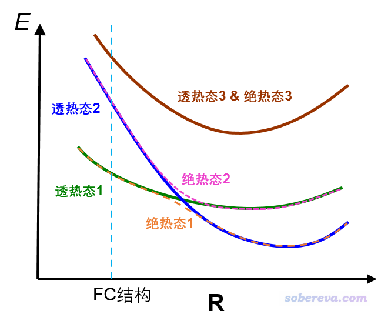

图中的态都是激发态，为了便于讨论假定都是单重态。FC结构指的是基态极小点结构。图中绿线和蓝线分别对应两个透热态势能面，可以认为每个透热态对应一种特定的电子激发模式，比如可以假设透热态1对应n->pi*激发，透热态2对应pi->pi*激发。当两个透热态能量相近时，由于态与态之间在一般会存在耦合（体现在相应的哈密顿矩阵非对角元不为0），两个透热态的波函数会混合产生出两个绝热态，对应不同绝热态势能面，在原本两个透热态相交的位置存在能量分裂。至于图上的棕色曲线，由于在图中的几何结构下与其它激发态势能面较远，因此既是透热态也是绝热态。

对于激发态优化过程中经历透热态交叉区域的情况，常用的S1、S2...这种称呼就具有含糊性了，必须得说清楚。如果你说的是透热态，那么按照能量由低到高编号的时候，得说清楚是对于什么结构而言的。比如上图中，在交叉点左边区域的S1（绿色曲线）到了交叉点右边就是第二激发态了，如果重新按照激发能排序，它就应该被称为S2了。而如果你讨论的是绝热态，按照绝热态能量由低到高来称呼S1、S2...，那就没有这个问题，比如图中的粉色虚线在各个位置下都是能量第二高的激发态。

## 2 牵扯势能面交叉时的激发态的几何优化

做激发态优化时，每一步都会算出一批激发态，那么怎么确定应当按照哪个激发态来优化？换句话说，应当在当前结构下对哪个激发态计算受力/Hessian来获得下一步的结构？不同程序有不同做法。Gaussian等一些程序的做法是根据组态系数，比较当前步算出来的各个激发态与上一步算出来的激发态的对应关系。比如上一步的时候感兴趣的态是能量第三低的态(i态)，因此上一步的时候受力/Hessian也是对这个态来算的，而在当前结构下，若发现能量第二低的态(j态)的波函数与上一步的i态最接近，那么上一步的i态就与这一步的j态产生了映射(map)关系，因此当前这一步感兴趣的态就是j态，计算接下来的位移所需的受力/Hessian也是对j态来算的。通过这种方法，Gaussian实现了所谓的state-tracking（态的跟踪）。

上面这种做法对于被优化的态不牵扯势能面交叉的情况完全稳妥（比如上图中棕线所示的第三激发态），但是当牵扯势能面交叉时，就有一些复杂情况了，见下图

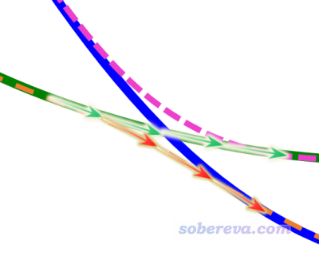

上图体现从FC结构出发，优化FC结构下的第一激发态的过程。在当前结构逐渐移动到透热态交叉点附近时，接下来既可能沿着绿色箭头的方向走，从而最终优化到一开始所处的透热态势能面极小点上；也可能按照红色箭头走，最终优化到第一绝热态势能面的极小点上。根据Gaussian的state-tracking思想，由于沿着透热态优化每一步波函数特征改变较小，因此一般是沿着透热态势能面优化的。但是，也有时候，由于判断算法的不可靠或者一些数值因素，最终也可能会被优化到第一绝热态极小点去。究竟会出现哪种情况，有很大的运气因素，比如把步长上限改一下，或者用不同基组/泛函，最终就可能会被优化到不同的极小点去。因此得理清思路，搞明白到底出现了什么情况。

我们知道，在Gaussian的TDDFT计算时，我们可以通过root=i指定优化第i激发态。更确切来说，被优化的是在初始结构下按照能量排序的第i透热态（当然，由于Gaussian的state-tracking算法的不足，因此实际优化的结果并不一定是如我们所愿的那样）。由于可能优化过程中经历势能面交叉区域，因此通过root=i关键词试图优化第i激发态的时候，显然不能让总共被算出来的激发态数（nstates）也恰好等于i，否则可能当这个态与更高激发态出现交叉时导致跟踪透热态失败。笔者建议nstates设i+2或稍微更多一些。而且，就算是为了保证算出来的激发态本身比较准确，nstates也不应该正好顶着感兴趣的态来设，这在《Gaussian中用TDDFT计算激发态和吸收、荧光、磷光光谱的方法》一文中已经提过了。

对于很多体系，激发态，尤其是高阶的激发态能级分布特别密集，即有大量激发态势能面彼此十分接近。这个时候，你若想要求Gaussian优化你一开始用root关键词选定的态并一直在其透热势能面上行进，那真正达到目的几率可能较低，因为如前所述，很可能中途因为走上了绝热态的路径（某种意义上，类似于发生了内转换），结果最终跑到不是你真正感兴趣的透热态极小点上。

还有一种情况，是一开始用root指定优化不同的激发态，发现最终优化出的结果都一样，也是因为势能面交叉，并且Gaussian的state-tracking算法有所不足导致没法保证跟踪透热态所致，如下图示例的，可能一开始用root=1和root=2做优化，最后发现都优化到了第一绝热态极小点了。

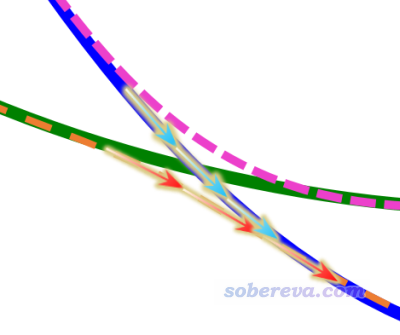

## 3 SDNTO算法

2019年初在JCC上出了一篇文章（DOI: 10.1002/jcc.25800），提出了一种新方法来实现state-tracking，是基于当前步与上一步产生的NTO来比较当前步算出的各个态与上一步的时候被跟踪的态的重叠程度，重叠程度最大者就是这一步应当被跟踪的态。如果你不懂NTO，参看《使用Multiwfn做自然跃迁轨道(NTO)分析》（<http://sobereva.com/377>）。重叠程度计算方式如下

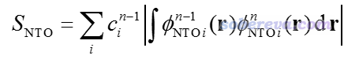

其中n是当前步，n-1是上一步，φ是NTO轨道波函数，c是NTO的本征值，只有大于人为设定的阈值的NTO才纳入上述加和。文中基于这种思想，结合很简单的最陡下降法，提出了所谓的Steepest Descent minimization using Natural Transition Orbitals (SDNTO)方法来试图确保在优化中能够跟踪透热态。实测发现，即便对于激发态能级很密集的配合物，这种算法也能成功跟踪一开始指定的透热态。下图是SDNTO文章中通过SDNTO算法优化cis-(Cl,Cl)[RuCl2(NO)(tpy)]+配合物的第9透热态的过程，横坐标是优化的步数，图中不同颜色表示每一步结构下的不同的绝热态激发能。可见对于这样势能面交叉复杂的情况，SDNTO方法也很好地跟踪了指定的透热态，而原文说Gaussian自己的算法对此体系是失败的。

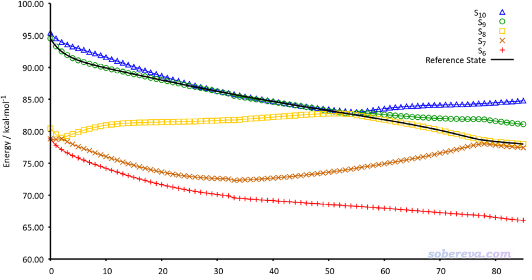

SDNTO这种算法目前没有公开的程序实现，作者自己的程序也是通过外挂Gaussian实现的，究竟SDNTO算法是否普适、效果好坏是否严重依赖于人为设定的参数，那还是未知数。顺带一提，如果你想计算两个结构中的各个轨道间的重叠积分的话，用Multiwfn就可以轻易实现，有专门的功能，看Multiwfn手册3.200.6节的例子。Multiwfn可以在<http://sobereva.com/multiwfn>免费下载。由于Multiwfn有这个功能，再加上Multiwfn可以直接产生记录了NTO轨道的fch文件，其实借助Multiwfn自己写一个基于Gaussian实现SDNTO优化的程序也并不复杂。不排除可能在以后的Gaussian中会直接支持SDNTO方法。

## 4 涉及激发态势能面交叉的Gaussian TDDFT优化一例：胞嘧啶

胞嘧啶(cytosine)这个体系在SDNTO文章中做了研究，文中提到在距离FC结构很近的地方就有S1和S2间的圆锥交叉。这里我们用Gaussian实际做一下TDDFT对S1和S2的优化，看看是什么情况（笔者算出来的结果和SDNTO文章所述的有所出入，下文根据实际算出来的情况说事）。计算涉及的输入输出文件都可以在这里下载：<http://sobereva.com/attach/468/file.rar>。初始结构是PBE0/6-31G*优化的基态结构，为稳妥起见激发态计算都是设nstates=5。为了与SDNTO文章一致，激发态计算用的是PBE0/6-31+G*。

Gaussian的TDDFT优化的每一步都会输出当前结构下所有激发态信息，输出文件里会看到“Excited State   1:"、“Excited State   2:"等等。此处Excited State x相当于在当前结构下，被Gaussian判断为与初始结构下第x态相映射的态（即对应同一个透热态）。当然，Gaussian判断得是否合理那不一定。

### 4.1 默认步长下优化S1

我们先来优化S1，这里用默认步长，输入文件是文件包里的S1_defstep.gjf。当前我们设的是root=1，因此，每一步中被Gaussian标记成"Excited State   1"的态就是被优化的态，每一步的受力/Hessian都是对当前被标记成"Excited State   1"态来计算的。

把.out文件中所有含有"Excited State   1"和"Excited State   2"的行里面的激发能提取出来，绘制成激发能随优化步数的变化，得到的图如下所示。为了把细节看得清楚，图中只展现了前12步

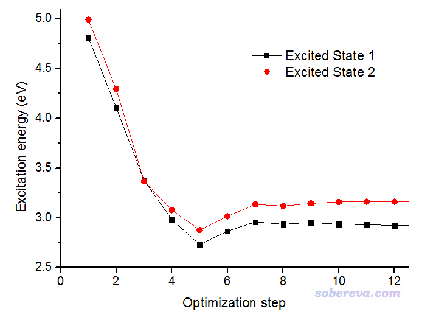

由图可见，在第3步的时候两个激发态能量几乎相同，明显出现了交叉。当前优化过程在经过交叉点时并没有理应地在透热态势能面上进行，而是最终走了绝热态的势能面，也即对应"Excited State   1"的黑色曲线在交叉点右侧都是能量最低的，这可以算是体现了Gaussian的state-tracking算法的失败。

由于当前没有一直在最开始的S1透热态上走，而是中途切换到了S2的透热态去，因此，优化第一步的"Excited State   1"的电子激发特征和最终结构的"Excited State   1"的电子激发特征必然不相符。为了更好地说明这一点，我们下面通过轨道考察一下电子激发特征。

FC结构下S0->S1的跃迁几乎完全对应HOMO->LUMO跃迁，两个轨道图形如下，可见是pi->pi*跃迁。

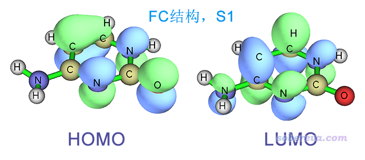

FC结构下S0->S2的跃迁缺乏主导的MO跃迁，因此使用Multiwfn转化为NTO跃迁的方式描述，可几乎完美地表示为NTO29->NTO30，由下图可见是n->pi*跃迁，而且孤对电子同时明显来自N和O。

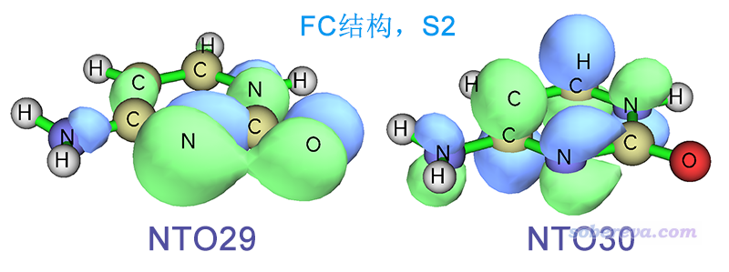

下图是在我们刚才做S1优化得到的结构下"Excited State   1"的跃迁方式，可以用NTO29->NTO30完美描述，可见明显是n->pi*跃迁。

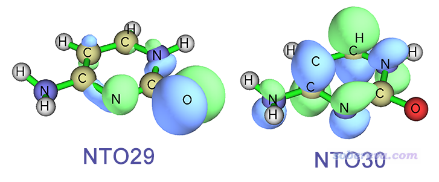

一对照就看出，我们所优化的出态，也就是被Gaussian标记为"Excited State   1"的态，其实对应的是FC结构下的S2透热态，优化过程并没有从始至终一直在S1透热态上走。

### 4.2 在较小步长上限下优化S1

我们再来看看如果把步长上限设得很小，即使用opt(maxstep=3,notrust)，从FC结构出发优化S1态是什么情况。输入文件是文件包里的S1_step3.gjf

还是把输出文件中含有"Excited State   1"和"Excited State   2"的行里面的激发能都提取出来并绘制，得到的图如下所示。

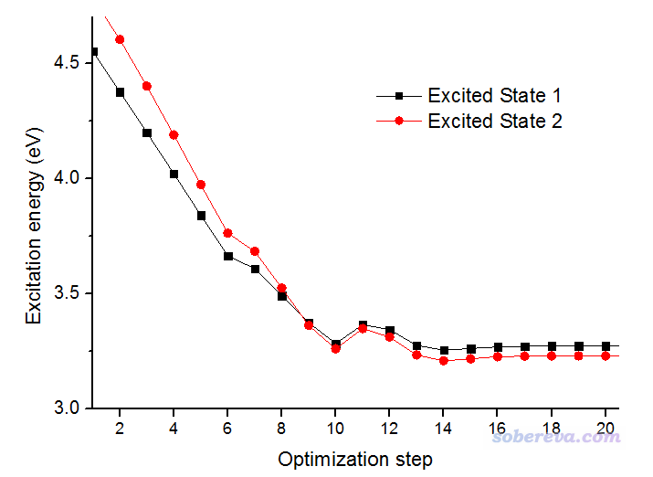

从图上可以看出这回确实是走了透热态的路径，优化经过第9步结构附近的交叉点后，对应"Excited State   1"的黑色曲线就不再是能量最低的态了。这张图里的交叉点位置和上一张图里的交叉点位置基本相同，都是3.37eV的地方。

下面是优化过程第一步输出的信息  
 Excited State   1:      Singlet-A      4.8092 eV  257.81 nm  f=0.0488  <S**2>=0.000  
       29 -> 30         0.69464  
  This state for optimization and/or second-order correction.  
  Total Energy, E(TD-HF/TD-DFT) =  -394.332374034      
  Copying the excited state density for this state as the 1-particle RhoCI density.  
    
  Excited State   2:      Singlet-A      4.9900 eV  248.47 nm  f=0.0019  <S**2>=0.000  
       26 -> 30        -0.32031  
       27 -> 30        -0.20046  
       28 -> 30         0.59079  
    
  Excited State   3:      Singlet-A      5.3909 eV  229.99 nm  f=0.0006  <S**2>=0.000  
       26 -> 30         0.61783  
       27 -> 30        -0.15704  
       28 -> 30         0.28651

...略

下面是优化过程最后一步输出的信息  
 Excited State   1:      Singlet-A      3.2680 eV  379.39 nm  f=0.0122  <S**2>=0.000  
       29 -> 30        -0.70445  
  This state for optimization and/or second-order correction.  
  Total Energy, E(TD-HF/TD-DFT) =  -394.357141147      
  Copying the excited state density for this state as the 1-particle RhoCI density.  
    
  Excited State   2:      Singlet-A      3.2250 eV  384.45 nm  f=0.0000  <S**2>=0.000  
       28 -> 30         0.70662  
    
  Excited State   3:      Singlet-A      4.5729 eV  271.13 nm  f=0.0024  <S**2>=0.000  
       26 -> 30        -0.69564  
       27 -> 30        -0.10455  
...略  
由于"This state for optimization and/or second-order correction"是对"Excited State   1"标注的，因此程序是对"Excited State   1"来计算受力/Hessian从而优化结构的（当然这是必然的，因为我们设的就是root=1）。

由以上信息可见，程序输出的时候总是按照Excited State 1,2,3,4...这样的次序输出的，但由于中途经历了势能面交叉，而且这次又成功地跟踪了S1透热态，因此到最后的结构下，被优化的对象"Excited State   1"的激发能已经变得高于"Excited State   2"了。另外，如组态系数体现的，"Excited State   1"是MO29->MO30跃迁，即HOMO->LUMO跃迁，如果你看一下这个结构下的这俩轨道的话，会发现这俩轨道都是pi轨道，这点也和FC结构下S1是pi-pi*跃迁完全对应。

在实际中，并非碰上没有顺利跟踪透热态的时候用小步长上限就总能解决问题，有的时候由于巧合，可能小步长上限的时候在交叉点附近误走上了绝热态，而用默认步长上限时反倒正确跟踪了透热态。

上一节我们原本想优化到S1透热态极小点，却“误”被优化到了第一绝热态极小点上，实际上也可以尝试补救，也就是在这个第一绝热态极小点上用TD(root=2)去优化在当前结构下应当是第2激发态的S1透热态。这个任务的输出文件是文件包里的S1_reopt.out，可以看到重新优化后，确实得到了S1透热态极小点，结构与本节我们得到的完全相同。

### 4.3 对S2的优化

再来看看对胞嘧啶的S2优化的情况。我们以FC结构作为起点，使用opt(maxstep=3,notrust) TD(nstates=5,root=2)关键词来做，计算级别同前。输入文件是文件包里的S2_step3.gjf。

还是将优化过程的"Excited State   1"和"Excited State   2"的激发能随优化步数的变化作图，如下所示

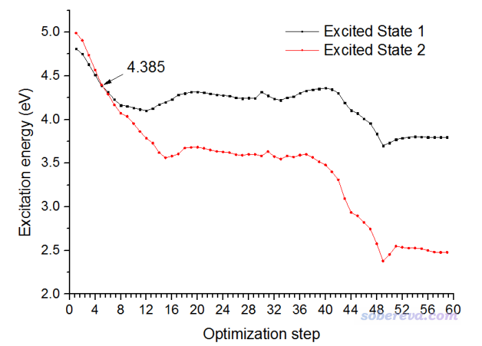

可见这次优化也经历了交叉点，是沿着S2透热态走的，因此红线在一开始是能量第二低的态，到了交叉点右侧就变成了能量最低的态了。但是，这次经历的交叉点和上一节的是不同，这次交叉点的位置是大约4.385 eV的位置，而之前经历的都是3.37eV的位置。为何会有区别？实际上S1和S2透热态之间的交叉实际上是个交叉缝（在一个高维空间内处处能量相同），有无数多个相交的位置，由于上一节的优化一开始是按照S1透热态的受力/Hessian移动的结构，而这一节是按照S2透热态的受力/Hessian进行的移动，因此经历了交叉缝的不同位置。

上一节两个任务优化出的结构，以及这一节优化出的最终结构（都无虚频）是各不相同的，结构如下

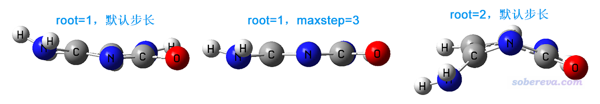

可见当前我们直接优化S2得到的最终结构相当扭曲，在这个结构下，这个态可以用NTO29->NTO30完美描述，这俩轨道如下所示

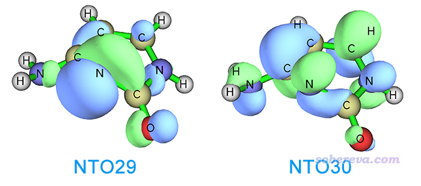

可见这个跃迁是n->pi*跃迁，如前所述这也正是FC结构下S2态的跃迁方式，进一步表明我们这一节的优化从始至终是在S2透热势能面上进行的。

由于S1和S2的交叉缝是高维的，因此从FC结构开始，沿着S1透热态的受力/Hessian行进，以及按照S2透热态的受力/Hessian行进，我们经历了不同的交叉点位置。而且又由于此体系S2透热态上有不同的极小点，因此本节一直沿着S2透热态走（称为a过程），以及上一节起初沿着S1透热态走但是中途因算法问题在交叉点处切换到了S2透热态（称为b过程），最终得到的两个S2透热态极小点结构是不同的。根据之前给出的NTO图，可以知道FC结构下的S2对应的n->pi*跃迁中孤对电子同时明显来自于O和N，而a过程最终优化出的是n(N)->pi*态的极小点，b过程则优化出的是n(O)->pi*态的极小点。

另外，如果本节在优化S2时用默认步长上限，我们会发现优化出的结构和用maxstep=3的时候略有不同（输出文件是文件包里的S2_defstep.out），不过差异非常小，对应于由于NH2朝向的不同所造成的两个特征很接近的n(N)->pi*跃迁的极小点。之所以步长上限的不同导致了优化出了这两个不同结构，必定是S2透热态势能面存在分叉，步长上限不同时由于巧合而恰好走了不同路径。有兴趣的读者可以在gview里打开S2_step3.out和S2_defstep.out仔细对比一下优化过程。

## 5 总结

激发态的优化比基态的优化复杂很多。由于激发态能级分布密集，优化过程经常经过势能面交叉区域，而且既有可能走透热路径也有可能走绝热路径，再加上激发态势能面又可能分叉、联通不同极小点，因此不光是计算级别会影响最终得到的结果，就连一些细碎的数值方面的设定诸如步长上限的差异都可能导致最终优化到不同结构上去，因此头脑里必须有清楚的势能面的概念、有对势能面交叉问题的正确理解。如果能把本文的胞嘧啶这个简单例子里的讨论、分析方法都彻底弄明白，对其它更复杂的体系优化激发态时若遇到一些令人困惑的结果，也应该不难搞清楚到底是怎么回事了。
